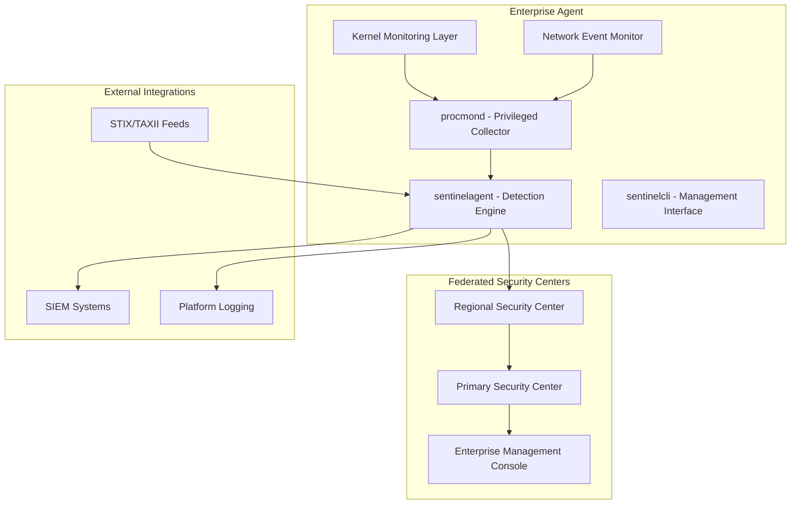

# Enterprise Tier Features Design Document

## Overview

This design document outlines the architecture and implementation approach for SentinelD Enterprise tier features, which transform the system from a polling-based process monitor into a comprehensive real-time security platform with kernel-level visibility, federated fleet management, and enterprise-grade security features.

The Enterprise tier maintains SentinelD's core security principles while adding advanced capabilities required for large-scale deployments, compliance environments, and sophisticated threat detection scenarios.

## Architecture

### High-Level Architecture



### Component Enhancements

#### 1. Kernel Monitoring Layer

**Linux eBPF Integration:**

- eBPF programs attached to kernel tracepoints for process lifecycle events
- Real-time syscall monitoring (execve, fork, clone, ptrace, mmap)
- Network socket tracking with process correlation
- Container-aware monitoring with cgroup integration

**Windows ETW Integration:**

- ETW consumer for kernel process events (Microsoft-Windows-Kernel-Process)
- Registry monitoring via Microsoft-Windows-Kernel-Registry
- File system events through Microsoft-Windows-Kernel-File
- Network correlation using Microsoft-Windows-Kernel-Network

**macOS EndpointSecurity Integration:**

- ES_EVENT_TYPE_NOTIFY_EXEC for process execution
- ES_EVENT_TYPE_NOTIFY_FORK for process creation
- ES_EVENT_TYPE_NOTIFY_FILE_* for file system monitoring
- ES_EVENT_TYPE_NOTIFY_NETWORK_* for network activity

#### 2. Federated Security Center Architecture

**Three-Tier Hierarchy:**

1. **Agents**: Individual endpoint monitoring with local buffering
2. **Regional Security Centers**: Geographic/network segment aggregation
3. **Primary Security Center**: Enterprise-wide visibility and management

**Communication Protocol:**

- Mutual TLS authentication with certificate chain validation
- Protocol Buffers for efficient data serialization
- Automatic failover and load balancing
- Compression and deduplication for bandwidth optimization

## Components and Interfaces

### Enhanced procmond Component

```rust
// Kernel monitoring abstraction
pub trait KernelMonitor: Send + Sync {
    async fn start_monitoring(&self) -> Result<(), MonitorError>;
    async fn subscribe_events(&self) -> Result<EventStream, MonitorError>;
    fn get_capabilities(&self) -> MonitorCapabilities;
}

// Platform-specific implementations
pub struct EbpfMonitor {
    programs: Vec<BpfProgram>,
    ring_buffer: RingBuffer,
    capabilities: MonitorCapabilities,
}

pub struct EtwMonitor {
    session: EtwSession,
    providers: Vec<EtwProvider>,
    capabilities: MonitorCapabilities,
}

pub struct EndpointSecurityMonitor {
    client: ESClient,
    event_types: Vec<ESEventType>,
    capabilities: MonitorCapabilities,
}
```

### Network Event Integration

```rust
pub struct NetworkEventMonitor {
    platform_monitor: Box<dyn NetworkMonitor>,
    process_correlator: ProcessCorrelator,
    event_buffer: BoundedChannel<NetworkEvent>,
}

pub trait NetworkMonitor: Send + Sync {
    async fn monitor_connections(&self) -> Result<NetworkEventStream, NetworkError>;
    fn get_supported_protocols(&self) -> Vec<Protocol>;
}

#[derive(Debug, Clone)]
pub struct NetworkEvent {
    pub process_id: u32,
    pub connection_id: u64,
    pub local_addr: SocketAddr,
    pub remote_addr: SocketAddr,
    pub protocol: Protocol,
    pub direction: ConnectionDirection,
    pub timestamp: SystemTime,
    pub bytes_transferred: u64,
}
```

### Security Center Federation

```rust
pub struct SecurityCenter {
    tier: SecurityCenterTier,
    agents: AgentManager,
    upstream: Option<UpstreamConnection>,
    storage: FederatedStorage,
    query_engine: DistributedQueryEngine,
}

pub enum SecurityCenterTier {
    Regional {
        coverage_area: GeographicRegion,
        max_agents: usize,
    },
    Primary {
        regional_centers: Vec<RegionalCenterInfo>,
    },
}

pub struct DistributedQueryEngine {
    local_engine: SqlEngine,
    federation_client: FederationClient,
    result_aggregator: ResultAggregator,
}
```

## Data Models

### Enhanced Event Schema

```rust
#[derive(Debug, Clone, Serialize, Deserialize)]
pub struct EnterpriseEvent {
    // Core event data
    pub event_id: Uuid,
    pub timestamp: SystemTime,
    pub event_type: EventType,
    pub source: EventSource,

    // Process information
    pub process: ProcessInfo,
    pub parent_process: Option<ProcessInfo>,

    // Kernel-level context
    pub kernel_context: Option<KernelContext>,

    // Network correlation
    pub network_context: Option<NetworkContext>,

    // Platform-specific data
    pub platform_data: PlatformSpecificData,

    // Security metadata
    pub security_context: SecurityContext,
}

#[derive(Debug, Clone, Serialize, Deserialize)]
pub struct KernelContext {
    pub syscall_info: Option<SyscallInfo>,
    pub memory_info: Option<MemoryInfo>,
    pub file_operations: Vec<FileOperation>,
    pub capabilities: Vec<String>,
}

#[derive(Debug, Clone, Serialize, Deserialize)]
pub struct NetworkContext {
    pub connections: Vec<NetworkConnection>,
    pub dns_queries: Vec<DnsQuery>,
    pub traffic_summary: TrafficSummary,
}
```

### STIX/TAXII Integration Schema

```rust
#[derive(Debug, Clone, Serialize, Deserialize)]
pub struct StixIndicator {
    pub id: String,
    pub pattern: String,
    pub indicator_type: IndicatorType,
    pub labels: Vec<String>,
    pub confidence: u8,
    pub valid_from: SystemTime,
    pub valid_until: Option<SystemTime>,
}

pub struct TaxiiClient {
    base_url: Url,
    credentials: TaxiiCredentials,
    collections: Vec<TaxiiCollection>,
    poll_interval: Duration,
}

impl TaxiiClient {
    pub async fn poll_indicators(&self) -> Result<Vec<StixIndicator>, TaxiiError> {
        // Implementation for polling TAXII feeds
    }

    pub async fn convert_to_detection_rules(&self, indicators: Vec<StixIndicator>) -> Result<Vec<DetectionRule>, ConversionError> {
        // Convert STIX indicators to SentinelD detection rules
    }
}
```

## Error Handling

### Kernel Monitoring Error Recovery

```rust
#[derive(Debug, thiserror::Error)]
pub enum KernelMonitorError {
    #[error("Insufficient privileges for kernel monitoring: {0}")]
    InsufficientPrivileges(String),

    #[error("Kernel monitoring not supported on this platform: {0}")]
    UnsupportedPlatform(String),

    #[error("eBPF program load failed: {0}")]
    EbpfLoadError(String),

    #[error("ETW session creation failed: {0}")]
    EtwSessionError(String),

    #[error("EndpointSecurity client initialization failed: {0}")]
    EndpointSecurityError(String),
}

pub struct GracefulDegradation {
    available_monitors: Vec<MonitorType>,
    fallback_strategy: FallbackStrategy,
    degradation_alerts: AlertChannel,
}

impl GracefulDegradation {
    pub async fn handle_monitor_failure(&self, failed_monitor: MonitorType) -> Result<(), DegradationError> {
        // Log the failure
        tracing::warn!("Kernel monitor failed: {:?}, falling back to userspace monitoring", failed_monitor);

        // Switch to fallback monitoring
        self.activate_fallback(failed_monitor).await?;

        // Alert administrators
        self.send_degradation_alert(failed_monitor).await?;

        Ok(())
    }
}
```

### Federation Error Handling

```rust
#[derive(Debug, thiserror::Error)]
pub enum FederationError {
    #[error("Regional Security Center unreachable: {0}")]
    RegionalCenterUnreachable(String),

    #[error("Certificate validation failed: {0}")]
    CertificateValidationFailed(String),

    #[error("Query distribution timeout: {0}")]
    QueryDistributionTimeout(Duration),
}

pub struct FederationResilience {
    failover_targets: Vec<SecurityCenterEndpoint>,
    circuit_breaker: CircuitBreaker,
    retry_policy: RetryPolicy,
}
```

## Testing Strategy

### Kernel Monitoring Testing

```rust
#[cfg(test)]
mod kernel_monitor_tests {
    use super::*;

    #[tokio::test]
    async fn test_ebpf_process_monitoring() {
        let monitor = EbpfMonitor::new().await.unwrap();
        let mut event_stream = monitor.subscribe_events().await.unwrap();

        // Spawn a test process
        let child = Command::new("sleep").arg("1").spawn().unwrap();

        // Verify we receive the process creation event
        let event = timeout(Duration::from_secs(5), event_stream.next()).await.unwrap().unwrap();
        assert_eq!(event.process.pid, child.id());
        assert_eq!(event.event_type, EventType::ProcessCreated);
    }

    #[tokio::test]
    async fn test_graceful_degradation() {
        let degradation = GracefulDegradation::new();

        // Simulate kernel monitoring failure
        degradation.handle_monitor_failure(MonitorType::Ebpf).await.unwrap();

        // Verify fallback to userspace monitoring
        assert!(degradation.is_fallback_active(MonitorType::Ebpf));
    }
}
```

### Federation Testing

```rust
#[cfg(test)]
mod federation_tests {
    use super::*;

    #[tokio::test]
    async fn test_hierarchical_query_distribution() {
        let primary_center = SecurityCenter::new(SecurityCenterTier::Primary {
            regional_centers: vec![test_regional_center()]
        }).await.unwrap();

        let query = "SELECT * FROM process_events WHERE process_name = 'malware.exe'";
        let results = primary_center.execute_distributed_query(query).await.unwrap();

        assert!(!results.is_empty());
        assert!(results.iter().any(|r| r.source_tier == "regional"));
    }
}
```

### STIX/TAXII Integration Testing

```rust
#[cfg(test)]
mod stix_taxii_tests {
    use super::*;

    #[tokio::test]
    async fn test_stix_indicator_conversion() {
        let stix_indicator = StixIndicator {
            id: "indicator--test-123".to_string(),
            pattern: "[process:name = 'malware.exe']".to_string(),
            indicator_type: IndicatorType::MaliciousActivity,
            labels: vec!["malware".to_string()],
            confidence: 85,
            valid_from: SystemTime::now(),
            valid_until: None,
        };

        let detection_rule = convert_stix_to_rule(stix_indicator).await.unwrap();
        assert_eq!(detection_rule.name, "STIX Indicator: malware.exe");
        assert!(detection_rule.sql_query.contains("process_name = 'malware.exe'"));
    }
}
```

## Platform-Specific Implementation Details

### Linux eBPF Implementation

**Crate Dependencies:**

- `aya` (0.12+): Pure Rust eBPF library - preferred over libbpf-rs for easier deployment, no C toolchain requirement, faster builds, and better Rust ergonomics
- `aya-log` (0.2+): eBPF logging support for debugging
- `tokio` (1.39+): Async runtime for event processing
- `tokio-stream` (0.1+): Stream utilities for event handling
- `tracing` (0.1+): Structured logging

**Linux eBPF Support Tiers:**

- **Full eBPF Support**: Kernel 5.4+ (ring buffers, all program types, BTF support)
- **Standard eBPF Support**: Kernel 4.7+ (tracepoints, basic program types)
- **Limited eBPF Support**: RHEL/CentOS 7.6+ kernel 3.10 (backported tracepoints only)
- **Legacy Support**: Older kernels (graceful degradation to userspace monitoring)

**Distribution-Specific Notes:**

- **Ubuntu**: 16.04+ (kernel 4.4+), full support on 18.04+ (kernel 4.15+)
- **RHEL/CentOS**: 7.6+ (kernel 3.10 with backports), full support on 8+ (kernel 4.18+)
- **Debian**: 9+ (kernel 4.9+), full support on 10+ (kernel 4.19+)
- **SLES**: 12 SP3+ (kernel 4.4+), full support on 15+ (kernel 4.12+)

```rust
use aya::{
    include_bytes_aligned,
    maps::{RingBuf, MapData},
    programs::{KProbe, TracePoint},
    Bpf, BpfLoader,
};
use aya_log::BpfLogger;
use tokio::sync::mpsc;
use tokio_stream::wrappers::UnboundedReceiverStream;
use tracing::{info, warn, error};
use std::sync::{Arc, atomic::{AtomicU64, AtomicU32, Ordering}};

pub struct EbpfMonitor {
    // eBPF program management using aya
    bpf: Bpf,
    ring_buf: RingBuf<MapData>,

    // Event channels
    event_tx: mpsc::UnboundedSender<KernelEvent>,
    event_rx: Option<mpsc::UnboundedReceiver<KernelEvent>>,

    // Program handles
    process_tracepoint: Option<TracePoint>,
    network_kprobe: Option<KProbe>,

    // Configuration and metrics
    config: EbpfConfig,
    metrics: Arc<EbpfMetrics>,
}

#[derive(Debug, Clone)]
pub struct EbpfConfig {
    pub enable_process_monitoring: bool,
    pub enable_network_monitoring: bool,
    pub enable_file_monitoring: bool,
    pub syscall_filter: HashSet<u32>,
    pub ring_buffer_size: usize,
}

impl EbpfMonitor {
    pub async fn new(config: EbpfConfig) -> Result<Self, EbpfError> {
        let (event_tx, event_rx) = mpsc::unbounded_channel();

        // Load eBPF programs using aya with configuration
        let mut bpf = BpfLoader::new()
            .set_global("CONFIG_ENABLE_PROCESS_MON", &(config.enable_process_monitoring as u32), true)
            .set_global("CONFIG_ENABLE_NETWORK_MON", &(config.enable_network_monitoring as u32), true)
            .load(include_bytes_aligned!(
                "../../target/bpf/sentinel_monitor"
            ))?;

        // Initialize BPF logger for debugging
        if cfg!(debug_assertions) {
            BpfLogger::init(&mut bpf)?;
        }

        // Get ring buffer for event communication
        let ring_buf = RingBuf::try_from(bpf.take_map("EVENTS").unwrap())?;

        Ok(Self {
            bpf,
            ring_buf,
            event_tx,
            event_rx: Some(event_rx),
            process_tracepoint: None,
            network_kprobe: None,
            config,
            metrics: Arc::new(EbpfMetrics::default()),
        })
    }

    pub async fn start_monitoring(&mut self) -> Result<(), EbpfError> {
        info!("Starting eBPF monitoring with config: {:?}", self.config);

        // Attach process monitoring tracepoint
        if self.config.enable_process_monitoring {
            let program: &mut TracePoint = self.bpf.program_mut("trace_execve").unwrap().try_into()?;
            program.load()?;
            program.attach("syscalls", "sys_enter_execve")?;
            info!("Attached process monitoring tracepoint");
        }

        // Attach network monitoring kprobe
        if self.config.enable_network_monitoring {
            let program: &mut KProbe = self.bpf.program_mut("trace_tcp_connect").unwrap().try_into()?;
            program.load()?;
            program.attach("tcp_connect", 0)?;
            info!("Attached network monitoring kprobe");
        }

        // Start event processing task
        self.spawn_event_processor().await;
        Ok(())
    }

    async fn spawn_event_processor(&mut self) {
        let mut ring_buf = self.ring_buf.clone();
        let event_tx = self.event_tx.clone();
        let metrics = Arc::clone(&self.metrics);

        tokio::spawn(async move {
            loop {
                match ring_buf.next() {
                    Some(item) => {
                        match Self::parse_kernel_event(&item) {
                            Ok(event) => {
                                metrics.events_processed.fetch_add(1, Ordering::Relaxed);
                                if let Err(_) = event_tx.send(event) {
                                    error!("Event channel closed, stopping eBPF processor");
                                    break;
                                }
                            }
                            Err(e) => {
                                warn!("Failed to parse kernel event: {}", e);
                                metrics.parse_errors.fetch_add(1, Ordering::Relaxed);
                            }
                        }
                    }
                    None => {
                        tokio::task::yield_now().await;
                    }
                }
            }
        });
    }
}

#[derive(Debug, Default)]
pub struct EbpfMetrics {
    pub events_processed: AtomicU64,
    pub parse_errors: AtomicU64,
    pub programs_loaded: AtomicU32,
    pub ring_buffer_drops: AtomicU64,
}

impl KernelMonitor for EbpfMonitor {
    async fn start_monitoring(&self) -> Result<(), MonitorError> {
        // Implementation delegated to start_monitoring method
        Ok(())
    }

    async fn subscribe_events(&self) -> Result<EventStream, MonitorError> {
        let rx = self.event_rx.take().ok_or(MonitorError::AlreadySubscribed)?;
        Ok(Box::pin(UnboundedReceiverStream::new(rx)))
    }

    fn get_capabilities(&self) -> MonitorCapabilities {
        MonitorCapabilities {
            real_time_events: true,
            syscall_monitoring: self.config.enable_process_monitoring,
            network_monitoring: self.config.enable_network_monitoring,
            file_monitoring: self.config.enable_file_monitoring,
            container_awareness: true,
            performance_overhead: PerformanceLevel::Low,
        }
    }
}
```

### Windows ETW Implementation

**Crate Dependencies:**

- `windows` (0.58+): Official Microsoft Windows API bindings - actively maintained and comprehensive
- `tokio` (1.39+): Async runtime for event processing
- `tracing` (0.1+): Structured logging
- `tracing-etw` (0.2+): Optional ETW integration for tracing events
- `serde` (1.0+): Serialization for event data

**Platform Support Notes:**

- **Full ETW Support**: Windows 7+, Windows Server 2012+ (SystemTraceProvider with kernel events)
- **Limited ETW Support**: Windows Server 2008 R2 (basic ETW, limited kernel providers)
- **Legacy Support**: Windows Vista/Server 2008 (basic ETW only, graceful degradation to userspace monitoring)

```rust
use windows::{
    core::*,
    Win32::System::Diagnostics::Etw::*,
    Win32::Foundation::*,
};
use tokio::sync::mpsc;
use tracing::{info, warn, error};
use std::sync::Arc;

pub struct EtwMonitor {
    // ETW session management
    session_handle: TRACEHANDLE,
    session_properties: Box<EVENT_TRACE_PROPERTIES>,

    // Event processing
    event_tx: mpsc::UnboundedSender<KernelEvent>,
    event_rx: Option<mpsc::UnboundedReceiver<KernelEvent>>,

    // Provider configuration
    providers: Vec<EtwProvider>,
    config: EtwConfig,
    metrics: Arc<EtwMetrics>,
}

#[derive(Debug, Clone)]
pub struct EtwConfig {
    pub session_name: String,
    pub enable_process_events: bool,
    pub enable_network_events: bool,
    pub enable_registry_events: bool,
    pub buffer_size: u32,
    pub max_buffers: u32,
}

#[derive(Debug)]
pub struct EtwProvider {
    pub guid: GUID,
    pub name: String,
    pub level: u8,
    pub match_any_keyword: u64,
}

impl EtwMonitor {
    pub async fn new(config: EtwConfig) -> Result<Self, EtwError> {
        let (event_tx, event_rx) = mpsc::unbounded_channel();

        // Initialize ETW session properties
        let mut session_properties = Box::new(EVENT_TRACE_PROPERTIES {
            Wnode: WNODE_HEADER {
                BufferSize: std::mem::size_of::<EVENT_TRACE_PROPERTIES>() as u32 +
                           (config.session_name.len() + 1) as u32 * 2,
                Flags: WNODE_FLAG_TRACED_GUID,
                ..Default::default()
            },
            BufferSize: config.buffer_size,
            MinimumBuffers: 2,
            MaximumBuffers: config.max_buffers,
            MaximumFileSize: 0,
            LogFileMode: EVENT_TRACE_REAL_TIME_MODE,
            FlushTimer: 1,
            ..Default::default()
        });

        // Define providers based on configuration
        let mut providers = Vec::new();

        if config.enable_process_events {
            providers.push(EtwProvider {
                guid: GUID::from("22FB2CD6-0E7B-422B-A0C7-2FAD1FD0E716"), // Microsoft-Windows-Kernel-Process
                name: "Microsoft-Windows-Kernel-Process".to_string(),
                level: 5, // TRACE_LEVEL_VERBOSE
                match_any_keyword: 0xFFFFFFFFFFFFFFFF,
            });
        }

        if config.enable_network_events {
            providers.push(EtwProvider {
                guid: GUID::from("7DD42A49-5329-4832-8DFD-43D979153A88"), // Microsoft-Windows-Kernel-Network
                name: "Microsoft-Windows-Kernel-Network".to_string(),
                level: 5,
                match_any_keyword: 0xFFFFFFFFFFFFFFFF,
            });
        }

        Ok(Self {
            session_handle: TRACEHANDLE::default(),
            session_properties,
            event_tx,
            event_rx: Some(event_rx),
            providers,
            config,
            metrics: Arc::new(EtwMetrics::default()),
        })
    }

    pub async fn start_monitoring(&mut self) -> Result<(), EtwError> {
        info!("Starting ETW monitoring session: {}", self.config.session_name);

        // Start ETW trace session
        unsafe {
            let session_name = HSTRING::from(&self.config.session_name);
            let result = StartTraceW(
                &mut self.session_handle,
                &session_name,
                self.session_properties.as_mut(),
            );

            if result != ERROR_SUCCESS.0 {
                return Err(EtwError::SessionStartFailed(result));
            }
        }

        // Enable providers
        for provider in &self.providers {
            self.enable_provider(provider).await?;
        }

        // Start event processing
        self.spawn_event_processor().await;

        Ok(())
    }

    async fn enable_provider(&self, provider: &EtwProvider) -> Result<(), EtwError> {
        unsafe {
            let result = EnableTraceEx2(
                self.session_handle,
                &provider.guid,
                EVENT_CONTROL_CODE_ENABLE_PROVIDER,
                provider.level,
                provider.match_any_keyword,
                0, // MatchAllKeyword
                0, // Timeout
                None, // EnableParameters
            );

            if result != ERROR_SUCCESS.0 {
                return Err(EtwError::ProviderEnableFailed(provider.name.clone(), result));
            }
        }

        info!("Enabled ETW provider: {}", provider.name);
        Ok(())
    }

    async fn spawn_event_processor(&mut self) {
        let event_tx = self.event_tx.clone();
        let metrics = Arc::clone(&self.metrics);
        let session_handle = self.session_handle;

        tokio::task::spawn_blocking(move || {
            // ETW event processing callback
            unsafe extern "system" fn event_record_callback(event_record: *mut EVENT_RECORD) {
                // Process ETW event record
                // This would parse the event data and convert to KernelEvent
            }

            // Set up ETW event processing
            let mut logfile = EVENT_TRACE_LOGFILEW {
                LoggerName: PWSTR::null(),
                ProcessTraceMode: PROCESS_TRACE_MODE_REAL_TIME | PROCESS_TRACE_MODE_EVENT_RECORD,
                EventRecordCallback: Some(event_record_callback),
                ..Default::default()
            };

            // Process trace events
            unsafe {
                let trace_handle = OpenTraceW(&mut logfile);
                if trace_handle != INVALID_PROCESSTRACE_HANDLE {
                    ProcessTrace(&[trace_handle], None, None);
                    CloseTrace(trace_handle);
                }
            }
        });
    }
}

#[derive(Debug, Default)]
pub struct EtwMetrics {
    pub events_processed: AtomicU64,
    pub providers_enabled: AtomicU32,
    pub session_errors: AtomicU64,
}
```

### macOS EndpointSecurity Implementation

**Crate Dependencies:**

- `endpoint-sec` (0.3+): Safe Rust bindings for EndpointSecurity framework - preferred over manual FFI
- `core-foundation` (0.10+): Core Foundation bindings for system integration
- `mach2` (0.4+): Mach kernel interfaces for low-level system access
- `tokio` (1.39+): Async runtime for event processing
- Alternative: `endpointsecurity` (0.1+): Community bindings if endpoint-sec is insufficient

```rust
use endpoint_sec::{Client, Message, EventType};
use core_foundation::{
    base::{CFTypeRef, TCFType},
    string::{CFString, CFStringRef},
};
use tokio::sync::mpsc;
use tracing::{info, warn, error};
use std::sync::Arc;

// EndpointSecurity framework bindings (would be in a separate module)
#[repr(C)]
pub struct es_client_t {
    _private: [u8; 0],
}

#[repr(C)]
pub struct es_message_t {
    pub version: u32,
    pub time: timespec,
    pub mach_time: u64,
    pub deadline: u64,
    pub process: *const es_process_t,
    pub seq_num: u64,
    pub action: es_action_type_t,
    pub event_type: es_event_type_t,
    // ... additional fields
}

pub struct EndpointSecurityMonitor {
    // ES client handle
    client: *mut es_client_t,

    // Event processing
    event_tx: mpsc::UnboundedSender<KernelEvent>,
    event_rx: Option<mpsc::UnboundedReceiver<KernelEvent>>,

    // Configuration
    config: ESConfig,
    event_types: Vec<es_event_type_t>,
    metrics: Arc<ESMetrics>,
}

#[derive(Debug, Clone)]
pub struct ESConfig {
    pub enable_process_events: bool,
    pub enable_file_events: bool,
    pub enable_network_events: bool,
    pub cache_size: usize,
}

impl EndpointSecurityMonitor {
    pub async fn new(config: ESConfig) -> Result<Self, ESError> {
        let (event_tx, event_rx) = mpsc::unbounded_channel();

        // Determine event types to subscribe to
        let mut event_types = Vec::new();

        if config.enable_process_events {
            event_types.extend_from_slice(&[
                ES_EVENT_TYPE_NOTIFY_EXEC,
                ES_EVENT_TYPE_NOTIFY_FORK,
                ES_EVENT_TYPE_NOTIFY_EXIT,
            ]);
        }

        if config.enable_file_events {
            event_types.extend_from_slice(&[
                ES_EVENT_TYPE_NOTIFY_OPEN,
                ES_EVENT_TYPE_NOTIFY_CLOSE,
                ES_EVENT_TYPE_NOTIFY_CREATE,
                ES_EVENT_TYPE_NOTIFY_UNLINK,
            ]);
        }

        if config.enable_network_events {
            event_types.extend_from_slice(&[
                ES_EVENT_TYPE_NOTIFY_SOCKET,
                ES_EVENT_TYPE_NOTIFY_BIND,
                ES_EVENT_TYPE_NOTIFY_CONNECT,
            ]);
        }

        Ok(Self {
            client: std::ptr::null_mut(),
            event_tx,
            event_rx: Some(event_rx),
            config,
            event_types,
            metrics: Arc::new(ESMetrics::default()),
        })
    }

    pub async fn start_monitoring(&mut self) -> Result<(), ESError> {
        info!("Starting EndpointSecurity monitoring");

        // Create ES client with event handler
        let event_tx = self.event_tx.clone();
        let metrics = Arc::clone(&self.metrics);

        unsafe {
            let handler: es_handler_block_t = Box::into_raw(Box::new(move |_client, message| {
                // Process EndpointSecurity message
                if let Ok(event) = Self::parse_es_message(message) {
                    metrics.events_processed.fetch_add(1, Ordering::Relaxed);
                    let _ = event_tx.send(event);
                } else {
                    metrics.parse_errors.fetch_add(1, Ordering::Relaxed);
                }
            }));

            let result = es_new_client(&mut self.client, handler);
            if result != ES_NEW_CLIENT_RESULT_SUCCESS {
                return Err(ESError::ClientCreationFailed(result));
            }
        }

        // Subscribe to event types
        unsafe {
            let result = es_subscribe(
                self.client,
                self.event_types.as_ptr(),
                self.event_types.len() as u32,
            );

            if result != ES_RETURN_SUCCESS {
                return Err(ESError::SubscriptionFailed(result));
            }
        }

        info!("EndpointSecurity monitoring started with {} event types", self.event_types.len());
        Ok(())
    }

    unsafe fn parse_es_message(message: *const es_message_t) -> Result<KernelEvent, ParseError> {
        let msg = &*message;

        match msg.event_type {
            ES_EVENT_TYPE_NOTIFY_EXEC => {
                // Parse process execution event
                Ok(KernelEvent::Process(ProcessEvent {
                    pid: (*msg.process).pid,
                    timestamp: SystemTime::now(),
                    event_type: ProcessEventType::Exec,
                    // ... additional fields
                }))
            }
            ES_EVENT_TYPE_NOTIFY_FORK => {
                // Parse process fork event
                Ok(KernelEvent::Process(ProcessEvent {
                    pid: (*msg.process).pid,
                    timestamp: SystemTime::now(),
                    event_type: ProcessEventType::Fork,
                    // ... additional fields
                }))
            }
            _ => Err(ParseError::UnsupportedEventType(msg.event_type)),
        }
    }
}

#[derive(Debug, Default)]
pub struct ESMetrics {
    pub events_processed: AtomicU64,
    pub parse_errors: AtomicU64,
    pub client_errors: AtomicU64,
}

// External function declarations for EndpointSecurity framework
extern "C" {
    fn es_new_client(client: *mut *mut es_client_t, handler: es_handler_block_t) -> es_new_client_result_t;
    fn es_subscribe(client: *mut es_client_t, events: *const es_event_type_t, event_count: u32) -> es_return_t;
    fn es_delete_client(client: *mut es_client_t) -> es_return_t;
}
```

## Research Summary and Crate Selection Rationale

Based on current research (2025-09-15), the following crate selections were made:

### Linux eBPF: Aya vs libbpf-rs

- **Selected: Aya (0.12+)**
- **Rationale**: Pure Rust implementation with no C toolchain dependency, faster builds, easier deployment, and better developer experience. Aya has gained significant traction and is actively maintained by the Rust eBPF community.
- **Alternative**: libbpf-rs requires C toolchain and has more complex build requirements.

### Windows ETW: windows-rs ecosystem

- **Selected: windows (0.58+)**
- **Rationale**: Official Microsoft-maintained bindings with comprehensive API coverage and active development. The latest versions provide excellent ergonomics and safety.
- **Additional**: tracing-etw for optional integration with Rust's tracing ecosystem.

### macOS EndpointSecurity: endpoint-sec vs manual FFI

- **Selected: endpoint-sec (0.3+)**
- **Rationale**: Provides safe Rust bindings for the EndpointSecurity framework, reducing FFI complexity and improving safety.
- **Fallback**: endpointsecurity crate or manual FFI if endpoint-sec proves insufficient.

### Cross-Platform Considerations

- All implementations use tokio (1.39+) for consistent async runtime
- tracing (0.1+) provides unified structured logging across platforms
- Version numbers reflect current stable releases as of 2024

This design provides a comprehensive foundation for implementing Enterprise tier features while maintaining SentinelD's security-first architecture and performance requirements.
