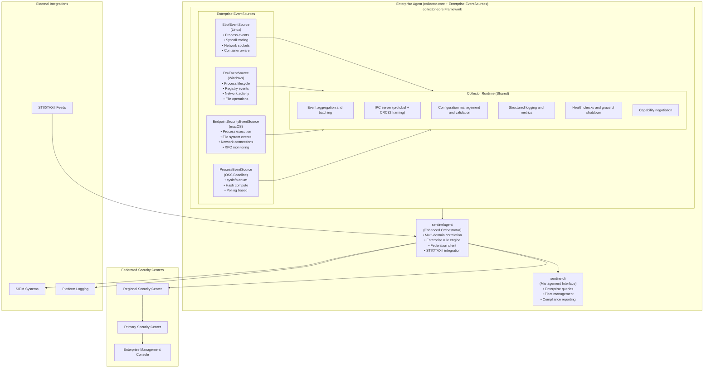

# Enterprise Tier Features Design Document

## Overview

This design document outlines the architecture and implementation approach for SentinelD Enterprise tier features, which extend the collector-core framework with kernel-level visibility, federated fleet management, and enterprise-grade security features. The Enterprise tier builds upon the proven collector-core foundation established in the sentineld-core-monitoring specification to provide real-time security monitoring capabilities.

The Enterprise tier maintains SentinelD's core security principles while leveraging the collector-core framework's extensible EventSource architecture to add advanced monitoring capabilities required for large-scale deployments, compliance environments, and sophisticated threat detection scenarios.

## Architecture

### Enterprise Collector-Core Architecture

The Enterprise tier extends the collector-core framework with kernel-level EventSource implementations while maintaining the same operational infrastructure:



### Collector-Core Integration Benefits

**Shared Infrastructure**: Enterprise EventSources leverage the same proven operational foundation as OSS components:

- **IPC Communication**: Same protobuf + CRC32 framing over interprocess crate
- **Configuration Management**: Hierarchical config loading with validation
- **Logging Infrastructure**: Structured tracing with JSON output and metrics
- **Health Monitoring**: Component status tracking and graceful shutdown
- **Event Processing**: Unified event aggregation and backpressure handling
- **Capability Negotiation**: Dynamic feature discovery and task routing

**Operational Consistency**: Both OSS and Enterprise versions provide identical management interfaces and operational characteristics while supporting different collection capabilities.

**Licensing Flexibility**: The collector-core framework remains Apache-2.0 licensed while enabling proprietary EventSource implementations for Enterprise features.

### Enterprise EventSource Components

The Enterprise tier implements kernel-level monitoring through specialized EventSource components that integrate seamlessly with the collector-core framework:

#### 1. EbpfEventSource (Linux Kernel Monitoring)

**Implementation**: Extends collector-core EventSource trait with eBPF-based real-time monitoring

**Capabilities**:

- eBPF programs attached to kernel tracepoints for process lifecycle events
- Real-time syscall monitoring (execve, fork, clone, ptrace, mmap)
- Network socket tracking with process correlation
- Container-aware monitoring with cgroup integration
- Ring buffer event streaming with sub-millisecond latency

**Integration with Collector-Core**:

```rust
pub struct EbpfEventSource {
    bpf: Bpf,                    // aya eBPF program management
    ring_buf: RingBuf<MapData>,  // Event ring buffer
    config: EbpfConfig,          // eBPF-specific configuration
    metrics: Arc<EbpfMetrics>,   // Performance tracking
}

#[async_trait]
impl EventSource for EbpfEventSource {
    fn name(&self) -> &'static str { "ebpf-kernel-monitor" }

    fn capabilities(&self) -> SourceCaps {
        SourceCaps::PROCESS | SourceCaps::NETWORK | SourceCaps::REALTIME |
        SourceCaps::KERNEL_LEVEL | SourceCaps::SYSTEM_WIDE
    }

    async fn start(&self, tx: mpsc::Sender<CollectionEvent>) -> anyhow::Result<()> {
        // Attach eBPF programs and start ring buffer processing
        // Send CollectionEvent::Process and CollectionEvent::Network events
    }
}
```

#### 2. EtwEventSource (Windows Kernel Monitoring)

**Implementation**: Extends collector-core EventSource trait with ETW-based monitoring

**Capabilities**:

- ETW consumer for kernel process events (Microsoft-Windows-Kernel-Process)
- Registry monitoring via Microsoft-Windows-Kernel-Registry
- File system events through Microsoft-Windows-Kernel-File
- Network correlation using Microsoft-Windows-Kernel-Network
- Real-time event processing with async callbacks

**Integration with Collector-Core**:

```rust
pub struct EtwEventSource {
    session_handle: TRACEHANDLE,           // ETW session management
    providers: Vec<EtwProvider>,           // Enabled ETW providers
    config: EtwConfig,                     // ETW-specific configuration
    metrics: Arc<EtwMetrics>,              // Performance tracking
}

#[async_trait]
impl EventSource for EtwEventSource {
    fn name(&self) -> &'static str { "etw-kernel-monitor" }

    fn capabilities(&self) -> SourceCaps {
        SourceCaps::PROCESS | SourceCaps::NETWORK | SourceCaps::FILESYSTEM |
        SourceCaps::REALTIME | SourceCaps::KERNEL_LEVEL | SourceCaps::SYSTEM_WIDE
    }

    async fn start(&self, tx: mpsc::Sender<CollectionEvent>) -> anyhow::Result<()> {
        // Start ETW session and enable providers
        // Send CollectionEvent::Process, CollectionEvent::Network, and CollectionEvent::Filesystem events
    }
}
```

#### 3. EndpointSecurityEventSource (macOS Kernel Monitoring)

**Implementation**: Extends collector-core EventSource trait with EndpointSecurity framework integration

**Capabilities**:

- ES_EVENT_TYPE_NOTIFY_EXEC for process execution
- ES_EVENT_TYPE_NOTIFY_FORK for process creation
- ES_EVENT_TYPE_NOTIFY_FILE\_\* for file system monitoring
- ES_EVENT_TYPE_NOTIFY_NETWORK\_\* for network activity
- Real-time event subscription with native macOS integration

**Integration with Collector-Core**:

```rust
pub struct EndpointSecurityEventSource {
    client: *mut es_client_t,              // EndpointSecurity client
    event_types: Vec<es_event_type_t>,     // Subscribed event types
    config: ESConfig,                      // ES-specific configuration
    metrics: Arc<ESMetrics>,               // Performance tracking
}

#[async_trait]
impl EventSource for EndpointSecurityEventSource {
    fn name(&self) -> &'static str { "endpoint-security-monitor" }

    fn capabilities(&self) -> SourceCaps {
        SourceCaps::PROCESS | SourceCaps::NETWORK | SourceCaps::FILESYSTEM |
        SourceCaps::REALTIME | SourceCaps::KERNEL_LEVEL | SourceCaps::SYSTEM_WIDE
    }

    async fn start(&self, tx: mpsc::Sender<CollectionEvent>) -> anyhow::Result<()> {
        // Create ES client and subscribe to event types
        // Send CollectionEvent::Process, CollectionEvent::Network, and CollectionEvent::Filesystem events
    }
}
```

#### 4. Federated Security Center Architecture

**Three-Tier Hierarchy:**

1. **Enterprise Agents**: Individual endpoint monitoring with collector-core + Enterprise EventSources
2. **Regional Security Centers**: Geographic/network segment aggregation with multi-domain event correlation
3. **Primary Security Center**: Enterprise-wide visibility and management with unified analytics

**Communication Protocol:**

- Mutual TLS authentication with certificate chain validation
- Protocol Buffers for efficient data serialization (extending existing collector-core IPC protocol)
- Automatic failover and load balancing
- Compression and deduplication for bandwidth optimization
- Capability negotiation to handle mixed OSS/Enterprise deployments

**Collector-Core Integration Benefits**:

- **Unified Event Model**: All agents (OSS and Enterprise) send events using the same CollectionEvent enum
- **Consistent IPC Protocol**: Same protobuf + CRC32 framing for local and federated communication
- **Capability Awareness**: Security Centers can discover and route tasks based on agent capabilities
- **Operational Consistency**: Same health monitoring, logging, and management interfaces across all tiers

## Components and Interfaces

### Enterprise Collector-Core Integration

The Enterprise tier leverages the existing collector-core framework from sentineld-core-monitoring, extending it with kernel-level EventSource implementations:

```rust
// Enterprise EventSources implement the same EventSource trait as OSS components
use collector_core::{CollectionEvent, Collector, EventSource, SourceCaps};

// Enterprise collector main function
fn main() -> anyhow::Result<()> {
    let config = collector_core::config::load()?;
    let mut collector = collector_core::Collector::new(config);

    // Register platform-specific Enterprise EventSources
    #[cfg(target_os = "linux")]
    if config.enterprise.ebpf_enabled {
        collector.register(EbpfEventSource::new(config.ebpf.clone())?);
    }

    #[cfg(target_os = "windows")]
    if config.enterprise.etw_enabled {
        collector.register(EtwEventSource::new(config.etw.clone())?);
    }

    #[cfg(target_os = "macos")]
    if config.enterprise.endpoint_security_enabled {
        collector.register(EndpointSecurityEventSource::new(config.es.clone())?);
    }

    // Always include OSS ProcessEventSource as fallback
    collector.register(ProcessEventSource::new(config.process.clone())?);

    // Use same collector-core runtime as OSS version
    collector.run().await
}

// Unified event model supports both OSS and Enterprise events
#[derive(Debug, Clone)]
pub enum CollectionEvent {
    Process(ProcessEvent),         // OSS + Enterprise
    Network(NetworkEvent),         // Enterprise: eBPF, ETW, EndpointSecurity
    Filesystem(FilesystemEvent),   // Enterprise: ETW, EndpointSecurity
    Performance(PerformanceEvent), // Future: Enterprise performance monitoring
    Registry(RegistryEvent),       // Enterprise: Windows ETW registry events
    Syscall(SyscallEvent),         // Enterprise: Linux eBPF syscall tracing
}
```

### Capability-Based Feature Detection

```rust
// Enterprise capabilities extend OSS capabilities
bitflags! {
    pub struct SourceCaps: u32 {
        // OSS capabilities
        const PROCESS = 1 << 0;
        const REALTIME = 1 << 4;
        const SYSTEM_WIDE = 1 << 6;

        // Enterprise capabilities
        const NETWORK = 1 << 1;
        const FILESYSTEM = 1 << 2;
        const PERFORMANCE = 1 << 3;
        const KERNEL_LEVEL = 1 << 5;
        const REGISTRY = 1 << 7;        // Windows ETW
        const SYSCALL_TRACING = 1 << 8; // Linux eBPF
        const CONTAINER_AWARE = 1 << 9; // Linux eBPF + cgroups
    }
}

// sentinelagent discovers capabilities and routes tasks appropriately
impl EnterpriseOrchestrator {
    async fn discover_capabilities(&self) -> SourceCaps {
        // Query collector-core for available EventSource capabilities
        let caps = self.ipc_client.get_capabilities().await?;

        // Enable Enterprise features based on available capabilities
        if caps.contains(SourceCaps::KERNEL_LEVEL) {
            self.enable_realtime_detection().await?;
        }

        if caps.contains(SourceCaps::NETWORK) {
            self.enable_network_correlation().await?;
        }

        caps
    }
}
```

### Enhanced sentinelagent (Enterprise Orchestrator)

The Enterprise tier extends sentinelagent with multi-domain event correlation and advanced detection capabilities:

```rust
pub struct EnterpriseOrchestrator {
    // Core components (same as OSS)
    detection_engine: DetectionEngine,
    alert_manager: AlertManager,
    ipc_client: IpcClient,

    // Enterprise extensions
    network_correlator: NetworkCorrelator,
    filesystem_correlator: FilesystemCorrelator,
    threat_intel_client: TaxiiClient,
    federation_client: Option<FederationClient>,
    compliance_mapper: ComplianceMapper,
}

// Multi-domain event correlation
impl EnterpriseOrchestrator {
    async fn correlate_events(&self, events: Vec<CollectionEvent>) -> Vec<CorrelatedEvent> {
        let mut correlator = EventCorrelator::new();

        for event in events {
            match event {
                CollectionEvent::Process(proc_event) => {
                    correlator.add_process_event(proc_event);
                }
                CollectionEvent::Network(net_event) => {
                    // Correlate network activity with process events
                    if let Some(process) = correlator.find_process(net_event.process_id) {
                        correlator.add_network_correlation(process, net_event);
                    }
                }
                CollectionEvent::Filesystem(fs_event) => {
                    // Correlate file operations with process activity
                    if let Some(process) = correlator.find_process(fs_event.process_id) {
                        correlator.add_filesystem_correlation(process, fs_event);
                    }
                }
                _ => {}
            }
        }

        correlator.generate_correlated_events()
    }
}

// Network event data model (unified across platforms)
#[derive(Debug, Clone)]
pub struct NetworkEvent {
    pub process_id: u32,
    pub connection_id: u64,
    pub local_addr: SocketAddr,
    pub remote_addr: SocketAddr,
    pub protocol: Protocol,
    pub direction: ConnectionDirection,
    pub timestamp: SystemTime,
    pub bytes_transferred: u64,
    pub platform_specific: NetworkPlatformData,
}

#[derive(Debug, Clone)]
pub enum NetworkPlatformData {
    Linux(LinuxNetworkData),     // eBPF socket tracking
    Windows(WindowsNetworkData), // ETW network events
    MacOS(MacOSNetworkData),     // EndpointSecurity network events
}
```

### Security Center Federation

```rust
pub struct SecurityCenter {
    tier: SecurityCenterTier,
    agents: AgentManager,
    upstream: Option<UpstreamConnection>,
    storage: FederatedStorage,
    query_engine: DistributedQueryEngine,
}

pub enum SecurityCenterTier {
    Regional {
        coverage_area: GeographicRegion,
        max_agents: usize,
    },
    Primary {
        regional_centers: Vec<RegionalCenterInfo>,
    },
}

pub struct DistributedQueryEngine {
    local_engine: SqlEngine,
    federation_client: FederationClient,
    result_aggregator: ResultAggregator,
}
```

## Data Models

### Enhanced Event Schema (Collector-Core Integration)

The Enterprise tier extends the collector-core CollectionEvent enum with additional event types while maintaining compatibility:

```rust
// Extended CollectionEvent enum (builds on collector-core foundation)
#[derive(Debug, Clone, Serialize, Deserialize)]
pub enum CollectionEvent {
    // OSS events (from collector-core)
    Process(ProcessEvent),

    // Enterprise events (kernel-level monitoring)
    Network(NetworkEvent),
    Filesystem(FilesystemEvent),
    Performance(PerformanceEvent),

    // Platform-specific Enterprise events
    Registry(RegistryEvent),   // Windows ETW registry monitoring
    Syscall(SyscallEvent),     // Linux eBPF syscall tracing
    Container(ContainerEvent), // Linux eBPF container events
    XPC(XPCEvent),             // macOS EndpointSecurity XPC events
}

// Enhanced ProcessEvent with kernel-level context
#[derive(Debug, Clone, Serialize, Deserialize)]
pub struct ProcessEvent {
    // Core process data (same as OSS)
    pub pid: u32,
    pub ppid: Option<u32>,
    pub name: String,
    pub executable_path: Option<String>,
    pub command_line: Vec<String>,
    pub timestamp: SystemTime,

    // Enterprise extensions
    pub kernel_context: Option<KernelContext>,
    pub security_context: Option<SecurityContext>,
    pub platform_data: Option<PlatformSpecificData>,
}

#[derive(Debug, Clone, Serialize, Deserialize)]
pub struct KernelContext {
    pub syscall_info: Option<SyscallInfo>,
    pub memory_info: Option<MemoryInfo>,
    pub file_operations: Vec<FileOperation>,
    pub capabilities: Vec<String>,
    pub container_info: Option<ContainerInfo>, // Linux eBPF cgroup data
}

#[derive(Debug, Clone, Serialize, Deserialize)]
pub struct NetworkEvent {
    pub process_id: u32,
    pub connection_id: u64,
    pub local_addr: SocketAddr,
    pub remote_addr: SocketAddr,
    pub protocol: Protocol,
    pub direction: ConnectionDirection,
    pub timestamp: SystemTime,
    pub bytes_transferred: u64,
    pub platform_source: NetworkEventSource,
}

#[derive(Debug, Clone, Serialize, Deserialize)]
pub enum NetworkEventSource {
    EbpfSocket(EbpfSocketData),      // Linux eBPF socket tracking
    EtwNetwork(EtwNetworkData),      // Windows ETW network events
    EndpointSecurity(ESNetworkData), // macOS EndpointSecurity network events
}

#[derive(Debug, Clone, Serialize, Deserialize)]
pub struct FilesystemEvent {
    pub process_id: u32,
    pub operation: FileOperation,
    pub path: PathBuf,
    pub timestamp: SystemTime,
    pub result: FileOperationResult,
    pub platform_source: FilesystemEventSource,
}

#[derive(Debug, Clone, Serialize, Deserialize)]
pub enum FilesystemEventSource {
    EtwFile(EtwFileData), // Windows ETW file events
    EndpointSecurity(ESFileData), // macOS EndpointSecurity file events
                          // Note: Linux filesystem monitoring would be future eBPF extension
}
```

### STIX/TAXII Integration Schema

```rust
#[derive(Debug, Clone, Serialize, Deserialize)]
pub struct StixIndicator {
    pub id: String,
    pub pattern: String,
    pub indicator_type: IndicatorType,
    pub labels: Vec<String>,
    pub confidence: u8,
    pub valid_from: SystemTime,
    pub valid_until: Option<SystemTime>,
}

pub struct TaxiiClient {
    base_url: Url,
    credentials: TaxiiCredentials,
    collections: Vec<TaxiiCollection>,
    poll_interval: Duration,
}

impl TaxiiClient {
    pub async fn poll_indicators(&self) -> Result<Vec<StixIndicator>, TaxiiError> {
        // Implementation for polling TAXII feeds
    }

    pub async fn convert_to_detection_rules(&self, indicators: Vec<StixIndicator>) -> Result<Vec<DetectionRule>, ConversionError> {
        // Convert STIX indicators to SentinelD detection rules
    }
}
```

## Error Handling

### Kernel Monitoring Error Recovery

```rust
#[derive(Debug, thiserror::Error)]
pub enum KernelMonitorError {
    #[error("Insufficient privileges for kernel monitoring: {0}")]
    InsufficientPrivileges(String),

    #[error("Kernel monitoring not supported on this platform: {0}")]
    UnsupportedPlatform(String),

    #[error("eBPF program load failed: {0}")]
    EbpfLoadError(String),

    #[error("ETW session creation failed: {0}")]
    EtwSessionError(String),

    #[error("EndpointSecurity client initialization failed: {0}")]
    EndpointSecurityError(String),
}

pub struct GracefulDegradation {
    available_monitors: Vec<MonitorType>,
    fallback_strategy: FallbackStrategy,
    degradation_alerts: AlertChannel,
}

impl GracefulDegradation {
    pub async fn handle_monitor_failure(&self, failed_monitor: MonitorType) -> Result<(), DegradationError> {
        // Log the failure
        tracing::warn!("Kernel monitor failed: {:?}, falling back to userspace monitoring", failed_monitor);

        // Switch to fallback monitoring
        self.activate_fallback(failed_monitor).await?;

        // Alert administrators
        self.send_degradation_alert(failed_monitor).await?;

        Ok(())
    }
}
```

### Federation Error Handling

```rust
#[derive(Debug, thiserror::Error)]
pub enum FederationError {
    #[error("Regional Security Center unreachable: {0}")]
    RegionalCenterUnreachable(String),

    #[error("Certificate validation failed: {0}")]
    CertificateValidationFailed(String),

    #[error("Query distribution timeout: {0}")]
    QueryDistributionTimeout(Duration),
}

pub struct FederationResilience {
    failover_targets: Vec<SecurityCenterEndpoint>,
    circuit_breaker: CircuitBreaker,
    retry_policy: RetryPolicy,
}
```

## Testing Strategy

### Kernel Monitoring Testing

```rust
#[cfg(test)]
mod kernel_monitor_tests {
    use super::*;

    #[tokio::test]
    async fn test_ebpf_process_monitoring() {
        let monitor = EbpfMonitor::new().await.unwrap();
        let mut event_stream = monitor.subscribe_events().await.unwrap();

        // Spawn a test process
        let child = Command::new("sleep").arg("1").spawn().unwrap();

        // Verify we receive the process creation event
        let event = timeout(Duration::from_secs(5), event_stream.next()).await.unwrap().unwrap();
        assert_eq!(event.process.pid, child.id());
        assert_eq!(event.event_type, EventType::ProcessCreated);
    }

    #[tokio::test]
    async fn test_graceful_degradation() {
        let degradation = GracefulDegradation::new();

        // Simulate kernel monitoring failure
        degradation.handle_monitor_failure(MonitorType::Ebpf).await.unwrap();

        // Verify fallback to userspace monitoring
        assert!(degradation.is_fallback_active(MonitorType::Ebpf));
    }
}
```

### Federation Testing

```rust
#[cfg(test)]
mod federation_tests {
    use super::*;

    #[tokio::test]
    async fn test_hierarchical_query_distribution() {
        let primary_center = SecurityCenter::new(SecurityCenterTier::Primary {
            regional_centers: vec![test_regional_center()]
        }).await.unwrap();

        let query = "SELECT * FROM process_events WHERE process_name = 'malware.exe'";
        let results = primary_center.execute_distributed_query(query).await.unwrap();

        assert!(!results.is_empty());
        assert!(results.iter().any(|r| r.source_tier == "regional"));
    }
}
```

### STIX/TAXII Integration Testing

```rust
#[cfg(test)]
mod stix_taxii_tests {
    use super::*;

    #[tokio::test]
    async fn test_stix_indicator_conversion() {
        let stix_indicator = StixIndicator {
            id: "indicator--test-123".to_string(),
            pattern: "[process:name = 'malware.exe']".to_string(),
            indicator_type: IndicatorType::MaliciousActivity,
            labels: vec!["malware".to_string()],
            confidence: 85,
            valid_from: SystemTime::now(),
            valid_until: None,
        };

        let detection_rule = convert_stix_to_rule(stix_indicator).await.unwrap();
        assert_eq!(detection_rule.name, "STIX Indicator: malware.exe");
        assert!(detection_rule.sql_query.contains("process_name = 'malware.exe'"));
    }
}
```

## Platform-Specific Implementation Details

### Linux eBPF Implementation (Collector-Core Integration)

**Architecture**: EbpfEventSource implements the collector-core EventSource trait, leveraging shared infrastructure while providing kernel-level monitoring capabilities.

**Crate Dependencies:**

- `collector-core` (internal): Shared collector infrastructure and EventSource trait
- `aya` (0.12+): Pure Rust eBPF library - preferred over libbpf-rs for easier deployment, no C toolchain requirement, faster builds, and better Rust ergonomics
- `aya-log` (0.2+): eBPF logging support for debugging
- `tokio` (1.39+): Async runtime for event processing (shared with collector-core)
- `tokio-stream` (0.1+): Stream utilities for event handling
- `tracing` (0.1+): Structured logging (shared with collector-core)

**Linux eBPF Support Tiers:**

- **Full eBPF Support**: Kernel 5.4+ (ring buffers, all program types, BTF support)
- **Standard eBPF Support**: Kernel 4.7+ (tracepoints, basic program types)
- **Limited eBPF Support**: RHEL/CentOS 7.6+ kernel 3.10 (backported tracepoints only)
- **Legacy Support**: Older kernels (graceful degradation to OSS ProcessEventSource)

**Distribution-Specific Notes:**

- **Ubuntu**: 16.04+ (kernel 4.4+), full support on 18.04+ (kernel 4.15+)
- **RHEL/CentOS**: 7.6+ (kernel 3.10 with backports), full support on 8+ (kernel 4.18+)
- **Debian**: 9+ (kernel 4.9+), full support on 10+ (kernel 4.19+)
- **SLES**: 12 SP3+ (kernel 4.4+), full support on 15+ (kernel 4.12+)

**Collector-Core Integration Benefits**:

- **Shared IPC**: Same protobuf + CRC32 framing as OSS ProcessEventSource
- **Unified Configuration**: Same hierarchical config loading and validation
- **Common Logging**: Same structured tracing and metrics collection
- **Consistent Health Monitoring**: Same health checks and graceful shutdown
- **Capability Negotiation**: Automatic fallback to OSS ProcessEventSource when eBPF unavailable

```rust
use collector_core::{EventSource, CollectionEvent, SourceCaps};
use aya::{
    include_bytes_aligned,
    maps::{RingBuf, MapData},
    programs::{KProbe, TracePoint},
    Bpf, BpfLoader,
};
use aya_log::BpfLogger;
use tokio::sync::mpsc;
use tracing::{info, warn, error};
use std::sync::{Arc, atomic::{AtomicU64, AtomicU32, Ordering}};

pub struct EbpfEventSource {
    // eBPF program management using aya
    bpf: Bpf,
    ring_buf: RingBuf<MapData>,

    // Program handles
    process_tracepoint: Option<TracePoint>,
    network_kprobe: Option<KProbe>,

    // Configuration and metrics
    config: EbpfConfig,
    metrics: Arc<EbpfMetrics>,
}

#[derive(Debug, Clone)]
pub struct EbpfConfig {
    pub enable_process_monitoring: bool,
    pub enable_network_monitoring: bool,
    pub enable_file_monitoring: bool,
    pub syscall_filter: HashSet<u32>,
    pub ring_buffer_size: usize,
}

impl EbpfEventSource {
    pub async fn new(config: EbpfConfig) -> Result<Self, EbpfError> {
        // Load eBPF programs using aya with configuration
        let mut bpf = BpfLoader::new()
            .set_global("CONFIG_ENABLE_PROCESS_MON", &(config.enable_process_monitoring as u32), true)
            .set_global("CONFIG_ENABLE_NETWORK_MON", &(config.enable_network_monitoring as u32), true)
            .load(include_bytes_aligned!(
                "../../target/bpf/sentinel_monitor"
            ))?;

        // Initialize BPF logger for debugging
        if cfg!(debug_assertions) {
            BpfLogger::init(&mut bpf)?;
        }

        // Get ring buffer for event communication
        let ring_buf = RingBuf::try_from(bpf.take_map("EVENTS").unwrap())?;

        Ok(Self {
            bpf,
            ring_buf,
            process_tracepoint: None,
            network_kprobe: None,
            config,
            metrics: Arc::new(EbpfMetrics::default()),
        })
    }

    async fn spawn_event_processor(&self, tx: mpsc::Sender<CollectionEvent>) {
        let mut ring_buf = self.ring_buf.clone();
        let metrics = Arc::clone(&self.metrics);

        tokio::spawn(async move {
            loop {
                match ring_buf.next() {
                    Some(item) => {
                        match Self::parse_kernel_event(&item) {
                            Ok(event) => {
                                metrics.events_processed.fetch_add(1, Ordering::Relaxed);
                                if let Err(_) = tx.send(event).await {
                                    error!("Event channel closed, stopping eBPF processor");
                                    break;
                                }
                            }
                            Err(e) => {
                                warn!("Failed to parse kernel event: {}", e);
                                metrics.parse_errors.fetch_add(1, Ordering::Relaxed);
                            }
                        }
                    }
                    None => {
                        tokio::task::yield_now().await;
                    }
                }
            }
        });
    }

    fn parse_kernel_event(data: &[u8]) -> Result<CollectionEvent, ParseError> {
        // Parse eBPF ring buffer data and convert to CollectionEvent
        // This integrates with collector-core's unified event model
        match parse_ebpf_event_type(data)? {
            EbpfEventType::ProcessExec => {
                let proc_event = parse_process_event(data)?;
                Ok(CollectionEvent::Process(proc_event))
            }
            EbpfEventType::NetworkConnect => {
                let net_event = parse_network_event(data)?;
                Ok(CollectionEvent::Network(net_event))
            }
            EbpfEventType::SyscallTrace => {
                let syscall_event = parse_syscall_event(data)?;
                Ok(CollectionEvent::Syscall(syscall_event))
            }
        }
    }
}

#[derive(Debug, Default)]
pub struct EbpfMetrics {
    pub events_processed: AtomicU64,
    pub parse_errors: AtomicU64,
    pub programs_loaded: AtomicU32,
    pub ring_buffer_drops: AtomicU64,
}

#[async_trait]
impl EventSource for EbpfEventSource {
    fn name(&self) -> &'static str {
        "ebpf-kernel-monitor"
    }

    fn capabilities(&self) -> SourceCaps {
        let mut caps = SourceCaps::REALTIME | SourceCaps::KERNEL_LEVEL | SourceCaps::SYSTEM_WIDE;

        if self.config.enable_process_monitoring {
            caps |= SourceCaps::PROCESS | SourceCaps::SYSCALL_TRACING;
        }

        if self.config.enable_network_monitoring {
            caps |= SourceCaps::NETWORK;
        }

        if self.config.enable_container_monitoring {
            caps |= SourceCaps::CONTAINER_AWARE;
        }

        caps
    }

    async fn start(&self, tx: mpsc::Sender<CollectionEvent>) -> anyhow::Result<()> {
        info!("Starting eBPF monitoring with config: {:?}", self.config);

        // Attach process monitoring tracepoint
        if self.config.enable_process_monitoring {
            let program: &mut TracePoint = self.bpf.program_mut("trace_execve").unwrap().try_into()?;
            program.load()?;
            program.attach("syscalls", "sys_enter_execve")?;
            info!("Attached process monitoring tracepoint");
        }

        // Attach network monitoring kprobe
        if self.config.enable_network_monitoring {
            let program: &mut KProbe = self.bpf.program_mut("trace_tcp_connect").unwrap().try_into()?;
            program.load()?;
            program.attach("tcp_connect", 0)?;
            info!("Attached network monitoring kprobe");
        }

        // Start event processing task (integrates with collector-core)
        self.spawn_event_processor(tx).await;
        Ok(())
    }

    async fn stop(&self) -> anyhow::Result<()> {
        info!("Stopping eBPF monitoring");
        // Detach eBPF programs and cleanup resources
        // collector-core handles graceful shutdown coordination
        Ok(())
    }
}
```

### Windows ETW Implementation (Collector-Core Integration)

**Architecture**: EtwEventSource implements the collector-core EventSource trait, providing Windows kernel-level monitoring through ETW while leveraging shared collector infrastructure.

**Crate Dependencies:**

- `collector-core` (internal): Shared collector infrastructure and EventSource trait
- `windows` (0.58+): Official Microsoft Windows API bindings - actively maintained and comprehensive
- `tokio` (1.39+): Async runtime for event processing (shared with collector-core)
- `tracing` (0.1+): Structured logging (shared with collector-core)
- `tracing-etw` (0.2+): Optional ETW integration for tracing events
- `serde` (1.0+): Serialization for event data

**Platform Support Notes:**

- **Full ETW Support**: Windows 7+, Windows Server 2012+ (SystemTraceProvider with kernel events)
- **Limited ETW Support**: Windows Server 2008 R2 (basic ETW, limited kernel providers)
- **Legacy Support**: Windows Vista/Server 2008 (graceful degradation to OSS ProcessEventSource)

**Collector-Core Integration Benefits**:

- **Shared IPC**: Same protobuf + CRC32 framing as OSS ProcessEventSource
- **Unified Configuration**: Same hierarchical config loading and validation
- **Common Logging**: Same structured tracing and metrics collection
- **Consistent Health Monitoring**: Same health checks and graceful shutdown
- **Capability Negotiation**: Automatic fallback to OSS ProcessEventSource when ETW unavailable

```rust
use collector_core::{EventSource, CollectionEvent, SourceCaps};
use windows::{
    core::*,
    Win32::System::Diagnostics::Etw::*,
    Win32::Foundation::*,
};
use tokio::sync::mpsc;
use tracing::{info, warn, error};
use std::sync::Arc;

pub struct EtwEventSource {
    // ETW session management
    session_handle: TRACEHANDLE,
    session_properties: Box<EVENT_TRACE_PROPERTIES>,

    // Provider configuration
    providers: Vec<EtwProvider>,
    config: EtwConfig,
    metrics: Arc<EtwMetrics>,
}

#[derive(Debug, Clone)]
pub struct EtwConfig {
    pub session_name: String,
    pub enable_process_events: bool,
    pub enable_network_events: bool,
    pub enable_registry_events: bool,
    pub buffer_size: u32,
    pub max_buffers: u32,
}

#[derive(Debug)]
pub struct EtwProvider {
    pub guid: GUID,
    pub name: String,
    pub level: u8,
    pub match_any_keyword: u64,
}

impl EtwEventSource {
    pub async fn new(config: EtwConfig) -> Result<Self, EtwError> {
        // Initialize ETW session properties
        let mut session_properties = Box::new(EVENT_TRACE_PROPERTIES {
            Wnode: WNODE_HEADER {
                BufferSize: std::mem::size_of::<EVENT_TRACE_PROPERTIES>() as u32 +
                           (config.session_name.len() + 1) as u32 * 2,
                Flags: WNODE_FLAG_TRACED_GUID,
                ..Default::default()
            },
            BufferSize: config.buffer_size,
            MinimumBuffers: 2,
            MaximumBuffers: config.max_buffers,
            MaximumFileSize: 0,
            LogFileMode: EVENT_TRACE_REAL_TIME_MODE,
            FlushTimer: 1,
            ..Default::default()
        });

        // Define providers based on configuration
        let mut providers = Vec::new();

        if config.enable_process_events {
            providers.push(EtwProvider {
                guid: GUID::from("22FB2CD6-0E7B-422B-A0C7-2FAD1FD0E716"), // Microsoft-Windows-Kernel-Process
                name: "Microsoft-Windows-Kernel-Process".to_string(),
                level: 5, // TRACE_LEVEL_VERBOSE
                match_any_keyword: 0xFFFFFFFFFFFFFFFF,
            });
        }

        if config.enable_network_events {
            providers.push(EtwProvider {
                guid: GUID::from("7DD42A49-5329-4832-8DFD-43D979153A88"), // Microsoft-Windows-Kernel-Network
                name: "Microsoft-Windows-Kernel-Network".to_string(),
                level: 5,
                match_any_keyword: 0xFFFFFFFFFFFFFFFF,
            });
        }

        if config.enable_registry_events {
            providers.push(EtwProvider {
                guid: GUID::from("70EB4F03-C1DE-4F73-A051-33D13D5413BD"), // Microsoft-Windows-Kernel-Registry
                name: "Microsoft-Windows-Kernel-Registry".to_string(),
                level: 5,
                match_any_keyword: 0xFFFFFFFFFFFFFFFF,
            });
        }

        Ok(Self {
            session_handle: TRACEHANDLE::default(),
            session_properties,
            providers,
            config,
            metrics: Arc::new(EtwMetrics::default()),
        })
    }

    async fn start_etw_session(&mut self) -> Result<(), EtwError> {
        info!("Starting ETW monitoring session: {}", self.config.session_name);

        // Start ETW trace session
        unsafe {
            let session_name = HSTRING::from(&self.config.session_name);
            let result = StartTraceW(
                &mut self.session_handle,
                &session_name,
                self.session_properties.as_mut(),
            );

            if result != ERROR_SUCCESS.0 {
                return Err(EtwError::SessionStartFailed(result));
            }
        }

        // Enable providers
        for provider in &self.providers {
            self.enable_provider(provider).await?;
        }

        Ok(())
    }

    fn parse_etw_event(event_record: *const EVENT_RECORD) -> Result<CollectionEvent, ParseError> {
        // Parse ETW event record and convert to CollectionEvent
        // This integrates with collector-core's unified event model
        unsafe {
            let record = &*event_record;

            match record.EventHeader.ProviderId {
                // Microsoft-Windows-Kernel-Process events
                PROCESS_PROVIDER_GUID => {
                    let proc_event = parse_process_etw_event(record)?;
                    Ok(CollectionEvent::Process(proc_event))
                }
                // Microsoft-Windows-Kernel-Network events
                NETWORK_PROVIDER_GUID => {
                    let net_event = parse_network_etw_event(record)?;
                    Ok(CollectionEvent::Network(net_event))
                }
                // Microsoft-Windows-Kernel-Registry events
                REGISTRY_PROVIDER_GUID => {
                    let reg_event = parse_registry_etw_event(record)?;
                    Ok(CollectionEvent::Registry(reg_event))
                }
                _ => Err(ParseError::UnsupportedProvider),
            }
        }
    }

    async fn enable_provider(&self, provider: &EtwProvider) -> Result<(), EtwError> {
        unsafe {
            let result = EnableTraceEx2(
                self.session_handle,
                &provider.guid,
                EVENT_CONTROL_CODE_ENABLE_PROVIDER,
                provider.level,
                provider.match_any_keyword,
                0, // MatchAllKeyword
                0, // Timeout
                None, // EnableParameters
            );

            if result != ERROR_SUCCESS.0 {
                return Err(EtwError::ProviderEnableFailed(provider.name.clone(), result));
            }
        }

        info!("Enabled ETW provider: {}", provider.name);
        Ok(())
    }

    async fn spawn_event_processor(&self, tx: mpsc::Sender<CollectionEvent>) {
        let metrics = Arc::clone(&self.metrics);
        let session_handle = self.session_handle;

        tokio::task::spawn_blocking(move || {
            // ETW event processing callback that integrates with collector-core
            let tx_clone = tx.clone();
            let metrics_clone = Arc::clone(&metrics);

            unsafe extern "system" fn event_record_callback(event_record: *mut EVENT_RECORD) {
                // Access the channel and metrics through thread-local storage or global state
                // This is a simplified example - actual implementation would need proper callback context
                if let Ok(event) = EtwEventSource::parse_etw_event(event_record) {
                    // Send to collector-core event aggregation
                    // Note: Actual implementation would need proper async context handling
                }
            }

            // Set up ETW event processing
            let mut logfile = EVENT_TRACE_LOGFILEW {
                LoggerName: PWSTR::null(),
                ProcessTraceMode: PROCESS_TRACE_MODE_REAL_TIME | PROCESS_TRACE_MODE_EVENT_RECORD,
                EventRecordCallback: Some(event_record_callback),
                ..Default::default()
            };

            // Process trace events
            unsafe {
                let trace_handle = OpenTraceW(&mut logfile);
                if trace_handle != INVALID_PROCESSTRACE_HANDLE {
                    ProcessTrace(&[trace_handle], None, None);
                    CloseTrace(trace_handle);
                }
            }
        });
    }
}

#[async_trait]
impl EventSource for EtwEventSource {
    fn name(&self) -> &'static str {
        "etw-kernel-monitor"
    }

    fn capabilities(&self) -> SourceCaps {
        let mut caps = SourceCaps::REALTIME | SourceCaps::KERNEL_LEVEL | SourceCaps::SYSTEM_WIDE;

        if self.config.enable_process_events {
            caps |= SourceCaps::PROCESS;
        }

        if self.config.enable_network_events {
            caps |= SourceCaps::NETWORK;
        }

        if self.config.enable_registry_events {
            caps |= SourceCaps::REGISTRY;
        }

        caps
    }

    async fn start(&self, tx: mpsc::Sender<CollectionEvent>) -> anyhow::Result<()> {
        // Start ETW session and enable providers
        self.start_etw_session().await?;

        // Start event processing task (integrates with collector-core)
        self.spawn_event_processor(tx).await;
        Ok(())
    }

    async fn stop(&self) -> anyhow::Result<()> {
        info!("Stopping ETW monitoring");
        // Stop ETW session and cleanup resources
        // collector-core handles graceful shutdown coordination
        unsafe {
            StopTraceW(self.session_handle, None, self.session_properties.as_ref());
        }
        Ok(())
    }
}

#[derive(Debug, Default)]
pub struct EtwMetrics {
    pub events_processed: AtomicU64,
    pub providers_enabled: AtomicU32,
    pub session_errors: AtomicU64,
}
```

### macOS EndpointSecurity Implementation (Collector-Core Integration)

**Architecture**: EndpointSecurityEventSource implements the collector-core EventSource trait, providing macOS kernel-level monitoring through the EndpointSecurity framework while leveraging shared collector infrastructure.

**Crate Dependencies:**

- `collector-core` (internal): Shared collector infrastructure and EventSource trait
- `endpoint-sec` (0.3+): Safe Rust bindings for EndpointSecurity framework - preferred over manual FFI
- `core-foundation` (0.10+): Core Foundation bindings for system integration
- `mach2` (0.4+): Mach kernel interfaces for low-level system access
- `tokio` (1.39+): Async runtime for event processing (shared with collector-core)
- Alternative: `endpointsecurity` (0.1+): Community bindings if endpoint-sec is insufficient

**Collector-Core Integration Benefits**:

- **Shared IPC**: Same protobuf + CRC32 framing as OSS ProcessEventSource
- **Unified Configuration**: Same hierarchical config loading and validation
- **Common Logging**: Same structured tracing and metrics collection
- **Consistent Health Monitoring**: Same health checks and graceful shutdown
- **Capability Negotiation**: Automatic fallback to OSS ProcessEventSource when EndpointSecurity unavailable

```rust
use collector_core::{EventSource, CollectionEvent, SourceCaps};
use endpoint_sec::{Client, Message, EventType};
use core_foundation::{
    base::{CFTypeRef, TCFType},
    string::{CFString, CFStringRef},
};
use tokio::sync::mpsc;
use tracing::{info, warn, error};
use std::sync::Arc;

// EndpointSecurity framework bindings (would be in a separate module)
#[repr(C)]
pub struct es_client_t {
    _private: [u8; 0],
}

#[repr(C)]
pub struct es_message_t {
    pub version: u32,
    pub time: timespec,
    pub mach_time: u64,
    pub deadline: u64,
    pub process: *const es_process_t,
    pub seq_num: u64,
    pub action: es_action_type_t,
    pub event_type: es_event_type_t,
    // ... additional fields
}

pub struct EndpointSecurityEventSource {
    // ES client handle
    client: *mut es_client_t,

    // Configuration
    config: ESConfig,
    event_types: Vec<es_event_type_t>,
    metrics: Arc<ESMetrics>,
}

#[derive(Debug, Clone)]
pub struct ESConfig {
    pub enable_process_events: bool,
    pub enable_file_events: bool,
    pub enable_network_events: bool,
    pub cache_size: usize,
}

impl EndpointSecurityEventSource {
    pub async fn new(config: ESConfig) -> Result<Self, ESError> {
        // Determine event types to subscribe to
        let mut event_types = Vec::new();

        if config.enable_process_events {
            event_types.extend_from_slice(&[
                ES_EVENT_TYPE_NOTIFY_EXEC,
                ES_EVENT_TYPE_NOTIFY_FORK,
                ES_EVENT_TYPE_NOTIFY_EXIT,
            ]);
        }

        if config.enable_file_events {
            event_types.extend_from_slice(&[
                ES_EVENT_TYPE_NOTIFY_OPEN,
                ES_EVENT_TYPE_NOTIFY_CLOSE,
                ES_EVENT_TYPE_NOTIFY_CREATE,
                ES_EVENT_TYPE_NOTIFY_UNLINK,
            ]);
        }

        if config.enable_network_events {
            event_types.extend_from_slice(&[
                ES_EVENT_TYPE_NOTIFY_SOCKET,
                ES_EVENT_TYPE_NOTIFY_BIND,
                ES_EVENT_TYPE_NOTIFY_CONNECT,
            ]);
        }

        Ok(Self {
            client: std::ptr::null_mut(),
            config,
            event_types,
            metrics: Arc::new(ESMetrics::default()),
        })
    }

    async fn create_es_client(&mut self, tx: mpsc::Sender<CollectionEvent>) -> Result<(), ESError> {
        info!("Starting EndpointSecurity monitoring");

        // Create ES client with event handler that integrates with collector-core
        let metrics = Arc::clone(&self.metrics);
        let tx_clone = tx.clone();

        unsafe {
            let handler: es_handler_block_t = Box::into_raw(Box::new(move |_client, message| {
                // Process EndpointSecurity message and send to collector-core
                if let Ok(event) = Self::parse_es_message(message) {
                    metrics.events_processed.fetch_add(1, Ordering::Relaxed);
                    let _ = tx_clone.try_send(event);
                } else {
                    metrics.parse_errors.fetch_add(1, Ordering::Relaxed);
                }
            }));

            let result = es_new_client(&mut self.client, handler);
            if result != ES_NEW_CLIENT_RESULT_SUCCESS {
                return Err(ESError::ClientCreationFailed(result));
            }
        }

        // Subscribe to event types
        unsafe {
            let result = es_subscribe(
                self.client,
                self.event_types.as_ptr(),
                self.event_types.len() as u32,
            );

            if result != ES_RETURN_SUCCESS {
                return Err(ESError::SubscriptionFailed(result));
            }
        }

        info!("EndpointSecurity monitoring started with {} event types", self.event_types.len());
        Ok(())
    }

    unsafe fn parse_es_message(message: *const es_message_t) -> Result<CollectionEvent, ParseError> {
        // Parse EndpointSecurity message and convert to CollectionEvent
        // This integrates with collector-core's unified event model
        let msg = &*message;

        match msg.event_type {
            ES_EVENT_TYPE_NOTIFY_EXEC => {
                let proc_event = parse_process_es_event(msg)?;
                Ok(CollectionEvent::Process(proc_event))
            }
            ES_EVENT_TYPE_NOTIFY_FORK => {
                let proc_event = parse_fork_es_event(msg)?;
                Ok(CollectionEvent::Process(proc_event))
            }
            ES_EVENT_TYPE_NOTIFY_OPEN | ES_EVENT_TYPE_NOTIFY_CREATE => {
                let fs_event = parse_filesystem_es_event(msg)?;
                Ok(CollectionEvent::Filesystem(fs_event))
            }
            ES_EVENT_TYPE_NOTIFY_SOCKET | ES_EVENT_TYPE_NOTIFY_CONNECT => {
                let net_event = parse_network_es_event(msg)?;
                Ok(CollectionEvent::Network(net_event))
            }
            _ => Err(ParseError::UnsupportedEventType(msg.event_type)),
        }
    }
}

#[async_trait]
impl EventSource for EndpointSecurityEventSource {
    fn name(&self) -> &'static str {
        "endpoint-security-monitor"
    }

    fn capabilities(&self) -> SourceCaps {
        let mut caps = SourceCaps::REALTIME | SourceCaps::KERNEL_LEVEL | SourceCaps::SYSTEM_WIDE;

        if self.config.enable_process_events {
            caps |= SourceCaps::PROCESS;
        }

        if self.config.enable_file_events {
            caps |= SourceCaps::FILESYSTEM;
        }

        if self.config.enable_network_events {
            caps |= SourceCaps::NETWORK;
        }

        caps
    }

    async fn start(&self, tx: mpsc::Sender<CollectionEvent>) -> anyhow::Result<()> {
        // Create ES client and subscribe to event types
        self.create_es_client(tx).await?;
        Ok(())
    }

    async fn stop(&self) -> anyhow::Result<()> {
        info!("Stopping EndpointSecurity monitoring");
        // Delete ES client and cleanup resources
        // collector-core handles graceful shutdown coordination
        unsafe {
            if !self.client.is_null() {
                es_delete_client(self.client);
            }
        }
        Ok(())
    }
}

#[derive(Debug, Default)]
pub struct ESMetrics {
    pub events_processed: AtomicU64,
    pub parse_errors: AtomicU64,
    pub client_errors: AtomicU64,
}

// External function declarations for EndpointSecurity framework
extern "C" {
    fn es_new_client(client: *mut *mut es_client_t, handler: es_handler_block_t) -> es_new_client_result_t;
    fn es_subscribe(client: *mut es_client_t, events: *const es_event_type_t, event_count: u32) -> es_return_t;
    fn es_delete_client(client: *mut es_client_t) -> es_return_t;
}
```

## Research Summary and Crate Selection Rationale

Based on current research (2025-09-15), the following crate selections were made:

### Linux eBPF: Aya vs libbpf-rs

- **Selected: Aya (0.12+)**
- **Rationale**: Pure Rust implementation with no C toolchain dependency, faster builds, easier deployment, and better developer experience. Aya has gained significant traction and is actively maintained by the Rust eBPF community.
- **Alternative**: libbpf-rs requires C toolchain and has more complex build requirements.

### Windows ETW: windows-rs ecosystem

- **Selected: windows (0.58+)**
- **Rationale**: Official Microsoft-maintained bindings with comprehensive API coverage and active development. The latest versions provide excellent ergonomics and safety.
- **Additional**: tracing-etw for optional integration with Rust's tracing ecosystem.

### macOS EndpointSecurity: endpoint-sec vs manual FFI

- **Selected: endpoint-sec (0.3+)**
- **Rationale**: Provides safe Rust bindings for the EndpointSecurity framework, reducing FFI complexity and improving safety.
- **Fallback**: endpointsecurity crate or manual FFI if endpoint-sec proves insufficient.

### Cross-Platform Considerations

- All implementations use tokio (1.39+) for consistent async runtime
- tracing (0.1+) provides unified structured logging across platforms
- Version numbers reflect current stable releases as of 2024

This design provides a comprehensive foundation for implementing Enterprise tier features while maintaining SentinelD's security-first architecture and performance requirements.
