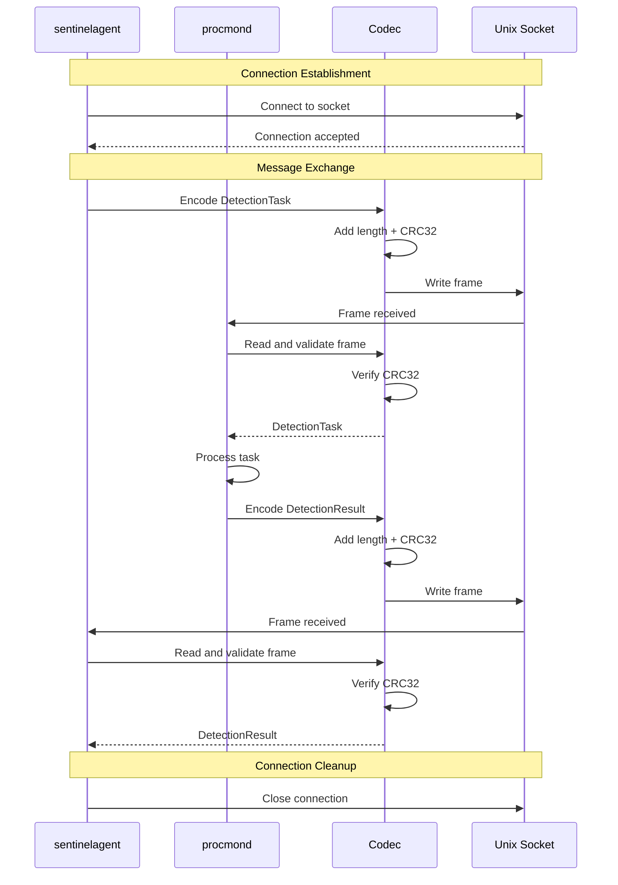
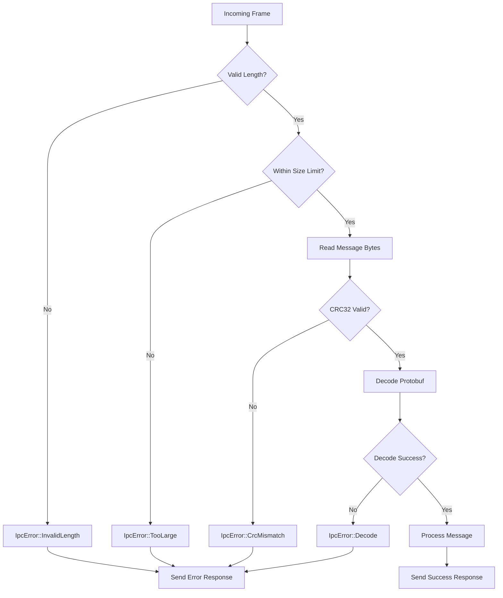

# Design Document

## Overview

SentinelD implements a three-component security architecture with strict privilege separation to provide continuous process monitoring and threat detection. The system is designed around the principle of minimal attack surface while maintaining high performance and audit-grade integrity.

The core design follows a pipeline architecture where process data flows from collection through detection to alerting, with each component having clearly defined responsibilities and security boundaries.

## Architecture

### Collector-Core Framework Architecture

The collector-core framework provides a unified foundation for multiple collection components, enabling extensible monitoring capabilities while maintaining shared operational infrastructure:

```text
┌─────────────────────────────────────────────────────────────────────────────────────┐
│                                collector-core Framework                              │
├─────────────────────────────────────────────────────────────────────────────────────┤
│  ┌─────────────────┐  ┌─────────────────┐  ┌─────────────────┐  ┌─────────────────┐ │
│  │   EventSource   │  │   EventSource   │  │   EventSource   │  │   EventSource   │ │
│  │   (Process)     │  │   (Network)     │  │  (Filesystem)   │  │ (Performance)   │ │
│  │                 │  │                 │  │                 │  │                 │ │
│  │ • sysinfo       │  │ • Netlink/WFP   │  │ • inotify/FSE   │  │ • /proc/perf    │ │
│  │ • /proc enum    │  │ • Packet cap    │  │ • File ops      │  │ • Resource mon  │ │
│  │ • Hash compute  │  │ • DNS monitor   │  │ • Access track  │  │ • System metrics│ │
│  └─────────────────┘  └─────────────────┘  └─────────────────┘  └─────────────────┘ │
│           │                     │                     │                     │        │
│           └─────────────────────┼─────────────────────┼─────────────────────┘        │
│                                 │                     │                              │
│  ┌─────────────────────────────────────────────────────────────────────────────────┐ │
│  │                        Collector Runtime                                        │ │
│  │  • Event aggregation and batching                                              │ │
│  │  • IPC server (protobuf + CRC32 framing)                                       │ │
│  │  • Configuration management and validation                                     │ │
│  │  • Structured logging and metrics                                              │ │
│  │  • Health checks and graceful shutdown                                         │ │
│  │  • Capability negotiation                                                      │ │
│  └─────────────────────────────────────────────────────────────────────────────────┘ │
└─────────────────────────────────────────────────────────────────────────────────────┘
                                         │
                                         ▼
                              ┌─────────────────┐
                              │  sentinelagent  │
                              │ (Orchestrator)  │
                              │                 │
                              │ • Task dispatch │
                              │ • Data aggreg.  │
                              │ • SQL detection │
                              │ • Alert mgmt    │
                              └─────────────────┘
```

**Core Framework Components**:

- **Universal EventSource Trait**: Abstracts collection methodology from operational infrastructure
- **Collector Runtime**: Manages event sources, IPC communication, and shared services
- **Extensible Event Model**: Supports multiple collection domains through unified event types
- **Shared Infrastructure**: Common configuration, logging, health checks, and capability negotiation

**Multi-Component Vision**:

1. **procmond**: Process monitoring using collector-core + process EventSource
2. **netmond**: Network monitoring using collector-core + network EventSource (future)
3. **fsmond**: Filesystem monitoring using collector-core + filesystem EventSource (future)
4. **perfmond**: Performance monitoring using collector-core + performance EventSource (future)

### Component Architecture

SentinelD consists of three main components that work together to provide comprehensive process monitoring, with procmond built on the collector-core framework:

```text
┌─────────────────┐    ┌─────────────────┐    ┌─────────────────┐
│    procmond     │    │  sentinelagent  │    │   sentinelcli   │
│ (collector-core │◀──▶│ (Orchestrator)  │◀───│  (Interface)    │
│   + process     │    │                 │    │                 │
│   EventSource)  │    │ • User space    │    │ • User space    │
│                 │    │ • SQL engine    │    │ • Queries       │
│ • Privileged    │    │ • Rule mgmt     │    │ • Management    │
│ • Process enum  │    │ • Detection     │    │ • Diagnostics   │
│ • Hash compute  │    │ • Alerting      │    │ • Config mgmt   │
│ • Audit logging │    │ • Network comm  │    │                 │
│ • Protobuf IPC  │    │ • Task dispatch │    │                 │
│ • Extensible    │    │ • Multi-domain  │    │                 │
│   architecture  │    │   correlation   │    │                 │
└─────────────────┘    └─────────────────┘    └─────────────────┘
         │                       │
         ▼                       ▼
┌─────────────────┐    ┌─────────────────┐
│  Audit Ledger   │    │   Event Store   │
│ (Merkle Tree)   │    │     (redb)      │
│ collector-core  │    │  sentinelagent  │
│   managed       │    │    managed      │
└─────────────────┘    └─────────────────┘

IPC Protocol: Protobuf + CRC32 framing over interprocess crate (existing implementation)
Communication: sentinelcli ↔ sentinelagent ↔ collector-core components
Service Management: sentinelagent manages collector-core component lifecycle
Extensibility: collector-core enables future business/enterprise tier functionality
```

### Data Flow Architecture

The system implements a pipeline processing model with clear phases and strict component separation:

1. **Collection Phase**: procmond enumerates processes and computes hashes
2. **SQL-to-IPC Translation**: sentinelagent uses sqlparser to extract collection requirements from SQL AST
3. **Task Generation**: Complex SQL detection rules translated into simple protobuf collection tasks
4. **IPC Communication**: procmond receives simple detection tasks via protobuf over IPC
5. **Overcollection Strategy**: procmond may overcollect data due to granularity limitations
6. **Audit Logging**: procmond writes to tamper-evident audit ledger (write-only; redb + rs-merkle Merkle tree)
7. **Detection Phase**: sentinelagent executes original SQL rules against collected/stored data
8. **Alert Generation**: Structured alerts with deduplication and context
9. **Delivery Phase**: Multi-channel alert delivery with reliability guarantees

**Key Architectural Principles**:

- procmond has minimal complexity and attack surface
- All complex logic (SQL, networking, redb) handled by sentinelagent
- IPC protocol is simple and purpose-built for security
- Clear separation between audit logging (procmond) and event processing (sentinelagent)
- Pure Rust stack with redb for optimal performance and security
- Zero unsafe code goal with any required unsafe code isolated to procmond only

## Components and Interfaces

### collector-core Framework

**Purpose**: Reusable collection infrastructure that enables multiple monitoring components while maintaining shared operational foundation

**Reusable Components from Existing Implementation**:

The collector-core framework will wrap and extend existing proven components:

- **IPC Infrastructure**: Complete interprocess crate integration (docs/src/technical/ipc-implementation.md)

  - `InterprocessServer` and `InterprocessClient` from sentinel-lib/src/ipc/
  - `IpcCodec` with CRC32 validation and frame protocol
  - `IpcConfig` with comprehensive timeout and security settings
  - Cross-platform transport layer (Unix sockets, Windows named pipes)

- **Process Collection Logic**: Existing ProcessMessageHandler (procmond/src/lib.rs)

  - `enumerate_processes()` using sysinfo crate
  - `convert_process_to_record()` with comprehensive metadata
  - `handle_detection_task()` with task routing and error handling
  - Support for process filtering and hash verification

- **Database Integration**: Existing storage layer (sentinel-lib/src/storage.rs)

  - `DatabaseManager` with redb backend
  - Table definitions and transaction handling
  - Serialization and error handling

- **Configuration Management**: Existing config system (sentinel-lib/src/config.rs)

  - `ConfigLoader` with hierarchical overrides
  - Environment variable and file-based configuration
  - Validation and error handling

- **Telemetry and Logging**: Existing observability (sentinel-lib/src/telemetry.rs)

  - `TelemetryCollector` for performance monitoring
  - Structured logging with tracing crate
  - Health check and metrics collection

**Key Interfaces**:

- `EventSource` trait for pluggable collection implementations
- `Collector` struct for runtime management and event aggregation
- `CollectionEvent` enum for unified event handling across domains
- `CollectorConfig` for shared configuration management

**Core Implementation**:

```rust
#[async_trait]
pub trait EventSource: Send + Sync {
    fn name(&self) -> &'static str;
    fn capabilities(&self) -> SourceCaps;
    async fn start(&self, tx: mpsc::Sender<CollectionEvent>) -> anyhow::Result<()>;
    async fn stop(&self) -> anyhow::Result<()>;
}

pub struct Collector {
    config: CollectorConfig,
    sources: Vec<Box<dyn EventSource>>,
    runtime: CollectorRuntime,
    ipc_server: IpcServer,
}

impl Collector {
    pub fn new(config: CollectorConfig) -> Self { ... }
    pub fn register<S: EventSource + 'static>(&mut self, source: S) { ... }
    pub async fn run(self) -> anyhow::Result<()> { ... }
}

#[derive(Debug, Clone)]
pub enum CollectionEvent {
    Process(ProcessEvent),
    Network(NetworkEvent),      // Future: netmond
    Filesystem(FilesystemEvent), // Future: fsmond
    Performance(PerformanceEvent), // Future: perfmond
}

bitflags! {
    pub struct SourceCaps: u32 {
        const PROCESS = 1 << 0;
        const NETWORK = 1 << 1;
        const FILESYSTEM = 1 << 2;
        const PERFORMANCE = 1 << 3;
        const REALTIME = 1 << 4;
        const KERNEL_LEVEL = 1 << 5;
        const SYSTEM_WIDE = 1 << 6;
    }
}
```

**Shared Infrastructure**:

- **Configuration Management**: **EXISTING** Hierarchical config loading with validation (sentinel-lib/src/config.rs)
- **Logging Infrastructure**: **EXISTING** Structured tracing with JSON output and metrics (sentinel-lib/src/telemetry.rs)
- **IPC Server**: **EXISTING** Protobuf-based communication with sentinelagent (sentinel-lib/src/ipc/)
- **Health Monitoring**: **EXISTING** Component status tracking and graceful shutdown
- **Event Batching**: **NEW** Efficient event aggregation and backpressure handling
- **Capability Negotiation**: **NEW** Dynamic feature discovery and task routing

**Integration with Existing Components**:

```rust
// Refactored procmond using collector-core + existing components
fn main() -> anyhow::Result<()> {
    // EXISTING: Reuse CLI parsing and initialization
    let cli = Cli::parse();
    tracing_subscriber::fmt::init();

    // EXISTING: Reuse configuration loading
    let config_loader = config::ConfigLoader::new("procmond");
    let config = config_loader.load()?;

    // EXISTING: Reuse database initialization
    let db_manager = Arc::new(Mutex::new(storage::DatabaseManager::new(&cli.database)?));

    // NEW: Create collector-core with existing components
    let collector_config = CollectorConfig::from(config);
    let mut collector = collector_core::Collector::new(collector_config);

    // NEW: Register process source wrapping existing ProcessMessageHandler
    let process_handler = ProcessMessageHandler::new(Arc::clone(&db_manager));
    let process_source = ProcessEventSource::new(process_handler, config.app.clone());
    collector.register(process_source);

    // EXISTING: Reuse IPC server creation with collector-core integration
    collector.run().await
}

// ProcessEventSource wraps existing ProcessMessageHandler
pub struct ProcessEventSource {
    handler: ProcessMessageHandler,  // EXISTING: Complete process logic
    config: AppConfig,               // EXISTING: Configuration structure
}

#[async_trait]
impl EventSource for ProcessEventSource {
    fn name(&self) -> &'static str { "process-monitor" }

    fn capabilities(&self) -> SourceCaps {
        SourceCaps::PROCESS | SourceCaps::REALTIME | SourceCaps::SYSTEM_WIDE
    }

    async fn start(&self, tx: mpsc::Sender<CollectionEvent>) -> anyhow::Result<()> {
        // EXISTING: Reuse ProcessMessageHandler.enumerate_processes logic
        loop {
            let task = DetectionTask {
                task_id: format!("scan-{}", chrono::Utc::now().timestamp_millis()),
                task_type: ProtoTaskType::EnumerateProcesses as i32,
                process_filter: None,
                hash_check: None,
                metadata: None,
            };

            let result = self.handler.enumerate_processes(&task).await?;

            for process in result.processes {
                let event = CollectionEvent::Process(ProcessEvent::from(process));
                tx.send(event).await?;
            }

            tokio::time::sleep(Duration::from_millis(self.config.scan_interval_ms)).await;
        }
    }
}
```

**Multi-Component Support**:

```rust
// Example: Future network monitoring component
fn main() -> anyhow::Result<()> {
    let config = collector_core::config::load()?;
    let mut collector = collector_core::Collector::new(config);

    // Register network collection sources
    collector.register(NetworkEventSource::new()?);

    #[cfg(target_os = "linux")]
    collector.register(NetlinkSource::new()?);

    collector.run().await
}
```

### procmond (Process Collection Component)

**Purpose**: Process monitoring implementation using collector-core framework with process-specific EventSource

**Key Interfaces**:

- `ProcessEventSource` implementing the EventSource trait
- **EXISTING**: `ProcessMessageHandler` for process enumeration and task handling (from procmond/src/lib.rs)
- **EXISTING**: `IpcConfig` and IPC server creation (from procmond/src/ipc/mod.rs)
- **EXISTING**: Database integration via `storage::DatabaseManager` (from sentinel-lib)
- Integration with collector-core runtime and existing IPC infrastructure

**Core Implementation**:

```rust
pub struct ProcessEventSource {
    collector: Box<dyn ProcessCollector>,
    hash_computer: Box<dyn HashComputer>,
    config: ProcessConfig,
}

#[async_trait]
impl EventSource for ProcessEventSource {
    fn name(&self) -> &'static str { "process-monitor" }

    fn capabilities(&self) -> SourceCaps {
        SourceCaps::PROCESS | SourceCaps::REALTIME | SourceCaps::SYSTEM_WIDE
    }

    async fn start(&self, tx: mpsc::Sender<CollectionEvent>) -> anyhow::Result<()> {
        // Process enumeration and event generation
        loop {
            let processes = self.collector.enumerate_processes().await?;
            for process in processes {
                let event = CollectionEvent::Process(ProcessEvent::from(process));
                tx.send(event).await?;
            }
            tokio::time::sleep(self.config.scan_interval).await;
        }
    }
}

// Simplified procmond main using collector-core
fn main() -> anyhow::Result<()> {
    let config = collector_core::config::load()?;
    let mut collector = collector_core::Collector::new(config);

    // Register process monitoring source
    collector.register(ProcessEventSource::new()?);

    collector.run().await
}
```

**Security Boundaries**:

- Starts with minimal privileges, optionally requests enhanced access
- Drops all elevated privileges immediately after initialization
- No network access whatsoever
- No SQL parsing or complex query logic
- Write-only access to audit ledger (managed by collector-core)
- Cross-platform IPC via interprocess crate (managed by collector-core)
- Purpose-built for stability and minimal attack surface
- Zero unsafe code goal; any required unsafe code isolated to highly structured, tested modules
- Leverages collector-core framework for operational infrastructure

### sentinelagent (Detection Orchestrator)

**Purpose**: User-space detection rule execution, alert management, and collector-core component lifecycle management

**Key Interfaces**:

- `DetectionEngine` trait for SQL rule execution
- `AlertManager` trait for alert generation and deduplication
- `AlertSink` trait for pluggable delivery channels
- `RuleManager` trait for rule loading and validation
- `ProcessManager` trait for procmond lifecycle management

**Core Implementation**:

```rust
pub struct DetectionEngine {
    db: redb::Database,
    rule_manager: RuleManager,
    alert_manager: AlertManager,
    sql_validator: SqlValidator,
    ipc_client: IpcClient,
}

#[async_trait]
pub trait DetectionEngine {
    async fn execute_rules(&self, scan_id: i64) -> Result<Vec<Alert>>;
    async fn validate_sql(&self, query: &str) -> Result<ValidationResult>;
}
```

**Security Boundaries**:

- Operates in user space with minimal privileges
- Manages redb event store (read/write access)
- **SQL-to-IPC Translation**: Uses sqlparser to analyze SQL detection rules and extract collection requirements
- **Task Generation**: Translates complex SQL queries into simple protobuf collection tasks for collector-core components
- **Multi-Domain Correlation**: Aggregates events from multiple collection domains (process, network, filesystem, performance)
- **Overcollection Handling**: May request broader data collection than SQL requires, then applies SQL filtering to stored data
- **Privilege Separation**: SQL execution never directly touches live processes; only simple collection tasks sent via IPC
- Outbound-only network connections for alert delivery
- Sandboxed rule execution with resource limits
- IPC client for communication with collector-core components via interprocess crate
- Manages collector-core component lifecycle (start, stop, restart, health monitoring)
- **Capability Negotiation**: Discovers available monitoring capabilities from collector-core components

**Service Management**:

- Primary service registered with system service manager (systemd, launchd, Windows Service)
- Responsible for starting and monitoring procmond as a child process
- Handles graceful shutdown coordination between components
- Manages service dependencies and startup ordering
- Provides unified logging and health reporting for the entire system

### sentinelcli (Operator Interface)

**Purpose**: Command-line interface for queries, management, and diagnostics

**Key Interfaces**:

- `QueryExecutor` trait for safe SQL query execution
- `RuleManager` trait for rule management operations
- `HealthChecker` trait for system diagnostics
- `DataExporter` trait for data export functionality

**Core Implementation**:

```rust
pub struct QueryExecutor {
    db: redb::Database,
    sql_validator: SqlValidator,
    output_formatter: OutputFormatter,
}

#[async_trait]
pub trait QueryExecutor {
    async fn execute_query(&self, query: &str, params: &[Value]) -> Result<QueryResult>;
    async fn export_data(&self, format: ExportFormat, filter: &Filter) -> Result<ExportResult>;
}
```

**Security Boundaries**:

- No network access
- No direct database access (communicates through sentinelagent)
- Input validation for all user-provided data
- Safe SQL execution via sentinelagent with prepared statements
- Communicates only with sentinelagent for all operations

### IPC Protocol Design

**Purpose**: Secure, efficient communication between collector-core components and sentinelagent

**Protocol Specification** (extending existing protobuf definitions):

```protobuf
syntax = "proto3";

// NEW: Capability negotiation between collector-core and sentinelagent
message CollectionCapabilities {
    bool supports_processes = 1;
    bool supports_network = 2;      // Future: netmond
    bool supports_filesystem = 3;   // Future: fsmond
    bool supports_performance = 4;  // Future: perfmond
    bool kernel_level = 5;
    bool realtime = 6;
    bool system_wide = 7;
}

// EXISTING: Detection tasks (from ipc.proto) - extend for future components
message DetectionTask {
    string task_id = 1;
    TaskType task_type = 2;
    optional ProcessFilter process_filter = 3;
    optional HashCheck hash_check = 4;
    optional string metadata = 5;
    // NEW: Future extensions for additional collection domains
    optional NetworkFilter network_filter = 6;    // Future: netmond
    optional FilesystemFilter fs_filter = 7;      // Future: fsmond
    optional PerformanceFilter perf_filter = 8;   // Future: perfmond
}

// EXISTING: Task types (from common.proto) - extend for future components
enum TaskType {
    ENUMERATE_PROCESSES = 0;
    CHECK_PROCESS_HASH = 1;
    MONITOR_PROCESS_TREE = 2;
    VERIFY_EXECUTABLE = 3;
    // NEW: Future task types
    MONITOR_NETWORK_CONNECTIONS = 4;    // Future: netmond
    TRACK_FILE_OPERATIONS = 5;          // Future: fsmond
    COLLECT_PERFORMANCE_METRICS = 6;    // Future: perfmond
}

// EXISTING: Process filtering (from common.proto)
message ProcessFilter {
    repeated string process_names = 1;
    repeated uint32 pids = 2;
    optional string executable_pattern = 3;
}

// EXISTING: Hash verification (from common.proto)
message HashCheck {
    string expected_hash = 1;
    string hash_algorithm = 2;
    string executable_path = 3;
}

// EXISTING: Detection results (from ipc.proto) - extend for future components
message DetectionResult {
    string task_id = 1;
    bool success = 2;
    optional string error_message = 3;
    repeated ProcessRecord processes = 4;
    optional HashResult hash_result = 5;
    // NEW: Future extensions for additional collection domains
    repeated NetworkRecord network_events = 6;    // Future: netmond
    repeated FilesystemRecord fs_events = 7;      // Future: fsmond
    repeated PerformanceRecord perf_events = 8;   // Future: perfmond
}

// EXISTING: Process record (from common.proto)
message ProcessRecord {
    uint32 pid = 1;
    optional uint32 ppid = 2;
    string name = 3;
    optional string executable_path = 4;
    repeated string command_line = 5;
    optional int64 start_time = 6;
    optional double cpu_usage = 7;
    optional uint64 memory_usage = 8;
    optional string executable_hash = 9;
    optional string hash_algorithm = 10;
    optional string user_id = 11;
    bool accessible = 12;
    bool file_exists = 13;
    int64 collection_time = 14;
}
```

**Transport Layer (Existing Interprocess Implementation)**:

- **Implementation**: **EXISTING** `interprocess` crate integration from docs/src/technical/ipc-implementation.md
- **Unix/Linux/macOS**: Unix domain sockets with owner-only permissions (0700 dir, 0600 socket)
- **Windows**: Named pipes with appropriate security descriptors
- **Frame Protocol**: **EXISTING** Length-delimited protobuf messages with CRC32 integrity validation
- **Codec**: **EXISTING** `IpcCodec` with BytesMut buffers, timeout handling, and comprehensive error types
- **Security**: **EXISTING** No network access, local-only endpoints, connection limits
- **Reliability**: **EXISTING** Async message handling, graceful shutdown, and proper cleanup
- **Configuration**: **EXISTING** `IpcConfig` with timeouts, limits, and CRC32 variant selection
- **Error Handling**: **EXISTING** Comprehensive `IpcError` types with automatic reconnection and exponential backoff

### IPC Protocol Flow



### Error Handling Flow



## Data Models

### Core Data Structures

**ProcessRecord**: Represents a single process snapshot (existing implementation in sentinel-lib/src/models/process.rs)

```rust
// Existing ProcessRecord structure (from protobuf and Rust models)
#[derive(Debug, Clone, Serialize, Deserialize)]
pub struct ProcessRecord {
    pub pid: u32,
    pub ppid: Option<u32>,
    pub name: String,
    pub executable_path: Option<String>,
    pub command_line: Vec<String>,
    pub start_time: Option<i64>,
    pub cpu_usage: Option<f64>,
    pub memory_usage: Option<u64>,
    pub executable_hash: Option<String>,
    pub hash_algorithm: Option<String>,
    pub user_id: Option<String>,
    pub accessible: bool,
    pub file_exists: bool,
    pub collection_time: i64, // Unix timestamp in milliseconds
    // Additional fields for collector-core integration
    pub id: Uuid,     // NEW: Unique record identifier
    pub scan_id: i64, // NEW: Collection cycle identifier
}
```

**Alert**: Represents a detection result with full context (existing implementation in sentinel-lib/src/models/alert.rs)

```rust
// Existing Alert structure (from sentinel-lib models)
#[derive(Debug, Clone, Serialize, Deserialize)]
pub struct Alert {
    pub id: AlertId, // Existing: Uuid wrapper
    pub alert_time: i64,
    pub rule_id: String,
    pub title: String,
    pub description: String,
    pub severity: AlertSeverity,
    pub scan_id: Option<i64>,
    pub affected_processes: Vec<u32>,
    pub process_count: i32,
    pub alert_data: serde_json::Value,
    pub rule_execution_time_ms: Option<i64>,
    pub dedupe_key: String,
}

// Existing AlertSeverity enum
#[derive(Debug, Clone, Serialize, Deserialize)]
pub enum AlertSeverity {
    Low,
    Medium,
    High,
    Critical,
}
```

**DetectionRule**: SQL-based detection rule with metadata (existing implementation in sentinel-lib/src/models/rule.rs)

```rust
// Existing DetectionRule structure (from sentinel-lib models)
#[derive(Debug, Clone, Serialize, Deserialize)]
pub struct DetectionRule {
    pub id: RuleId, // Existing: String wrapper
    pub name: String,
    pub description: Option<String>,
    pub version: i32,
    pub sql_query: String,
    pub enabled: bool,
    pub severity: AlertSeverity,
    pub category: Option<String>,
    pub tags: Vec<String>,
    pub author: Option<String>,
    pub created_at: i64,
    pub updated_at: i64,
    pub source_type: RuleSourceType,
    pub source_path: Option<PathBuf>,
}

// Existing RuleSourceType enum
#[derive(Debug, Clone, Serialize, Deserialize)]
pub enum RuleSourceType {
    Builtin,
    File,
    User,
}
```

### Database Schema Design

The system uses redb (pure Rust embedded database) for optimal performance and security:

**Core Tables**:

- `processes`: Process snapshots with comprehensive metadata
- `scans`: Collection cycle metadata and statistics
- `detection_rules`: Rule definitions with versioning (rules translated to simple tasks for procmond)
- `alerts`: Generated alerts with execution context
- `alert_deliveries`: Delivery tracking with retry information

**Audit Ledger** (redb + rs-merkle, CT-style Merkle log):

The audit ledger is an append-only Merkle tree backed by `redb` rather than a relational schema. It provides tamper-evident logging with inclusion proofs and periodic signed checkpoints.

Key Concepts:

- Append-only sequence of canonical JSON leaf entries.
- BLAKE3 used for leaf hashing (uniform algorithm per lineage).
- Incremental Merkle root updated each append (`O(log n)` path).
- Inclusion proofs (sibling hash list) generated on demand; optionally cached.
- Periodic checkpoints `(tree_size, root_hash[, signature])` persisted for rapid recovery & external audit.
- Optional Ed25519 signatures over `(tree_size || root_hash)` for auditor trust anchoring.
- Air‑gap export: Signed checkpoints + sampled proofs can be exported for offline verification.

redb Logical Layout (conceptual):

- `AUDIT_LEDGER (u64 -> AuditEntry)`
- `AUDIT_CHECKPOINTS (u64 tree_size -> Checkpoint)`

Simplified Data Structures (illustrative):

```rust
#[derive(Serialize, Deserialize, Clone)]
struct AuditEntry {
    id: u64,    // monotonic
    ts_ms: i64, // epoch millis
    actor: String,
    action: String,
    payload: serde_json::Value,
    leaf_hash: [u8; 32],                    // BLAKE3(canonical_leaf)
    tree_size: u64,                         // size AFTER insertion
    root_hash: [u8; 32],                    // Merkle root at tree_size
    inclusion_proof: Option<Vec<[u8; 32]>>, // optional cached siblings
    checkpoint_sig: Option<Vec<u8>>,        // optional signature at this state
}

#[derive(Serialize, Deserialize, Clone)]
struct Checkpoint {
    tree_size: u64,
    root_hash: [u8; 32],
    created_at_ms: i64,
    signature: Option<Vec<u8>>, // Ed25519(tree_size || root_hash)
}
```

rs-merkle Integration (minimal sketch):

```rust
use blake3;
use rs_merkle::{Hasher, MerkleProof, MerkleTree};

#[derive(Clone, Debug)]
struct Blake3Hasher;
impl Hasher for Blake3Hasher {
    type Hash = [u8; 32];
    fn hash(data: &[u8]) -> Self::Hash {
        *blake3::hash(data).as_bytes()
    }
}

fn canonical_leaf(actor: &str, action: &str, payload: &serde_json::Value, ts_ms: i64) -> Vec<u8> {
    // Fixed key order for stability; if stronger guarantees needed adopt RFC 8785 canonical JSON.
    serde_json::to_vec(&serde_json::json!({"a": actor, "ac": action, "p": payload, "ts": ts_ms}))
        .unwrap()
}

fn append(
    tree: &mut MerkleTree<Blake3Hasher>,
    leaves: &mut Vec<[u8; 32]>,
    actor: &str,
    action: &str,
    payload: &serde_json::Value,
    ts_ms: i64,
) -> (u64, [u8; 32], Vec<[u8; 32]>) {
    let leaf_bytes = canonical_leaf(actor, action, payload, ts_ms);
    let leaf_hash = Blake3Hasher::hash(&leaf_bytes);
    tree.insert(leaf_hash).commit();
    leaves.push(leaf_hash);
    let size = leaves.len() as u64;
    let root = tree.root().expect("root present after append");
    let proof = tree.proof(&[(size - 1) as usize]);
    (size, root, proof.proof_hashes().to_vec())
}

fn verify(
    root: [u8; 32],
    index: u64,
    total: u64,
    leaf_hash: [u8; 32],
    siblings: &[[u8; 32]],
) -> bool {
    let proof = MerkleProof::<Blake3Hasher>::new(siblings.to_vec());
    proof.verify(root, &[index as usize], &[leaf_hash], total as usize)
}
```

Operational Flow:

- Append Path: canonicalize → hash → insert → commit → record root → (optional) store proof.
- Checkpoint: every N appends or T seconds persist `(tree_size, root_hash[, signature])`.
- Recovery: load max checkpoint, replay subsequent entries, validate root; enter safe mode if mismatch.
- Proof Serving: regenerate on demand if not cached (logarithmic complexity).
- Pruning: logical tombstone retains leaf hash; full physical pruning requires rebuild under maintenance.

Security Invariants:

1. Canonical serialization stability; change requires full tree rebuild + lineage reset.
2. Single monotonic root sequence; no forks outside controlled offline maintenance.
3. Uniform hash algorithm (BLAKE3) per lineage.
4. Signed checkpoints (if enabled) anchor external trust.
5. Inclusion verification inputs: `(root, leaf_index, total_leaves_at_checkpoint, leaf_hash, siblings[])`.

Future Enhancements:

- Domain separation tags for leaf vs internal nodes (e.g., `BLAKE3("SD_LEAF" || data)`).
- Multi-proof batching for range forensic queries.
- RFC 8785 canonical JSON implementation for cross-implementation determinism.
- Streaming proof generation API for bulk verification.

## Error Handling

### Error Architecture

The system implements a layered error handling approach using Rust's type system:

**Library Errors** (using `thiserror`):

```rust
#[derive(Error, Debug)]
pub enum CollectionError {
    #[error("Process enumeration failed: {source}")]
    EnumerationFailed { source: std::io::Error },

    #[error("Hash computation failed for {path}: {source}")]
    HashComputationFailed {
        path: PathBuf,
        source: std::io::Error,
    },

    #[error("Database write failed: {source}")]
    DatabaseWriteFailed { source: rusqlite::Error },

    #[error("Backpressure policy triggered: {policy}")]
    BackpressureTriggered { policy: String },
}

#[derive(Error, Debug)]
pub enum DetectionError {
    #[error("SQL validation failed: {reason}")]
    SqlValidationFailed { reason: String },

    #[error("Rule execution timeout: {rule_id}")]
    RuleExecutionTimeout { rule_id: String },

    #[error("Alert generation failed: {source}")]
    AlertGenerationFailed {
        source: Box<dyn std::error::Error + Send + Sync>,
    },
}
```

**Application Errors** (using `anyhow`):

- Context-rich error chains for debugging
- Graceful degradation with detailed logging
- Recovery strategies for transient failures

### Recovery Strategies

**Process Collection**:

- Continue enumeration when individual processes are inaccessible
- Graceful degradation when enhanced privileges are unavailable
- Automatic retry for transient system errors

**Detection Engine**:

- Rule execution timeouts with cleanup
- Circuit breakers for persistently failing rules
- Fallback to essential rules when resources are constrained

**Alert Delivery**:

- Exponential backoff with jitter for failed deliveries
- Circuit breaker pattern for unhealthy sinks
- Dead letter queue for permanently failed alerts

## Testing Strategy

### Testing Architecture

The system implements comprehensive testing across multiple levels:

**Unit Testing**:

- Component isolation with mock dependencies
- Property-based testing with `proptest` for edge cases
- Cryptographic function verification
- SQL query validation and AST parsing

**Integration Testing**:

- Cross-component interaction testing
- Database schema and migration testing
- CLI interface testing with `insta` for snapshot testing
- Platform-specific functionality verification

**Performance Testing**:

- Criterion benchmarks for critical paths
- Load testing with synthetic high-process scenarios
- Memory usage profiling and leak detection
- Database performance under concurrent load

**Security Testing**:

- SQL injection prevention with comprehensive test vectors
- Privilege boundary verification
- Input validation fuzzing with `cargo-fuzz`
- Cryptographic audit chain verification

### Test Data Management

**Synthetic Data Generation**:

```rust
use proptest::prelude::*;

prop_compose! {
    fn arb_process_record()(
        pid in 1u32..65535,
        name in "[a-zA-Z][a-zA-Z0-9_-]{1,15}",
        cpu_usage in prop::option::of(0.0f64..100.0),
        memory_usage in prop::option::of(1024u64..1_073_741_824), // 1KB to 1GB
    ) -> ProcessRecord {
        ProcessRecord {
            id: Uuid::new_v4(),
            pid,
            name,
            cpu_usage,
            memory_usage,
            // ... other fields
        }
    }
}
```

**Snapshot Testing**:

- CLI output validation with `insta`
- Alert format consistency verification
- Configuration file parsing validation

### Continuous Integration

**Test Matrix**:

- Linux (Ubuntu 20.04, 22.04)
- macOS (latest)
- Windows (latest)
- Rust versions: stable, beta, MSRV (1.70+)

**Quality Gates**:

- Zero warnings with `clippy -- -D warnings`
- Code coverage >85% with `llvm-cov`
- Performance regression detection
- Security vulnerability scanning with `cargo audit`

## Security Considerations

### Memory Safety and Unsafe Code Policy

**Zero Unsafe Code Goal**: The entire codebase targets zero unsafe code usage through:

- Rust's ownership system and borrow checker for memory safety
- Careful selection of safe dependencies and crates
- Comprehensive testing to verify memory safety guarantees
- Static analysis tools to detect potential safety issues

**Unsafe Code Isolation** (if absolutely required):

```rust
// Only in procmond, highly structured and isolated
mod unsafe_platform_specific {
    use std::ffi::c_void;

    /// SAFETY: This function is only called with valid process handles
    /// and all invariants are documented and tested
    pub unsafe fn get_process_memory_info(handle: *const c_void) -> Result<MemoryInfo> {
        // Minimal, well-documented unsafe operations
        // Comprehensive safety documentation
        // Extensive testing including edge cases
    }
}

// Safe wrapper that encapsulates all unsafe operations
pub struct SafeProcessMemoryReader {
    // All public APIs are safe
}

impl SafeProcessMemoryReader {
    pub fn get_memory_info(&self, pid: u32) -> Result<MemoryInfo> {
        // Safe interface that internally uses unsafe_platform_specific
        // with all safety invariants maintained
    }
}
```

**Safety Verification**:

- Miri testing for undefined behavior detection
- AddressSanitizer integration where available
- Comprehensive unit tests for all unsafe code paths
- Documentation of all safety invariants and preconditions

### SQL Injection Prevention

**AST Validation**: All user-provided SQL undergoes comprehensive validation:

```rust
pub struct SqlValidator {
    parser: sqlparser::Parser<sqlparser::dialect::SQLiteDialect>,
    allowed_functions: HashSet<String>,
}

impl SqlValidator {
    pub fn validate_query(&self, sql: &str) -> Result<ValidationResult> {
        let ast = self.parser.parse_sql(sql)?;

        for statement in &ast {
            match statement {
                Statement::Query(query) => self.validate_select_query(query)?,
                _ => return Err(ValidationError::ForbiddenStatement),
            }
        }

        Ok(ValidationResult::Valid)
    }

    fn validate_select_query(&self, query: &Query) -> Result<()> {
        // Validate SELECT body, WHERE clauses, functions, etc.
        // Reject any non-whitelisted constructs
    }
}
```

**Execution Sandboxing**:

- Read-only database connections for rule execution
- Query timeouts and memory limits
- Resource cleanup after execution
- Audit logging of all query attempts

### Privilege Management

**Capability-Based Security**:

```rust
pub struct PrivilegeManager {
    initial_privileges: Privileges,
    current_privileges: Privileges,
    drop_completed: bool,
}

impl PrivilegeManager {
    pub async fn request_enhanced_privileges(&mut self) -> Result<()> {
        // Platform-specific privilege escalation
        #[cfg(target_os = "linux")]
        self.request_linux_capabilities()?;

        #[cfg(target_os = "windows")]
        self.request_windows_privileges()?;

        #[cfg(target_os = "macos")]
        self.request_macos_entitlements()?;

        Ok(())
    }

    pub async fn drop_privileges(&mut self) -> Result<()> {
        // Immediate privilege drop after initialization
        self.drop_all_elevated_privileges()?;
        self.drop_completed = true;
        self.audit_privilege_drop().await?;
        Ok(())
    }
}
```

### Cryptographic Integrity

Refer to the earlier **Audit Ledger (redb + rs-merkle, CT-style Merkle log)** section for full data structures and code sketch. This subsection summarizes cryptographic guarantees without duplicating implementation details:

Core Guarantees:

- Append-only sequencing with monotonic `tree_size` mapped to Merkle roots.
- Canonical JSON leaf serialization → BLAKE3 leaf hash → rs-merkle insertion.
- Inclusion proofs (logarithmic sibling path) verifiable offline using `(root, index, total, leaf_hash, siblings[])`.
- Periodic checkpoints (root + tree_size [+ signature]) enable rapid recovery & external attestation.
- Optional Ed25519 signatures provide trust anchor continuity across exports / air‑gapped validation.

Security Invariants:

1. Single linear history (no forks) outside controlled maintenance rebuilds.
2. Uniform hash algorithm per lineage (BLAKE3) with potential future domain separation tags.
3. Checkpoint verification failure forces safe-mode replay / halt before accepting new appends.
4. Proof regeneration does not mutate state; cached proofs are an optimization only.
5. Canonical format change requires full rebuild and lineage version bump.

See also: `database-standards.mdc` for operational procedures (recovery, pruning, checkpoint export) and future enhancements roadmap.
