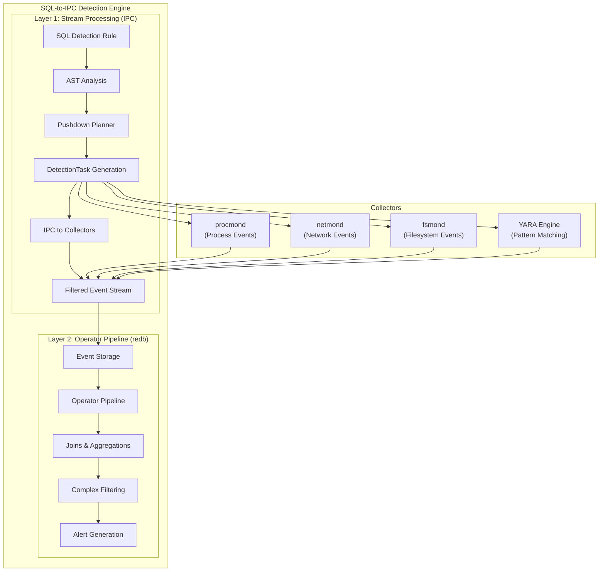
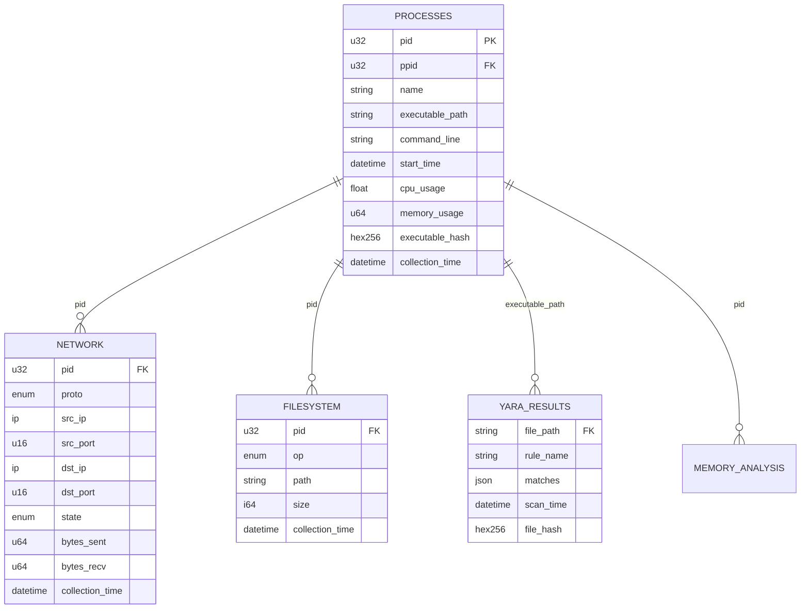

# Design Document

## Overview

The SQL-to-IPC Detection Engine represents a paradigm shift in security monitoring architecture, bridging the gap between familiar SQL-based detection rules and high-performance, distributed collection systems. The engine enables security operators to write detection rules in standard SQL while automatically translating them into efficient, pushdown-optimized collection tasks.

The system operates through a revolutionary two-layer architecture that combines the best of both worlds: the familiarity and expressiveness of SQL with the performance benefits of purpose-built, distributed collection systems.

## Architecture

### Two-Layer Detection Architecture

The SQL-to-IPC Detection Engine implements a sophisticated two-layer processing model:



**Layer 1: Stream Processing (IPC)**

- Low-latency filtering and projection
- Collectors push only needed records based on pushdown analysis
- Minimal data transfer and processing overhead
- Real-time event streaming with backpressure handling

**Layer 2: Operator Pipeline (redb)**

- Complex operations: joins, aggregations, time windows
- SQL parsed into logical plans and executed over redb
- Bounded memory operations with cardinality caps
- Full SQL expressiveness for complex detection logic

### Virtual Database Schema Model

Each collector contributes a **virtual schema** - logical, read-only tables backed by event streams:



**Key Principles:**

- **Logical Views:** SQL rules treated as logical views, not materialized tables
- **Pushdown Optimization:** Simple predicates pushed to collectors
- **Bounded Memory:** All operations use cardinality caps and time windows
- **Global Catalog:** Unified namespace across all collector types

## Components and Interfaces

### Regex Compiler and Cache

**Purpose:** Compile and cache regex patterns with performance bounds and monitoring

```rust
pub struct RegexCompiler {
    cache: Arc<RwLock<LruCache<String, CompiledRegex>>>,
    config: RegexConfig,
    metrics: Arc<RegexMetrics>,
}

#[derive(Debug, Clone)]
pub struct RegexConfig {
    pub max_pattern_latency_ms: u64,   // Default: 10ms
    pub compilation_timeout_ms: u64,   // Default: 100ms
    pub max_memory_per_pattern: usize, // Default: 1MB
    pub cache_size: usize,             // Default: 1000 patterns
    pub enable_precompilation: bool,   // Default: true
    pub monitoring_enabled: bool,      // Default: true
    pub alert_threshold_ms: u64,       // Default: 5ms
}

#[derive(Debug)]
pub struct CompiledRegex {
    pub regex: regex::Regex,
    pub pattern_hash: u64,
    pub compilation_time_ms: u64,
    pub estimated_memory_usage: usize,
    pub complexity_score: f64,
    pub created_at: std::time::Instant,
}

#[derive(Debug, Clone)]
pub struct CompiledRegexPattern {
    pub original_pattern: String,
    pub compiled_regex: Arc<CompiledRegex>,
    pub column_reference: String,
    pub performance_stats: RegexPerformanceStats,
}

#[derive(Debug, Clone, Default)]
pub struct RegexPerformanceStats {
    pub execution_count: u64,
    pub total_execution_time_ms: u64,
    pub max_execution_time_ms: u64,
    pub cache_hits: u64,
    pub cache_misses: u64,
    pub timeout_violations: u64,
    pub memory_violations: u64,
}

impl RegexCompiler {
    pub fn new(config: RegexConfig) -> Self {
        Self {
            cache: Arc::new(RwLock::new(LruCache::new(config.cache_size))),
            config,
            metrics: Arc::new(RegexMetrics::new()),
        }
    }

    pub fn compile_pattern(&self, pattern: &str) -> Result<Arc<CompiledRegex>, RegexError> {
        let pattern_hash = self.hash_pattern(pattern);

        // Check cache first
        {
            let cache = self.cache.read().unwrap();
            if let Some(compiled) = cache.get(&pattern_hash.to_string()) {
                self.metrics.record_cache_hit();
                return Ok(compiled.clone());
            }
        }

        self.metrics.record_cache_miss();

        // Compile with timeout and resource limits
        let start_time = std::time::Instant::now();
        let compiled = self.compile_with_limits(pattern)?;
        let compilation_time = start_time.elapsed().as_millis() as u64;

        if compilation_time > self.config.compilation_timeout_ms {
            return Err(RegexError::CompilationTimeout {
                pattern: pattern.to_string(),
                timeout_ms: self.config.compilation_timeout_ms,
                actual_ms: compilation_time,
            });
        }

        let compiled_regex = Arc::new(CompiledRegex {
            regex: compiled,
            pattern_hash,
            compilation_time_ms: compilation_time,
            estimated_memory_usage: self.estimate_memory_usage(pattern),
            complexity_score: self.calculate_complexity_score(pattern),
            created_at: std::time::Instant::now(),
        });

        // Cache the compiled pattern
        {
            let mut cache = self.cache.write().unwrap();
            cache.put(pattern_hash.to_string(), compiled_regex.clone());
        }

        self.metrics.record_compilation(compilation_time);
        Ok(compiled_regex)
    }

    pub fn execute_pattern(
        &self,
        compiled: &CompiledRegex,
        text: &str,
        stats: &mut RegexPerformanceStats,
    ) -> Result<bool, RegexError> {
        let start_time = std::time::Instant::now();

        // Execute with timeout
        let result =
            self.execute_with_timeout(&compiled.regex, text, self.config.max_pattern_latency_ms)?;

        let execution_time = start_time.elapsed().as_millis() as u64;

        // Update performance statistics
        stats.execution_count += 1;
        stats.total_execution_time_ms += execution_time;
        stats.max_execution_time_ms = stats.max_execution_time_ms.max(execution_time);

        if execution_time > self.config.max_pattern_latency_ms {
            stats.timeout_violations += 1;
            self.metrics.record_timeout_violation();

            if self.config.monitoring_enabled {
                tracing::warn!(
                    pattern_hash = compiled.pattern_hash,
                    execution_time_ms = execution_time,
                    limit_ms = self.config.max_pattern_latency_ms,
                    "Regex pattern exceeded execution timeout"
                );
            }
        }

        if execution_time > self.config.alert_threshold_ms {
            self.metrics.record_slow_execution(execution_time);
        }

        Ok(result)
    }

    fn compile_with_limits(&self, pattern: &str) -> Result<regex::Regex, RegexError> {
        // Validate pattern complexity before compilation
        self.validate_pattern_complexity(pattern)?;

        // Use regex builder with size limits
        let regex = regex::RegexBuilder::new(pattern)
            .size_limit(self.config.max_memory_per_pattern)
            .dfa_size_limit(self.config.max_memory_per_pattern / 2)
            .build()
            .map_err(|e| RegexError::CompilationFailed {
                pattern: pattern.to_string(),
                error: e.to_string(),
            })?;

        Ok(regex)
    }

    fn validate_pattern_complexity(&self, pattern: &str) -> Result<(), RegexError> {
        // Check for catastrophic backtracking patterns
        if self.has_exponential_complexity(pattern) {
            return Err(RegexError::ExponentialComplexity {
                pattern: pattern.to_string(),
                reason: "Pattern contains nested quantifiers or excessive alternation".to_string(),
            });
        }

        // Check pattern length limits
        if pattern.len() > 1024 {
            return Err(RegexError::PatternTooLong {
                pattern_length: pattern.len(),
                max_length: 1024,
            });
        }

        Ok(())
    }

    fn has_exponential_complexity(&self, pattern: &str) -> bool {
        // Detect patterns like (a+)+, (a*)*, (a|a)*
        let dangerous_patterns = [
            r"\([^)]*\+\)\+",          // (a+)+
            r"\([^)]*\*\)\*",          // (a*)*
            r"\([^)]*\|\1\)\*",        // (a|a)*
            r"\([^)]*\{[0-9]+,\}\)\+", // (a{n,})+
        ];

        for dangerous in &dangerous_patterns {
            if let Ok(regex) = regex::Regex::new(dangerous) {
                if regex.is_match(pattern) {
                    return true;
                }
            }
        }

        false
    }

    fn calculate_complexity_score(&self, pattern: &str) -> f64 {
        let mut score = 1.0;

        // Increase score for quantifiers
        score += pattern.matches('+').count() as f64 * 0.5;
        score += pattern.matches('*').count() as f64 * 0.5;
        score += pattern.matches('?').count() as f64 * 0.2;

        // Increase score for alternation
        score += pattern.matches('|').count() as f64 * 0.3;

        // Increase score for character classes
        score += pattern.matches('[').count() as f64 * 0.2;

        // Increase score for lookahead/lookbehind
        score += pattern.matches("(?=").count() as f64 * 1.0;
        score += pattern.matches("(?!").count() as f64 * 1.0;
        score += pattern.matches("(?<=").count() as f64 * 1.0;
        score += pattern.matches("(?<!").count() as f64 * 1.0;

        score
    }

    fn estimate_memory_usage(&self, pattern: &str) -> usize {
        // Rough estimation based on pattern characteristics
        let base_size = 1024; // Base regex structure
        let pattern_size = pattern.len() * 8; // Pattern storage
        let state_size = pattern.matches('[').count() * 256; // Character classes
        let alternation_size = pattern.matches('|').count() * 512; // Alternation branches

        base_size + pattern_size + state_size + alternation_size
    }

    fn execute_with_timeout(
        &self,
        regex: &regex::Regex,
        text: &str,
        timeout_ms: u64,
    ) -> Result<bool, RegexError> {
        use std::sync::mpsc;
        use std::thread;
        use std::time::Duration;

        let (tx, rx) = mpsc::channel();
        let regex_clone = regex.clone();
        let text_clone = text.to_string();

        // Execute regex in separate thread with timeout
        thread::spawn(move || {
            let result = regex_clone.is_match(&text_clone);
            let _ = tx.send(result);
        });

        match rx.recv_timeout(Duration::from_millis(timeout_ms)) {
            Ok(result) => Ok(result),
            Err(_) => Err(RegexError::ExecutionTimeout {
                timeout_ms,
                text_length: text.len(),
            }),
        }
    }
}

#[derive(Debug, Clone)]
pub struct RegexMetrics {
    pub cache_hits: AtomicU64,
    pub cache_misses: AtomicU64,
    pub compilations: AtomicU64,
    pub timeout_violations: AtomicU64,
    pub slow_executions: AtomicU64,
    pub total_compilation_time_ms: AtomicU64,
}

impl RegexMetrics {
    pub fn new() -> Self {
        Self {
            cache_hits: AtomicU64::new(0),
            cache_misses: AtomicU64::new(0),
            compilations: AtomicU64::new(0),
            timeout_violations: AtomicU64::new(0),
            slow_executions: AtomicU64::new(0),
            total_compilation_time_ms: AtomicU64::new(0),
        }
    }

    pub fn record_cache_hit(&self) {
        self.cache_hits
            .fetch_add(1, std::sync::atomic::Ordering::Relaxed);
    }

    pub fn record_cache_miss(&self) {
        self.cache_misses
            .fetch_add(1, std::sync::atomic::Ordering::Relaxed);
    }

    pub fn record_compilation(&self, time_ms: u64) {
        self.compilations
            .fetch_add(1, std::sync::atomic::Ordering::Relaxed);
        self.total_compilation_time_ms
            .fetch_add(time_ms, std::sync::atomic::Ordering::Relaxed);
    }

    pub fn record_timeout_violation(&self) {
        self.timeout_violations
            .fetch_add(1, std::sync::atomic::Ordering::Relaxed);
    }

    pub fn record_slow_execution(&self, time_ms: u64) {
        self.slow_executions
            .fetch_add(1, std::sync::atomic::Ordering::Relaxed);
    }

    pub fn cache_hit_rate(&self) -> f64 {
        let hits = self.cache_hits.load(std::sync::atomic::Ordering::Relaxed);
        let misses = self.cache_misses.load(std::sync::atomic::Ordering::Relaxed);
        let total = hits + misses;

        if total == 0 {
            0.0
        } else {
            hits as f64 / total as f64
        }
    }
}

#[derive(Debug, thiserror::Error)]
pub enum RegexError {
    #[error("Regex compilation failed for pattern '{pattern}': {error}")]
    CompilationFailed { pattern: String, error: String },

    #[error(
        "Regex compilation timeout: pattern '{pattern}' took {actual_ms}ms (limit: {timeout_ms}ms)"
    )]
    CompilationTimeout {
        pattern: String,
        timeout_ms: u64,
        actual_ms: u64,
    },

    #[error("Regex execution timeout: {timeout_ms}ms exceeded for text length {text_length}")]
    ExecutionTimeout { timeout_ms: u64, text_length: usize },

    #[error("Pattern has exponential complexity: '{pattern}' - {reason}")]
    ExponentialComplexity { pattern: String, reason: String },

    #[error("Pattern too long: {pattern_length} characters (max: {max_length})")]
    PatternTooLong {
        pattern_length: usize,
        max_length: usize,
    },

    #[error("Memory limit exceeded for pattern: estimated {estimated_bytes} bytes")]
    MemoryLimitExceeded { estimated_bytes: usize },
}
```

### SQL Parser and AST Analyzer

**Purpose:** Parse SQL rules and extract collection requirements for pushdown optimization

```rust
pub struct SqlAnalyzer {
    parser: sqlparser::Parser<SQLiteDialect>,
    validator: SqlValidator,
    catalog: SchemaCatalog,
    regex_compiler: Arc<RegexCompiler>,
}

impl SqlAnalyzer {
    pub fn parse_rule(&self, sql: &str) -> Result<DetectionPlan, SqlError> {
        // Parse SQL into AST
        let ast = self.parser.parse_sql(sql)?;

        // Validate against security constraints
        self.validator.validate_ast(&ast)?;

        // Extract and compile regex patterns
        let regex_patterns = self.extract_and_compile_regex_patterns(&ast)?;

        // Extract collection requirements
        let requirements = self.extract_collection_requirements(&ast)?;

        // Generate pushdown plan
        let pushdown_plan = self.plan_pushdown(&requirements)?;

        Ok(DetectionPlan {
            original_sql: sql.to_string(),
            ast,
            collection_requirements: requirements,
            pushdown_tasks: pushdown_plan.tasks,
            pipeline_operations: pushdown_plan.remaining_ops,
            compiled_regex_patterns: regex_patterns,
        })
    }

    fn extract_and_compile_regex_patterns(
        &self,
        ast: &Statement,
    ) -> Result<Vec<CompiledRegexPattern>, SqlError> {
        let mut patterns = Vec::new();

        // Extract REGEXP operators from WHERE clauses
        for predicate in self.extract_predicates(ast)? {
            if let Predicate::Regexp { column, pattern } = predicate {
                let compiled = self.regex_compiler.compile_pattern(&pattern)?;
                patterns.push(CompiledRegexPattern {
                    original_pattern: pattern,
                    compiled_regex: compiled,
                    column_reference: column,
                    performance_stats: RegexPerformanceStats::new(),
                });
            }
        }

        Ok(patterns)
    }

    fn extract_collection_requirements(
        &self,
        ast: &Statement,
    ) -> Result<CollectionRequirements, SqlError> {
        let mut requirements = CollectionRequirements::new();

        // Analyze FROM clauses for required tables
        for table in self.extract_tables(ast)? {
            let collector = self.catalog.get_collector_for_table(&table)?;
            requirements.add_collector(collector);
        }

        // Analyze WHERE clauses for pushdown predicates
        for predicate in self.extract_predicates(ast)? {
            if self.can_pushdown(&predicate)? {
                requirements.add_pushdown_predicate(predicate);
            } else {
                requirements.add_pipeline_predicate(predicate);
            }
        }

        // Analyze SELECT clauses for projections
        for column in self.extract_projections(ast)? {
            requirements.add_projection(column);
        }

        Ok(requirements)
    }
}

#[derive(Debug, Clone)]
pub struct DetectionPlan {
    pub original_sql: String,
    pub ast: Statement,
    pub collection_requirements: CollectionRequirements,
    pub pushdown_tasks: Vec<DetectionTask>,
    pub pipeline_operations: Vec<PipelineOperation>,
}
```

### Schema Registry and Capability Negotiation

**Purpose:** Maintain catalog of collector capabilities for optimal query planning

```rust
pub struct SchemaCatalog {
    collectors: HashMap<String, CollectorDescriptor>,
    tables: HashMap<String, TableSchema>,
    capabilities: HashMap<String, CollectorCapabilities>,
}

#[derive(Debug, Clone, Serialize, Deserialize)]
pub struct CollectorDescriptor {
    pub collector_id: String,
    pub version: String,
    pub tables: Vec<TableSchema>,
    pub capabilities: CollectorCapabilities,
}

#[derive(Debug, Clone, Serialize, Deserialize)]
pub struct TableSchema {
    pub name: String,
    pub columns: HashMap<String, ColumnType>,
    pub primary_keys: Vec<String>,
    pub secondary_keys: Vec<String>,
    pub join_hints: Vec<JoinHint>,
    pub pushdown_capabilities: PushdownCapabilities,
}

#[derive(Debug, Clone, Serialize, Deserialize)]
pub struct PushdownCapabilities {
    pub predicates: Vec<PredicateType>, // =, !=, >, <, >=, <=, IN, LIKE, REGEXP
    pub projections: bool,
    pub ordering: Vec<String>,
    pub limits: ResourceLimits,
}

impl SchemaCatalog {
    pub fn register_collector(
        &mut self,
        descriptor: CollectorDescriptor,
    ) -> Result<(), CatalogError> {
        // Validate schema compatibility
        self.validate_schema(&descriptor)?;

        // Update catalog
        for table in &descriptor.tables {
            self.tables.insert(table.name.clone(), table.clone());
        }

        self.collectors
            .insert(descriptor.collector_id.clone(), descriptor.clone());
        self.capabilities
            .insert(descriptor.collector_id.clone(), descriptor.capabilities);

        Ok(())
    }

    pub fn plan_collection(
        &self,
        requirements: &CollectionRequirements,
    ) -> Result<CollectionPlan, CatalogError> {
        let mut plan = CollectionPlan::new();

        for table_ref in &requirements.tables {
            let collector_id = self.get_collector_for_table(table_ref)?;
            let capabilities = self
                .capabilities
                .get(&collector_id)
                .ok_or(CatalogError::CollectorNotFound(collector_id.clone()))?;

            // Generate collection task based on capabilities
            let task = self.generate_collection_task(
                &collector_id,
                table_ref,
                &requirements.predicates,
                &requirements.projections,
                capabilities,
            )?;

            plan.add_task(task);
        }

        Ok(plan)
    }
}
```

### Pushdown Planner

**Purpose:** Analyze SQL AST and determine optimal distribution between collectors and agent

```rust
pub struct PushdownPlanner {
    catalog: Arc<SchemaCatalog>,
    cost_estimator: CostEstimator,
}

impl PushdownPlanner {
    pub fn plan_pushdown(
        &self,
        requirements: &CollectionRequirements,
    ) -> Result<PushdownPlan, PlannerError> {
        let mut plan = PushdownPlan::new();

        // Analyze each table reference
        for table_ref in &requirements.tables {
            let collector_caps = self.catalog.get_capabilities_for_table(table_ref)?;

            // Determine pushdown vs pipeline operations
            let (pushdown_ops, pipeline_ops) = self.partition_operations(
                &requirements.predicates,
                &requirements.projections,
                &collector_caps,
            )?;

            // Generate collection task
            let task = DetectionTask {
                task_id: Uuid::new_v4().to_string(),
                table: table_ref.clone(),
                projections: pushdown_ops.projections,
                predicates: pushdown_ops.predicates,
                rate_limit: collector_caps.limits.max_rate,
                ttl_ms: 300_000, // 5 minutes
            };

            plan.add_task(task);
            plan.add_pipeline_operations(pipeline_ops);
        }

        Ok(plan)
    }

    fn partition_operations(
        &self,
        predicates: &[Predicate],
        projections: &[Projection],
        capabilities: &CollectorCapabilities,
    ) -> Result<(PushdownOperations, PipelineOperations), PlannerError> {
        let mut pushdown = PushdownOperations::new();
        let mut pipeline = PipelineOperations::new();

        // Partition predicates based on collector capabilities
        for predicate in predicates {
            if self.can_pushdown_predicate(predicate, capabilities) {
                pushdown.add_predicate(predicate.clone());
            } else {
                pipeline.add_predicate(predicate.clone());
            }
        }

        // All projections can typically be pushed down
        if capabilities.supports_projections {
            pushdown.projections = projections.to_vec();
        } else {
            pipeline.projections = projections.to_vec();
        }

        Ok((pushdown, pipeline))
    }
}
```

### Operator Pipeline Engine

**Purpose:** Execute complex SQL operations (joins, aggregations) over redb with bounded memory

```rust
pub struct OperatorPipeline {
    storage: Arc<RedbStorage>,
    join_executor: JoinExecutor,
    aggregation_executor: AggregationExecutor,
    filter_executor: FilterExecutor,
}

impl OperatorPipeline {
    pub async fn execute_plan(&self, plan: &ExecutionPlan) -> Result<QueryResult, ExecutionError> {
        let mut result_stream = self.create_initial_stream(&plan.scan_operations).await?;

        // Apply pipeline operations in order
        for operation in &plan.pipeline_operations {
            result_stream = match operation {
                PipelineOperation::Filter(filter) => {
                    self.filter_executor.apply_filter(result_stream, filter).await?
                }
                PipelineOperation::Join(join) => {
                    self.join_executor.execute_join(result_stream, join).await?
                }
                PipelineOperation::Aggregate(agg) => {
                    self.aggregation_executor.execute_aggregation(result_stream, agg).await?
                }
                PipelineOperation::Project(proj) => {
                    self.apply_projection(result_stream, proj).await?
                }
            };
        }

        Ok(QueryResult::from_stream(result_stream))
    }
}

pub struct JoinExecutor {
    config: JoinConfig,
    parent_cache: Arc<RwLock<ParentCache>>, // MRC for fast parent/child joins
}

impl JoinExecutor {
    pub async fn execute_join(
        &self,
        left_stream: RecordStream,
        join: &JoinOperation
    ) -> Result<RecordStream, JoinError> {
        match self.select_join_strategy(join) {
            JoinStrategy::MaterializedRelationCache => {
                self.execute_mrc_join(left_stream, join).await
            }
            JoinStrategy::IndexNestedLoop => {
                self.execute_inlj(left_stream, join).await
            }
            JoinStrategy::BoundedSymmetricHash => {
                self.execute_bounded_shj(left_stream, join).await
            }
        }
    }

    async fn execute_bounded_shj(
        &self,
        left_stream: RecordStream,
        join: &JoinOperation
    ) -> Result<RecordStream, JoinError> {
        let mut left_hash_table = BoundedHashMap::new(self.config.cardinality_cap);
        let mut right_hash_table = BoundedHashMap::new(self.config.cardinality_cap);
        let mut result_stream = Vec::new();

        // Build phase: populate hash tables with cardinality bounds
        while let Some(record) = left_stream.next().await {
            let join_key = self.extract_join_key(&record, &join.left_key)?;

            if left_hash_table.len() >= self.config.cardinality_cap {
                // Switch to INLJ when memory limit reached
                return self.fallback_to_inlj(left_stream, join).await;
            }

            left_hash_table.insert(join_key, record);
        }

        // Probe phase: find matches and emit results
        let right_stream = self.get_right_stream(join).await?;
        while let Some(record) = right_stream.next().await {
            let join_key = self.extract_join_key(&record, &join.right_key)?;

            if let Some(left_records) = left_hash_table.get(&join_key) {
                for left_record in left_records {
                    let joined_record = self.merge_records(left_record, &record)?;
                    result_stream.push(joined_record);
                }
            }
        }

        Ok(RecordStream::from_vec(result_stream))
    }
}
```

### Reactive Pipeline Orchestrator

**Purpose:** Manage cascading analysis where collector results trigger additional collection

```rust
pub struct ReactiveOrchestrator {
    collectors: HashMap<String, Box<dyn CollectorClient>>,
    trigger_rules: Vec<TriggerRule>,
    analysis_queue: Arc<Mutex<VecDeque<AnalysisTask>>>,
    correlation_cache: Arc<RwLock<HashMap<String, CorrelationResult>>>,
}

#[derive(Debug, Clone)]
pub struct TriggerRule {
    pub source_table: String,
    pub source_conditions: Vec<Condition>,
    pub target_collector: String,
    pub target_analysis: AnalysisType,
    pub priority: u8,
}

#[derive(Debug, Clone)]
pub enum AnalysisType {
    YaraScanning {
        file_path: String,
        rules: Vec<String>,
    },
    MemoryAnalysis {
        pid: u32,
        regions: Vec<MemoryRegion>,
    },
    NetworkDeepPacket {
        connection_id: String,
    },
    PeAnalysis {
        file_path: String,
    },
}

impl ReactiveOrchestrator {
    pub async fn process_event(&mut self, event: StreamRecord) -> Result<(), OrchestrationError> {
        // Store initial event
        self.store_event(&event).await?;

        // Check for triggers
        for trigger in &self.trigger_rules {
            if self.matches_trigger(&event, trigger) {
                let analysis_task = self.create_analysis_task(&event, trigger)?;

                let mut queue = self.analysis_queue.lock().await;
                queue.push_back(analysis_task);
            }
        }

        // Process analysis queue
        self.process_analysis_queue().await?;

        // Re-evaluate rules with new data
        self.reevaluate_rules().await?;

        Ok(())
    }

    async fn process_analysis_queue(&mut self) -> Result<(), OrchestrationError> {
        let mut queue = self.analysis_queue.lock().await;

        while let Some(task) = queue.pop_front() {
            match task.analysis_type {
                AnalysisType::YaraScanning { file_path, rules } => {
                    let yara_collector = self.collectors.get("yara-engine")
                        .ok_or(OrchestrationError::CollectorNotFound("yara-engine".to_string()))?;

                    let yara_task = DetectionTask {
                        task_id: task.task_id.clone(),
                        table: "yara.scan_results".to_string(),
                        supplemental_rules: Some(SupplementalRuleData::YaraRules {
                            version: "4.3.0".to_string(),
                            rules: rules.into_iter().map(|rule_name| YaraRule {
                                rule_name: rule_name.clone(),
                                rule_content: self.get_yara_rule_content(&rule_name)?,
                                scan_targets: vec!["file_content".to_string()],
                                scan_options: YaraScanOptions {
                                    fast_scan: true,
                                    timeout_ms: 1000,
                                },
                            }).collect(),
                        }),
                        ..Default::default()
                    };

                    yara_collector.send_task(yara_task).await?;
                }
                AnalysisType::PeAnalysis { file_path } => {
                    let pe_collector = self.collectors.get("pe-analyzer")
                        .ok_or(OrchestrationError::CollectorNotFound("pe-analyzer".to_string()))?;

                    let pe_task = DetectionTask {
                        task_id: task.task_id.clone(),
                        table: "pe.analysis_results".to_string(),
                        projections: vec![
                            "file_path".to_string(),
                            "imports".to_string(),
                            "sections".to_string(),
                            "entry_point".to_string(),
                        ],
                        predicates: vec![
                            Predicate::Equals("file_path".to_string(), Value::String(file_path)),
                        ],
                        ..Default::default()
                    };

                    pe_collector.send_task(pe_task).await?;
                }
                _ => {
                    // Handle other analysis types
                }
            }
        }

        Ok(())
    }
}
```

### Auto-JOIN Trigger System

**Purpose:** Implement automatic correlation where JOINs trigger collection of related data

```rust
pub struct AutoJoinManager {
    auto_join_rules: Vec<AutoJoinRule>,
    active_collections: HashMap<String, Vec<CollectionTask>>,
    correlation_cache: HashMap<String, CorrelationResult>,
}

#[derive(Debug, Clone)]
pub struct AutoJoinRule {
    pub source_table: String,
    pub target_table: String,
    pub join_condition: JoinCondition,
    pub trigger_conditions: Vec<Condition>,
    pub priority: u8,
}

impl AutoJoinManager {
    pub async fn process_sql_with_auto_joins(&self, sql: &str) -> Result<EnhancedDetectionPlan, AutoJoinError> {
        let base_plan = self.parse_base_sql(sql)?;
        let mut enhanced_plan = EnhancedDetectionPlan::from(base_plan);

        // Detect AUTO JOIN syntax
        if let Some(auto_joins) = self.extract_auto_joins(sql)? {
            for auto_join in auto_joins {
                let trigger_rule = self.create_trigger_rule(&auto_join)?;
                enhanced_plan.add_auto_join_trigger(trigger_rule);
            }
        }

        // Detect implicit correlation (references to tables not in FROM clause)
        let implicit_correlations = self.detect_implicit_correlations(sql)?;
        for correlation in implicit_correlations {
            let auto_join_rule = self.create_implicit_auto_join(&correlation)?;
            enhanced_plan.add_auto_join_trigger(auto_join_rule);
        }

        Ok(enhanced_plan)
    }

    fn extract_auto_joins(&self, sql: &str) -> Result<Option<Vec<AutoJoinSpec>>, AutoJoinError> {
        // Parse extended SQL syntax for AUTO JOIN
        let extended_ast = self.parse_extended_sql(sql)?;

        let mut auto_joins = Vec::new();

        for join in extended_ast.joins {
            if join.join_type == ExtendedJoinType::Auto {
                auto_joins.push(AutoJoinSpec {
                    left_table: join.left_table,
                    right_table: join.right_table,
                    join_condition: join.condition,
                    when_clause: join.when_clause,
                });
            }
        }

        if auto_joins.is_empty() {
            Ok(None)
        } else {
            Ok(Some(auto_joins))
        }
    }

    fn detect_implicit_correlations(&self, sql: &str) -> Result<Vec<ImplicitCorrelation>, AutoJoinError> {
        let ast = self.parse_sql(sql)?;
        let mut correlations = Vec::new();

        // Find table references in WHERE clause that aren't in FROM clause
        let from_tables = self.extract_from_tables(&ast)?;
        let where_table_refs = self.extract_where_table_references(&ast)?;

        for table_ref in where_table_refs {
            if !from_tables.contains(&table_ref.table) {
                correlations.push(ImplicitCorrelation {
                    referenced_table: table_ref.table,
                    referenced_column: table_ref.column,
                    correlation_type: self.infer_correlation_type(&table_ref)?,
                });
            }
        }

        Ok(correlations)
    }
}

// Extended SQL syntax support for AUTO JOIN
#[derive(Debug, Clone)]
pub enum ExtendedJoinType {
    Inner,
    Left,
    Right,
    Full,
    Auto,  // New: AUTO JOIN syntax
}

// Example SQL with AUTO JOIN:
// SELECT p.pid, p.name, n.dst_ip, n.dst_port
// FROM processes.snapshots p
// AUTO JOIN network.connections n ON n.pid = p.pid
// WHEN p.name LIKE '%suspicious%'
// WHERE p.name = 'malware.exe';
```

## Data Models

### Detection Plan Data Structures

```rust
#[derive(Debug, Clone)]
pub struct DetectionPlan {
    pub rule_id: String,
    pub original_sql: String,
    pub parsed_ast: Statement,
    pub collection_requirements: CollectionRequirements,
    pub pushdown_tasks: Vec<DetectionTask>,
    pub pipeline_operations: Vec<PipelineOperation>,
    pub auto_join_triggers: Vec<AutoJoinTrigger>,
    pub compiled_regex_patterns: Vec<CompiledRegexPattern>,
    pub estimated_cost: ExecutionCost,
}

#[derive(Debug, Clone)]
pub struct CollectionRequirements {
    pub tables: Vec<TableReference>,
    pub predicates: Vec<Predicate>,
    pub projections: Vec<Projection>,
    pub joins: Vec<JoinRequirement>,
    pub aggregations: Vec<Aggregation>,
    pub time_windows: Vec<TimeWindow>,
}

#[derive(Debug, Clone, Serialize, Deserialize)]
pub struct DetectionTask {
    pub task_id: String,
    pub rule_id: String,
    pub table: String,
    pub projections: Vec<String>,
    pub predicates: Vec<Predicate>,
    pub supplemental_rules: Option<SupplementalRuleData>,
    pub rate_limit: Option<RateLimit>,
    pub ttl_ms: u64,
}

#[derive(Debug, Clone, Serialize, Deserialize)]
pub enum SupplementalRuleData {
    YaraRules {
        version: String,
        rules: Vec<YaraRule>,
    },
    NetworkAnalysis {
        version: String,
        analysis_type: NetworkAnalysisType,
        filters: Vec<NetworkFilter>,
        patterns: Vec<NetworkPattern>,
        config: NetworkAnalysisConfig,
    },
    PlatformSpecific {
        platform: String,
        rule_type: String,
        data: serde_json::Value,
    },
}
```

### Storage Schema for redb

```rust
// Primary event tables with time-based partitioning
const PROCESSES_EVENTS: TableDefinition<(u64, u32), ProcessRecord> =
    TableDefinition::new("processes.events");
const NETWORK_EVENTS: TableDefinition<(u64, u32), NetworkRecord> =
    TableDefinition::new("network.events");
const FILESYSTEM_EVENTS: TableDefinition<(u64, u32), FilesystemRecord> =
    TableDefinition::new("filesystem.events");
const YARA_RESULTS: TableDefinition<(u64, u32), YaraResult> =
    TableDefinition::new("yara.scan_results");

// Secondary indexes for efficient lookups
const PROCESSES_BY_PID: TableDefinition<u32, Vec<(u64, u32)>> =
    TableDefinition::new("idx.processes.pid");
const PROCESSES_BY_NAME: TableDefinition<u128, Vec<(u64, u32)>> =
    TableDefinition::new("idx.processes.name_hash");
const PROCESSES_BY_HASH: TableDefinition<u128, Vec<(u64, u32)>> =
    TableDefinition::new("idx.processes.exe_hash");

// Materialized relation cache for fast parent/child joins
const PARENT_CACHE: TableDefinition<u32, ParentInfo> = TableDefinition::new("mrc.parent_map");

// Alert and correlation tracking
const ALERTS: TableDefinition<u64, Alert> = TableDefinition::new("alerts.events");
const ALERT_CORRELATIONS: TableDefinition<String, CorrelationMetadata> =
    TableDefinition::new("alerts.correlations");

#[derive(Debug, Clone, Serialize, Deserialize)]
pub struct ParentInfo {
    pub ppid: Option<u32>,
    pub parent_name: Option<String>,
    pub start_time: Option<i64>,
    pub last_updated: i64,
}

#[derive(Debug, Clone, Serialize, Deserialize)]
pub struct CorrelationMetadata {
    pub correlation_id: String,
    pub rule_id: String,
    pub join_key: String,
    pub left_ref: RecordReference,
    pub right_ref: Option<RecordReference>,
    pub summary_fields: serde_json::Value,
    pub created_at: i64,
}

#[derive(Debug, Clone, Serialize, Deserialize)]
pub struct RecordReference {
    pub table: String,
    pub timestamp: u64,
    pub sequence: u32,
}
```

## Error Handling

### Comprehensive Error Recovery

```rust
#[derive(Debug, Error)]
pub enum DetectionEngineError {
    #[error("SQL parsing failed: {0}")]
    SqlParseError(String),

    #[error("Schema validation failed: {0}")]
    SchemaValidationError(String),

    #[error("Collector unavailable: {collector_id}")]
    CollectorUnavailable { collector_id: String },

    #[error("Pushdown not supported: {operation}")]
    PushdownNotSupported { operation: String },

    #[error("Memory limit exceeded: {limit_mb}MB")]
    MemoryLimitExceeded { limit_mb: u64 },

    #[error("Query timeout: {timeout_ms}ms")]
    QueryTimeout { timeout_ms: u64 },

    #[error("Join cardinality exceeded: {cardinality}")]
    JoinCardinalityExceeded { cardinality: u64 },

    #[error("IPC communication failed: {0}")]
    IpcError(#[from] IpcError),

    #[error("Storage operation failed: {0}")]
    StorageError(#[from] redb::Error),
}

pub struct ErrorRecoveryManager {
    circuit_breakers: HashMap<String, CircuitBreaker>,
    retry_policies: HashMap<String, RetryPolicy>,
    fallback_strategies: HashMap<String, FallbackStrategy>,
}

impl ErrorRecoveryManager {
    pub async fn handle_collector_failure(
        &mut self,
        collector_id: &str,
        error: &CollectorError
    ) -> Result<RecoveryAction, RecoveryError> {
        let circuit_breaker = self.circuit_breakers.get_mut(collector_id)
            .ok_or(RecoveryError::NoCircuitBreaker(collector_id.to_string()))?;

        match circuit_breaker.record_failure() {
            CircuitState::Closed => {
                // Retry with exponential backoff
                let retry_policy = self.retry_policies.get(collector_id)
                    .ok_or(RecoveryError::NoRetryPolicy(collector_id.to_string()))?;

                Ok(RecoveryAction::Retry {
                    delay: retry_policy.next_delay(),
                    max_attempts: retry_policy.max_attempts,
                })
            }
            CircuitState::Open => {
                // Use fallback strategy
                let fallback = self.fallback_strategies.get(collector_id)
                    .ok_or(RecoveryError::NoFallbackStrategy(collector_id.to_string()))?;

                Ok(RecoveryAction::Fallback {
                    strategy: fallback.clone(),
                    duration: circuit_breaker.open_duration(),
                })
            }
            CircuitState::HalfOpen => {
                // Test recovery
                Ok(RecoveryAction::TestRecovery)
            }
        }
    }
}
```

## Testing Strategy

### Comprehensive Testing Approach

```rust
#[cfg(test)]
mod tests {
    use super::*;
    use proptest::prelude::*;

    // Property-based testing for SQL parsing
    proptest! {
        #[test]
        fn test_sql_parsing_roundtrip(sql in valid_sql_strategy()) {
            let analyzer = SqlAnalyzer::new();
            let plan = analyzer.parse_rule(&sql)?;

            // Verify that pushdown + pipeline operations are equivalent to original SQL
            let reconstructed_result = execute_reconstructed_query(&plan)?;
            let original_result = execute_original_sql(&sql)?;

            prop_assert_eq!(reconstructed_result, original_result);
        }
    }

    // Integration tests for collector communication
    #[tokio::test]
    async fn test_collector_integration() {
        let mut test_harness = TestHarness::new().await;

        // Start mock collectors
        let process_collector = test_harness.start_mock_collector("procmond").await;
        let yara_collector = test_harness.start_mock_collector("yara-engine").await;

        // Register schemas
        test_harness.register_collector_schema(process_collector.schema()).await;
        test_harness.register_collector_schema(yara_collector.schema()).await;

        // Execute test rule
        let sql = r#"
            SELECT p.pid, p.name, y.rule_name, y.matches
            FROM processes.snapshots p
            JOIN yara.scan_results y ON y.file_path = p.executable_path
            WHERE p.name = 'suspicious.exe'
              AND y.rule_name = 'malware_signature'
        "#;

        let result = test_harness.execute_rule(sql).await?;

        // Verify collector interactions
        assert_eq!(process_collector.received_tasks().len(), 1);
        assert_eq!(yara_collector.received_tasks().len(), 1);

        // Verify result correctness
        assert!(!result.alerts.is_empty());
    }

    // Performance benchmarks
    #[bench]
    fn bench_join_performance(b: &mut Bencher) {
        let executor = JoinExecutor::new(JoinConfig::default());
        let left_stream = create_test_stream(10_000);
        let right_stream = create_test_stream(1_000);

        b.iter(|| {
            executor.execute_bounded_shj(left_stream.clone(), &test_join_op())
        });
    }

    // Chaos testing for error scenarios
    #[tokio::test]
    async fn test_collector_chaos() {
        let mut chaos_harness = ChaosTestHarness::new().await;

        // Inject various failure modes
        chaos_harness.inject_network_partition("procmond", Duration::from_secs(30)).await;
        chaos_harness.inject_memory_pressure(0.9).await; // 90% memory usage
        chaos_harness.inject_cpu_spike(0.95, Duration::from_secs(10)).await;

        // Execute rules during chaos
        let results = chaos_harness.execute_rules_during_chaos().await;

        // Verify graceful degradation
        assert!(results.partial_results > 0);
        assert!(results.error_rate < 0.1); // Less than 10% error rate
        assert!(results.recovery_time < Duration::from_secs(60));
    }
}
```

This design provides a comprehensive foundation for the SQL-to-IPC Detection Engine, enabling familiar SQL-based rule authoring while automatically optimizing for high-performance, distributed collection systems. The architecture balances expressiveness with performance, providing security operators with powerful detection capabilities without sacrificing system efficiency.
