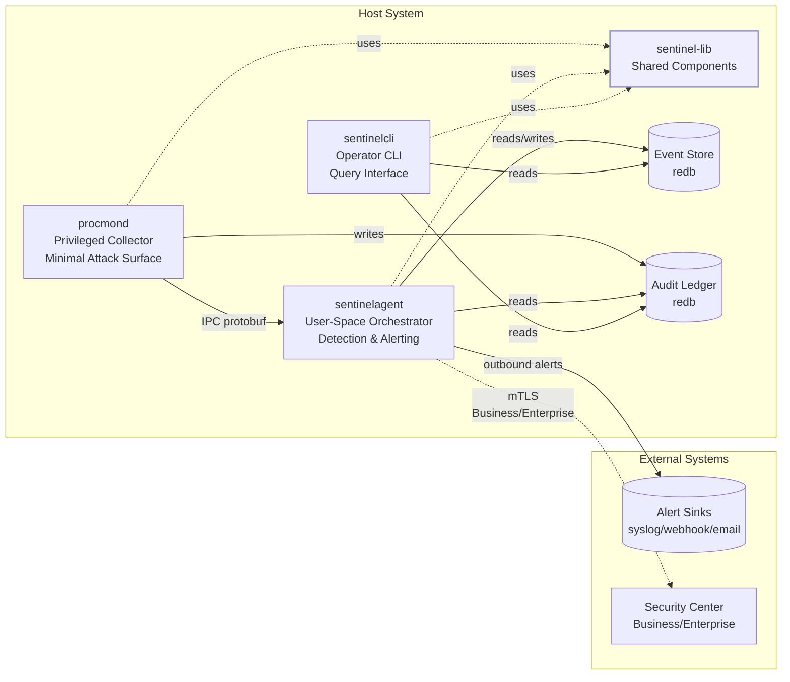
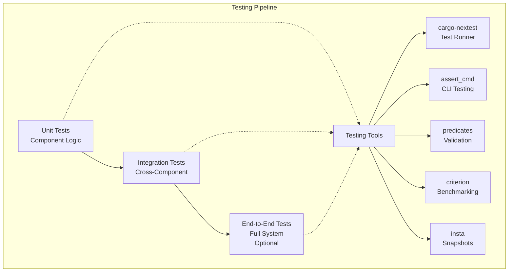

# AI Coding Assistant Configuration: SentinelD

---

## Purpose and Scope

This file serves as the **authoritative rules of engagement** for AI coding assistants working on **SentinelD**, a security-focused, high-performance process monitoring system built in Rust 2024 Edition. SentinelD is designed for cybersecurity professionals, threat hunters, and security operations centers to detect suspicious activity through continuous process monitoring, behavioral analysis, and pattern recognition.

**Document Authority**: This AGENTS.md file takes precedence as the primary rules-of-engagement file as specified in the project rules. For operational commands and development workflows, defer to [WARP.md](./WARP.md). For additional context, consult [.cursor/rules/](./cursor/rules/) and [GEMINI.md](./GEMINI.md) if present.

**Source of Truth**: All technical requirements and architectural decisions are derived from the steering documents in [.kiro/steering/](./kiro/steering/) and detailed specifications in [.kiro/specs/](./kiro/specs/).

---

## Rules of Engagement and Precedence

### AI Assistant Behavior Guidelines

1. **No Auto-Commits**: Never commit code on behalf of UncleSp1d3r without explicit permission. Always present diffs for approval.
2. **Security-First**: This is a security-critical system. All changes must maintain the principle of least privilege and undergo thorough security review.
3. **Zero-Warnings Policy**: All code must pass `cargo clippy -- -D warnings` with no exceptions.
4. **Operator-Centric Design**: Built for operators, by operators. Prioritize workflows efficient in contested/airgapped environments.
5. **Documentation Standards**: Use Mermaid for all diagrams. Prettier ignores Markdown files. Use relative links and maintain link hygiene.
6. **Testing Required**: All code changes must include appropriate tests to ensure quality and correctness.

### Rule Precedence Hierarchy

1. **Project Rules** (.cursor/rules/, AGENTS.md, GEMINI.md) - Highest precedence
2. **Steering Documents** (.kiro/steering/) - Architectural authority
3. **Technical Specifications** (.kiro/specs/) - Implementation requirements
4. **WARP.md** - Operational commands and workflows
5. **Embedded defaults** - Lowest precedence

---

## System Overview

SentinelD implements a **three-component security architecture** with strict privilege separation, extensible to **multi-tier deployments**:

### Core Architecture

- **procmond**: Privileged process collector with minimal attack surface
- **sentinelagent**: User-space orchestrator for detection and alerting
- **sentinelcli**: Command-line interface for operators
- **sentinel-lib**: Shared library providing core functionality

### Deployment Tiers

- **Free Tier**: Standalone agents (procmond + sentinelagent + sentinelcli)
- **Business Tier**: + Security Center + Enterprise integrations ($199/site)
- **Enterprise Tier**: + Kernel monitoring + Federated architecture + Advanced SIEM (custom pricing)

This separation ensures **robust security** by isolating privileged operations from network functionality while enabling enterprise scalability.

---

## Architecture

SentinelD follows a **three-component security architecture** with privilege separation and IPC communication:



### Component Responsibilities

#### procmond (Privileged Process Collector)

- **Security**: Runs with elevated privileges, drops them immediately after init
- **Network**: No network access whatsoever
- **Database**: Write-only access to audit ledger
- **Communication**: IPC server for receiving simple detection tasks from sentinelagent
- **Function**: Minimal privileged component for process data collection

#### sentinelagent (Detection Orchestrator)

- **Security**: Minimal privileges, outbound-only network connections
- **Database**: Read/write access to event store, manages procmond lifecycle
- **Features**: SQL-based detection engine, multi-channel alerting, IPC client
- **Communication**: Translates complex SQL rules into simple protobuf tasks for procmond
- **Function**: User-space detection rule execution and alert dispatching

#### sentinelcli (Operator Interface)

- **Security**: No network access, read-only database operations
- **Features**: JSON/table output, color handling, shell completions
- **Function**: User-friendly CLI for queries, exports, and configuration

#### sentinel-lib (Shared Core)

- **Purpose**: Common functionality shared across all components
- **Modules**: config, models, storage, detection, alerting, crypto, telemetry, kernel, network
- **Security**: Trait-based abstractions with security boundaries

### Security Boundaries

- **Privilege Separation**: Only procmond runs with elevated privileges when necessary
- **IPC Communication**: Secure protobuf over Unix sockets/named pipes
- **No Inbound Network**: System is outbound-only for alert delivery
- **Input Validation**: All data validated with serde and typed models
- **SQL Injection Prevention**: AST validation with sqlparser, prepared statements only

### Data Flow Architecture


## Technology Stack Requirements

### Core Technologies

- **Language**: Rust 2024 Edition (MSRV: 1.70+)
- **Async Runtime**: Tokio for I/O and task management
- **Database**: redb pure Rust embedded database for optimal performance and security
- **CLI Framework**: clap v4 with derive macros and shell completions
- **Process Enumeration**: sysinfo crate with platform-specific optimizations
- **Logging**: tracing ecosystem with structured JSON output
- **Configuration**: YAML/TOML via figment and config crates with hierarchical overrides
- **IPC**: Custom protobuf over Unix sockets/named pipes
- **Testing**: cargo-nextest, assert_cmd, predicates, criterion, insta

### Key Dependencies

```toml
[workspace.dependencies]
# Core async runtime
tokio = { version = "1.0", features = [
    "rt", "rt-multi-thread", "net", "io-util",
    "time", "process", "macros", "sync"
] }

# CLI framework
clap = { version = "4.0", features = ["derive"] }

# Serialization
serde = { version = "1.0", features = ["derive"] }

# Database (pure Rust embedded)
redb = "1.0"

# Process enumeration
sysinfo = "0.30"

# Logging
tracing = "0.1"

# Error handling
thiserror = "1.0"
anyhow = "1.0"

# Testing
assert_cmd = "2.0"
predicates = "3.1"
criterion = "0.5"
insta = "1.0"
```

---

## Coding Standards and Conventions

### Rust-Specific Requirements

- **Edition**: Always use Rust 2024 Edition (MSRV: 1.70+)
- **Linting**: `cargo clippy -- -D warnings` (zero warnings policy)
- **Safety**: `unsafe_code = "forbid"` enforced at workspace level
- **Formatting**: Standard `rustfmt` with 119 character line length
- **Error Handling**: Use `thiserror` for structured errors, `anyhow` for error context
- **Async**: Async-first design using Tokio runtime
- **Logging**: Structured logging with `tracing` ecosystem (JSON or human-readable)
- **Testing**: Comprehensive unit and integration tests with assert_cmd and predicates
- **Documentation**: Rustdoc comments for all public interfaces

## Security Model and Policies

### Core Security Requirements

- **Principle of Least Privilege**: Components run with minimal required permissions
- **Privilege Separation**: Only procmond runs with elevated privileges when necessary
- **Automatic Privilege Dropping**: Immediate privilege drop after initialization
- **SQL Injection Prevention**: AST validation with sqlparser, prepared statements only
- **Credential Management**: Environment variables or OS keychain, never hardcode secrets
- **Input Validation**: Comprehensive validation with detailed error messages
- **Attack Surface Minimization**: No network listening, outbound-only connections
- **Audit Trail**: Tamper-evident audit logging with BLAKE3 cryptographic integrity

### Advanced Security Features (Enterprise Tier)

- **mTLS Authentication**: Certificate chain validation for enterprise components
- **Code Signing**: SLSA Level 3 provenance, Cosign signatures
- **Cryptographic Integrity**: BLAKE3 hashing for audit chains
- **Sandboxed Execution**: Read-only database connections for detection engine
- **Query Whitelist**: Only SELECT statements with approved functions allowed

### Data Protection

- **Command-line Redaction**: Optional privacy-preserving command line masking
- **Log Field Masking**: Configurable field masking in structured logs
- **Database Encryption**: Support for sensitive deployments
- **Secure Storage**: OS keychain integration for credentials

## Performance Budgets and Instrumentation

### Performance Targets

- **CPU Usage**: < 5% sustained during continuous monitoring
- **Memory Usage**: < 100 MB resident under normal operation
- **Process Enumeration**: < 5s for 10,000+ processes
- **Database Operations**: > 1,000 records/second write rate
- **Alert Latency**: < 100ms per detection rule execution
- **Query Response**: Sub-second response times for 100,000+ events/minute (Enterprise)

### Resource Management

- **Bounded Channels**: Configurable capacity with backpressure policies
- **Memory Limits**: Cooperative yielding and memory budget enforcement
- **Timeout Support**: Cancellation tokens for graceful shutdown
- **Circuit Breakers**: Reliability patterns for external dependencies
- **Graceful Degradation**: Continue with reduced functionality when resources constrained

---

## Development Workflow

### Task Runner (justfile)

All development tasks use the `just` command runner with DRY principles:

```bash
# Formatting
just fmt          # Format all code
just fmt-check    # Check formatting (CI-friendly)

# Linting (composed recipe)
just lint         # Runs fmt-check + clippy + lint-just
just lint-rust    # Clippy with strict warnings
just lint-just    # Lint justfile syntax

# Building and Testing
just build        # Build workspace
just check        # Quick check without build
just test         # Run all tests

# Component Execution
just run-procmond [args]      # Run procmond with optional args
just run-sentinelcli [args]   # Run sentinelcli with optional args
just run-sentinelagent [args] # Run sentinelagent with optional args
```

### Core Development Commands

```bash
# Workspace Operations
cargo build --workspace --all-features
cargo test --workspace --all-features
cargo clippy --workspace --all-targets --all-features -- -D warnings
cargo fmt --all
cargo check --workspace --all-targets --all-features

# Testing with stable output
NO_COLOR=1 TERM=dumb cargo test --workspace

# Component-specific testing
cargo test -p sentinel-lib
cargo test -p procmond

# Performance testing
cargo bench  # Run criterion benchmarks
```

### Justfile Conventions

- Compose complex tasks by calling `@just <subrecipe>`
- Keep paths relative to project directory
- Use consistent argument patterns with defaults
- Include `lint-just` recipe to validate justfile syntax with `just --fmt --check --unstable`
- No hardcoded paths outside project directory for portability

## Code Organization and Architecture

### Workspace Structure

```text
SentinelD/
├── procmond/         # Privileged Process Collector
├── sentinelagent/    # User-Space Orchestrator
├── sentinelcli/      # Command-Line Interface
├── sentinel-lib/     # Shared Library Components
├── security-center/  # Centralized Management (Business/Enterprise)
├── .kiro/            # Project Documentation
│   ├── steering/     # Architectural decisions
│   └── specs/        # Technical specifications
└── project_spec/     # Legacy documentation
```

### Module Organization (sentinel-lib)

```rust
pub mod config;      // Configuration management
pub mod models;      // Core data structures
pub mod storage;     // Database abstractions (redb)
pub mod detection;   // SQL-based detection engine
pub mod alerting;    // Multi-channel alert delivery
pub mod crypto;      // Cryptographic audit functions
pub mod telemetry;   // Performance metrics and health
pub mod kernel;      // Kernel-level monitoring (Enterprise)
pub mod network;     // Network correlation (Enterprise)
```

### Service Layer Pattern

Implement clear separation of concerns with trait-based service interfaces:

```rust
#[async_trait]
pub trait ProcessCollectionService: Send + Sync {
    async fn collect_processes(&self) -> Result<CollectionResult, CollectionError>;
    async fn get_system_info(&self) -> Result<SystemInfo, CollectionError>;
}

#[async_trait]
pub trait DetectionService: Send + Sync {
    async fn execute_rules(&self, scan_context: &ScanContext) -> Result<Vec<Alert>, DetectionError>;
    async fn load_rules(&self) -> Result<Vec<DetectionRule>, DetectionError>;
}

#[async_trait]
pub trait AlertSink: Send + Sync {
    async fn send(&self, alert: &Alert) -> Result<DeliveryResult>;
    async fn health_check(&self) -> HealthStatus;
    fn name(&self) -> &str;
}
```

---

## Testing Strategy

### Three-Tier Testing Architecture



#### Unit Testing

- **Scope**: Individual components and algorithms only
- **Tools**: Standard Rust test framework with tokio-test for async utilities
- **Database**: redb with temporary files for isolated testing
- **Mocking**: Trait-based service mocking for external dependencies

#### Integration Testing

- **Scope**: Cross-component interaction and realistic scenarios
- **Tools**: assert_cmd and predicates for comprehensive CLI validation
- **Approach**: Primary testing method with minimal mocking
- **Database**: Real redb instances with test data

#### End-to-End Testing (Optional)

- **Scope**: Complete user workflows and system integration
- **Flow**: procmond collection → database population → agent rule execution → CLI querying
- **Environment**: Full system deployment with test data seeding

### Test Framework and Tools

#### Test Runner

- **Primary**: cargo-nextest for faster, more reliable test execution
- **Features**: Parallel execution, better output, failure isolation
- **CI Integration**: Structured JSON output for automated analysis

#### Quality Tools

- **Coverage**: llvm-cov for coverage measurement and reporting (target: >85%)
- **Property Testing**: proptest for generative testing of edge cases and invariants
- **Fuzz Testing**: Extensive fuzzing for security-critical components (SQL parser, config validation)
- **Snapshot Testing**: insta for deterministic CLI output validation

### Test Execution Environment

#### Stable Output Requirements

```bash
# All tests must use stable output environment
NO_COLOR=1 TERM=dumb cargo test --workspace

# Component-specific testing
RUST_BACKTRACE=1 cargo test -p sentinel-lib --nocapture

# Performance regression testing
cargo bench --baseline previous

# Coverage reporting
cargo llvm-cov --all-features --workspace --lcov --output-path lcov.info
```

#### Cross-Platform Testing

- **CI Matrix**: Linux, macOS, Windows with multiple Rust versions (stable, beta, MSRV)
- **Architecture**: x86_64 and ARM64 support validation
- **Containers**: Docker and Kubernetes deployment testing

### Quality Gates

#### Pre-commit Requirements

1. `cargo clippy -- -D warnings` (zero warnings)
2. `cargo fmt --all --check` (formatting validation)
3. `cargo test --workspace` (all tests pass)
4. `just lint-just` (justfile syntax validation)
5. No new `unsafe` code without explicit approval
6. Performance benchmarks within acceptable ranges

#### Performance Testing

- **Critical Path Benchmarks**: Use criterion for database operations, detection rules, process enumeration
- **Regression Detection**: Automated performance comparison against baselines
- **Load Testing**: Validate performance targets with 10k+ process datasets

---

## CI/CD and Reviews

### Continuous Integration

- **Platform**: GitHub Actions with matrix testing (Linux, macOS, Windows)
- **Rust Versions**: stable, beta, MSRV (1.70+)
- **Quality Checks**: fmt-check, clippy strict, comprehensive test suite
- **Performance**: Benchmark regression detection with criterion
- **Security**: Dependency scanning, SLSA provenance (Enterprise)

### Code Review Process

- **Primary Review Tool**: coderabbit.ai (preferred over GitHub Copilot)
- **Review Requirements**: Security focus, performance impact assessment
- **Single Maintainer**: UncleSp1d3r operates as sole maintainer with appropriate push restrictions
- **AI Integration**: Remove automatic review by GitHub Copilot per preferences

### Commit and Release Management

#### Commit Standards

- **Format**: Conventional Commits specification
- **Types**: `feat`, `fix`, `docs`, `style`, `refactor`, `perf`, `test`, `build`, `ci`, `chore`
- **Scopes**: `(auth)`, `(api)`, `(cli)`, `(models)`, `(detection)`, `(alerting)`, etc.
- **Breaking Changes**: Indicated with `!` in header or `BREAKING CHANGE:` in footer

#### Release Process

- **Versioning**: Semantic Versioning (SemVer)
- **Milestones**: Named as version numbers (e.g., `v1.0`) with descriptive context
- **Automation**: `cargo release` for automated version management
- **Distribution**: Platform-specific packages with code signing (Business/Enterprise)

#### Git Workflow

- **No Auto-Commits**: Never commit automatically without explicit permission
- **Branch Strategy**: Feature branches with PR review process
- **Protection**: Single maintainer with push restrictions and branch protection

---

## Data Structures and Storage

### Database Technology: redb

**Primary Storage**: redb pure Rust embedded database for optimal performance and security

- **Event Store**: Read/write access for sentinelagent, read-only for sentinelcli
- **Audit Ledger**: Write-only access for procmond, read-only for others
- **Features**: Concurrent access, ACID transactions, zero-copy deserialization
- **Performance**: Optimized for time-series queries and high-throughput writes

### Core Data Types

Use strongly-typed structures with serde for serialization:

```rust
#[derive(Debug, Clone, Serialize, Deserialize, PartialEq)]
pub struct ProcessInfo {
    pub pid: u32,
    pub ppid: Option<u32>,
    pub name: String,
    pub executable_path: Option<String>,
    pub command_line: Option<String>,
    pub start_time: Option<DateTime<Utc>>,
    pub cpu_usage: Option<f64>,
    pub memory_usage: Option<u64>,
    pub status: ProcessStatus,
    pub executable_hash: Option<String>, // SHA-256
    pub collection_time: DateTime<Utc>,
}

#[derive(Debug, Serialize, Deserialize)]
pub struct DetectionTask {
    pub task_id: String,
    pub rule_type: RuleType,
    pub parameters: TaskParameters,
    pub timeout: Duration,
}
```

### Error Handling Patterns

Use thiserror for structured error types:

```rust
#[derive(Debug, Error)]
pub enum CollectionError {
    #[error("Permission denied accessing process {pid}")]
    PermissionDenied { pid: u32 },

    #[error("Process {pid} no longer exists")]
    ProcessNotFound { pid: u32 },

    #[error("Database operation failed: {0}")]
    DatabaseError(#[from] redb::Error),

    #[error("IPC communication failed: {0}")]
    IpcError(String),
}
```

### Database Schema Design

#### Core Tables (redb)

```rust
// Event Store schema
const PROCESSES_TABLE: TableDefinition<u64, ProcessInfo> = TableDefinition::new("processes");
const SCANS_TABLE: TableDefinition<u64, ScanMetadata> = TableDefinition::new("scans");
const DETECTION_RULES_TABLE: TableDefinition<String, DetectionRule> = TableDefinition::new("detection_rules");
const ALERTS_TABLE: TableDefinition<u64, Alert> = TableDefinition::new("alerts");
const ALERT_DELIVERIES_TABLE: TableDefinition<u64, AlertDelivery> = TableDefinition::new("alert_deliveries");

// Audit Ledger schema (separate database)
const AUDIT_LEDGER_TABLE: TableDefinition<u64, AuditEntry> = TableDefinition::new("audit_ledger");
```

#### Business/Enterprise Extensions

```rust
// Additional tables for Business/Enterprise tiers
const AGENTS_TABLE: TableDefinition<String, AgentInfo> = TableDefinition::new("agents");
const AGENT_CONNECTIONS_TABLE: TableDefinition<String, ConnectionInfo> = TableDefinition::new("agent_connections");
const FLEET_EVENTS_TABLE: TableDefinition<u64, FleetEvent> = TableDefinition::new("fleet_events");
const RULE_PACKS_TABLE: TableDefinition<String, RulePack> = TableDefinition::new("rule_packs");
const NETWORK_EVENTS_TABLE: TableDefinition<u64, NetworkEvent> = TableDefinition::new("network_events"); // Enterprise
const KERNEL_EVENTS_TABLE: TableDefinition<u64, KernelEvent> = TableDefinition::new("kernel_events"); // Enterprise
```

---

## Testing Strategy

### Three-Tier Testing Architecture

1. **Unit Tests**: Test individual components with mocked dependencies
2. **Integration Tests**: Use testcontainers for database operations
3. **End-to-End Tests**: Full system testing with sample data

### Test Organization

```rust
#[cfg(test)]
mod tests {
    use super::*;
    use assert_cmd::prelude::*;
    use predicates::prelude::*;

    #[tokio::test]
    async fn test_process_collection() {
        // Test implementation
    }
}
```

---

## CLI Design Guidelines

### Command Structure

Use clap v4 with derive macros:

```rust
#[derive(Parser)]
#[command(name = "procmond", about = "Process monitoring daemon")]
pub struct Cli {
    #[command(subcommand)]
    pub command: Commands,

    #[arg(short, long)]
    pub config: Option<PathBuf>,

    #[arg(short, long, default_value = "info")]
    pub log_level: String,
}

#[derive(Subcommand)]
pub enum Commands {
    Run(RunCommand),
    Config(ConfigCommand),
    Rules(RulesCommand),
    // Additional commands...
}
```

### Output Formatting

Support both human-readable and JSON output:

- Use `--json` flag for machine-readable output
- Respect `NO_COLOR` and `TERM=dumb` for color handling
- Provide clear error messages with actionable suggestions

---

## Configuration Management

### Hierarchical Configuration

Support multiple configuration sources with precedence:

1. Command-line flags (highest precedence)
2. Environment variables (`PROCMOND_*`)
3. User configuration file (`~/.config/procmond/config.yaml`)
4. System configuration file (`/etc/procmond/config.yaml`)
5. Embedded defaults (lowest precedence)

### Configuration Structure

```yaml
app:
  scan_interval_ms: 30000
  batch_size: 1000

database:
  path: /var/lib/procmond/processes.sqlite
  retention_days: 30

alerting:
  sinks:
    - type: syslog
      facility: daemon
    - type: webhook
      url: https://alerts.example.com/api
```

---

## Alert System Design

### Plugin-Based Alert Sinks

Use trait-based plugin system:

```rust
#[async_trait]
pub trait AlertSink: Send + Sync {
    async fn send(&self, alert: &Alert) -> Result<DeliveryResult>;
    async fn health_check(&self) -> HealthStatus;
    fn name(&self) -> &str;
}
```

### Alert Delivery

- Concurrent delivery to multiple sinks
- Retry logic with exponential backoff
- Circuit breaking for failing sinks
- Delivery audit trail

---

## Development Workflow

### Task Runner (just)

Use DRY principles in justfile recipes:

```just
fmt:
  @cargo fmt --all

lint:
  @just fmt-check
  @cargo clippy --workspace --all-targets --all-features -- -D warnings

test:
  @cargo test --workspace

build:
  @cargo build --workspace
```

### Git Workflow

- Use conventional commits format
- Create feature branches for new work
- Ensure all tests pass before merging
- No commits without explicit permission

---

## Platform Considerations

### Cross-Platform Compatibility

- Linux: Primary development target with `/proc` filesystem access
- macOS: Native process enumeration with security framework integration
- Windows: Windows API process access with service deployment

### Graceful Degradation

- Continue with reduced functionality when elevated privileges unavailable
- Provide clear diagnostics about system capabilities
- Fallback mechanisms for constrained environments

---

## Security Considerations

### Privilege Management

- Run with minimal required privileges by default
- Optional elevated mode for enhanced metadata collection
- Automatic privilege dropping after initialization
- Comprehensive audit logging

### Data Protection

- Optional command-line redaction for privacy
- Configurable field masking in logs
- Secure credential storage (OS keychain integration)
- Database encryption support for sensitive deployments

---

## Observability and Monitoring

### Metrics Export

Support Prometheus metrics for operational monitoring:

```rust
procmond_collection_duration_seconds{status="success|error"}
procmond_processes_collected_total
procmond_alerts_generated_total{severity="low|medium|high|critical"}
procmond_alert_deliveries_total{sink="stdout|syslog|webhook"}
```

### Health Checks

- Configuration validation endpoints
- Database connectivity checks
- Alert sink health monitoring
- System capability assessment

---

## Migration from Python Prototype

### Data Migration

- Built-in database import utility
- Configuration format conversion (INI → YAML/TOML)
- Rule migration assistance
- Feature parity validation

### Deployment Strategy

1. Parallel operation during transition
2. Output comparison and validation
3. Gradual migration after validation period
4. Comprehensive migration documentation

---

## Code Generation Guidelines

When generating code for SentinelD:

01. **Always use Rust 2024 Edition** in Cargo.toml files
02. **Implement comprehensive error handling** with thiserror
03. **Use async/await patterns** with Tokio runtime
04. **Include comprehensive tests** with assert_cmd for CLI testing
05. **Follow the service layer pattern** with trait definitions
06. **Implement proper logging** with tracing framework
07. **Use workspace inheritance** for common dependencies
08. **Include performance considerations** in implementation
09. **Follow security best practices** with input validation
10. **Document all public APIs** with rustdoc comments

---

## Specific Implementation Notes

### Process Collection

- Use `sysinfo` crate as primary cross-platform abstraction
- Implement platform-specific optimizations where beneficial
- Handle permission denied gracefully with partial data collection
- Compute SHA-256 hashes of executable files for integrity checking

### Detection Engine

- Execute SQL rules against SQLite database with prepared statements
- Implement rule validation and testing capabilities
- Support hot-reloading of rule files with change detection
- Provide performance metrics and optimization hints

### Alert Delivery Implementation

- Implement concurrent delivery with configurable parallelism
- Use circuit breaker pattern for failing external services
- Maintain delivery audit trail for compliance
- Support rate limiting and backpressure handling

### Database Operations

- Use connection pooling for concurrent access
- Implement automatic schema migrations
- Support database maintenance operations (VACUUM, ANALYZE)
- Provide detailed statistics and performance metrics

---

## Contribution Checklists for Common AI Assistant Tasks

### Adding a New Detection Rule

**Files to Touch:**

- `sentinel-lib/src/detection.rs` - Rule implementation
- `sentinel-lib/src/models.rs` - Rule data structure
- `sentinelagent/src/rules/` - Rule registration
- `tests/integration/` - Rule validation tests

**Checklist:**

1. [ ] Define rule structure with SQL query and metadata
2. [ ] Implement rule validation with AST parsing (sqlparser)
3. [ ] Add comprehensive unit tests with mock data
4. [ ] Create integration test via sentinelagent
5. [ ] Validate alert delivery through sentinelcli
6. [ ] Run `cargo clippy -- -D warnings` (zero warnings)
7. [ ] Performance test with criterion if rule is complex
8. [ ] Document rule purpose and expected matches in rustdoc

### Adding a New CLI Option

**Files to Touch:**

- `sentinelcli/src/main.rs` - CLI argument definition
- `sentinel-lib/src/config.rs` - Configuration handling
- `tests/integration/` - CLI behavior tests

**Checklist:**

1. [ ] Update clap derive structures with new argument
2. [ ] Implement configuration handling in sentinel-lib
3. [ ] Add help text and default values
4. [ ] Create assert_cmd integration tests
5. [ ] Test both short and long option forms
6. [ ] Validate with `NO_COLOR=1 TERM=dumb` environment
7. [ ] Update shell completion generation if applicable
8. [ ] Document option in help text and rustdoc

### Optimizing Database Write Path

**Files to Touch:**

- `sentinel-lib/src/storage.rs` - Database operations
- `procmond/src/collector.rs` - Collection logic
- `benches/` - Performance benchmarks

**Checklist:**

1. [ ] Establish baseline with criterion benchmarks
2. [ ] Implement optimization with redb best practices
3. [ ] Add batch processing if applicable
4. [ ] Validate performance targets (>1000 records/sec)
5. [ ] Test with 10k+ process datasets
6. [ ] Run memory profiling to check for leaks
7. [ ] Ensure ACID transaction guarantees maintained
8. [ ] Document performance characteristics

## Documentation Standards

### Architectural Documentation

- **Diagrams**: All architectural and flow diagrams must use Mermaid
- **Markdown**: Prettier is configured to ignore Markdown files (.prettierignore)
- **API Documentation**: Comprehensive rustdoc comments for all public interfaces
- **Cross-references**: Use relative links and maintain link hygiene
- **Examples**: Include code examples in rustdoc with `cargo test --doc`

### Code Documentation

```rust
/// Collects process information with optional elevated privileges.
///
/// This function enumerates all accessible processes on the system and
/// collects metadata including PID, executable path, command line, and
/// cryptographic hashes when available.
///
/// # Security
///
/// - Runs with minimal privileges by default
/// - Gracefully handles permission denied errors
/// - Validates all input data before processing
///
/// # Performance
///
/// - Completes enumeration in <5s for 10,000+ processes
/// - Uses bounded memory allocation
/// - Supports concurrent access patterns
///
/// # Examples
///
/// ```rust
/// use sentinel_lib::collector::ProcessCollectionService;
///
/// let service = ProcessCollector::new();
/// let result = service.collect_processes().await?;
/// assert!(result.processes.len() > 0);
/// ```
///
/// # Errors
///
/// Returns [`CollectionError`] for:
/// - System-level permission issues
/// - Resource exhaustion scenarios
/// - Database connectivity problems
pub async fn collect_processes(&self) -> Result<CollectionResult, CollectionError>
```

### Project Documentation Structure

- **AGENTS.md**: AI assistant rules of engagement (this file)
- **WARP.md**: Operational commands and development workflows
- **README.md**: Project overview and quick start
- **.kiro/steering/**: Architectural decisions and product direction
- **.kiro/specs/**: Detailed technical specifications
- **docs/**: User-facing documentation (operator guide)

## Source-of-Truth Map

### Primary Authorities

| Section | Source Documents | Purpose |
|---------|-----------------|----------|
| **Architecture** | [.kiro/steering/structure.md](./.kiro/steering/structure.md) | Component organization, security boundaries |
| **Technology Stack** | [.kiro/steering/tech.md](./.kiro/steering/tech.md) | Technology choices, dependencies |
| **Product Features** | [.kiro/steering/product.md](./.kiro/steering/product.md) | Feature tiers, business requirements |
| **Core Requirements** | [.kiro/specs/sentineld-core-monitoring/requirements.md](./.kiro/specs/sentineld-core-monitoring/requirements.md) | Functional requirements |
| **Business Features** | [.kiro/specs/business-tier-features/requirements.md](./.kiro/specs/business-tier-features/requirements.md) | Business tier specifications |
| **Enterprise Features** | [.kiro/specs/enterprise-tier-features/requirements.md](./.kiro/specs/enterprise-tier-features/requirements.md) | Enterprise tier specifications |
| **Development Workflow** | [WARP.md](./WARP.md) | Commands, justfile recipes, testing |

### Cross-References

- **Operational Commands**: See [WARP.md](./WARP.md) for complete development command reference
- **Cursor IDE Rules**: See [.cursor/rules/](./.cursor/rules/) for IDE-specific guidance
- **Security Standards**: Reference [.cursor/rules/security-standards.mdc](./.cursor/rules/security-standards.mdc)
- **Rust Standards**: Reference [.cursor/rules/rust-standards.mdc](./.cursor/rules/rust-standards.mdc)

## Configuration Notes

### Environment Setup

- **Prettier**: Configured to ignore Markdown files via `.prettierignore`
- **OpenAPI Generator**: Used for Rust client code generation when applicable
- **Terminal Handling**: Respects `NO_COLOR=1` and `TERM=dumb` for CI environments
- **Justfile**: Uses DRY principles with `@just <subrecipe>` composition

### AI Assistant Integration

- **Primary Rules**: AGENTS.md (this file) takes precedence
- **Fallback Order**: GEMINI.md → .cursor/rules/ → embedded defaults
- **Code Review**: Prefer coderabbit.ai over GitHub Copilot automatic reviews
- **Commits**: Always present diffs for approval, never auto-commit

---

## Glossary and Acronyms

- **AST**: Abstract Syntax Tree (for SQL validation)
- **BLAKE3**: Cryptographic hash function for audit trails
- **CEF**: Common Event Format
- **eBPF**: Extended Berkeley Packet Filter (Linux kernel monitoring)
- **ETW**: Event Tracing for Windows
- **IPC**: Inter-Process Communication
- **mTLS**: Mutual Transport Layer Security
- **redb**: Pure Rust embedded database
- **SLSA**: Supply-chain Levels for Software Artifacts
- **STIX**: Structured Threat Information eXpression
- **TAXII**: Trusted Automated eXchange of Intelligence Information

---

**Remember**: SentinelD is a security-focused system. Always prioritize security, performance, and reliability in implementation decisions. When in doubt, choose the more secure and observable approach.
