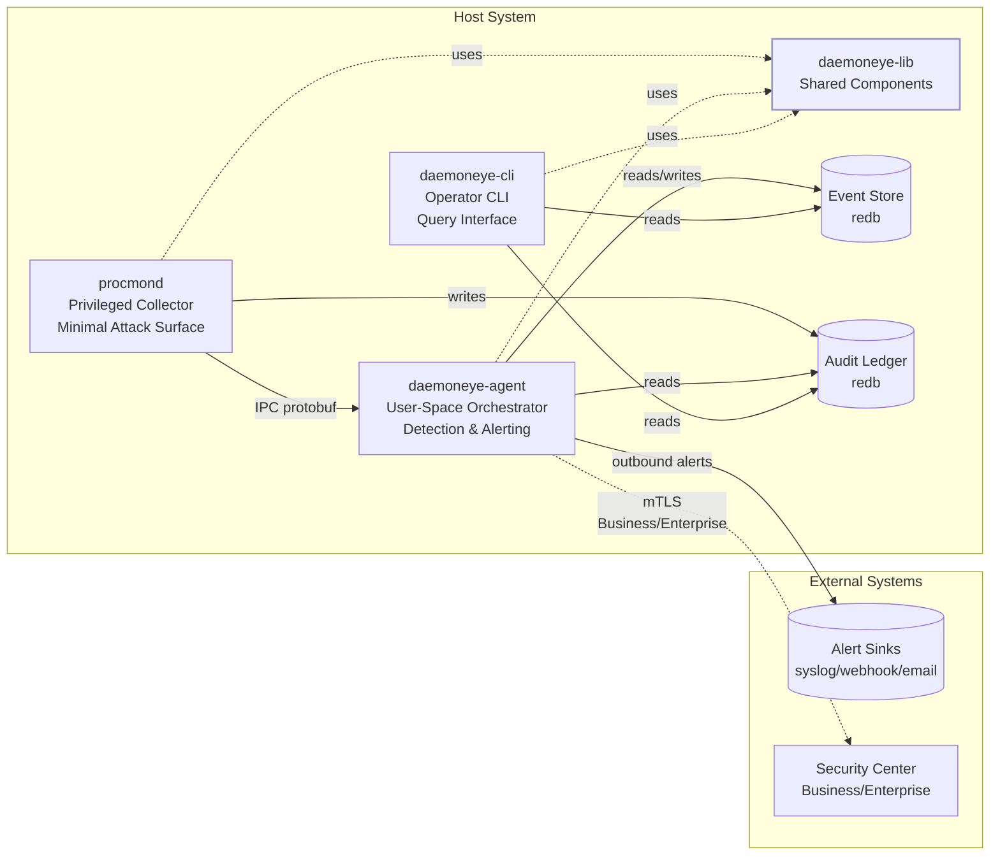
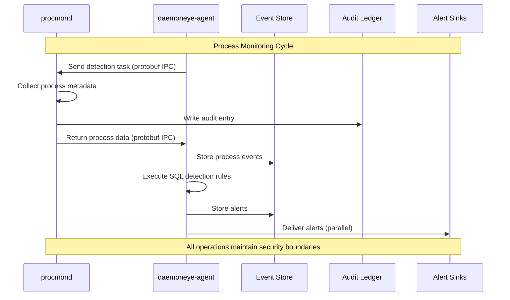
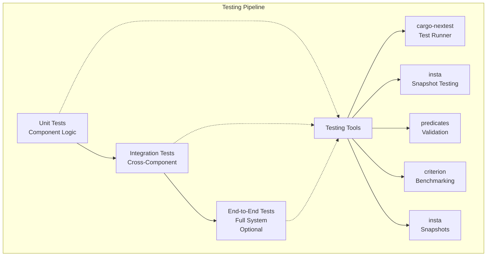

# DaemonEye Development Workflows

This file contains operational commands and development workflows for **DaemonEye**.

**Document Authority**: For AI assistant rules and architectural guidance, see [AGENTS.md](./AGENTS.md). \
**Source of Truth**: Technical requirements and architectural decisions are in [.kiro/steering/](./kiro/steering/) and [.kiro/specs/](./kiro/specs/).

---

## Development Commands

### Task Runner (justfile)

All development tasks use the `just` command runner with DRY principles:

```bash
# Formatting
just fmt          # Format all code
just fmt-check    # Check formatting (CI-friendly)

# Linting (composed recipe)
just lint         # Runs fmt-check + clippy + lint-just
just lint-rust    # Clippy with strict warnings
just lint-just    # Lint justfile syntax

# Building and Testing
just build        # Build all binaries with features
just check        # Quick check without build
just test         # Run all tests

# Component Execution
just run-procmond [args]      # Run procmond with optional args
just run-daemoneye-cli [args]   # Run daemoneye-cli with optional args
just run-daemoneye-agent [args] # Run daemoneye-agent with optional args
```

Always follow the commit message style in [.github/commit-instructions.md](.github/commit-instructions.md).

### Core Development Commands

```bash
# Workspace Operations
cargo build --workspace
cargo test --workspace
cargo clippy --workspace -- -D warnings
cargo fmt --all
cargo check --workspace

# Testing with stable output
NO_COLOR=1 TERM=dumb cargo test --workspace

# Component-specific building
cargo build -p procmond
cargo build -p daemoneye-agent
cargo build -p daemoneye-cli
cargo build -p daemoneye-lib

# Performance testing
cargo bench  # Run criterion benchmarks

# IPC testing
cargo test --test ipc_integration -p daemoneye-lib  # Test interprocess transport
cargo test ipc::codec -p daemoneye-lib             # Test codec implementation
```

## Quality Assurance

### Pre-commit Requirements

1. `cargo clippy -- -D warnings` (zero warnings)
2. `cargo fmt --all --check` (formatting validation)
3. `cargo test --workspace` (all tests pass)
4. `just lint-just` (justfile syntax validation)
5. No new `unsafe` code without explicit approval
6. Performance benchmarks within acceptable ranges

### Test Execution

```bash
# All tests must use stable output environment
NO_COLOR=1 TERM=dumb cargo test --workspace

# Component-specific testing
RUST_BACKTRACE=1 cargo test -p daemoneye-lib --nocapture

# Performance regression testing
cargo bench --baseline previous

# Coverage reporting
cargo llvm-cov --all-features --workspace --lcov --output-path lcov.info
```

---

## Rules of Engagement and Precedence

### AI Assistant Behavior Guidelines

1. **No Auto-Commits**: Never commit code on behalf of UncleSp1d3r without explicit permission. Always present diffs for approval.
2. **Security-First**: This is a security-critical system. All changes must maintain the principle of least privilege and undergo thorough security review.
3. **Zero-Warnings Policy**: All code must pass `cargo clippy -- -D warnings` with no exceptions.
4. **Operator-Centric Design**: Built for operators, by operators. Prioritize workflows efficient in contested/airgapped environments.
5. **Documentation Standards**: Use Mermaid for all diagrams. Prettier ignores Markdown files. Use relative links and maintain link hygiene.
6. **Testing Required**: All code changes must include appropriate tests to ensure quality and correctness.
7. **Linter Restrictions**: Never remove clippy restrictions or allow linters marked as `deny` without explicit permission. All `-D warnings` and `deny` attributes must be preserved.
8. **Focused and Manageable Files**: Source files should be focused and manageable. Large files should be split into smaller, more focused files; no larger than 500-600 lines, when possible.

### Rule Precedence Hierarchy

1. **Project Rules** (.cursor/rules/, AGENTS.md, GEMINI.md) - Highest precedence
2. **Steering Documents** (.kiro/steering/) - Architectural authority
3. **Technical Specifications** (.kiro/specs/) - Implementation requirements
4. **Embedded defaults** - Lowest precedence

---

## System Overview

DaemonEye implements a **three-component security architecture** with strict privilege separation, extensible to **multi-tier deployments**:

### Core Architecture

- Core components:

  - **procmond**: Privileged process collector with minimal attack surface (additional collectors are possible, but `procmond` is always included as a core component)
  - **daemoneye-agent**: User-space orchestrator for detection and alerting
  - **daemoneye-cli**: Command-line interface for operators

- Shared frameworks:

  - **daemoneye-lib**: Shared library providing core functionality
  - **collector-core**: Shared framework for defining a collector capability, either a Monitor collector that watches processes, or a Trigger collector that is triggered by the event bus to enrich an event detected by a Monitor collector

### Deployment Tiers

- **Free Tier**: Standalone agents (procmond + daemoneye-agent + daemoneye-cli)
- **Business Tier**: + Security Center + Enterprise integrations ($199/site)
- **Enterprise Tier**: + Kernel monitoring + Federated architecture + Advanced SIEM (custom pricing)

This separation ensures **robust security** by isolating privileged operations from network functionality while enabling enterprise scalability.

---

## Architecture

DaemonEye follows a **three-component security architecture** with privilege separation and IPC communication:



### Component Responsibilities

#### procmond (Privileged Process Collector)

- **Security**: Runs with elevated privileges, drops them immediately after init
- **Network**: No network access whatsoever
- **Database**: Write-only access to audit ledger
- **Communication**: Tokio-based IPC server with protobuf + CRC32 framing for secure task processing
- **Function**: Minimal privileged component for process data collection

#### daemoneye-agent (Detection Orchestrator)

- **Security**: Minimal privileges, outbound-only network connections
- **Database**: Read/write access to event store, manages procmond lifecycle
- **Features**: SQL-based detection engine, multi-channel alerting, IPC client
- **Communication**: IPC client with automatic reconnection, translates SQL rules into protobuf tasks
- **Function**: User-space detection rule execution and alert dispatching

#### daemoneye-cli (Operator Interface)

- **Security**: No network access, read-only database operations
- **Features**: JSON/table output, color handling, shell completions
- **Function**: User-friendly CLI for queries, exports, and configuration

#### daemoneye-lib (Shared Core)

- **Purpose**: Common functionality shared across all components
- **Modules**: config, models, storage, detection, alerting, crypto, telemetry, kernel, network
- **Security**: Trait-based abstractions with security boundaries

### Security Boundaries

- **Privilege Separation**: Only procmond runs with elevated privileges when necessary
- **IPC Communication**: Secure protobuf over tokio Unix sockets/named pipes with CRC32 validation
- **No Inbound Network**: System is outbound-only for alert delivery
- **Input Validation**: All data validated with serde and typed models
- **SQL Injection Prevention**: AST validation with sqlparser, prepared statements only

### Data Flow Architecture



## Technology Stack Requirements

### Core Technologies

- **Language**: Rust 2024 Edition (MSRV: 1.70+)
- **Async Runtime**: Tokio for I/O and task management
- **Database**: redb pure Rust embedded database for optimal performance and security
- **CLI Framework**: clap v4 with derive macros and shell completions
- **Process Enumeration**: sysinfo crate with platform-specific optimizations
- **Logging**: tracing ecosystem with structured JSON output
- **Configuration**: YAML/TOML via figment and config crates with hierarchical overrides
- **IPC**: `interprocess` crate for cross-platform transport + protobuf for message serialization
- **Testing**: cargo-nextest, insta, predicates, criterion

### IPC Communication with interprocess and protobuf

**Transport Layer**: Use `interprocess` crate for cross-platform IPC communication:

```rust
use daemoneye_lib::proto::{DetectionResult, DetectionTask};
use interprocess::local_socket::LocalSocketStream;

fn example_ipc_communication() -> Result<(), Box<dyn std::error::Error>> {
    // Unix Domain Sockets (Linux/macOS) or Named Pipes (Windows)
    #[cfg(unix)]
    let stream = LocalSocketStream::connect("/tmp/DaemonEye.sock")?;
    #[cfg(windows)]
    let stream = LocalSocketStream::connect(r"\\.\pipe\DaemonEye")?;

    // Protobuf message serialization with CRC32 checksums
    let task = DetectionTask::new()
        .with_rule_id("suspicious_process")
        .with_query("SELECT * FROM processes WHERE name = 'malware.exe'")
        .build();

    // Serialize and send with framing
    let serialized = prost::Message::encode_to_vec(&task);
    // Send with CRC32 and length prefixing for integrity
    Ok(())
}
```

**Message Framing**: All IPC messages use length-delimited protobuf with CRC32 checksums for corruption detection and sequence numbers for ordering.

**Backpressure**: Credit-based flow control with configurable limits (default: 1000 pending records, max 10 concurrent tasks).

### OS Support Matrix

| OS          | Version              | Architecture  | Status    | Notes                          |
| ----------- | -------------------- | ------------- | --------- | ------------------------------ |
| **Linux**   | Ubuntu 20.04+ LTS    | x86_64, ARM64 | Primary   | Full feature support           |
| **Linux**   | RHEL/CentOS 8+       | x86_64, ARM64 | Primary   | Full feature support           |
| **Linux**   | Alma/Rocky Linux 8+  | x86_64, ARM64 | Primary   | Full feature support           |
| **Linux**   | Debian 11+ LTS       | x86_64, ARM64 | Primary   | Full feature support           |
| **macOS**   | 14.0+ (Sonoma)       | x86_64, ARM64 | Primary   | Native process monitoring      |
| **Windows** | Windows 10+          | x86_64, ARM64 | Primary   | Service deployment[^5]         |
| **Windows** | Windows Server 2019+ | x86_64        | Primary   | Enterprise features[^6]        |
| **Windows** | Windows Server 2022  | x86_64, ARM64 | Primary   | Enterprise standard            |
| **Windows** | Windows 11           | x86_64, ARM64 | Primary   | Full feature support           |
| **Linux**   | Alpine 3.16+         | x86_64, ARM64 | Secondary | Container deployments          |
| **Linux**   | Amazon Linux 2+      | x86_64, ARM64 | Secondary | Cloud deployments              |
| **Linux**   | Ubuntu 18.04         | x86_64, ARM64 | Secondary | Best-effort support[^1][^8]    |
| **Linux**   | RHEL 7               | x86_64        | Secondary | Best-effort support[^2][^8]    |
| **macOS**   | 12.0+ (Monterey)     | x86_64, ARM64 | Secondary | Best-effort support[^7]        |
| **FreeBSD** | 13.0+                | x86_64, ARM64 | Secondary | pfSense/OPNsense ecosystem[^9] |

**Testing Policy**: We test against the current and one previous major version of Windows and macOS to ensure compatibility with enterprise environments. macOS 14.0+ (Sonoma and later) are Primary support.

### Key Dependencies

#### Core Runtime & Async

- **tokio** (1.0+) - Async runtime with multi-threaded support, networking, I/O utilities, and process management
- **serde** (1.0+) - Serialization framework with derive macros for data structures

#### CLI & User Interface

- **clap** (4.0+) - Command-line argument parsing with derive macros and shell completions

#### Database & Storage

- **redb** (3.0+) - Pure Rust embedded database for optimal performance and security (used only in daemoneye-agent)

#### System Monitoring

- **sysinfo** (0.37+) - Cross-platform process enumeration and system information gathering

#### Logging & Observability

- **tracing** (0.1+) - Structured logging ecosystem with JSON and human-readable output

#### Error Handling

- **thiserror** (2.0+) - Structured error types with derive macros
- **anyhow** (1.0+) - Error context and chaining utilities

#### Cryptographic Security

- **rs-merkle** (1.5+) - Merkle tree implementation for audit trail integrity (used only in collection-core)
- **blake3** (1.8+) - High-performance cryptographic hash function

#### Testing & Quality

- **insta** (1.0+) - Snapshot testing for deterministic output validation
- **predicates** (3.1+) - Test assertion utilities for complex validations
- **criterion** (0.7+) - Performance benchmarking and regression detection

---

## Coding Standards and Conventions

### Rust-Specific Requirements

- **Edition**: Always use Rust 2024 Edition (MSRV: 1.70+)
- **Linting**: `cargo clippy -- -D warnings` (zero warnings policy)
- **Safety**: `unsafe_code = "forbid"` enforced at workspace level
- **Formatting**: Standard `rustfmt` with 119 character line length
- **Error Handling**: Use `thiserror` for structured errors, `anyhow` for error context
- **Async**: Async-first design using Tokio runtime
- **Logging**: Structured logging with `tracing` ecosystem (JSON or human-readable)
- **Testing**: Comprehensive unit and integration tests with insta for snapshot testing
- **Documentation**: Rustdoc comments for all public interfaces
- **Strictness**: `warnings = "deny"` enforced at workspace level; any use of `allow` **MUST** be accompanied by a justification in the code and cannot be applied to entire files or modules.

## Security Model and Policies

### Core Security Requirements

- **Principle of Least Privilege**: Components run with minimal required permissions
- **Privilege Separation**: Only procmond runs with elevated privileges when necessary
- **Automatic Privilege Dropping**: Immediate privilege drop after initialization
- **SQL Injection Prevention**: AST validation with sqlparser, prepared statements only
- **Credential Management**: Environment variables or OS keychain, never hardcode secrets
- **Input Validation**: Comprehensive validation with detailed error messages
- **Attack Surface Minimization**: No network listening, outbound-only connections
- **Audit Trail**: Certificate Transparency-style Merkle tree with BLAKE3 cryptographic integrity

### Advanced Security Features (Enterprise Tier)

- **mTLS Authentication**: Certificate chain validation for enterprise components
- **Code Signing**: SLSA Level 3 provenance, Cosign signatures
- **Cryptographic Integrity**: Merkle tree with inclusion proofs and periodic checkpoints
- **Sandboxed Execution**: Read-only database connections for detection engine
- **Query Whitelist**: Only SELECT statements with approved functions allowed

### Data Protection

- **Command-line Redaction**: Optional privacy-preserving command line masking
- **Log Field Masking**: Configurable field masking in structured logs
- **Database Encryption**: Support for sensitive deployments
- **Secure Storage**: OS keychain integration for credentials

### Integer Overflow Protection

- **Release Build Safety**: All builds must enable overflow checks in release mode to prevent silent arithmetic wraparound vulnerabilities
- **Checked Arithmetic**: Use `checked_*`, `saturating_*`, or explicit `wrapping_*` operations for security-sensitive calculations
- **Untrusted Data**: Avoid bare arithmetic on untrusted data without bounds validation
- **Configuration**: Enable overflow checks via Cargo profile configuration:

```toml
[profile.release]
overflow-checks = true
lto = "thin"
codegen-units = 1
```

- **Example Implementation**:

```rust
fn example_safe_arithmetic() -> Result<(), SecurityError> {
    // Prefer checked/saturating math at trust boundaries
    let buffer_size = user_provided_len
        .checked_mul(ENTRY_SIZE)
        .ok_or(SecurityError::ArithmeticOverflow)?;

    // Explicit bounds checking for array access
    if index >= data.len() {
        return Err(SecurityError::IndexOutOfBounds);
    }
    Ok(())
}
```

- **Testing**: Include `#[should_panic]` release-mode tests to catch misconfiguration if overflow checks are disabled

### Safe Concurrency

- **Tokio Runtime**: Use tokio runtime exclusively for async operations with preferred primitives: `tokio::sync::{Semaphore, mpsc, oneshot, watch, Notify}`
- **Lock Scope Minimization**: Avoid awaiting while holding locks; keep lock scope minimal to prevent deadlocks
- **Async vs Sync Locks**: Use `tokio::sync::Mutex/RwLock` for async code paths; reserve `std::sync` locks for synchronous-only code
- **Ownership Transfer**: Prefer channels and ownership transfer over shared mutable state
- **Bounded Concurrency**: Use `Semaphore` to bound concurrency; define capacities consistent with resource budgets and backpressure policies
- **Linting**: Enable `clippy::await_holding_lock = "deny"` in CI to catch lock-holding across await points

```rust
async fn example_bounded_concurrency() -> Result<(), Box<dyn std::error::Error>> {
    use std::sync::Arc;
    use tokio::sync::{Mutex, Semaphore};

    let shared_state = Arc::new(Mutex::new(Vec::<u8>::new()));
    let data = vec![1, 2, 3];

    // Bounded concurrency pattern
    let semaphore = Arc::new(Semaphore::new(64));
    let permit = semaphore.acquire().await?;
    // Critical: no .await calls while holding locks
    {
        let _guard = shared_state.lock().await;
        // Synchronous work only inside lock scope
        process_data_synchronously(&data);
        // Lock dropped here
    }
    // Async work after lock is released
    perform_async_operation().await?;
    drop(permit);
    Ok(())
}

fn process_data_synchronously(_data: &[u8]) {
    // Synchronous processing
}

async fn perform_async_operation() -> Result<(), Box<dyn std::error::Error>> {
    // Async operation
    Ok(())
}
```

- **Concurrency Testing**: Use `loom` for model checking of core synchronization primitives; add `cfg(loom)` test configurations

### Cryptographic Standards

- **No Custom Crypto**: Use only audited, well-established cryptographic libraries; never implement custom cryptographic algorithms
- **Approved Libraries**:
  - **Hashing**: BLAKE3 (already in use) or SHA2 family; never SHA-1
  - **Signatures**: `ed25519-dalek` for digital signatures (already in use)
  - **AEAD**: `chacha20poly1305` or `aes-gcm` (RustCrypto) for authenticated encryption
  - **KDF**: HKDF-SHA256 for key derivation; Argon2id for password-like material
  - **TLS/mTLS**: `rustls` with modern cipher suites; TLS 1.2+ minimum, TLS 1.3 preferred
  - **Entropy**: `getrandom` for secure random number generation; avoid custom RNGs
- **Secret Handling**: Use `secrecy` and `zeroize` crates for handling sensitive data in memory
- **Certificate Verification**: Verify certificate chains and enforce hostname verification for all TLS connections

```rust path=null start=null
use secrecy::SecretString;
use zeroize::Zeroize;

/// Secure handling of API keys with automatic zeroing
#[derive(Debug)]
pub struct ApiKey(SecretString);

impl ApiKey {
    pub fn new(key: String) -> Self {
        Self(SecretString::new(key))
    }
}

impl Drop for ApiKey {
    fn drop(&mut self) {
        // Ensure sensitive data is zeroed from memory
        let mut bytes = self.0.expose_secret().as_bytes().to_vec();
        bytes.zeroize();
    }
}
```

- **Enterprise/FIPS**: Document constraints and approved modules when FIPS-validated cryptography is required
- **Algorithm Deprecation**: Maintain awareness of cryptographic algorithm lifecycle; plan migration away from deprecated algorithms

### Input Validation Patterns

- **Trust Boundaries**: Treat all external inputs as untrusted (CLI arguments, configuration files, IPC messages, database content, network requests)
- **Early Validation**: Validate shape, bounds, and constraints first; reject malformed input with actionable error messages
- **Typed Parsers**: Prefer strongly-typed parsers over regular expressions; when using regex, anchor patterns appropriately
- **Parser Integration**: Use `clap` value_parser with built-in type validation; leverage `serde_with` for advanced deserialization patterns

```rust path=null start=null
// CLI argument validation with bounds
#[derive(Parser)]
struct Args {
    #[arg(long, value_parser = clap::value_parser!(u16).range(1..=65535))]
    port: u16,

    #[arg(long, value_parser = parse_url)]
    endpoint: url::Url,
}

fn parse_url(s: &str) -> Result<url::Url, String> {
    s.parse().map_err(|e| format!("Invalid URL: {}", e))
}

// Configuration with typed duration parsing
#[derive(serde::Deserialize)]
struct Config {
    #[serde(with = "humantime_serde")]
    scan_interval: std::time::Duration,

    #[serde(deserialize_with = "bounded_string")]
    description: String,
}

fn bounded_string<'de, D>(deserializer: D) -> Result<String, D::Error>
where
    D: serde::Deserializer<'de>,
{
    let s = String::deserialize(deserializer)?;
    if s.len() <= 1024 {
        Ok(s)
    } else {
        Err(serde::de::Error::custom(
            "String exceeds 1024 character limit",
        ))
    }
}
```

- **SQL Safety**: Continue AST validation with `sqlparser` and prepared statements only for database queries
- **Canonicalization**: Normalize input where appropriate (case folding, path normalization, Unicode normalization)
- **Length Limits**: Enforce reasonable bounds on all variable-length inputs to prevent resource exhaustion

### Newtype Safety

- **Domain Constraints**: Use newtypes to encode domain-specific constraints and prevent unit confusion (ports vs PIDs vs timestamps)
- **NonZero Types**: Prefer `NonZero*` types where zero values are invalid; provide smart constructors for validation
- **Serialization Compatibility**: Ensure `#[serde(transparent)]` for wire format compatibility while maintaining type safety
- **Smart Constructors**: Implement `TryFrom` and validation methods to ensure invariants are maintained

```rust path=null start=null
/// Type-safe port representation
#[derive(Clone, Copy, Debug, PartialEq, Eq, Hash, serde::Serialize, serde::Deserialize)]
#[serde(transparent)]
pub struct Port(std::num::NonZeroU16);

impl TryFrom<u16> for Port {
    type Error = ValidationError;

    fn try_from(value: u16) -> Result<Self, Self::Error> {
        std::num::NonZeroU16::new(value)
            .map(Port)
            .ok_or(ValidationError::InvalidPort)
    }
}

/// Duration with overflow-safe arithmetic
#[derive(Clone, Copy, Debug, PartialEq, Eq, serde::Serialize, serde::Deserialize)]
#[serde(transparent)]
pub struct Millis(u64);

impl Millis {
    pub fn checked_add(self, other: Millis) -> Option<Millis> {
        self.0.checked_add(other.0).map(Millis)
    }

    pub fn saturating_mul(self, factor: u64) -> Millis {
        Millis(self.0.saturating_mul(factor))
    }
}
```

### Dependency Security

- **Lock File Management**: Always commit `Cargo.lock` to ensure reproducible builds across environments
- **Dependency Resolution**: Use `resolver = "3"` for improved dependency resolution and security
- **Version Constraints**: Avoid wildcard versions; pin security-critical dependencies to specific versions
- **Feature Minimization**: Prefer `default-features = false` and explicitly enable only required features
- **Git Dependencies**: Pin git dependencies to specific commit SHAs rather than branch names
- **Supply Chain Tools**: Use `cargo audit`, `cargo deny`, and consider `cargo vet` for supply chain attestation
- **Airgapped Deployment**: Support `cargo vendor` for offline/airgapped environments

```toml
[workspace.package]
resolver = "3"

[dependencies.reqwest]
version = "0.12.0"                # Specific version, no wildcards
default-features = false
features = ["rustls-tls", "json"]

[dependencies.custom-lib]
git = "https://github.com/example/custom-lib"
rev = "a1b2c3d4"                              # Specific commit SHA
```

- **Security Scanning**: Integrate security tools in development workflow (see [.kiro/steering/development.md](./.kiro/steering/development.md) for proposed recipes):
  - `audit-deps`: `cargo audit`
  - `deny-deps`: `cargo deny check`
  - `security-scan`: Composed recipe combining lint, audit, and deny checks

## Performance Budgets and Instrumentation

### Performance Targets

- **CPU Usage**: < 5% sustained during continuous monitoring
- **Memory Usage**: < 100 MB resident under normal operation
- **Process Enumeration**: < 5s for 10,000+ processes
- **Database Operations**: > 1,000 records/second write rate
- **Alert Latency**: < 100ms per detection rule execution
- **Query Response**: Sub-second response times for 100,000+ events/minute (Enterprise)

### Resource Management

- **Bounded Channels**: Configurable capacity with backpressure policies
- **Memory Limits**: Cooperative yielding and memory budget enforcement
- **Timeout Support**: Cancellation tokens for graceful shutdown
- **Circuit Breakers**: Reliability patterns for external dependencies
- **Graceful Degradation**: Continue with reduced functionality when resources constrained

---

## Development Workflow

See [Development Commands](#development-commands) above for task runner and core development commands.

## Code Organization and Architecture

### Workspace Structure

```text
DaemonEye/
├── Cargo.toml            # Workspace root with shared dependencies
├── procmond/             # Privileged Process Collector (independent crate)
│   ├── Cargo.toml       # Crate-specific dependencies
│   ├── src/
│   │   └── main.rs      # Binary implementation
│   └── tests/           # Component-specific tests
├── daemoneye-agent/        # User-Space Orchestrator (independent crate)
│   ├── Cargo.toml       # Crate-specific dependencies
│   ├── src/
│   │   └── main.rs      # Binary implementation
│   └── tests/           # Component-specific tests
├── daemoneye-cli/          # Command-Line Interface (independent crate)
│   ├── Cargo.toml       # Crate-specific dependencies
│   ├── src/
│   │   └── main.rs      # Binary implementation
│   └── tests/           # Component-specific tests
├── daemoneye-lib/         # Shared Library Components (independent crate)
│   ├── Cargo.toml       # Crate-specific dependencies
│   ├── build.rs         # Protobuf compilation
│   ├── proto/           # Protobuf definitions
│   │   ├── common.proto
│   │   └── ipc.proto
│   ├── src/
│   │   ├── lib.rs       # Library entry point
│   │   ├── proto.rs     # Generated protobuf code
│   │   ├── alerting.rs  # Alert delivery system
│   │   ├── detection.rs # SQL-based detection engine
│   │   └── ...          # Other modules
│   └── tests/           # Library tests
├── tests/                # Integration tests
│   ├── procmond.rs
│   ├── daemoneye-agent.rs
│   └── daemoneye-cli.rs
├── .kiro/                # Project Documentation
│   ├── steering/         # Architectural decisions
│   └── specs/            # Technical specifications
└── project_spec/         # Legacy documentation
```

### Module Organization (daemoneye-lib)

```rust
//! DaemonEye library modules for core functionality

pub mod alerting; // Multi-channel alert delivery
pub mod config; // Configuration management
pub mod crypto; // Cryptographic audit functions
pub mod detection; // SQL-based detection engine
pub mod kernel; // Kernel-level monitoring (Enterprise)
pub mod models; // Core data structures
pub mod network; // Network correlation (Enterprise)
pub mod storage; // Database abstractions (redb)
pub mod telemetry; // Performance metrics and health
```

### Service Layer Pattern

Implement clear separation of concerns with trait-based service interfaces:

```rust,ignore
use async_trait::async_trait;
use std::error::Error;

// Example types for documentation
struct CollectionResult;
struct SystemInfo;
struct CollectionError;
struct ScanContext;
struct Alert;
struct DetectionError;
struct DetectionRule;
struct DeliveryResult;
struct HealthStatus;

#[async_trait]
pub trait ProcessCollectionService: Send + Sync {
    async fn collect_processes(&self) -> Result<CollectionResult, CollectionError>;
    async fn get_system_info(&self) -> Result<SystemInfo, CollectionError>;
}

#[async_trait]
pub trait DetectionService: Send + Sync {
    async fn execute_rules(&self, scan_context: &ScanContext) -> Result<Vec<Alert>, DetectionError>;
    async fn load_rules(&self) -> Result<Vec<DetectionRule>, DetectionError>;
}

#[async_trait]
pub trait AlertSink: Send + Sync {
    async fn send(&self, alert: &Alert) -> Result<DeliveryResult, Box<dyn Error + Send + Sync>>;
    async fn health_check(&self) -> HealthStatus;
    fn name(&self) -> &str;
}
```

---

## Testing Strategy

### Three-Tier Testing Architecture



#### Unit Testing

- **Scope**: Individual components and algorithms only
- **Tools**: Standard Rust test framework with tokio-test for async utilities
- **Database**: redb with temporary files for isolated testing
- **Mocking**: Trait-based service mocking for external dependencies

#### Integration Testing

- **Scope**: Cross-component interaction and realistic scenarios
- **Tools**: insta for snapshot testing and predicates for validation
- **Approach**: Primary testing method with minimal mocking
- **Database**: Real redb instances with test data

#### End-to-End Testing (Optional)

- **Scope**: Complete user workflows and system integration
- **Flow**: procmond collection → database population → agent rule execution → CLI querying
- **Environment**: Full system deployment with test data seeding

### Test Framework and Tools

#### Test Runner

- **Primary**: cargo-nextest for faster, more reliable test execution
- **Features**: Parallel execution, better output, failure isolation
- **CI Integration**: Structured JSON output for automated analysis

#### Quality Tools

- **Coverage**: llvm-cov for coverage measurement and reporting (target: >85%)
- **Property Testing**: proptest for generative testing of edge cases and invariants
- **Fuzz Testing**: Extensive fuzzing for security-critical components (SQL parser, config validation)
- **Snapshot Testing**: insta for deterministic CLI output validation

### Test Execution Environment

#### Stable Output Requirements

```bash
# All tests must use stable output environment
NO_COLOR=1 TERM=dumb cargo test --workspace

# Component-specific testing
RUST_BACKTRACE=1 cargo test -p daemoneye-lib --nocapture

# Performance regression testing
cargo bench --baseline previous

# Coverage reporting
cargo llvm-cov --all-features --workspace --lcov --output-path lcov.info
```

#### Cross-Platform Testing

- **CI Matrix**: Linux, macOS, Windows with multiple Rust versions (stable, beta, MSRV)
- **Architecture**: x86_64 and ARM64 support validation
- **Containers**: Docker and Kubernetes deployment testing

### Quality Gates

#### Pre-commit Requirements

1. `cargo clippy -- -D warnings` (zero warnings)
2. `cargo fmt --all --check` (formatting validation)
3. `cargo test --workspace` (all tests pass)
4. `just lint-just` (justfile syntax validation)
5. No new `unsafe` code without explicit approval
6. Performance benchmarks within acceptable ranges

#### Performance Testing

- **Critical Path Benchmarks**: Use criterion for database operations, detection rules, process enumeration
- **Regression Detection**: Automated performance comparison against baselines
- **Load Testing**: Validate performance targets with 10k+ process datasets

---

## CI/CD and Reviews

### Continuous Integration

- **Platform**: GitHub Actions with matrix testing (Linux, macOS, Windows)
- **Rust Versions**: stable, beta, MSRV (1.70+)
- **Quality Checks**: fmt-check, clippy strict, comprehensive test suite
- **Performance**: Benchmark regression detection with criterion
- **Security**: Dependency scanning, SLSA provenance (Enterprise)

### Code Review Process

- **Primary Review Tool**: coderabbit.ai (preferred over GitHub Copilot)
- **Review Requirements**: Security focus, performance impact assessment
- **Single Maintainer**: UncleSp1d3r operates as sole maintainer with appropriate push restrictions
- **AI Integration**: Remove automatic review by GitHub Copilot per preferences

### Commit and Release Management

#### Commit Standards

- **Format**: Conventional Commits specification
- **Types**: `feat`, `fix`, `docs`, `style`, `refactor`, `perf`, `test`, `build`, `ci`, `chore`
- **Scopes**: `(auth)`, `(api)`, `(cli)`, `(models)`, `(detection)`, `(alerting)`, etc.
- **Breaking Changes**: Indicated with `!` in header or `BREAKING CHANGE:` in footer

#### Release Process

- **Versioning**: Semantic Versioning (SemVer)
- **Milestones**: Named as version numbers (e.g., `v1.0`) with descriptive context
- **Automation**: `cargo release` for automated version management
- **Distribution**: Platform-specific packages with code signing (Business/Enterprise)

#### Git Workflow

- **No Auto-Commits**: Never commit automatically without explicit permission
- **Branch Strategy**: Feature branches with PR review process
- **Protection**: Single maintainer with push restrictions and branch protection

---

## Data Structures and Storage

### Database Technology: redb

**Primary Storage**: redb pure Rust embedded database for optimal performance and security

- **Event Store**: Read/write access for daemoneye-agent, read-only for daemoneye-cli
- **Audit Ledger**: Write-only access for procmond, read-only for others
- **Features**: Concurrent access, ACID transactions, zero-copy deserialization
- **Performance**: Optimized for time-series queries and high-throughput writes

### Core Data Types

Use strongly-typed structures with serde for serialization:

```rust
use chrono::{DateTime, Utc};
use serde::{Deserialize, Serialize};
use std::time::Duration;

// Example types for documentation
#[derive(Debug, Clone, Serialize, Deserialize)]
pub enum ProcessStatus {
    Running,
    Sleeping,
    Stopped,
}

#[derive(Debug, Clone, Serialize, Deserialize)]
pub enum RuleType {
    ProcessMonitor,
    NetworkMonitor,
    FileSystemMonitor,
}

#[derive(Debug, Clone, Serialize, Deserialize)]
pub struct TaskParameters {
    pub filter: String,
    pub threshold: u64,
}

#[derive(Debug, Clone, Serialize, Deserialize, PartialEq)]
pub struct ProcessInfo {
    pub pid: u32,
    pub ppid: Option<u32>,
    pub name: String,
    pub executable_path: Option<String>,
    pub command_line: Option<String>,
    pub start_time: Option<DateTime<Utc>>,
    pub cpu_usage: Option<f64>,
    pub memory_usage: Option<u64>,
    pub status: ProcessStatus,
    pub executable_hash: Option<String>, // SHA-256
    pub collection_time: DateTime<Utc>,
}

#[derive(Debug, Serialize, Deserialize)]
pub struct DetectionTask {
    pub task_id: String,
    pub rule_type: RuleType,
    pub parameters: TaskParameters,
    pub timeout: Duration,
}
```

### Error Handling Patterns

Use thiserror for structured error types:

```rust
use thiserror::Error;

#[derive(Debug, Error)]
pub enum CollectionError {
    #[error("Permission denied accessing process {pid}")]
    PermissionDenied { pid: u32 },

    #[error("Process {pid} no longer exists")]
    ProcessNotFound { pid: u32 },

    #[error("Database operation failed: {0}")]
    DatabaseError(String), // Simplified for documentation

    #[error("IPC communication failed: {0}")]
    IpcError(String),
}
```

### Database Schema Design

#### Core Tables (redb)

```rust
// Example redb table definitions for documentation
use redb::TableDefinition;

// Example types for documentation
struct ScanMetadata;
struct DetectionRule;
struct Alert;
struct AlertDelivery;
struct AuditEntry;

// Event Store schema
const PROCESSES_TABLE: TableDefinition<u64, ProcessInfo> = TableDefinition::new("processes");
const SCANS_TABLE: TableDefinition<u64, ScanMetadata> = TableDefinition::new("scans");
const DETECTION_RULES_TABLE: TableDefinition<String, DetectionRule> =
    TableDefinition::new("detection_rules");
const ALERTS_TABLE: TableDefinition<u64, Alert> = TableDefinition::new("alerts");
const ALERT_DELIVERIES_TABLE: TableDefinition<u64, AlertDelivery> =
    TableDefinition::new("alert_deliveries");

// Audit Ledger schema (separate database)
const AUDIT_LEDGER_TABLE: TableDefinition<u64, AuditEntry> = TableDefinition::new("audit_ledger");
```

#### Business/Enterprise Extensions

```rust
// Additional tables for Business/Enterprise tiers
use redb::TableDefinition;

// Example types for documentation
struct AgentInfo;
struct ConnectionInfo;
struct FleetEvent;
struct RulePack;
struct NetworkEvent;
struct KernelEvent;

const AGENTS_TABLE: TableDefinition<String, AgentInfo> = TableDefinition::new("agents");
const AGENT_CONNECTIONS_TABLE: TableDefinition<String, ConnectionInfo> =
    TableDefinition::new("agent_connections");
const FLEET_EVENTS_TABLE: TableDefinition<u64, FleetEvent> = TableDefinition::new("fleet_events");
const RULE_PACKS_TABLE: TableDefinition<String, RulePack> = TableDefinition::new("rule_packs");
const NETWORK_EVENTS_TABLE: TableDefinition<u64, NetworkEvent> =
    TableDefinition::new("network_events"); // Enterprise
const KERNEL_EVENTS_TABLE: TableDefinition<u64, KernelEvent> =
    TableDefinition::new("kernel_events"); // Enterprise
```

---

## Test Organization and Examples

1. **Unit Tests**: Test individual components with mocked dependencies
2. **Integration Tests**: Use testcontainers for database operations
3. **End-to-End Tests**: Full system testing with sample data

### Test Organization

```rust,ignore
#[cfg(test)]
mod tests {
    use super::*;
    use insta::assert_snapshot;

    #[tokio::test]
    async fn test_process_collection() {
        // Example test implementation
        let result = "test output";
        assert_eq!(result, "test output");
    }
}
```

---

## CLI Design Guidelines

### Command Structure

Use clap v4 with derive macros:

```rust
use clap::{Parser, Subcommand};
use std::path::PathBuf;

// Example command structures for documentation
#[derive(Debug)]
struct RunCommand;

#[derive(Debug)]
struct ConfigCommand;

#[derive(Debug)]
struct RulesCommand;

#[derive(Parser)]
#[command(name = "procmond", about = "Process monitoring daemon")]
pub struct Cli {
    #[command(subcommand)]
    pub command: Commands,

    #[arg(short, long)]
    pub config: Option<PathBuf>,

    #[arg(short, long, default_value = "info")]
    pub log_level: String,
}

#[derive(Subcommand)]
pub enum Commands {
    Run(RunCommand),
    Config(ConfigCommand),
    Rules(RulesCommand),
}
```

### Output Formatting

Support both human-readable and JSON output:

- Use `--json` flag for machine-readable output
- Respect `NO_COLOR` and `TERM=dumb` for color handling
- Provide clear error messages with actionable suggestions

---

## Configuration Management

### Hierarchical Configuration

Support multiple configuration sources with precedence:

1. Command-line flags (highest precedence)
2. Environment variables (`PROCMOND_*`)
3. User configuration file (`~/.config/procmond/config.yaml`)
4. System configuration file (`/etc/procmond/config.yaml`)
5. Embedded defaults (lowest precedence)

### Configuration Structure

```yaml
app:
  scan_interval_ms: 30000
  batch_size: 1000

database:
  path: /var/lib/procmond/processes.sqlite
  retention_days: 30

alerting:
  sinks:
    - type: syslog
      facility: daemon
    - type: webhook
      url: https://alerts.example.com/api
```

---

## Alert System Design

### Plugin-Based Alert Sinks

Use trait-based plugin system:

```rust,ignore
use async_trait::async_trait;
use std::error::Error;

// Example types for documentation
struct Alert;
struct DeliveryResult;
struct HealthStatus;

#[async_trait]
pub trait AlertSink: Send + Sync {
    async fn send(&self, alert: &Alert) -> Result<DeliveryResult, Box<dyn Error + Send + Sync>>;
    async fn health_check(&self) -> HealthStatus;
    fn name(&self) -> &str;
}
```

### Alert Delivery

- Concurrent delivery to multiple sinks
- Retry logic with exponential backoff
- Circuit breaking for failing sinks
- Delivery audit trail

---

## Platform Considerations

### Cross-Platform Compatibility

- Linux: Primary development target with `/proc` filesystem access
- macOS: Native process enumeration with security framework integration
- Windows: Windows API process access with service deployment

### Graceful Degradation

- Continue with reduced functionality when elevated privileges unavailable
- Provide clear diagnostics about system capabilities
- Fallback mechanisms for constrained environments

---

## Security Considerations

### Privilege Management

- Run with minimal required privileges by default
- Optional elevated mode for enhanced metadata collection
- Automatic privilege dropping after initialization
- Comprehensive audit logging

---

## Observability and Monitoring

### Metrics Export

Support Prometheus metrics for operational monitoring:

```rust
// Example Prometheus metrics for documentation
// These would be defined using a metrics library like prometheus

// procmond_collection_duration_seconds{status="success|error"}
// procmond_processes_collected_total
// procmond_alerts_generated_total{severity="low|medium|high|critical"}
// procmond_alert_deliveries_total{sink="stdout|syslog|webhook"}

struct PrometheusMetrics {
    collection_duration: String,
    processes_collected: String,
    alerts_generated: String,
    alert_deliveries: String,
}
```

### Health Checks

- Configuration validation endpoints
- Database connectivity checks
- Alert sink health monitoring
- System capability assessment

---

## Migration from Python Prototype

### Data Migration

- Built-in database import utility
- Configuration format conversion (INI → YAML/TOML)
- Rule migration assistance
- Feature parity validation

### Deployment Strategy

1. Parallel operation during transition
2. Output comparison and validation
3. Gradual migration after validation period
4. Comprehensive migration documentation

---

## Code Generation Guidelines

When generating code for DaemonEye:

01. **Always use Rust 2024 Edition** in Cargo.toml files
02. **Implement comprehensive error handling** with thiserror
03. **Use async/await patterns** with Tokio runtime
04. **Include comprehensive tests** with insta for snapshot testing
05. **Follow the service layer pattern** with trait definitions
06. **Implement proper logging** with tracing framework
07. **Use workspace inheritance** for common dependencies
08. **Include performance considerations** in implementation
09. **Follow security best practices** with input validation
10. **Document all public APIs** with rustdoc comments

---

## Specific Implementation Notes

### Process Collection

- Use `sysinfo` crate as primary cross-platform abstraction
- Implement platform-specific optimizations where beneficial
- Handle permission denied gracefully with partial data collection
- Compute SHA-256 hashes of executable files for integrity checking

### Detection Engine

- Execute SQL rules against SQLite database with prepared statements
- Implement rule validation and testing capabilities
- Support hot-reloading of rule files with change detection
- Provide performance metrics and optimization hints

### Alert Delivery Implementation

- Implement concurrent delivery with configurable parallelism
- Use circuit breaker pattern for failing external services
- Maintain delivery audit trail for compliance
- Support rate limiting and backpressure handling

### Database Operations

- Use connection pooling for concurrent access
- Implement automatic schema migrations
- Support database maintenance operations (VACUUM, ANALYZE)
- Provide detailed statistics and performance metrics

---

## Contribution Checklists for Common AI Assistant Tasks

### Adding a New Detection Rule

**Files to Touch:**

- `daemoneye-lib/src/detection.rs` - Rule implementation
- `daemoneye-lib/src/models.rs` - Rule data structure
- `daemoneye-agent/src/rules/` - Rule registration
- `tests/integration/` - Rule validation tests

**Checklist:**

1. [ ] Define rule structure with SQL query and metadata
2. [ ] Implement rule validation with AST parsing (sqlparser)
3. [ ] Add comprehensive unit tests with mock data
4. [ ] Create integration test via daemoneye-agent
5. [ ] Validate alert delivery through daemoneye-cli
6. [ ] Run `cargo clippy -- -D warnings` (zero warnings)
7. [ ] Performance test with criterion if rule is complex
8. [ ] Document rule purpose and expected matches in rustdoc

### Adding a New CLI Option

**Files to Touch:**

- `daemoneye-cli/src/main.rs` - CLI argument definition
- `daemoneye-lib/src/config.rs` - Configuration handling
- `tests/integration/` - CLI behavior tests

**Checklist:**

1. [ ] Update clap derive structures with new argument
2. [ ] Implement configuration handling in daemoneye-lib
3. [ ] Add help text and default values
4. [ ] Create insta snapshot tests for CLI output
5. [ ] Test both short and long option forms
6. [ ] Validate with `NO_COLOR=1 TERM=dumb` environment
7. [ ] Update shell completion generation if applicable
8. [ ] Document option in help text and rustdoc

### Optimizing Database Write Path

**Files to Touch:**

- `daemoneye-lib/src/storage.rs` - Database operations
- `procmond/src/collector.rs` - Collection logic
- `benches/` - Performance benchmarks

**Checklist:**

1. [ ] Establish baseline with criterion benchmarks
2. [ ] Implement optimization with redb best practices
3. [ ] Add batch processing if applicable
4. [ ] Validate performance targets (>1000 records/sec)
5. [ ] Test with 10k+ process datasets
6. [ ] Run memory profiling to check for leaks
7. [ ] Ensure ACID transaction guarantees maintained
8. [ ] Document performance characteristics

## Documentation Standards

### Architectural Documentation

- **Diagrams**: All architectural and flow diagrams must use Mermaid
- **Markdown**: Prettier is configured to ignore Markdown files (.prettierignore)
- **API Documentation**: Comprehensive rustdoc comments for all public interfaces
- **Cross-references**: Use relative links and maintain link hygiene
- **Examples**: Include code examples in rustdoc with `cargo test --doc`

### Code Documentation

````rust,ignore
use std::error::Error;

// Example types for documentation
struct ProcessCollector;
struct CollectionResult {
    processes: Vec<ProcessInfo>,
}
struct ProcessInfo;
struct CollectionError;

impl ProcessCollector {
    pub fn new() -> Self {
        ProcessCollector
    }
}

/// Collects process information with optional elevated privileges.
///
/// This function enumerates all accessible processes on the system and
/// collects metadata including PID, executable path, command line, and
/// cryptographic hashes when available.
///
/// # Security
///
/// - Runs with minimal privileges by default
/// - Gracefully handles permission denied errors
/// - Validates all input data before processing
///
/// # Performance
///
/// - Completes enumeration in <5s for 10,000+ processes
/// - Uses bounded memory allocation
/// - Supports concurrent access patterns
///
/// # Examples
///
/// ```rust,no_run
/// // Example usage (no_run attribute prevents execution during doc tests)
/// // let service = ProcessCollector::new();
/// // let result = service.collect_processes().await?;
/// // assert!(result.processes.len() > 0);
/// ```
///
/// # Errors
///
/// Returns [`CollectionError`] for:
/// - System-level permission issues
/// - Resource exhaustion scenarios
/// - Database connectivity problems
pub async fn collect_processes(&self) -> Result<CollectionResult, CollectionError> {
    // Implementation would go here
    Ok(CollectionResult {
        processes: vec![],
    })
}
````

### Project Documentation Structure

- **AGENTS.md**: AI assistant rules of engagement (this file)
- **.kiro/steering/development.md**: Operational commands and development workflows
- **README.md**: Project overview and quick start
- **.kiro/steering/**: Architectural decisions and product direction
- **.kiro/specs/**: Detailed technical specifications
- **docs/**: User-facing documentation (operator guide)

## Source-of-Truth Map

### Primary Authorities

| Section                  | Source Documents                                                                                                 | Purpose                                     |
| ------------------------ | ---------------------------------------------------------------------------------------------------------------- | ------------------------------------------- |
| **Architecture**         | [.kiro/steering/structure.md](./.kiro/steering/structure.md)                                                     | Component organization, security boundaries |
| **Technology Stack**     | [.kiro/steering/tech.md](./.kiro/steering/tech.md)                                                               | Technology choices, dependencies            |
| **Product Features**     | [.kiro/steering/product.md](./.kiro/steering/product.md)                                                         | Feature tiers, business requirements        |
| **Core Requirements**    | [.kiro/specs/DaemonEye-core-monitoring/requirements.md](./.kiro/specs/DaemonEye-core-monitoring/requirements.md) | Functional requirements                     |
| **Business Features**    | [.kiro/specs/business-tier-features/requirements.md](./.kiro/specs/business-tier-features/requirements.md)       | Business tier specifications                |
| **Enterprise Features**  | [.kiro/specs/enterprise-tier-features/requirements.md](./.kiro/specs/enterprise-tier-features/requirements.md)   | Enterprise tier specifications              |
| **Development Workflow** | [.kiro/steering/development.md](./.kiro/steering/development.md)                                                 | Commands, justfile recipes, testing         |

### Cross-References

- **Operational Commands**: See [.kiro/steering/development.md](./.kiro/steering/development.md) for complete development command reference
- **Cursor IDE Rules**: See [.cursor/rules/](./.cursor/rules/) for IDE-specific guidance
- **Security Standards**: Reference [.cursor/rules/security-standards.mdc](./.cursor/rules/security-standards.mdc)
- **Rust Standards**: Reference [.cursor/rules/rust-standards.mdc](./.cursor/rules/rust-standards.mdc)

## Configuration Notes

### Environment Setup

- **Prettier**: Configured to ignore Markdown files via `.prettierignore`
- **OpenAPI Generator**: Used for Rust client code generation when applicable
- **Terminal Handling**: Respects `NO_COLOR=1` and `TERM=dumb` for CI environments
- **Justfile**: Uses DRY principles with `@just <subrecipe>` composition

### AI Assistant Integration

- **Primary Rules**: AGENTS.md (this file) takes precedence
- **Fallback Order**: GEMINI.md → .cursor/rules/ → embedded defaults
- **Code Review**: Prefer coderabbit.ai over GitHub Copilot automatic reviews
- **Commits**: Always present diffs for approval, never auto-commit

---

## Glossary and Acronyms

- **AST**: Abstract Syntax Tree (for SQL validation)
- **BLAKE3**: Cryptographic hash function for audit trails
- **CEF**: Common Event Format
- **eBPF**: Extended Berkeley Packet Filter (Linux kernel monitoring)
- **ETW**: Event Tracing for Windows
- **IPC**: Inter-Process Communication
- **mTLS**: Mutual Transport Layer Security
- **redb**: Pure Rust embedded database
- **SLSA**: Supply-chain Levels for Software Artifacts
- **STIX**: Structured Threat Information eXpression
- **TAXII**: Trusted Automated eXchange of Intelligence Information

---

**Remember**: DaemonEye is a security-focused system. Always prioritize security, performance, and reliability in implementation decisions. When in doubt, choose the more secure and observable approach.

[^5]: Windows 10: EOL October 14, 2025. Organizations should plan migration to Windows 11.

[^6]: Windows Server 2019: EOL January 9, 2029. Consider upgrading to Windows Server 2022.

[^1]: Ubuntu 18.04 (EOL April 2023): Legacy support for long-lived server deployments. Limited testing and no guaranteed compatibility.

[^8]: **Enterprise Tier**: No eBPF kernel monitoring (requires kernel 5.4+). Graceful degradation to userspace monitoring with reduced threat detection capabilities.

[^2]: RHEL 7 (EOL June 2024): Enterprise legacy support for organizations with extended support contracts. Compatibility not guaranteed.

[^7]: macOS 12.0 (Monterey): EOL September 16, 2024. Legacy support for organizations with older Mac hardware. **Enterprise Tier**: Limited EndpointSecurity framework features compared to macOS 14.0+. Reduced code signing bypass detection and advanced threat monitoring capabilities.

[^9]: **FreeBSD 13.0+**: pfSense/OPNsense ecosystem support. **Enterprise Tier**: No eBPF kernel monitoring (FreeBSD uses classic BPF). Full process and network monitoring via sysinfo crate and FreeBSD audit system.
