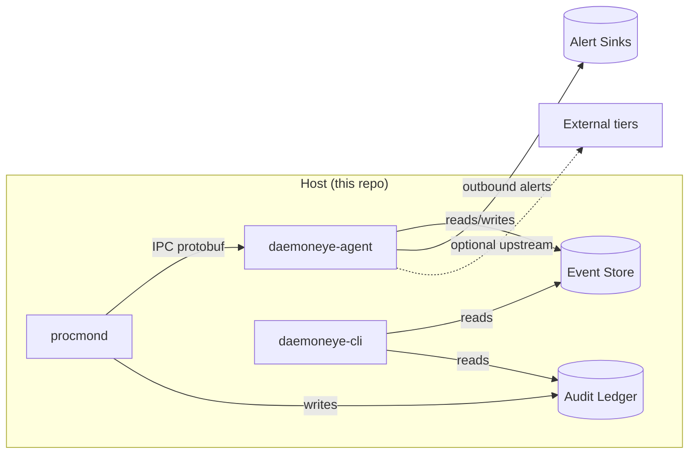

# DaemonEye Development Guide

> *"We watch from the shadows — our eyes never close."*

## Mission

DaemonEye is a **silent observability and hunt layer** for sensitive, restricted, and air-gapped environments. It turns endpoints into stealth honeypots: passive by default, surgically traceable on demand, and cryptographically auditable. Telemetry never leaves customer control unless explicitly exported by an operator.

**This repository** contains the open-source Community tier — the agent-side foundation that all higher tiers build upon:

- **procmond** — privileged process collector, audit ledger, binary hashing
- **daemoneye-agent** — detection orchestrator, alert delivery, event bus
- **daemoneye-cli** — operator query interface and rule management
- **daemoneye-lib** — shared library (config, models, storage, detection, crypto)
- **collector-core** — SDK for building new collectors in any language

DaemonEye also ships in higher commercial tiers (sold separately, not in this repo). The Community tier is designed to participate in that larger architecture — protobuf IPC contracts, capability negotiation, and store-and-forward patterns are built in from the start so this repo is the real foundation, not a stripped-down afterthought. See evilbitlabs.io for commercial details.

### Core use-case: ShadowHunt

The cornerstone scenario DaemonEye is built around:

1. **Passive baseline** — procmond collects lightweight process metadata, parent/child relationships, and connection tuples into the local store (redb)
2. **Heuristic trigger** — a detection rule (e.g., `Apache → bash spawn`) fires in the agent
3. **Silent trace** — a TraceCommand targets the root PID and descendants for focused tracing without host-visible artifacts
4. **Focused capture** — fork/exec, cmdline snapshots, file metadata, socket events — all cryptographically signed
5. **Cross-host stitching** — if a traced process connects to a remote host running DaemonEye, the trace fans out via shared trace_id
6. **Analyst review** — lineage graphs, replayable timeline, forensic SQL queries, signed export packages
7. **Manual action** — analysts decide containment or continued surveillance; DaemonEye avoids automated enforcement

Every architectural decision in this repo — privilege separation, protobuf IPC, hash-chained audit ledger, SQL-based detection DSL, collector-core SDK — exists to serve this workflow.

### Principles

| Principle                | Description                                                                   |
| ------------------------ | ----------------------------------------------------------------------------- |
| **Customer sovereignty** | All telemetry owned by the customer; no automatic egress to external services |
| **Silent observation**   | Default mode is passive; rules and traces generate no host-visible artifacts  |
| **Auditable forensics**  | All events Ed25519-signed, recorded in write-only audit ledger                |
| **Air-gap friendly**     | Fully functional offline; signed bundles for rule and update distribution     |
| **Privacy defaults**     | Command args masked by default; RBAC for trace initiation                     |

**Source of Truth**: Technical requirements for the Community tier live in `spec/` and `.kiro/specs/daemoneye-core-monitoring/`. Higher-tier designs are maintained privately and are not part of this repo.

---

## Quick Reference

### Task Runner (justfile)

```bash
just fmt          # Format all code
just fmt-check    # Check formatting (CI-friendly)
just lint         # Runs fmt-check + clippy + lint-just
just build        # Build all binaries with features
just check        # Quick check without build
just test         # Run all tests

just run-procmond [args]        # Run procmond
just run-daemoneye-cli [args]   # Run daemoneye-cli
just run-daemoneye-agent [args] # Run daemoneye-agent
```

### Core Commands

```bash
cargo build --workspace && cargo test --workspace
cargo clippy --workspace -- -D warnings
NO_COLOR=1 TERM=dumb cargo test --workspace  # Stable output
cargo bench                                   # Criterion benchmarks
cargo llvm-cov --all-features --workspace --lcov --output-path lcov.info

# GitHub CI monitoring
gh run list --branch <branch> --limit 5       # Check CI status
gh run view <run-id> --log-failed             # View failed job logs
gh run view <run-id> --json status,jobs       # JSON status check
```

Commit style: [.github/commit-instructions.md](.github/commit-instructions.md)

---

## AI Assistant Rules

### Behavior Guidelines

1. **No Auto-Commits**: Never commit without explicit permission. Always present diffs for approval.
2. **Security-First**: All changes must maintain least privilege and undergo security review.
3. **Zero-Warnings Policy**: `cargo clippy -- -D warnings` with no exceptions.
4. **Operator-Centric**: Prioritize workflows efficient in contested/airgapped environments.
5. **Documentation**: Mermaid for diagrams, relative links, maintain link hygiene.
6. **Testing Required**: All code changes must include appropriate tests.
7. **Linter Restrictions**: Never remove clippy restrictions or `deny` attributes.
8. **File Size Limit**: Keep source files under 500-600 lines when possible.
9. **AI Disclosure**: Always disclose AI usage in PR descriptions, following the AI Usage Policy [AI Usage Policy](AI_POLICY.md). Be transparent, but brief — no need to list every prompt, just the tools used (e.g., "Used Claude Code (`Claude Opus 4.7 (1M Context)`) for initial draft of detection engine refactor. All code reviewed and tested.").

### Rule Precedence

1. Project Rules (AGENTS.md)
2. Steering Documents (specs/, .kiro/steering/)
3. Technical Specifications (.kiro/specs/)
4. Embedded defaults

---

## Architecture Overview

DaemonEye implements a **three-component security architecture** with strict privilege separation. This repo contains the host-side components. Commercial tiers extend this foundation with fleet management and centralized aggregation; those components live in separate private codebases and are not described here.

### Components (this repo)

| Component           | Privileges                  | Network       | Database            | Function                     |
| ------------------- | --------------------------- | ------------- | ------------------- | ---------------------------- |
| **procmond**        | Elevated (drops after init) | None          | Write-only (audit)  | Privileged process collector |
| **daemoneye-agent** | Minimal                     | Outbound-only | Read/write (events) | Detection orchestrator       |
| **daemoneye-cli**   | Minimal                     | None          | Read-only           | Operator CLI                 |
| **daemoneye-lib**   | N/A                         | N/A           | N/A                 | Shared library               |
| **collector-core**  | N/A                         | N/A           | N/A                 | Collector SDK                |

### Deployment architecture


```mermaid
flowchart LR
    subgraph "Host (this repo)"
        P[procmond] -->|IPC protobuf| A[daemoneye-agent]
        A -->|reads/writes| DB1[(Event Store)]
        P -->|writes| DB2[(Audit Ledger)]
        C[daemoneye-cli] -->|reads| DB1 & DB2
    end
    A -->|outbound alerts| EXT[(Alert Sinks)]
    A -.->|optional upstream| UP[External tiers]
```

The dashed line to "External tiers" indicates that `daemoneye-agent`'s outbound IPC contract is designed to support upstream aggregation in commercial deployments. The upstream components are not part of this repo.

### Security Boundaries

- **Privilege Separation**: Only procmond runs elevated when necessary
- **IPC**: Protobuf over Unix sockets/named pipes with CRC32 validation
- **No Inbound Network**: Outbound-only for alert delivery
- **SQL Injection Prevention**: AST validation with sqlparser, prepared statements only \[Implemented: rule load-time validation; rule execution engine is a placeholder — see `detection/mod.rs`\]

---

## Technology Stack

### Core

| Category     | Technology                      |
| ------------ | ------------------------------- |
| Language     | Rust 2024 Edition (MSRV: 1.91+) |
| Async        | Tokio                           |
| Database     | redb (pure Rust embedded)       |
| CLI          | clap v4 with derive             |
| Process Enum | sysinfo                         |
| Logging      | tracing ecosystem               |
| Config       | YAML/TOML via figment           |
| IPC          | interprocess + protobuf         |
| Event Bus    | crossbeam                       |
| Testing      | cargo-nextest, insta, criterion |

### Dependencies

| Category      | Crate     | Version |
| ------------- | --------- | ------- |
| Runtime       | tokio     | 1.0+    |
| Serialization | serde     | 1.0+    |
| CLI           | clap      | 4.0+    |
| Database      | redb      | 3.0+    |
| Process       | sysinfo   | 0.37+   |
| Logging       | tracing   | 0.1+    |
| Errors        | thiserror | 2.0+    |
| Errors        | anyhow    | 1.0+    |
| Crypto        | blake3    | 1.8+    |
| Crypto        | rs-merkle | 1.5+    |
| Testing       | insta     | 1.0+    |
| Benchmarks    | criterion | 0.7+    |

### OS Support

| OS      | Version                                       | Arch          | Status    |
| ------- | --------------------------------------------- | ------------- | --------- |
| Linux   | Ubuntu 20.04+ LTS, RHEL/CentOS 8+, Debian 11+ | x86_64, ARM64 | Primary   |
| macOS   | 14.0+ (Sonoma)                                | x86_64, ARM64 | Primary   |
| Windows | 10+, Server 2019+                             | x86_64, ARM64 | Primary   |
| Linux   | Alpine 3.16+, Amazon Linux 2+                 | x86_64, ARM64 | Secondary |
| FreeBSD | 13.0+                                         | x86_64, ARM64 | Secondary |

---

## Coding Standards

### Rust Requirements

- **Edition**: Rust 2024 (MSRV: 1.91+)
- **Linting**: `cargo clippy -- -D warnings` (zero warnings)
- **Format args**: Use `{variable}` inlined syntax in `format!`/`anyhow!` macros (`clippy::uninlined_format_args`)
- **If-else ordering**: Clippy prefers `==` checks first in if-else (`clippy::unnecessary_negation`)
- **map_err_ignore**: Name ignored variables in closures (`|_elapsed|` not `|_|`)
- **as_conversions**: Add `#[allow(clippy::as_conversions)]` with safety comment for intentional casts
- **Async in tracing macros**: Never `.await` inside `info!`/`debug!`/`warn!`/`error!` - causes `future_not_send`. Extract value first.
- **string_slice**: Denied — use `split_once('=')` or `char_indices()` instead of `&s[..pos]` on user input
- **items_after_statements**: All `const` declarations must be at function top, not after `return` statements
- **Safety**: `unsafe_code = "forbid"` at workspace level
- **Formatting**: `rustfmt` with 119 char line length
- **Rustdoc**: Escape brackets in paths like `/proc/\[pid\]/stat` to avoid broken link warnings
- **Errors**: `thiserror` for structured errors, `anyhow` for context
- **Async**: Async-first with Tokio
- **Logging**: Structured with `tracing`
- **Strictness**: `warnings = "deny"` at workspace; `allow` requires justification

### Pre-commit Requirements

1. `cargo clippy -- -D warnings` (zero warnings)
2. `cargo fmt --all --check` (formatting)
3. `cargo test --workspace` (all tests pass)
4. `just lint-just` (justfile syntax)
5. No new `unsafe` without approval
6. Benchmarks within acceptable ranges

**Gotchas**: Pre-commit runs `cargo fmt` which modifies files. If unstaged changes exist, commit may fail with "Stashed changes conflicted". Run `cargo fmt --all` before staging or reset unrelated unstaged files.

---

## Security Model

### Core Requirements

- Least privilege: Components run with minimal permissions
- Automatic privilege drop after initialization
- SQL injection prevention: AST validation at rule load time [Implemented]; SQL-based rule execution \[Planned — engine currently uses pattern matching, see `detection/mod.rs`\]. Pipeline is two-phase: sqlparser lowers the custom dialect (spec §4.10) at rule-compile time into (a) protobuf collection tasks and (b) derived standard SQL; the runtime executor only sees the derived SQL, never the original dialect.
- Credentials: Environment variables or OS keychain, never hardcoded
- No inbound network: Outbound-only for alerts
- Audit trail: BLAKE3 hash-chained audit ledger [Implemented]; Merkle tree inclusion proofs \[In Progress — `generate_inclusion_proof()` returns empty vec, see `crypto.rs`\]

### Planned Hardening (Community)

- SLSA Level 3 provenance, Cosign signatures [Planned]
- Merkle tree with inclusion proofs \[In Progress — chain hashing implemented; inclusion proof generation stubbed in `crypto.rs`\]
- Sandboxed detection engine (read-only DB) [Planned]
- Query whitelist (SELECT only with approved functions) [Implemented for rule validation; not yet enforced at execution time]

> Fleet-level transport security (mTLS between host agents and upstream aggregators) is handled in the commercial tiers, not in this repo.

### Integer Overflow Protection

```toml
[profile.release]
overflow-checks = true
lto = "thin"
codegen-units = 1
```

Use `checked_*`, `saturating_*`, or explicit `wrapping_*` for security-sensitive calculations.

### Safe Concurrency

- **Tokio primitives**: `Semaphore`, `mpsc`, `oneshot`, `watch`, `Notify`
- **Lock scope**: Never await while holding locks
- **Async locks**: `tokio::sync::Mutex/RwLock` for async; `std::sync` for sync-only
- **Bounded concurrency**: Use `Semaphore` with defined capacity
- **Linting**: Enable `clippy::await_holding_lock = "deny"`

### Cryptographic Standards

| Purpose    | Approved                             |
| ---------- | ------------------------------------ |
| Hashing    | BLAKE3, SHA2 (never SHA-1)           |
| Signatures | ed25519-dalek                        |
| AEAD       | chacha20poly1305, aes-gcm            |
| KDF        | HKDF-SHA256, Argon2id                |
| TLS        | rustls (TLS 1.2+ min, 1.3 preferred) |
| Entropy    | getrandom                            |
| Secrets    | secrecy, zeroize crates              |

### Input Validation

- Treat all external inputs as untrusted
- Validate early, reject with actionable errors
- Use typed parsers over regex
- Length limits on all variable-length inputs
- **Socket path limit**: Unix `sockaddr_un.sun_path` is 108 bytes with NUL — usable limit is 107, not 255
- SQL: AST validation with `sqlparser` \[Implemented at rule load time; execution-time enforcement is [Planned]\]

### Newtype Safety

Use newtypes for domain constraints (ports vs PIDs vs timestamps). Implement `TryFrom` with validation.

### Dependency Security

- Commit `Cargo.lock`, use `resolver = "3"`
- Pin security-critical deps, avoid wildcards
- `default-features = false`, enable only needed
- Git deps: pin to commit SHA
- Tools: `cargo audit`, `cargo deny`, `cargo vet`

---

## Performance Budgets

| Metric         | Target                          |
| -------------- | ------------------------------- |
| CPU Usage      | < 5% sustained                  |
| Memory         | < 100 MB resident               |
| Process Enum   | < 5s for 10,000+ processes      |
| DB Writes      | > 1,000 records/sec             |
| Alert Latency  | < 100ms per rule                |
| Query Response | Sub-second for 100k+ events/min |

### Resource Management

- Bounded channels with backpressure
- Memory budget enforcement
- Cancellation tokens for graceful shutdown
- Circuit breakers for external dependencies
- Graceful degradation when constrained

---

## Code Organization

### Workspace Structure

```text
DaemonEye/
├── Cargo.toml              # Workspace root
├── procmond/               # Privileged collector
├── daemoneye-agent/        # Detection orchestrator
├── daemoneye-cli/          # Operator CLI
├── daemoneye-lib/          # Shared library
│   ├── proto/              # Protobuf definitions
│   └── src/
│       ├── alerting.rs     # Alert delivery
│       ├── config.rs       # Configuration
│       ├── crypto.rs       # Cryptographic functions
│       ├── detection.rs    # SQL detection engine
│       ├── models.rs       # Data structures
│       └── storage.rs      # Database (redb)
├── collector-core/         # Collector framework
├── tests/                  # Integration tests
├── docs/solutions/         # Documented solutions (YAML frontmatter, by category)
└── .kiro/                  # Steering docs & specs
```

### Service Layer Pattern

```rust
#[async_trait]
pub trait ProcessCollectionService: Send + Sync {
    async fn collect_processes(&self) -> Result<CollectionResult, CollectionError>;
}

#[async_trait]
pub trait AlertSink: Send + Sync {
    async fn send(&self, alert: &Alert) -> Result<DeliveryResult, AlertingError>;
    fn name(&self) -> &str;
    async fn health_check(&self) -> Result<(), AlertingError>;
}
```

---

## Testing Strategy

### Three-Tier Architecture

| Tier           | Scope                 | Tools                        |
| -------------- | --------------------- | ---------------------------- |
| Unit           | Individual components | tokio-test, trait mocking    |
| Integration    | Cross-component       | insta, predicates, real redb |
| E2E (Optional) | Full system workflows | Test data seeding            |

### Quality Tools

- **Runner**: cargo-nextest (parallel, failure isolation)
- **Coverage**: llvm-cov (target: >85%)
- **Property**: proptest for edge cases
- **Fuzz**: Security-critical components
- **Snapshot**: insta for CLI output
- **Cross-crate traits**: Import traits for method access (e.g., `use daemoneye_eventbus::rpc::RegistrationProvider;`)

### Test Environment

```bash
NO_COLOR=1 TERM=dumb cargo test --workspace           # Stable output
RUST_BACKTRACE=1 cargo test -p daemoneye-lib --nocapture  # Debug
cargo bench --baseline previous                        # Regression
```

### CI Matrix

- Platforms: Linux, macOS, Windows
- Rust: stable, beta, MSRV (1.91+)
- Architectures: x86_64, ARM64

---

## Database Design

### redb Tables

| Table            | Access                   | Component |
| ---------------- | ------------------------ | --------- |
| processes        | R/W                      | agent     |
| scans            | R/W                      | agent     |
| detection_rules  | R/W                      | agent     |
| alerts           | R/W                      | agent     |
| alert_deliveries | R/W                      | agent     |
| audit_ledger     | W (procmond), R (others) | procmond  |

### Core Data Types

```rust
#[derive(Debug, Clone, Serialize, Deserialize)]
pub struct ProcessInfo {
    pub pid: u32,
    pub ppid: Option<u32>,
    pub name: String,
    pub executable_path: Option<String>,
    pub command_line: Option<String>,
    pub start_time: Option<DateTime<Utc>>,
    pub cpu_usage: Option<f64>,
    pub memory_usage: Option<u64>,
    pub status: ProcessStatus,
    pub executable_hash: Option<String>, // SHA-256
    pub collection_time: DateTime<Utc>,
}

#[derive(Debug, Error)]
pub enum CollectionError {
    #[error("Permission denied accessing process {pid}")]
    PermissionDenied { pid: u32 },
    #[error("Process {pid} no longer exists")]
    ProcessNotFound { pid: u32 },
    #[error("Database operation failed: {0}")]
    DatabaseError(String),
    #[error("IPC communication failed: {0}")]
    IpcError(String),
}
```

---

## CLI & Configuration

### CLI Design (clap v4)

```rust
#[derive(Parser)]
#[command(name = "procmond", about = "Process monitoring daemon")]
pub struct Cli {
    #[command(subcommand)]
    pub command: Commands,
    #[arg(short, long)]
    pub config: Option<PathBuf>,
    #[arg(short, long, default_value = "info")]
    pub log_level: String,
}
```

- Use `--json` for machine-readable output
- Respect `NO_COLOR` and `TERM=dumb`
- Provide actionable error messages

### Configuration Precedence

1. Command-line flags
2. Environment variables (component-namespaced: `DAEMONEYE_AGENT_*`, `DAEMONEYE_CLI_*`, `PROCMOND_*`)
3. User config (`~/.config/daemoneye/config.toml`)
4. System config (`/etc/daemoneye/config.toml`)
5. Embedded defaults

---

## Alert System

- Trait-based plugin system (`AlertSink` trait)
- Concurrent delivery to multiple sinks
- Retry with exponential backoff
- Circuit breaking for failing sinks
- Delivery audit trail

---

## CI/CD & Reviews

### Continuous Integration

- GitHub Actions: Linux, macOS, Windows matrix
- Rust: stable, beta, MSRV (1.91+)
- Checks: fmt, clippy strict, tests, benchmarks
- Security: Dependency scanning, SLSA provenance

### Security Scanners

- **zizmor**: GitHub Actions permissions - add explicit `permissions:` block to workflows
- **CodeQL rust/cleartext-logging**: Don't interpolate sensitive values in assert messages

### Code Review

- Primary tool: coderabbit.ai
- Security focus, performance assessment
- Single maintainer: UncleSp1d3r

### Commit Standards

- Format: Conventional Commits
- Types: `feat`, `fix`, `docs`, `style`, `refactor`, `perf`, `test`, `build`, `ci`, `chore`
- Breaking: `!` in header or `BREAKING CHANGE:` in footer

---

## Contribution Checklists

### Adding a Detection Rule

Files: `daemoneye-lib/src/detection.rs`, `daemoneye-lib/src/models.rs`, `daemoneye-agent/src/rules/`, `tests/integration/`

- [ ] Define rule structure with SQL and metadata
- [ ] Implement AST validation (sqlparser)
- [ ] Unit tests with mock data
- [ ] Integration test via agent
- [ ] Validate alert delivery via CLI
- [ ] `cargo clippy -- -D warnings` passes
- [ ] Performance test if complex
- [ ] Rustdoc documentation

### Adding a CLI Option

Files: `daemoneye-cli/src/main.rs`, `daemoneye-lib/src/config.rs`, `tests/integration/`

- [ ] Update clap derive structures
- [ ] Configuration handling in lib
- [ ] Help text and defaults
- [ ] Insta snapshot tests
- [ ] Test short/long forms
- [ ] Validate with `NO_COLOR=1 TERM=dumb`
- [ ] Update shell completions
- [ ] Rustdoc documentation

### Optimizing Database Write Path

Files: `daemoneye-lib/src/storage.rs`, `procmond/src/collector.rs`, `benches/`

- [ ] Establish criterion baseline
- [ ] Implement optimization
- [ ] Batch processing if applicable
- [ ] Validate >1000 records/sec
- [ ] Test with 10k+ processes
- [ ] Memory profiling
- [ ] ACID guarantees maintained
- [ ] Document characteristics

---

## Code Generation Guidelines

When generating code:

01. Use Rust 2024 Edition
02. Comprehensive error handling with thiserror
03. Async/await with Tokio
04. Tests with insta for snapshots
05. Service layer pattern with traits
06. Logging with tracing
07. Workspace inheritance for deps
08. Performance considerations
09. Security best practices
10. Rustdoc for public APIs

---

## Source-of-Truth Map

| Section             | Source                                                                                                                   |
| ------------------- | ------------------------------------------------------------------------------------------------------------------------ |
| Architecture        | [.kiro/steering/structure.md](./.kiro/steering/structure.md)                                                             |
| Technology          | [.kiro/steering/tech.md](./.kiro/steering/tech.md)                                                                       |
| Product             | [.kiro/steering/product.md](./.kiro/steering/product.md)                                                                 |
| Core Requirements   | [.kiro/specs/daemoneye-core-monitoring/requirements.md](./.kiro/specs/daemoneye-core-monitoring/requirements.md)         |
| Development         | [.kiro/steering/development.md](./.kiro/steering/development.md)                                                         |
| SQL-to-IPC Pipeline | [spec/daemon_eye_spec_sql_to_ipc_detection_architecture.md](./spec/daemon_eye_spec_sql_to_ipc_detection_architecture.md) |

### Cross-References

- Cursor IDE: [.cursor/rules/](./.cursor/rules/)
- Security: [.cursor/rules/security-standards.mdc](./.cursor/rules/security-standards.mdc)
- Rust: [.cursor/rules/rust-standards.mdc](./.cursor/rules/rust-standards.mdc)

---

## Glossary

| Term   | Definition                                 |
| ------ | ------------------------------------------ |
| AST    | Abstract Syntax Tree (SQL validation)      |
| BLAKE3 | Cryptographic hash for audit trails        |
| CEF    | Common Event Format                        |
| eBPF   | Extended Berkeley Packet Filter            |
| ETW    | Event Tracing for Windows                  |
| IPC    | Inter-Process Communication                |
| redb   | Pure Rust embedded database                |
| SLSA   | Supply-chain Levels for Software Artifacts |

---

**Remember**: DaemonEye is security-focused. Prioritize security, performance, and reliability. When in doubt, choose the more secure and observable approach.

## Agent Rules <!-- tessl-managed -->

@.tessl/RULES.md follow the [instructions](.tessl/RULES.md)
