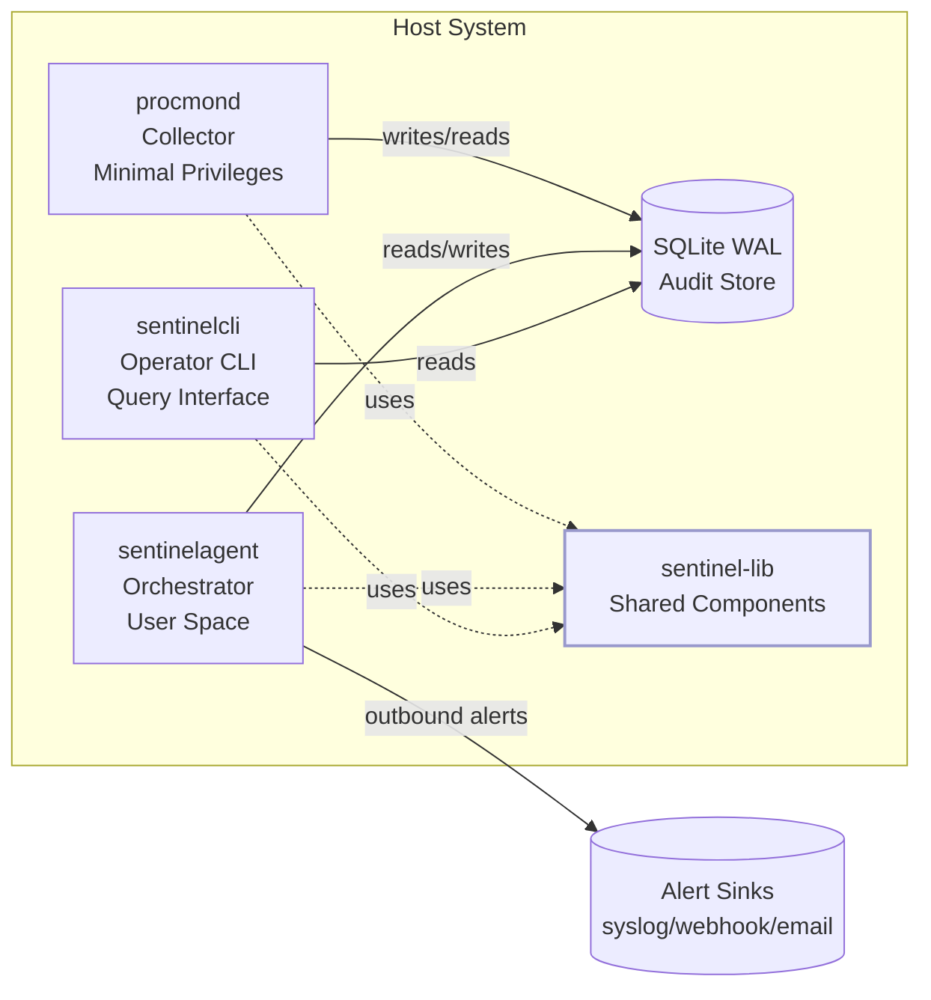

# WARP.md

This file provides guidance to WARP (warp.dev) when working with code in this repository.

**SentinelD** is a security-focused, high-performance process monitoring system built in Rust 2024 Edition. This guide provides actionable commands and architectural context for WARP/Cursor users working on this security-critical workspace.

## Essential Development Commands

### Workspace Operations

```bash
# Build all components
cargo build --workspace --all-features

# Test entire workspace
cargo test --workspace --all-features

# Lint with zero-warnings policy
cargo clippy --workspace --all-targets --all-features -- -D warnings

# Format all code
cargo fmt --all

# Quick check (faster than build)
cargo check --workspace --all-targets --all-features

# Use justfile for convenience
just build    # Build workspace
just test     # Run tests
just lint     # Format check + clippy + justfile lint
just fmt      # Format code
```

### Component-Specific Commands

#### procmond (Process Collector)

```bash
# Run with default logging
RUST_LOG=info cargo run -p procmond

# Show help
cargo run -p procmond -- --help

# Run single test for procmond
cargo test -p procmond

# Run with trace-level logging
RUST_LOG=trace cargo run -p procmond
```

#### sentinelagent (Orchestrator)

```bash
# Run agent
RUST_LOG=info cargo run -p sentinelagent

# Show help
cargo run -p sentinelagent -- --help
```

#### sentinelcli (CLI Interface)

```bash
# Show help (default behavior currently)
cargo run -p sentinelcli -- --help

# Disable color output
NO_COLOR=1 cargo run -p sentinelcli
```

### Environment Controls

```bash
# Disable color output (respects Rich library standard)
NO_COLOR=1 <command>
TERM=dumb <command>

# Enable backtraces
RUST_BACKTRACE=1 <command>

# Control log levels
RUST_LOG=trace|debug|info|warn|error <command>
```

### Testing Commands

```bash
# Run all tests with backtraces
RUST_BACKTRACE=1 cargo test --workspace

# Run tests for specific crate
cargo test -p sentinel-lib
cargo test -p procmond

# Run integration tests with stable output
NO_COLOR=1 TERM=dumb cargo test --workspace
```

## Architecture Overview

SentinelD implements a **three-component security architecture** with privilege separation:



### Component Responsibilities

- **procmond**: Privileged process collector with minimal attack surface

  - Collects process metadata with optional elevated privileges
  - Writes to tamper-evident SQLite database via sentinel-lib
  - Runs with least necessary privileges, drops elevation after init

- **sentinelagent**: User-space orchestrator for detection and alerting

  - Executes SQL-based detection rules against collected data
  - Delivers alerts via multiple channels (syslog, webhook, email)
  - Outbound-only network connections, no listening ports

- **sentinelcli**: Command-line interface for operators

  - Query historical process data with flexible SQL interface
  - Export results in JSON or human-readable formats
  - Configuration and system health checking

- **sentinel-lib**: Shared library providing core functionality

  - Configuration management with hierarchical override support
  - Data models and storage abstractions (SQLite WAL mode)
  - Process collection services and detection engine
  - Alert delivery and sink management

### Security Boundaries

- **Privilege Separation**: Only procmond runs with elevated privileges when necessary
- **No Inbound Network**: System is outbound-only for alert delivery
- **Input Validation**: All data validated with serde and typed models
- **SQL Injection Prevention**: Parameterized queries and prepared statements only

## Key Project Conventions

### Rust Standards

- **Edition**: 2024 (MSRV: 1.70+)
- **Zero Warnings Policy**: `cargo clippy -- -D warnings`
- **Unsafe Code**: Forbidden at workspace level (`unsafe_code = "forbid"`)
- **Line Length**: 119 characters (rustfmt configured)
- **Error Handling**: Use `thiserror` for structured errors, `anyhow` for context
- **Async Runtime**: Tokio for all I/O operations
- **Logging**: Structured logging with `tracing` ecosystem (JSON or human-readable)

### Security-First Design

- **Principle of Least Privilege**: Components run with minimal required permissions
- **Attack Surface Minimization**: No unnecessary network listeners or file access
- **Credential Management**: Environment variables or OS keychain, never hardcode secrets
- **Database Security**: Prepared statements only, WAL mode for concurrent access
- **Input Validation**: Comprehensive validation with actionable error messages

### Documentation Standards

- **Diagrams**: Use Mermaid for all architectural and flow diagrams
- **Markdown**: Prettier configured to ignore Markdown files (.prettierignore)
- **API Documentation**: Rustdoc comments for all public interfaces

## Performance and Security Requirements

### Performance Targets

- **CPU Usage**: < 5% sustained during continuous monitoring
- **Memory Usage**: < 100 MB resident under normal operation
- **Process Enumeration**: < 5s for 10,000+ processes
- **Database Write Rate**: > 1000 records/second
- **Alert Latency**: < 100ms per detection rule execution

### Security Requirements

- **Privilege Elevation**: Optional, with automatic privilege dropping post-initialization
- **SQL Operations**: Parameterized queries and prepared statements exclusively
- **Credential Storage**: Environment variables or OS-native secure storage
- **Input Validation**: Comprehensive validation with clear, actionable error messages
- **Network Access**: Outbound-only connections for alert delivery

## Testing Strategy

### Three-Tier Testing Architecture

#### Unit Tests

Focus on individual components in `sentinel-lib` with trait-based service mocking:

```rust
use assert_cmd::prelude::*;
use predicates::prelude::*;
use std::process::Command;

#[test]
fn cli_displays_help() {
    let mut cmd = Command::cargo_bin("sentinelcli").unwrap();
    cmd.arg("--help");
    cmd.assert()
        .success()
        .stdout(predicate::str::contains("Usage"));
}
```

#### Integration Tests

- **CLI Testing**: Use `assert_cmd` + `predicates` for binary integration
- **Database Testing**: SQLite with temporary files in WAL mode
- **Output Validation**: JSON and human-readable format verification

#### End-to-End Testing (Optional)

Compose full scenarios: procmond collection → database population → agent rule execution → CLI querying

### Testing Tools and Libraries

- **CLI Integration**: `assert_cmd` and `predicates` (already configured)
- **Performance Testing**: Recommend `criterion` for benchmarking critical paths
- **Snapshot Testing**: Recommend `insta` for stable JSON/text output verification
- **Output Stabilization**: Use `NO_COLOR=1` and `TERM=dumb` in tests

### Test Execution

```bash
# Run all tests with stable output
NO_COLOR=1 TERM=dumb cargo test --workspace

# Test specific component
cargo test -p sentinel-lib

# Run with verbose output and backtraces
RUST_BACKTRACE=1 cargo test --workspace -- --nocapture
```

## Justfile Integration

The project uses `just` as a task runner with DRY principles. Current recipes follow the pattern of composing larger tasks from smaller ones:

### Core Recipes

```bash
# Formatting
just fmt          # Format all code
just fmt-check    # Check formatting (CI-friendly)

# Linting (composed recipe)
just lint         # Runs fmt-check + clippy + lint-just
just lint-rust    # Clippy with strict warnings
just lint-just    # Lint justfile syntax

# Building and Testing
just build        # Build workspace
just check        # Quick check without build
just test         # Run all tests

# Component Execution
just run-procmond [args]      # Run procmond with optional args
just run-sentinelcli [args]   # Run sentinelcli with optional args
just run-sentinelagent [args] # Run sentinelagent with optional args
```

### DRY Recipe Philosophy

- Compose complex tasks by calling `@just <subrecipe>`
- Keep paths relative to project directory
- Use consistent argument patterns with defaults
- Include `lint-just` recipe to validate justfile syntax

### Example Usage

```bash
# Full CI pipeline
just lint && just build && just test

# Component development
just run-procmond --help
RUST_LOG=debug just run-procmond

# Formatting workflow
just fmt && just lint
```

## WARP/Cursor Specific Notes

- **Architecture Authority**: See `AGENTS.md` for complete technical architecture and requirements
- **No Auto-Commits**: Never commit code automatically; present diffs for UncleSp1d3r approval
- **Conventional Commits**: Use conventional commit format when changes are approved
- **Mermaid Diagrams**: Standard for all visual documentation
- **Testing**: Always use stable output modes in tests (`NO_COLOR=1 TERM=dumb`)

## Common Development Scenarios

### Adding New Detection Rules

1. Implement in `sentinel-lib/src/detector.rs`
2. Add SQL-based rule definition
3. Write unit tests with mocked data
4. Add integration test via `sentinelagent`
5. Validate alert delivery through `sentinelcli`

### Performance Optimization

1. Use `criterion` benchmarks for critical paths
2. Monitor against performance targets (see requirements above)
3. Profile with `cargo flamegraph` or `perf` on Linux
4. Test with 10k+ process datasets

### Security Hardening

1. Review privilege requirements for new features
2. Validate all input boundaries with comprehensive tests
3. Use parameterized queries exclusively for database operations
4. Test credential handling with environment variable mocking

---

**Note**: This is a security-critical system. All changes must maintain the principle of least privilege and undergo thorough security review before deployment.
