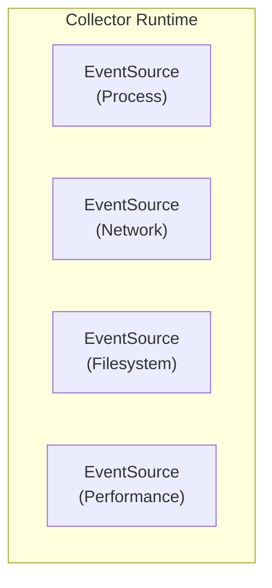

# collector-core

A reusable collection infrastructure framework for DaemonEye monitoring components.

## Overview

The `collector-core` framework provides a unified foundation for multiple collection components, enabling extensible monitoring capabilities while maintaining shared operational infrastructure.

## Features

- **Universal EventSource Trait**: Abstracts collection methodology from operational infrastructure
- **Collector Runtime**: Manages event sources, handles event aggregation, and provides shared services
- **Extensible Event Model**: Supports multiple collection domains through unified event types
- **Capability Negotiation**: Dynamic feature discovery and task routing through `SourceCaps` bitflags
- **Shared Infrastructure**: Common configuration, logging, health checks, and graceful shutdown

## Architecture



## Usage

### Basic Example

```rust
use collector_core::{Collector, CollectorConfig, EventSource, CollectionEvent, SourceCaps};
use async_trait::async_trait;
use tokio::sync::mpsc;

struct MyEventSource;

#[async_trait]
impl EventSource for MyEventSource {
    fn name(&self) -> &'static str {
        "my-source"
    }

    fn capabilities(&self) -> SourceCaps {
        SourceCaps::PROCESS | SourceCaps::REALTIME
    }

    async fn start(&self, tx: mpsc::Sender<CollectionEvent>) -> anyhow::Result<()> {
        // Implementation here
        Ok(())
    }

    async fn stop(&self) -> anyhow::Result<()> {
        Ok(())
    }
}

#[tokio::main]
async fn main() -> anyhow::Result<()> {
    let config = CollectorConfig::default();
    let mut collector = Collector::new(config);

    collector.register(Box::new(MyEventSource));
    collector.run().await
}
```

### Configuration

The collector can be configured using the builder pattern:

```rust
use collector_core::CollectorConfig;
use std::time::Duration;

let config = CollectorConfig::new()
    .with_max_event_sources(32)
    .with_event_buffer_size(2000)
    .with_shutdown_timeout(Duration::from_secs(60))
    .with_health_check_interval(Duration::from_secs(120))
    .with_debug_logging(true);
```

### Event Types

The framework supports multiple event domains:

```rust
use collector_core::{CollectionEvent, ProcessEvent, NetworkEvent};
use std::time::SystemTime;

// Process events
let process_event = CollectionEvent::Process(ProcessEvent {
    pid: 1234,
    name: "example".to_string(),
    timestamp: SystemTime::now(),
    // ... other fields
});

// Network events (future extension)
let network_event = CollectionEvent::Network(NetworkEvent {
    connection_id: "conn_123".to_string(),
    protocol: "TCP".to_string(),
    timestamp: SystemTime::now(),
    // ... other fields
});
```

### Capabilities

Event sources declare their capabilities using bitflags:

```rust
use collector_core::SourceCaps;

// Process monitoring with real-time capabilities
let process_caps = SourceCaps::PROCESS | SourceCaps::REALTIME | SourceCaps::SYSTEM_WIDE;

// Network monitoring with kernel-level access
let network_caps = SourceCaps::NETWORK | SourceCaps::KERNEL_LEVEL | SourceCaps::REALTIME;

// Check capabilities
assert!(process_caps.contains(SourceCaps::PROCESS));
assert!(!process_caps.contains(SourceCaps::NETWORK));
```

## Multi-Component Vision

The collector-core framework enables multiple monitoring components:

1. **procmond**: Process monitoring using collector-core + process `EventSource`
2. **netmond**: Network monitoring using collector-core + network `EventSource` (future)
3. **fsmond**: Filesystem monitoring using collector-core + filesystem `EventSource` (future)
4. **perfmond**: Performance monitoring using collector-core + performance `EventSource` (future)

## Testing

The collector-core framework includes a comprehensive test suite covering all aspects of the framework:

### Test Categories

- **Unit Tests (6 tests)**: Basic functionality, configuration validation, and EventSource registration
- **Integration Tests (3 tests)**: Multi-source coordination, event batching, and IPC server functionality
- **Performance Tests (3 tests)**: Runtime overhead, event throughput, and memory usage under load
- **Security Tests (3 tests)**: EventSource isolation, capability enforcement, and resource limits
- **Property-Based Tests (3 tests)**: Serialization roundtrips, capability combinations, and config validation
- **Chaos Tests (4 tests)**: Failure recovery, graceful shutdown, resource exhaustion, and concurrent operations
- **Compatibility Tests (4 tests)**: Integration with existing procmond and daemoneye-agent components

### Performance Characteristics

- **Event Throughput**: >1000 events/second under normal load
- **Runtime Overhead**: \<5% CPU usage during continuous monitoring
- **Memory Usage**: Bounded memory usage under high load
- **Shutdown Time**: \<500ms graceful shutdown coordination

### Running Tests

Run the test suite:

```bash
cargo test -p collector-core
```

Run integration tests:

```bash
cargo test -p collector-core --test integration_test
```

Run performance benchmarks:

```bash
cargo bench -p collector-core
```

## License

Licensed under the Apache License, Version 2.0.
