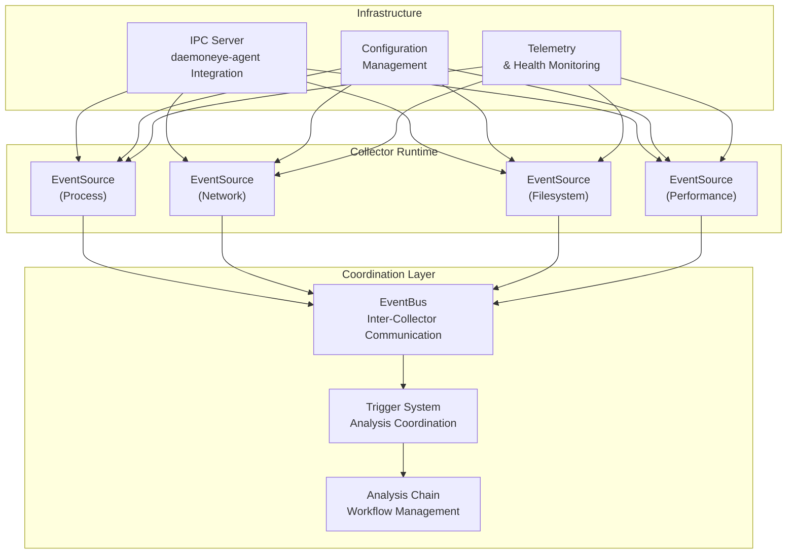

# collector-core

A reusable collection infrastructure framework that enables multiple monitoring components while maintaining shared operational foundation. `collector-core` provides the foundational infrastructure for DaemonEye's monitoring capabilities and can be used to build custom collection components.

## Overview

The `collector-core` framework provides a unified foundation for multiple collection components, enabling extensible monitoring capabilities while maintaining shared operational infrastructure. It supports process monitoring, network analysis, filesystem monitoring, and performance tracking through a unified event model and sophisticated coordination mechanisms.

**Core Capabilities:**

- **Universal EventSource Trait**: Abstracts collection methodology from operational infrastructure
- **Collector Runtime**: Manages event sources, handles event aggregation, and provides shared services
- **Extensible Event Model**: Supports multiple collection domains through unified event types
- **Capability Negotiation**: Dynamic feature discovery and task routing through `SourceCaps` bitflags
- **Shared Infrastructure**: Common configuration, logging, health checks, and graceful shutdown

## Architecture



## Usage

### Basic Example

```rust
use async_trait::async_trait;
use collector_core::{CollectionEvent, Collector, CollectorConfig, EventSource, SourceCaps};
use std::sync::{Arc, atomic::AtomicBool};
use tokio::sync::mpsc;

struct MyEventSource;

#[async_trait]
impl EventSource for MyEventSource {
    fn name(&self) -> &'static str {
        "my-source"
    }

    fn capabilities(&self) -> SourceCaps {
        SourceCaps::PROCESS | SourceCaps::REALTIME
    }

    async fn start(
        &self,
        tx: mpsc::Sender<CollectionEvent>,
        shutdown_signal: Arc<AtomicBool>,
    ) -> anyhow::Result<()> {
        // Implementation here - monitor shutdown signal
        while !shutdown_signal.load(std::sync::atomic::Ordering::Relaxed) {
            // Collect events and send via tx
            tokio::time::sleep(tokio::time::Duration::from_millis(100)).await;
        }
        Ok(())
    }

    async fn stop(&self) -> anyhow::Result<()> {
        Ok(())
    }
}

#[tokio::main]
async fn main() -> anyhow::Result<()> {
    let config = CollectorConfig::default();
    let mut collector = Collector::new(config);

    collector.register(Box::new(MyEventSource))?;
    collector.run().await
}
```

### Configuration

The collector can be configured using the builder pattern:

```rust
use collector_core::CollectorConfig;
use std::time::Duration;

fn create_config() -> CollectorConfig {
    CollectorConfig::new()
        .with_max_event_sources(32)
        .with_event_buffer_size(2000)
        .with_shutdown_timeout(Duration::from_secs(60))
        .with_health_check_interval(Duration::from_secs(120))
        .with_debug_logging(true)
}
```

### Event Types

The framework supports multiple event domains:

```rust
use collector_core::{CollectionEvent, NetworkEvent, ProcessEvent};
use std::time::SystemTime;

fn create_events() {
    // Process events
    let process_event = CollectionEvent::Process(ProcessEvent {
        pid: 1234,
        name: "example".to_string(),
        timestamp: SystemTime::now(),
        // ... other fields
    });

    // Network events (future extension)
    let network_event = CollectionEvent::Network(NetworkEvent {
        connection_id: "conn_123".to_string(),
        protocol: "TCP".to_string(),
        timestamp: SystemTime::now(),
        // ... other fields
    });
}
```

### Capabilities

Event sources declare their capabilities using bitflags:

```rust
use collector_core::SourceCaps;

fn demonstrate_capabilities() {
    // Process monitoring with real-time capabilities
    let process_caps = SourceCaps::PROCESS | SourceCaps::REALTIME | SourceCaps::SYSTEM_WIDE;

    // Network monitoring with kernel-level access
    let network_caps = SourceCaps::NETWORK | SourceCaps::KERNEL_LEVEL | SourceCaps::REALTIME;

    // Check capabilities
    assert!(process_caps.contains(SourceCaps::PROCESS));
    assert!(!process_caps.contains(SourceCaps::NETWORK));
}
```

## Advanced Features

### Event Bus System

Inter-collector communication with correlation tracking:

```rust
use collector_core::{EventBus, EventFilter, CorrelationFilter, LocalEventBus};

let event_bus = LocalEventBus::new(EventBusConfig::default()).await?;
event_bus.start().await?;

// Subscribe to process events with correlation
let filter = EventFilter::new()
    .with_event_type(CollectionEvent::Process)
    .with_correlation_filter(CorrelationFilter::by_pid(1234));

let subscription = event_bus.subscribe(filter).await?;
```

### Trigger System

Analysis collector coordination with SQL-based conditions:

```rust
use collector_core::{TriggerManager, TriggerCondition, TriggerConfig};

let trigger_manager = TriggerManager::new(TriggerConfig::default())?;

// Register collector capabilities
let capabilities = TriggerCapabilities {
    collector_id: "binary-hasher".to_string(),
    supported_conditions: vec![
        ConditionType::ProcessNamePattern("suspicious".to_string()),
        ConditionType::MissingExecutable,
    ],
    supported_analysis: vec![AnalysisType::BinaryHash],
    max_trigger_rate: 100,
    max_concurrent_analysis: 10,
    supported_priorities: vec![TriggerPriority::High, TriggerPriority::Critical],
    resource_limits: TriggerResourceLimits::default(),
};

trigger_manager.register_collector_capabilities(capabilities)?;

// Register trigger conditions
let condition = TriggerCondition {
    id: "suspicious-process".to_string(),
    description: "Detect suspicious processes".to_string(),
    analysis_type: AnalysisType::BinaryHash,
    priority: TriggerPriority::High,
    target_collector: "binary-hasher".to_string(),
    condition_type: ConditionType::ProcessNamePattern("malware".to_string()),
};

trigger_manager.register_condition(condition)?;
```

### Analysis Chain Management

Multi-stage analysis workflows:

```rust
use collector_core::{AnalysisChainCoordinator, AnalysisStage, AnalysisWorkflowDefinition};

let coordinator = AnalysisChainCoordinator::new(AnalysisChainConfig::default())?;

// Define analysis workflow
let workflow = AnalysisWorkflowDefinition::new()
    .with_stage(AnalysisStage::Collection)
    .with_stage(AnalysisStage::Enrichment)
    .with_stage(AnalysisStage::Detection)
    .with_stage(AnalysisStage::Alerting);

coordinator.execute_workflow(workflow).await?;
```

### Monitor Collector

Advanced process monitoring with lifecycle tracking:

```rust
use collector_core::{MonitorCollector, MonitorCollectorConfig};
use procmond::{ProcmondMonitorCollector, ProcmondMonitorConfig};

// Create procmond monitor collector
let config = ProcmondMonitorConfig {
    base_config: MonitorCollectorConfig {
        collection_interval: Duration::from_secs(30),
        max_events_in_flight: 1000,
        enable_event_driven: true,
        ..Default::default()
    },
    process_config: ProcessCollectionConfig::default(),
    lifecycle_config: LifecycleTrackingConfig::default(),
};

let monitor_collector = ProcmondMonitorCollector::new(database, config).await?;

// Use as EventSource
let mut collector = Collector::new(CollectorConfig::default());
collector.register(Box::new(monitor_collector))?;
collector.run().await?;
```

## Multi-Component Vision

The collector-core framework enables multiple monitoring components:

1. **procmond**: Process monitoring using collector-core + process `EventSource`
2. **netmond**: Network monitoring using collector-core + network `EventSource` (future)
3. **fsmond**: Filesystem monitoring using collector-core + filesystem `EventSource` (future)
4. **perfmond**: Performance monitoring using collector-core + performance `EventSource` (future)

### IPC Integration

Seamless communication with daemoneye-agent through protobuf:

```rust
use collector_core::{CollectorIpcServer, SourceCaps};
use daemoneye_lib::proto::{DetectionResult, DetectionTask};

// Create IPC server with capabilities
let capabilities = SourceCaps::PROCESS | SourceCaps::REALTIME | SourceCaps::SYSTEM_WIDE;
let mut ipc_server = CollectorIpcServer::new(config, capabilities).await?;

// Start IPC server for daemoneye-agent communication
ipc_server.start(|task| {
    Box::pin(async move {
        // Process detection task
        match task.task_type {
            ProtoTaskType::EnumerateProcesses => {
                // Enumerate processes and return results
                DetectionResult::success(&task.task_id, processes)
            }
            _ => DetectionResult::failure(&task.task_id, "Unsupported task type"),
        }
    })
}).await?;
```

### Real-World Usage Examples

**Process Monitoring with Lifecycle Tracking:**

```rust
use collector_core::{Collector, CollectorConfig, EventSource, SourceCaps};
use procmond::{ProcmondMonitorCollector, ProcmondMonitorConfig};

#[tokio::main]
async fn main() -> anyhow::Result<()> {
    // Create database manager
    let database = Arc::new(Mutex::new(DatabaseManager::new(
        "/var/lib/daemoneye/audit.db",
    )?));

    // Configure procmond monitor collector
    let config = ProcmondMonitorConfig {
        base_config: MonitorCollectorConfig {
            collection_interval: Duration::from_secs(30),
            max_events_in_flight: 1000,
            enable_event_driven: true,
            ..Default::default()
        },
        process_config: ProcessCollectionConfig {
            collect_enhanced_metadata: true,
            compute_executable_hashes: true,
            max_processes: 10000,
            ..Default::default()
        },
        lifecycle_config: LifecycleTrackingConfig {
            track_process_lifecycle: true,
            detect_suspicious_events: true,
            ..Default::default()
        },
    };

    // Create monitor collector
    let monitor_collector = ProcmondMonitorCollector::new(database, config).await?;

    // Create main collector
    let collector_config = CollectorConfig::new()
        .with_max_event_sources(16)
        .with_event_buffer_size(2000)
        .with_shutdown_timeout(Duration::from_secs(60));

    let mut collector = Collector::new(collector_config);
    collector.register(Box::new(monitor_collector))?;

    // Run collector
    collector.run().await
}
```

**Custom Event Source Implementation:**

```rust
use async_trait::async_trait;
use collector_core::{CollectionEvent, EventSource, ProcessEvent, SourceCaps};
use std::sync::{Arc, atomic::AtomicBool};
use tokio::sync::mpsc;

struct CustomProcessCollector {
    name: String,
    collection_interval: Duration,
}

#[async_trait]
impl EventSource for CustomProcessCollector {
    fn name(&self) -> &'static str {
        "custom-process-collector"
    }

    fn capabilities(&self) -> SourceCaps {
        SourceCaps::PROCESS | SourceCaps::REALTIME | SourceCaps::SYSTEM_WIDE
    }

    async fn start(
        &self,
        tx: mpsc::Sender<CollectionEvent>,
        shutdown_signal: Arc<AtomicBool>,
    ) -> anyhow::Result<()> {
        let mut interval = tokio::time::interval(self.collection_interval);

        loop {
            tokio::select! {
                _ = interval.tick() => {
                    if shutdown_signal.load(Ordering::Relaxed) {
                        break;
                    }

                    // Collect process data
                    let processes = self.collect_processes().await?;

                    // Send events
                    for process in processes {
                        if tx.send(CollectionEvent::Process(process)).await.is_err() {
                            break;
                        }
                    }
                }
                _ = async {
                    while !shutdown_signal.load(Ordering::Relaxed) {
                        tokio::time::sleep(Duration::from_millis(100)).await;
                    }
                } => {
                    break;
                }
            }
        }

        Ok(())
    }

    async fn stop(&self) -> anyhow::Result<()> {
        Ok(())
    }
}
```

## Testing

The collector-core framework includes comprehensive testing:

- **Unit Tests**: EventSource trait implementation, capability validation
- **Integration Tests**: Multi-source coordination, event flow validation
- **Performance Tests**: Throughput benchmarks, memory usage validation
- **Property Tests**: Event serialization, configuration validation

### Performance Requirements

- **Event Throughput**: Minimum 1000 events/second
- **CPU Overhead**: Maximum 5% sustained usage
- **Memory**: Bounded growth under continuous load
- **Shutdown**: Complete within graceful shutdown timeout

## License

Licensed under the Apache License, Version 2.0.
