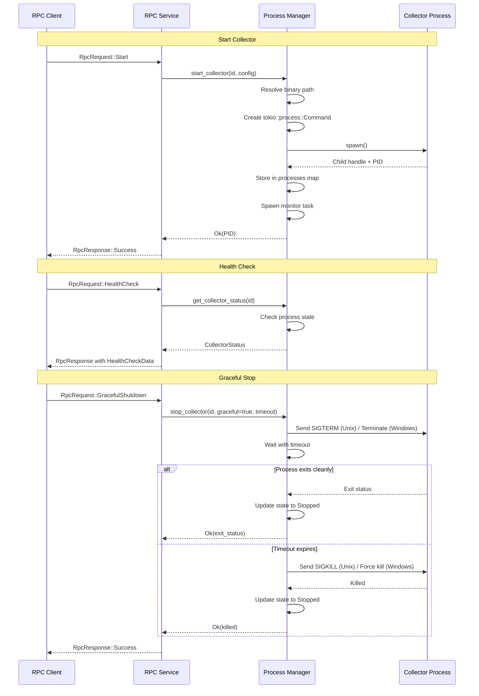

# Process Management in DaemonEye EventBus

## Overview

The Process Manager module provides comprehensive lifecycle management for collector processes, including spawning, monitoring, termination, pause/resume capabilities, and automatic restart on failure.

## Architecture



## Components

### CollectorProcessManager

Core manager providing process lifecycle operations:

- **Start**: Spawn collector processes with configuration
- **Stop**: Graceful or force termination with timeout handling
- **Restart**: Stop and start with preserved configuration
- **Pause/Resume**: Process suspension (Unix only)
- **Health Monitoring**: Track process state and detect crashes
- **Auto-Restart**: Configurable automatic restart on failure

### CollectorProcess

State tracking for running collectors:

- Process handle (tokio::process::Child)
- Process ID (PID)
- Current state (Starting, Running, Paused, Stopping, Stopped, Failed)
- Start time and uptime
- Restart count
- Configuration used to spawn

### ProcessManagerConfig

Configuration for the process manager:

- **collector_binaries**: Map of collector type to binary path
- **default_graceful_timeout**: Timeout for graceful shutdown (default: 30s)
- **default_force_timeout**: Timeout for force kill (default: 5s)
- **health_check_interval**: Interval for health checks (default: 60s)
- **enable_auto_restart**: Global auto-restart flag (default: false)

### CollectorConfig

Configuration for spawning a collector:

- **binary_path**: Path to executable
- **args**: Command-line arguments
- **env**: Environment variables
- **working_dir**: Working directory
- **resource_limits**: Resource constraints (future)
- **auto_restart**: Auto-restart on crash
- **max_restarts**: Maximum restart attempts

## Usage Examples

### Starting a Collector

```rust,ignore
use daemoneye_eventbus::process_manager::{
    CollectorConfig, CollectorProcessManager, ProcessManagerConfig,
};
use std::collections::HashMap;
use std::path::PathBuf;
use std::time::Duration;

#[tokio::main]
async fn main() -> Result<(), Box<dyn std::error::Error>> {
    // Create process manager configuration
    let config = ProcessManagerConfig {
        collector_binaries: HashMap::from([(
            "procmond".to_string(),
            PathBuf::from("/usr/local/bin/procmond"),
        )]),
        default_graceful_timeout: Duration::from_secs(30),
        default_force_timeout: Duration::from_secs(5),
        health_check_interval: Duration::from_secs(60),
        enable_auto_restart: false,
    };

    // Create process manager
    let manager = CollectorProcessManager::new(config);

    // Configure collector
    let collector_config = CollectorConfig {
        binary_path: PathBuf::from("/usr/local/bin/procmond"),
        args: vec!["--config".to_string(), "/etc/procmond.conf".to_string()],
        env: HashMap::new(),
        working_dir: None,
        resource_limits: None,
        auto_restart: true,
        max_restarts: 3,
    };

    // Start collector
    let pid = manager
        .start_collector("procmond-1", "procmond", collector_config)
        .await?;
    println!("Started procmond with PID: {}", pid);

    Ok(())
}
```

### Stopping a Collector

```rust,ignore
// Graceful shutdown with 30 second timeout
manager.stop_collector("procmond-1", true, Duration::from_secs(30)).await?;

// Force kill with short timeout
manager.stop_collector("procmond-1", false, Duration::from_secs(5)).await?;
```

### Restarting a Collector

```rust,ignore
// Restart with 40 second timeout (stop + start)
let new_pid = manager.restart_collector("procmond-1", Duration::from_secs(40)).await?;
println!("Restarted with new PID: {}", new_pid);
```

### Pause and Resume (Unix Only)

```rust,ignore
#[cfg(unix)]
{
    // Pause collector (sends SIGSTOP)
    manager.pause_collector("procmond-1").await?;
    println!("Collector paused");

    // Resume collector (sends SIGCONT)
    manager.resume_collector("procmond-1").await?;
    println!("Collector resumed");
}
```

### Health Monitoring

```rust,ignore
// Get collector status
let status = manager.get_collector_status("procmond-1").await?;
println!("State: {:?}", status.state);
println!("PID: {}", status.pid);
println!("Uptime: {:?}", status.uptime);
println!("Restart count: {}", status.restart_count);

// Check health
let health = manager.check_collector_health("procmond-1").await?;
println!("Health: {:?}", health);
```

## Configuration

### TOML Configuration Example

```toml
[process_manager]
enable_auto_restart = true
default_graceful_timeout_seconds = 30
default_force_timeout_seconds = 5
health_check_interval_seconds = 60

[process_manager.collector_binaries]
procmond = "/usr/local/bin/procmond"
netmond = "/usr/local/bin/netmond"
```

### Binary Path Resolution

The process manager resolves collector binary paths in the following order:

1. **Explicit path**: From `CollectorConfig.binary_path`
2. **Configured path**: From `ProcessManagerConfig.collector_binaries` map
3. **Default paths** (fallback):
   - `/usr/local/bin/{collector_type}`
   - `/usr/bin/{collector_type}`
   - `./target/release/{collector_type}` (development)

## Platform Differences

### Unix (Linux, macOS, FreeBSD)

- **Signals**: Full signal support for process control
  - SIGTERM: Graceful shutdown request
  - SIGKILL: Force termination
  - SIGSTOP: Suspend process
  - SIGCONT: Resume process
- **Pause/Resume**: Fully supported via SIGSTOP/SIGCONT
- **Process Groups**: Can send signals to entire process group
- **Exit Status**: Full exit code and signal information

### Windows

- **Termination**: `Child::kill()` terminates process
- **Pause/Resume**: **Not supported** (requires advanced Win32 API)
  - Returns `ProcessManagerError::PlatformNotSupported`
  - Alternative: Implement via `NtSuspendProcess` (advanced)
- **Job Objects**: Can be used for resource limits (future)
- **Exit Codes**: Standard exit code information

## Error Handling

### Error Types

- **ProcessNotFound**: Collector not found in process map
- **AlreadyRunning**: Attempt to start already running collector
- **SpawnFailed**: Failed to spawn process (invalid binary, permissions, etc.)
- **TerminateFailed**: Failed to terminate process
- **InvalidState**: Operation not valid in current state (e.g., resume when not paused)
- **PlatformNotSupported**: Operation not supported on platform (e.g., pause on Windows)
- **Timeout**: Operation timed out (e.g., graceful shutdown timeout)
- **Io**: I/O error from underlying system

### Error Handling Pattern

```rust,ignore
match manager.start_collector("test", "test", config).await {
    Ok(pid) => println!("Started with PID: {}", pid),
    Err(ProcessManagerError::AlreadyRunning(id)) => {
        println!("Collector {} already running", id);
    }
    Err(ProcessManagerError::SpawnFailed(msg)) => {
        eprintln!("Failed to spawn: {}", msg);
    }
    Err(e) => {
        eprintln!("Unexpected error: {}", e);
    }
}
```

## Testing

### Unit Tests

The test suite includes:

- **Basic lifecycle**: Start, stop, restart operations
- **Pause/resume**: Unix-specific signal handling
- **Error conditions**: Invalid binaries, already running, not found
- **Health monitoring**: Status checks and health validation
- **Concurrent operations**: Multiple collectors, concurrent requests
- **Shutdown**: Graceful and force shutdown scenarios
- **Auto-restart**: Automatic restart on crash with limits

### Test Helpers

```rust,ignore
// Create test configuration
fn create_test_config() -> ProcessManagerConfig {
    ProcessManagerConfig {
        collector_binaries: HashMap::new(),
        default_graceful_timeout: Duration::from_secs(5),
        default_force_timeout: Duration::from_secs(2),
        health_check_interval: Duration::from_secs(10),
        enable_auto_restart: false,
    }
}

// Create mock collector binary (Unix)
#[cfg(unix)]
fn create_mock_collector_binary(temp_dir: &TempDir, sleep_duration: u64) -> PathBuf {
    // Creates shell script that sleeps for duration
    // Returns path to executable script
}
```

## Integration with RPC

### RPC Service Handler

The RPC service delegates to the process manager for lifecycle operations:

```rust,ignore
impl CollectorRpcService {
    async fn handle_start_request(&self, request: RpcRequest) -> RpcResponse {
        // Extract lifecycle request
        let lifecycle_req = extract_lifecycle_request(&request);

        // Create collector configuration
        let config = create_collector_config(lifecycle_req);

        // Delegate to process manager
        match self.process_manager.start_collector(id, type, config).await {
            Ok(pid) => create_success_response(request, pid),
            Err(e) => create_error_response(request, map_error(e)),
        }
    }
}
```

### Error Mapping

Process manager errors are mapped to RPC errors:

| Process Error        | RPC Code               | Category      |
| -------------------- | ---------------------- | ------------- |
| ProcessNotFound      | PROCESS_NOT_FOUND      | Resource      |
| AlreadyRunning       | ALREADY_RUNNING        | Resource      |
| SpawnFailed          | SPAWN_FAILED           | Internal      |
| TerminateFailed      | TERMINATE_FAILED       | Internal      |
| InvalidState         | INVALID_STATE          | Configuration |
| PlatformNotSupported | PLATFORM_NOT_SUPPORTED | Configuration |
| Timeout              | TIMEOUT                | Timeout       |
| Io                   | IO_ERROR               | Internal      |

## Best Practices

### Graceful Shutdown

Always prefer graceful shutdown with appropriate timeouts:

```rust,ignore
// Good: Graceful with fallback to force
manager.stop_collector("collector", true, Duration::from_secs(30)).await?;

// Avoid: Force kill without attempting graceful
manager.stop_collector("collector", false, Duration::from_secs(5)).await?;
```

### Timeout Configuration

Configure timeouts based on collector shutdown behavior:

- **Fast collectors**: 10-30 seconds graceful timeout
- **Database/network collectors**: 30-60 seconds graceful timeout
- **Always**: 5-10 seconds force timeout as safety net

### Auto-Restart Policies

Configure auto-restart carefully:

```rust,ignore
let config = CollectorConfig {
    auto_restart: true,
    max_restarts: 3,  // Prevent infinite restart loops
    // ...
};
```

### Resource Cleanup

Always cleanup processes, especially in tests:

```rust,ignore
// Ensure cleanup even on panic
let result = std::panic::catch_unwind(|| {
    // Test code
});

// Cleanup
manager.stop_collector("test", false, Duration::from_secs(2)).await?;
```

## Troubleshooting

### Collector Won't Start

1. **Check binary path**: Verify executable exists and is accessible
2. **Check permissions**: Ensure execute permissions on binary
3. **Check environment**: Verify required environment variables
4. **Check logs**: Enable trace logging for spawn details

### Graceful Shutdown Timeout

1. **Increase timeout**: Some collectors need more time to shutdown
2. **Check signal handling**: Collector must handle SIGTERM properly
3. **Force kill**: Fallback to force kill if timeout continues

### Auto-Restart Loop

1. **Check crash reason**: Examine logs for crash cause
2. **Verify max_restarts**: Ensure restart limit is set
3. **Disable auto-restart**: During debugging

### Platform Differences

1. **Pause/Resume on Windows**: Use alternative approaches or feature flag
2. **Signal handling**: Test on target platform
3. **Path separators**: Use `PathBuf` for cross-platform paths

## API Reference

### Public Methods

- `new(config: ProcessManagerConfig) -> Self`
- `start_collector(id, type, config) -> Result<u32>`
- `stop_collector(id, graceful, timeout) -> Result<Option<i32>>`
- `restart_collector(id, timeout) -> Result<u32>`
- `pause_collector(id) -> Result<()>` (Unix only)
- `resume_collector(id) -> Result<()>` (Unix only)
- `check_collector_health(id) -> Result<HealthStatus>`
- `get_collector_status(id) -> Result<CollectorStatus>`
- `shutdown_all() -> Result<()>`

### Public Types

- `CollectorProcessManager`
- `ProcessManagerConfig`
- `CollectorConfig`
- `CollectorState`
- `CollectorStatus`
- `HealthStatus`
- `ProcessManagerError`
- `ResourceLimits`

## Future Enhancements

- **Resource Limits**: CPU, memory, and I/O constraints
- **Cgroups Integration**: Linux cgroup support for resource management
- **Job Objects**: Windows job object integration
- **Process Groups**: Unix process group management
- **Telemetry**: Detailed process metrics and monitoring
- **Crash Analysis**: Automatic crash dump collection
- **Windows Pause/Resume**: Implementation via Win32 API
