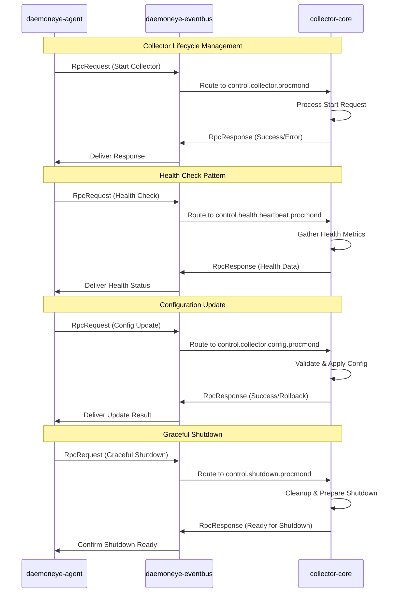

# RPC Call Patterns for Collector Lifecycle Management

This document defines the RPC service patterns for managing collector processes through the daemoneye-eventbus message broker. These patterns provide structured request/response communication for collector lifecycle operations, health monitoring, configuration management, and graceful shutdown coordination.

## Overview

The RPC patterns are designed to support Requirements 15.2 and 15.5 from the DaemonEye Core Monitoring specification:

- **15.2**: RPC calls for collector lifecycle management (start, stop, restart, health checks)
- **15.5**: Configuration updates and graceful shutdown coordination

## Architecture

### RPC Communication Flow



### Topic Hierarchy for RPC

RPC calls use a structured topic hierarchy for routing. The canonical pattern uses per-collector topics:

- `control.collector.{collector_id}` - Collector lifecycle operations (start, stop, restart)
- `control.collector.config.{collector_id}` - Configuration management for specific collector
- `control.health.heartbeat.{collector_id}` - Health check heartbeats (see Health Check section)
- `control.shutdown.{collector_id}` - Shutdown coordination

**Base Topics** (for broadcasting to all collectors):

- `control.collector.lifecycle` - Base topic for lifecycle operations (use per-collector topics for RPC)
- `control.collector.config` - Base topic for configuration (use per-collector topics for RPC)

**Helper Functions**: Use `collector::lifecycle_topic(collector_id)` and `collector::config_topic(collector_id)` to build per-collector topics programmatically.

## RPC Operation Types

### 1. Collector Lifecycle Operations

#### Start Collector

**Purpose**: Start a collector process with specified configuration

**Request**:

```rust
RpcRequest {
    operation: CollectorOperation::Start,
    payload: RpcPayload::Lifecycle(CollectorLifecycleRequest {
        collector_id: "procmond",
        collector_type: "process-monitor",
        config_overrides: Some(config_map),
        environment: Some(env_vars),
        resource_limits: Some(limits),
        startup_timeout_ms: Some(30000),
    }),
}
```

**Response**:

```rust
RpcResponse {
    status: RpcStatus::Success,
    payload: None,
    execution_time_ms: 1500,
}
```

#### Stop Collector

**Purpose**: Stop a running collector process gracefully

**Request**:

```rust
RpcRequest {
    operation: CollectorOperation::Stop,
    payload: RpcPayload::Lifecycle(CollectorLifecycleRequest {
        collector_id: "procmond",
        collector_type: "process-monitor",
        // Other fields None for stop operation
    }),
}
```

#### Restart Collector

**Purpose**: Restart a collector with optional configuration changes

**Request**:

```rust
RpcRequest {
    operation: CollectorOperation::Restart,
    payload: RpcPayload::Lifecycle(CollectorLifecycleRequest {
        collector_id: "procmond",
        collector_type: "process-monitor",
        config_overrides: Some(new_config),
        startup_timeout_ms: Some(30000),
    }),
}
```

### 2. Health Check and Monitoring

#### Health Check Request

**Purpose**: Get current health status and metrics from collector

**Request**:

```rust
RpcRequest {
    operation: CollectorOperation::HealthCheck,
    payload: RpcPayload::Empty,
}
```

**Response**:

```rust
RpcResponse {
    status: RpcStatus::Success,
    payload: Some(RpcPayload::HealthCheck(HealthCheckData {
        collector_id: "procmond",
        status: HealthStatus::Healthy,
        components: {
            "process_enumeration": ComponentHealth {
                name: "process_enumeration",
                status: HealthStatus::Healthy,
                message: Some("Enumerating 1,234 processes"),
                last_check: SystemTime::now(),
                check_interval_seconds: 30,
            },
            "ipc_server": ComponentHealth {
                name: "ipc_server",
                status: HealthStatus::Healthy,
                message: Some("5 active connections"),
                last_check: SystemTime::now(),
                check_interval_seconds: 10,
            },
        },
        metrics: {
            "cpu_usage_percent": 2.3,
            "memory_usage_mb": 45.2,
            "processes_per_second": 156.7,
            "events_published": 12450.0,
        },
        last_heartbeat: SystemTime::now(),
        uptime_seconds: 3600,
        error_count: 0,
    })),
}
```

#### Heartbeat Pattern

**Purpose**: Periodic heartbeat for liveness detection

**Implementation**: Collectors send periodic heartbeat messages to `control.health.heartbeat.{collector_id}` topic. daemoneye-agent monitors these heartbeats and triggers health checks if heartbeats are missed.

**Heartbeat Message**:

```rust
Message {
    topic: "control.health.heartbeat.procmond",
    message_type: MessageType::Heartbeat,
    payload: bincode::encode(HeartbeatData {
        collector_id: "procmond",
        timestamp: SystemTime::now(),
        sequence: 12345,
        status: HealthStatus::Healthy,
    }),
}
```

### 3. Configuration Management

#### Configuration Update Request

**Purpose**: Update collector configuration dynamically without restart

**Request**:

```rust
RpcRequest {
    operation: CollectorOperation::UpdateConfig,
    payload: RpcPayload::ConfigUpdate(ConfigUpdateRequest {
        collector_id: "procmond",
        config_changes: {
            "scan_interval_ms": json!(25000),
            "batch_size": json!(500),
            "enable_hash_verification": json!(true),
        },
        validate_only: false,
        restart_required: false,
        rollback_on_failure: true,
    }),
}
```

**Response**:

```rust
RpcResponse {
    status: RpcStatus::Success,
    payload: Some(RpcPayload::Generic({
        "applied_changes": json!(["scan_interval_ms", "batch_size"]),
        "skipped_changes": json!(["enable_hash_verification"]),
        "restart_required": json!(false),
        "rollback_available": json!(true),
    })),
}
```

#### Configuration Validation

**Purpose**: Validate configuration changes without applying them

**Request**: Same as update request but with `validate_only: true`

**Response**: Returns validation results without applying changes

### 4. Graceful Shutdown Coordination

#### Graceful Shutdown Request

**Purpose**: Coordinate graceful shutdown with cleanup and resource release

**Request**:

```rust
RpcRequest {
    operation: CollectorOperation::GracefulShutdown,
    payload: RpcPayload::Shutdown(ShutdownRequest {
        collector_id: "procmond",
        shutdown_type: ShutdownType::Graceful,
        graceful_timeout_ms: 60000,
        force_after_timeout: true,
        reason: Some("System maintenance"),
    }),
}
```

**Response**:

```rust
RpcResponse {
    status: RpcStatus::Success,
    payload: Some(RpcPayload::Generic({
        "shutdown_initiated": json!(true),
        "cleanup_tasks": json!(["flush_audit_log", "close_ipc_connections", "save_state"]),
        "estimated_shutdown_time_ms": json!(5000),
    })),
}
```

#### Force Shutdown Request

**Purpose**: Immediate shutdown for emergency situations

**Request**:

```rust
RpcRequest {
    operation: CollectorOperation::ForceShutdown,
    payload: RpcPayload::Shutdown(ShutdownRequest {
        collector_id: "procmond",
        shutdown_type: ShutdownType::Emergency,
        graceful_timeout_ms: 0,
        force_after_timeout: false,
        reason: Some("Emergency shutdown"),
    }),
}
```

### 5. Capability Discovery

#### Get Capabilities Request

**Purpose**: Discover collector capabilities and supported operations

**Request**:

```rust
RpcRequest {
    operation: CollectorOperation::GetCapabilities,
    payload: RpcPayload::Empty,
}
```

**Response**:

```rust
RpcResponse {
    status: RpcStatus::Success,
    payload: Some(RpcPayload::Capabilities(CapabilitiesData {
        collector_id: "procmond",
        event_types: vec!["process"],
        operations: vec![
            CollectorOperation::Start,
            CollectorOperation::Stop,
            CollectorOperation::Restart,
            CollectorOperation::HealthCheck,
            CollectorOperation::UpdateConfig,
            CollectorOperation::GracefulShutdown,
            CollectorOperation::Pause,
            CollectorOperation::Resume,
        ],
        resource_requirements: ResourceRequirements {
            min_memory_bytes: 50 * 1024 * 1024, // 50MB
            min_cpu_percent: 1.0,
            required_privileges: vec!["process_enumeration"],
            required_capabilities: vec!["CAP_SYS_PTRACE"],
        },
        platform_support: vec!["linux", "macos", "windows"],
        features: {
            "hash_verification": true,
            "privilege_dropping": true,
            "audit_logging": true,
            "real_time_monitoring": false,
        },
    })),
}
```

## Error Handling Patterns

### Error Response Structure

All RPC errors follow a consistent structure:

```rust
RpcResponse {
    status: RpcStatus::Error,
    error_details: Some(RpcError {
        code: "COLLECTOR_START_FAILED",
        message: "Failed to start collector: insufficient privileges",
        context: {
            "collector_id": json!("procmond"),
            "required_privileges": json!(["CAP_SYS_PTRACE"]),
            "current_privileges": json!([]),
        },
        category: ErrorCategory::Permission,
    }),
}
```

### Common Error Categories

1. **Configuration**: Invalid configuration or validation errors
2. **Resource**: Resource constraints or limits exceeded
3. **Communication**: Network or IPC communication failures
4. **Permission**: Authorization or privilege errors
5. **Internal**: Internal service errors
6. **Timeout**: Operation timeout or deadline exceeded

### Retry and Circuit Breaker Patterns

RPC clients implement retry logic with exponential backoff:

```rust
// Retry configuration
let retry_config = RetryConfig {
    max_attempts: 3,
    base_delay: Duration::from_millis(100),
    max_delay: Duration::from_secs(5),
    backoff_multiplier: 2.0,
    jitter: true,
};

// Circuit breaker configuration
let circuit_breaker = CircuitBreaker::new(
    5,  // failure_threshold
    Duration::from_secs(60), // recovery_timeout
    Duration::from_secs(10), // half_open_timeout
);
```

## Timeout Management

### Operation Timeouts

Different operations have different timeout characteristics:

- **Start/Stop/Restart**: 30-60 seconds (configurable)
- **Health Check**: 5-10 seconds
- **Configuration Update**: 10-30 seconds
- **Graceful Shutdown**: 60-300 seconds
- **Force Shutdown**: 5 seconds

### Timeout Handling

```rust
// Client-side timeout handling
match tokio::time::timeout(request_timeout, rpc_call).await {
    Ok(Ok(response)) => handle_success(response),
    Ok(Err(rpc_error)) => handle_rpc_error(rpc_error),
    Err(_) => handle_timeout_error(),
}

// Service-side timeout enforcement
let operation_future = async {
    // Perform operation
    perform_collector_operation().await
};

match tokio::time::timeout(service_timeout, operation_future).await {
    Ok(result) => create_success_response(result),
    Err(_) => create_timeout_response(),
}
```

## Security Considerations

### Authentication and Authorization

- RPC calls include client identification for audit logging
- Operations are validated against collector capabilities
- Sensitive operations require elevated privileges

### Input Validation

- All RPC payloads are validated before processing
- Configuration changes are validated against schema
- Resource limits are enforced for all operations

### Audit Logging

All RPC operations are logged for security audit:

```rust
audit_log.record(AuditEvent {
    timestamp: SystemTime::now(),
    actor: request.client_id,
    action: format!("rpc.{:?}", request.operation),
    target: request.target,
    payload_hash: blake3::hash(&request.payload),
    correlation_id: request.correlation_id,
    result: response.status,
});
```

## Performance Characteristics

### Throughput Targets

- **Health Checks**: 100+ requests/second per collector
- **Configuration Updates**: 10+ requests/second per collector
- **Lifecycle Operations**: 1-5 requests/second per collector

### Latency Targets

- **Health Checks**: \<50ms p95
- **Configuration Updates**: \<200ms p95
- **Lifecycle Operations**: \<5000ms p95

### Resource Usage

- **Memory**: \<10MB per RPC service instance
- **CPU**: \<1% sustained usage for RPC handling
- **Network**: \<1KB per RPC request/response pair

## Integration Examples

### daemoneye-agent Integration

```rust
use daemoneye_eventbus::rpc::{CollectorLifecycleRequest, CollectorOperation, CollectorRpcClient};

pub struct CollectorManager {
    rpc_client: CollectorRpcClient,
    collectors: HashMap<String, CollectorInfo>,
}

impl CollectorManager {
    pub async fn start_collector(&mut self, collector_id: &str) -> Result<()> {
        let request = RpcRequest::lifecycle(
            self.rpc_client.client_id.clone(),
            format!("control.collector.{}", collector_id),
            CollectorOperation::Start,
            CollectorLifecycleRequest::start(collector_id, None),
            Duration::from_secs(30),
        );

        let response = self
            .rpc_client
            .call(request, Duration::from_secs(30))
            .await?;

        match response.status {
            RpcStatus::Success => {
                self.collectors
                    .insert(collector_id.to_string(), CollectorInfo::running());
                Ok(())
            }
            RpcStatus::Error => Err(anyhow::anyhow!(
                "Failed to start collector: {:?}",
                response.error_details
            )),
            _ => Err(anyhow::anyhow!(
                "Unexpected response status: {:?}",
                response.status
            )),
        }
    }

    pub async fn health_check_all(&mut self) -> Result<HashMap<String, HealthStatus>> {
        let mut health_results = HashMap::new();

        for collector_id in self.collectors.keys() {
            let request = RpcRequest::health_check(
                self.rpc_client.client_id.clone(),
                format!("control.health.heartbeat.{}", collector_id),
                Duration::from_secs(10),
            );

            match self.rpc_client.call(request, Duration::from_secs(10)).await {
                Ok(response) => {
                    if let Some(RpcPayload::HealthCheck(health_data)) = response.payload {
                        health_results.insert(collector_id.clone(), health_data.status);
                    }
                }
                Err(e) => {
                    tracing::warn!("Health check failed for {}: {}", collector_id, e);
                    health_results.insert(collector_id.clone(), HealthStatus::Unresponsive);
                }
            }
        }

        Ok(health_results)
    }
}
```

### collector-core Integration

```rust
use daemoneye_eventbus::rpc::{CollectorOperation, CollectorRpcService, ServiceCapabilities};

pub struct ProcessCollectorRpcService {
    rpc_service: CollectorRpcService,
    collector_state: Arc<Mutex<CollectorState>>,
}

impl ProcessCollectorRpcService {
    pub fn new() -> Self {
        let capabilities = ServiceCapabilities {
            operations: vec![
                CollectorOperation::Start,
                CollectorOperation::Stop,
                CollectorOperation::Restart,
                CollectorOperation::HealthCheck,
                CollectorOperation::UpdateConfig,
                CollectorOperation::GracefulShutdown,
            ],
            max_concurrent_requests: 10,
            timeout_limits: TimeoutLimits {
                min_timeout_ms: 1000,
                max_timeout_ms: 300000,
                default_timeout_ms: 30000,
            },
            supported_collectors: vec!["procmond".to_string()],
        };

        let rpc_service = CollectorRpcService::new("procmond-rpc".to_string(), capabilities);

        Self {
            rpc_service,
            collector_state: Arc::new(Mutex::new(CollectorState::Stopped)),
        }
    }

    pub async fn handle_rpc_message(&self, message: Message) -> Result<Message> {
        // Deserialize RPC request
        let request: RpcRequest =
            bincode::serde::decode_from_slice(&message.payload, bincode::config::standard())?.0;

        // Handle request
        let response = self.rpc_service.handle_request(request).await;

        // Serialize response
        let response_payload =
            bincode::serde::encode_to_vec(&response, bincode::config::standard())?;

        Ok(Message::new(
            format!("response.{}", message.correlation_id),
            message.correlation_id,
            response_payload,
            0,
            MessageType::Control,
        ))
    }
}
```

This comprehensive RPC pattern design provides the foundation for collector lifecycle management through the daemoneye-eventbus message broker, supporting all the requirements for distributed collector coordination and management.
