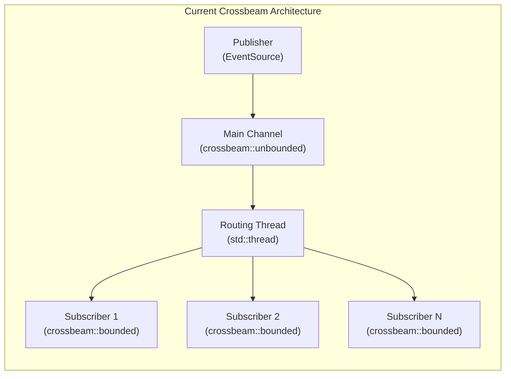

# Migration Strategy: Crossbeam to DaemonEye EventBus

## Overview

This document outlines the migration strategy from the current crossbeam-based event bus implementation to the daemoneye-eventbus message broker. The migration preserves existing event bus semantics while enabling multi-process communication and enhanced scalability.

## Current Crossbeam Implementation Analysis

### Existing Architecture

The current collector-core uses crossbeam channels for high-performance in-process event distribution:

```rust
// Current crossbeam-based implementation
use crossbeam::{
    channel::{Receiver, Sender, bounded, unbounded},
    utils::Backoff,
};

pub struct HighPerformanceEventBusImpl {
    publisher: Sender<BusEvent>, // Crossbeam unbounded sender
    subscribers: HashMap<String, Sender<BusEvent>>, // Per-subscriber channels
    routing_handle: thread::JoinHandle<()>, // Background routing thread
}
```

### Current Event Flow



### Key Characteristics to Preserve

1. **High Throughput**: 10,000+ messages/second
2. **Low Latency**: Sub-millisecond delivery
3. **Backpressure Handling**: Configurable strategies (drop, block, circuit-break)
4. **Lock-Free Operation**: Minimal contention
5. **Event Ordering**: FIFO delivery per subscriber
6. **Graceful Shutdown**: Clean resource cleanup

## Migration Mapping

### Channel Type Mapping

| Crossbeam Component               | DaemonEye EventBus Equivalent       | Migration Notes         |
| --------------------------------- | ----------------------------------- | ----------------------- |
| `crossbeam::channel::unbounded()` | `DaemoneyeBroker::publish()`        | Main event distribution |
| `crossbeam::channel::bounded()`   | `mpsc::UnboundedReceiver<BusEvent>` | Per-subscriber queues   |
| `crossbeam::utils::Backoff`       | Built-in broker backpressure        | Automatic handling      |
| `std::thread::spawn()`            | `tokio::spawn()`                    | Async task management   |

### Interface Compatibility

```rust
// BEFORE: Crossbeam EventBus trait
#[async_trait]
pub trait EventBus: Send + Sync {
    async fn publish(&self, event: CollectionEvent, correlation_id: Option<String>) -> Result<()>;
    async fn subscribe(
        &mut self,
        subscription: EventSubscription,
    ) -> Result<mpsc::UnboundedReceiver<BusEvent>>;
    async fn unsubscribe(&mut self, subscriber_id: &str) -> Result<()>;
    async fn get_statistics(&self) -> Result<EventBusStatistics>;
}

// AFTER: DaemonEye EventBus trait (identical interface)
#[async_trait]
pub trait EventBus: Send + Sync {
    async fn publish(&mut self, event: CollectionEvent, correlation_id: String) -> Result<()>;
    async fn subscribe(
        &mut self,
        subscription: EventSubscription,
    ) -> Result<mpsc::UnboundedReceiver<BusEvent>>;
    async fn unsubscribe(&mut self, subscriber_id: &str) -> Result<()>;
    async fn statistics(&self) -> EventBusStatistics;
}
```

## Migration Implementation Plan

### Phase 1: Interface Adaptation Layer

Create a compatibility wrapper that implements the existing EventBus trait using daemoneye-eventbus:

```rust
// collector-core/src/event_bus.rs - Updated implementation
use daemoneye_eventbus::{DaemoneyeBroker, DaemoneyeEventBus, EventBus as DaemoneyeEventBusTrait};

pub struct DaemoneyeEventBusAdapter {
    inner: DaemoneyeEventBus,
    broker: Arc<DaemoneyeBroker>,
}

impl DaemoneyeEventBusAdapter {
    pub async fn new(socket_path: &str) -> Result<Self> {
        let broker = Arc::new(DaemoneyeBroker::new(socket_path).await?);
        broker.start().await?;

        let inner = DaemoneyeEventBus::from_broker((*broker).clone()).await?;

        Ok(Self { inner, broker })
    }
}

#[async_trait]
impl EventBus for DaemoneyeEventBusAdapter {
    async fn publish(&self, event: CollectionEvent, correlation_id: Option<String>) -> Result<()> {
        let correlation = correlation_id.unwrap_or_else(|| Uuid::new_v4().to_string());

        // Convert collector-core CollectionEvent to daemoneye-eventbus CollectionEvent
        let daemoneye_event = self.convert_event(event)?;

        self.inner
            .publish(daemoneye_event, correlation)
            .await
            .map_err(|e| anyhow::anyhow!("EventBus publish failed: {}", e))
    }

    async fn subscribe(
        &mut self,
        subscription: EventSubscription,
    ) -> Result<tokio::sync::mpsc::UnboundedReceiver<BusEvent>> {
        // Convert collector-core EventSubscription to daemoneye-eventbus EventSubscription
        let daemoneye_subscription = self.convert_subscription(subscription)?;

        let receiver = self
            .inner
            .subscribe(daemoneye_subscription)
            .await
            .map_err(|e| anyhow::anyhow!("EventBus subscribe failed: {}", e))?;

        // Create adapter channel to convert daemoneye BusEvent to collector-core BusEvent
        let (tx, rx) = tokio::sync::mpsc::unbounded_channel();

        tokio::spawn(async move {
            let mut daemoneye_receiver = receiver;
            while let Some(daemoneye_event) = daemoneye_receiver.recv().await {
                let collector_event = Self::convert_bus_event(daemoneye_event);
                if tx.send(collector_event).is_err() {
                    break; // Receiver dropped
                }
            }
        });

        Ok(rx)
    }

    async fn unsubscribe(&mut self, subscriber_id: &str) -> Result<()> {
        self.inner
            .unsubscribe(subscriber_id)
            .await
            .map_err(|e| anyhow::anyhow!("EventBus unsubscribe failed: {}", e))
    }

    async fn get_statistics(&self) -> Result<EventBusStatistics> {
        let daemoneye_stats = self.inner.statistics().await;

        Ok(EventBusStatistics {
            events_published: daemoneye_stats.messages_published,
            events_delivered: daemoneye_stats.messages_delivered,
            active_subscribers: daemoneye_stats.active_subscribers,
            uptime: Duration::from_secs(daemoneye_stats.uptime_seconds),
        })
    }
}
```

### Phase 2: Event Type Conversion

Map collector-core events to daemoneye-eventbus events:

```rust
impl DaemoneyeEventBusAdapter {
    fn convert_event(
        &self,
        event: collector_core::CollectionEvent,
    ) -> Result<daemoneye_eventbus::CollectionEvent> {
        match event {
            collector_core::CollectionEvent::Process(proc_event) => Ok(
                daemoneye_eventbus::CollectionEvent::Process(daemoneye_eventbus::ProcessEvent {
                    pid: proc_event.pid,
                    name: proc_event.name,
                    command_line: proc_event.command_line.join(" ").into(),
                    executable_path: proc_event.executable_path,
                    ppid: proc_event.ppid,
                    start_time: proc_event.start_time,
                    metadata: proc_event.platform_metadata.unwrap_or_default(),
                }),
            ),
            collector_core::CollectionEvent::Network(net_event) => {
                Ok(daemoneye_eventbus::CollectionEvent::Network(
                    daemoneye_eventbus::NetworkEvent {
                        // Map network event fields
                        connection_id: net_event.connection_id,
                        protocol: net_event.protocol,
                        local_addr: net_event.local_addr,
                        remote_addr: net_event.remote_addr,
                        metadata: HashMap::new(),
                    },
                ))
            } // Add other event type conversions...
        }
    }

    fn convert_bus_event(
        daemoneye_event: daemoneye_eventbus::BusEvent,
    ) -> collector_core::BusEvent {
        collector_core::BusEvent {
            id: Uuid::parse_str(&daemoneye_event.event_id).unwrap_or_else(|_| Uuid::new_v4()),
            timestamp: daemoneye_event
                .bus_timestamp
                .duration_since(std::time::UNIX_EPOCH)
                .unwrap_or_default()
                .as_secs(),
            event: Self::convert_daemoneye_event_to_collector(daemoneye_event.event),
            correlation_id: Some(daemoneye_event.correlation_id),
            routing_metadata: HashMap::new(),
        }
    }
}
```

### Phase 3: Topic Pattern Migration

Map crossbeam routing to daemoneye-eventbus topics:

```rust
impl DaemoneyeEventBusAdapter {
    fn convert_subscription(
        &self,
        subscription: collector_core::EventSubscription,
    ) -> Result<daemoneye_eventbus::EventSubscription> {
        // Generate topic patterns based on capabilities and filters
        let topic_patterns = if let Some(patterns) = subscription.topic_patterns {
            // Direct pattern mapping
            patterns
                .into_iter()
                .map(|p| self.map_topic_pattern(p))
                .collect()
        } else {
            // Generate from capabilities
            self.generate_topic_patterns_from_capabilities(&subscription.capabilities)
        };

        Ok(daemoneye_eventbus::EventSubscription {
            subscriber_id: subscription.subscriber_id,
            capabilities: daemoneye_eventbus::SourceCaps {
                event_types: self.extract_event_types(&subscription.capabilities),
                collectors: vec!["*".to_string()], // All collectors
                max_priority: 10,
            },
            event_filter: subscription
                .event_filter
                .map(|f| self.convert_event_filter(f)),
            correlation_filter: subscription.correlation_filter.map(|c| {
                daemoneye_eventbus::CorrelationFilter {
                    correlation_id: Some(c),
                    process_ids: vec![],
                }
            }),
            topic_patterns: Some(topic_patterns),
            enable_wildcards: subscription.enable_wildcards,
        })
    }

    fn map_topic_pattern(&self, pattern: String) -> String {
        match pattern.as_str() {
            "process" | "process.*" => "events.process.*".to_string(),
            "network" | "network.*" => "events.network.*".to_string(),
            "filesystem" | "filesystem.*" => "events.filesystem.*".to_string(),
            "performance" | "performance.*" => "events.performance.*".to_string(),
            "control" | "control.*" => "control.*".to_string(),
            _ => format!("events.{}", pattern), // Default mapping
        }
    }
}
```

### Phase 4: Configuration Migration

Update collector-core configuration to use daemoneye-eventbus:

```rust
// collector-core/src/config.rs - Updated configuration
#[derive(Debug, Clone, serde::Deserialize)]
pub struct CollectorConfig {
    // Existing fields...
    /// Event bus configuration
    pub event_bus: EventBusConfig,
}

#[derive(Debug, Clone, serde::Deserialize)]
pub struct EventBusConfig {
    /// Event bus type: "local" (crossbeam) or "daemoneye" (message broker)
    pub bus_type: EventBusType,
    /// Socket path for daemoneye-eventbus (when bus_type = "daemoneye")
    pub socket_path: Option<String>,
    /// Legacy crossbeam configuration (when bus_type = "local")
    pub crossbeam: Option<CrossbeamConfig>,
    /// DaemonEye eventbus configuration (when bus_type = "daemoneye")
    pub daemoneye: Option<DaemoneyeConfig>,
}

#[derive(Debug, Clone, serde::Deserialize)]
pub enum EventBusType {
    #[serde(rename = "local")]
    Local, // Crossbeam-based (legacy)
    #[serde(rename = "daemoneye")]
    DaemonEye, // DaemonEye eventbus (new)
}

impl Default for EventBusConfig {
    fn default() -> Self {
        Self {
            bus_type: EventBusType::DaemonEye, // Default to new implementation
            socket_path: None,                 // Auto-generated
            crossbeam: None,
            daemoneye: Some(DaemoneyeConfig::default()),
        }
    }
}
```

### Phase 5: Factory Pattern for Event Bus Creation

Create a factory to instantiate the appropriate event bus implementation:

```rust
// collector-core/src/event_bus.rs - Factory implementation
pub struct EventBusFactory;

impl EventBusFactory {
    pub async fn create(config: &EventBusConfig) -> Result<Box<dyn EventBus>> {
        match config.bus_type {
            EventBusType::Local => {
                // Legacy crossbeam implementation
                let crossbeam_config = config.crossbeam.clone().unwrap_or_default();
                Ok(Box::new(LocalEventBus::new(crossbeam_config.into())))
            }
            EventBusType::DaemonEye => {
                // New daemoneye-eventbus implementation
                let socket_path = config
                    .socket_path
                    .as_deref()
                    .unwrap_or("/tmp/daemoneye-collector.sock");

                let adapter = DaemoneyeEventBusAdapter::new(socket_path).await?;
                Ok(Box::new(adapter))
            }
        }
    }
}

// Usage in collector-core
impl Collector {
    pub async fn new(config: CollectorConfig) -> Result<Self> {
        let event_bus = EventBusFactory::create(&config.event_bus).await?;

        Ok(Self {
            config,
            event_bus,
            // ... other fields
        })
    }
}
```

## Behavioral Equivalence Testing

### Test Strategy

1. **Unit Tests**: Verify interface compatibility
2. **Integration Tests**: Compare crossbeam vs daemoneye-eventbus behavior
3. **Performance Tests**: Ensure throughput and latency requirements
4. **Stress Tests**: Validate under high load conditions

### Test Implementation

```rust
#[cfg(test)]
mod migration_tests {
    use super::*;

    #[tokio::test]
    async fn test_behavioral_equivalence() {
        // Test both implementations with identical workloads
        let crossbeam_bus = LocalEventBus::new(EventBusConfig::default());
        let daemoneye_bus = DaemoneyeEventBusAdapter::new("/tmp/test.sock")
            .await
            .unwrap();

        // Run identical test scenarios
        test_publish_subscribe_pattern(&crossbeam_bus).await;
        test_publish_subscribe_pattern(&daemoneye_bus).await;

        // Compare results
        let crossbeam_stats = crossbeam_bus.get_statistics().await.unwrap();
        let daemoneye_stats = daemoneye_bus.get_statistics().await.unwrap();

        assert_eq!(
            crossbeam_stats.events_published,
            daemoneye_stats.events_published
        );
        assert_eq!(
            crossbeam_stats.events_delivered,
            daemoneye_stats.events_delivered
        );
    }

    async fn test_publish_subscribe_pattern<T: EventBus>(bus: &T) {
        // Identical test logic for both implementations
        // ... test implementation
    }

    #[tokio::test]
    async fn test_performance_equivalence() {
        // Benchmark both implementations
        let crossbeam_throughput = benchmark_crossbeam().await;
        let daemoneye_throughput = benchmark_daemoneye().await;

        // Ensure daemoneye performance is within acceptable range
        assert!(daemoneye_throughput >= crossbeam_throughput * 0.8); // 80% minimum
    }
}
```

## Migration Rollout Plan

### Phase 1: Preparation (Week 1)

- [ ] Implement DaemoneyeEventBusAdapter
- [ ] Create event type conversion functions
- [ ] Add configuration support for both bus types
- [ ] Implement EventBusFactory

### Phase 2: Testing (Week 2)

- [ ] Unit tests for adapter functionality
- [ ] Integration tests comparing both implementations
- [ ] Performance benchmarks
- [ ] Stress testing under load

### Phase 3: Gradual Migration (Week 3)

- [ ] Default to daemoneye-eventbus for new deployments
- [ ] Provide configuration flag for crossbeam fallback
- [ ] Monitor production performance metrics
- [ ] Address any compatibility issues

### Phase 4: Legacy Removal (Week 4)

- [ ] Remove crossbeam dependencies
- [ ] Clean up legacy code paths
- [ ] Update documentation
- [ ] Final performance validation

## Risk Mitigation

### Compatibility Risks

1. **Event Ordering**: Ensure FIFO delivery is maintained

   - **Mitigation**: Use single-threaded routing in daemoneye-eventbus

2. **Performance Regression**: Potential throughput/latency impact

   - **Mitigation**: Comprehensive benchmarking and optimization

3. **Memory Usage**: Different memory patterns between implementations

   - **Mitigation**: Memory profiling and resource limit enforcement

### Rollback Strategy

1. **Configuration-Based Rollback**: Switch `bus_type` to `"local"`
2. **Gradual Rollback**: Migrate collectors back to crossbeam individually
3. **Emergency Rollback**: Revert to previous collector-core version

## Success Criteria

### Functional Requirements

- [ ] All existing EventBus trait methods work identically
- [ ] Event delivery semantics preserved (ordering, reliability)
- [ ] Subscription patterns work as expected
- [ ] Statistics and monitoring maintain accuracy

### Performance Requirements

- [ ] Throughput: ≥80% of crossbeam performance
- [ ] Latency: ≤2x crossbeam latency for local IPC
- [ ] Memory: ≤150% of crossbeam memory usage
- [ ] CPU: ≤120% of crossbeam CPU usage

### Operational Requirements

- [ ] Graceful shutdown works correctly
- [ ] Error handling maintains robustness
- [ ] Configuration migration is seamless
- [ ] Monitoring and observability preserved

## Conclusion

This migration strategy provides a comprehensive approach to replacing crossbeam channels with daemoneye-eventbus while maintaining full backward compatibility and operational stability. The phased approach allows for thorough testing and gradual rollout, minimizing risk while enabling the enhanced multi-process communication capabilities of the daemoneye-eventbus system.
