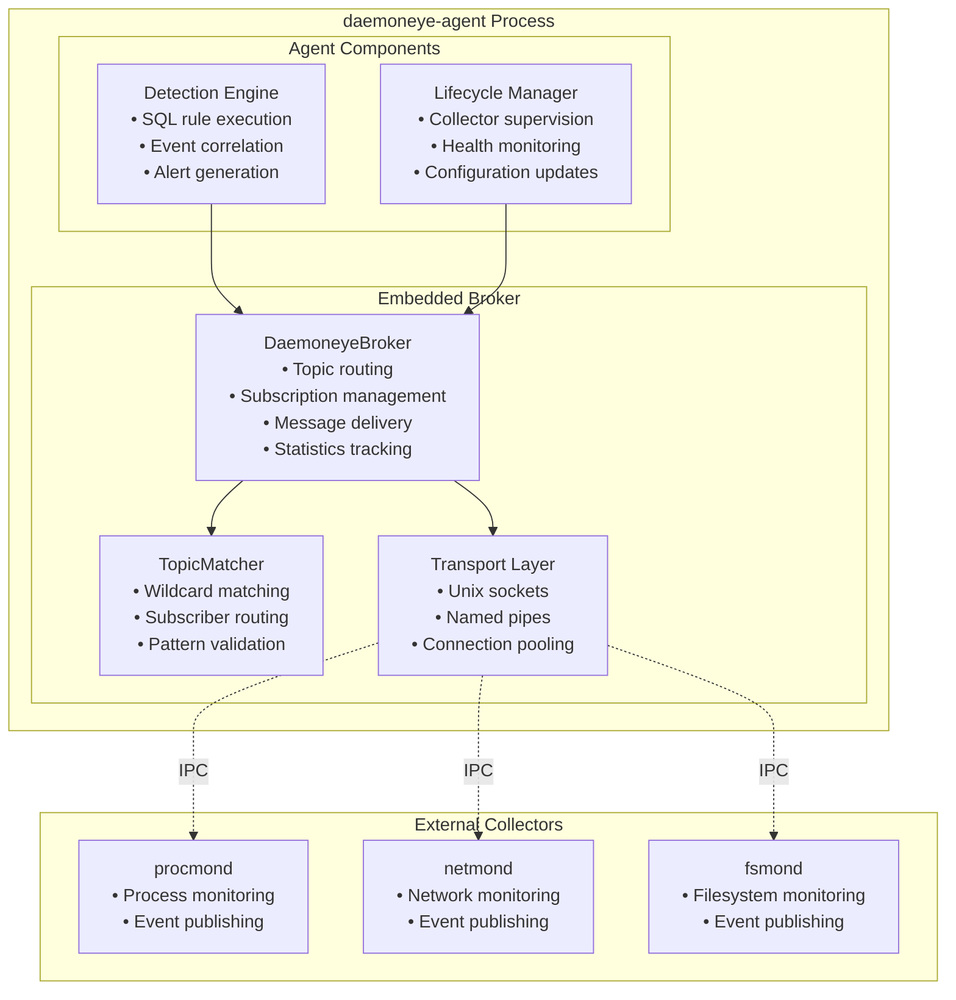
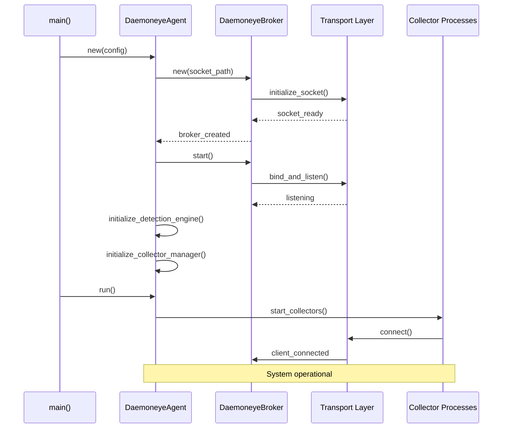

# Embedded Broker Architecture Design

## Overview

The daemoneye-eventbus embedded broker provides a unified message broker architecture that runs within the daemoneye-agent process. This design eliminates the need for external message broker dependencies while providing robust pub/sub messaging capabilities for multi-collector coordination.

## Embedded Broker Architecture

### Core Components



### Deployment Architecture

#### In-Process Deployment

The embedded broker runs as a component within the daemoneye-agent process:

```rust
// daemoneye-agent startup sequence
pub struct DaemoneyeAgent {
    // Embedded broker instance
    event_broker: Arc<DaemoneyeBroker>,
    // Detection engine with broker integration
    detection_engine: DetectionEngine,
    // Collector lifecycle manager
    collector_manager: CollectorManager,
    // Configuration manager
    config: AgentConfig,
}

impl DaemoneyeAgent {
    pub async fn new(config: AgentConfig) -> Result<Self> {
        // Initialize embedded broker with agent-specific socket path
        let socket_path = config
            .broker
            .socket_path
            .unwrap_or_else(|| format!("/tmp/daemoneye-{}.sock", config.instance_id));

        let event_broker = Arc::new(DaemoneyeBroker::new(&socket_path).await?);

        // Start broker server
        event_broker.start().await?;

        // Initialize other components with broker reference
        let detection_engine =
            DetectionEngine::new(config.detection.clone(), Arc::clone(&event_broker)).await?;

        let collector_manager =
            CollectorManager::new(config.collectors.clone(), Arc::clone(&event_broker)).await?;

        Ok(Self {
            event_broker,
            detection_engine,
            collector_manager,
            config,
        })
    }

    pub async fn run(&self) -> Result<()> {
        // Start all components concurrently
        tokio::try_join!(
            self.detection_engine.run(),
            self.collector_manager.run(),
            self.event_broker_monitor()
        )?;

        Ok(())
    }

    async fn event_broker_monitor(&self) -> Result<()> {
        // Monitor broker health and statistics
        let mut interval = tokio::time::interval(Duration::from_secs(30));

        loop {
            interval.tick().await;

            let stats = self.event_broker.statistics().await;
            tracing::info!(
                messages_published = stats.messages_published,
                messages_delivered = stats.messages_delivered,
                active_subscribers = stats.active_subscribers,
                uptime_seconds = stats.uptime_seconds,
                "Broker statistics"
            );

            // Health check logic
            if stats.active_subscribers == 0 && stats.uptime_seconds > 60 {
                tracing::warn!("No active subscribers after 60 seconds");
            }
        }
    }
}
```

## Startup and Configuration Management

### Configuration Structure

```rust
#[derive(Debug, Clone, serde::Deserialize)]
pub struct BrokerConfig {
    /// Socket path for IPC communication
    pub socket_path: Option<String>,
    /// Maximum number of concurrent connections
    pub max_connections: usize,
    /// Message buffer size per subscriber
    pub message_buffer_size: usize,
    /// Connection timeout in seconds
    pub connection_timeout_secs: u64,
    /// Enable message statistics collection
    pub enable_statistics: bool,
    /// Statistics reporting interval in seconds
    pub stats_interval_secs: u64,
    /// Maximum message size in bytes
    pub max_message_size: usize,
}

impl Default for BrokerConfig {
    fn default() -> Self {
        Self {
            socket_path: None, // Auto-generated based on instance ID
            max_connections: 64,
            message_buffer_size: 1000,
            connection_timeout_secs: 30,
            enable_statistics: true,
            stats_interval_secs: 30,
            max_message_size: 1024 * 1024, // 1MB
        }
    }
}

#[derive(Debug, Clone, serde::Deserialize)]
pub struct AgentConfig {
    /// Unique instance identifier
    pub instance_id: String,
    /// Embedded broker configuration
    pub broker: BrokerConfig,
    /// Detection engine configuration
    pub detection: DetectionConfig,
    /// Collector management configuration
    pub collectors: CollectorConfig,
}
```

### Startup Sequence



## Health Monitoring and Status Reporting

### Health Check Implementation

```rust
#[derive(Debug, Clone, serde::Serialize)]
pub struct BrokerHealthStatus {
    /// Broker operational status
    pub status: HealthStatus,
    /// Number of active connections
    pub active_connections: usize,
    /// Message processing rate (messages/second)
    pub message_rate: f64,
    /// Memory usage in bytes
    pub memory_usage: usize,
    /// Last error message, if any
    pub last_error: Option<String>,
    /// Uptime in seconds
    pub uptime_seconds: u64,
}

impl DaemoneyeBroker {
    pub async fn health_status(&self) -> BrokerHealthStatus {
        let stats = self.statistics().await;
        let clients_count = {
            let clients_guard = self.clients.lock().await;
            clients_guard.len()
        };

        // Calculate message rate over last minute
        let message_rate = if stats.uptime_seconds > 0 {
            stats.messages_published as f64 / stats.uptime_seconds as f64
        } else {
            0.0
        };

        // Determine health status based on metrics
        let status = if clients_count == 0 && stats.uptime_seconds > 60 {
            HealthStatus::Degraded
        } else if stats.messages_published > 0 && stats.messages_delivered == 0 {
            HealthStatus::Unhealthy
        } else {
            HealthStatus::Healthy
        };

        BrokerHealthStatus {
            status,
            active_connections: clients_count,
            message_rate,
            memory_usage: self.estimate_memory_usage().await,
            last_error: None, // TODO: Track last error
            uptime_seconds: stats.uptime_seconds,
        }
    }

    async fn estimate_memory_usage(&self) -> usize {
        // Estimate memory usage based on active subscriptions and message buffers
        let stats = self.statistics().await;
        let base_overhead = 1024 * 1024; // 1MB base overhead
        let per_subscriber_overhead = 64 * 1024; // 64KB per subscriber

        base_overhead + (stats.active_subscribers * per_subscriber_overhead)
    }
}

#[derive(Debug, Clone, serde::Serialize)]
pub enum HealthStatus {
    Healthy,
    Degraded,
    Unhealthy,
}
```

### Status Reporting Integration

```rust
impl DaemoneyeAgent {
    pub async fn health_report(&self) -> AgentHealthReport {
        let broker_health = self.event_broker.health_status().await;
        let detection_health = self.detection_engine.health_status().await;
        let collector_health = self.collector_manager.health_status().await;

        AgentHealthReport {
            overall_status: self.calculate_overall_status(&[
                &broker_health.status,
                &detection_health.status,
                &collector_health.status,
            ]),
            broker: broker_health,
            detection_engine: detection_health,
            collectors: collector_health,
            timestamp: SystemTime::now(),
        }
    }

    fn calculate_overall_status(&self, statuses: &[&HealthStatus]) -> HealthStatus {
        if statuses
            .iter()
            .any(|s| matches!(s, HealthStatus::Unhealthy))
        {
            HealthStatus::Unhealthy
        } else if statuses.iter().any(|s| matches!(s, HealthStatus::Degraded)) {
            HealthStatus::Degraded
        } else {
            HealthStatus::Healthy
        }
    }
}
```

## Resource Allocation and Performance Characteristics

### Memory Management

```rust
pub struct BrokerResourceLimits {
    /// Maximum memory usage in bytes
    pub max_memory_bytes: usize,
    /// Maximum number of queued messages per subscriber
    pub max_queued_messages: usize,
    /// Maximum message size in bytes
    pub max_message_size: usize,
    /// Connection pool size
    pub connection_pool_size: usize,
}

impl Default for BrokerResourceLimits {
    fn default() -> Self {
        Self {
            max_memory_bytes: 100 * 1024 * 1024, // 100MB
            max_queued_messages: 1000,
            max_message_size: 1024 * 1024, // 1MB
            connection_pool_size: 64,
        }
    }
}

impl DaemoneyeBroker {
    pub async fn enforce_resource_limits(&self) -> Result<()> {
        let current_memory = self.estimate_memory_usage().await;
        let limits = &self.config.resource_limits;

        if current_memory > limits.max_memory_bytes {
            // Implement backpressure by dropping oldest messages
            self.apply_backpressure().await?;
        }

        // Check message queue sizes
        let senders_guard = self.subscriber_senders.lock().await;
        for (subscriber_id, sender) in senders_guard.iter() {
            if sender.len() > limits.max_queued_messages {
                tracing::warn!(
                    subscriber_id = subscriber_id,
                    queue_size = sender.len(),
                    "Subscriber queue size exceeded, applying backpressure"
                );
                // Could implement per-subscriber backpressure here
            }
        }

        Ok(())
    }

    async fn apply_backpressure(&self) -> Result<()> {
        // Implementation would drop oldest messages or slow down publishers
        tracing::warn!("Applying backpressure due to memory limits");
        Ok(())
    }
}
```

### Performance Characteristics

| Metric                  | Target               | Measurement Method                |
| ----------------------- | -------------------- | --------------------------------- |
| **Message Throughput**  | 10,000+ msg/sec      | Benchmark with synthetic load     |
| **Latency**             | < 1ms (local IPC)    | End-to-end message delivery time  |
| **Memory Usage**        | < 100MB baseline     | RSS monitoring with process stats |
| **Connection Overhead** | < 1MB per connection | Memory profiling per client       |
| **CPU Usage**           | < 5% sustained       | Process CPU monitoring            |
| **Startup Time**        | < 2 seconds          | Time from start() to ready        |

### Resource Monitoring

```rust
#[derive(Debug, Clone, serde::Serialize)]
pub struct BrokerPerformanceMetrics {
    /// Messages processed per second
    pub messages_per_second: f64,
    /// Average message latency in microseconds
    pub avg_latency_us: u64,
    /// Memory usage in bytes
    pub memory_usage_bytes: usize,
    /// CPU usage percentage
    pub cpu_usage_percent: f64,
    /// Active connection count
    pub active_connections: usize,
    /// Message queue depths per subscriber
    pub queue_depths: std::collections::HashMap<String, usize>,
}

impl DaemoneyeBroker {
    pub async fn performance_metrics(&self) -> BrokerPerformanceMetrics {
        let stats = self.statistics().await;
        let senders_guard = self.subscriber_senders.lock().await;

        let queue_depths = senders_guard
            .iter()
            .map(|(id, sender)| (id.clone(), sender.len()))
            .collect();

        BrokerPerformanceMetrics {
            messages_per_second: self.calculate_message_rate().await,
            avg_latency_us: self.calculate_avg_latency().await,
            memory_usage_bytes: self.estimate_memory_usage().await,
            cpu_usage_percent: self.get_cpu_usage().await,
            active_connections: senders_guard.len(),
            queue_depths,
        }
    }

    async fn calculate_message_rate(&self) -> f64 {
        // Implementation would track message timestamps and calculate rate
        0.0 // Placeholder
    }

    async fn calculate_avg_latency(&self) -> u64 {
        // Implementation would track message publish-to-delivery times
        0 // Placeholder
    }

    async fn get_cpu_usage(&self) -> f64 {
        // Implementation would use system APIs to get process CPU usage
        0.0 // Placeholder
    }
}
```

## Integration Points

### Detection Engine Integration

```rust
impl DetectionEngine {
    pub async fn new(config: DetectionConfig, broker: Arc<DaemoneyeBroker>) -> Result<Self> {
        let mut event_bus = DaemoneyeEventBus::from_broker((*broker).clone()).await?;

        // Subscribe to all collector events for detection processing
        let subscription = EventSubscription {
            subscriber_id: "detection-engine".to_string(),
            capabilities: SourceCaps {
                event_types: vec![
                    "process".to_string(),
                    "network".to_string(),
                    "filesystem".to_string(),
                    "performance".to_string(),
                ],
                collectors: vec!["*".to_string()], // All collectors
                max_priority: 10,
            },
            topic_patterns: Some(vec!["events.*".to_string()]),
            enable_wildcards: true,
            event_filter: None,
            correlation_filter: None,
        };

        let event_receiver = event_bus.subscribe(subscription).await?;

        Ok(Self {
            config,
            event_bus,
            event_receiver: Some(event_receiver),
            broker,
        })
    }
}
```

### Collector Lifecycle Integration

```rust
impl CollectorManager {
    pub async fn start_collector(&self, collector_type: &str) -> Result<()> {
        // Use RPC through the broker to start collector
        let rpc_client = CollectorRpcClient::new(Arc::clone(&self.broker));

        let request = CollectorLifecycleRequest {
            operation: CollectorOperation::Start,
            collector_id: collector_type.to_string(),
            config: self.get_collector_config(collector_type)?,
        };

        let response = rpc_client.send_request(request).await?;

        if response.status == RpcStatus::Success {
            tracing::info!("Successfully started collector: {}", collector_type);
        } else {
            return Err(EventBusError::rpc_error(format!(
                "Failed to start collector {}: {}",
                collector_type,
                response.error_message.unwrap_or_default()
            )));
        }

        Ok(())
    }
}
```

This embedded broker architecture provides a robust, high-performance message broker that integrates seamlessly with the daemoneye-agent process while maintaining clear separation of concerns and enabling future extensibility.
