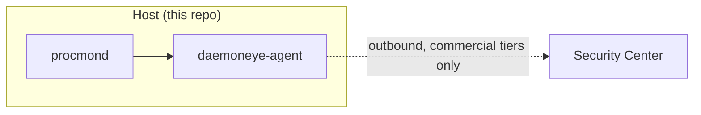

# Open-Core Hygiene Pass — Migrating Paid-Tier Content to Confluence Before Public Repo Scrub

## Context

Open-core projects accumulate paid-tier pollution over time: feature specifications for commercial tiers, internal Confluence/Jira hyperlinks, pricing pages, product-strategy documents, and planning artifacts that were drafted in the public repo before the project split into separate codebases. Deleting it is only half the work — much of that content is still operationally valuable and needs to survive somewhere trusted (typically Confluence or an internal wiki) before it leaves the repo.

The naive approaches both fail:

- **Delete first, migrate later** risks silent data loss when "migrated" pages turn out to be empty stubs, renamed, or missing sections.
- **Erase all mention of paid tiers** is dishonest (the commercial product is advertised publicly anyway) and confuses readers who wonder why the repo architecture has suspicious dotted-line boxes.

The workflow below emerged from scrubbing DaemonEye's public repo of Business/Enterprise tier content while preserving it in Confluence. It's structured as eight phases that can be run end-to-end or piecewise.

## Guidance

### Phase 1 — Inventory the pollution

Use grep for known paid-tier vocabulary, internal hyperlinks, ticket IDs, and strategy keywords. Produce a severity-ranked report before touching anything.

```bash
# Literal paid-tier terms (adjust vocabulary to your project)
grep -r -n "Business Tier\|Enterprise Tier\|Security Center\|Proxy Node\|mTLS\|STIX\|TAXII\|federation" docs/ spec/ AGENTS.md

# Internal wiki hyperlinks
grep -r -n "evilbitlabs.atlassian.net" .

# Jira/ticket IDs
grep -r -n -E "END-[0-9]+|ENDI-[0-9]+" --include="*.md"

# Pricing / roadmap / strategy keywords
grep -r -n -i "pricing\|roadmap\|strateg" docs/src/ spec/
```

Classify findings as HIGH (feature specs, pricing, roadmap), MEDIUM (agent/config file leaks), LOW (passing mentions, capability-boundary footnotes).

### Phase 2 — Write down the policy before editing

Decide and commit to explicit boundaries:

- Authoritative home for architecture/design going forward (e.g., Confluence).
- What the public repo contains (e.g., "Community tier only — code, build, user-facing docs").
- Boundary-acknowledgement language is OK. "Commercial tiers extend this foundation, sold separately, not in this repo" is preferable to erasure.
- Which frozen artifacts stay (e.g., Community-relevant specs) vs. get removed (phantom paths to non-existent directories).
- **Hard rule: never delete without verification.** No exceptions.

### Phase 3 — Verify before deleting

For every candidate file, search → fetch → size-compare against the target destination.

```bash
TOKEN=$(cat ~/auth_token)

# Search Confluence by title keyword
curl -s -u "$TOKEN" -H "Accept: application/json" \
  --data-urlencode "cql=space = ES AND title ~ \"pricing\"" \
  -G "https://your-instance.atlassian.net/wiki/rest/api/content/search?limit=5" | \
  jq -r '.results[] | "\(.title) (id=\(.id))"'

# Fetch and size-compare
curl -s -u "$TOKEN" -H "Accept: application/json" \
  "https://your-instance.atlassian.net/wiki/api/v2/pages/$id?body-format=storage" | \
  jq -r '.body.storage.value' > /tmp/confluence_check/pricing.html
wc -c /tmp/confluence_check/pricing.html docs/src/pricing.md
```

Flag anything with a size ratio < 0.9 or heading mismatches for manual inspection. Expect at least one "migrated" page to be an empty stub — this phase exists to catch those.

### Phase 4 — Fill migration gaps

Two mechanisms depending on batch size:

- **Single pages or small batches:** Use an MCP/API tool with `contentFormat: markdown` — faster to invoke, slower per call because response bodies include the full generated storage format.
- **Batch uploads (3+ pages):** Shell out to pandoc + curl against the Confluence v2 API. This is ~3× faster for larger batches because you bypass the token cost of the tool response body.

```bash
#!/bin/bash
# upload_confluence.sh <file.md> <title> <parent_id>
set -e
FILE="$1"; TITLE="$2"; PARENT="$3"
CLOUD="<your-cloud-id>"
SPACE="<your-space-id>"
TOKEN=$(cat ~/auth_token)

# Append migration footer so the Confluence page self-documents provenance
TMP=$(mktemp)
cat "$FILE" > "$TMP"
cat >> "$TMP" <<EOF

---

**Source note:** Migrated from the public repo (\`$FILE\`) on $(date +%Y-%m-%d). The repo copy has been removed.
EOF

HTML=$(pandoc --from=gfm --to=html "$TMP")

JSON=$(jq -n --arg space "$SPACE" --arg parent "$PARENT" --arg title "$TITLE" --arg body "$HTML" '{
  spaceId: $space,
  parentId: $parent,
  status: "current",
  title: $title,
  body: { representation: "storage", value: $body }
}')

RESULT=$(curl -s -w "\nHTTP_%{http_code}" -u "$TOKEN" \
  -H "Accept: application/json" -H "Content-Type: application/json" \
  -X POST "https://your-instance.atlassian.net/wiki/api/v2/pages" \
  --data "$JSON")

rm -f "$TMP"

HTTP=$(echo "$RESULT" | tail -n1)
BODY=$(echo "$RESULT" | sed '$d')

if [[ "$HTTP" == "HTTP_200" ]]; then
  echo "OK: $TITLE -> id=$(echo "$BODY" | jq -r '.id')"
else
  echo "FAIL: $TITLE ($HTTP)"; echo "$BODY" | head -c 300; exit 1
fi
```

Required Atlassian scoped-token (ATAT) scopes for this flow: `read:page:confluence`, `read:space:confluence`, `write:page:confluence`, `search:confluence`, `read:hierarchical-content:confluence`. Missing scopes return 404, not 403 — don't waste time debugging routing.

### Phase 5 — Verify fidelity with text-only comparison, not markdown match

After upload, strip HTML and compare text-content lengths:

```bash
repo_text=$(cat "$file" | wc -c)
confluence_text=$(curl -s -u "$TOKEN" -H "Accept: application/json" \
  "https://your-instance.atlassian.net/wiki/api/v2/pages/$id?body-format=storage" | \
  jq -r '.body.storage.value' | sed 's/<[^>]*>//g' | wc -c)
ratio=$(echo "scale=2; $confluence_text / $repo_text" | bc)
```

Ratios of 0.91–1.00 confirm good migration. Expected losses: `**bold**` renders as plain text, link URL text compacts, code-fence language tags drop. Do **not** grep for literal markdown headings — YAML comment lines starting with `#` inside code blocks are false positives, and `#### **Heading**` becomes `<h4>Heading</h4>`, losing the literal `**` to match on.

### Phase 6 — Delete and clean up references

```bash
git rm docs/src/pricing.md docs/src/architecture/feature-tiers.md \
       docs/src/technical/business-tier.md docs/src/technical/enterprise-tier.md \
       spec/product_strategy.md spec/product.md
git rm -r spec/procmond

# Update any TOC/index files manually (mdbook SUMMARY.md, etc.)

# Final sweep for dangling references
grep -r -n "pricing\.md\|feature-tiers\.md\|business-tier\.md\|enterprise-tier\.md" docs/src/ AGENTS.md
```

Fix every dangling link. Also search `introduction.md`, `project-overview.md`, and similar "meta" docs for tier-enumerating license sections — replace with boundary statements.

### Phase 7 — Residual scrub

File-level deletion misses inline pollution: configuration examples that reference paid-tier features, "Already Planned" footnotes that point to now-deleted docs, Mermaid diagrams that aggregate to commercial components. Run a second grep pass after deletion and fix with surgical edits. Perl one-liners are useful for repeated footnote patterns:

```bash
perl -i -pe '
  s/ \*\*Already Planned\*\*: [^.]+ (are |is )?specified in product\.md( and tech\.md)?( for Business\/Enterprise tiers| for Enterprise tier)?\.?//g;
  s/ for Business\/Enterprise tiers//g;
  s/ specified in product\.md//g;
  s/Business Tier/commercial tiers/g;
  s/Enterprise Tier/commercial tiers/g;
' docs/src/technical/security_design_overview.md
```

### Phase 8 — Commit in distinct, reviewable chunks

One commit per change class. A single mega-commit mixing deletion and content rewrites is unreviewable.

```text
docs(spec): mark §9.1-§9.4 as superseded by ADR-0006
docs: scrub paid-tier leaks and internal references from AGENTS.md
docs: remove paid-tier + internal planning docs from public repo
docs: scrub residual paid-tier content from mdbook user-facing docs
```

Commit bodies should enumerate what moved where ("Pricing content migrated to Confluence page id=1802381") so `git log` itself is the migration audit trail.

## Why This Matters

- **Verification-before-deletion prevents silent data loss.** In this session, one "migrated" Confluence page existed at the expected location but was 0 chars — an empty stub from a prior half-finished migration. Trusting its existence would have permanently destroyed the pricing history. The size-compare check caught it before `git rm` ran.
- **Commit structure keeps review tractable.** Scrubs touch dozens of files. Mixing AGENTS.md redaction with bulk deletions and inline rewrites in one commit produces a diff nobody can review. Four focused commits let a reviewer reason about each change class independently.
- **Boundary footnotes keep the repo honest.** Pretending the commercial tiers don't exist while their architecture diagrams clearly show integration points is disorienting for operators. Acknowledging "commercial tiers extend this foundation, sold separately, not in this repo" is honest, adds no leak surface, and matches what the marketing site already says.
- **Pandoc + curl beats tool invocations at batch sizes.** For an 11-file migration, invoking an MCP/API tool per file burned output tokens linearly with input because responses included the generated storage body. Shelling to pandoc + curl to the v2 API skips that cost entirely — ~3× wall-clock speedup for this case.
- **Grep-first, structured-second catches the long tail.** Literal vocabulary grep caught ~95% of pollution. The post-deletion dangling-reference sweep and a second-pass grep for residual inline content caught the rest. A structured-only approach (AST parsing the docs) would have been overkill and would still have missed content inside prose.

## When to Apply

Run this workflow when:

- **Splitting an open-core project** whose public repo accumulated paid-tier content before the split.
- **Pre-release cleanup** before opening a project to external contributors or before a public launch.
- **License boundary changes** — moving from single-license to dual/tiered licensing, or vice versa.
- **Post-acquisition repo hygiene** where internal planning artifacts (tickets, wikis, strategy docs) leaked into a repo that's becoming public.
- **Periodic audit** of long-lived open-core repos (e.g., quarterly) — drift is gradual, so accumulated pollution tends to go unnoticed until it's significant.

Do **not** apply this workflow for:

- Internal-only repos where all readers have access to paid-tier content anyway (no leak surface).
- Repos where the "paid-tier content" is actually design discussion that belongs in the public repo under an OSS-compatible license.
- Single-file scrubs (just edit and commit — the eight-phase process is overhead for small changes).

## Examples

### Before/after: AGENTS.md Source-of-Truth Map

Before:

```markdown
| Business Features   | [.kiro/specs/business-tier-features/requirements.md](./.kiro/specs/business-tier-features/requirements.md)       |
| Enterprise Features | [.kiro/specs/enterprise-tier-features/requirements.md](./.kiro/specs/enterprise-tier-features/requirements.md)   |
```

After (the directories never existed — phantom links):

```markdown
<!-- Business/Enterprise spec links removed — those tiers live in separate repos -->
<!-- See evilbitlabs.io for commercial tier information -->
```

### Before/after: one deletion + migration cycle

1. Inventory: `grep -r "pricing" docs/src/` finds `docs/src/pricing.md` (HIGH severity).

2. Search Confluence:

   ```bash
   curl -s -u "$TOKEN" --data-urlencode "cql=space = ES AND title ~ \"pricing\"" \
     -G "https://your-instance.atlassian.net/wiki/rest/api/content/search?limit=5" | jq '.results'
   ```

   Returns `Pricing (id=1802381)`.

3. Size-check: fetched page body is 0 chars. Repo file is 8,412 chars. Ratio 0.00 — **stop, don't delete**.

4. Migrate with pandoc+curl (`upload_confluence.sh docs/src/pricing.md "Pricing" 1802381`). Returns `OK: Pricing -> id=1802381`.

5. Re-verify: fetched body is now 7,981 chars of stripped text. Ratio 0.95 — acceptable (losses are markdown emphasis and link URL compaction).

6. `git rm docs/src/pricing.md`, update `docs/src/SUMMARY.md`, grep for dangling references to `pricing.md`, fix.

7. Commit with body: `Pricing content migrated to Confluence page id=1802381 on 2026-04-17. Repo copy removed.`

### Boundary footnote examples

Instead of deleting all mention of commercial features in `introduction.md`:

```markdown
DaemonEye is distributed as open-core. This repository contains the Community
tier — a self-contained host-monitoring agent. Commercial tiers (fleet
management, GUI, federation, compliance modules) extend this foundation and
are sold separately through evilbitlabs.io; they are not in this repo.
```

Instead of removing dotted-line boxes from architecture diagrams:



The dotted line plus the "commercial tiers only" label is more informative than either hiding the edge or spelling out Proxy Node + mTLS + federation details.

### Residual-pollution example

File-level deletion of `docs/src/technical/enterprise-tier.md` didn't catch the 16 inline `**Already Planned**: X is specified in product.md for Business/Enterprise tiers.` footnotes scattered through `security_design_overview.md` that now pointed to a deleted `product.md`. A second grep pass (`grep -n "Already Planned" docs/src/`) surfaced them, and the perl one-liner in Phase 7 stripped them in one pass. Always do a post-deletion residual sweep — file boundaries don't align with content boundaries.

## Related

- This was the first workflow of its kind documented for the DaemonEye repo. Existing entries in `docs/solutions/` cover Rust code-level security/performance findings (`best-practices/rust-security-batch-cleanup-patterns-2026-04-04.md`, `security-issues/binary-hashing-authorization-and-toctou-fixes.md`) and are orthogonal to this documentation-governance workflow.
- Branch `minor-cleanup` on `EvilBit-Labs/DaemonEye` contains the four commits that executed this workflow end-to-end. See `git log` for the per-commit migration manifest.
- ADR-0006 and ADR-0007 (Confluence ES space) were authored during this session and illustrate the "Confluence authoritative" side of the policy.

## Auto memory note

One auto-memory entry (`feedback_agents_md_directives`) informed AGENTS.md editing during this workflow: `@` directive syntax (e.g., `@.tessl/RULES.md`) is intentional and should not be rewritten to prose during scrubs. Preserve existing `@` includes; only redact content inside the files they reference. (auto memory [claude])
