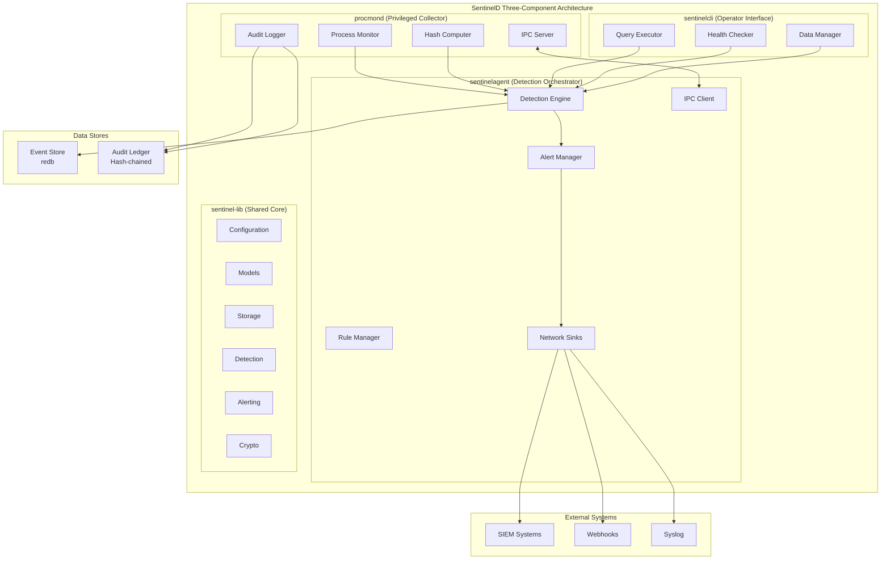
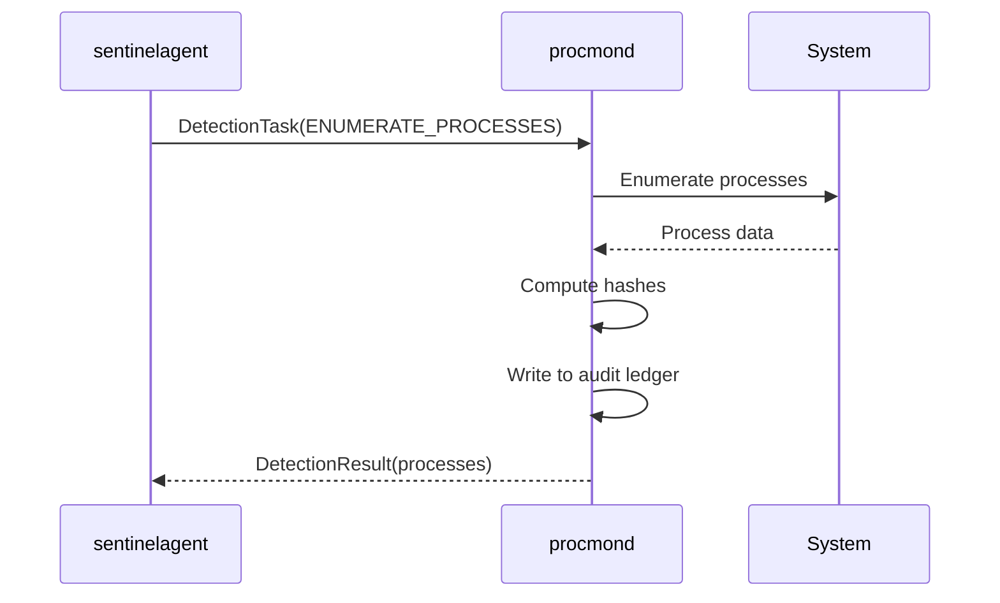
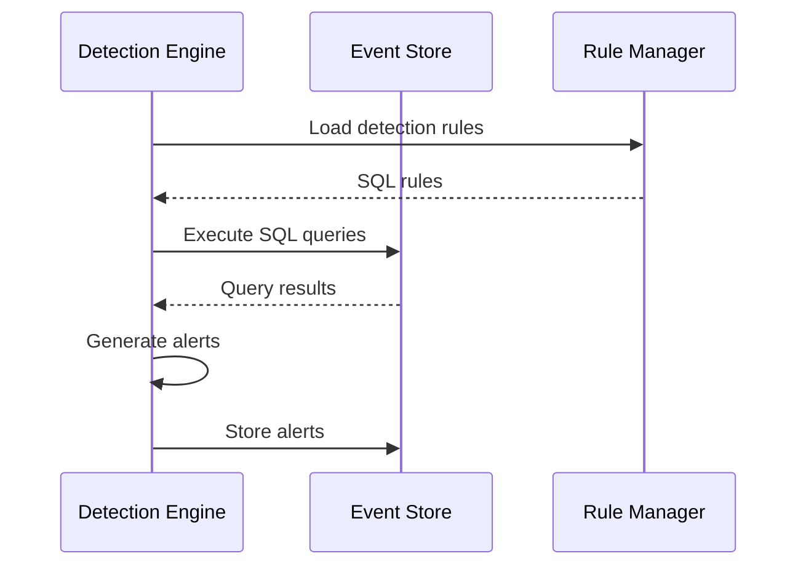
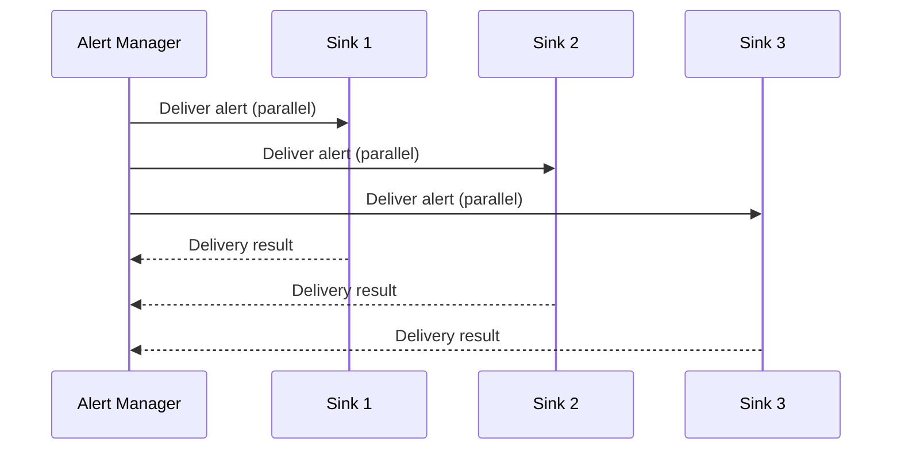

# SentinelD Architecture Overview

## Three-Component Security Architecture

SentinelD implements a **three-component security architecture** with strict privilege separation to provide continuous process monitoring and threat detection. The system is designed around the principle of minimal attack surface while maintaining high performance and audit-grade integrity.



## Component Responsibilities

### **procmond (Privileged Process Collector)**

**Primary Purpose**: Minimal privileged component for secure process data collection with purpose-built simplicity.

**Key Responsibilities**:

- **Process Enumeration**: Cross-platform process data collection using sysinfo crate
- **Executable Hashing**: SHA-256 hash computation for integrity verification
- **Audit Logging**: Tamper-evident logging with cryptographic chains
- **IPC Communication**: Simple protobuf-based communication with sentinelagent

**Security Boundaries**:

- Starts with minimal privileges, optionally requests enhanced access
- Drops all elevated privileges immediately after initialization
- No network access whatsoever
- No SQL parsing or complex query logic
- Write-only access to audit ledger
- Simple protobuf IPC only (Unix sockets/named pipes)

**Key Interfaces**:

```rust
#[async_trait]
pub trait ProcessCollector {
    async fn enumerate_processes(&self) -> Result<Vec<ProcessRecord>>;
    async fn handle_detection_task(&self, task: DetectionTask) -> Result<DetectionResult>;
    async fn serve_ipc(&self) -> Result<()>;
}
```

### **sentinelagent (Detection Orchestrator)**

**Primary Purpose**: User-space detection rule execution, alert management, and procmond lifecycle management.

**Key Responsibilities**:

- **Detection Engine**: SQL-based rule execution with security validation
- **Alert Management**: Alert generation, deduplication, and delivery
- **Rule Management**: Rule loading, validation, and hot-reloading
- **Process Management**: procmond lifecycle management (start, stop, restart, health monitoring)
- **Network Communication**: Outbound-only connections for alert delivery

**Security Boundaries**:

- Operates in user space with minimal privileges
- Manages redb event store (read/write access)
- Translates complex SQL rules into simple protobuf tasks for procmond
- Outbound-only network connections for alert delivery
- Sandboxed rule execution with resource limits
- IPC client for communication with procmond

**Key Interfaces**:

```rust
#[async_trait]
pub trait DetectionEngine {
    async fn execute_rules(&self, scan_id: i64) -> Result<Vec<Alert>>;
    async fn validate_sql(&self, query: &str) -> Result<ValidationResult>;
}

#[async_trait]
pub trait AlertManager {
    async fn generate_alert(&self, detection: DetectionResult) -> Result<Alert>;
    async fn deliver_alert(&self, alert: &Alert) -> Result<DeliveryResult>;
}
```

### **sentinelcli (Operator Interface)**

**Primary Purpose**: Command-line interface for queries, management, and diagnostics.

**Key Responsibilities**:

- **Data Queries**: Safe SQL query execution with parameterization
- **System Management**: Configuration, rule management, health monitoring
- **Data Export**: Multiple output formats (JSON, table, CSV)
- **Diagnostics**: System health checks and troubleshooting

**Security Boundaries**:

- No network access
- No direct database access (communicates through sentinelagent)
- Input validation for all user-provided data
- Safe SQL execution via sentinelagent with prepared statements
- Communicates only with sentinelagent for all operations

**Key Interfaces**:

```rust
#[async_trait]
pub trait QueryExecutor {
    async fn execute_query(&self, query: &str, params: &[Value]) -> Result<QueryResult>;
    async fn export_data(&self, format: ExportFormat, filter: &Filter) -> Result<ExportResult>;
}
```

### **sentinel-lib (Shared Core)**

**Primary Purpose**: Common functionality shared across all components.

**Key Modules**:

- **config**: Hierarchical configuration management
- **models**: Core data structures and serialization
- **storage**: Database abstractions and connection management
- **detection**: SQL validation and rule execution framework
- **alerting**: Multi-channel alert delivery system
- **crypto**: Cryptographic functions for audit chains
- **telemetry**: Observability and metrics collection

## Data Flow Architecture

The system implements a pipeline processing model with clear phases and strict component separation:

### 1. **Collection Phase**



### 2. **Detection Phase**



### 3. **Alert Delivery Phase**



## IPC Protocol Design

**Purpose**: Secure, efficient communication between procmond and sentinelagent.

**Protocol Specification**:

```protobuf
syntax = "proto3";

// Simple detection tasks sent from sentinelagent to procmond
message DetectionTask {
    string task_id = 1;
    TaskType task_type = 2;
    optional ProcessFilter process_filter = 3;
    optional HashCheck hash_check = 4;
    optional string metadata = 5;
}

enum TaskType {
    ENUMERATE_PROCESSES = 0;
    CHECK_PROCESS_HASH = 1;
    MONITOR_PROCESS_TREE = 2;
    VERIFY_EXECUTABLE = 3;
}

// Results sent back from procmond to sentinelagent
message DetectionResult {
    string task_id = 1;
    bool success = 2;
    optional string error_message = 3;
    repeated ProcessRecord processes = 4;
    optional HashResult hash_result = 5;
}
```

**Transport Layer**:

- Unix domain sockets on Linux/macOS
- Named pipes on Windows
- Async message handling with tokio
- Connection authentication and encryption (optional)
- Automatic reconnection with exponential backoff

## Database Architecture

### **Event Store (redb)**

- **Purpose**: High-performance process data storage
- **Access**: sentinelagent read/write, sentinelcli read-only
- **Features**: WAL mode, concurrent access, embedded database
- **Schema**: process_snapshots, scans, detection_rules, alerts

### **Audit Ledger (Hash-chained)**

- **Purpose**: Tamper-evident audit trail using hash-chained log file
- **Access**: procmond write-only
- **Features**: Hash-chained log file with BLAKE3 hashing
- **Implementation**: Append-only log with cryptographic integrity

## Security Architecture

### **Privilege Separation**

- Only procmond runs with elevated privileges when necessary
- Immediate privilege drop after initialization
- Detection and alerting run in user space
- Component-specific database access patterns

### **SQL Injection Prevention**

- AST validation using sqlparser crate
- Prepared statements and parameterized queries only
- Sandboxed detection rule execution with resource limits
- Query whitelist preventing data modification operations

### **Resource Management**

- Bounded channels with configurable backpressure policies
- Memory budgets with cooperative yielding
- Timeout enforcement and cancellation support
- Circuit breakers for external dependencies

## Performance Characteristics

### **Process Collection**

- **Baseline**: \<5 seconds for 10,000+ processes
- **CPU Usage**: \<5% sustained during continuous monitoring
- **Memory Usage**: \<100MB resident under normal operation
- **Hash Computation**: SHA-256 for all accessible executables

### **Detection Engine**

- **Rule Execution**: \<100ms per detection rule
- **SQL Validation**: AST parsing and validation
- **Resource Limits**: 30-second timeout, memory limits
- **Concurrent Execution**: Parallel rule processing

### **Alert Delivery**

- **Multi-Channel**: Parallel delivery to multiple sinks
- **Reliability**: Circuit breakers and retry logic
- **Performance**: Non-blocking delivery with backpressure
- **Monitoring**: Delivery success rates and latency metrics

## Cross-Platform Strategy

### **Process Enumeration**

- **Phase 1**: sysinfo crate for unified cross-platform baseline
- **Phase 2**: Platform-specific enhancements (eBPF, ETW, EndpointSecurity)
- **Fallback**: Graceful degradation when enhanced features unavailable

### **Privilege Management**

- **Linux**: CAP_SYS_PTRACE, immediate capability dropping
- **Windows**: SeDebugPrivilege, token restriction after init
- **macOS**: Minimal entitlements, sandbox compatibility

## Component Communication

### **procmond ↔ sentinelagent**

- **Protocol**: Custom Protobuf over Unix Sockets/Named Pipes
- **Direction**: Bidirectional with simple task/result pattern
- **Security**: Process isolation, no network access

### **sentinelagent ↔ sentinelcli**

- **Protocol**: Local IPC or direct database access
- **Direction**: sentinelcli queries sentinelagent
- **Security**: Local communication only, input validation

### **External Communication**

- **Alert Delivery**: Outbound-only network connections
- **SIEM Integration**: HTTPS, mTLS, webhook protocols
- **Security Center**: mTLS with certificate authentication

## Error Handling Strategy

### **Graceful Degradation**

- Continue operation when individual components fail
- Fallback mechanisms for enhanced features
- Circuit breakers for external dependencies
- Comprehensive error logging and monitoring

### **Recovery Patterns**

- Automatic retry with exponential backoff
- Health checks and component restart
- Data consistency verification
- Audit trail integrity validation

---

*This architecture provides a robust foundation for implementing SentinelD's core monitoring functionality while maintaining security, performance, and reliability requirements across all supported platforms.*
