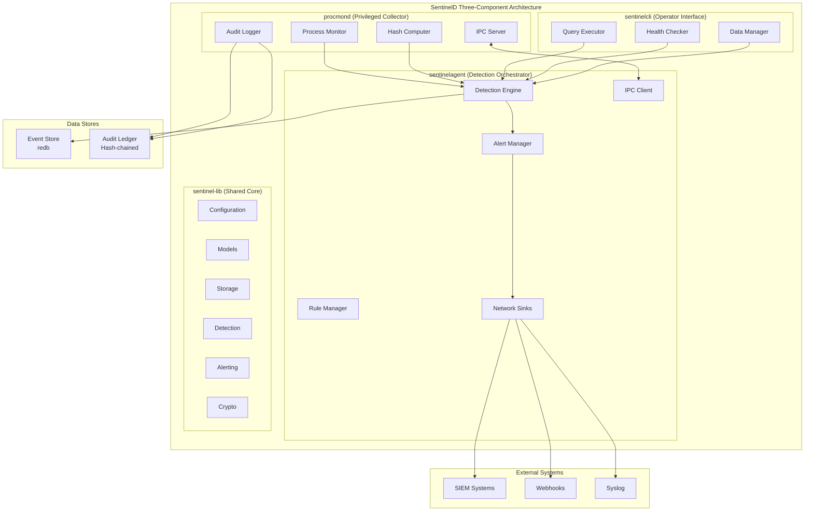
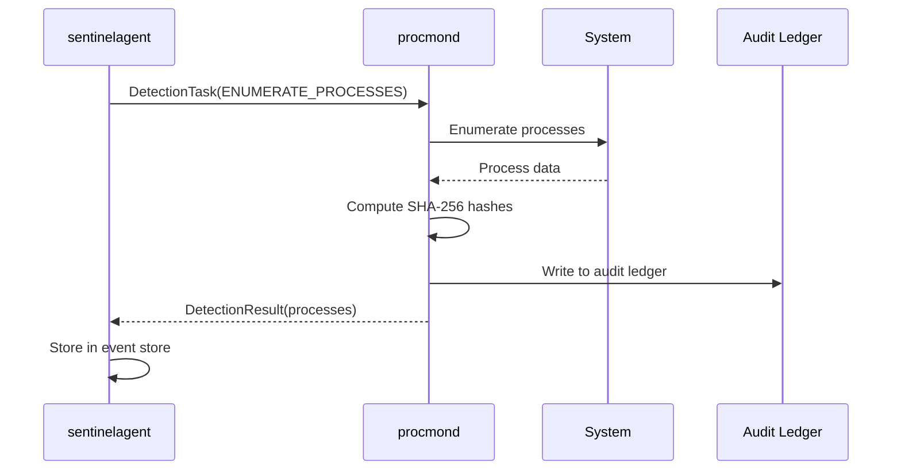
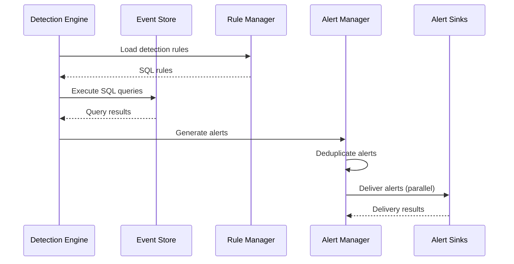
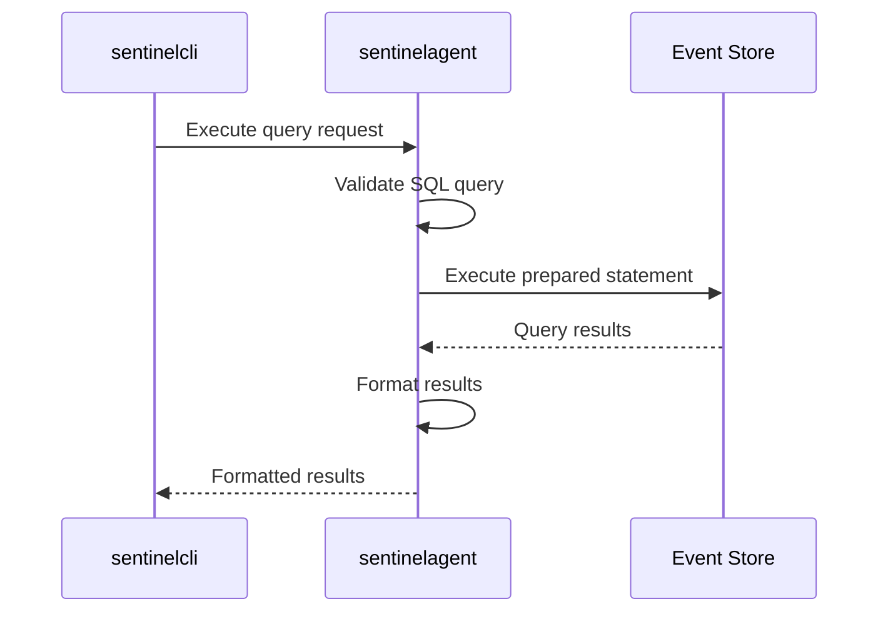

# SentinelD System Architecture

## Overview

SentinelD implements a **single crate with multiple binaries architecture** using feature flags for precise dependency control. The system follows a sophisticated three-component security design around the principle of minimal attack surface while maintaining high performance and audit-grade integrity. The system follows a pipeline processing model where process data flows from collection through detection to alerting, with each component having clearly defined responsibilities and security boundaries.

## High-Level Architecture



## Component Design

### procmond (Privileged Process Collector)

**Architectural Role**: Minimal privileged component for secure process data collection with purpose-built simplicity.

#### Core Responsibilities

- **Process Enumeration**: Cross-platform process data collection using sysinfo crate
- **Executable Hashing**: SHA-256 hash computation for integrity verification
- **Audit Logging**: Tamper-evident logging with cryptographic chains
- **IPC Communication**: Simple protobuf-based communication with sentinelagent

#### Security Boundaries

- **Privilege Management**: Starts with minimal privileges, optionally requests enhanced access
- **Privilege Dropping**: Drops all elevated privileges immediately after initialization
- **Network Isolation**: No network access whatsoever
- **Code Simplicity**: No SQL parsing or complex query logic
- **Audit Logging**: Write-only access to hash-chained audit ledger
- **Communication**: Simple protobuf IPC only (Unix sockets/named pipes)

#### Key Interfaces

```rust
#[async_trait]
pub trait ProcessCollector: Send + Sync {
    async fn enumerate_processes(&self) -> Result<Vec<ProcessRecord>>;
    async fn handle_detection_task(&self, task: DetectionTask) -> Result<DetectionResult>;
    async fn serve_ipc(&self) -> Result<()>;
}

#[async_trait]
pub trait HashComputer: Send + Sync {
    async fn compute_hash(&self, path: &Path) -> Result<Option<String>>;
    fn get_algorithm(&self) -> &'static str;
}

#[async_trait]
pub trait AuditLogger: Send + Sync {
    async fn log_event(&self, event: &AuditEvent) -> Result<()>;
    async fn verify_chain(&self) -> Result<ChainVerificationResult>;
}
```

#### Implementation Structure

```rust
pub struct ProcessCollector {
    config: CollectorConfig,
    hash_computer: Box<dyn HashComputer>,
    audit_logger: Box<dyn AuditLogger>,
    ipc_server: Box<dyn IpcServer>,
    privilege_manager: PrivilegeManager,
}

impl ProcessCollector {
    pub async fn new(config: CollectorConfig) -> Result<Self> {
        let mut privilege_manager = PrivilegeManager::new();

        // Request minimal required privileges
        privilege_manager.request_enhanced_privileges().await?;

        let collector = Self {
            config,
            hash_computer: Box::new(Sha256HashComputer::new()),
            audit_logger: Box::new(SqliteAuditLogger::new(&config.audit_path)?),
            ipc_server: Box::new(UnixSocketServer::new(&config.ipc_path)?),
            privilege_manager,
        };

        // Drop privileges immediately after initialization
        collector.privilege_manager.drop_privileges().await?;

        Ok(collector)
    }
}
```

### sentinelagent (Detection Orchestrator)

**Architectural Role**: User-space detection rule execution, alert management, and procmond lifecycle management.

#### Core Responsibilities

- **Detection Engine**: SQL-based rule execution with security validation
- **Alert Management**: Alert generation, deduplication, and delivery
- **Rule Management**: Rule loading, validation, and hot-reloading
- **Process Management**: procmond lifecycle management (start, stop, restart, health monitoring)
- **Network Communication**: Outbound-only connections for alert delivery

#### Security Boundaries

- **User Space Operation**: Operates in user space with minimal privileges
- **Event Store Management**: Manages redb event store (read/write access)
- **Rule Translation**: Translates complex SQL rules into simple protobuf tasks for procmond
- **Network Access**: Outbound-only network connections for alert delivery
- **Sandboxed Execution**: Sandboxed rule execution with resource limits
- **IPC Communication**: IPC client for communication with procmond

#### Key Interfaces

```rust
#[async_trait]
pub trait DetectionEngine: Send + Sync {
    async fn execute_rules(&self, scan_id: i64) -> Result<Vec<Alert>>;
    async fn validate_sql(&self, query: &str) -> Result<ValidationResult>;
    async fn load_rules(&self) -> Result<Vec<DetectionRule>>;
}

#[async_trait]
pub trait AlertManager: Send + Sync {
    async fn generate_alert(&self, detection: DetectionResult) -> Result<Alert>;
    async fn deliver_alert(&self, alert: &Alert) -> Result<DeliveryResult>;
    async fn deduplicate_alert(&self, alert: &Alert) -> Result<Option<Alert>>;
}

#[async_trait]
pub trait ProcessManager: Send + Sync {
    async fn start_procmond(&self) -> Result<()>;
    async fn stop_procmond(&self) -> Result<()>;
    async fn restart_procmond(&self) -> Result<()>;
    async fn health_check(&self) -> Result<HealthStatus>;
}
```

#### Implementation Structure

```rust
pub struct DetectionEngine {
    db: redb::Database,
    rule_manager: RuleManager,
    alert_manager: AlertManager,
    sql_validator: SqlValidator,
    ipc_client: IpcClient,
    process_manager: ProcessManager,
}

impl DetectionEngine {
    pub async fn new(config: AgentConfig) -> Result<Self> {
        let db = redb::Database::create(&config.event_store_path)?;

        // Initialize SQL validator with security constraints
        let sql_validator = SqlValidator::new()
            .with_allowed_functions(ALLOWED_SQL_FUNCTIONS)
            .with_read_only_mode(true)
            .with_timeout(Duration::from_secs(30));

        // Initialize IPC client for procmond communication
        let ipc_client = IpcClient::new(&config.procmond_socket_path)?;

        // Start procmond process
        let process_manager = ProcessManager::new(config.procmond_config);
        process_manager.start_procmond().await?;

        Ok(Self {
            db,
            rule_manager: RuleManager::new(&config.rules_path)?,
            alert_manager: AlertManager::new(&config.alerting_config)?,
            sql_validator,
            ipc_client,
            process_manager,
        })
    }
}
```

### sentinelcli (Operator Interface)

**Architectural Role**: Command-line interface for queries, management, and diagnostics.

#### Core Responsibilities

- **Data Queries**: Safe SQL query execution with parameterization
- **System Management**: Configuration, rule management, health monitoring
- **Data Export**: Multiple output formats (JSON, table, CSV)
- **Diagnostics**: System health checks and troubleshooting

#### Security Boundaries

- **No Network Access**: No network access whatsoever
- **No Direct Event Store Access**: Communicates through sentinelagent
- **Input Validation**: Comprehensive validation for all user-provided data
- **Safe SQL Execution**: SQL execution via sentinelagent with prepared statements
- **Local Communication Only**: Communicates only with sentinelagent

#### Key Interfaces

```rust
#[async_trait]
pub trait QueryExecutor: Send + Sync {
    async fn execute_query(&self, query: &str, params: &[Value]) -> Result<QueryResult>;
    async fn export_data(&self, format: ExportFormat, filter: &Filter) -> Result<ExportResult>;
}

#[async_trait]
pub trait HealthChecker: Send + Sync {
    async fn check_system_health(&self) -> Result<HealthStatus>;
    async fn check_component_health(&self, component: Component) -> Result<ComponentHealth>;
}

#[async_trait]
pub trait DataManager: Send + Sync {
    async fn export_alerts(&self, format: ExportFormat, filter: &AlertFilter) -> Result<ExportResult>;
    async fn export_processes(&self, format: ExportFormat, filter: &ProcessFilter) -> Result<ExportResult>;
}
```

### sentinel-lib (Shared Core)

**Architectural Role**: Common functionality shared across all components.

#### Core Modules

- **config**: Hierarchical configuration management with validation
- **models**: Core data structures and serialization/deserialization
- **storage**: Event store abstractions and connection management
- **detection**: SQL validation and rule execution framework
- **alerting**: Multi-channel alert delivery system
- **crypto**: Cryptographic functions for audit chains and integrity
- **telemetry**: Observability, metrics collection, and health monitoring

#### Module Structure

```rust
pub mod config {
    pub mod environment;
    pub mod hierarchical;
    pub mod validation;
}

pub mod models {
    pub mod alert;
    pub mod audit;
    pub mod detection_rule;
    pub mod process;
}

pub mod storage {
    pub mod audit_ledger;
    pub mod connection_pool;
    pub mod redb;
}

pub mod detection {
    pub mod rule_engine;
    pub mod sandbox;
    pub mod sql_validator;
}

pub mod alerting {
    pub mod deduplication;
    pub mod delivery;
    pub mod sinks;
}

pub mod crypto {
    pub mod hash_chain;
    pub mod integrity;
    pub mod signatures;
}

pub mod telemetry {
    pub mod health;
    pub mod metrics;
    pub mod tracing;
}
```

## Data Flow Architecture

### Process Collection Pipeline



### Detection and Alerting Pipeline



### Query and Management Pipeline



## IPC Protocol Design

### Protocol Specification

The IPC protocol uses Protocol Buffers for efficient, type-safe communication between procmond and sentinelagent.

```protobuf
syntax = "proto3";

// Simple detection tasks sent from sentinelagent to procmond
message DetectionTask {
    string task_id = 1;
    TaskType task_type = 2;
    optional ProcessFilter process_filter = 3;
    optional HashCheck hash_check = 4;
    optional string metadata = 5;
}

enum TaskType {
    ENUMERATE_PROCESSES = 0;
    CHECK_PROCESS_HASH = 1;
    MONITOR_PROCESS_TREE = 2;
    VERIFY_EXECUTABLE = 3;
}

message ProcessFilter {
    repeated string process_names = 1;
    repeated uint32 pids = 2;
    optional string executable_pattern = 3;
}

message HashCheck {
    string expected_hash = 1;
    string hash_algorithm = 2;
    string executable_path = 3;
}

// Results sent back from procmond to sentinelagent
message DetectionResult {
    string task_id = 1;
    bool success = 2;
    optional string error_message = 3;
    repeated ProcessRecord processes = 4;
    optional HashResult hash_result = 5;
}

message ProcessRecord {
    uint32 pid = 1;
    optional uint32 ppid = 2;
    string name = 3;
    optional string executable_path = 4;
    repeated string command_line = 5;
    optional int64 start_time = 6;
    optional double cpu_usage = 7;
    optional uint64 memory_usage = 8;
    optional string executable_hash = 9;
    optional string hash_algorithm = 10;
    optional string user_id = 11;
    bool accessible = 12;
    bool file_exists = 13;
    int64 collection_time = 14;
}
```

### Transport Layer

**Unix Domain Sockets (Linux/macOS)**:

```rust
pub struct UnixSocketServer {
    path: PathBuf,
    listener: UnixListener,
}

impl IpcServer for UnixSocketServer {
    async fn serve<F>(&self, handler: F) -> Result<()>
    where
        F: Fn(DetectionTask) -> Result<DetectionResult> + Send + Sync + 'static,
    {
        let mut incoming = self.listener.incoming();

        while let Some(stream) = incoming.next().await {
            let stream = stream?;
            let handler = handler.clone();

            tokio::spawn(async move {
                Self::handle_connection(stream, handler).await;
            });
        }

        Ok(())
    }
}
```

**Named Pipes (Windows)**:

```rust
pub struct NamedPipeServer {
    pipe_name: String,
    server: NamedPipeServerStream,
}

impl IpcServer for NamedPipeServer {
    async fn serve<F>(&self, handler: F) -> Result<()>
    where
        F: Fn(DetectionTask) -> Result<DetectionResult> + Send + Sync + 'static,
    {
        // Windows named pipe implementation
        // Similar to Unix socket but using Windows named pipes
    }
}
```

## Data Storage Architecture

### Event Store (redb)

**Purpose**: High-performance process data storage with concurrent access.

**Schema Design**:

```rust
// Process snapshots table
pub struct ProcessSnapshot {
    pub id: Uuid,
    pub scan_id: i64,
    pub collection_time: i64,
    pub pid: u32,
    pub ppid: Option<u32>,
    pub name: String,
    pub executable_path: Option<PathBuf>,
    pub command_line: Vec<String>,
    pub start_time: Option<i64>,
    pub cpu_usage: Option<f64>,
    pub memory_usage: Option<u64>,
    pub executable_hash: Option<String>,
    pub hash_algorithm: Option<String>,
    pub user_id: Option<String>,
    pub accessible: bool,
    pub file_exists: bool,
    pub platform_data: Option<serde_json::Value>,
}

// Scan metadata table
pub struct ScanMetadata {
    pub id: i64,
    pub start_time: i64,
    pub end_time: i64,
    pub process_count: i32,
    pub collection_duration_ms: i64,
    pub system_info: SystemInfo,
}

// Detection rules table
pub struct DetectionRule {
    pub id: String,
    pub name: String,
    pub description: Option<String>,
    pub version: i32,
    pub sql_query: String,
    pub enabled: bool,
    pub severity: AlertSeverity,
    pub category: Option<String>,
    pub tags: Vec<String>,
    pub author: Option<String>,
    pub created_at: i64,
    pub updated_at: i64,
    pub source_type: RuleSourceType,
    pub source_path: Option<PathBuf>,
}

// Alerts table
pub struct Alert {
    pub id: Uuid,
    pub alert_time: i64,
    pub rule_id: String,
    pub title: String,
    pub description: String,
    pub severity: AlertSeverity,
    pub scan_id: Option<i64>,
    pub affected_processes: Vec<u32>,
    pub process_count: i32,
    pub alert_data: serde_json::Value,
    pub rule_execution_time_ms: Option<i64>,
    pub dedupe_key: String,
}
```

### Audit Ledger (Hash-chained)

**Purpose**: Tamper-evident audit trail with cryptographic integrity using hash-chained log file.

**Implementation**:

The audit ledger is implemented as a hash-chained log file, not a database table. Each entry contains a cryptographic hash of the previous entry, creating an immutable chain.

**Hash Chain Implementation**:

```rust
pub struct AuditChain {
    hasher: blake3::Hasher,
    signer: Option<ed25519_dalek::Keypair>,
    previous_hash: Option<blake3::Hash>,
}

impl AuditChain {
    pub fn append_entry(&mut self, entry: &AuditEntry) -> Result<AuditRecord> {
        let entry_data = serde_json::to_vec(entry)?;
        let entry_hash = blake3::hash(&entry_data);

        let record = AuditRecord {
            sequence: self.next_sequence(),
            timestamp: SystemTime::now().duration_since(UNIX_EPOCH)?.as_millis() as i64,
            actor: entry.actor.clone(),
            action: entry.action.clone(),
            payload_hash: entry_hash,
            previous_hash: self.previous_hash,
            entry_hash: self.compute_entry_hash(&entry_hash)?,
            signature: self.sign_entry(&entry_hash)?,
        };

        self.previous_hash = Some(record.entry_hash);
        Ok(record)
    }

    pub fn verify_chain(&self, records: &[AuditRecord]) -> Result<VerificationResult> {
        // Verify hash chain integrity and signatures
        for (i, record) in records.iter().enumerate() {
            if i > 0 {
                let prev_record = &records[i - 1];
                if record.previous_hash != Some(prev_record.entry_hash) {
                    return Err(VerificationError::ChainBroken(i));
                }
            }

            // Verify entry hash
            let computed_hash = self.compute_entry_hash(&record.payload_hash)?;
            if record.entry_hash != computed_hash {
                return Err(VerificationError::HashMismatch(i));
            }

            // Verify signature if present
            if let Some(signature) = &record.signature {
                self.verify_signature(&record.payload_hash, signature)?;
            }
        }

        Ok(VerificationResult::Valid)
    }
}
```

## Security Architecture

### Privilege Separation Model

**Principle**: Each component operates with the minimum privileges required for its function.

```rust
pub struct PrivilegeManager {
    initial_privileges: Privileges,
    current_privileges: Privileges,
    drop_completed: bool,
}

impl PrivilegeManager {
    pub async fn request_enhanced_privileges(&mut self) -> Result<()> {
        // Platform-specific privilege escalation
        #[cfg(target_os = "linux")]
        self.request_linux_capabilities()?;

        #[cfg(target_os = "windows")]
        self.request_windows_privileges()?;

        #[cfg(target_os = "macos")]
        self.request_macos_entitlements()?;

        Ok(())
    }

    pub async fn drop_privileges(&mut self) -> Result<()> {
        // Immediate privilege drop after initialization
        self.drop_all_elevated_privileges()?;
        self.drop_completed = true;
        self.audit_privilege_drop().await?;
        Ok(())
    }
}
```

### SQL Injection Prevention

**AST Validation**: All user-provided SQL undergoes comprehensive validation.

```rust
pub struct SqlValidator {
    parser: sqlparser::Parser<sqlparser::dialect::SQLiteDialect>,
    allowed_functions: HashSet<String>,
}

impl SqlValidator {
    pub fn validate_query(&self, sql: &str) -> Result<ValidationResult> {
        let ast = self.parser.parse_sql(sql)?;

        for statement in &ast {
            match statement {
                Statement::Query(query) => self.validate_select_query(query)?,
                _ => return Err(ValidationError::ForbiddenStatement),
            }
        }

        Ok(ValidationResult::Valid)
    }

    fn validate_select_query(&self, query: &Query) -> Result<()> {
        // Validate SELECT body, WHERE clauses, functions, etc.
        // Reject any non-whitelisted constructs
        self.validate_select_body(&query.body)?;
        self.validate_where_clause(&query.selection)?;
        Ok(())
    }
}
```

### Resource Management

**Bounded Channels**: Configurable capacity with backpressure policies.

```rust
pub struct BoundedChannel<T> {
    sender: mpsc::Sender<T>,
    receiver: mpsc::Receiver<T>,
    capacity: usize,
    backpressure_policy: BackpressurePolicy,
}

impl<T> BoundedChannel<T> {
    pub async fn send(&self, item: T) -> Result<(), ChannelError> {
        match self.backpressure_policy {
            BackpressurePolicy::Block => {
                self.sender.send(item).await?;
            }
            BackpressurePolicy::Drop => {
                if self.sender.try_send(item).is_err() {
                    return Err(ChannelError::ChannelFull);
                }
            }
            BackpressurePolicy::Error => {
                self.sender.try_send(item)?;
            }
        }
        Ok(())
    }
}
```

## Performance Characteristics

### Process Collection Performance

- **Baseline**: \<5 seconds for 10,000+ processes
- **CPU Usage**: \<5% sustained during continuous monitoring
- **Memory Usage**: \<100MB resident under normal operation
- **Hash Computation**: SHA-256 for all accessible executables

### Detection Engine Performance

- **Rule Execution**: \<100ms per detection rule
- **SQL Validation**: AST parsing and validation
- **Resource Limits**: 30-second timeout, memory limits
- **Concurrent Execution**: Parallel rule processing

### Alert Delivery Performance

- **Multi-Channel**: Parallel delivery to multiple sinks
- **Reliability**: Circuit breakers and retry logic
- **Performance**: Non-blocking delivery with backpressure
- **Monitoring**: Delivery success rates and latency metrics

## Cross-Platform Strategy

### Process Enumeration

- **Phase 1**: sysinfo crate for unified cross-platform baseline
- **Phase 2**: Platform-specific enhancements (eBPF, ETW, EndpointSecurity)
- **Fallback**: Graceful degradation when enhanced features unavailable

### Privilege Management

- **Linux**: CAP_SYS_PTRACE, immediate capability dropping
- **Windows**: SeDebugPrivilege, token restriction after init
- **macOS**: Minimal entitlements, sandbox compatibility

---

*This architecture provides a robust foundation for implementing SentinelD's core monitoring functionality while maintaining security, performance, and reliability requirements across all supported platforms.*
