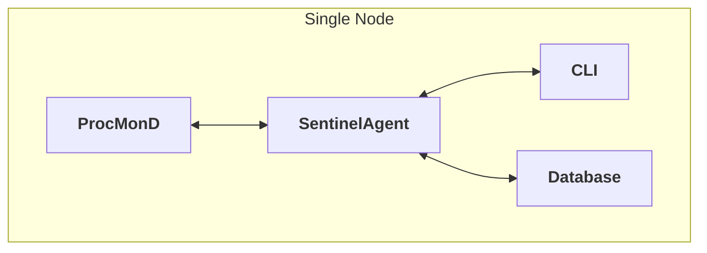
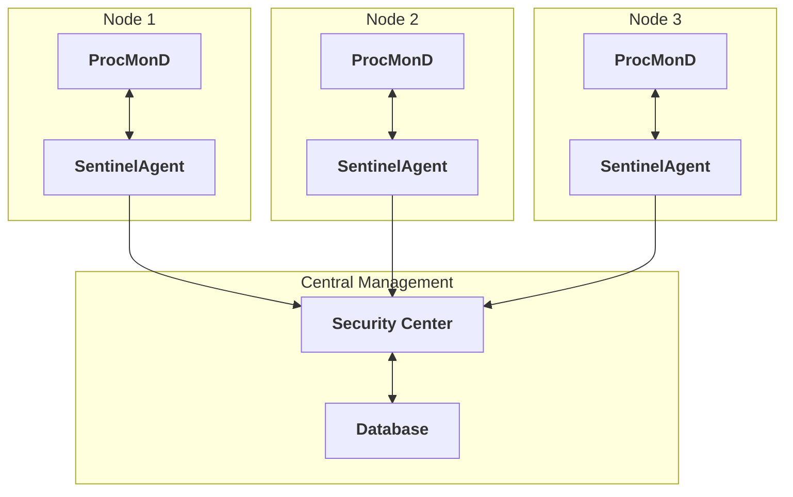
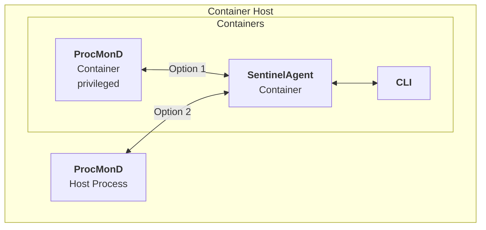

# Deployment Documentation

This section contains comprehensive deployment guides for DaemonEye, covering installation, configuration, and deployment strategies across different platforms and environments.

---

## Table of Contents

[TOC]

---

## Installation Guide

Complete installation instructions for all supported platforms including Linux, macOS, and Windows.

[Read Installation Guide →](./deployment/installation.md)

## Configuration Guide

Comprehensive configuration management covering all aspects of DaemonEye setup, tuning, and customization.

[Read Configuration Guide →](./deployment/configuration.md)

## Docker Deployment

Complete guide for containerizing and deploying DaemonEye using Docker and Docker Compose.

[Read Docker Guide →](./deployment/docker.md)

## Deployment Overview

### Supported Platforms

DaemonEye supports deployment on:

- **Linux**: Ubuntu, RHEL, CentOS, Debian, Arch Linux
- **macOS**: 10.14+ (Mojave or later)
- **Windows**: Windows 10+ or Windows Server 2016+
- **Containers**: Docker, Podman, containerd

> [!NOTE]
> **Container Runtime Notes:**
>
> - **Docker**: Most common, requires privileged containers for host process monitoring
> - **Podman**: Rootless containers supported, better security isolation
>   - ⚠️ **eBPF Limitation**: Rootless containers may have limited eBPF functionality due to kernel capabilities restrictions
> - **containerd**: Lower-level runtime, requires additional configuration for privileged access

### Deployment Methods

1. **Package Managers**: APT, YUM, Homebrew, Chocolatey
2. **Pre-built Binaries**: Direct download and installation
3. **Source Build**: Compile from source code
4. **Release Tooling**: cargo-dist for automated cross-platform builds
5. **Containers**: Docker images and container deployment
6. **Cloud**: AWS, Azure, GCP marketplace deployments

> [!CAUTION]
> **Orchestration platforms (Kubernetes, Docker Swarm, Nomad) are not officially supported.** While technically possible to deploy DaemonEye on these platforms, they are not recommended for production use due to:
>
> - Lack of native DaemonSet support (except Kubernetes)
> - Complex privileged container requirements
> - Node-specific monitoring constraints
> - Limited testing and validation

### Architecture Considerations

#### Single Node Deployment

For small to medium environments:



#### Multi-Node Deployment

For large environments with multiple monitoring targets:



#### Container Deployment

For containerized environments, ProcMonD can be deployed in two ways:

> [!WARNING]
> Containerized ProcMonD only works on Linux hosts. macOS and Windows must use host process deployment.



**Deployment Recommendations:**

- **Option 1 (Containerized ProcMonD)**: Recommended for containerized environments where you want full containerization. Requires privileged container access to monitor host processes.
- **Option 2 (Host Process ProcMonD)**: Recommended for hybrid deployments where you want to minimize container privileges while maintaining containerized management components.

> [!WARNING]
> Option 1 requires running a privileged container, which grants the container access to the host system. This increases the attack surface and should only be used in trusted environments with proper security controls in place.

## Quick Start

### Docker Quick Start

```bash
# Pull the latest image
docker pull daemoneye/daemoneye:latest

# Run with basic configuration
docker run -d --name daemoneye \
  --privileged \
  -v /var/lib/daemoneye:/data \
  -v /var/log/daemoneye:/logs \
  daemoneye/daemoneye:latest

# Check status
docker logs daemoneye
```

### Package Manager Quick Start

**Ubuntu/Debian**:

```bash
# Add repository
wget -qO - https://packages.daemoneye.com/apt/key.gpg | sudo apt-key add -
echo "deb https://packages.daemoneye.com/apt stable main" | sudo tee /etc/apt/sources.list.d/daemoneye.list

# Install
sudo apt update
sudo apt install daemoneye

# Start service
sudo systemctl start daemoneye
sudo systemctl enable daemoneye
```

**RHEL/CentOS**:

```bash
# Add repository
sudo tee /etc/yum.repos.d/daemoneye.repo << 'EOF'
[daemoneye]
name=DaemonEye
baseurl=https://packages.daemoneye.com/yum/stable/
enabled=1
gpgcheck=1
gpgkey=https://packages.daemoneye.com/apt/key.gpg
EOF

# Install
sudo yum install daemoneye

# Start service
sudo systemctl start daemoneye
sudo systemctl enable daemoneye
```

**macOS**:

```bash
# Install with Homebrew
brew tap daemoneye/daemoneye
brew install daemoneye

# Start service
brew services start daemoneye
```

**Windows**:

```powershell
# Install with Chocolatey
choco install daemoneye

# Start service
Start-Service DaemonEye
```

## Configuration Management

### Environment Variables

DaemonEye supports configuration through environment variables:

```bash
# Basic configuration
export SENTINELD_LOG_LEVEL=info
export SENTINELD_SCAN_INTERVAL_MS=30000
export SENTINELD_BATCH_SIZE=1000

# Database configuration
export SENTINELD_DATABASE_PATH=/var/lib/daemoneye/processes.db
export SENTINELD_DATABASE_RETENTION_DAYS=30

# Alerting configuration
export SENTINELD_ALERTING_ENABLED=true
export SENTINELD_ALERTING_SINKS_0_TYPE=syslog
export SENTINELD_ALERTING_SINKS_0_FACILITY=daemon
```

### Configuration Files

Hierarchical configuration with multiple sources:

1. **Command-line flags** (highest precedence)
2. **Environment variables** (`SENTINELD_*`)
3. **User configuration file** (`~/.config/daemoneye/config.yaml`)
4. **System configuration file** (`/etc/daemoneye/config.yaml`)
5. **Embedded defaults** (lowest precedence)

### Basic Configuration

```yaml
# /etc/daemoneye/config.yaml
app:
  scan_interval_ms: 30000
  batch_size: 1000
  log_level: info
  data_dir: /var/lib/daemoneye
  log_dir: /var/log/daemoneye

database:
  path: /var/lib/daemoneye/processes.db
  retention_days: 30
  max_connections: 10

alerting:
  enabled: true
  sinks:
    - type: syslog
      enabled: true
      facility: daemon
      priority: info
    - type: webhook
      enabled: false
      url: https://alerts.example.com/webhook
      timeout_ms: 5000
      retry_attempts: 3

security:
  enable_privilege_dropping: true
  drop_to_user: daemoneye
  drop_to_group: daemoneye
  enable_audit_logging: true
```

## Production Deployment

### Resource Requirements

**Minimum Requirements**:

- CPU: 1 core
- RAM: 512MB
- Storage: 1GB
- Network: 100Mbps

**Recommended Requirements**:

- CPU: 2+ cores
- RAM: 2GB+
- Storage: 10GB+
- Network: 1Gbps

**High-Performance Requirements**:

- CPU: 4+ cores
- RAM: 8GB+
- Storage: 100GB+
- Network: 10Gbps

### Security Considerations

1. **Principle of Least Privilege**: Run with minimal required privileges
2. **Network Security**: Use TLS for all network communications
3. **Data Protection**: Encrypt sensitive data at rest and in transit
4. **Access Control**: Implement proper authentication and authorization
5. **Audit Logging**: Enable comprehensive audit logging

### Performance Tuning

**CPU Optimization**:

```yaml
app:
  scan_interval_ms: 60000  # Reduce scan frequency
  batch_size: 500          # Smaller batches
  max_cpu_percent: 5.0     # Limit CPU usage
```

**Memory Optimization**:

```yaml
app:
  max_memory_mb: 512       # Limit memory usage
  batch_size: 250          # Smaller batches
  gc_interval_ms: 300000   # Garbage collection interval
```

**Database Optimization**:

```yaml
database:
  cache_size: -128000      # 128MB cache
  temp_store: MEMORY       # Use memory for temp tables
  synchronous: NORMAL      # Balance safety and performance
  wal_mode: true           # Enable WAL mode
```

### Monitoring and Observability

**Metrics Collection**:

```yaml
observability:
  enable_metrics: true
  metrics_port: 9090
  metrics_path: /metrics
```

**Health Checks**:

```yaml
observability:
  enable_health_checks: true
  health_check_port: 8080
  health_check_path: /health
```

**Logging**:

```yaml
observability:
  logging:
    enable_structured_logging: true
    log_format: json
    enable_log_rotation: true
    max_log_file_size_mb: 100
    max_log_files: 10
```

## Container Deployment

### Docker Compose

```yaml
version: '3.8'

services:
  procmond:
    image: daemoneye/procmond:latest
    container_name: daemoneye-procmond
    privileged: true
    volumes:
      - /var/lib/daemoneye:/data
      - /var/log/daemoneye:/logs
      - ./config:/config:ro
    environment:
      - SENTINELD_LOG_LEVEL=info
      - SENTINELD_DATA_DIR=/data
      - SENTINELD_LOG_DIR=/logs
    command: [--config, /config/config.yaml]
    restart: unless-stopped

  daemoneye-agent:
    image: daemoneye/daemoneye-agent:latest
    container_name: daemoneye-agent
    depends_on:
      - procmond
    volumes:
      - /var/lib/daemoneye:/data
      - /var/log/daemoneye:/logs
      - ./config:/config:ro
    environment:
      - SENTINELD_LOG_LEVEL=info
      - SENTINELD_DATA_DIR=/data
      - SENTINELD_LOG_DIR=/logs
    command: [--config, /config/config.yaml]
    restart: unless-stopped

  sentinelcli:
    image: daemoneye/sentinelcli:latest
    container_name: daemoneye-cli
    depends_on:
      - daemoneye-agent
    volumes:
      - /var/lib/daemoneye:/data
      - ./config:/config:ro
    environment:
      - SENTINELD_DATA_DIR=/data
    command: [--help]
    restart: no
```

## Cloud Deployment

### AWS Deployment

**EC2 Instance**:

```bash
# Launch EC2 instance
aws ec2 run-instances \
  --image-id ami-0c02fb55956c7d316 \
  --instance-type t3.medium \
  --key-name your-key \
  --security-group-ids sg-12345678 \
  --subnet-id subnet-12345678 \
  --user-data file://user-data.sh
```

### Azure Deployment

**Azure Container Instances**:

```bash
# Deploy container
az container create \
  --resource-group myResourceGroup \
  --name daemoneye \
  --image daemoneye/daemoneye:latest \
  --cpu 1 \
  --memory 2 \
  --ports 8080 9090 \
  --environment-variables SENTINELD_LOG_LEVEL=info
```

## Troubleshooting

### Common Issues

**Service Won't Start**:

```bash
# Check service status
sudo systemctl status daemoneye

# Check logs
sudo journalctl -u daemoneye -f

# Check configuration
sentinelcli config validate
```

**Permission Denied**:

```bash
# Check file permissions
ls -la /var/lib/daemoneye/
ls -la /var/log/daemoneye/

# Fix permissions
sudo chown -R daemoneye:daemoneye /var/lib/daemoneye
sudo chown -R daemoneye:daemoneye /var/log/daemoneye
```

**Database Issues**:

```bash
# Check database status
sentinelcli database status

# Check database integrity
sentinelcli database integrity-check

# Repair database
sentinelcli database repair
```

**Performance Issues**:

```bash
# Check system metrics
sentinelcli metrics

# Check resource usage
sentinelcli system resources

# Optimize configuration
sentinelcli config optimize
```

### Debug Mode

**Enable Debug Logging**:

```bash
# Set debug level
sentinelcli config set app.log_level debug

# Restart service
sudo systemctl restart daemoneye

# Monitor debug logs
sentinelcli logs --level debug --tail 100
```

**Debug Specific Components**:

```bash
# Debug process collection
sentinelcli debug collector

# Debug alert delivery
sentinelcli debug alerts

# Debug database operations
sentinelcli debug database
```

### Health Checks

**System Health**:

```bash
# Overall health
sentinelcli health

# Component health
sentinelcli health --component procmond
sentinelcli health --component daemoneye-agent
sentinelcli health --component database

# Detailed health report
sentinelcli health --verbose
```

## Best Practices

### Deployment

1. **Start Small**: Begin with basic monitoring and gradually add features
2. **Test Configuration**: Always validate configuration before deployment
3. **Monitor Resources**: Keep an eye on CPU and memory usage
4. **Regular Updates**: Keep DaemonEye updated with latest releases
5. **Backup Data**: Regularly backup configuration and data

### Security

1. **Principle of Least Privilege**: Run with minimal required privileges
2. **Network Security**: Use TLS for all network communications
3. **Access Control**: Implement proper authentication and authorization
4. **Audit Logging**: Enable comprehensive audit logging
5. **Regular Updates**: Keep security patches current

### Performance

1. **Resource Monitoring**: Monitor CPU, memory, and storage usage
2. **Configuration Tuning**: Optimize configuration for your environment
3. **Load Testing**: Test performance under expected load
4. **Capacity Planning**: Plan for growth and scaling
5. **Regular Maintenance**: Perform regular maintenance and optimization

---

*This deployment documentation provides comprehensive guidance for deploying DaemonEye. For additional help, consult the specific deployment guides or contact support.*
