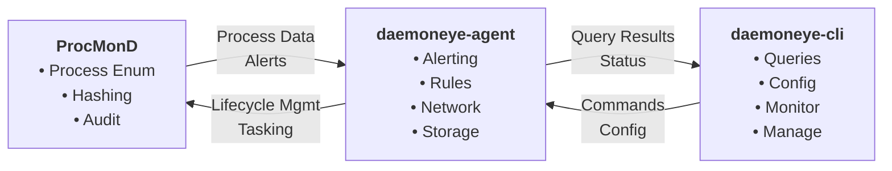

# Technical Documentation

This section contains comprehensive technical documentation for DaemonEye, covering implementation details, architecture specifications, and technical guides.

---

## Table of Contents

[TOC]

---

## Core Monitoring

The core monitoring system provides real-time process monitoring and threat detection capabilities. This is the foundation of DaemonEye and is available in all tiers.

[Read Core Monitoring Documentation →](./technical/core-monitoring.md)

## Business Tier Features

Business tier features extend the core monitoring with additional capabilities including the Security Center, enhanced integrations, and curated rule packs.

[Read Business Tier Documentation →](./technical/business-tier.md)

## Enterprise Tier Features

Enterprise tier features provide advanced monitoring capabilities including kernel monitoring, network event monitoring, and federated security center architecture.

[Read Enterprise Tier Documentation →](./technical/enterprise-tier.md)

## Platform-Specific Process Collectors

DaemonEye provides platform-specific process collectors that leverage native operating system capabilities for enhanced monitoring and security analysis.

### Windows Process Collector

The Windows process collector provides comprehensive Windows-specific capabilities including SeDebugPrivilege detection, process tokens, UAC elevation status, and Windows service monitoring.

[Read Windows Process Collector Documentation →](./technical/windows-process-collector.md)

### macOS Process Collector

The macOS process collector provides comprehensive macOS-specific capabilities including kernel extension integration, process code signing verification, system integrity protection monitoring, and EndpointSecurity framework integration.

[Read macOS Process Collector Documentation →](./technical/macos-process-collector.md)

## Technical Architecture

### Component Overview

DaemonEye follows a three-component security architecture:

1. **ProcMonD**: Privileged process monitoring daemon
2. **daemoneye-agent**: User-space orchestrator and alerting
3. **daemoneye-cli**: Command-line interface and management

### Data Flow



### Technology Stack

- **Language**: Rust 2024 Edition
- **Runtime**: Tokio async runtime
- **Event Store**: redb (pure Rust embedded database)
- **Audit Ledger**: Certificate Transparency-style Merkle tree
- **IPC**: Custom Protobuf over Unix Sockets
- **CLI**: clap v4 with derive macros
- **Configuration**: figment with hierarchical loading
- **Logging**: tracing ecosystem with structured JSON
- **Testing**: cargo-nextest with comprehensive test suite

## Implementation Details

### Process Collection

The process collection system uses the `sysinfo` crate for cross-platform process enumeration:

```rust
use sysinfo::System;

pub struct ProcessCollector {
    system: System,
}

impl ProcessCollector {
    pub fn new() -> Self {
        Self {
            system: System::new_all(),
        }
    }

    pub async fn collect_processes(&mut self) -> Result<Vec<ProcessInfo>, CollectionError> {
        self.system.refresh_all();

        let processes = self
            .system
            .processes()
            .values()
            .map(|p| ProcessInfo::from(p))
            .collect();

        Ok(processes)
    }
}
```

### Event Store Operations

DaemonEye uses redb for high-performance event storage:

```rust
use redb::{Database, ReadableTable, WritableTable};

pub struct EventStore {
    db: Database,
}

impl EventStore {
    pub fn new(path: &str) -> Result<Self, redb::Error> {
        let db = Database::create(path)?;
        Ok(Self { db })
    }

    pub async fn insert_process(&self, process: &ProcessInfo) -> Result<(), redb::Error> {
        let write_txn = self.db.begin_write()?;
        {
            let mut table = write_txn.open_table(PROCESS_TABLE)?;
            let key = process.pid;
            let value = serde_json::to_vec(process)?;
            table.insert(key, &value)?;
        }
        write_txn.commit()?;
        Ok(())
    }
}
```

### Alert System

The alert system provides multi-channel alert delivery:

```rust
use async_trait::async_trait;

#[async_trait]
pub trait AlertSink: Send + Sync {
    async fn send(&self, alert: &Alert) -> Result<DeliveryResult, DeliveryError>;
    async fn health_check(&self) -> HealthStatus;
    fn name(&self) -> &str;
}

pub struct AlertManager {
    sinks: Vec<Box<dyn AlertSink>>,
}

impl AlertManager {
    pub async fn send_alert(&self, alert: Alert) -> Result<(), AlertError> {
        let mut results = Vec::new();

        for sink in &self.sinks {
            let result = sink.send(&alert).await;
            results.push(result);
        }

        // Check if any sink succeeded
        if results.iter().any(|r| r.is_ok()) {
            Ok(())
        } else {
            Err(AlertError::DeliveryFailed)
        }
    }
}
```

## Performance Considerations

### Memory Management

DaemonEye is designed for minimal memory usage:

- **Process Collection**: ~1MB per 1000 processes
- **Database Operations**: ~10MB for 100,000 records
- **Alert Processing**: ~1MB for 10,000 alerts
- **Total Memory**: \<100MB under normal operation

### CPU Usage

CPU usage is optimized for minimal impact:

- **Process Collection**: \<5% CPU sustained
- **Database Operations**: \<2% CPU for queries
- **Alert Processing**: \<1% CPU for delivery
- **Total CPU**: \<5% sustained during monitoring

### Storage Requirements

Storage requirements scale with data retention:

- **Process Records**: ~1KB per process per collection
- **Alert Records**: ~500B per alert
- **Audit Logs**: ~100B per operation
- **Total Storage**: ~1GB per month for 1000 processes

## Security Implementation

### Input Validation

All inputs are validated using the `validator` crate:

```rust
use validator::{Validate, ValidationError};

#[derive(Validate)]
pub struct DetectionRule {
    #[validate(length(min = 1, max = 1000))]
    pub name: String,

    #[validate(custom = "validate_sql")]
    pub sql_query: String,

    #[validate(range(min = 1, max = 1000))]
    pub priority: u32,
}

fn validate_sql(sql: &str) -> Result<(), ValidationError> {
    // Parse and validate SQL syntax
    let ast = sqlparser::parse(sql)?;
    validate_ast(&ast)?;
    Ok(())
}
```

### SQL Injection Prevention

Multiple layers of SQL injection prevention:

1. **AST Validation**: Parse and validate SQL queries
2. **Prepared Statements**: Use parameterized queries
3. **Sandboxed Execution**: Isolated query execution
4. **Input Sanitization**: Clean and validate all inputs

### Cryptographic Integrity

BLAKE3 hashing and Ed25519 signatures ensure data integrity:

```rust
use blake3::Hasher;
use ed25519_dalek::{Keypair, Signature};

pub struct IntegrityChecker {
    hasher: Hasher,
    keypair: Keypair,
}

impl IntegrityChecker {
    pub fn hash_data(&self, data: &[u8]) -> [u8; 32] {
        self.hasher.update(data).finalize().into()
    }

    pub fn sign_data(&self, data: &[u8]) -> Signature {
        self.keypair.sign(data)
    }
}
```

## Testing Strategy

### Unit Testing

Comprehensive unit testing with mocks and test doubles:

```rust
#[cfg(test)]
mod tests {
    use super::*;
    use mockall::mock;

    mock! {
        pub ProcessCollector {}

        #[async_trait]
        impl ProcessCollectionService for ProcessCollector {
            async fn collect_processes(&self) -> Result<CollectionResult, CollectionError>;
        }
    }

    #[tokio::test]
    async fn test_agent_with_mock_collector() {
        let mut mock_collector = MockProcessCollector::new();
        mock_collector
            .expect_collect_processes()
            .times(1)
            .returning(|| Ok(CollectionResult::default()));

        let agent = daemoneye_agent::new(Box::new(mock_collector));
        let result = agent.run_collection_cycle().await;

        assert!(result.is_ok());
    }
}
```

### Integration Testing

Test component interactions and data flow:

```rust
#[tokio::test]
async fn test_database_integration() {
    let temp_dir = TempDir::new().unwrap();
    let db_path = temp_dir.path().join("test.db");

    let db = Database::new(&db_path).await.unwrap();
    db.create_schema().await.unwrap();

    let process = ProcessInfo::default();
    db.insert_process(&process).await.unwrap();

    let retrieved = db.get_process(process.pid).await.unwrap();
    assert_eq!(process.pid, retrieved.pid);
}
```

### Performance Testing

Benchmark critical operations:

```rust
use criterion::{Criterion, black_box, criterion_group, criterion_main};

fn benchmark_process_collection(c: &mut Criterion) {
    let mut group = c.benchmark_group("process_collection");

    group.bench_function("collect_processes", |b| {
        b.iter(|| {
            let collector = ProcessCollector::new();
            black_box(collector.collect_processes())
        })
    });

    group.finish();
}

criterion_group!(benches, benchmark_process_collection);
criterion_main!(benches);
```

## Deployment Considerations

### Container Deployment

DaemonEye is designed for containerized deployment:

- **Docker**: Multi-stage builds for minimal images
- **Kubernetes**: DaemonSet for process monitoring
- **Security**: Non-root containers with minimal privileges
- **Resource Limits**: Configurable CPU and memory limits

### Platform Support

Cross-platform support with platform-specific optimizations:

- **Linux**: Primary target with `/proc` filesystem access
- **macOS**: Native process enumeration with security framework
- **Windows**: Windows API process access with service deployment

### Configuration Management

Hierarchical configuration with multiple sources:

1. **Command-line flags** (highest precedence)
2. **Environment variables** (`DaemonEye_*`)
3. **User configuration file** (`~/.config/daemoneye/config.yaml`)
4. **System configuration file** (`/etc/daemoneye/config.yaml`)
5. **Embedded defaults** (lowest precedence)

---

*This technical documentation provides comprehensive information about DaemonEye's implementation. For specific implementation details, consult the individual technical guides.*
