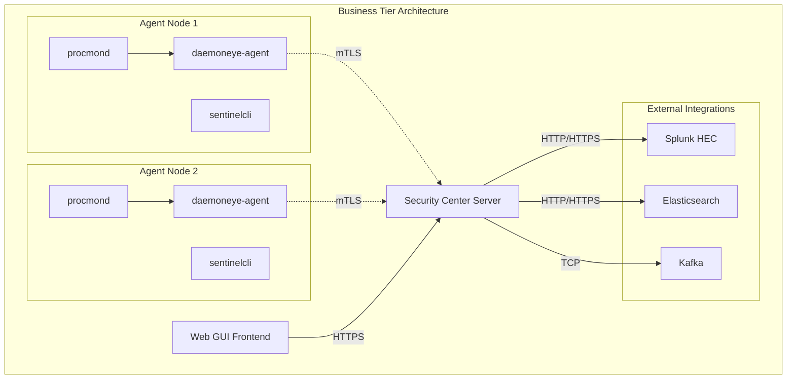

# Business Tier Features Technical Specification

## Overview

The Business Tier Features extend the core DaemonEye architecture with professional-grade capabilities targeting small teams and consultancies. The design maintains the security-first, offline-capable philosophy while adding enterprise integrations, curated content, and centralized management capabilities.

The key architectural addition is the **DaemonEye Security Center**, a new component that provides centralized aggregation, management, and visualization capabilities while preserving the autonomous operation of individual agents.

---

## Table of Contents

[TOC]

---

## Security Center Architecture

### Component Overview



### Security Center Server

**Technology Stack**:

- **Framework**: Axum web framework with tokio async runtime
- **Database**: PostgreSQL with connection pooling for scalable data storage
- **Authentication**: Mutual TLS (mTLS) for agent connections, JWT for web GUI
- **Configuration**: Same hierarchical config system as core DaemonEye
- **Observability**: OpenTelemetry tracing with Prometheus metrics export

**Core Modules**:

```rust
pub mod security_center {
    pub mod agent_registry; // Agent authentication and management
    pub mod data_aggregator; // Central data collection and storage
    pub mod database; // PostgreSQL connection pool and migrations
    pub mod health;
    pub mod integration_hub; // External system connectors
    pub mod observability; // OpenTelemetry tracing and Prometheus metrics
    pub mod rule_distributor; // Rule pack management and distribution
    pub mod web_api; // REST API for GUI frontend // Health checks and system monitoring
}
```

### Database Layer

**Connection Pool**: sqlx::PgPool with configurable min/max connections

```rust
pub struct SecurityCenterDatabase {
    pool: sqlx::PgPool,
    metrics: DatabaseMetrics,
}

impl SecurityCenterDatabase {
    pub async fn new(config: DatabaseConfig) -> Result<Self> {
        let pool = sqlx::PgPool::builder()
            .max_connections(config.max_connections)
            .min_connections(config.min_connections)
            .acquire_timeout(Duration::from_secs(config.connection_timeout))
            .idle_timeout(Duration::from_secs(config.idle_timeout))
            .max_lifetime(Duration::from_secs(config.max_lifetime))
            .build(&config.url)
            .await?;

        // Run migrations
        sqlx::migrate!("./migrations").run(&pool).await?;

        Ok(Self {
            pool,
            metrics: DatabaseMetrics::new(),
        })
    }
}
```

**Database Schema**:

```sql
-- Agent registration and management
CREATE TABLE agents (
    id UUID PRIMARY KEY DEFAULT gen_random_uuid(),
    hostname VARCHAR(255) NOT NULL,
    ip_address INET,
    certificate_fingerprint VARCHAR(128) NOT NULL UNIQUE,
    first_seen TIMESTAMPTZ NOT NULL DEFAULT NOW(),
    last_seen TIMESTAMPTZ NOT NULL DEFAULT NOW(),
    version VARCHAR(50) NOT NULL,
    status VARCHAR(20) NOT NULL CHECK (status IN ('active', 'inactive', 'error')),
    metadata JSONB,
    created_at TIMESTAMPTZ NOT NULL DEFAULT NOW(),
    updated_at TIMESTAMPTZ NOT NULL DEFAULT NOW()
);

-- Aggregated alerts from all agents
CREATE TABLE aggregated_alerts (
    id UUID PRIMARY KEY DEFAULT gen_random_uuid(),
    agent_id UUID NOT NULL REFERENCES agents(id) ON DELETE CASCADE,
    rule_id VARCHAR(100) NOT NULL,
    rule_name VARCHAR(255) NOT NULL,
    severity VARCHAR(20) NOT NULL CHECK (severity IN ('low', 'medium', 'high', 'critical')),
    timestamp TIMESTAMPTZ NOT NULL,
    hostname VARCHAR(255) NOT NULL,
    process_data JSONB NOT NULL,
    metadata JSONB,
    created_at TIMESTAMPTZ NOT NULL DEFAULT NOW()
);

-- Rule pack management
CREATE TABLE rule_packs (
    id UUID PRIMARY KEY DEFAULT gen_random_uuid(),
    name VARCHAR(255) NOT NULL,
    version VARCHAR(50) NOT NULL,
    description TEXT,
    author VARCHAR(255),
    signature TEXT NOT NULL,
    content BYTEA NOT NULL,
    created_at TIMESTAMPTZ NOT NULL DEFAULT NOW(),
    deployed_at TIMESTAMPTZ,
    UNIQUE(name, version)
);
```

## Agent Registration and Authentication

### Certificate-Based Authentication

**Agent Registration Flow**:

1. Agent generates client certificate during first startup
2. Agent connects to Security Center with certificate
3. Security Center validates certificate and registers agent
4. Ongoing communication uses established mTLS session

```rust
pub struct AgentRegistry {
    db: SecurityCenterDatabase,
    ca_cert: X509Certificate,
    agent_certs: Arc<Mutex<HashMap<String, X509Certificate>>>,
}

impl AgentRegistry {
    pub async fn register_agent(&self, cert: &X509Certificate) -> Result<AgentInfo> {
        let fingerprint = cert.fingerprint()?;

        // Validate certificate against CA
        self.validate_certificate(cert)?;

        // Extract agent information from certificate
        let hostname = self.extract_hostname(cert)?;
        let version = self.extract_version(cert)?;

        // Register agent in database
        let agent = AgentInfo {
            id: Uuid::new_v4(),
            hostname,
            certificate_fingerprint: fingerprint,
            version,
            status: AgentStatus::Active,
            first_seen: Utc::now(),
            last_seen: Utc::now(),
        };

        self.db.insert_agent(&agent).await?;
        self.agent_certs.lock().await.insert(fingerprint, cert.clone());

        Ok(agent)
    }

    pub async fn authenticate_agent(&self, fingerprint: &str) -> Result<AgentInfo> {
        // Check if agent is registered and active
        let agent = self.db.get_agent_by_fingerprint(fingerprint).await?;

        if agent.status != AgentStatus::Active {
            return Err(AuthenticationError::AgentInactive);
        }

        // Update last seen timestamp
        self.db.update_agent_last_seen(agent.id, Utc::now()).await?;

        Ok(agent)
    }
}
```

### Enhanced Agent Capabilities

**Uplink Communication**: Secure connection to Security Center with fallback to standalone operation.

```rust
pub struct EnhancedSentinelAgent {
    base_agent: SentinelAgent,
    security_center_client: Option<SecurityCenterClient>,
    uplink_config: UplinkConfig,
}

impl EnhancedSentinelAgent {
    pub async fn new(config: AgentConfig) -> Result<Self> {
        let base_agent = SentinelAgent::new(config.clone()).await?;

        let security_center_client = if config.uplink.enabled {
            Some(SecurityCenterClient::new(&config.uplink).await?)
        } else {
            None
        };

        Ok(Self {
            base_agent,
            security_center_client,
            uplink_config: config.uplink,
        })
    }

    pub async fn start(&mut self) -> Result<()> {
        // Start base agent
        self.base_agent.start().await?;

        // Connect to Security Center if configured
        if let Some(client) = &mut self.security_center_client {
            client.connect().await?;
            self.start_uplink_communication().await?;
        }

        Ok(())
    }

    async fn start_uplink_communication(&self) -> Result<()> {
        let client = self.security_center_client.as_ref().unwrap();

        // Start periodic heartbeat
        let heartbeat_interval = Duration::from_secs(30);
        let mut interval = tokio::time::interval(heartbeat_interval);

        tokio::spawn(async move {
            loop {
                interval.tick().await;
                if let Err(e) = client.send_heartbeat().await {
                    tracing::warn!("Heartbeat failed: {}", e);
                }
            }
        });

        // Start alert forwarding
        self.start_alert_forwarding().await?;

        Ok(())
    }
}
```

## Curated Rule Packs

### Rule Pack Structure

**YAML-based Rule Packs** with cryptographic signatures:

```yaml
# rule-pack-malware-ttps.yaml
metadata:
  name: Malware TTPs
  version: 1.2.0
  description: Common malware tactics, techniques, and procedures
  author: DaemonEye Security Team
  signature: ed25519:base64-signature

rules:
  - id: process-hollowing-detection
    name: Process Hollowing Detection
    description: Detects potential process hollowing attacks
    sql: |
      SELECT * FROM process_snapshots
      WHERE executable_path != mapped_image_path
      AND parent_pid IN (SELECT pid FROM process_snapshots WHERE name = 'explorer.exe')
    severity: high
    tags: [process-hollowing, malware, defense-evasion]
```

### Rule Pack Validation

**Cryptographic Signatures**: Ed25519 signatures for rule pack integrity.

```rust
pub struct RulePackValidator {
    public_key: ed25519_dalek::PublicKey,
}

impl RulePackValidator {
    pub fn validate_rule_pack(&self, pack: &RulePack) -> Result<ValidationResult> {
        // Verify cryptographic signature
        let signature = ed25519_dalek::Signature::from_bytes(&pack.signature)?;
        let message = serde_json::to_vec(&pack.metadata)?;

        self.public_key.verify_strict(&message, &signature)?;

        // Validate SQL syntax for all rules
        for rule in &pack.rules {
            self.validate_rule_sql(&rule.sql)?;
        }

        // Check for rule ID conflicts
        self.check_rule_conflicts(&pack.rules)?;

        Ok(ValidationResult::Valid)
    }

    fn validate_rule_sql(&self, sql: &str) -> Result<()> {
        let validator = SqlValidator::new();
        validator.validate_query(sql)?;
        Ok(())
    }
}
```

### Rule Distribution

**Automatic Distribution**: Agents automatically download and apply rule packs.

```rust
pub struct RuleDistributor {
    db: SecurityCenterDatabase,
    rule_pack_storage: RulePackStorage,
    distribution_scheduler: DistributionScheduler,
}

impl RuleDistributor {
    pub async fn deploy_rule_pack(&self, pack: RulePack) -> Result<DeploymentResult> {
        // Validate rule pack
        let validator = RulePackValidator::new();
        validator.validate_rule_pack(&pack)?;

        // Store rule pack
        let pack_id = self.rule_pack_storage.store(&pack).await?;

        // Schedule distribution to agents
        self.distribution_scheduler.schedule_distribution(pack_id).await?;

        Ok(DeploymentResult::Success)
    }

    pub async fn distribute_to_agent(&self, agent_id: Uuid, pack_id: Uuid) -> Result<()> {
        let pack = self.rule_pack_storage.get(pack_id).await?;
        let agent = self.db.get_agent(agent_id).await?;

        // Send rule pack to agent
        let client = SecurityCenterClient::for_agent(&agent)?;
        client.send_rule_pack(&pack).await?;

        // Update agent rule assignments
        self.db.assign_rule_pack(agent_id, pack_id).await?;

        Ok(())
    }
}
```

## Enhanced Output Connectors

### Splunk HEC Integration

**Splunk HTTP Event Collector** integration with authentication and batching.

```rust
pub struct SplunkHecConnector {
    endpoint: Url,
    token: SecretString,
    index: Option<String>,
    source_type: String,
    client: reqwest::Client,
    batch_size: usize,
    batch_timeout: Duration,
}

impl SplunkHecConnector {
    pub async fn send_event(&self, event: &ProcessAlert) -> Result<(), ConnectorError> {
        let hec_event = HecEvent {
            time: event.timestamp.timestamp(),
            host: event.hostname.clone(),
            source: "daemoneye",
            sourcetype: &self.source_type,
            index: self.index.as_deref(),
            event: serde_json::to_value(event)?,
        };

        let response = self.client
            .post(&self.endpoint)
            .header("Authorization", format!("Splunk {}", self.token.expose_secret()))
            .json(&hec_event)
            .send()
            .await?;

        response.error_for_status()?;
        Ok(())
    }

    pub async fn send_batch(&self, events: &[ProcessAlert]) -> Result<(), ConnectorError> {
        let hec_events: Vec<HecEvent> = events.iter()
            .map(|event| self.convert_to_hec_event(event))
            .collect::<Result<Vec<_>, _>>()?;

        let response = self.client
            .post(&self.endpoint)
            .header("Authorization", format!("Splunk {}", self.token.expose_secret()))
            .json(&hec_events)
            .send()
            .await?;

        response.error_for_status()?;
        Ok(())
    }
}
```

### Elasticsearch Integration

**Elasticsearch** bulk indexing with index pattern management.

```rust
pub struct ElasticsearchConnector {
    client: elasticsearch::Elasticsearch,
    index_pattern: String,
    pipeline: Option<String>,
    batch_size: usize,
}

impl ElasticsearchConnector {
    pub async fn bulk_index(&self, events: &[ProcessAlert]) -> Result<(), ConnectorError> {
        let mut body = Vec::new();

        for event in events {
            let index_name = self.resolve_index_name(&event.timestamp);
            let action = json!({
                "index": {
                    "_index": index_name,
                    "_type": "_doc"
                }
            });
            body.push(action);
            body.push(serde_json::to_value(event)?);
        }

        let response = self.client
            .bulk(BulkParts::None)
            .body(body)
            .send()
            .await?;

        self.handle_bulk_response(response).await
    }

    fn resolve_index_name(&self, timestamp: &DateTime<Utc>) -> String {
        self.index_pattern
            .replace("{YYYY}", &timestamp.format("%Y").to_string())
            .replace("{MM}", &timestamp.format("%m").to_string())
            .replace("{DD}", &timestamp.format("%d").to_string())
    }
}
```

### Kafka Integration

**Kafka** high-throughput message streaming with partitioning.

```rust
pub struct KafkaConnector {
    producer: FutureProducer,
    topic: String,
    partition_strategy: PartitionStrategy,
}

impl KafkaConnector {
    pub async fn send_event(&self, event: &ProcessAlert) -> Result<(), ConnectorError> {
        let key = self.generate_partition_key(event);
        let payload = serde_json::to_vec(event)?;

        let record = FutureRecord::to(&self.topic)
            .key(&key)
            .payload(&payload)
            .partition(self.calculate_partition(&key));

        self.producer.send(record, Duration::from_secs(5)).await?;
        Ok(())
    }

    fn generate_partition_key(&self, event: &ProcessAlert) -> String {
        match self.partition_strategy {
            PartitionStrategy::ByHostname => event.hostname.clone(),
            PartitionStrategy::ByRuleId => event.rule_id.clone(),
            PartitionStrategy::BySeverity => event.severity.to_string(),
            PartitionStrategy::RoundRobin => Uuid::new_v4().to_string(),
        }
    }
}
```

## Export Format Implementations

### CEF (Common Event Format)

**CEF Format** for SIEM compatibility.

```rust
pub struct CefFormatter;

impl CefFormatter {
    pub fn format_process_alert(alert: &ProcessAlert) -> String {
        format!(
            "CEF:0|DaemonEye|DaemonEye|1.0|{}|{}|{}|{}",
            alert.rule_id,
            alert.rule_name,
            Self::map_severity(&alert.severity),
            Self::build_extensions(alert)
        )
    }

    fn build_extensions(alert: &ProcessAlert) -> String {
        format!(
            "rt={} src={} suser={} sproc={} cs1Label=Command Line cs1={} cs2Label=Parent Process cs2={}",
            alert.timestamp.timestamp_millis(),
            alert.hostname,
            alert.process.user.unwrap_or_default(),
            alert.process.name,
            alert.process.command_line.unwrap_or_default(),
            alert.process.parent_name.unwrap_or_default()
        )
    }

    fn map_severity(severity: &AlertSeverity) -> u8 {
        match severity {
            AlertSeverity::Low => 3,
            AlertSeverity::Medium => 5,
            AlertSeverity::High => 7,
            AlertSeverity::Critical => 10,
        }
    }
}
```

### STIX 2.1 Objects

**STIX 2.1** structured threat information export.

```rust
pub struct StixExporter;

impl StixExporter {
    pub fn create_process_object(process: &ProcessSnapshot) -> StixProcess {
        StixProcess {
            type_: "process".to_string(),
            spec_version: "2.1".to_string(),
            id: format!("process--{}", Uuid::new_v4()),
            created: process.timestamp,
            modified: process.timestamp,
            pid: process.pid,
            name: process.name.clone(),
            command_line: process.command_line.clone(),
            parent_ref: process
                .parent_pid
                .map(|ppid| format!("process--{}", Self::get_parent_uuid(ppid))),
            binary_ref: Some(format!(
                "file--{}",
                Self::create_file_object(&process.executable_path).id
            )),
        }
    }

    pub fn create_indicator_object(alert: &ProcessAlert) -> StixIndicator {
        StixIndicator {
            type_: "indicator".to_string(),
            spec_version: "2.1".to_string(),
            id: format!("indicator--{}", Uuid::new_v4()),
            created: alert.timestamp,
            modified: alert.timestamp,
            pattern: Self::build_stix_pattern(alert),
            pattern_type: "stix".to_string(),
            pattern_version: "2.1".to_string(),
            valid_from: alert.timestamp,
            labels: vec![alert.severity.to_string()],
            confidence: Self::map_confidence(alert),
        }
    }
}
```

## Web GUI Frontend

### Technology Stack

**Frontend**: React with TypeScript for type safety **State Management**: React Query for server state management **UI Framework**: Tailwind CSS with shadcn/ui components **Charts**: Recharts for data visualization **Authentication**: JWT tokens with automatic refresh

### Core Features

**Fleet Dashboard**: Real-time view of all connected agents

```typescript
interface FleetDashboard {
  agents: AgentStatus[];
  totalAlerts: number;
  activeRules: number;
  systemHealth: HealthStatus;
}

interface AgentStatus {
  id: string;
  hostname: string;
  status: 'active' | 'inactive' | 'error';
  lastSeen: Date;
  alertCount: number;
  version: string;
}
```

**Alert Management**: Filtering, sorting, and export of alerts

```typescript
interface AlertManagement {
  alerts: Alert[];
  filters: AlertFilters;
  sortBy: SortOption;
  exportFormat: ExportFormat;
}

interface AlertFilters {
  severity: AlertSeverity[];
  ruleId: string[];
  hostname: string[];
  dateRange: DateRange;
}
```

**Rule Management**: Visual rule editor and deployment interface

```typescript
interface RuleManagement {
  rules: DetectionRule[];
  rulePacks: RulePack[];
  editor: RuleEditor;
  deployment: DeploymentStatus;
}

interface RuleEditor {
  sql: string;
  validation: ValidationResult;
  testResults: TestResult[];
}
```

## Deployment Patterns

### Pattern 1: Direct Agent-to-SIEM

Agents send alerts directly to configured SIEM systems without Security Center.

```yaml
# Agent configuration for direct SIEM integration
alerting:
  routing_strategy: direct
  sinks:
    - type: splunk_hec
      enabled: true
      endpoint: https://splunk.example.com:8088/services/collector
      token: ${SPLUNK_HEC_TOKEN}
```

### Pattern 2: Centralized Proxy

All agents route through Security Center for centralized management.

```yaml
# Agent configuration for centralized proxy
alerting:
  routing_strategy: proxy
  security_center:
    enabled: true
    endpoint: https://security-center.example.com:8443
    certificate_path: /etc/daemoneye/agent.crt
    key_path: /etc/daemoneye/agent.key
```

### Pattern 3: Hybrid (Recommended)

Agents send to both Security Center and direct SIEM systems.

```yaml
# Agent configuration for hybrid routing
alerting:
  routing_strategy: hybrid
  security_center:
    enabled: true
    endpoint: https://security-center.example.com:8443
  sinks:
    - type: splunk_hec
      enabled: true
      endpoint: https://splunk.example.com:8088/services/collector
```

## Container and Kubernetes Support

### Docker Images

**Multi-stage builds** for optimized container images.

```dockerfile
# Build stage
FROM rust:1.85 as builder
WORKDIR /app
COPY . .
RUN cargo build --release

# Runtime stage
FROM debian:bookworm-slim
RUN apt-get update && apt-get install -y ca-certificates && rm -rf /var/lib/apt/lists/*
COPY --from=builder /app/target/release/daemoneye-agent /usr/local/bin/
COPY --from=builder /app/target/release/procmond /usr/local/bin/
COPY --from=builder /app/target/release/sentinelcli /usr/local/bin/

# Create non-root user
RUN useradd -r -s /bin/false daemoneye
USER daemoneye

ENTRYPOINT ["daemoneye-agent"]
```

### Kubernetes Manifests

**DaemonSet** for agent deployment across all nodes.

```yaml
apiVersion: apps/v1
kind: DaemonSet
metadata:
  name: daemoneye-agent
  namespace: security
spec:
  selector:
    matchLabels:
      app: daemoneye-agent
  template:
    metadata:
      labels:
        app: daemoneye-agent
    spec:
      serviceAccountName: daemoneye-agent
      hostPID: true
      hostNetwork: true
      containers:
        - name: procmond
          image: daemoneye/procmond:latest
          securityContext:
            privileged: true
            capabilities:
              add: [SYS_PTRACE]
          volumeMounts:
            - name: proc
              mountPath: /host/proc
              readOnly: true
            - name: data
              mountPath: /var/lib/daemoneye
        - name: daemoneye-agent
          image: daemoneye/daemoneye-agent:latest
          securityContext:
            runAsNonRoot: true
            runAsUser: 1000
          volumeMounts:
            - name: data
              mountPath: /var/lib/daemoneye
            - name: config
              mountPath: /etc/daemoneye
      volumes:
        - name: proc
          hostPath:
            path: /proc
        - name: data
          hostPath:
            path: /var/lib/daemoneye
        - name: config
          configMap:
            name: daemoneye-config
```

## Performance and Scalability

### Security Center Performance

**Target Metrics**:

- **Agents per Security Center**: 1,000+ agents
- **Alert Throughput**: 10,000+ alerts per minute
- **Query Latency**: \<100ms for dashboard queries
- **Data Retention**: Configurable retention policies

### Optimization Strategies

**Connection Pooling**: Efficient database connection management

```rust
pub struct ConnectionPoolManager {
    pool: sqlx::PgPool,
    metrics: PoolMetrics,
}

impl ConnectionPoolManager {
    pub async fn get_connection(&self) -> Result<PooledConnection> {
        let start = Instant::now();
        let conn = self.pool.acquire().await?;

        self.metrics.connection_acquired.record(start.elapsed());
        Ok(PooledConnection::new(conn))
    }
}
```

**Batch Processing**: Efficient alert processing and delivery

```rust
pub struct BatchProcessor {
    batch_size: usize,
    batch_timeout: Duration,
    processor: Arc<dyn AlertProcessor>,
}

impl BatchProcessor {
    pub async fn process_alerts(&self, alerts: Vec<Alert>) -> Result<()> {
        let batches = alerts.chunks(self.batch_size);

        for batch in batches {
            self.processor.process_batch(batch).await?;
        }

        Ok(())
    }
}
```

---

*The Business Tier Features provide professional-grade capabilities for small to medium teams while maintaining DaemonEye's core security principles and performance characteristics.*
