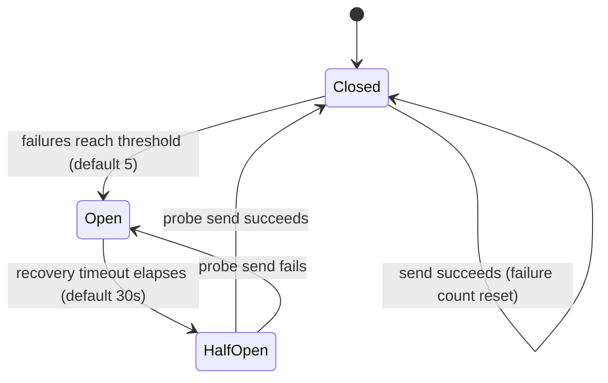
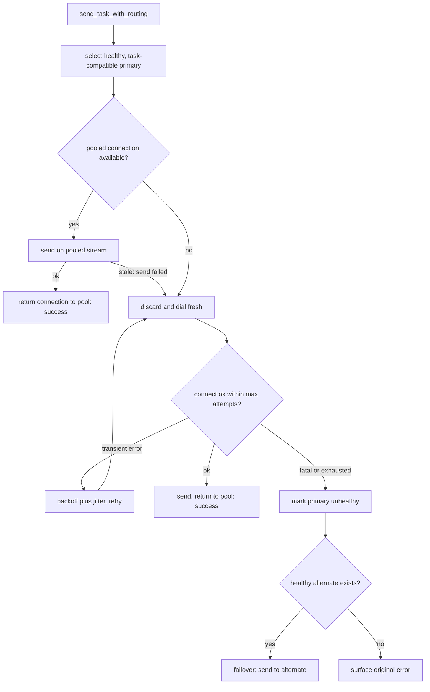

# Inter-Process Communication (IPC)

## Overview

DaemonEye uses a secure, high-performance IPC system to coordinate between its three components (`procmond`, `daemoneye-agent`, and `daemoneye-cli`). The IPC layer provides reliable cross-platform communication using native OS primitives while maintaining strict security boundaries.

## Transport Architecture

The IPC system is built on the `interprocess` crate, which provides a unified interface for local inter-process communication across different operating systems:

- **Transport**: Cross-platform local sockets via `interprocess::local_socket`
- **Protocol**: Protocol Buffers with CRC32 integrity validation
- **Framing**: Length-delimited frames with error detection
- **Security**: Platform-appropriate permissions and connection limiting
- **Integration**: Full async/await support with Tokio runtime

## Platform-Specific Transports

DaemonEye automatically selects the optimal IPC transport for each platform:

- **Linux/macOS**: Unix domain sockets for maximum performance and security
- **Windows**: Named pipes with appropriate security descriptors
- **All Platforms**: Identical API and behavior regardless of underlying transport

## Protocol Design

### Message Framing

Each IPC message uses a simple, robust framing protocol:

```text
[Length: u32][CRC32: u32][Protobuf Message: N bytes]
```

- **Length Field**: Message size in bytes (little-endian)
- **CRC32 Checksum**: Integrity validation of message content
- **Message Payload**: Protocol Buffer-encoded data

### Security Features

- **Local-only**: No network exposure - all communication is local to the host
- **Permission Control**: Unix sockets use 0600 permissions (owner-only access)
- **Connection Limits**: Configurable maximum concurrent connections
- **Input Validation**: All messages validated before processing
- **Resource Limits**: Configurable frame size limits prevent DoS attacks

## Configuration

The IPC system is configured through the `IpcConfig` structure:

```rust,ignore
pub struct IpcConfig {
    pub endpoint_path: String,
    pub max_frame_bytes: usize,
    pub read_timeout_ms: u64,
    pub write_timeout_ms: u64,
    pub max_connections: usize,
    pub crc32_variant: Crc32Variant,
}
```

### Configuration Parameters

- **`endpoint_path`**: Platform-specific IPC endpoint location
- **`max_frame_bytes`**: Maximum message size (default: 1MB)
- **`read_timeout_ms`**: Read operation timeout (default: 30 seconds)
- **`write_timeout_ms`**: Write operation timeout (default: 10 seconds)
- **`max_connections`**: Maximum concurrent connections (default: 16)
- **`crc32_variant`**: Checksum algorithm variant (default: IEEE 802.3)

### Endpoint Configuration

#### Default Paths

- **Unix/macOS**: `/var/run/daemoneye/procmond.sock`
- **Windows**: `\\.\pipe\daemoneye\procmond`

#### Custom Endpoints

You can specify custom endpoints in the configuration:

```yaml
# Example configuration (choose one based on platform)
ipc:
  # Unix/macOS
  endpoint_path: /tmp/custom-daemoneye.sock
  # Windows (alternative)
  # endpoint_path: "\\\\.\\pipe\\custom-daemoneye"
```

#### Endpoint Permissions

- Unix sockets: Directory permissions `0700`, socket permissions `0600`
- Windows named pipes: Restricted to the current user by default
- All platforms: No network access - local communication only

## Error Handling and Reliability

### Connection Management

- **Automatic Reconnection**: Clients automatically reconnect with exponential backoff and jitter. The `ResilientIpcClient` retries transient transport errors (`ConnectionRefused`, `ConnectionTimeout`, `ServerNotFound`, `PeerClosed`) up to a configurable maximum (default 10 attempts) with exponential backoff (default base 100ms, max 30s). Fatal errors (`PermissionDenied`, `CircuitBreakerOpen`, `Timeout`, codec errors) short-circuit immediately without retry
- **Circuit Breaker**: Per-endpoint circuit breakers track failure rates and report state through `get_stats()`. Breakers open after a threshold of failures (default 5), preventing connection attempts during a recovery timeout (default 30s). Note: `get_stats()` currently reports `Closed` and `Open` only — the `HalfOpen` recovery probe is evaluated transiently and is not persisted to the reported state, so a recovering breaker closes on its first successful send rather than surfacing `HalfOpen`
- **Connection Pooling**: Healthy connections are returned to the pool after successful sends and reused for subsequent requests to the same endpoint. A reused connection that turns out to be stale (the server closed it) fails the send and transparently falls through to a fresh connection
- **Explicit Failover**: When a send to the primary endpoint fails, the client automatically fails over to an alternate healthy endpoint (if available). Note: each endpoint runs its own bounded reconnect budget, so if both the primary and the failover endpoint are down, worst-case retry time can approach roughly 2× a single endpoint's budget before the original error is surfaced
- **Graceful Degradation**: Components handle IPC failures without crashing
- **Timeout Handling**: Configurable timeouts prevent hanging operations
- **Connection Limiting**: Server-side connection limits prevent resource exhaustion

The reconnection and circuit breaker parameters are configurable via the `with_reconnect_config()` and `with_breaker_config()` builder methods, primarily for testing and tuning scenarios.

> **Note — defaults are reliability-first, not latency-first.** The defaults (10 attempts, 100ms base / 30s max backoff, 5-failure breaker, 30s recovery) favour eventual delivery over fast failure: a send to a persistently-unavailable endpoint can block for tens of seconds before surfacing an error, which is unsuitable for a real-time alerting path with a sub-100ms budget. Latency-sensitive callers should tune the parameters down at construction, for example:
>
> ```rust,ignore
> let client = ResilientIpcClient::new(&config)
>     .with_reconnect_config(2, Duration::from_millis(10), Duration::from_millis(100))
>     .with_breaker_config(3, Duration::from_secs(5));
> ```

The per-endpoint circuit breaker moves through three states, surfaced live via `get_stats()`:



A routed send tries a pooled connection first, recovers a stale one with a fresh bounded reconnect, and fails over to an alternate endpoint only when the primary is exhausted:



### Error Types

The IPC layer provides detailed error information:

```rust,ignore
use std::io;

pub enum IpcError {
    Timeout,                                    // Operation timed out
    TooLarge { size: usize, max_size: usize },  // Message exceeds size limit
    CrcMismatch { expected: u32, actual: u32 }, // Data corruption detected
    Io(io::Error),                              // Underlying I/O error
    Decode(prost::DecodeError),                 // Protobuf decoding error
    Encode(String),                             // Protobuf encoding error
    PeerClosed,                                 // Connection closed by peer
    InvalidLength { length: u32 },              // Invalid message length
    ConnectionRefused { endpoint: String },     // Server refused the connection
    ConnectionTimeout { endpoint: String },     // Connection attempt timed out
    ServerNotFound { endpoint: String },        // Server endpoint could not be resolved
    CircuitBreakerOpen,                         // Circuit breaker is open
    PermissionDenied { endpoint: String },      // Permission denied for endpoint
}
```

## Performance Characteristics

- **Low Latency**: Direct process-to-process communication without network stack
- **High Throughput**: Efficient binary protocol with minimal overhead
- **Memory Efficient**: Zero-copy deserialization where possible
- **Async/Await**: Non-blocking operations with Tokio integration

## Troubleshooting

### Common Issues

1. **Permission Denied**

   - Check socket file/directory permissions
   - Ensure processes run as same user or with appropriate privileges

2. **Connection Refused**

   - Verify the server component (`procmond`) is running
   - Check endpoint path configuration matches between components

3. **Timeout Errors**

   - Increase timeout values in configuration if needed
   - Check system load and process responsiveness

### Diagnostic Commands

```bash
# Check IPC status
daemoneye-cli health-check --verbose

# Verify endpoint accessibility
ls -la /var/run/daemoneye/  # Unix/macOS

# Test IPC connectivity
daemoneye-cli ipc test
```
