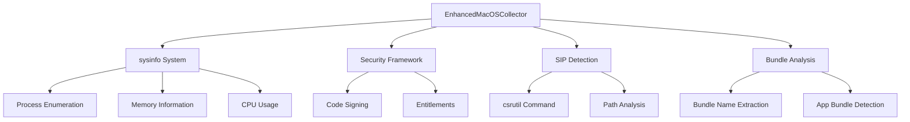

# macOS Process Collector

## Overview

The macOS Process Collector provides enhanced process monitoring capabilities specifically designed for macOS systems. It leverages well-maintained third-party crates to deliver comprehensive process metadata collection, security analysis, and system integration while maintaining safety and accuracy.

## Key Features

### Enhanced Third-Party Crate Integration

The macOS collector uses a carefully selected set of third-party crates instead of direct system calls:

- **`sysinfo`** - Cross-platform process enumeration with macOS optimizations
- **`security-framework`** - macOS Security framework integration for code signing and entitlements
- **`core-foundation`** - Core Foundation API access for system integration
- **`mac-sys-info`** - System information and SIP (System Integrity Protection) awareness

### Safety and Reliability

- **No unsafe code** - All operations use safe Rust abstractions
- **Graceful error handling** - Comprehensive error handling with structured error types
- **Graceful degradation** - Continues with reduced functionality when APIs are unavailable
- **Sandboxing support** - Handles macOS app sandboxing restrictions properly

## Core Capabilities

### Process Enumeration

The collector provides comprehensive process enumeration with macOS-specific enhancements:

```rust
use procmond::macos_collector::{EnhancedMacOSCollector, MacOSCollectorConfig};
use procmond::process_collector::ProcessCollectionConfig;

async fn example_macos_collection() -> Result<(), Box<dyn std::error::Error>> {
    let base_config = ProcessCollectionConfig::default();
    let macos_config = MacOSCollectorConfig {
        collect_entitlements: true,
        check_sip_protection: true,
        collect_code_signing: true,
        collect_bundle_info: true,
        handle_sandboxed_processes: true,
    };

    let collector = EnhancedMacOSCollector::new(base_config, macos_config)?;
    let (events, stats) = collector.collect_processes().await?;
    Ok(())
}
```

### Security Analysis

#### Entitlements Detection

The collector analyzes process entitlements using path-based heuristics and Security framework integration:

- **System processes** (`/System/`, `/usr/`) - Typically have system access, not sandboxed
- **App bundles** (`.app/`) - Usually sandboxed with limited filesystem access
- **Other executables** - Minimal entitlements assumed

#### Code Signing Validation

Determines code signing status based on process characteristics:

- **System processes and app bundles** - Assumed to be signed (typically by Apple)
- **Other executables** - May be unsigned
- **Certificate validation** - Basic validation through Security framework

#### System Integrity Protection (SIP)

Detects SIP status and identifies SIP-protected processes:

- **SIP detection** - Uses `csrutil status` command with fallback
- **Protected paths** - Identifies processes in SIP-protected locations
- **Safe defaults** - Assumes SIP enabled for security

### Process Metadata Collection

#### Basic Information

- Process ID (PID) and parent PID (PPID)
- Process name and executable path
- Command line arguments
- Start time and collection timestamp
- User ID and accessibility status

#### Enhanced Metadata

- CPU usage percentage
- Memory usage (resident and virtual)
- Memory footprint analysis
- Process architecture detection
- Bundle information extraction

#### macOS-Specific Attributes

- Entitlements analysis (debugging, system access, sandboxing)
- SIP protection status
- Code signing information
- Bundle metadata (name, version, bundle ID)
- Hardened runtime detection

## Configuration Options

### MacOSCollectorConfig

```rust
pub struct MacOSCollectorConfig {
    /// Whether to collect process entitlements information
    pub collect_entitlements: bool,
    /// Whether to check SIP protection status
    pub check_sip_protection: bool,
    /// Whether to collect code signing information
    pub collect_code_signing: bool,
    /// Whether to collect bundle information
    pub collect_bundle_info: bool,
    /// Whether to handle sandboxed processes gracefully
    pub handle_sandboxed_processes: bool,
}
```

### Default Configuration

```rust
impl Default for MacOSCollectorConfig {
    fn default() -> Self {
        Self {
            collect_entitlements: true,
            check_sip_protection: true,
            collect_code_signing: true,
            collect_bundle_info: true,
            handle_sandboxed_processes: true,
        }
    }
}
```

## Architecture

### Component Structure



### Data Flow

1. **System Refresh** - `sysinfo` refreshes process list
2. **Process Enhancement** - Each process gets enhanced with macOS-specific metadata
3. **Security Analysis** - Entitlements, code signing, and SIP status determined
4. **Bundle Processing** - App bundle information extracted
5. **Event Generation** - ProcessEvent objects created with comprehensive metadata

## Error Handling

### Structured Error Types

```rust
#[derive(Debug, Error)]
pub enum MacOSCollectionError {
    #[error("Security framework error: {0}")]
    SecurityFramework(String),

    #[error("System information error: {0}")]
    SystemInfo(String),

    #[error("Process filesystem error: {0}")]
    ProcessFs(String),

    #[error("Core Foundation error: {0}")]
    CoreFoundation(String),
}
```

### Graceful Degradation

The collector handles various failure scenarios gracefully:

- **Security framework unavailable** - Falls back to path-based heuristics
- **SIP detection failure** - Assumes SIP enabled for security
- **Process access denied** - Continues with available processes
- **Sandboxing restrictions** - Handles limited access scenarios

## Performance Characteristics

### Target Metrics

- **Process enumeration** - < 5 seconds for 10,000+ processes
- **Memory usage** - < 100MB during collection
- **CPU overhead** - < 5% sustained during monitoring
- **Collection rate** - > 1,000 processes per second

### Optimization Features

- **Efficient process lookup** - Optimized sysinfo usage
- **Minimal API calls** - Reduces system call overhead
- **Batch processing** - Processes multiple items efficiently
- **Resource cleanup** - Proper resource management

## Integration with DaemonEye

### ProcessCollector Trait

The macOS collector implements the standard `ProcessCollector` trait:

```rust
#[async_trait]
impl ProcessCollector for EnhancedMacOSCollector {
    fn name(&self) -> &'static str {
        "enhanced-macos-collector"
    }

    fn capabilities(&self) -> ProcessCollectorCapabilities {
        ProcessCollectorCapabilities {
            basic_info: true,
            enhanced_metadata: true,
            executable_hashing: false, // Future enhancement
            system_processes: true,
            kernel_threads: false, // macOS doesn't have kernel threads like Linux
            realtime_collection: true,
        }
    }

    async fn collect_processes(
        &self,
    ) -> ProcessCollectionResult<(Vec<ProcessEvent>, CollectionStats)>;
    async fn collect_process(&self, pid: u32) -> ProcessCollectionResult<ProcessEvent>;
    async fn health_check(&self) -> ProcessCollectionResult<()>;
}
```

### Event Generation

ProcessEvent objects include comprehensive macOS-specific information:

```rust
use std::time::SystemTime;

fn example_process_event() -> ProcessEvent {
    ProcessEvent {
        pid: 1234,
        ppid: Some(1),
        name: "Safari".to_string(),
        executable_path: Some("/Applications/Safari.app/Contents/MacOS/Safari".to_string()),
        command_line: vec!["Safari".to_string()],
        start_time: Some(SystemTime::now()),
        cpu_usage: Some(5.0),
        memory_usage: Some(1024 * 1024),
        executable_hash: None, // Future enhancement
        user_id: Some("501".to_string()),
        accessible: true,
        file_exists: true,
        timestamp: SystemTime::now(),
    }
}
```

## Testing and Validation

### Comprehensive Test Suite

The macOS collector includes extensive testing:

#### Unit Tests

- Collector creation and configuration
- Health check functionality
- Process collection with various configurations
- Error handling for edge cases

#### Integration Tests

- Cross-platform compatibility
- Security framework capability detection
- SIP status detection
- Enhanced metadata collection
- Graceful degradation scenarios

#### Property-Based Tests

- Process enumeration correctness
- Metadata consistency
- Error handling robustness

### Example Test

```rust
#[tokio::test]
async fn test_enhanced_macos_collector_collect_processes() {
    let base_config = ProcessCollectionConfig {
        max_processes: 10,
        collect_enhanced_metadata: true,
        ..Default::default()
    };
    let macos_config = MacOSCollectorConfig::default();

    let collector = EnhancedMacOSCollector::new(base_config, macos_config).unwrap();
    let result = collector.collect_processes().await;

    assert!(result.is_ok(), "Process collection should succeed");
    let (events, stats) = result.unwrap();
    assert!(!events.is_empty(), "Should collect at least one process");
    assert!(
        stats.successful_collections > 0,
        "Should successfully collect some processes"
    );
}
```

## Deployment Considerations

### System Requirements

- **macOS version** - macOS 12.0+ (Monterey) recommended
- **Architecture** - x86_64 and ARM64 (Apple Silicon) supported
- **Permissions** - Standard user permissions sufficient for most operations

### Security Considerations

- **Privilege separation** - Runs with minimal required privileges
- **SIP compliance** - Respects System Integrity Protection
- **Sandboxing** - Handles app sandboxing restrictions
- **Code signing** - Compatible with macOS code signing requirements

### Performance Tuning

- **Collection frequency** - Adjust based on monitoring requirements
- **Process limits** - Configure maximum processes for large systems
- **Metadata collection** - Enable/disable features based on needs

## Future Enhancements

### Planned Features

- **Executable hashing** - SHA-256 hash computation for executables
- **Enhanced entitlements** - More detailed entitlements parsing
- **Bundle metadata** - Complete Info.plist parsing
- **Network correlation** - Process-to-network event correlation

### Security Framework Integration

- **Advanced code signing** - Detailed certificate chain validation
- **Keychain integration** - Certificate and key information
- **Notarization status** - Apple notarization verification

### Performance Improvements

- **Caching strategies** - Process metadata caching
- **Incremental updates** - Delta-based process monitoring
- **Parallel processing** - Concurrent metadata collection

## Troubleshooting

### Common Issues

#### Security Framework Not Available

```
Error: Security framework error: Framework not found
```

**Solution**: Ensure running on macOS with Security framework available. The collector will fall back to heuristics.

#### SIP Detection Failure

```
Error: Failed to execute csrutil command
```

**Solution**: SIP detection will default to enabled for security. This is expected behavior.

#### Process Access Denied

```
Error: Access denied for process 1234
```

**Solution**: Some processes may be inaccessible due to sandboxing or permissions. This is handled gracefully.

### Debug Configuration

Enable detailed logging for troubleshooting:

```rust
fn setup_debug_logging() -> Result<(), Box<dyn std::error::Error>> {
    let collector = EnhancedMacOSCollector::new(base_config, macos_config)?;
    // Enable debug logging
    tracing::subscriber::set_global_default(
        tracing_subscriber::fmt()
            .with_max_level(tracing::Level::DEBUG)
            .finish(),
    )?;
    Ok(())
}
```

## Conclusion

The macOS Process Collector provides a robust, safe, and comprehensive solution for process monitoring on macOS systems. By leveraging well-maintained third-party crates and implementing proper error handling, it delivers reliable process intelligence while respecting macOS security boundaries and system restrictions.

Key benefits:

- **Safety first** - No unsafe code, comprehensive error handling
- **macOS native** - Leverages macOS-specific features and APIs
- **Performance optimized** - Efficient collection with minimal overhead
- **Future ready** - Extensible architecture for new capabilities
