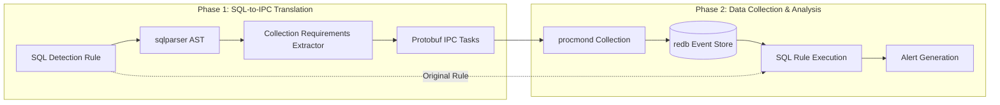

# Query Pipeline and SQL Dialect

## Overview

DaemonEye implements a sophisticated **SQL-to-IPC Translation** pipeline that allows operators to write complex SQL detection rules while maintaining strict security boundaries and optimal performance. This document explains how the query pipeline works and the limitations of the supported SQL dialect.

## Query Pipeline Architecture

DaemonEye's query processing follows a two-phase approach:



### Phase 1: SQL-to-IPC Translation

1. **SQL Parsing**: User-written SQL detection rules are parsed using the `sqlparser` crate
2. **AST Analysis**: The Abstract Syntax Tree is analyzed to extract collection requirements
3. **Task Generation**: Simple protobuf collection tasks are generated for procmond
4. **Overcollection Strategy**: procmond may collect more data than strictly needed to ensure comprehensive detection

### Phase 2: Data Collection & Analysis

1. **Process Collection**: procmond executes the protobuf tasks to collect process data
2. **Data Storage**: Collected data is stored in the redb event store
3. **SQL Execution**: The original SQL rule is executed against the collected data
4. **Alert Generation**: Detection results trigger alert generation and delivery

## Supported SQL Dialect

DaemonEye supports a **restricted SQL dialect** optimized for process monitoring and security. The dialect is based on SQLite syntax with specific limitations and extensions.

### Allowed SQL Constructs

#### Basic Queries

```sql
-- Simple SELECT queries
SELECT * FROM processes WHERE name = 'suspicious-process';

-- Aggregations
SELECT COUNT(*) as process_count, name
FROM processes
GROUP BY name
HAVING COUNT(*) > 10;

-- Joins (when applicable)
SELECT p.name, p.pid, s.start_time
FROM processes p
JOIN scans s ON p.scan_id = s.id;
```

#### Supported Functions

**String Functions** (useful for process data analysis):

```sql
-- String length analysis
SELECT name, LENGTH(command_line) as cmd_length
FROM processes
WHERE LENGTH(command_line) > 100;

-- Substring extraction
SELECT name, SUBSTR(executable_path, 1, 10) as path_prefix
FROM processes
WHERE executable_path IS NOT NULL;

-- Pattern matching
SELECT * FROM processes
WHERE name LIKE '%suspicious%'
   OR executable_path LIKE '/tmp/%';

-- String search
SELECT * FROM processes
WHERE INSTR(command_line, 'malicious') > 0;
```

**Encoding Functions** (useful for hash analysis):

```sql
-- Hexadecimal encoding/decoding
SELECT name, HEX(executable_hash) as hash_hex
FROM processes
WHERE executable_hash IS NOT NULL;

-- Binary data analysis
SELECT name, UNHEX(executable_hash) as hash_binary
FROM processes
WHERE LENGTH(executable_hash) = 64; -- SHA-256 length
```

**Mathematical Functions**:

```sql
-- Numeric analysis
SELECT name, cpu_usage, memory_usage
FROM processes
WHERE cpu_usage > 50.0
   OR memory_usage > 1073741824; -- 1GB
```

### Banned SQL Constructs

#### Security-Critical Functions

```sql
-- These functions are banned for security reasons:
-- load_extension() - SQLite extension loading
-- eval() - Code evaluation
-- exec() - Command execution
-- system() - System calls
-- shell() - Shell execution
```

#### File System Operations

```sql
-- These functions are not applicable to process monitoring:
-- readfile() - File reading
-- writefile() - File writing
-- edit() - File editing
```

#### Complex Pattern Matching

```sql
-- These functions are complex to translate to IPC tasks:
-- glob() - Glob patterns
-- regexp() - Regular expressions (performance concerns)
-- match() - Pattern matching
```

#### Mathematical Functions (Not Applicable)

```sql
-- These functions are not useful for process monitoring:
-- abs() - Absolute value
-- random() - Random numbers
-- randomblob() - Random binary data
```

#### Formatting Functions (Not Applicable)

```sql
-- These functions are not useful for process monitoring:
-- quote() - SQL quoting
-- printf() - String formatting
-- format() - String formatting
-- char() - Character conversion
-- unicode() - Unicode functions
-- soundex() - Soundex algorithm
-- difference() - String difference
```

## Process Data Schema

The `processes` table contains comprehensive process information:

```sql
-- Core process information
CREATE TABLE processes (
    id INTEGER PRIMARY KEY,
    scan_id INTEGER NOT NULL,
    collection_time INTEGER NOT NULL,
    pid INTEGER NOT NULL,
    ppid INTEGER,
    name TEXT NOT NULL,
    executable_path TEXT,
    command_line TEXT,
    start_time INTEGER,
    cpu_usage REAL,
    memory_usage INTEGER,
    status TEXT,
    executable_hash TEXT,        -- SHA-256 hash in hex format
    hash_algorithm TEXT,         -- Usually 'sha256'
    user_id INTEGER,
    group_id INTEGER,
    accessible BOOLEAN,
    file_exists BOOLEAN,
    environment_vars TEXT,        -- JSON string of environment variables
    metadata TEXT,               -- JSON string of additional metadata
    platform_data TEXT          -- JSON string of platform-specific data
);
```

## Example Detection Rules

### Basic Process Monitoring

```sql
-- Detect processes with suspicious names
SELECT pid, name, executable_path, command_line
FROM processes
WHERE name LIKE '%suspicious%'
   OR name LIKE '%malware%'
   OR name LIKE '%backdoor%';
```

### Resource Usage Analysis

```sql
-- Detect high resource usage processes
SELECT pid, name, cpu_usage, memory_usage, command_line
FROM processes
WHERE cpu_usage > 80.0
   OR memory_usage > 2147483648  -- 2GB
ORDER BY memory_usage DESC;
```

### Hash-Based Detection

```sql
-- Detect processes with known malicious hashes
SELECT pid, name, executable_path, executable_hash
FROM processes
WHERE executable_hash IN (
    'a1b2c3d4e5f6789012345678901234567890abcdef1234567890abcdef',
    'f1e2d3c4b5a6978012345678901234567890abcdef1234567890abcdef'
);
```

### Command Line Analysis

```sql
-- Detect suspicious command line patterns
SELECT pid, name, command_line
FROM processes
WHERE command_line LIKE '%nc -l%'           -- Netcat listener
   OR command_line LIKE '%wget%'            -- Download tools
   OR command_line LIKE '%curl%'            -- Download tools
   OR command_line LIKE '%base64%'          -- Encoding tools
   OR LENGTH(command_line) > 1000;         -- Unusually long commands
```

### Environment Variable Analysis

```sql
-- Detect processes with suspicious environment variables
SELECT pid, name, environment_vars
FROM processes
WHERE environment_vars LIKE '%SUSPICIOUS_VAR%'
   OR environment_vars LIKE '%MALWARE_CONFIG%';
```

### Path-Based Detection

```sql
-- Detect processes running from suspicious locations
SELECT pid, name, executable_path
FROM processes
WHERE executable_path LIKE '/tmp/%'
   OR executable_path LIKE '/var/tmp/%'
   OR executable_path LIKE '/dev/shm/%'
   OR executable_path LIKE '%.exe'         -- Windows executables on Unix
   OR executable_path IS NULL;             -- No executable path
```

## Performance Considerations

### Query Optimization

- **Indexing**: Time-based indexes are automatically created for efficient querying
- **Batch Processing**: Large result sets are processed in batches to prevent memory issues
- **Query Timeouts**: All queries have configurable timeouts to prevent system hangs

### Resource Limits

- **Memory Usage**: Queries are limited to prevent excessive memory consumption
- **CPU Usage**: Complex queries are throttled to maintain system performance
- **Result Size**: Large result sets are paginated to prevent memory exhaustion

## Security Considerations

### SQL Injection Prevention

- **AST Validation**: All SQL is parsed and validated before execution
- **Prepared Statements**: All queries use parameterized statements
- **Function Whitelist**: Only approved functions are allowed
- **Sandboxed Execution**: Queries run in read-only database connections

### Data Privacy

- **Field Masking**: Sensitive fields can be masked in logs and exports
- **Command Line Redaction**: Command lines can be redacted for privacy
- **Access Control**: Database access is restricted by component

## Best Practices

### Writing Effective Detection Rules

1. **Use Specific Patterns**: Avoid overly broad patterns that generate false positives
2. **Leverage Hash Detection**: Use executable hashes for precise malware detection
3. **Combine Multiple Criteria**: Use multiple conditions to reduce false positives
4. **Test Thoroughly**: Validate rules against known good and bad processes

### Performance Optimization

1. **Use Indexes**: Leverage time-based and field-based indexes
2. **Limit Result Sets**: Use LIMIT clauses for large queries
3. **Avoid Complex Joins**: Keep queries simple and focused
4. **Monitor Resource Usage**: Watch for queries that consume excessive resources

### Security Guidelines

1. **Validate Input**: Always validate user-provided SQL fragments
2. **Use Parameterized Queries**: Never concatenate user input into SQL
3. **Review Function Usage**: Ensure only approved functions are used
4. **Monitor Query Performance**: Watch for queries that might indicate attacks

## Troubleshooting

### Common Issues

**Query Syntax Errors**:

- Check SQL syntax against supported dialect
- Ensure all functions are in the allowed list
- Verify table and column names

**Performance Issues**:

- Add appropriate indexes
- Simplify complex queries
- Use LIMIT clauses for large result sets

**Security Violations**:

- Review banned function usage
- Check for SQL injection attempts
- Validate input parameters

### Debugging Queries

```sql
-- Use EXPLAIN to understand query execution
EXPLAIN SELECT * FROM processes WHERE name LIKE '%test%';

-- Check query performance
SELECT COUNT(*) as total_processes FROM processes;
SELECT COUNT(*) as recent_processes FROM processes
WHERE collection_time > (strftime('%s', 'now') - 3600) * 1000;
```

## Future Enhancements

### Planned Features

- **Advanced Pattern Matching**: Support for more complex regex patterns
- **Machine Learning Integration**: ML-based anomaly detection
- **Real-time Streaming**: Support for real-time query execution
- **Query Optimization**: Automatic query optimization and indexing

### Extension Points

- **Custom Functions**: Support for user-defined functions
- **External Data Sources**: Integration with external threat intelligence
- **Advanced Analytics**: Statistical analysis and correlation
- **Visualization**: Query result visualization and dashboards
