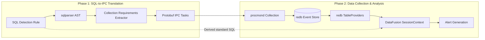

# Query Pipeline and SQL Dialect

## Overview

DaemonEye implements a sophisticated **SQL-to-IPC Translation** pipeline that allows operators to write complex SQL detection rules while maintaining strict security boundaries and optimal performance. This document explains how the query pipeline works and the limitations of the supported SQL dialect.

> **Canonical sources.** This page is an operator-facing overview. The authoritative pipeline specification lives in [`spec/daemon_eye_spec_sql_to_ipc_detection_architecture.md`](https://github.com/EvilBit-Labs/daemoneye/blob/main/spec/daemon_eye_spec_sql_to_ipc_detection_architecture.md) and the detection-engine (SQL-to-IPC, ADR-0006) section of [`.kiro/specs/daemoneye-core-monitoring/design.md`](https://github.com/EvilBit-Labs/daemoneye/blob/main/.kiro/specs/daemoneye-core-monitoring/design.md).

## Query Pipeline Architecture

DaemonEye's query processing follows a two-phase approach:


```mermaid
flowchart LR
    subgraph "Phase 1: SQL-to-IPC Translation"
        SQL[SQL Detection Rule] --> Parser[sqlparser AST]
        Parser --> Extractor[Collection Requirements Extractor]
        Extractor --> IPC[Protobuf IPC Tasks]
    end

    subgraph "Phase 2: Data Collection & Analysis"
        IPC --> Procmond[procmond Collection]
        Procmond --> DB[(redb Event Store)]
        DB --> TP[redb TableProviders]
        TP --> DF[DataFusion SessionContext]
        DF --> Alerts[Alert Generation]
    end

    SQL -.->|Derived standard SQL| DF
```

### Phase 1: SQL-to-IPC Translation

1. **SQL Parsing**: User-written SQL detection rules are parsed using the `sqlparser` crate
2. **AST Analysis**: The Abstract Syntax Tree is analyzed to extract collection requirements
3. **Task Generation**: Simple protobuf collection tasks are generated for procmond
4. **Overcollection Strategy**: procmond may collect more data than strictly needed to ensure comprehensive detection

### Phase 2: Data Collection & Analysis

1. **Process Collection**: procmond executes the protobuf tasks to collect process data and the agent stores it in the redb event store.
2. **Per-cycle evaluation window**: each detection cycle evaluates a rule against the rows that cycle's window covers, the half-open interval `(after_ms, through_ms]` of `collection_time` between the previous cycle's high-water mark and this one's (ADR-0014). Consecutive windows tile the timeline, so a row is evaluated by exactly one cycle and a match is not re-alerted on the next. A window normally falls inside one hourly bucket, and detection reads buckets one at a time (ADR-0008).
3. **SQL Execution**: the **derived standard SQL** (produced by Phase 1 lowering, never the original custom dialect) runs through an Apache DataFusion `SessionContext` whose catalog is populated by redb-backed `TableProvider` implementations (ADR-0006). The providers push filters and projections into redb scans and report them as `Inexact`, so DataFusion always re-checks every row (ADR-0013).
4. **Completeness**: every evaluation and every alert carries a completeness marker, `Complete` or `Degraded` with the reasons (a failed collection or heartbeat, ingest shedding, a sequence gap, a resource limit, the match cap, an execution error). A `Degraded` evaluation with zero matches means the rule could not be fully evaluated, not that nothing matched.
5. **Match cap**: a rule raises at most `detection.max_matches_per_rule` alerts per cycle (default 1,000). The executor stops one match past the cap, keeps the first `cap`, and marks the evaluation `Degraded` with the cap as the reason.
6. **Alert Generation**: results trigger alert generation and delivery.

#### Dialect and extension policy

- `REGEXP` as an infix operator and the `match()`/`regexp()` calls are DaemonEye extensions. They are rewritten to one function before execution.
- A rule may call exactly seven functions: `hex`, `instr`, `length`, `like`, `match`, `regexp`, `unhex`. The executor registers only those, replacing DataFusion's default function set, so a DataFusion function outside the list is not available.
- Every other accepted expression (comparisons, boolean logic, `IN`, `LIKE`, `NULL` handling) uses standard DataFusion SQL semantics unchanged.
- The load-time check covers function-call syntax only. `SUBSTR`, `CAST`, `TRIM`, `POSITION`, `EXTRACT`, `CEIL` and `FLOOR` parse into their own syntax nodes, are accepted at load, and fail at execution. See the [SQL Dialect Reference](sql-dialect-reference.md).

### Sizing the executor

The memory figures below come from `docs/decisions/2026-10-08-t6-full-retention-memory.md`, measured on macos/aarch64 in the release profile. Linux and Windows are unmeasured, and two runs of the same configuration differed by up to 25 MiB, so read each figure as a sample.

**The 100 MiB resident figure is a goal for a deployment sized like the reference host, not a pass/fail gate.** A large, busy server may need more, and a constrained embedded or SCADA endpoint can run leaner. Size these fields to the host.

| Field                                    | Default                | Effect on resident memory                                                                                                                                                                                                                                                                                                                                        |
| ---------------------------------------- | ---------------------- | ---------------------------------------------------------------------------------------------------------------------------------------------------------------------------------------------------------------------------------------------------------------------------------------------------------------------------------------------------------------- |
| `database.page_cache_mb`                 | 32 (range 4-1024)      | The dominant knob. redb's own default is 1 GiB. At that default, peak RSS at 168 buckets was 359 MiB against 207 MiB at 84, so memory tracked the data scanned. At 32 MiB the two overlap at 118-149 MiB. Smaller saves memory and costs scan latency: +14% at 32 MiB and +27% at 4 MiB on the full-retention shape, nothing measurable on the production shape. |
| `detection.executor_target_partitions`   | 4 (range 1-32)         | Lower is smaller. 4 to 2 moved peak RSS from 120-146 to 92-111 MiB at about 1.7x the p50 latency. Decode memory for a cycle is roughly `executor_target_partitions` x 2 x `executor_batch_max_bytes`, and it sits outside `executor_memory_pool_bytes`.                                                                                                          |
| `detection.executor_batch_size`          | 8192 (range 128-65536) | Lower is smaller. 8192 to 2048 moved peak RSS to 100-120 MiB with no p50 cost, the cheaper of the two ways to shrink the full-retention shape. It is also the granularity of the pattern-latency check.                                                                                                                                                          |
| `detection.executor_batch_max_bytes`     | 4 MiB                  | Caps the estimated decoded bytes in one batch, so rows with large command lines close a batch early. It is a term in the decode-memory estimate above.                                                                                                                                                                                                           |
| `detection.executor_memory_pool_bytes`   | 32 MiB                 | A ceiling on what DataFusion reserves, not on what the process holds. The decode memory above is outside it. Too small a pool makes a multi-partition plan fail where a one-partition plan succeeds.                                                                                                                                                             |
| `detection.posting_cache_max_entries`    | 256                    | Count bound on cached posting lists. With `posting_cache_max_postings` (default 1024) the default worst case is 4 MiB. Both at their ceilings (2048 and 4096) reach 128 MiB.                                                                                                                                                                                     |
| `detection.posting_cache_max_postings`   | 1024                   | Longest list retained. A longer list is read live and never cached.                                                                                                                                                                                                                                                                                              |
| `detection.max_matches_per_rule`         | 1,000                  | Bounds the alerts one rule produces per cycle. It limits output, not scan memory.                                                                                                                                                                                                                                                                                |
| `detection.pattern_latency_threshold_ms` | 10                     | A time budget, not a memory setting. A breach disables the rule that owns the pattern.                                                                                                                                                                                                                                                                           |

Two findings stay open.

- **Production shape: inside the goal.** One bucket per cycle, which is what the per-cycle window produces, peaked at about 33 MiB with a p50 of 3.0 ms, at every page cache size tried.
- **Full-retention shape: outside both.** A window spanning 84 to 168 buckets reached 118-149 MiB RSS with a 132 MiB live footprint and a p50 of 157-164 ms, missing both the memory goal and the 100 ms per-rule latency budget. Production does not run this shape. Ad-hoc wide-window queries and catch-up after an outage can.

## Supported SQL Dialect

DaemonEye supports a **restricted SQL dialect** optimized for process monitoring and security. The dialect is based on SQLite syntax with specific limitations and extensions.

### Allowed SQL Constructs

#### Basic Queries

```sql
-- Simple SELECT queries
SELECT * FROM processes WHERE name = 'suspicious-process';

-- Aggregations
SELECT COUNT(*) as process_count, name
FROM processes
GROUP BY name
HAVING COUNT(*) > 10;

-- Self-join on the parent link: a shell spawned by a web server
SELECT child.pid, child.name, parent.name AS parent_name
FROM processes child
JOIN processes parent ON child.ppid = parent.pid
WHERE parent.name = 'httpd' AND child.name IN ('sh', 'bash');
```

#### Supported Functions

**String Functions** (useful for process data analysis):

```sql
-- String length analysis
SELECT name, LENGTH(command_line) as cmd_length
FROM processes
WHERE LENGTH(command_line) > 100;

-- Substring extraction
SELECT name, SUBSTR(executable_path, 1, 10) as path_prefix
FROM processes
WHERE executable_path IS NOT NULL;

-- Pattern matching
SELECT * FROM processes
WHERE name LIKE '%suspicious%'
   OR executable_path LIKE '/tmp/%';

-- String search
SELECT * FROM processes
WHERE INSTR(command_line, 'malicious') > 0;
```

**Encoding Functions** (useful for hash analysis):

```sql
-- Hexadecimal encoding/decoding
SELECT name, HEX(executable_hash) as hash_hex
FROM processes
WHERE executable_hash IS NOT NULL;

-- Binary data analysis
SELECT name, UNHEX(executable_hash) as hash_binary
FROM processes
WHERE LENGTH(executable_hash) = 64; -- SHA-256 length
```

**Mathematical Functions**:

```sql
-- Numeric analysis
SELECT name, cpu_usage, memory_usage
FROM processes
WHERE cpu_usage > 50.0
   OR memory_usage > 1073741824; -- 1GB
```

### Banned SQL Constructs

#### Security-Critical Functions

```sql
-- These functions are banned for security reasons:
-- load_extension() - SQLite extension loading
-- eval() - Code evaluation
-- exec() - Command execution
-- system() - System calls
-- shell() - Shell execution
```

#### File System Operations

```sql
-- These functions are not applicable to process monitoring:
-- readfile() - File reading
-- writefile() - File writing
-- edit() - File editing
```

#### Complex Pattern Matching

```sql
-- These functions are complex to translate to IPC tasks:
-- glob() - Glob patterns
-- regexp() - Regular expressions (performance concerns)
-- match() - Pattern matching
```

#### Mathematical Functions (Not Applicable)

```sql
-- These functions are not useful for process monitoring:
-- abs() - Absolute value
-- random() - Random numbers
-- randomblob() - Random binary data
```

#### Formatting Functions (Not Applicable)

```sql
-- These functions are not useful for process monitoring:
-- quote() - SQL quoting
-- printf() - String formatting
-- format() - String formatting
-- char() - Character conversion
-- unicode() - Unicode functions
-- soundex() - Soundex algorithm
-- difference() - String difference
```

## Process Data Schema

> **Illustrative simplification.** The single flat `processes` table below is a teaching aid for the available columns, not the literal storage layout. DaemonEye actually exposes a **namespaced virtual schema** to the DataFusion session — `processes.*` today (procmond), with `network.*` and `filesystem.*` arriving alongside future collectors. Logical table names map 1:1 onto physical redb event tables (e.g. `processes.events`). The authoritative virtual-schema and redb-layout model is specified in [`spec/daemon_eye_spec_sql_to_ipc_detection_architecture.md`](https://github.com/EvilBit-Labs/daemoneye/blob/main/spec/daemon_eye_spec_sql_to_ipc_detection_architecture.md) and the detection-engine section of [`.kiro/specs/daemoneye-core-monitoring/design.md`](https://github.com/EvilBit-Labs/daemoneye/blob/main/.kiro/specs/daemoneye-core-monitoring/design.md).

The `processes` namespace contains comprehensive process information:

```sql
-- Core process information (illustrative; see virtual-schema model above)
CREATE TABLE processes (
    pid INTEGER NOT NULL,         -- unsigned
    ppid INTEGER,                 -- unsigned
    name TEXT NOT NULL,
    executable_path TEXT,
    command_line TEXT,
    start_time INTEGER,
    cpu_usage REAL,
    memory_usage INTEGER,         -- unsigned
    executable_hash TEXT,         -- SHA-256 hash in hex format
    user_id TEXT,
    accessible BOOLEAN NOT NULL,
    file_exists BOOLEAN NOT NULL,
    collection_time INTEGER NOT NULL
);
```

## Example Detection Rules

### Basic Process Monitoring

```sql
-- Detect processes with suspicious names
SELECT pid, name, executable_path, command_line
FROM processes
WHERE name LIKE '%suspicious%'
   OR name LIKE '%malware%'
   OR name LIKE '%backdoor%';
```

### Resource Usage Analysis

```sql
-- Detect high resource usage processes
SELECT pid, name, cpu_usage, memory_usage, command_line
FROM processes
WHERE cpu_usage > 80.0
   OR memory_usage > 2147483648  -- 2GB
ORDER BY memory_usage DESC;
```

### Hash-Based Detection

```sql
-- Detect processes with known malicious hashes
SELECT pid, name, executable_path, executable_hash
FROM processes
WHERE executable_hash IN (
    'a1b2c3d4e5f6789012345678901234567890abcdef1234567890abcdef',
    'f1e2d3c4b5a6978012345678901234567890abcdef1234567890abcdef'
);
```

### Command Line Analysis

```sql
-- Detect suspicious command line patterns
SELECT pid, name, command_line
FROM processes
WHERE command_line LIKE '%nc -l%'           -- Netcat listener
   OR command_line LIKE '%wget%'            -- Download tools
   OR command_line LIKE '%curl%'            -- Download tools
   OR command_line LIKE '%base64%'          -- Encoding tools
   OR LENGTH(command_line) > 1000;         -- Unusually long commands
```

### Argument Analysis

```sql
-- Detect a credential-dumping flag passed on the command line
SELECT pid, name, command_line
FROM processes
WHERE command_line LIKE '%--password%'
   OR command_line LIKE '%sekurlsa%';
```

### Path-Based Detection

```sql
-- Detect processes running from suspicious locations
SELECT pid, name, executable_path
FROM processes
WHERE executable_path LIKE '/tmp/%'
   OR executable_path LIKE '/var/tmp/%'
   OR executable_path LIKE '/dev/shm/%'
   OR executable_path LIKE '%.exe'         -- Windows executables on Unix
   OR executable_path IS NULL;             -- No executable path
```

## Performance Considerations

### Query Optimization

- **Indexing**: Time-based indexes are automatically created for efficient querying
- **Batch Processing**: Large result sets are processed in batches to prevent memory issues
- **Query Timeouts**: All queries have configurable timeouts to prevent system hangs

### Resource Limits

- **Memory Usage**: Queries are limited to prevent excessive memory consumption
- **CPU Usage**: Complex queries are throttled to maintain system performance
- **Result Size**: Large result sets are paginated to prevent memory exhaustion

## Security Considerations

### SQL Injection Prevention

- **AST Validation**: All SQL is parsed and validated before execution
- **Prepared Statements**: All queries use parameterized statements
- **Function Whitelist**: Only approved functions are allowed
- **Sandboxed Execution**: Queries run in read-only database connections

### Data Privacy

- **Field Masking**: Sensitive fields can be masked in logs and exports
- **Command Line Redaction**: Command lines can be redacted for privacy
- **Access Control**: Database access is restricted by component

## Best Practices

### Writing Effective Detection Rules

1. **Use Specific Patterns**: Avoid overly broad patterns that generate false positives
2. **Leverage Hash Detection**: Use executable hashes for precise malware detection
3. **Combine Multiple Criteria**: Use multiple conditions to reduce false positives
4. **Test Thoroughly**: Validate rules against known good and bad processes

### Performance Optimization

1. **Use Indexes**: Leverage time-based and field-based indexes
2. **Limit Result Sets**: Use LIMIT clauses for large queries
3. **Avoid Complex Joins**: Keep queries simple and focused
4. **Monitor Resource Usage**: Watch for queries that consume excessive resources

### Security Guidelines

1. **Validate Input**: Always validate user-provided SQL fragments
2. **Use Parameterized Queries**: Never concatenate user input into SQL
3. **Review Function Usage**: Ensure only approved functions are used
4. **Monitor Query Performance**: Watch for queries that might indicate attacks

## Troubleshooting

### Common Issues

**Query Syntax Errors**:

- Check SQL syntax against supported dialect
- Ensure all functions are in the allowed list
- Verify table and column names

**Performance Issues**:

- Add appropriate indexes
- Simplify complex queries
- Use LIMIT clauses for large result sets

**Security Violations**:

- Review banned function usage
- Check for SQL injection attempts
- Validate input parameters

### Debugging Queries

```sql
-- Use EXPLAIN to understand query execution
EXPLAIN SELECT * FROM processes WHERE name LIKE '%test%';

-- Check query performance
SELECT COUNT(*) as total_processes FROM processes;
SELECT COUNT(*) as recent_processes FROM processes
WHERE collection_time > (strftime('%s', 'now') - 3600) * 1000;
```

## Future Enhancements

### Planned Features

- **Advanced Pattern Matching**: Support for more complex regex patterns
- **Machine Learning Integration**: ML-based anomaly detection
- **Real-time Streaming**: Support for real-time query execution
- **Query Optimization**: Automatic query optimization and indexing

### Extension Points

- **Custom Functions**: Support for user-defined functions
- **External Data Sources**: Integration with external threat intelligence
- **Advanced Analytics**: Statistical analysis and correlation
- **Visualization**: Query result visualization and dashboards
