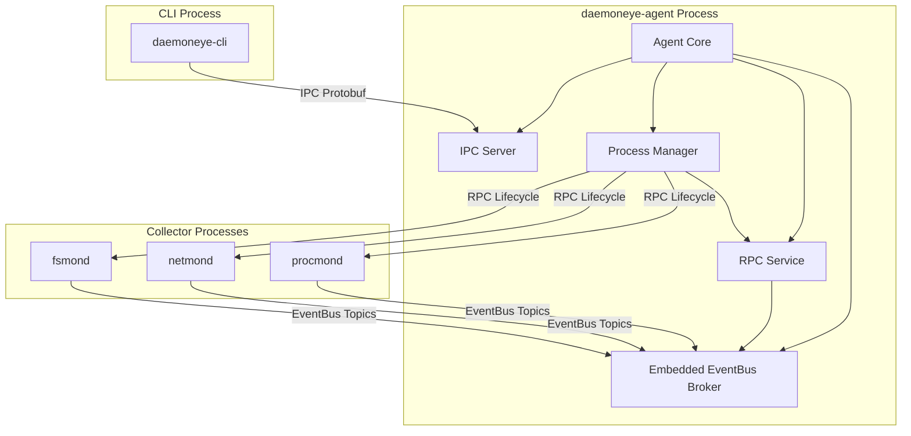

# RPC and EventBus Architecture

This document describes the RPC (Remote Procedure Call) and EventBus architecture that enables multi-collector coordination and lifecycle management in DaemonEye.

## Overview

DaemonEye uses a dual-protocol architecture for inter-component communication:

1. **IPC Protocol**: Protobuf over Unix sockets/named pipes for CLI-to-agent communication
2. **EventBus Protocol**: Topic-based pub/sub messaging for collector-to-agent coordination

The daemoneye-agent runs an embedded EventBus broker that provides:

- Topic-based message routing with wildcard patterns
- RPC patterns for collector lifecycle management
- Correlation metadata for distributed tracing
- Health monitoring and metrics collection

## Architecture Diagram



## EventBus Topic Hierarchy

The EventBus uses a hierarchical topic structure for message routing:

### Event Topics

- `events.process.*` - Process monitoring events

  - `events.process.lifecycle` - Process start/stop events
  - `events.process.metadata` - Process metadata updates
  - `events.process.tree` - Process tree relationships
  - `events.process.integrity` - Executable integrity events
  - `events.process.anomaly` - Anomaly detection events
  - `events.process.batch` - Batch process updates

- `events.network.*` - Network monitoring events (future)

- `events.filesystem.*` - Filesystem monitoring events (future)

- `events.performance.*` - Performance monitoring events (future)

### Control Topics

- `control.collector.*` - Collector management

  - `control.collector.lifecycle` - Start/stop/restart commands
  - `control.collector.config` - Configuration updates
  - `control.collector.task` - Task distribution

- `control.health.*` - Health monitoring

  - `control.health.heartbeat` - Heartbeat messages
  - `control.health.status` - Status reports
  - `control.health.diagnostics` - Diagnostic information

### Wildcard Patterns

The EventBus supports two wildcard patterns:

- `+` - Single-level wildcard (e.g., `events.process.+` matches `events.process.lifecycle`)
- `#` - Multi-level wildcard (e.g., `events.#` matches all event topics)

## RPC Patterns

### Collector Lifecycle Operations

The RPC service provides structured request/response patterns for collector management:

#### Start Collector

```rust,ignore
use daemoneye_eventbus::rpc::{CollectorRpcClient, CollectorLifecycleRequest, RpcRequest, CollectorOperation};
use std::time::Duration;

let request = RpcRequest::lifecycle(
    "agent-id".to_string(),
    "control.collector.procmond".to_string(),
    CollectorOperation::Start,
    CollectorLifecycleRequest::start("procmond", None),
    Duration::from_secs(30)
);

let response = rpc_client.call(request, Duration::from_secs(30)).await?;
```

#### Stop Collector

```rust,ignore
let request = RpcRequest::lifecycle(
    "agent-id".to_string(),
    "control.collector.procmond".to_string(),
    CollectorOperation::Stop,
    CollectorLifecycleRequest::stop("procmond", true), // graceful=true
    Duration::from_secs(60)
);

let response = rpc_client.call(request, Duration::from_secs(60)).await?;
```

#### Health Check

```rust,ignore
let request = RpcRequest::health_check(
    "agent-id".to_string(),
    "control.collector.procmond".to_string(),
    Duration::from_secs(10)
);

let response = rpc_client.call(request, Duration::from_secs(10)).await?;
```

### RPC Message Structure

All RPC messages include:

- **Correlation ID**: Unique identifier for request/response matching
- **Timestamp**: Request creation time
- **Timeout**: Maximum execution time
- **Operation**: Type of operation (Start, Stop, Restart, HealthCheck, etc.)
- **Payload**: Operation-specific data

### Error Handling

RPC calls can fail with:

- **Timeout**: Operation exceeded timeout duration
- **NotFound**: Target collector not found
- **InvalidOperation**: Operation not supported
- **ExecutionError**: Operation failed during execution
- **CommunicationError**: Network or transport error

## Correlation Metadata

All EventBus messages include correlation metadata for distributed tracing:

```rust,ignore
pub struct CorrelationMetadata {
    pub correlation_id: String,
    pub parent_correlation_id: Option<String>,
    pub root_correlation_id: String,
    pub sequence_number: u64,
    pub workflow_stage: Option<String>,
    pub tags: HashMap<String, String>,
}
```

This enables:

- Request/response correlation across multiple hops
- Workflow tracking for complex operations
- Forensic analysis of event chains
- Performance profiling of distributed operations

## Multi-Collector Coordination

### Task Distribution

The agent distributes tasks to collectors based on capabilities:

1. Agent receives detection task (e.g., SQL query)
2. Agent determines required collector capabilities
3. Agent publishes task to appropriate topic (e.g., `control.collector.task`)
4. Collectors with matching capabilities receive and execute task
5. Collectors publish results to result topic (e.g., `events.process.batch`)
6. Agent aggregates results and generates alerts

### Result Aggregation

Results from multiple collectors are aggregated using:

- **Correlation IDs**: Match results to original request
- **Sequence Numbers**: Order results from same collector
- **Deduplication**: Remove duplicate results across collectors
- **Timeout Handling**: Handle slow or failed collectors gracefully

### Load Balancing

When multiple instances of the same collector type are available:

- Tasks are distributed round-robin across instances
- Failed instances are detected via health checks
- Tasks are automatically redistributed to healthy instances
- Collectors can advertise capacity limits

## Configuration

### Broker Configuration

```yaml
broker:
  socket_path: /tmp/daemoneye-eventbus.sock
  startup_timeout_seconds: 30
  max_subscribers: 100
  message_buffer_size: 10000
  enable_metrics: true
```

### RPC Configuration

```yaml
rpc:
  default_timeout_seconds: 30
  health_check_interval_seconds: 60
  enable_correlation_tracking: true
  max_pending_requests: 1000
```

### Process Manager Configuration

```yaml
process_manager:
  graceful_shutdown_timeout_seconds: 60
  force_shutdown_timeout_seconds: 5
  health_check_interval_seconds: 120
  enable_auto_restart: true
  max_restart_attempts: 3
  restart_backoff_seconds: 5
```

## Performance Characteristics

### EventBus Throughput

- **Message Rate**: 10,000+ messages/second
- **Latency**: Sub-millisecond for local delivery
- **Memory**: Bounded by message_buffer_size
- **CPU**: \<1% overhead for message routing

### RPC Performance

- **Request Rate**: 1,000+ requests/second
- **Latency**: \<10ms for local RPC calls
- **Timeout Handling**: Configurable per operation
- **Concurrent Requests**: Limited by max_pending_requests

## Security Considerations

### Access Control

- EventBus broker runs within daemoneye-agent process boundary
- Only local processes can connect via Unix sockets/named pipes
- No network exposure of EventBus or RPC services
- Collectors must authenticate via capability negotiation

### Message Validation

- All messages validated against protobuf schema
- Topic patterns validated before subscription
- RPC payloads validated before execution
- Correlation IDs validated for uniqueness

### Resource Limits

- Maximum subscribers per topic
- Maximum message buffer size
- Maximum pending RPC requests
- Timeout enforcement for all operations

## Monitoring and Observability

### Metrics

The EventBus and RPC service expose metrics for:

- Message publish/subscribe rates
- RPC request/response rates
- Error rates by operation type
- Latency histograms
- Active subscriber counts
- Message buffer utilization

### Health Checks

Health checks verify:

- Broker is running and accepting connections
- RPC service is responding to requests
- Collectors are sending heartbeats
- Message buffers are not full
- No excessive error rates

### Logging

Structured logs include:

- Correlation IDs for request tracing
- Operation types and durations
- Error details with context
- Performance metrics
- Resource utilization

## Troubleshooting

### Common Issues

**Broker fails to start**:

- Check socket_path is writable
- Verify no other process using socket
- Check startup_timeout_seconds is sufficient

**RPC timeouts**:

- Increase default_timeout_seconds
- Check collector health status
- Verify network connectivity
- Review collector logs for errors

**Message delivery failures**:

- Check message_buffer_size is sufficient
- Verify subscriber is connected
- Review topic pattern matching
- Check for backpressure conditions

**Collector not receiving tasks**:

- Verify collector capabilities match task requirements
- Check topic subscription patterns
- Review correlation IDs for matching
- Verify collector is registered with broker

## Future Enhancements

- **Federation**: Multi-agent coordination across network
- **Persistence**: Message persistence for reliability
- **Compression**: Message compression for large payloads
- **Encryption**: End-to-end encryption for sensitive data
- **Rate Limiting**: Per-subscriber rate limiting
- **Priority Queues**: Priority-based message delivery
