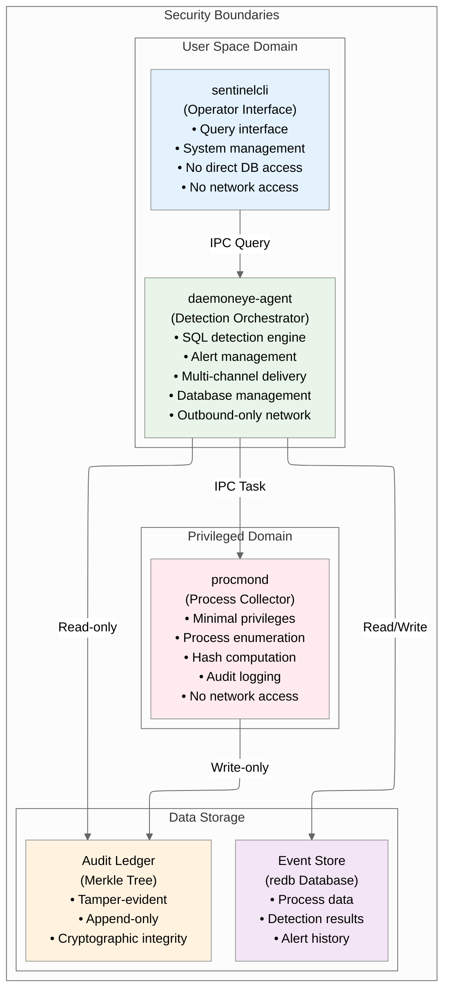

# DaemonEye Security Design Overview

## Executive Summary

DaemonEye is a security-focused, high-performance process monitoring system designed to provide continuous threat detection and behavioral analysis while maintaining strict security boundaries and audit-grade integrity. The system implements a three-component architecture with privilege separation, cryptographic integrity verification, and comprehensive audit logging to meet enterprise security requirements.

This document provides a comprehensive technical overview of DaemonEye's security design, architecture, and implementation details for security professionals, compliance officers, and system architects responsible for threat detection and incident response capabilities.

---

## Table of Contents

[TOC]

---

## Security Architecture Overview

### Core Security Principles

DaemonEye is built on fundamental security principles that guide every aspect of its design and implementation:

**Principle of Least Privilege**: Each component operates with the minimum privileges required for its specific function, with immediate privilege dropping after initialization.

**Defense in Depth**: Multiple layers of security controls protect against various attack vectors, from memory safety to network isolation.

**Fail-Safe Design**: The system fails securely, maintaining monitoring capabilities even when individual components experience issues.

**Audit-First Approach**: All security-relevant events are cryptographically logged with tamper-evident integrity guarantees.

**Zero Trust Architecture**: No component trusts another without explicit verification, and all communications are authenticated and encrypted.

### Three-Component Security Architecture



### Security Control Matrix

| Security Control            | procmond                | daemoneye-agent         | sentinelcli           | Implementation                     |
| --------------------------- | ----------------------- | --------------------- | --------------------- | ---------------------------------- |
| **Privilege Separation**    | ✅ Elevated (temporary) | ✅ User space         | ✅ User space         | Platform-specific capabilities     |
| **Network Isolation**       | ✅ No network           | ✅ Outbound only      | ✅ No network         | Firewall rules + code restrictions |
| **Memory Safety**           | ✅ Rust + zero unsafe   | ✅ Rust + zero unsafe | ✅ Rust + zero unsafe | Compiler-enforced                  |
| **Input Validation**        | ✅ Protobuf schema      | ✅ SQL AST validation | ✅ CLI validation     | Type-safe parsing                  |
| **Audit Logging**           | ✅ All operations       | ✅ All operations     | ✅ All operations     | Structured JSON + Merkle tree      |
| **Cryptographic Integrity** | ✅ BLAKE3 hashing       | ✅ BLAKE3 hashing     | ✅ BLAKE3 hashing     | Hardware-accelerated               |
| **Error Handling**          | ✅ Graceful degradation | ✅ Circuit breakers   | ✅ Safe defaults      | Comprehensive error types          |

## Threat Model and Security Boundaries

### Attack Surface Analysis

**Primary Attack Vectors**:

1. **Process Enumeration Attacks**: Attempts to exploit privileged process access
2. **SQL Injection**: Malicious detection rules targeting the SQL engine
3. **IPC Communication Attacks**: Exploitation of inter-process communication
4. **Database Tampering**: Attempts to modify stored process data or audit logs
5. **Privilege Escalation**: Exploitation of temporary elevated privileges
6. **Network-based Attacks**: Exploitation of alert delivery channels

### Security Boundary Enforcement

**Process Isolation**:

- procmond runs in isolated process space with minimal privileges
- daemoneye-agent operates in user space with restricted database access
- sentinelcli has no direct system access, only IPC communication

**Network Isolation**:

- procmond: Zero network access (air-gapped)
- daemoneye-agent: Outbound-only connections for alert delivery
- sentinelcli: No network access, local IPC only

**Data Access Controls**:

- Audit ledger: Write-only for procmond, read-only for others
- Event store: Read/write for daemoneye-agent, query-only for sentinelcli
- Configuration: Hierarchical access with validation

### Threat Mitigation Strategies

**Memory Safety**:

- Rust's ownership system prevents buffer overflows and use-after-free
- Zero unsafe code policy with isolated exceptions
- Comprehensive testing including fuzzing and static analysis

**Input Validation**:

- Protobuf schema validation for all IPC messages
- SQL AST parsing with whitelist-based function approval
- CLI argument validation with type safety

**Cryptographic Protection**:

- BLAKE3 hashing for all audit entries
- Merkle tree integrity verification
- Optional Ed25519 signatures for external verification

## Component Security Design

### procmond (Process Collection Component)

**Security Role**: Privileged data collector with minimal attack surface

**Security Features**:

- **Temporary Privilege Escalation**: Requests only required capabilities (CAP_SYS_PTRACE on Linux, SeDebugPrivilege on Windows)[^10]
- **Immediate Privilege Drop**: Drops all elevated privileges after initialization[^11]
- **No Network Access**: Completely air-gapped from network interfaces
- **Minimal Codebase**: Simple, auditable process enumeration logic
- **Cryptographic Hashing**: SHA-256 computation for executable integrity verification[^12]
- **Audit Logging**: All operations logged to tamper-evident audit ledger[^13]

**Security Boundaries**:

```rust
// Example security boundary enforcement
pub struct ProcessCollector {
    privilege_manager: PrivilegeManager,
    hash_computer: SecureHashComputer,
    audit_logger: AuditLogger,
}

impl ProcessCollector {
    pub async fn initialize(&mut self) -> Result<()> {
        // Request minimal required privileges
        self.privilege_manager.request_enhanced_privileges().await?;

        // Perform initialization tasks
        self.setup_process_enumeration().await?;

        // Immediately drop privileges
        self.privilege_manager.drop_privileges().await?;

        // Log privilege drop for audit
        self.audit_logger.log_privilege_drop().await?;

        Ok(())
    }
}
```

### daemoneye-agent (Detection Orchestrator)

**Security Role**: User-space detection engine with network alerting capabilities

**Security Features**:

- **SQL Injection Prevention**: AST-based query validation with whitelist functions[^14]
- **Sandboxed Execution**: Read-only database connections for rule execution[^15]
- **Resource Limits**: Timeout and memory constraints on detection rules[^16]
- **Multi-Channel Alerting**: Circuit breaker pattern for reliable delivery[^17]
- **Audit Trail**: Comprehensive logging of all detection activities[^18]

**SQL Security Implementation**:

- **AST Validation**: Parse SQL queries using AST validation to prevent injection attacks[^14]
- **Function Whitelist**: Only allow SELECT statements with approved functions (COUNT, SUM, AVG, MIN, MAX, LENGTH, SUBSTR, datetime functions)[^19]
- **Prepared Statements**: Use prepared statements with read-only database connections[^15]
- **Timeout Protection**: Complete within 30 seconds or timeout with appropriate logging[^16]
- **Audit Logging**: Reject forbidden constructs and log attempts for audit purposes[^18]

```rust
pub struct SqlValidator {
    parser: sqlparser::Parser<sqlparser::dialect::SQLiteDialect>,
    allowed_functions: HashSet<String>,
    forbidden_statements: HashSet<String>,
}

impl SqlValidator {
    pub fn validate_query(&self, sql: &str) -> Result<ValidationResult> {
        let ast = self.parser.parse_sql(sql)?;

        for statement in &ast {
            match statement {
                Statement::Query(query) => {
                    // Only allow SELECT statements
                    self.validate_select_query(query)?;
                }
                _ => return Err(ValidationError::ForbiddenStatement),
            }
        }

        // Validate function whitelist
        self.validate_function_usage(&ast)?;

        Ok(ValidationResult::Valid)
    }
}
```

### sentinelcli (Operator Interface)

**Security Role**: Secure query interface with no direct system access

**Security Features**:

- **No Direct Database Access**: All queries routed through daemoneye-agent
- **Input Sanitization**: Comprehensive validation of all user inputs
- **Safe SQL Execution**: Prepared statements with parameter binding[^20]
- **Output Formats**: Support JSON, human-readable table, and CSV output[^21]
- **Rule Management**: List, validate, test, and import/export detection rules[^22]
- **Health Monitoring**: Display component status with color-coded indicators[^23]
- **Large Dataset Support**: Streaming and pagination for result sets[^24]
- **Audit Logging**: All queries and operations logged

## Cryptographic Security Framework

### Hash Function Selection

**BLAKE3 for Audit Integrity**:

- **Security**: 256-bit security level with resistance to length extension attacks
- **Hardware Acceleration**: Optimized implementations available
- **Deterministic**: Consistent output across platforms and implementations
- **Requirements**: Specified for audit ledger hash computation[^25]

**SHA-256 for Executable Hashing**:

- **Industry Standard**: Widely recognized and trusted
- **Compatibility**: Integrates with existing security tools and databases
- **Verification**: Easy integration with external verification systems
- **Requirements**: Specified for executable file integrity verification[^12]

**FIPS 140-2 Compliance**:

- **FIPS 140-2 Level 1**: Software-based cryptographic module
- **Approved Algorithms**: SHA-256, BLAKE3 (when approved), Ed25519
- **Key Management**: FIPS-approved key generation and storage
- **Cryptographic Module Validation**: CMVP validation support
- **Algorithm Implementation**: FIPS-approved cryptographic implementations

**Common Criteria Evaluation**:

- **Target of Evaluation (TOE)**: DaemonEye security monitoring system
- **Security Target (ST)**: Comprehensive security requirements documentation
- **Evaluation Assurance Level (EAL)**: EAL4+ evaluation support
- **Protection Profile**: Custom protection profile development
- **Security Functional Requirements**: SFR implementation and testing

### Merkle Tree Audit Ledger

**Cryptographic Properties**:

- **Tamper Evidence**: Any modification to historical entries invalidates the entire chain[^26]
- **Inclusion Proofs**: Cryptographic proof that specific entries exist in the ledger[^26]
- **Checkpoint Signatures**: Optional Ed25519 signatures for external verification
- **Forward Security**: New entries don't compromise historical integrity
- **Append-Only**: Monotonic sequence numbers for all entries[^27]
- **BLAKE3 Hashing**: Fast, cryptographically secure hash computation[^25]
- **Millisecond Precision**: Proper ordering and millisecond-precision timestamps[^5]

**Implementation Details**:

```rust
pub struct AuditLedger {
    merkle_tree: MerkleTree<Blake3Hasher>,
    checkpoints: Vec<Checkpoint>,
    signature_key: Option<Ed25519KeyPair>,
}

impl AuditLedger {
    pub fn append_entry(&mut self, entry: AuditEntry) -> Result<InclusionProof> {
        // Canonicalize entry for consistent hashing
        let canonical = self.canonicalize_entry(&entry)?;
        let leaf_hash = Blake3Hasher::hash(&canonical);

        // Insert into Merkle tree
        self.merkle_tree.insert(leaf_hash).commit();

        // Generate inclusion proof
        let proof = self
            .merkle_tree
            .proof(&[self.merkle_tree.leaves().len() - 1]);

        // Optional: Sign checkpoint if threshold reached
        if self.should_create_checkpoint() {
            self.create_signed_checkpoint()?;
        }

        Ok(proof)
    }
}
```

### Key Management

**Key Generation**:

- Ed25519 key pairs generated using secure random number generation
- Keys stored in OS keychain or hardware security modules when available
- Key rotation policies for long-term deployments

**Signature Verification**:

- Public key distribution through secure channels
- Certificate chain validation for enterprise deployments
- Air-gap compatible verification procedures

## Performance and Scalability

### Verified Performance Requirements

**Core Performance Targets**:

- **CPU Usage**: < 5% sustained during continuous monitoring[^1]
- **Process Enumeration**: < 5 seconds for systems with up to 10,000 processes[^2]
- **Detection Rule Timeout**: 30 seconds maximum execution time[^3]
- **Alert Delivery Retry**: Up to 3 attempts with maximum 60-second delay[^4]
- **Audit Timestamps**: Millisecond-precision timestamps[^5]

**Enterprise Performance Targets**:

- **Kernel Event Processing**: Sub-millisecond latency from event occurrence to detection[^6]
- **Fleet Query Response**: < 60 seconds for queries across up to 10,000 endpoints[^7]
- **CPU Overhead**: < 2% per monitored endpoint for 10,000+ processes[^8]
- **Event Processing**: 100,000+ events per minute with sub-second query response[^9]

### Resource Management

**Memory Safety**:

- Rust's ownership system prevents buffer overflows and use-after-free
- Zero unsafe code policy with isolated exceptions
- Comprehensive testing including fuzzing and static analysis

**Concurrency Control**:

- Bounded channels with configurable capacity
- Circuit breaker patterns for external dependencies
- Graceful degradation under resource constraints

## Data Protection and Privacy

### Data Classification

**Core Data Types** (All Tiers):

- **Public Data**: Process names, basic system information
- **Internal Data**: Process metadata, detection rules, configuration
- **Confidential Data**: Command line arguments, file paths, user information
- **Restricted Data**: Cryptographic hashes, audit logs, alert details

**Government Data Classifications** (All Tiers):

DaemonEye supports all standard government data classification levels with appropriate handling controls and access restrictions.

### Privacy Controls

**Data Masking** (All Tiers):

- Configurable redaction of sensitive command line arguments
- Optional anonymization of user identifiers
- Field-level privacy controls for different deployment scenarios

**Retention Policies** (All Tiers):

- Configurable data retention periods for different data types
- Automatic purging of expired data
- Secure deletion procedures for sensitive information

**Access Controls** (All Tiers):

- Role-based access to different data classifications
- Audit logging of all data access
- Principle of least privilege for data access

### Business Tier Data Protection Features

**Centralized Data Management**:

- **Security Center**: Centralized aggregation and management of data from multiple agents
- **mTLS Authentication**: Mutual TLS with certificate chain validation for secure agent connections
- **Certificate Management**: Automated certificate provisioning and rotation
- **Role-Based Access Control**: Granular permissions for different user roles

**Enhanced Data Export**:

- **Standard Format Support**: CEF (Common Event Format), structured JSON, and STIX-lite exports
- **SIEM Integration**: Native connectors for Splunk, Elasticsearch, and Kafka
- **Data Portability**: Comprehensive export capabilities for data migration and analysis

**Code Signing and Integrity**:

- **Signed Installers**: MSI installers for Windows and DMG packages for macOS with valid code signing certificates
- **Enterprise Deployment**: Proper metadata for enterprise deployment tools
- **Security Validation**: Operating system security validation without warnings

### Enterprise Tier Data Protection Features

**Advanced Cryptographic Security**:

- **SLSA Level 3 Provenance**: Complete software supply chain attestation
- **Cosign Signatures**: Hardware security module-backed code signing
- **Software Bill of Materials (SBOM)**: Complete dependency and component inventory
- **Signature Verification**: Mandatory signature verification before execution

**Federated Data Architecture**:

- **Multi-Tier Security Centers**: Hierarchical data aggregation across geographic regions
- **Federated Storage**: Distributed data storage with local and global aggregation
- **Data Sovereignty**: Regional data residency compliance
- **Cross-Region Replication**: Secure data replication with integrity verification

**Advanced Compliance and Threat Intelligence**:

- **STIX/TAXII Integration**: Automated threat intelligence feed consumption and processing
- **Compliance Framework Mappings**: NIST, ISO 27001, CIS framework mappings
- **Quarterly Rule Packs**: Curated threat intelligence updates with automated rule deployment
- **Compliance Reporting**: Automated compliance reporting and evidence collection

**Kernel-Level Data Protection**:

- **Real-Time Event Processing**: Sub-millisecond processing of kernel-level events
- **Network Correlation**: Process-to-network event correlation for lateral movement detection
- **Memory Analysis**: Advanced memory analysis capabilities for sophisticated attack detection
- **Platform-Specific Monitoring**: eBPF (Linux), ETW (Windows), EndpointSecurity (macOS) integration

### Compliance Features

**Core Compliance** (All Tiers):

**GDPR Compliance**:

- Data minimization principles
- Right to erasure implementation
- Data portability features
- Privacy by design architecture

**SOC 2 Type II**:

- Comprehensive audit logging
- Access control documentation
- Incident response procedures
- Regular security assessments

**NIST Cybersecurity Framework**:

- Identify: Asset inventory and risk assessment
- Protect: Access controls and data encryption
- Detect: Continuous monitoring and alerting
- Respond: Incident response and forensics
- Recover: Business continuity and restoration

**Business Tier Compliance Features**:

**Enhanced Audit and Reporting**:

- **Centralized Audit Logs**: Aggregated audit logs from multiple agents
- **Automated Compliance Reporting**: Scheduled compliance reports and dashboards
- **Data Retention Management**: Centralized data retention policy enforcement
- **Audit Trail Integrity**: Cryptographic verification of audit log integrity across the fleet

**Enterprise Integration Compliance**:

- **SIEM Integration**: Native compliance with major SIEM platforms (Splunk, Elasticsearch, QRadar)
- **Standard Format Support**: CEF, STIX-lite, and other compliance-standard formats
- **Data Lineage Tracking**: Complete data lineage from collection to reporting

**Enterprise Tier Compliance Features**:

**Advanced Compliance Frameworks**:

- **NIST SP 800-53**: Complete security controls mapping and implementation
- **ISO 27001**: Information security management system compliance
- **CIS Controls**: Center for Internet Security controls implementation
- **FedRAMP**: Federal Risk and Authorization Management Program compliance

**Threat Intelligence and Advanced Monitoring**:

- **STIX/TAXII Integration**: Automated threat intelligence feed consumption
- **Compliance Mappings**: Real-time mapping of detection events to compliance controls
- **Advanced SIEM Integration**: Full STIX/TAXII support with compliance mappings
- **Quarterly Threat Updates**: Automated deployment of curated threat intelligence rule packs

**Hardened Security and Supply Chain**:

- **SLSA Level 3 Provenance**: Complete software supply chain attestation
- **Cosign Signatures**: Hardware security module-backed code signing
- **Software Bill of Materials (SBOM)**: Complete dependency and component inventory
- **Supply Chain Security**: End-to-end supply chain security verification

**FISMA Compliance**:

- NIST SP 800-53 security controls implementation
- Risk assessment and authorization processes
- Continuous monitoring and assessment
- Incident response and reporting procedures

**FedRAMP Authorization**:

- Cloud security requirements compliance
- Third-party assessment organization (3PAO) validation
- Agency authorization and continuous monitoring
- Security control inheritance and shared responsibility

**FISMA High/Moderate/Low Impact Systems**:

- Tailored security control baselines
- Risk-based security control selection
- Control enhancement implementation
- Assessment and authorization documentation

## Audit and Compliance Features

### Comprehensive Audit Logging

**Structured Logging**:

- JSON format with consistent field naming[^42]
- Correlation IDs for tracking related events[^43]
- Millisecond-precision timestamps[^42]
- Configurable log levels and filtering[^42]
- Prometheus-compatible metrics for collection rate, detection latency, and alert delivery[^44]
- HTTP health endpoints with component-level status checks[^45]

**Audit Event Types**:

- Process enumeration events
- Detection rule executions
- Alert generation and delivery
- System configuration changes
- Security events and violations
- Administrative actions

### Compliance Reporting

**Automated Reports**:

- Daily security summaries
- Weekly compliance dashboards
- Monthly audit reports
- Quarterly risk assessments

**Export Capabilities**:

- SIEM integration (Splunk, Elasticsearch, QRadar)
- Compliance tool integration (GRC platforms)
- Custom report generation
- Air-gap compatible exports

### Forensic Capabilities

**Incident Response**:

- Timeline reconstruction from audit logs
- Process tree analysis
- Hash verification for evidence integrity
- Chain of custody documentation

**Evidence Preservation**:

- Immutable audit log storage
- Cryptographic integrity verification
- Secure backup and archival
- Legal hold procedures

## Network Security and Communication

### IPC Security Model

**Transport Security**:

- Unix domain sockets with restricted permissions (0700 directory, 0600 socket)
- Windows named pipes with appropriate security descriptors
- No network exposure of IPC endpoints

**Message Security**:

- Protobuf schema validation
- CRC32 integrity verification
- Length-delimited framing
- Timeout and rate limiting

**Authentication**:

- Process-based authentication
- Capability negotiation
- Connection limits and monitoring

### Alert Generation Security

**Alert Structure**:

- **Required Fields**: Timestamp, severity, rule_id, title, and description[^28]
- **Process Details**: Include affected process details (PID, name, executable path)[^29]
- **Severity Levels**: Support four severity levels (low, medium, high, critical)[^30]
- **Deduplication**: Implement deduplication using configurable keys[^31]
- **Database Storage**: Store alerts with delivery tracking information[^32]

**Security Controls**:

- Input validation for all alert fields
- Sanitization of user-provided content
- Rate limiting to prevent alert flooding
- Audit logging of all alert generation

### Alert Delivery Security

**Multi-Channel Delivery**:

- stdout: Local logging and monitoring
- syslog: Centralized logging infrastructure
- webhook: HTTPS with certificate validation
- email: SMTP with TLS encryption
- file: Secure file system storage[^33]

**Delivery Guarantees**:

- Circuit breaker pattern for failing channels[^34]
- Exponential backoff with jitter[^4]
- Dead letter queue for failed deliveries[^35]
- Delivery audit trail[^36]

**Network Isolation**:

- Outbound-only connections
- No listening ports
- Firewall-friendly design
- Air-gap compatibility

### Offline Operation Security

**Offline Capabilities**:

- **Core Functionality**: All core functionality continues operating normally when network connectivity is unavailable[^37]
- **Process Monitoring**: Process enumeration, detection rules, and database operations function without degradation[^38]
- **Alert Delivery**: Alert delivery degrades gracefully with local sinks continuing to work[^39]
- **Bundle Distribution**: Support bundle-based configuration and rule distribution for airgapped systems[^40]
- **Bundle Import**: Validate and apply bundles atomically with conflict resolution[^41]

**Security Benefits**:

- No external attack surface
- Reduced dependency on network security
- Enhanced isolation and containment
- Compliance with air-gap requirements

## Operational Security Controls

### Configuration Security

**Secure Defaults**:

- Minimal privilege requirements
- Disabled network features by default
- Strict input validation
- Comprehensive logging enabled

**Configuration Validation**:

- Schema-based validation
- Environment-specific checks
- Security policy enforcement
- Change audit logging

**Secrets Management**:

- Environment variable support
- OS keychain integration
- No hardcoded credentials
- Secure credential rotation

### Monitoring and Alerting

**Security Metrics**:

- Failed authentication attempts
- Privilege escalation events
- SQL injection attempts
- Network connection failures
- Database integrity violations

**Health Monitoring**:

- Component status tracking
- Performance metrics collection
- Resource utilization monitoring
- Error rate tracking

**Incident Detection**:

- Anomaly detection algorithms
- Threshold-based alerting
- Correlation with external threat intelligence
- Automated response capabilities

### Backup and Recovery

**Data Backup**:

- Regular database snapshots
- Audit log archival
- Configuration backup
- Cryptographic verification

**Disaster Recovery**:

- Point-in-time recovery
- Cross-platform restoration
- Integrity verification
- Testing procedures

**Business Continuity**:

- Graceful degradation
- Failover capabilities
- Service restoration procedures
- Communication protocols

## Security Testing and Validation

### Static Analysis

**Code Quality**:

- Zero warnings policy with `cargo clippy -- -D warnings`
- Memory safety verification
- Type safety enforcement
- Security linting rules

**Dependency Scanning**:

- `cargo audit` for vulnerability detection
- `cargo deny` for license compliance
- Supply chain security verification
- Regular dependency updates

### Dynamic Testing

**Fuzzing**:

- SQL injection test vectors
- Protobuf message fuzzing
- Configuration file fuzzing
- Network protocol fuzzing

**Penetration Testing**:

- Privilege escalation testing
- IPC communication testing
- Database security testing
- Network isolation verification

**Performance Testing**:

- Load testing with high process counts
- Memory usage profiling
- CPU utilization monitoring
- Database performance testing

### Security Validation

**Cryptographic Verification**:

- Hash function correctness
- Merkle tree integrity
- Signature verification
- Random number generation

**Compliance Testing**:

- SOC 2 Type II requirements
- GDPR compliance verification
- NIST framework alignment
- Industry standard validation

## US Government ISSO Considerations

This section explains how DaemonEye addresses specific concerns and requirements that US Government Information System Security Officers (ISSOs) must consider when evaluating security monitoring solutions for federal systems.

### What DaemonEye Provides for ISSOs

**Audit-Grade Evidence Collection**:

DaemonEye's Merkle tree audit ledger provides cryptographically verifiable evidence that ISSOs can use for compliance reporting and forensic investigations. The system generates inclusion proofs for every audit event, enabling ISSOs to demonstrate data integrity and non-repudiation to auditors and investigators.

**Minimal Attack Surface for High-Risk Environments**:

The three-component architecture with privilege separation means that even if one component is compromised, the system maintains security boundaries. This is particularly important for ISSOs managing systems with sensitive data, as it limits the blast radius of potential security incidents.

**Airgapped Operation Capability**:

DaemonEye operates entirely offline, making it suitable for classified environments where network connectivity is restricted. ISSOs can deploy the system in airgapped networks without compromising security or functionality.

### FISMA Compliance Support

**NIST SP 800-53 Control Implementation**:

DaemonEye directly implements several NIST SP 800-53 controls that ISSOs must verify:

- **AU-2 (Audit Events)**: Comprehensive logging of all security-relevant events with structured JSON format
- **AU-9 (Protection of Audit Information)**: Cryptographic integrity protection using BLAKE3 hashing
- **AU-10 (Non-Repudiation)**: Merkle tree audit ledger provides cryptographic proof of data integrity
- **SI-4 (Information System Monitoring)**: Continuous process monitoring with real-time threat detection
- **SC-7 (Boundary Protection)**: Outbound-only network connections with no listening ports
- **AC-6 (Least Privilege)**: Minimal privilege implementation with immediate privilege dropping

**Evidence for ATO Packages**:

The system generates the audit evidence and documentation that ISSOs need for Authorization to Operate (ATO) packages, including:

- Cryptographic integrity verification reports
- Privilege separation documentation
- Input validation test results
- Performance benchmarks under load

### Risk Management Framework (RMF) Support

**Continuous Monitoring Capabilities**:

DaemonEye provides the continuous monitoring capabilities that ISSOs need for ongoing authorization, including:

- Real-time security control effectiveness measurement
- Automated compliance reporting
- Performance metrics collection
- Incident detection and alerting

**Documentation and Evidence**:

The system generates the technical documentation and evidence that ISSOs require for RMF steps:

- Security control implementation details
- Configuration management procedures
- Test results and validation reports
- Risk assessment supporting data

### FedRAMP Authorization Support

**Cloud-Ready Security Architecture**:

DaemonEye's design supports FedRAMP authorization requirements:

- No inbound network connections (meets cloud security requirements)
- Cryptographic data protection at rest and in transit
- Comprehensive audit logging for compliance reporting
- Minimal privilege implementation

**Third-Party Assessment Preparation**:

The system provides the technical controls and documentation that 3PAOs need to validate:

- Security control implementation
- Vulnerability assessment results
- Penetration testing support
- Performance under load

### DoD and Intelligence Community Support

**STIG Compliance**:

DaemonEye's architecture aligns with DoD Security Technical Implementation Guides:

- Process isolation and privilege separation
- Cryptographic data protection
- Comprehensive audit logging
- Input validation and error handling

**CMMC Level Support**:

The system supports Controlled Unclassified Information (CUI) protection requirements:

- Data classification handling
- Access control implementation
- Audit trail maintenance
- Incident response capabilities

**Intelligence Community Requirements**:

For IC environments, DaemonEye provides:

- Airgapped operation capability
- Multi-level security support through data classification
- Compartmented information handling
- Cross-domain solution compatibility

### Operational Benefits for ISSOs

**Reduced Compliance Burden**:

- Automated audit log generation with cryptographic integrity
- Built-in compliance reporting capabilities
- Standard format exports (CEF, STIX-lite) for SIEM integration
- Comprehensive documentation for ATO packages

**Enhanced Security Posture**:

- Real-time threat detection and alerting
- Minimal attack surface reduces security risks
- Privilege separation limits impact of compromises
- Cryptographic integrity verification

**Operational Efficiency**:

- Low resource overhead (\<5% CPU, \<100MB memory)
- Offline operation reduces network security concerns
- Automated dependency scanning and vulnerability management
- Performance monitoring and health checks

## Additional NIST SP 800-53 Compliance Requirements

Based on analysis of DaemonEye's current design against NIST SP 800-53 requirements, the following additional controls should be addressed to improve compliance with US Government customers. Each control includes vendor-specific implementation notes for DaemonEye product development:

### Configuration Management (CM) Family

**CM-2 (Baseline Configurations)**:

- **Vendor Implementation**: Implement configuration baselines for all DaemonEye components with version control
- **Product Requirements**: Provide secure default configurations, configuration templates, and version-controlled configuration schemas
- **Implementation Notes**: Include configuration validation, rollback capabilities, and configuration drift detection. Already planned: hierarchical configuration management with embedded defaults, system files, user files, environment variables, and CLI flags. Additional work needed: formal configuration baselines and version control for configuration schemas.

**CM-3 (Configuration Change Control)**:

- **Vendor Implementation**: Automated change approval workflows with security impact analysis
- **Product Requirements**: Implement configuration change tracking, approval workflows, and security impact assessment
- **Implementation Notes**: Include change audit logging, rollback procedures, and configuration change notifications. Already planned: comprehensive configuration validation with detailed error messages and hierarchical configuration loading. Additional work needed: automated change approval workflows and security impact analysis.

**CM-4 (Security Impact Analysis)**:

- **Vendor Implementation**: Mandatory SIA for all configuration changes
- **Product Requirements**: Automated security impact analysis for configuration changes
- **Implementation Notes**: Include risk assessment, security control validation, and impact documentation. Already planned: comprehensive configuration validation with detailed error messages. Additional work needed: automated security impact analysis and formal SIA procedures.

**CM-5 (Access Restrictions for Change)**:

- **Vendor Implementation**: Role-based access controls for configuration management
- **Product Requirements**: Implement granular permissions for configuration changes
- **Implementation Notes**: Include privilege escalation controls, change authorization, and access audit logging. Already planned: privilege separation with minimal privilege requirements per component and immediate privilege dropping. Additional work needed: role-based access controls for configuration management and granular permissions.

**CM-6 (Configuration Settings)**:

- **Vendor Implementation**: Automated enforcement of security configuration settings
- **Product Requirements**: Implement configuration hardening, security policy enforcement, and compliance checking
- **Implementation Notes**: Include automated remediation, configuration validation, and policy violation alerts. Already planned: comprehensive configuration validation with detailed error messages and hierarchical configuration loading. Additional work needed: automated enforcement of security configuration settings and policy violation alerts.

**CM-7 (Least Functionality)**:

- **Vendor Implementation**: Disable unnecessary features and services by default
- **Product Requirements**: Implement minimal installation footprint with optional feature enablement
- **Implementation Notes**: Include feature flags, service disablement, and functionality auditing. Already planned: minimal attack surface design with three-component architecture and privilege separation. Additional work needed: feature flags and service disablement controls.

**CM-8 (System Component Inventory)**:

- **Vendor Implementation**: Real-time inventory of all system components and dependencies
- **Product Requirements**: Implement component discovery, dependency tracking, and inventory reporting
- **Implementation Notes**: Include SBOM generation, vulnerability scanning, and component lifecycle management. Already planned: three-component architecture with clear component separation and dependency management. Additional work needed: real-time inventory tracking and SBOM generation.

### Contingency Planning (CP) Family

**CP-2 (Contingency Plan)**:

- **Vendor Implementation**: Documented contingency plans for DaemonEye operations
- **Product Requirements**: Provide disaster recovery procedures, failover documentation, and recovery time objectives
- **Implementation Notes**: Include automated failover, data replication, and recovery procedures. Already planned: graceful degradation under resource constraints and fail-safe design. Additional work needed: formal contingency plans and disaster recovery procedures.

**CP-6 (Alternate Storage Sites)**:

- **Vendor Implementation**: Backup data storage capabilities
- **Product Requirements**: Implement data backup, replication, and archival capabilities
- **Implementation Notes**: Include automated backups, data integrity verification, and recovery testing. Already planned: redb database with ACID transactions and data integrity verification. Additional work needed: automated backup scheduling and alternate storage site capabilities.

**CP-7 (Alternate Processing Sites)**:

- **Vendor Implementation**: Failover capabilities for critical operations
- **Product Requirements**: Implement high availability, load balancing, and failover mechanisms
- **Implementation Notes**: Include health monitoring, automatic failover, and service restoration. Already planned: resource management with graceful degradation and circuit breaker patterns. Additional work needed: high availability and load balancing mechanisms.

**CP-9 (System Backup)**:

- **Vendor Implementation**: Automated backup and recovery procedures
- **Product Requirements**: Implement automated backup scheduling, data verification, and recovery procedures
- **Implementation Notes**: Include incremental backups, compression, encryption, and recovery testing. Already planned: redb database with data integrity verification and ACID transactions. Additional work needed: automated backup scheduling and recovery procedures.

**CP-10 (System Recovery and Reconstitution)**:

- **Vendor Implementation**: Documented recovery procedures
- **Product Requirements**: Provide recovery documentation, testing procedures, and validation methods
- **Implementation Notes**: Include recovery automation, validation scripts, and testing frameworks. Already planned: graceful degradation and fail-safe design with resource management. Additional work needed: formal recovery procedures and validation methods.

### Identification and Authentication (IA) Family

**IA-3 (Device Identification and Authentication)**:

- **Vendor Implementation**: Device authentication for agent connections
- **Product Requirements**: Implement device certificates, mutual TLS, and device identity verification
- **Implementation Notes**: Include certificate management, device enrollment, and authentication protocols. Already planned: mTLS authentication and certificate management for Business/Enterprise tiers. Additional work needed: device authentication for agent connections and device identity verification.

**IA-4 (Identifier Management)**:

- **Vendor Implementation**: Unique identifier management for all system components
- **Product Requirements**: Implement unique component identification, identifier generation, and management
- **Implementation Notes**: Include UUID generation, identifier persistence, and identifier validation. Already planned: three-component architecture with clear component identification and separation. Additional work needed: unique identifier management and identifier generation.

**IA-5 (Authenticator Management)**:

- **Vendor Implementation**: Secure management of authentication credentials
- **Product Requirements**: Implement credential storage, rotation, and management
- **Implementation Notes**: Include secure storage, credential rotation, and access controls. Already planned: secure credential management through environment variables and OS keychain integration. Additional work needed: credential rotation and formal authenticator management.

**IA-7 (Cryptographic Module Authentication)**:

- **Vendor Implementation**: Authentication for cryptographic modules
- **Product Requirements**: Implement cryptographic module authentication and validation
- **Implementation Notes**: Include module verification, authentication protocols, and security validation. Already planned: BLAKE3 cryptographic hashing and Ed25519 signatures for audit integrity. Additional work needed: cryptographic module authentication and validation.

### Incident Response (IR) Family

**IR-4 (Incident Handling)**:

- **Vendor Implementation**: Automated incident detection and response capabilities
- **Product Requirements**: Implement incident detection, automated response, and escalation procedures
- **Implementation Notes**: Include threat detection, automated containment, and response workflows. Already planned: SQL-based detection engine with automated alert generation and multi-channel alert delivery. Additional work needed: automated incident response and escalation procedures.

**IR-5 (Incident Monitoring)**:

- **Vendor Implementation**: Continuous monitoring for security incidents
- **Product Requirements**: Implement real-time monitoring, threat detection, and incident tracking
- **Implementation Notes**: Include monitoring dashboards, alert correlation, and incident tracking. Already planned: continuous process monitoring with real-time threat detection and structured alert generation. Additional work needed: monitoring dashboards and incident tracking.

**IR-6 (Incident Reporting)**:

- **Vendor Implementation**: Automated reporting to US-CERT and other authorities
- **Product Requirements**: Implement incident reporting, notification systems, and compliance reporting
- **Implementation Notes**: Include automated reporting, notification templates, and compliance integration. Already planned: structured alert generation with multiple delivery channels and compliance reporting capabilities. Additional work needed: automated reporting to authorities and notification templates.

### Maintenance (MA) Family

**MA-3 (Maintenance Tools)**:

- **Vendor Implementation**: Secure maintenance tools and procedures
- **Product Requirements**: Implement secure maintenance interfaces, tools, and procedures
- **Implementation Notes**: Include maintenance authentication, tool validation, and procedure documentation. Already planned: comprehensive development tools and testing frameworks with security validation. Additional work needed: secure maintenance interfaces and formal maintenance procedures.

**MA-4 (Nonlocal Maintenance)**:

- **Vendor Implementation**: Secure remote maintenance capabilities
- **Product Requirements**: Implement secure remote access, maintenance protocols, and access controls
- **Implementation Notes**: Include encrypted channels, authentication, and access logging. Already planned: authenticated IPC channels and secure communication protocols. Additional work needed: secure remote maintenance capabilities and access controls.

### Risk Assessment (RA) Family

**RA-5 (Vulnerability Scanning)**:

- **Vendor Implementation**: Automated vulnerability scanning
- **Product Requirements**: Implement vulnerability scanning, assessment, and reporting
- **Implementation Notes**: Include automated scanning, vulnerability databases, and remediation guidance. Already planned: automated dependency scanning and vulnerability management with security tools integration. Additional work needed: vulnerability scanning capabilities and remediation guidance.

### System and Services Acquisition (SA) Family

**SA-3 (System Development Life Cycle)**:

- **Vendor Implementation**: Security integration in SDLC
- **Product Requirements**: Implement secure development practices, security testing, and validation
- **Implementation Notes**: Include security requirements, testing frameworks, and validation procedures. Already planned: comprehensive testing strategy with unit, integration, and fuzz testing, plus security-focused development practices. Additional work needed: formal SDLC security integration and validation procedures.

**SA-4 (Acquisition Process)**:

- **Vendor Implementation**: Secure acquisition process
- **Product Requirements**: Implement secure distribution, verification, and installation procedures
- **Implementation Notes**: Include code signing, package verification, and secure distribution. Already planned: code signing and integrity verification for Business/Enterprise tiers. Additional work needed: secure acquisition process and package verification.

**SA-5 (Information System Documentation)**:

- **Vendor Implementation**: Comprehensive system documentation
- **Product Requirements**: Provide complete documentation, security guides, and operational procedures
- **Implementation Notes**: Include technical documentation, security guides, and compliance documentation. Already planned: comprehensive documentation including AGENTS.md, WARP.md, and technical specifications. Additional work needed: formal system documentation and compliance documentation.

**SA-8 (Security Engineering Principles)**:

- **Vendor Implementation**: Security engineering principles
- **Product Requirements**: Implement security-by-design, secure coding practices, and security validation
- **Implementation Notes**: Include secure architecture, coding standards, and security validation. Already planned: security-first architecture with privilege separation, minimal attack surface, and defense-in-depth design. Additional work needed: formal security engineering principles and validation procedures.

**SA-11 (Developer Security Testing and Evaluation)**:

- **Vendor Implementation**: Security testing by developers
- **Product Requirements**: Implement security testing, vulnerability assessment, and validation
- **Implementation Notes**: Include automated testing, security scanning, and validation frameworks. Already planned: comprehensive testing strategy with unit, integration, fuzz testing, and security-focused development practices. Additional work needed: formal security testing and evaluation procedures.

**SA-12 (Supply Chain Protection)**:

- **Vendor Implementation**: Supply chain security controls
- **Product Requirements**: Implement supply chain security, dependency management, and verification
- **Implementation Notes**: Include SBOM generation, dependency scanning, and supply chain validation. Already planned: automated dependency scanning and vulnerability management with security tools integration. Additional work needed: SBOM generation and supply chain validation.

**SA-15 (Development Process, Standards, and Tools)**:

- **Vendor Implementation**: Secure development processes
- **Product Requirements**: Implement secure development practices, standards, and tools
- **Implementation Notes**: Include development standards, security tools, and process validation. Already planned: comprehensive development workflow with security-focused practices and quality gates. Additional work needed: formal development process standards and tool validation.

**SA-16 (Developer-Provided Training)**:

- **Vendor Implementation**: Security training for developers
- **Product Requirements**: Provide security training, documentation, and best practices
- **Implementation Notes**: Include training materials, security guidelines, and best practices. Already planned: comprehensive documentation including AGENTS.md, WARP.md, and technical specifications. Additional work needed: formal security training materials and developer guidelines.

**SA-17 (Developer Security Architecture and Design)**:

- **Vendor Implementation**: Security architecture and design
- **Product Requirements**: Implement secure architecture, design patterns, and security controls
- **Implementation Notes**: Include security architecture, design patterns, and control implementation. Already planned: three-component security architecture with privilege separation and minimal attack surface design. Additional work needed: formal security architecture documentation and design patterns.

**SA-18 (Tamper Resistance and Detection)**:

- **Vendor Implementation**: Tamper resistance and detection
- **Product Requirements**: Implement tamper detection, integrity verification, and protection mechanisms
- **Implementation Notes**: Include integrity checking, tamper detection, and protection mechanisms. Already planned: code signing verification and integrity checking for Business/Enterprise tiers. Additional work needed: enhanced tamper detection and protection mechanisms.

**SA-19 (Component Authenticity)**:

- **Vendor Implementation**: Component authenticity verification
- **Product Requirements**: Implement component verification, authenticity checking, and validation
- **Implementation Notes**: Include signature verification, authenticity validation, and integrity checking. Already planned: code signing and integrity verification for Business/Enterprise tiers. Additional work needed: component authenticity verification and validation.

**SA-20 (Customized Development of Critical Components)**:

- **Vendor Implementation**: Custom development of critical components
- **Product Requirements**: Implement custom security components, specialized functionality, and enhanced security
- **Implementation Notes**: Include custom development, specialized components, and enhanced security. Already planned: three-component architecture with specialized security functions and custom cryptographic implementations. Additional work needed: formal custom development procedures and specialized component documentation.

**SA-21 (Developer Screening)**:

- **Vendor Implementation**: Background screening for developers
- **Product Requirements**: Implement developer vetting, access controls, and security clearance
- **Implementation Notes**: Include background checks, access controls, and security clearance. Already planned: comprehensive development workflow with security-focused practices and quality gates. Additional work needed: formal developer screening procedures and access controls.

**SA-22 (Unsupported System Components)**:

- **Vendor Implementation**: Management of unsupported components
- **Product Requirements**: Implement component lifecycle management, deprecation handling, and migration support
- **Implementation Notes**: Include lifecycle management, deprecation procedures, and migration support. Already planned: three-component architecture with clear component separation and dependency management. Additional work needed: formal component lifecycle management and deprecation procedures.

### Enhanced System and Communications Protection (SC) Family

**SC-1 (System and Communications Protection Policy and Procedures)**:

- **Vendor Implementation**: Document comprehensive SC policies and procedures for DaemonEye deployment
- **Product Requirements**: Provide security configuration guides, network isolation procedures, and communication protocols
- **Implementation Notes**: Include deployment hardening guides, security configuration templates, and operational procedures for airgapped environments. Already planned: comprehensive security configuration guides, operational procedures, and development workflow documentation. Additional work needed: formal SC policy documentation and deployment hardening guides.

**SC-2 (Application Partitioning)**:

- **Vendor Implementation**: Implement strict application partitioning in DaemonEye's three-component architecture
- **Product Requirements**: Ensure procmond, daemoneye-agent, and sentinelcli operate in isolated process spaces with defined interfaces
- **Implementation Notes**: Use process isolation, separate memory spaces, and controlled IPC communication channels between components. Already planned: three-component architecture with procmond (privileged collector), daemoneye-agent (user-space orchestrator), and sentinelcli (command interface) operating in isolated process spaces. Additional work needed: enhanced partitioning controls and formal partitioning documentation.

**SC-3 (Security Function Isolation)**:

- **Vendor Implementation**: Isolate security functions within dedicated components (procmond for collection, daemoneye-agent for detection)
- **Product Requirements**: Implement privilege separation with minimal privilege requirements per component
- **Implementation Notes**: Use platform-specific capabilities (Linux capabilities, Windows privileges) with immediate privilege dropping after initialization. Already planned: privilege separation with immediate privilege dropping after initialization, platform-specific capability management for Linux, Windows, and macOS. Additional work needed: enhanced isolation controls and formal isolation documentation.

**SC-4 (Information in Shared Resources)**:

- **Vendor Implementation**: Protect sensitive information in shared IPC channels and database storage
- **Product Requirements**: Implement data protection in shared resources, with access controls for shared resources
- **Implementation Notes**: Use CRC32 integrity verification for IPC messages (local memory only), database encryption for stored data, and access control lists for shared files. Already planned: IPC security with protobuf message serialization and CRC32 integrity verification for local inter-process communication. Additional work needed: database encryption at rest and enhanced access controls for shared resources.

**SC-5 (Denial of Service Protection)**:

- **Vendor Implementation**: Implement DoS protection mechanisms for DaemonEye components
- **Product Requirements**: Provide resource quotas, memory limits, and protection against resource exhaustion attacks
- **Implementation Notes**: Include memory limits, CPU usage bounds, database connection limits, and graceful degradation under resource constraints. Note: DaemonEye has no inbound network communications, so network-based DoS attacks are not applicable. Already planned: resource management with bounded channels, memory limits, timeout support, and circuit breaker patterns for external dependencies. Additional work needed: enhanced resource protection and formal DoS protection documentation.

**SC-6 (Resource Availability)**:

- **Vendor Implementation**: Ensure resource availability controls for DaemonEye operations
- **Product Requirements**: Implement resource monitoring, automatic recovery, and failover mechanisms
- **Implementation Notes**: Include health monitoring, automatic restart capabilities, and resource usage tracking with alerts. Already planned: resource management with graceful degradation, bounded channels, and cooperative yielding under resource constraints. Additional work needed: enhanced failover mechanisms and formal resource availability documentation.

**SC-9 (Transmission Confidentiality)**:

- **Vendor Implementation**: Ensure transmission confidentiality for all DaemonEye communications
- **Product Requirements**: Implement encryption for IPC channels, alert delivery, and data transmission
- **Implementation Notes**: Use TLS for webhook alerts, encrypted IPC channels, and secure data export formats. Already planned: TLS for webhook alert delivery and secure data export formats for SIEM integration. Additional work needed: enhanced encryption for IPC channels and formal transmission confidentiality documentation.

**SC-10 (Network Disconnect)**:

- **Vendor Implementation**: Support network disconnect capabilities for airgapped deployments
- **Product Requirements**: Ensure full functionality without network connectivity, with graceful degradation of network-dependent features
- **Implementation Notes**: Implement offline operation modes, local alert storage, and bundle-based configuration distribution. Already planned: offline-first operation with full functionality without internet access, bundle-based configuration distribution for airgapped environments, and graceful degradation of network-dependent features. Additional work needed: enhanced airgapped deployment documentation and formal network disconnect procedures.

**SC-11 (Trusted Path)**:

- **Vendor Implementation**: Provide trusted path for critical DaemonEye operations
- **Product Requirements**: Implement secure communication channels for administrative operations and configuration changes
- **Implementation Notes**: Use authenticated IPC channels, secure configuration interfaces, and protected administrative access. Already planned: authenticated IPC channels with connection authentication and optional encryption for secure inter-process communication. Additional work needed: enhanced trusted path mechanisms and formal trusted path documentation.

**SC-16 (Transmission of Security Attributes)**:

- **Vendor Implementation**: Transmit security attributes with all DaemonEye data and communications. **Already Planned**: Data classification support is specified in product.md. **Additional Required**: Enhanced security attribute transmission and formal security attribute documentation.
- **Product Requirements**: Include data classification, sensitivity labels, and security markings in all transmissions
- **Implementation Notes**: Embed security attributes in protobuf messages, database records, and alert payloads

**SC-17 (Public Key Infrastructure Certificates)**:

- **Vendor Implementation**: Implement PKI certificate management for DaemonEye components. **Already Planned**: mTLS authentication and certificate management are specified in product.md for Business/Enterprise tiers. **Additional Required**: Enhanced PKI certificate management and formal PKI documentation.
- **Product Requirements**: Support certificate-based authentication, mutual TLS, and certificate validation
- **Implementation Notes**: Include certificate generation, validation, rotation, and revocation for agent authentication and alert delivery

**SC-18 (Mobile Code)**:

- **Vendor Implementation**: Control mobile code execution in DaemonEye environment. **Already Planned**: Code signing verification is specified in product.md for Business/Enterprise tiers. **Additional Required**: Enhanced mobile code controls and formal mobile code documentation.
- **Product Requirements**: Implement controls for mobile code execution and validation
- **Implementation Notes**: Include code signing verification, execution sandboxing, and mobile code validation

**SC-19 (Voice Over Internet Protocol)**:

- **Vendor Implementation**: Secure VoIP communications for DaemonEye (if applicable). **Not Currently Planned**: VoIP communications are not part of the current DaemonEye design. **Additional Required**: VoIP security controls if voice communications are added to the product.

- **Product Requirements**: Implement encryption and security controls for VoIP communications

- **Implementation Notes**: Include VoIP encryption, authentication, and security protocols for voice communications **SC-20 (Secure Name/Address Resolution Service)**:

- **Vendor Implementation**: Implement secure DNS resolution for DaemonEye. **Not Currently Planned**: DNS resolution is not part of the current DaemonEye design. **Additional Required**: Secure DNS resolution capabilities if DNS functionality is added to the product.

- **Product Requirements**: Provide secure name resolution and address resolution services

- **Implementation Notes**: Include DNS over TLS, DNS over HTTPS, and secure DNS configuration

**SC-21 (Secure Name/Address Resolution Service (Recursive or Caching Resolver))**:

- **Vendor Implementation**: Implement secure recursive DNS resolution for DaemonEye. **Not Currently Planned**: DNS resolution is not part of the current DaemonEye design. **Additional Required**: Secure recursive DNS resolution capabilities if DNS functionality is added to the product.
- **Product Requirements**: Provide secure recursive DNS resolution with caching capabilities
- **Implementation Notes**: Include secure recursive DNS, DNS caching security, and resolution validation

**SC-22 (Architecture and Provisioning for Name/Address Resolution Service)**:

- **Vendor Implementation**: Design secure DNS architecture for DaemonEye. **Not Currently Planned**: DNS architecture is not part of the current DaemonEye design. **Additional Required**: Secure DNS architecture if DNS functionality is added to the product.
- **Product Requirements**: Implement secure DNS architecture and provisioning
- **Implementation Notes**: Include secure DNS infrastructure, provisioning automation, and architecture security

**SC-23 (Session Authenticity)**:

- **Vendor Implementation**: Ensure session authenticity for DaemonEye administrative sessions. **Already Planned**: Authentication and integrity verification are specified in tech.md. **Additional Required**: Enhanced session management and formal session authenticity documentation.
- **Product Requirements**: Implement session management, authentication, and integrity verification
- **Implementation Notes**: Use secure session tokens, session timeout controls, and cryptographic session validation

**SC-24 (Fail in Known State)**:

- **Vendor Implementation**: Ensure DaemonEye fails in a known, secure state. **Already Planned**: Graceful degradation and fail-safe design are specified in product.md. **Additional Required**: Enhanced fail-safe mechanisms and formal fail-safe documentation.
- **Product Requirements**: Implement fail-safe mechanisms that maintain security boundaries during failures
- **Implementation Notes**: Include graceful shutdown procedures, secure state preservation, and recovery from known states

**SC-25 (Thin Nodes)**:

- **Vendor Implementation**: Support thin client security for DaemonEye. **Not Currently Planned**: Thin client deployments are not part of the current DaemonEye design. **Additional Required**: Thin client security controls if thin client functionality is added to the product.
- **Product Requirements**: Implement security controls for thin client deployments
- **Implementation Notes**: Include thin client authentication, secure communication, and minimal client footprint

**SC-26 (Honeypots)**:

- **Vendor Implementation**: Implement honeypot capabilities for DaemonEye. **Not Currently Planned**: Honeypot capabilities are not part of the current DaemonEye design. **Additional Required**: Honeypot capabilities if threat intelligence collection is expanded.
- **Product Requirements**: Provide decoy systems and monitoring capabilities for threat detection
- **Implementation Notes**: Include honeypot deployment, monitoring capabilities, and threat intelligence collection

**SC-27 (Platform-Independent Applications)**:

- **Vendor Implementation**: Ensure DaemonEye operates consistently across different platforms. **Already Planned**: Cross-platform support and OS support matrix are specified in tech.md. **Additional Required**: Enhanced platform independence testing and formal platform independence documentation.
- **Product Requirements**: Provide platform-independent security controls and consistent behavior
- **Implementation Notes**: Use cross-platform libraries, consistent security policies, and platform-specific optimizations where needed

**SC-29 (Heterogeneity)**:

- **Vendor Implementation**: Support heterogeneous system environments for DaemonEye deployment. **Already Planned**: Multi-platform support and OS support matrix are specified in tech.md. **Additional Required**: Enhanced heterogeneity testing and formal heterogeneity documentation.
- **Product Requirements**: Ensure compatibility across different operating systems, architectures, and configurations
- **Implementation Notes**: Include multi-platform support, architecture-specific optimizations, and configuration flexibility

**SC-30 (Concealment and Misdirection)**:

- **Vendor Implementation**: Implement concealment and misdirection capabilities for DaemonEye. **Not Currently Planned**: Concealment and misdirection capabilities are not part of the current DaemonEye design. **Additional Required**: Concealment and misdirection capabilities if advanced threat detection is expanded.
- **Product Requirements**: Provide decoy systems and misdirection techniques for threat detection
- **Implementation Notes**: Include honeypot deployment, decoy data generation, and misdirection techniques

**SC-31 (Covert Channel Analysis)**:

- **Vendor Implementation**: Analyze and mitigate covert channels in DaemonEye design. **Already Planned**: Resource usage monitoring and channel capacity limitations are specified in tech.md. **Additional Required**: Enhanced covert channel analysis and formal covert channel documentation.
- **Product Requirements**: Implement controls to prevent information leakage through covert channels
- **Implementation Notes**: Include timing analysis, resource usage monitoring, and channel capacity limitations

**SC-32 (Information System Partitioning)**:

- **Vendor Implementation**: Implement system partitioning in DaemonEye architecture. **Already Planned**: Process isolation and separate databases are specified in product.md and tech.md. **Additional Required**: Enhanced system partitioning and formal partitioning documentation.
- **Product Requirements**: Ensure logical and physical separation of different security domains
- **Implementation Notes**: Use process isolation, separate databases, and controlled data flow between partitions

**SC-33 (Transmission Preparation Integrity)**:

- **Vendor Implementation**: Ensure integrity of data preparation for transmission. **Already Planned**: CRC32 integrity verification and data validation are specified in tech.md. **Additional Required**: Enhanced transmission integrity and formal transmission integrity documentation.
- **Product Requirements**: Implement data validation, checksums, and integrity verification before transmission
- **Implementation Notes**: Use CRC32 checksums, data validation, and integrity verification for all IPC and network communications

**SC-34 (Modifiable Components)**:

- **Vendor Implementation**: Control modification of DaemonEye components. **Already Planned**: Code signing verification and integrity checking are specified in product.md for Business/Enterprise tiers. **Additional Required**: Enhanced tamper detection and formal modification control documentation.
- **Product Requirements**: Implement tamper detection, code signing verification, and modification controls
- **Implementation Notes**: Include integrity checking, signature verification, and protection against unauthorized modifications

**SC-35 (Honeytokens)**:

- **Vendor Implementation**: Implement honeytoken capabilities for DaemonEye. **Not Currently Planned**: Honeytoken capabilities are not part of the current DaemonEye design. **Additional Required**: Honeytoken capabilities if advanced threat detection is expanded.
- **Product Requirements**: Provide decoy data and monitoring capabilities for threat detection
- **Implementation Notes**: Include fake process data, decoy alerts, and monitoring of access to honeytoken data

**SC-36 (Distributed Processing and Storage)**:

- **Vendor Implementation**: Support distributed processing and storage for DaemonEye. **Already Planned**: Federated security centers and distributed data storage are specified in product.md for Enterprise tier. **Additional Required**: Enhanced distributed processing and formal distributed architecture documentation.
- **Product Requirements**: Implement distributed architecture with secure communication and data consistency
- **Implementation Notes**: Include federated security centers, distributed data storage, and secure inter-node communication

**SC-37 (Out-of-Band Channels)**:

- **Vendor Implementation**: Support out-of-band communication channels for DaemonEye. **Already Planned**: Bundle-based configuration distribution for airgapped systems is specified in product.md. **Additional Required**: Enhanced out-of-band channels and formal out-of-band documentation.
- **Product Requirements**: Implement alternative communication methods for critical operations
- **Implementation Notes**: Include secure out-of-band alert delivery, administrative access, and emergency communication channels

**SC-38 (Operations Security)**:

- **Vendor Implementation**: Implement operations security controls for DaemonEye. **Already Planned**: Operational security procedures are documented in AGENTS.md and WARP.md. **Additional Required**: Enhanced operations security and formal operations security documentation.

- **Product Requirements**: Protect operational information and prevent information leakage

- **Implementation Notes**: Include operational security procedures, information protection, and security awareness training **SC-40 (Wireless Link Protection)**:

- **Vendor Implementation**: Protect wireless communications for DaemonEye (if applicable). **Not Currently Planned**: Wireless communications are not part of the current DaemonEye design. **Additional Required**: Wireless security controls if wireless functionality is added to the product.

- **Product Requirements**: Implement encryption and security controls for wireless communications

- **Implementation Notes**: Include wireless security protocols, encryption, and access controls for wireless deployments

**SC-41 (Port and I/O Device Access)**:

- **Vendor Implementation**: Control access to ports and I/O devices for DaemonEye. **Not Currently Planned**: Port and I/O device access controls are not part of the current DaemonEye design. **Additional Required**: Port and I/O device access controls if device access functionality is added to the product.
- **Product Requirements**: Implement access controls and monitoring for system ports and devices
- **Implementation Notes**: Include device access controls, port monitoring, and I/O device security policies

**SC-42 (Sensor Capability and Data)**:

- **Vendor Implementation**: Implement sensor capabilities and data protection for DaemonEye. **Already Planned**: Process monitoring sensors and data collection security are specified in product.md and tech.md. **Additional Required**: Enhanced sensor capabilities and formal sensor documentation.
- **Product Requirements**: Provide sensor data collection, processing, and protection capabilities
- **Implementation Notes**: Include process monitoring sensors, data collection security, and sensor data integrity verification

**SC-43 (Usage Restrictions)**:

- **Vendor Implementation**: Implement usage restrictions for DaemonEye components. **Already Planned**: Resource usage limits and capability restrictions are specified in tech.md. **Additional Required**: Enhanced usage restrictions and formal usage restriction documentation.
- **Product Requirements**: Control and monitor usage of system resources and capabilities
- **Implementation Notes**: Include resource usage limits, capability restrictions, and usage monitoring and reporting

**SC-44 (Detachable Media)**:

- **Vendor Implementation**: Control access to detachable media for DaemonEye. **Not Currently Planned**: Detachable media controls are not part of the current DaemonEye design. **Additional Required**: Detachable media controls if media access functionality is added to the product.
- **Product Requirements**: Implement controls for removable media access and data protection
- **Implementation Notes**: Include media access controls, data encryption for removable media, and media sanitization procedures

**SC-45 (System Time Synchronization)**:

- **Vendor Implementation**: Ensure time synchronization for DaemonEye components. **Already Planned**: Millisecond-precision timestamps are specified in product.md. **Additional Required**: Enhanced time synchronization and formal time synchronization documentation.
- **Product Requirements**: Implement accurate time synchronization and time-based security controls
- **Implementation Notes**: Include NTP synchronization, time validation, and timestamp integrity verification

**SC-46 (Cross-Service Attack Prevention)**:

- **Vendor Implementation**: Prevent cross-service attacks in DaemonEye. **Already Planned**: Service isolation and access controls are specified in product.md and tech.md. **Additional Required**: Enhanced cross-service attack prevention and formal attack prevention documentation.
- **Product Requirements**: Implement isolation and protection between different services and components
- **Implementation Notes**: Include service isolation, access controls, and monitoring for cross-service attack attempts

**SC-47 (Alternate Communications Paths)**:

- **Vendor Implementation**: Provide alternate communication paths for DaemonEye. **Already Planned**: Multiple alert delivery channels are specified in product.md. **Additional Required**: Enhanced alternate communication paths and formal communication path documentation.
- **Product Requirements**: Implement redundant communication channels and failover mechanisms
- **Implementation Notes**: Include multiple alert delivery channels, backup communication methods, and automatic failover

**SC-48 (Application Partitioning)**:

- **Vendor Implementation**: Implement application partitioning for DaemonEye security. **Already Planned**: Component isolation and data separation are specified in product.md and tech.md. **Additional Required**: Enhanced application partitioning and formal partitioning documentation.

- **Product Requirements**: Ensure logical separation of application components and data

- **Implementation Notes**: Include component isolation, data separation, and controlled interfaces between partitions **SC-49 (Replay-Resistant Authentication)**:

- **Vendor Implementation**: Implement replay-resistant authentication for DaemonEye. **Already Planned**: Authentication mechanisms are specified in tech.md. **Additional Required**: Enhanced replay-resistant authentication and formal authentication documentation.

- **Product Requirements**: Provide authentication mechanisms that resist replay attacks

- **Implementation Notes**: Include nonce-based authentication, timestamp validation, and replay attack prevention

**SC-50 (Software-Enforced Separation)**:

- **Vendor Implementation**: Implement software-enforced separation in DaemonEye. **Already Planned**: Process isolation and access control enforcement are specified in product.md and tech.md. **Additional Required**: Enhanced software-enforced separation and formal separation documentation.
- **Product Requirements**: Use software controls to enforce security boundaries and separation
- **Implementation Notes**: Include process isolation, memory protection, and access control enforcement

**SC-51 (Hardware-Based Security)**:

- **Vendor Implementation**: Leverage hardware-based security features for DaemonEye. **Already Planned**: HSM integration and TPM support are specified in product.md for Enterprise tier. **Additional Required**: Enhanced hardware-based security and formal hardware security documentation.
- **Product Requirements**: Utilize hardware security modules and trusted platform modules where available
- **Implementation Notes**: Include HSM integration, TPM support, and hardware-based key storage

**SC-52 (Portable Storage Devices)**:

- **Vendor Implementation**: Control portable storage device access for DaemonEye. **Not Currently Planned**: Portable storage device controls are not part of the current DaemonEye design. **Additional Required**: Portable storage device controls if device access functionality is added to the product.
- **Product Requirements**: Implement controls for portable storage devices and data protection
- **Implementation Notes**: Include device access controls, data encryption, and portable storage security policies

**SC-53 (Enforceable Flow Control)**:

- **Vendor Implementation**: Implement enforceable flow control for DaemonEye. **Already Planned**: Data flow monitoring and access controls are specified in tech.md. **Additional Required**: Enhanced flow control and formal flow control documentation.
- **Product Requirements**: Control and monitor data flow between system components
- **Implementation Notes**: Include data flow monitoring, access controls, and flow restriction mechanisms

**SC-54 (Shared Memory)**:

- **Vendor Implementation**: Protect shared memory in DaemonEye. **Already Planned**: Memory access controls are specified in tech.md. **Additional Required**: Enhanced shared memory protection and formal shared memory documentation.
- **Product Requirements**: Implement secure shared memory access and protection
- **Implementation Notes**: Include memory access controls, shared memory encryption, and access monitoring

**SC-55 (Enforceable Access Control)**:

- **Vendor Implementation**: Implement enforceable access control for DaemonEye. **Already Planned**: Access control enforcement is specified in product.md and tech.md. **Additional Required**: Enhanced access control and formal access control documentation.
- **Product Requirements**: Provide mandatory access controls and enforcement mechanisms
- **Implementation Notes**: Include role-based access control, mandatory access controls, and access enforcement

**SC-56 (Enforceable Execution Domains)**:

- **Vendor Implementation**: Implement enforceable execution domains for DaemonEye. **Already Planned**: Execution isolation and domain separation are specified in product.md and tech.md. **Additional Required**: Enhanced execution domains and formal execution domain documentation.
- **Product Requirements**: Control execution environments and domain boundaries
- **Implementation Notes**: Include execution isolation, domain separation, and execution environment controls

**SC-57 (Data Location)**:

- **Vendor Implementation**: Control data location for DaemonEye. **Already Planned**: Data residency controls are specified in product.md for Enterprise tier. **Additional Required**: Enhanced data location controls and formal data location documentation.
- **Product Requirements**: Implement data residency controls and location restrictions
- **Implementation Notes**: Include data location tracking, residency controls, and geographic restrictions

**SC-58 (Secure Operations)**:

- **Vendor Implementation**: Ensure secure operations for DaemonEye. **Already Planned**: Secure configuration and operational security procedures are documented in AGENTS.md and WARP.md. **Additional Required**: Enhanced secure operations and formal secure operations documentation.
- **Product Requirements**: Implement secure operational procedures and controls
- **Implementation Notes**: Include secure configuration, operational security procedures, and security monitoring

**SC-59 (Information Flow Enforcement)**:

- **Vendor Implementation**: Implement information flow enforcement for DaemonEye. **Already Planned**: Information flow monitoring is specified in tech.md. **Additional Required**: Enhanced information flow enforcement and formal information flow documentation.
- **Product Requirements**: Control and monitor information flow between system components
- **Implementation Notes**: Include data flow controls, information flow monitoring, and flow restriction enforcement

### Implementation Priority

**High Priority** (Core Security Controls):

- Configuration Management (CM-2, CM-3, CM-4, CM-5, CM-6, CM-7, CM-8)
- Incident Response (IR-4, IR-5, IR-6)
- Risk Assessment (RA-5)
- System and Services Acquisition (SA-3, SA-4, SA-5, SA-8, SA-11, SA-12, SA-15, SA-16, SA-17, SA-18, SA-19, SA-20, SA-21, SA-22)

**Medium Priority** (Operational Controls):

- Contingency Planning (CP-2, CP-6, CP-7, CP-9, CP-10)
- Identification and Authentication (IA-3, IA-4, IA-5, IA-7)
- Maintenance (MA-3, MA-4)
- Enhanced System and Communications Protection (SC-2, SC-3, SC-4, SC-5, SC-6, SC-9, SC-10, SC-11, SC-16, SC-17, SC-23, SC-24, SC-27, SC-29, SC-31, SC-32, SC-33, SC-34, SC-35, SC-36, SC-37, SC-38, SC-40, SC-41, SC-42, SC-43, SC-44, SC-45, SC-46, SC-47, SC-48, SC-49, SC-50, SC-51, SC-52, SC-53, SC-54, SC-55, SC-56, SC-57, SC-58, SC-59)

**Excluded Controls** (End-Consumer Responsibilities):

- Personnel Security (PS-1 through PS-6): Personnel management is the responsibility of the deploying organization
- Physical and Environmental Protection (PE-1 through PE-6): Physical security is the responsibility of the deploying organization
- Contingency Training (CP-3, CP-4): Training programs are the responsibility of the deploying organization
- Incident Response Training (IR-2, IR-3): Training programs are the responsibility of the deploying organization
- Maintenance Personnel (MA-5): Personnel management is the responsibility of the deploying organization
- Media Protection (MP-1 through MP-6): Media handling is the responsibility of the deploying organization
- Risk Assessment (RA-1, RA-2, RA-3): Risk assessment is the responsibility of the deploying organization
- System and Services Acquisition (SA-1, SA-2): Acquisition processes are the responsibility of the deploying organization

## Deployment Security Considerations

### Installation Security

**Package Integrity**:

- Code signing for all distributions
- Cryptographic verification of packages
- Secure distribution channels
- Installation audit logging

**Privilege Requirements**:

- Minimal installation privileges
- Service account creation
- File system permissions
- Network configuration

**Configuration Hardening**:

- Secure default configurations
- Security policy templates
- Environment-specific hardening
- Compliance checklists

### Runtime Security

**Process Isolation**:

- Container security (if applicable)
- Systemd security features
- SELinux/AppArmor integration
- Resource limits and quotas

**Network Security**:

- Firewall configuration
- Network segmentation
- Traffic monitoring
- Intrusion detection

**Monitoring Integration**:

- SIEM integration
- Log aggregation
- Metrics collection
- Alert correlation

### Maintenance Security

**Update Procedures**:

- Secure update channels
- Rollback capabilities
- Testing procedures
- Change management

**Access Management**:

- Principle of least privilege
- Regular access reviews
- Multi-factor authentication
- Audit logging

**Incident Response**:

- Response procedures
- Evidence collection
- Communication protocols
- Recovery procedures

## Footnotes

## Conclusion

DaemonEye's security design provides a comprehensive framework for secure process monitoring and threat detection. The three-component architecture with strict privilege separation, cryptographic integrity verification, and comprehensive audit logging ensures that the system meets enterprise security requirements while maintaining high performance and operational efficiency.

The system's defense-in-depth approach, combined with its air-gap compatibility and compliance features, makes it suitable for deployment in high-security environments where traditional monitoring solutions may not meet security requirements.

For additional technical details, refer to the [API Reference](api-reference.html) and [Deployment Guide](deployment.html) documentation.

[^10]: Requirement 6.2: Request platform-specific privileges (CAP_SYS_PTRACE on Linux, SeDebugPrivilege on Windows)

[^11]: Requirement 6.3: Immediately drop all elevated privileges after initialization

[^12]: Requirement 2.1: SHA-256 computation for executable integrity verification

[^13]: Requirement 6.5: Log all privilege changes for audit trail

[^14]: Requirement 3.1: Parse SQL queries using AST validation to prevent injection attacks

[^15]: Requirement 3.3: Use prepared statements with read-only database connections

[^16]: Requirement 3.4: Complete within 30 seconds or timeout with appropriate logging

[^17]: Requirement 5.2: Implement circuit breaker pattern for failing channels

[^18]: Requirement 3.5: Reject forbidden constructs and log attempts for audit purposes

[^19]: Requirement 3.2: Only allow SELECT statements with approved functions (COUNT, SUM, AVG, MIN, MAX, LENGTH, SUBSTR, datetime functions)

[^20]: Requirement 8.1: Execute user-provided SQL queries with parameterization and prepared statements

[^21]: Requirement 8.2: Support JSON, human-readable table, and CSV output formats

[^22]: Requirement 8.3: Provide capabilities to list, validate, test, and import/export detection rules

[^23]: Requirement 8.4: Display component status with color-coded indicators

[^24]: Requirement 8.5: Support streaming and pagination for result sets

[^25]: Requirement 7.3: Use BLAKE3 for fast, cryptographically secure hash computation

[^26]: Requirement 7.4: Provide chain verification function to detect tampering

[^27]: Requirement 7.1: Record security events in append-only audit ledger with monotonic sequence numbers

[^5]: Requirement 7.5: Millisecond-precision timestamps for audit events

[^1]: Requirement 1.2: CPU usage < 5% sustained during continuous monitoring

[^2]: Requirement 1.1: Process enumeration < 5 seconds for systems with up to 10,000 processes

[^3]: Requirement 3.4: Detection rule timeout 30 seconds maximum execution time

[^4]: Requirement 5.3: Alert delivery retry up to 3 attempts with maximum 60-second delay

[^6]: Enterprise Requirement 1.4: Sub-millisecond latency from event occurrence to detection

[^7]: Enterprise Requirement 2.6: Fleet query response < 60 seconds for up to 10,000 endpoints

[^8]: Enterprise Requirement 7.1: CPU overhead < 2% per monitored endpoint for 10,000+ processes

[^9]: Enterprise Requirement 7.2: 100,000+ events per minute with sub-second query response

[^42]: Requirement 10.1: Use structured JSON format with consistent field naming and configurable log levels

[^43]: Requirement 10.4: Embed performance metrics in log entries with correlation IDs

[^44]: Requirement 10.2: Provide Prometheus-compatible metrics for collection rate, detection latency, and alert delivery

[^45]: Requirement 10.3: Expose HTTP health endpoints with component-level status checks

[^28]: Requirement 4.1: Generate alert with timestamp, severity, rule_id, title, and description

[^29]: Requirement 4.2: Include affected process details (PID, name, executable path)

[^30]: Requirement 4.3: Support four severity levels (low, medium, high, critical)

[^31]: Requirement 4.4: Implement deduplication using configurable keys

[^32]: Requirement 4.5: Store alerts in database with delivery tracking information

[^33]: Requirement 5.1: Support multiple sinks including stdout, syslog, webhook, email, and file output

[^34]: Requirement 5.2: Implement circuit breaker pattern with configurable failure thresholds

[^35]: Requirement 5.4: Store failed alerts in dead letter queue for later processing

[^36]: Requirement 5.5: Process alerts to multiple sinks in parallel without blocking other deliveries

[^37]: Requirement 9.1: All core functionality continues operating normally when network connectivity is unavailable

[^38]: Requirement 9.2: Process enumeration, detection rules, and database operations function without degradation

[^39]: Requirement 9.3: Alert delivery degrades gracefully with local sinks continuing to work

[^40]: Requirement 9.4: Support bundle-based configuration and rule distribution for airgapped systems

[^41]: Requirement 9.5: Validate and apply bundles atomically with conflict resolution
