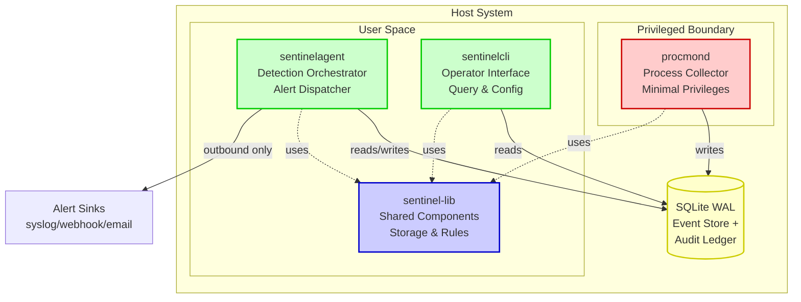
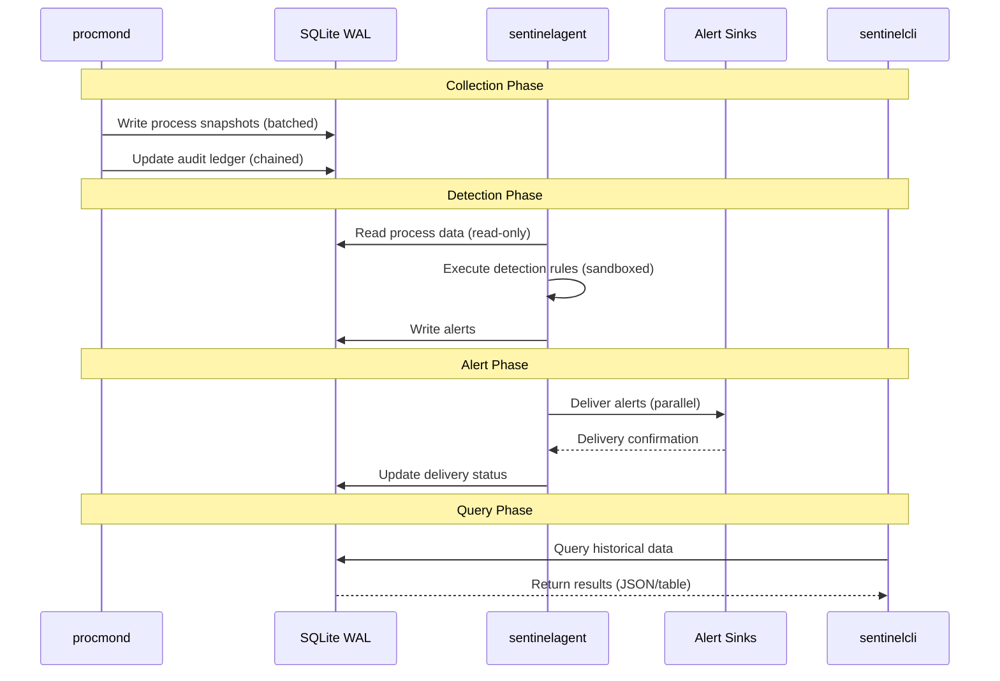

# SentinelD Product Specification

## Abstract

SentinelD is a security-focused, high-performance process monitoring system designed for cybersecurity professionals, threat hunters, and security operations centers. Built as a complete Rust rewrite of a proven Python prototype, SentinelD delivers enterprise-grade performance with audit-grade integrity through tamper-evident storage, offline-first operation, and SQL-based detection rules.

## How to Read This Document

This document provides the product vision and architecture overview for SentinelD. For implementation details, see:

- [Technical Stack](tech.md) - Technologies, patterns, and design decisions
- [Project Structure](structure.md) - Workspace layout and module organization
- [Requirements](requirements.md) - Functional and non-functional requirements
- [Tasks & Milestones](tasks.md) - Development phases and priorities

### Mermaid Diagrams

This document uses Mermaid for visual diagrams. In supported editors, these render automatically. For preview, copy the diagram code to <https://mermaid.live>.

---

## Mission & Value Proposition

**Mission**: Provide security operations teams with a reliable, high-performance process monitoring solution that operates independently of external dependencies while maintaining audit-grade integrity and operator-centric workflows.

**Core Value**: Transform chaotic process monitoring into structured, actionable security intelligence with performance, reliability, and security as first-class concerns.

### Unique Value Propositions

1. **Audit-Grade Integrity**: Tamper-evident, cryptographically chained logs suitable for compliance and forensics
2. **Offline-First Operation**: Full functionality without internet access, perfect for airgapped environments
3. **Operator-Centric Design**: Built for operators, by operators, with workflows optimized for contested environments
4. **Security-First Architecture**: Privilege separation, sandboxed execution, and minimal attack surface
5. **High Performance**: <5% CPU overhead while monitoring 10,000+ processes with sub-second enumeration

---

## Target Users & Personas

### Primary Users

#### SOC Analysts

- Need: Real-time process anomaly detection across fleet infrastructure
- Value: SQL-based detection rules, multi-channel alerting integration with SIEM
- Pain Point: Complex tools that break during incidents when needed most

#### Security Operations & Incident Response Teams

- Need: Forensic-grade process data for compromise investigation
- Value: Tamper-evident logs, historical process tracking, offline capabilities
- Pain Point: Tools that require internet connectivity in restricted environments

#### System Reliability Engineers & Platform Teams

- Need: Low-overhead monitoring that doesn't impact production systems
- Value: <5% CPU usage, bounded memory, graceful degradation
- Pain Point: Resource-hungry monitoring that becomes the problem

#### Blue Team Security Engineers

- Need: Integration with existing security infrastructure and workflows
- Value: SIEM integration, webhook delivery, standardized alert formats
- Pain Point: Proprietary tools that don't integrate with their stack

### Secondary Users

- **Red Team Operators**: Detecting defensive monitoring and evasion testing
- **Compliance Officers**: Audit-grade logging for regulatory requirements
- **DevSecOps Teams**: Container and cloud security monitoring integration

---

## Key Features & Capabilities

### Core Features

#### Cross-Platform Process Monitoring

- Linux, macOS, and Windows support with native OS integration
- Unified API with platform-specific optimizations
- Graceful degradation when elevated privileges unavailable

#### SQL-Based Detection Engine

- Flexible anomaly detection using standard SQL queries
- Sandboxed execution with AST validation preventing injection
- Built-in rules library covering common threat patterns
- Hot-reloadable custom rules with metadata and versioning

#### Tamper-Evident Audit Logging

- Cryptographically chained append-only logs
- Hash verification prevents tampering and ensures integrity
- Exportable checkpoints for external notarization
- Separate performance and audit data stores

#### Multi-Channel Alerting

- stdout, syslog, webhooks, email with delivery guarantees
- Circuit breakers and retry logic for reliability
- Structured JSON and human-readable formats
- Rate limiting and deduplication

#### Offline-Capable Operation

- No external dependencies for core functionality
- Bundle-based configuration and rule distribution
- Local SQLite storage with WAL mode for performance
- Airgap-friendly deployment and operation

### Security Features

#### Privilege Separation Architecture

- Minimal privileged collector (procmond)
- User-space orchestrator (sentinelagent)
- Operator CLI interface (sentinelcli)
- Shared library components (sentinel-lib)

#### Attack Surface Minimization

- No inbound network listeners
- Outbound-only connections for alerts
- Parameterized SQL queries only
- Input validation at all boundaries

#### Resource Security

- Bounded queues with backpressure handling
- Memory and CPU limits with cooperative yielding
- Timeout and cancellation support
- Graceful shutdown coordination

---

## Architecture Overview

SentinelD implements a **three-component security architecture** with strict privilege separation:

### Component Responsibilities

#### procmond (Privileged Collector)

- Collects process metadata with optional elevated privileges
- Writes to tamper-evident SQLite database via sentinel-lib
- Runs with least necessary privileges, drops elevation after init
- Minimal attack surface with no network functionality

#### sentinelagent (Detection Orchestrator)

- Executes SQL-based detection rules against collected data
- Delivers alerts via multiple channels (syslog, webhook, email)
- Outbound-only network connections, no listening ports
- Manages rule lifecycle and alert routing

#### sentinelcli (Operator Interface)

- Query historical process data with flexible SQL interface
- Export results in JSON or human-readable formats
- Configuration management and system health checking
- Respects NO_COLOR and TERM environment variables

#### sentinel-lib (Shared Library)

- Configuration management with hierarchical overrides
- Data models and storage abstractions (SQLite WAL mode)
- Process collection services and detection engine
- Alert delivery and sink management

### Data Flow Architecture

### Security Boundaries

#### Privilege Separation

Only procmond runs with elevated privileges when necessary

- Process enumeration requires minimal system access
- Immediate privilege drop after initialization
- Detection and alerting run in user space

#### Network Security

System is outbound-only for alert delivery

- No inbound network listeners or services
- All external communication initiated by sentinelagent
- Network failures don't impact core monitoring

#### Data Security

Input validation prevents configuration-based attacks

- SQL injection prevention through AST validation
- Parameterized queries and prepared statements only
- Sandboxed detection rule execution with resource limits

---

## Business Value & Benefits

### Operational Benefits

#### Compliance & Audit Readiness

- Tamper-evident logs meet regulatory requirements
- Cryptographic integrity verification
- Exportable audit trails for external validation
- Chain of custody preservation

#### Low Operational Overhead

- <5% CPU utilization during continuous monitoring
- <100MB memory footprint under normal operation
- <5 seconds to enumerate 10,000+ processes
- Graceful degradation under resource pressure

#### Rapid Deployment & Operations

- Single static binary per platform
- No external database dependencies
- Configuration via files or environment variables
- Systemd/launchd/Windows Service integration

#### Airgap & Offline Operations

- Complete functionality without internet access
- Bundle-based rule and configuration distribution
- Local data storage and processing
- Export capabilities for offline analysis

### Security Benefits

#### Threat Detection Capabilities

- Process hollowing detection (processes without executables)
- Executable integrity violations (runtime modifications)
- Suspicious process name duplications
- Anomalous parent-child process relationships
- Resource consumption pattern analysis

#### Defense in Depth

- Multiple layers of SQL injection prevention
- Privilege separation reduces attack surface
- Sandboxed detection execution
- Resource limits prevent DoS attacks

#### Integration Flexibility

- SIEM integration via syslog and webhooks
- Structured JSON alerts for automation
- Custom detection rule development
- Multi-format data export capabilities

---

## Threat Model Summary

### Threat Scenarios

#### Data Tampering

- Threat: Adversary modifies historical process data
- Mitigation: Cryptographic chaining in audit ledger, read-only detection connections

#### Detection Bypass

- Threat: Adversary evades process monitoring
- Mitigation: Continuous enumeration, integrity verification, multiple detection methods

#### SQL Injection

- Threat: Malicious detection rules execute arbitrary SQL
- Mitigation: AST validation, prepared statements, sandboxed execution, read-only connections

#### Resource Exhaustion

- Threat: Adversary causes system instability through resource consumption
- Mitigation: Bounded queues, backpressure, memory limits, cooperative yielding

#### Privilege Escalation

- Threat: Compromise of monitoring system leads to system control
- Mitigation: Privilege separation, minimal required permissions, immediate privilege drop

### Security Controls

#### Prevention

- Input validation at all boundaries
- Parameterized SQL queries exclusively
- Privilege separation architecture
- Attack surface minimization

#### Detection

- Tamper-evident audit logging
- Cryptographic integrity verification
- Resource usage monitoring
- Alert delivery verification

#### Response

- Graceful degradation capabilities
- Circuit breakers for external dependencies
- Offline operation during network failures
- Export capabilities for incident response

---

## Deployment Overview

### Deployment Models

#### System Service Deployment

- Linux: systemd service with hardening directives
- macOS: launchd service with proper entitlements
- Windows: Windows Service with restricted privileges
- No inbound network ports required

#### Container Deployment

- Host process monitoring requires privileged container
- Configuration via environment variables
- Health check endpoints for orchestration
- Resource constraints supported

#### Airgapped Environments

- Offline-first design with no external dependencies
- Bundle-based configuration and rule distribution
- Local data processing and storage
- Export capabilities for external analysis

### Configuration Management

#### Hierarchical Configuration

1. Default embedded configuration
2. System configuration file (`/etc/sentineld/config.yaml`)
3. User configuration file (`~/.config/sentineld/config.yaml`)
4. Environment variables (`SENTINELD_*`)
5. Command-line flags (highest precedence)

#### Security Considerations

- Secrets via environment variables or OS keychain
- Configuration validation prevents credential leakage
- No hardcoded credentials or API keys
- Secure file permissions (600) for configuration files

---

## Success Metrics & KPIs

### Performance Metrics

- CPU utilization: <5% sustained during monitoring
- Memory usage: <100MB resident under normal operation
- Process enumeration: <5 seconds for 10,000+ processes
- Database write rate: >1,000 records/second
- Alert latency: <100ms per detection rule execution

### Reliability Metrics

- System uptime: >99.9% availability
- Alert delivery: >99% success rate with retry
- Data integrity: 100% tamper detection rate
- Recovery time: <30 seconds from failure

### Security Metrics

- SQL injection prevention: 100% of test vectors blocked
- Privilege separation: Zero high-privilege network operations
- Resource bounds: Memory usage within 150MB under 25k process load
- Audit integrity: 100% cryptographic verification success

### Operational Metrics

- Deployment time: <15 minutes from package to production
- Configuration validation: 100% of invalid configs detected
- Cross-platform parity: Feature availability across Linux/macOS/Windows
- Documentation coverage: 100% of public APIs documented

---

## Competitive Positioning

### vs. auditd

- **Advantage**: Security-focused with better process visibility, cross-platform support
- **Disadvantage**: More specialized scope, newer project maturity

### vs. osquery

- **Advantage**: Purpose-built for security operations, better performance, offline-first
- **Disadvantage**: Narrower query scope, smaller ecosystem

### vs. Sysmon

- **Advantage**: Cross-platform, offline-capable, tamper-evident logs
- **Disadvantage**: Windows-native integration, established ecosystem

### vs. Commercial SIEM Agents

- **Advantage**: Open source, operator-centric, airgap-friendly, audit-grade integrity
- **Disadvantage**: Smaller vendor ecosystem, self-support model

---

## Conclusion

SentinelD addresses a critical gap in the security operations toolchain by providing a high-performance, security-first process monitoring solution that operates reliably in both connected and airgapped environments. The combination of audit-grade integrity, operator-centric design, and minimal overhead makes it ideal for security-conscious organizations that need reliable process monitoring without compromising system performance or security posture.

The three-component architecture with privilege separation ensures that the system remains secure even under adverse conditions, while the SQL-based detection engine provides the flexibility needed for evolving threat landscapes. With tamper-evident logging and offline-first operation, SentinelD meets the stringent requirements of compliance-driven environments and contested operational scenarios.
