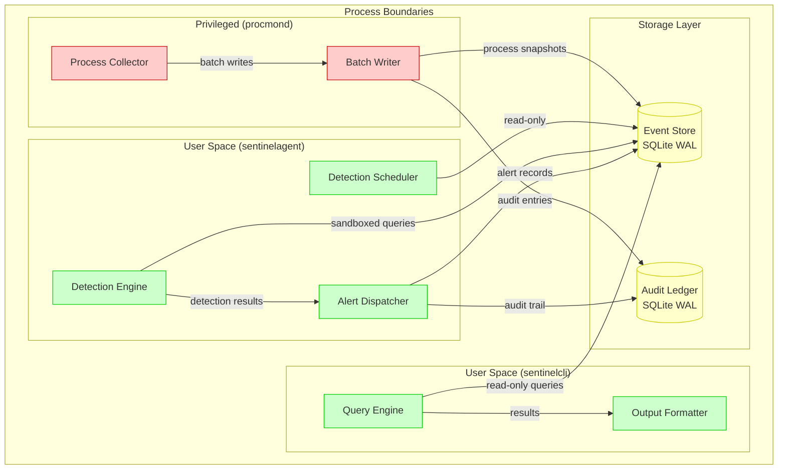

# SentinelD Project Structure

## Abstract

This document defines the workspace layout, module organization, and architectural boundaries for
the SentinelD project. It establishes coding standards, feature flags, database schema design, and
data flow patterns that support the three-component security architecture with privilege separation.

## How to Read This Document

This document provides the structural blueprint for SentinelD implementation. See also:

- [Product Specification](product.md) - Mission, architecture overview, and value proposition
- [Technical Stack](tech.md) - Technologies, patterns, and design decisions
- [Requirements](requirements.md) - Functional and non-functional requirements
- [Tasks & Milestones](tasks.md) - Development phases and priorities

**Note on Diagrams**: Architecture diagrams use Mermaid format. For previews, copy diagram code to
<https://mermaid.live>.

---

## Workspace Layout

### Root Directory Structure

```text
SentinelD/
├── procmond/                    # Privileged process collector
│   ├── Cargo.toml
│   ├── src/
│   │   ├── main.rs             # Binary entrypoint
│   │   ├── lib.rs              # Library interface
│   │   ├── platform/           # OS-specific implementations
│   │   │   ├── linux.rs        # Linux process enumeration
│   │   │   ├── macos.rs        # macOS process enumeration
│   │   │   └── windows.rs      # Windows process enumeration
│   │   ├── collector.rs        # Process collection logic
│   │   ├── privileges.rs       # Privilege management
│   │   └── writer.rs           # Database writing with batching
│   └── tests/
│       ├── integration/        # CLI integration tests
│       └── platform/           # Platform-specific tests
├── sentinelagent/              # User-space orchestrator
│   ├── Cargo.toml
│   ├── src/
│   │   ├── main.rs             # Agent daemon entrypoint
│   │   ├── scheduler.rs        # Detection scheduling
│   │   ├── detector.rs         # Rule execution orchestrator
│   │   ├── dispatcher.rs       # Alert delivery manager
│   │   └── health.rs           # Health monitoring
│   └── tests/
├── sentinelcli/                # Operator command-line interface
│   ├── Cargo.toml
│   ├── src/
│   │   ├── main.rs             # CLI entrypoint
│   │   ├── commands/           # Subcommand implementations
│   │   │   ├── query.rs        # Data querying
│   │   │   ├── export.rs       # Data export
│   │   │   ├── rules.rs        # Rule management
│   │   │   ├── health.rs       # Health checking
│   │   │   └── config.rs       # Configuration management
│   │   ├── output.rs           # Output formatting (JSON/table)
│   │   └── terminal.rs         # Color/NO_COLOR handling
│   └── tests/
├── sentinel-lib/               # Shared library components
│   ├── Cargo.toml
│   ├── src/
│   │   ├── lib.rs              # Public library interface
│   │   ├── config/             # Configuration management
│   │   │   ├── mod.rs          # Configuration loading
│   │   │   ├── validation.rs   # Config validation
│   │   │   └── defaults.rs     # Default values
│   │   ├── models/             # Core data structures
│   │   │   ├── process.rs      # Process record models
│   │   │   ├── alert.rs        # Alert models
│   │   │   ├── rule.rs         # Detection rule models
│   │   │   └── audit.rs        # Audit entry models
│   │   ├── storage/            # Database abstractions
│   │   │   ├── mod.rs          # Storage traits
│   │   │   ├── sqlite.rs       # SQLite implementation
│   │   │   ├── migrations/     # Schema migrations
│   │   │   └── queries.rs      # Prepared queries
│   │   ├── detection/          # Detection engine
│   │   │   ├── mod.rs          # Detection traits
│   │   │   ├── parser.rs       # SQL AST validation
│   │   │   ├── executor.rs     # Sandboxed execution
│   │   │   └── rules.rs        # Built-in rule library
│   │   ├── alerting/           # Alert delivery
│   │   │   ├── mod.rs          # Alert sink traits
│   │   │   ├── stdout.rs       # Console output sink
│   │   │   ├── syslog.rs       # Syslog sink
│   │   │   ├── webhook.rs      # HTTP webhook sink
│   │   │   ├── email.rs        # Email sink
│   │   │   └── circuit.rs      # Circuit breaker
│   │   ├── crypto/             # Cryptographic functions
│   │   │   ├── audit.rs        # Audit chain verification
│   │   │   └── hash.rs         # Hash computation
│   │   ├── telemetry/          # Observability
│   │   │   ├── logging.rs      # Structured logging setup
│   │   │   ├── metrics.rs      # Prometheus metrics
│   │   │   └── tracing.rs      # Tracing configuration
│   │   └── ipc/                # Inter-process communication
│   │       ├── unix.rs         # Unix domain sockets
│   │       └── windows.rs      # Windows named pipes
│   └── tests/
├── sentinel-detexec/           # Optional: Sandboxed detection executor
│   ├── Cargo.toml              # (Future enhancement)
│   └── src/
│       ├── main.rs             # Isolated detection process
│       ├── sandbox.rs          # OS-specific sandboxing
│       └── executor.rs         # Query execution
├── project_spec/               # Project specifications
│   ├── product.md              # Product overview
│   ├── tech.md                 # Technical stack
│   ├── structure.md            # This document
│   ├── requirements.md         # Requirements specification
│   └── tasks.md                # Implementation tasks
├── docs/                       # Documentation
│   ├── operator_guide.md       # Operator documentation
│   ├── deployment.md           # Deployment guide
│   └── api/                    # API documentation
├── scripts/                    # Development and deployment
│   ├── install.sh              # Installation script
│   ├── service/                # Service definitions
│   │   ├── systemd/            # Linux systemd units
│   │   ├── launchd/            # macOS launchd plists
│   │   └── windows/            # Windows service manifests
│   └── packaging/              # Package building
├── Cargo.toml                  # Workspace configuration
├── Cargo.lock                  # Dependency lock file
├── justfile                    # Task runner configuration
├── rust-toolchain.toml         # Rust toolchain specification
├── .github/                    # CI/CD workflows
├── README.md                   # Project overview
├── LICENSE                     # Apache 2.0 license
├── WARP.md                     # WARP terminal guidance
└── AGENTS.md                   # AI coding assistant rules
```

### Workspace Configuration

```toml
# Cargo.toml - Workspace root
[workspace]
resolver = "3"
members = [
  "procmond",
  "sentinelagent",
  "sentinelcli",
  "sentinel-lib",
  # "sentinel-detexec",  # Future enhancement
]
default-members = ["procmond", "sentinelagent", "sentinelcli", "sentinel-lib"]

[workspace.package]
edition = "2024"
version = "0.1.0"
authors = ["UncleSp1d3r", "Krypdo3"]
license = "Apache-2.0"
description = "SentinelD: Security-focused process monitoring system"

[workspace.lints.rust]
unsafe_code = "forbid" # Memory safety guarantee
warnings = "deny"      # Zero-warnings policy

[workspace.lints.clippy]
all = "deny"      # Strict clippy enforcement
pedantic = "warn" # Additional style recommendations

[workspace.dependencies]
# Core runtime
tokio = { version = "1.0", features = ["full"] }
tracing = "0.1"
anyhow = "1.0"
thiserror = "1.0"

# Testing utilities
assert_cmd = "2.0"
predicates = "3.0"
criterion = "0.5"
insta = "1.34"
```

---

## Module Responsibilities

### sentinel-lib (Shared Core Library)

**Primary Purpose**: Provides common functionality shared across all components while maintaining
security boundaries.

```rust
// src/lib.rs - Public API surface
pub mod alerting; // Multi-channel alert delivery
pub mod config; // Configuration management
pub mod crypto; // Cryptographic audit functions
pub mod detection; // SQL-based detection engine
pub mod ipc;
pub mod models; // Core data structures
pub mod storage; // Database abstractions
pub mod telemetry; // Logging and metrics // Inter-process communication

// Feature-gated modules
#[cfg(feature = "metrics")]
pub mod metrics;

#[cfg(feature = "audit-signing")]
pub mod signing;
```

#### Key Traits & Abstractions

```rust
// Storage abstraction
#[async_trait]
pub trait ProcessStore {
    async fn store_scan(&mut self, scan: ScanContext, processes: Vec<ProcessRecord>) -> Result<ScanId>;
    async fn query_processes(&self, query: &str, params: &[&dyn ToSql]) -> Result<Vec<ProcessRecord>>;
    async fn store_alert(&mut self, alert: Alert) -> Result<AlertId>;
}

// Detection engine abstraction
#[async_trait]
pub trait DetectionEngine {
    async fn validate_rule(&self, rule: &DetectionRule) -> Result<ValidationResult>;
    async fn execute_rule(&self, rule: &DetectionRule) -> Result<Vec<Alert>>;
}

// Alert delivery abstraction
#[async_trait]
pub trait AlertSink {
    async fn send(&self, alert: &Alert) -> Result<DeliveryResult>;
    async fn health_check(&self) -> HealthStatus;
    fn name(&self) -> &str;
}
```

### procmond (Privileged Process Collector)

**Primary Purpose**: Minimal privileged component focused solely on process data collection with
immediate privilege dropping.

```rust
// src/main.rs - Binary entrypoint
use sentinel_lib::{config::Config, storage::ProcessStore};

#[tokio::main]
async fn main() -> Result<()> {
    // 1. Load configuration
    let config = Config::load()?;

    // 2. Initialize logging (structured)
    sentinel_lib::telemetry::init(&config.logging)?;

    // 3. Initialize database connection
    let mut store = sentinel_lib::storage::sqlite::SqliteStore::open(&config.database.path)?;

    // 4. Drop privileges immediately after initialization
    crate::privileges::drop_privileges(&config.privileges)?;

    // 5. Start collection loop with backpressure
    let collector = crate::collector::ProcessCollector::new(config.collection);
    collector.run_continuous(store).await
}
```

#### Platform Abstraction Layer

```rust
// src/platform/mod.rs - Cross-platform interface
pub trait ProcessEnumerator {
    async fn enumerate(&self) -> Result<Vec<ProcessInfo>>;
    fn supports_events(&self) -> bool;
    fn required_privileges(&self) -> Vec<Privilege>;
}

// Platform-specific implementations
#[cfg(target_os = "linux")]
pub use linux::LinuxProcessEnumerator as PlatformEnumerator;

#[cfg(target_os = "macos")]
pub use macos::MacOSProcessEnumerator as PlatformEnumerator;

#[cfg(target_os = "windows")]
pub use windows::WindowsProcessEnumerator as PlatformEnumerator;
```

#### Resource Management & Batching

```rust
// src/writer.rs - Batched database writes
pub struct BatchWriter {
    store: Box<dyn ProcessStore>,
    queue: tokio::sync::mpsc::Receiver<ProcessRecord>,
    batch_size: usize,
    flush_interval: Duration,
    backpressure: BackpressurePolicy,
}

impl BatchWriter {
    pub async fn run(&mut self) -> Result<()> {
        let mut batch = Vec::with_capacity(self.batch_size);
        let mut flush_timer = tokio::time::interval(self.flush_interval);

        loop {
            tokio::select! {
                // Batch process records
                Some(record) = self.queue.recv() => {
                    batch.push(record);

                    if batch.len() >= self.batch_size {
                        self.flush_batch(&mut batch).await?;
                    }
                }

                // Periodic flush
                _ = flush_timer.tick() => {
                    if !batch.is_empty() {
                        self.flush_batch(&mut batch).await?;
                    }
                }
            }
        }
    }
}
```

### sentinelagent (Detection Orchestrator)

**Primary Purpose**: User-space component that executes detection rules, manages alerts, and
coordinates system health.

```rust
// src/scheduler.rs - Detection scheduling
pub struct DetectionScheduler {
    engine: Box<dyn DetectionEngine>,
    rules: HashMap<RuleId, DetectionRule>,
    schedule: CronScheduler,
    dispatcher: AlertDispatcher,
}

impl DetectionScheduler {
    pub async fn run(&mut self) -> Result<()> {
        let mut schedule_timer = tokio::time::interval(Duration::from_secs(30));

        loop {
            tokio::select! {
                // Periodic detection execution
                _ = schedule_timer.tick() => {
                    self.execute_scheduled_rules().await?;
                }

                // Rule reload signal
                _ = self.rule_reload_rx.recv() => {
                    self.reload_rules().await?;
                }

                // Graceful shutdown
                _ = self.shutdown_rx.recv() => {
                    break;
                }
            }
        }
        Ok(())
    }
}
```

#### Alert Dispatching with Reliability

```rust
// src/dispatcher.rs - Reliable alert delivery
pub struct AlertDispatcher {
    sinks: Vec<Box<dyn AlertSink>>,
    circuit_breakers: HashMap<String, CircuitBreaker>,
    retry_policy: RetryPolicy,
    dead_letter_queue: DeadLetterQueue,
}

impl AlertDispatcher {
    pub async fn dispatch(&self, alert: Alert) -> Result<Vec<DeliveryResult>> {
        let mut results = Vec::new();

        // Parallel delivery to all sinks
        let futures: Vec<_> = self.sinks.iter()
            .map(|sink| self.deliver_with_circuit_breaker(sink, &alert))
            .collect();

        let delivery_results = futures::future::join_all(futures).await;

        for result in delivery_results {
            match result {
                Ok(success) => results.push(success),
                Err(e) => {
                    // Send to dead letter queue
                    self.dead_letter_queue.store(alert.clone(), e).await?;
                    results.push(DeliveryResult::Failed);
                }
            }
        }

        Ok(results)
    }
}
```

### sentinelcli (Operator Interface)

**Primary Purpose**: User-friendly command-line interface for querying data, managing configuration,
and system operations.

```rust
// src/main.rs - CLI entrypoint with color handling
use clap::{Parser, Subcommand};
use sentinel_lib::storage::ProcessStore;

#[derive(Parser)]
#[command(name = "sentinelcli")]
#[command(about = "SentinelD operator command-line interface")]
struct Cli {
    #[command(subcommand)]
    command: Commands,

    #[arg(long, global = true)]
    config: Option<PathBuf>,

    #[arg(long, global = true)]
    json: bool,

    #[arg(long, global = true)]
    no_color: bool,
}

#[derive(Subcommand)]
enum Commands {
    Query(crate::commands::query::QueryArgs),
    Export(crate::commands::export::ExportArgs),
    Rules(crate::commands::rules::RulesArgs),
    Health(crate::commands::health::HealthArgs),
    Config(crate::commands::config::ConfigArgs),
}

#[tokio::main]
async fn main() -> Result<()> {
    let cli = Cli::parse();

    // Handle color output (NO_COLOR/TERM environment variables)
    crate::terminal::setup_color_handling(&cli)?;

    // Load configuration
    let config = sentinel_lib::config::Config::load_from(cli.config)?;

    // Initialize storage (read-only for CLI)
    let store = sentinel_lib::storage::sqlite::SqliteStore::open_readonly(&config.database.path)?;

    // Dispatch to subcommands
    match cli.command {
        Commands::Query(args) => crate::commands::query::execute(args, &store, cli.json).await,
        Commands::Export(args) => crate::commands::export::execute(args, &store, cli.json).await,
        Commands::Rules(args) => crate::commands::rules::execute(args, &store, cli.json).await,
        Commands::Health(args) => crate::commands::health::execute(args, &store, cli.json).await,
        Commands::Config(args) => crate::commands::config::execute(args, &store, cli.json).await,
    }
}
```

#### Output Formatting with Terminal Support

```rust
// src/output.rs - Structured output formatting
pub trait OutputFormatter {
    fn format_processes(&self, processes: &[ProcessRecord]) -> Result<String>;
    fn format_alerts(&self, alerts: &[Alert]) -> Result<String>;
    fn format_health(&self, health: &HealthStatus) -> Result<String>;
}

pub struct JsonFormatter;
pub struct TableFormatter {
    use_color: bool,
}

impl TableFormatter {
    pub fn new() -> Self {
        Self {
            use_color: !crate::terminal::should_disable_color(),
        }
    }
}

// Terminal color handling
// src/terminal.rs - Color and terminal handling
pub fn should_disable_color() -> bool {
    // Check NO_COLOR environment variable (RFC 8405)
    if env::var("NO_COLOR").is_ok() {
        return true;
    }

    // Check TERM environment variable
    if env::var("TERM").map(|term| term == "dumb").unwrap_or(false) {
        return true;
    }

    // Check if output is redirected (not a TTY)
    !atty::is(atty::Stream::Stdout)
}
```

---

## Feature Flags Strategy

### Platform-Specific Features

```toml
[features]
default = ["sqlite-bundled"]

# Core features
sqlite-bundled = ["rusqlite/bundled"]
metrics = ["prometheus"]
audit-signing = ["ed25519-dalek", "blake3"]

# Platform-specific event capture (phase 2)
linux-ebpf = ["aya", "aya-bpf"]
windows-etw = ["windows/Win32_System_Diagnostics_Etw", "wmi"]
macos-es = ["core-foundation", "security-framework"]

# Alert sink features
email-alerts = ["lettre"]
webhook-alerts = ["reqwest"]
syslog-alerts = ["syslog"]

# Development and testing
integration-tests = ["assert_cmd", "predicates", "tempfile"]
```

### Conditional Compilation Strategy

```rust
// Platform-specific modules
#[cfg(all(target_os = "linux", feature = "linux-ebpf"))]
mod ebpf;

#[cfg(all(target_os = "windows", feature = "windows-etw"))]
mod etw;

#[cfg(all(target_os = "macos", feature = "macos-es"))]
mod endpoint_security;

// Feature-gated alert sinks
#[cfg(feature = "email-alerts")]
pub mod email;

#[cfg(feature = "webhook-alerts")]
pub mod webhook;

#[cfg(feature = "syslog-alerts")]
pub mod syslog;

// Graceful feature degradation
pub fn available_sinks() -> Vec<&'static str> {
    let mut sinks = vec!["stdout"];

    #[cfg(feature = "syslog-alerts")]
    sinks.push("syslog");

    #[cfg(feature = "webhook-alerts")]
    sinks.push("webhook");

    #[cfg(feature = "email-alerts")]
    sinks.push("email");

    sinks
}
```

---

## Database Schema Design

### Core Tables Structure

```sql
-- Process snapshots (high-volume, performance-optimized)
CREATE TABLE process_snapshots (
    id INTEGER PRIMARY KEY AUTOINCREMENT,
    scan_id INTEGER NOT NULL,
    timestamp_ms INTEGER NOT NULL,        -- Millisecond precision

    -- Process identification
    pid INTEGER NOT NULL,
    ppid INTEGER,
    name TEXT NOT NULL,
    exe_path TEXT,
    command_line TEXT,                   -- JSON array of arguments

    -- Process metadata
    start_time INTEGER,                  -- Process start timestamp
    cpu_percent REAL,
    memory_bytes INTEGER,
    status TEXT,                        -- running, sleeping, zombie, etc.

    -- Security metadata
    exe_hash TEXT,                      -- SHA-256 of executable
    hash_algorithm TEXT DEFAULT 'sha256',
    user_name TEXT,
    user_id INTEGER,

    -- Platform-specific data (JSON blob)
    platform_data TEXT,

    -- Foreign key
    FOREIGN KEY (scan_id) REFERENCES scan_metadata(id)
);

-- Scan metadata (collection context)
CREATE TABLE scan_metadata (
    id INTEGER PRIMARY KEY AUTOINCREMENT,
    start_time INTEGER NOT NULL,
    end_time INTEGER,
    duration_ms INTEGER,

    -- Collection statistics
    total_processes INTEGER DEFAULT 0,
    accessible_processes INTEGER DEFAULT 0,
    errors INTEGER DEFAULT 0,

    -- System context
    hostname TEXT NOT NULL,
    os_name TEXT NOT NULL,
    os_version TEXT,
    load_average REAL,

    -- Version tracking
    collector_version TEXT NOT NULL,
    config_hash TEXT NOT NULL
);

-- Detection rules (versioned rule definitions)
CREATE TABLE detection_rules (
    id TEXT PRIMARY KEY,                -- Unique rule identifier
    name TEXT NOT NULL,
    description TEXT,
    version INTEGER NOT NULL DEFAULT 1,

    -- Rule definition
    sql_query TEXT NOT NULL,           -- Validated SQL query
    severity TEXT NOT NULL CHECK (severity IN ('low', 'medium', 'high', 'critical')),
    category TEXT,                     -- process, file, network, etc.
    tags TEXT,                         -- JSON array of tags

    -- Rule metadata
    enabled BOOLEAN NOT NULL DEFAULT 1,
    author TEXT,
    created_at INTEGER NOT NULL DEFAULT (strftime('%s', 'now')),
    updated_at INTEGER NOT NULL DEFAULT (strftime('%s', 'now')),

    -- Source tracking
    source_type TEXT DEFAULT 'builtin', -- builtin, file, user
    source_path TEXT,
    checksum TEXT                       -- Rule content hash
);

-- Generated alerts (detection results)
CREATE TABLE alerts (
    id INTEGER PRIMARY KEY AUTOINCREMENT,
    alert_time INTEGER NOT NULL,
    rule_id TEXT NOT NULL,

    -- Alert content
    title TEXT NOT NULL,
    description TEXT,
    severity TEXT NOT NULL,

    -- Context
    scan_id INTEGER,
    affected_processes TEXT,            -- JSON array of PIDs
    process_count INTEGER DEFAULT 0,

    -- Rule execution metadata
    rule_version INTEGER,
    execution_time_ms INTEGER,
    query_result TEXT,                  -- JSON of raw query results

    FOREIGN KEY (rule_id) REFERENCES detection_rules(id),
    FOREIGN KEY (scan_id) REFERENCES scan_metadata(id)
);

-- Alert delivery tracking
CREATE TABLE alert_deliveries (
    id INTEGER PRIMARY KEY AUTOINCREMENT,
    alert_id INTEGER NOT NULL,

    -- Delivery configuration
    sink_name TEXT NOT NULL,           -- stdout, syslog, webhook, email
    sink_type TEXT NOT NULL,

    -- Delivery attempt
    attempt_time INTEGER NOT NULL,
    attempt_count INTEGER DEFAULT 1,
    status TEXT NOT NULL CHECK (status IN ('pending', 'success', 'failed', 'retrying')),

    -- Result tracking
    response_time_ms INTEGER,
    error_message TEXT,
    http_status INTEGER,               -- For webhook deliveries

    FOREIGN KEY (alert_id) REFERENCES alerts(id)
);

-- Audit ledger (tamper-evident chain)
CREATE TABLE audit_ledger (
    sequence INTEGER PRIMARY KEY,      -- Monotonic sequence
    timestamp INTEGER NOT NULL,
    actor TEXT NOT NULL,              -- procmond, sentinelagent, sentinelcli
    action TEXT NOT NULL,             -- scan_start, scan_complete, rule_execute, etc.

    -- Cryptographic chain
    payload_hash BLOB NOT NULL,       -- BLAKE3 hash of event data
    prev_hash BLOB,                   -- Previous entry hash
    entry_hash BLOB NOT NULL,         -- This entry hash
    signature BLOB,                   -- Optional Ed25519 signature

    -- Event data (JSON)
    event_data TEXT NOT NULL
);

-- System metadata
CREATE TABLE system_metadata (
    key TEXT PRIMARY KEY,
    value TEXT NOT NULL,
    updated_at INTEGER DEFAULT (strftime('%s', 'now'))
);
```

### Indexing Strategy

```sql
-- Process query optimization
CREATE INDEX idx_process_snapshots_timestamp ON process_snapshots(timestamp_ms);
CREATE INDEX idx_process_snapshots_scan_pid ON process_snapshots(scan_id, pid);
CREATE INDEX idx_process_snapshots_name ON process_snapshots(name);
CREATE INDEX idx_process_snapshots_exe_path ON process_snapshots(exe_path);
CREATE INDEX idx_process_snapshots_exe_hash ON process_snapshots(exe_hash);

-- Alert query optimization
CREATE INDEX idx_alerts_time_severity ON alerts(alert_time, severity);
CREATE INDEX idx_alerts_rule_time ON alerts(rule_id, alert_time);
CREATE INDEX idx_alerts_scan_id ON alerts(scan_id);

-- Rule management optimization
CREATE INDEX idx_detection_rules_enabled ON detection_rules(enabled);
CREATE INDEX idx_detection_rules_category ON detection_rules(category);

-- Audit chain optimization
CREATE INDEX idx_audit_ledger_timestamp ON audit_ledger(timestamp);
CREATE INDEX idx_audit_ledger_actor_action ON audit_ledger(actor, action);

-- Delivery tracking optimization
CREATE INDEX idx_alert_deliveries_status ON alert_deliveries(status, attempt_time);
```

### Data Retention & Maintenance

```sql
-- Automated cleanup procedures
-- Remove old process snapshots (configurable retention)
DELETE FROM process_snapshots
WHERE timestamp_ms < (strftime('%s', 'now') - :retention_days * 24 * 3600) * 1000;

-- Remove old alerts (longer retention for forensics)
DELETE FROM alerts
WHERE alert_time < (strftime('%s', 'now') - :alert_retention_days * 24 * 3600) * 1000;

-- Vacuum and optimize (scheduled maintenance)
PRAGMA optimize;
PRAGMA wal_checkpoint(TRUNCATE);
VACUUM;
```

---

## Data Flow & Boundaries

### Inter-Process Communication Architecture



### Security Boundaries

#### Database Access Patterns

- **procmond**: Write-only access to event store and audit ledger
- **sentinelagent**: Read-only access to event store, write access for alerts
- **sentinelcli**: Read-only access to event store for queries
- **Detection Engine**: Sandboxed read-only access with prepared statements only

#### Network Access Control

- **procmond**: No network access whatsoever
- **sentinelagent**: Outbound-only connections for alert delivery
- **sentinelcli**: No network access (local operations only)

#### File System Access

- **All components**: Configuration files with secure permissions (600)
- **procmond**: Database files with restricted access (660)
- **Detection rules**: Read-only access to rule directories

---

## Coding Standards & Patterns

### Error Handling Pattern

```rust
// Library crates use thiserror for structured errors
#[derive(thiserror::Error, Debug)]
pub enum StorageError {
    #[error("Database connection failed: {0}")]
    ConnectionFailed(#[from] rusqlite::Error),

    #[error("Migration failed: version {version}, reason: {reason}")]
    MigrationFailed { version: String, reason: String },

    #[error("Query validation failed: {0}")]
    QueryValidation(String),
}

// Application crates use anyhow for context
use anyhow::{Context, Result};

pub async fn execute_detection_rule(rule: &DetectionRule) -> Result<Vec<Alert>> {
    let validated_rule = validate_rule(rule)
        .with_context(|| format!("Failed to validate rule '{}'", rule.id))?;

    let results = execute_query(&validated_rule.sql_query)
        .await
        .with_context(|| format!("Failed to execute rule '{}'", rule.id))?;

    Ok(results)
}
```

### Tracing Integration

```rust
use tracing::{info, warn, error, debug, instrument};

#[instrument(skip(store), fields(rule_id = %rule.id))]
pub async fn execute_detection_rule(
    store: &dyn ProcessStore,
    rule: &DetectionRule
) -> Result<Vec<Alert>> {
    info!("Starting rule execution");

    let start = Instant::now();
    let alerts = perform_detection(store, rule).await?;
    let duration = start.elapsed();

    info!(
        alert_count = alerts.len(),
        duration_ms = duration.as_millis(),
        "Rule execution completed"
    );

    Ok(alerts)
}
```

### Resource Management Pattern

```rust
pub struct ResourceManager {
    memory_budget: Arc<AtomicUsize>,
    active_tasks: Arc<AtomicUsize>,
    shutdown_token: CancellationToken,
}

impl ResourceManager {
    pub async fn with_memory_limit<F, T>(&self, limit: usize, f: F) -> Result<T>
    where
        F: Future<Output = Result<T>>,
    {
        // Check memory budget
        let current_usage = self.memory_budget.load(Ordering::SeqCst);
        if current_usage + limit > self.max_memory {
            return Err(ResourceError::MemoryLimitExceeded);
        }

        // Reserve memory
        self.memory_budget.fetch_add(limit, Ordering::SeqCst);

        // Execute with automatic cleanup
        let result = f.await;

        // Release memory
        self.memory_budget.fetch_sub(limit, Ordering::SeqCst);

        result
    }

    pub fn check_shutdown(&self) -> Result<()> {
        if self.shutdown_token.is_cancelled() {
            Err(ResourceError::ShutdownRequested)
        } else {
            Ok(())
        }
    }
}
```

### Configuration Pattern

```rust
#[derive(Debug, Clone, Serialize, Deserialize)]
pub struct Config {
    pub app: AppConfig,
    pub database: DatabaseConfig,
    pub collection: CollectionConfig,
    pub detection: DetectionConfig,
    pub alerting: AlertingConfig,
}

impl Config {
    pub fn load() -> Result<Self> {
        Self::load_from(None)
    }

    pub fn load_from(path: Option<PathBuf>) -> Result<Self> {
        let mut builder = ConfigBuilder::new();

        // 1. Load defaults
        builder = builder.add_source(File::from_str(
            include_str!("defaults.yaml"),
            FileFormat::Yaml,
        ));

        // 2. System configuration
        if let Ok(system_path) = Self::system_config_path() {
            if system_path.exists() {
                builder = builder.add_source(File::from(system_path));
            }
        }

        // 3. User configuration
        if let Ok(user_path) = Self::user_config_path() {
            if user_path.exists() {
                builder = builder.add_source(File::from(user_path));
            }
        }

        // 4. Override with specific path if provided
        if let Some(config_path) = path {
            builder = builder.add_source(File::from(config_path));
        }

        // 5. Environment variables (SENTINELD_*)
        builder = builder.add_source(Environment::with_prefix("SENTINELD").separator("_"));

        let config = builder.build()?;
        let parsed: Config = config.try_deserialize()?;

        // Validation
        parsed.validate()?;

        Ok(parsed)
    }
}
```

---

## Conclusion

The SentinelD project structure establishes clear architectural boundaries while supporting the
three-component security model. The workspace layout separates concerns appropriately, with the
shared `sentinel-lib` providing secure abstractions for cross-component functionality.

Key structural decisions include:

1. **Privilege Separation**: Clear boundaries between privileged collector and user-space components
2. **Shared Library**: Common functionality encapsulated in `sentinel-lib` with trait-based
   abstractions
3. **Database Architecture**: Dual-store design with separate event and audit storage for
   performance and integrity
4. **Feature Flags**: Platform-specific and optional functionality can be selectively compiled
5. **Resource Management**: Bounded resources and cooperative scheduling prevent resource exhaustion
6. **Observability**: Comprehensive tracing and metrics integration throughout the codebase

This structure addresses the critical architecture issues identified in the review while providing a
maintainable and extensible foundation for future development.
