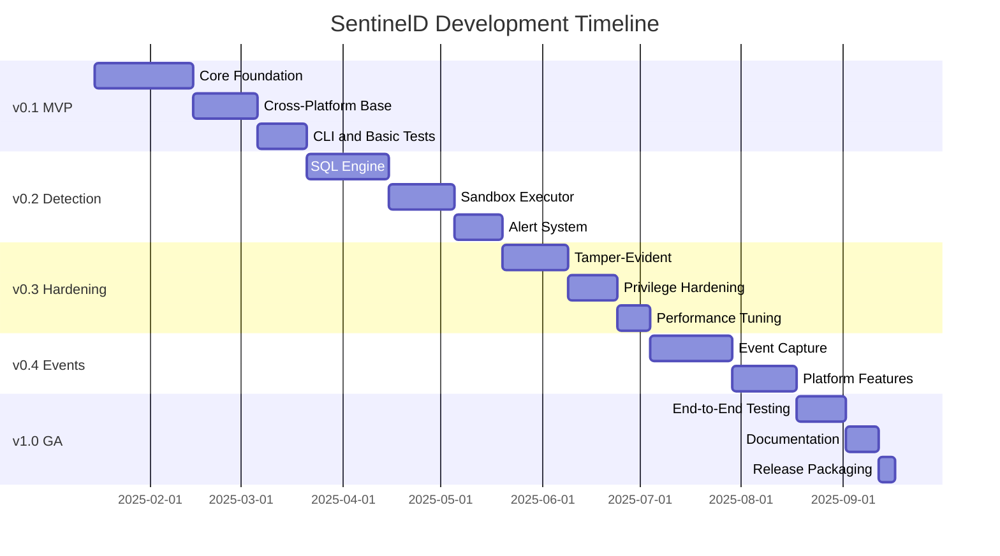
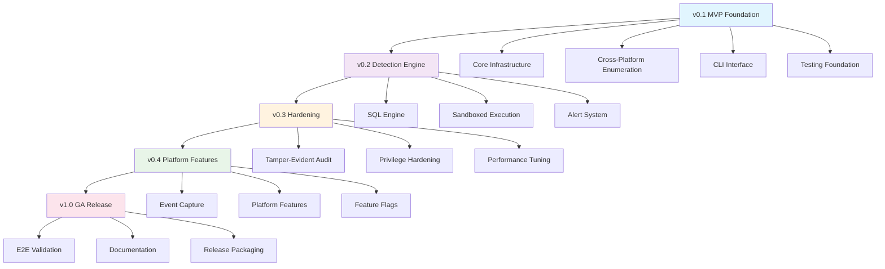

# SentinelD Task Planning and Milestones

## Abstract

This document provides the complete task breakdown, milestone planning, and development phases for the SentinelD project. It translates the functional and non-functional requirements into concrete deliverables organized across four major milestones leading to a production-ready v1.0 release.

## How to Read This Document

- **Cross-references**: Links to [product.md](./product.md), [tech.md](./tech.md), [structure.md](./structure.md), and [requirements.md](./requirements.md)
- **Diagrams**: Uses Mermaid for milestone dependencies and project timeline visualization
- **Task priorities**: P0 (blocking) → P1 (important) → P2 (nice-to-have)
- **Definition of Done**: Each task includes specific acceptance criteria, testing requirements, and quality gates

## Milestone Overview

## v0.1 — MVP Snapshot + CLI (Foundation)

**Goal**: Cross-platform baseline with core functionality, complete CLI interface, and robust testing foundation.

**Success Metrics**:

- Process enumeration works on Linux/macOS/Windows
- CLI supports JSON and table outputs with NO_COLOR/TERM handling
- All tests pass with `cargo clippy -- -D warnings`
- Performance baseline established with criterion benchmarks

### Core Infrastructure (P0 - Blocking)

#### TASK-001: Project Workspace Setup

**Priority**: P0
**Effort**: 3 days
**Owner**: UncleSp1d3r

**Description**: Initialize Rust workspace with proper structure and tooling.

**Acceptance Criteria**:

- [ ] Cargo workspace with `sentinel-lib`, `procmond`, `sentinelagent`, `sentinelcli` crates
- [ ] Rust 2024 edition configured in all crates
- [ ] `unsafe_code = "forbid"` at workspace level
- [ ] `justfile` with core recipes: `fmt`, `lint`, `test`, `build`
- [ ] `.prettierignore` excludes all Markdown files
- [ ] CI workflow with Linux/macOS/Windows matrix

**Definition of Done**:

- [ ] Code formatted with `cargo fmt`
- [ ] Lints pass: `cargo clippy --workspace -- -D warnings`
- [ ] Justfile lint passes: `just --fmt --check --unstable`
- [ ] All platform CI jobs pass

**Verification**: Integration test with `assert_cmd` verifying binary builds on all platforms.

#### TASK-002: Configuration Management

**Priority**: P0
**Effort**: 5 days
**Dependencies**: TASK-001

**Description**: Implement hierarchical configuration with environment overrides.

**Acceptance Criteria**:

- [ ] Config crate supporting TOML files, environment variables, CLI args
- [ ] Layered precedence: CLI > Env > File > Defaults
- [ ] Configuration validation with structured errors
- [ ] Example configurations for all components
- [ ] Support for relative and absolute paths

**Definition of Done**:

- [ ] Unit tests for all config scenarios
- [ ] Integration tests with `assert_cmd` verifying config loading
- [ ] Documentation with examples
- [ ] Error messages are actionable and clear

**Verification**: Config validation tests with invalid inputs, environment variable overrides.

#### TASK-003: Database Foundation (SQLite + WAL)

**Priority**: P0
**Effort**: 7 days
**Dependencies**: TASK-002

**Description**: Implement SQLite storage with WAL mode and optimized settings.

**Acceptance Criteria**:

- [ ] Database schema with processes, proc_events, meta tables
- [ ] WAL mode enabled with appropriate PRAGMA settings
- [ ] Migration system for schema changes
- [ ] Connection pooling and prepared statements
- [ ] Graceful connection retry and error handling

**Definition of Done**:

- [ ] Unit tests for all database operations
- [ ] Performance tests with criterion (baseline metrics)
- [ ] Concurrent access tests (multiple readers/writers)
- [ ] Database corruption recovery tests

**Verification**: Load test with 10,000+ process records, concurrent read/write scenarios.

### Cross-Platform Process Enumeration (P0 - Blocking)

#### TASK-004: Snapshot Collector (sysinfo baseline)

**Priority**: P0
**Effort**: 10 days
**Dependencies**: TASK-003

**Description**: Cross-platform process enumeration using sysinfo crate.

**Acceptance Criteria**:

- [ ] Process enumeration on Linux/macOS/Windows
- [ ] Collect: PID, PPID, name, cmdline, user, start_time, CPU, memory
- [ ] Privilege handling: run with minimum required, drop after init
- [ ] Graceful handling of process disappearance during enumeration
- [ ] Performance target: <5s for 10,000+ processes

**Definition of Done**:

- [ ] Unit tests with mocked process data
- [ ] Integration tests on each platform
- [ ] Performance benchmarks with criterion
- [ ] Error handling for permission denied scenarios

**Verification**: Performance test on system with 10,000+ processes, privilege drop verification.

#### TASK-005: WAL Writer with Backpressure

**Priority**: P0
**Effort**: 8 days
**Dependencies**: TASK-004

**Description**: Implement batching WAL writer with backpressure handling.

**Acceptance Criteria**:

- [ ] Micro-batching of database writes
- [ ] Backpressure mechanism with bounded queues
- [ ] Cooperative task yields and cancellation
- [ ] Write rate target: >1000 records/second
- [ ] Graceful shutdown with pending write completion

**Definition of Done**:

- [ ] Load tests verifying write rate targets
- [ ] Backpressure tests with queue saturation
- [ ] Graceful shutdown integration tests
- [ ] Memory usage remains within bounds during load

**Verification**: Sustained write load test, memory leak detection, graceful shutdown scenarios.

### CLI Interface (P0 - Blocking)

#### TASK-006: Core CLI Structure

**Priority**: P0
**Effort**: 6 days
**Dependencies**: TASK-005

**Description**: Implement sentinelcli with query, export, and health commands.

**Acceptance Criteria**:

- [ ] Commands: `query`, `export`, `health`, `config`
- [ ] Output formats: JSON, table, CSV
- [ ] Color control: respects NO_COLOR=1 and TERM=dumb
- [ ] SQL query interface with parameter binding
- [ ] Comprehensive help text and examples

**Definition of Done**:

- [ ] Integration tests with `assert_cmd` for all commands
- [ ] Snapshot tests with `insta` for output formats
- [ ] Help text verification tests
- [ ] Color output tests in different terminal modes

**Verification**: CLI integration test suite with stable output verification.

#### TASK-007: Query and Export Functionality

**Priority**: P0
**Effort**: 5 days
**Dependencies**: TASK-006

**Description**: Implement flexible query interface and data export capabilities.

**Acceptance Criteria**:

- [ ] SQL query execution with parameter binding
- [ ] Export formats: JSON, CSV, SQLite dump
- [ ] Query result pagination and streaming
- [ ] Time range filtering and process matching
- [ ] Query syntax validation and helpful error messages

**Definition of Done**:

- [ ] Query performance tests with large datasets
- [ ] Export format validation tests
- [ ] Parameter binding SQL injection prevention tests
- [ ] Memory usage tests for large result sets

**Verification**: Large dataset query/export tests, SQL injection attempt validation.

### Documentation and Testing (P1 - Important)

#### TASK-008: Foundation Documentation

**Priority**: P1
**Effort**: 4 days
**Dependencies**: TASK-007

**Description**: Complete core documentation with Mermaid diagrams.

**Acceptance Criteria**:

- [ ] README with installation and basic usage
- [ ] Architecture documentation with Mermaid diagrams
- [ ] API documentation with rustdoc
- [ ] Configuration examples and schema documentation
- [ ] Troubleshooting guide

**Definition of Done**:

- [ ] Documentation builds without warnings
- [ ] Mermaid diagrams render correctly
- [ ] Examples are tested and work
- [ ] Links and cross-references are valid

**Verification**: Documentation review and example execution verification.

#### TASK-009: Testing Infrastructure

**Priority**: P1
**Effort**: 6 days
**Dependencies**: TASK-008

**Description**: Comprehensive testing setup with performance and snapshot testing.

**Acceptance Criteria**:

- [ ] Unit test coverage >80% for core functionality
- [ ] Integration tests with `assert_cmd` for all binaries
- [ ] Snapshot testing with `insta` for stable outputs
- [ ] Performance benchmarks with `criterion`
- [ ] Test data factories and fixtures

**Definition of Done**:

- [ ] All tests pass on CI matrix (Linux/macOS/Windows)
- [ ] Performance baselines established
- [ ] Test execution respects NO_COLOR/TERM=dumb
- [ ] Code coverage reporting integrated

**Verification**: Full test suite execution on all platforms, performance baseline establishment.

## v0.2 — Detection Engine + Alerting (Intelligence)

**Goal**: Safe SQL-based detection engine with sandboxed execution and multi-channel alerting.

**Success Metrics**:

- SQL parser rejects dangerous operations (DDL/DML/PRAGMA)
- Sandboxed detection executor with resource limits
- Alert delivery to syslog, webhook, email, stdout
- Rule store with import/export capabilities

### SQL Detection Engine (P0 - Blocking)

#### TASK-010: SQL Parser and Validator

**Priority**: P0
**Effort**: 10 days
**Dependencies**: TASK-009

**Description**: Implement safe SQL subset parser with AST validation.

**Acceptance Criteria**:

- [ ] sqlparser-rs integration with SQLite dialect
- [ ] AST whitelist: only SELECT, WHERE, ORDER BY, LIMIT, basic functions
- [ ] Reject DDL/DML/PRAGMA/ATTACH operations
- [ ] Function whitelist: math, string, date, aggregates only
- [ ] Clear error messages for rejected queries

**Definition of Done**:

- [ ] Fuzzing tests for SQL injection attempts
- [ ] Whitelist validation tests for all SQL constructs
- [ ] Performance tests for parser overhead
- [ ] Comprehensive error message tests

**Verification**: SQL injection fuzzing, whitelist bypass attempts, performance validation.

#### TASK-011: Prepared Statement Executor

**Priority**: P0
**Effort**: 8 days
**Dependencies**: TASK-010

**Description**: Safe SQL execution with prepared statements and resource limits.

**Acceptance Criteria**:

- [ ] Prepared statement caching with SQLITE_PREPARE_PERSISTENT
- [ ] Read-only database connections
- [ ] Query timeout and memory limits
- [ ] Authorizer hook for additional security
- [ ] Defensive mode and restricted pragmas

**Definition of Done**:

- [ ] Resource limit enforcement tests
- [ ] Timeout cancellation tests
- [ ] Read-only violation detection tests
- [ ] Performance tests with complex queries

**Verification**: Resource exhaustion tests, timeout enforcement, read-only validation.

### Sandboxed Execution (P0 - Blocking)

#### TASK-012: Detection Executor Process

**Priority**: P0
**Effort**: 12 days
**Dependencies**: TASK-011

**Description**: Separate sandbox process for detection execution.

**Acceptance Criteria**:

- [ ] `sentinel-detexec` crate with minimal dependencies
- [ ] IPC via stdin/stdout with structured messages
- [ ] Resource limits: CPU time, memory, file descriptors
- [ ] Process isolation: seccomp (Linux), job objects (Windows), sandboxing (macOS)
- [ ] Graceful cancellation and timeout handling

**Definition of Done**:

- [ ] Sandbox escape prevention tests
- [ ] Resource limit enforcement tests
- [ ] IPC robustness tests with malformed input
- [ ] Platform-specific isolation verification

**Verification**: Sandbox security audit, resource exhaustion tests, IPC fuzzing.

#### TASK-013: Rule Store and Management

**Priority**: P0
**Effort**: 6 days
**Dependencies**: TASK-012

**Description**: Rule storage, validation, and lifecycle management.

**Acceptance Criteria**:

- [ ] SQLite-based rule store with versioning
- [ ] Rule validation on import
- [ ] CRUD operations via CLI and API
- [ ] Rule packaging for offline distribution
- [ ] Automatic rule reload on file changes

**Definition of Done**:

- [ ] Rule validation tests with invalid rules
- [ ] Import/export round-trip tests
- [ ] Rule versioning and conflict resolution tests
- [ ] CLI integration tests for rule management

**Verification**: Rule validation edge cases, package integrity verification.

### Alert System (P0 - Blocking)

#### TASK-014: Alert Sink Implementation

**Priority**: P0
**Effort**: 8 days
**Dependencies**: TASK-013

**Description**: Multi-channel alert delivery with retry and backoff.

**Acceptance Criteria**:

- [ ] Syslog sink with RFC5424 format
- [ ] Webhook sink with HTTP/HTTPS (reqwest)
- [ ] Email sink with SMTP/TLS (lettre)
- [ ] Stdout sink for development/testing
- [ ] Retry logic with exponential backoff

**Definition of Done**:

- [ ] Integration tests for each sink type
- [ ] Retry logic stress tests
- [ ] Network failure simulation tests
- [ ] Alert format validation tests

**Verification**: Network partition tests, alert delivery verification, retry exhaustion scenarios.

#### TASK-015: Alert Orchestration

**Priority**: P0
**Effort**: 5 days
**Dependencies**: TASK-014

**Description**: Alert scheduling, routing, and rate limiting.

**Acceptance Criteria**:

- [ ] Rule execution scheduler with cron-like syntax
- [ ] Alert routing based on severity/tags
- [ ] Rate limiting and deduplication
- [ ] Alert suppression during maintenance windows
- [ ] Health monitoring and alerting on component failures

**Definition of Done**:

- [ ] Scheduling accuracy tests
- [ ] Rate limiting verification tests
- [ ] Alert routing logic tests
- [ ] Health monitoring integration tests

**Verification**: Load testing with high alert volume, routing logic verification.

## v0.3 — Tamper-Evident Ledger + Hardening (Security)

**Goal**: Cryptographic audit trail, privilege hardening, and performance optimization.

**Success Metrics**:

- Tamper-evident audit ledger with cryptographic chaining
- Privilege minimization on all platforms
- Performance targets met: >1000 records/sec, <5% CPU, <100MB RAM
- Split event/audit stores with different durability levels

### Tamper-Evident Audit (P0 - Blocking)

#### TASK-016: Cryptographic Ledger

**Priority**: P0
**Effort**: 10 days
**Dependencies**: TASK-015

**Description**: Implement tamper-evident audit ledger with cryptographic chaining.

**Acceptance Criteria**:

- [ ] Append-only audit ledger table with hash chaining
- [ ] BLAKE3 hashing for performance and security
- [ ] Optional HMAC for confidentiality
- [ ] Periodic anchor checkpoints for external verification
- [ ] Tamper detection and alerting

**Definition of Done**:

- [ ] Hash chain integrity verification tests
- [ ] Tamper detection scenario tests
- [ ] Checkpoint export/import tests
- [ ] Performance tests with large ledgers

**Verification**: Tamper injection tests, hash chain verification, performance validation.

#### TASK-017: Event/Audit Store Split

**Priority**: P0
**Effort**: 8 days
**Dependencies**: TASK-016

**Description**: Separate high-performance event store from audit ledger.

**Acceptance Criteria**:

- [ ] Event store with WAL mode, NORMAL synchronous
- [ ] Audit ledger with FULL synchronous for durability
- [ ] Configurable retention policies per store
- [ ] Cross-referencing between stores via unique IDs
- [ ] Independent backup and recovery procedures

**Definition of Done**:

- [ ] Durability verification tests (crash simulation)
- [ ] Performance comparison tests between stores
- [ ] Cross-reference integrity tests
- [ ] Backup/recovery integration tests

**Verification**: Database crash simulation, durability guarantees validation.

### Privilege Hardening (P0 - Blocking)

#### TASK-018: Cross-Platform Privilege Management

**Priority**: P0
**Effort**: 12 days
**Dependencies**: TASK-017

**Description**: Implement minimal privilege requirements across all platforms.

**Acceptance Criteria**:

- [ ] Linux: CAP_SYS_PTRACE minimal, drop after init
- [ ] Windows: SeDebugPrivilege minimal, restricted token
- [ ] macOS: task_for_pid entitlement handling, sandbox compliance
- [ ] Privilege drop verification and auditing
- [ ] Graceful degradation without elevated privileges

**Definition of Done**:

- [ ] Privilege escalation prevention tests
- [ ] Platform-specific capability verification
- [ ] Privilege drop audit trail verification
- [ ] Graceful degradation behavior tests

**Verification**: Security audit of privilege handling, penetration testing on privilege boundaries.

#### TASK-019: Resource Security Hardening

**Priority**: P0
**Effort**: 6 days
**Dependencies**: TASK-018

**Description**: Implement comprehensive resource limits and security controls.

**Acceptance Criteria**:

- [ ] File descriptor limits and management
- [ ] Memory budget enforcement with backpressure
- [ ] CPU time limits for detection execution
- [ ] Network request rate limiting
- [ ] Temporary file and directory restrictions

**Definition of Done**:

- [ ] Resource exhaustion attack prevention tests
- [ ] Memory leak detection under load
- [ ] File descriptor exhaustion tests
- [ ] Network rate limiting verification

**Verification**: Resource exhaustion stress testing, security boundary validation.

### Performance Tuning (P1 - Important)

#### TASK-020: Database Performance Optimization

**Priority**: P1
**Effort**: 8 days
**Dependencies**: TASK-019

**Description**: Optimize SQLite performance for high write loads.

**Acceptance Criteria**:

- [ ] WAL checkpoint optimization and tuning
- [ ] Prepared statement caching and reuse
- [ ] Index optimization for common queries
- [ ] PRAGMA tuning for write-heavy workloads
- [ ] Connection pooling optimization

**Definition of Done**:

- [ ] Performance benchmarks meeting >1000 records/sec target
- [ ] Query performance profiling and optimization
- [ ] Write contention resolution tests
- [ ] Memory usage optimization verification

**Verification**: Sustained write load testing, performance regression detection.

#### TASK-021: System Resource Optimization

**Priority**: P1
**Effort**: 5 days
**Dependencies**: TASK-020

**Description**: Optimize CPU and memory usage across all components.

**Acceptance Criteria**:

- [ ] CPU usage <5% under normal monitoring load
- [ ] Memory usage <100MB RSS across all components
- [ ] Process enumeration <5s for 10,000+ processes
- [ ] Alert latency <100ms per detection rule
- [ ] Efficient async task scheduling

**Definition of Done**:

- [ ] Performance profiling with perf/instruments
- [ ] Memory usage monitoring and leak detection
- [ ] CPU usage verification under load
- [ ] Latency measurement and optimization

**Verification**: Performance profiling on target hardware, sustained load testing.

## v0.4 — Event Capture + Platform Features (Advanced)

**Goal**: Real-time event capture with platform-specific optimizations and feature flags.

**Success Metrics**:

- eBPF integration on Linux (optional)
- ETW/WMI integration on Windows
- EndpointSecurity integration on macOS (where entitled)
- Graceful degradation without advanced features

### Platform-Specific Event Capture (P1 - Important)

#### TASK-022: Linux eBPF Integration (Optional)

**Priority**: P1
**Effort**: 15 days
**Dependencies**: TASK-021

**Description**: Implement eBPF-based process event capture on Linux.

**Acceptance Criteria**:

- [ ] eBPF program for process exec/fork/exit events
- [ ] Aya-based userspace integration
- [ ] Fallback to polling when eBPF unavailable
- [ ] Feature flag: "linux-ebpf" for conditional compilation
- [ ] Kernel version compatibility matrix

**Definition of Done**:

- [ ] eBPF program security review
- [ ] Kernel compatibility tests across versions
- [ ] Performance comparison vs polling
- [ ] Fallback behavior verification tests

**Verification**: eBPF security audit, performance benchmarking, compatibility testing.

#### TASK-023: Windows ETW/WMI Integration

**Priority**: P1
**Effort**: 12 days
**Dependencies**: TASK-021

**Description**: Implement Windows Event Tracing and WMI integration.

**Acceptance Criteria**:

- [ ] ETW provider for process events
- [ ] WMI query optimization and caching
- [ ] Windows service integration
- [ ] Feature flag: "windows-etw" for conditional compilation
- [ ] Windows version compatibility (Windows 10+)

**Definition of Done**:

- [ ] ETW event parsing and validation tests
- [ ] WMI query performance optimization
- [ ] Windows service lifecycle tests
- [ ] Privilege handling verification on Windows

**Verification**: Windows compatibility testing, ETW event validation, service integration testing.

#### TASK-024: macOS EndpointSecurity Integration

**Priority**: P1
**Effort**: 10 days
**Dependencies**: TASK-021

**Description**: Implement macOS EndpointSecurity framework integration.

**Acceptance Criteria**:

- [ ] EndpointSecurity client for process events
- [ ] Entitlement handling and validation
- [ ] Fallback to kqueue/OpenBSM when not entitled
- [ ] Feature flag: "macos-es" for conditional compilation
- [ ] macOS version compatibility (macOS 10.15+)

**Definition of Done**:

- [ ] Entitlement validation and error handling
- [ ] EndpointSecurity event processing tests
- [ ] Fallback mechanism verification
- [ ] macOS sandbox compliance validation

**Verification**: macOS entitlement testing, EndpointSecurity integration validation.

### Feature Flags and Graceful Degradation (P0 - Blocking)

#### TASK-025: Feature Flag Architecture

**Priority**: P0
**Effort**: 5 days
**Dependencies**: TASK-024

**Description**: Implement comprehensive feature flag system with graceful degradation.

**Acceptance Criteria**:

- [ ] Cargo feature flags for platform-specific code
- [ ] Runtime feature detection and capability reporting
- [ ] Graceful degradation with clear messaging
- [ ] Documentation of required entitlements/capabilities per feature
- [ ] Feature compatibility matrix

**Definition of Done**:

- [ ] Feature detection tests across platforms
- [ ] Graceful degradation behavior verification
- [ ] Capability reporting accuracy tests
- [ ] Documentation validation and examples

**Verification**: Cross-platform feature matrix testing, degradation scenario validation.

#### TASK-026: Platform Documentation and Deployment

**Priority**: P1
**Effort**: 6 days
**Dependencies**: TASK-025

**Description**: Complete platform-specific documentation and deployment guides.

**Acceptance Criteria**:

- [ ] Installation guides per platform
- [ ] Entitlement and capability requirement documentation
- [ ] Service/daemon configuration examples
- [ ] Troubleshooting guides for permission issues
- [ ] Performance tuning recommendations per platform

**Definition of Done**:

- [ ] Documentation testing on clean systems
- [ ] Installation guide validation
- [ ] Service configuration verification
- [ ] Troubleshooting scenario testing

**Verification**: Fresh installation testing, documentation accuracy verification.

## v1.0 — GA Cross-Platform Hardened Release (Production)

**Goal**: Production-ready release with comprehensive testing, documentation, and deployment tooling.

**Success Metrics**:

- Complete end-to-end validation across all platforms
- Production deployment documentation and tooling
- Security audit and compliance documentation
- Upgrade and migration procedures

### End-to-End Validation (P0 - Blocking)

#### TASK-027: Full Integration Testing

**Priority**: P0
**Effort**: 10 days
**Dependencies**: TASK-026

**Description**: Comprehensive end-to-end testing across all platforms and scenarios.

**Acceptance Criteria**:

- [ ] Full workflow testing: collection → detection → alerting → querying
- [ ] Cross-platform compatibility validation
- [ ] Performance validation under production loads
- [ ] Security boundary testing and validation
- [ ] Failure mode and recovery testing

**Definition of Done**:

- [ ] Automated E2E test suite
- [ ] Performance regression testing
- [ ] Security penetration testing
- [ ] Disaster recovery validation

**Verification**: Production load simulation, security audit, disaster recovery testing.

#### TASK-028: Compliance and Security Audit

**Priority**: P0
**Effort**: 8 days
**Dependencies**: TASK-027

**Description**: Security audit and compliance documentation preparation.

**Acceptance Criteria**:

- [ ] Security architecture review and documentation
- [ ] Threat model validation and testing
- [ ] Compliance framework mapping (SOC2, etc.)
- [ ] Penetration testing results and remediation
- [ ] Security configuration recommendations

**Definition of Done**:

- [ ] Independent security audit completion
- [ ] Threat model validation testing
- [ ] Compliance gap analysis and remediation
- [ ] Security hardening guide publication

**Verification**: Third-party security audit, compliance framework assessment.

### Production Documentation (P0 - Blocking)

#### TASK-029: Operator Documentation

**Priority**: P0
**Effort**: 6 days
**Dependencies**: TASK-028

**Description**: Complete operator documentation and runbooks.

**Acceptance Criteria**:

- [ ] Installation and deployment guides
- [ ] Configuration management documentation
- [ ] Monitoring and alerting setup guides
- [ ] Troubleshooting and debugging runbooks
- [ ] Performance tuning recommendations

**Definition of Done**:

- [ ] Documentation testing with fresh deployments
- [ ] Runbook validation in failure scenarios
- [ ] Configuration example validation
- [ ] Performance tuning verification

**Verification**: Documentation testing with external operators, runbook scenario validation.

#### TASK-030: API and Developer Documentation

**Priority**: P1
**Effort**: 4 days
**Dependencies**: TASK-029

**Description**: Complete API documentation and developer resources.

**Acceptance Criteria**:

- [ ] Complete rustdoc API documentation
- [ ] Rule development guide and examples
- [ ] Integration examples and SDK documentation
- [ ] Architecture deep-dive documentation
- [ ] Contributing guidelines and development setup

**Definition of Done**:

- [ ] API documentation completeness validation
- [ ] Example code testing and verification
- [ ] Development setup guide validation
- [ ] Contributing workflow testing

**Verification**: Developer onboarding simulation, API documentation validation.

### Release Packaging (P0 - Blocking)

#### TASK-031: Deployment Packaging

**Priority**: P0
**Effort**: 8 days
**Dependencies**: TASK-030

**Description**: Production deployment packaging and automation.

**Acceptance Criteria**:

- [ ] Static binary builds for all platforms
- [ ] systemd/launchd/Windows Service manifests
- [ ] Container images and Kubernetes manifests
- [ ] Offline deployment bundles
- [ ] Automated release pipeline

**Definition of Done**:

- [ ] Cross-platform build validation
- [ ] Service manifest testing on target platforms
- [ ] Container security scanning and validation
- [ ] Offline bundle functionality verification

**Verification**: Production deployment simulation, service integration testing.

#### TASK-032: Upgrade and Migration

**Priority**: P0
**Effort**: 5 days
**Dependencies**: TASK-031

**Description**: Upgrade procedures and data migration tooling.

**Acceptance Criteria**:

- [ ] Database schema migration procedures
- [ ] Configuration migration tooling
- [ ] Backward compatibility validation
- [ ] Rollback procedures and testing
- [ ] Upgrade path documentation

**Definition of Done**:

- [ ] Migration testing across version boundaries
- [ ] Rollback procedure validation
- [ ] Data integrity verification during upgrades
- [ ] Upgrade documentation accuracy testing

**Verification**: Upgrade/rollback scenario testing, data integrity validation.

## Risk Management and Mitigation

### Technical Risks

#### High-Impact Risks

#### RISK-001: SQLite Write Bottlenecks

- **Impact**: High - Could prevent meeting performance targets
- **Probability**: Medium
- **Mitigation**: Implement write batching, WAL optimization, separate event/audit stores
- **Contingency**: Consider alternative storage backends (RocksDB, embedded PostgreSQL)
- **Monitoring**: Continuous performance benchmarking in CI

#### RISK-002: Cross-Platform Privilege Handling

- **Impact**: High - Security and functionality impact
- **Probability**: Medium
- **Mitigation**: Platform-specific testing, security review, graceful degradation
- **Contingency**: Document limitations and provide alternative deployment strategies
- **Monitoring**: Platform-specific CI testing and privilege validation

#### RISK-003: Sandboxing Security

- **Impact**: Critical - Core security boundary
- **Probability**: Low
- **Mitigation**: Security audit, penetration testing, multiple isolation layers
- **Contingency**: Disable sandbox features if vulnerabilities discovered
- **Monitoring**: Regular security assessments and community security reviews

#### Medium-Impact Risks

#### RISK-004: Platform Feature Availability

- **Impact**: Medium - Feature completeness varies by platform
- **Probability**: High
- **Mitigation**: Feature flags, graceful degradation, clear documentation
- **Contingency**: Focus on cross-platform baseline features
- **Monitoring**: Platform compatibility testing matrix

#### RISK-005: Dependencies and Supply Chain

- **Impact**: Medium - Security and maintenance concerns
- **Probability**: Medium
- **Mitigation**: Minimal dependencies, security scanning, vendor evaluation
- **Contingency**: Alternative implementations for critical dependencies
- **Monitoring**: Dependency scanning and vulnerability monitoring

### Project Risks

#### RISK-006: Resource Constraints

- **Impact**: Medium - Timeline and scope impact
- **Probability**: Medium
- **Mitigation**: Prioritized task breakdown, MVP focus, incremental delivery
- **Contingency**: Scope reduction, milestone rescheduling
- **Monitoring**: Weekly milestone progress reviews

#### RISK-007: Security Audit Findings

- **Impact**: High - Could require significant rework
- **Probability**: Low
- **Mitigation**: Continuous security focus, incremental security reviews
- **Contingency**: Security-focused sprint to address findings
- **Monitoring**: Regular security checkpoints and reviews

## Success Metrics and KPIs

### Development Metrics

- **Code Quality**: 100% clippy compliance (zero warnings policy)
- **Test Coverage**: >80% unit test coverage, 100% integration test coverage for CLI
- **Performance**: All benchmarks pass regression thresholds
- **Documentation**: 100% public API documentation, all examples tested

### Technical Metrics

- **Process Enumeration**: <5 seconds for 10,000+ processes
- **Database Write Rate**: >1000 records/second sustained
- **Memory Usage**: <100MB RSS across all components
- **CPU Usage**: <5% under normal monitoring load
- **Alert Latency**: <100ms per detection rule execution

### Security Metrics

- **Privilege Validation**: 100% platform-specific privilege tests pass
- **SQL Injection Prevention**: 100% injection attempt rejection
- **Sandbox Integrity**: Zero sandbox escape scenarios in testing
- **Audit Trail**: 100% tamper detection accuracy

### Operational Metrics

- **Cross-Platform Support**: 100% feature parity where possible
- **Installation Success**: <5 minute fresh installation on all platforms
- **Configuration Errors**: Clear, actionable error messages for all scenarios
- **Upgrade Success**: Zero data loss during version upgrades

## Definition of Done (Global)

Every task must meet these criteria before being marked complete:

### Code Quality

- [ ] All code formatted with `cargo fmt`
- [ ] Zero clippy warnings: `cargo clippy --workspace -- -D warnings`
- [ ] Justfile formatted: `just --fmt --check --unstable`
- [ ] All dependencies justified and documented

### Testing

- [ ] Unit tests for all new functionality
- [ ] Integration tests for CLI and cross-component interactions
- [ ] Performance tests with criterion for critical paths
- [ ] Snapshot tests with insta for stable outputs
- [ ] All tests pass on CI matrix (Linux/macOS/Windows)

### Documentation

- [ ] Public APIs documented with rustdoc
- [ ] Configuration changes documented
- [ ] Breaking changes noted in changelog
- [ ] Examples tested and working

### Security

- [ ] Security implications reviewed
- [ ] Input validation implemented and tested
- [ ] Privilege requirements documented and minimized
- [ ] Secrets handling follows best practices

### Performance

- [ ] Performance impact measured and documented
- [ ] Regression tests updated if applicable
- [ ] Memory usage validated
- [ ] Resource cleanup verified

## Milestone Dependencies

## Conclusion

This task breakdown provides a comprehensive roadmap from MVP to production-ready release. Each milestone builds incrementally on previous work while maintaining security, performance, and reliability focus throughout development.

The prioritization ensures that core security boundaries and performance targets are established early, with advanced platform features added in later phases. Risk mitigation strategies address the most critical technical and project risks that could impact timeline or security posture.

Regular milestone reviews and metric validation will ensure the project stays on track to deliver a production-ready security monitoring solution that meets the needs of SOC analysts, security operators, and infrastructure teams.
