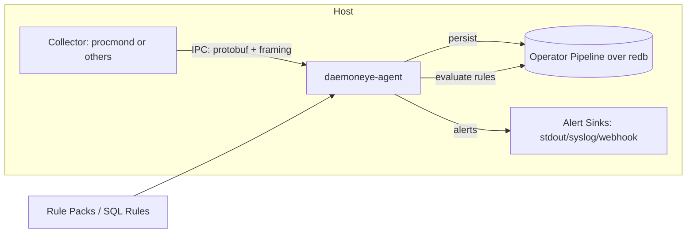
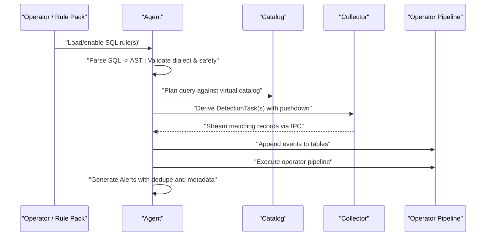
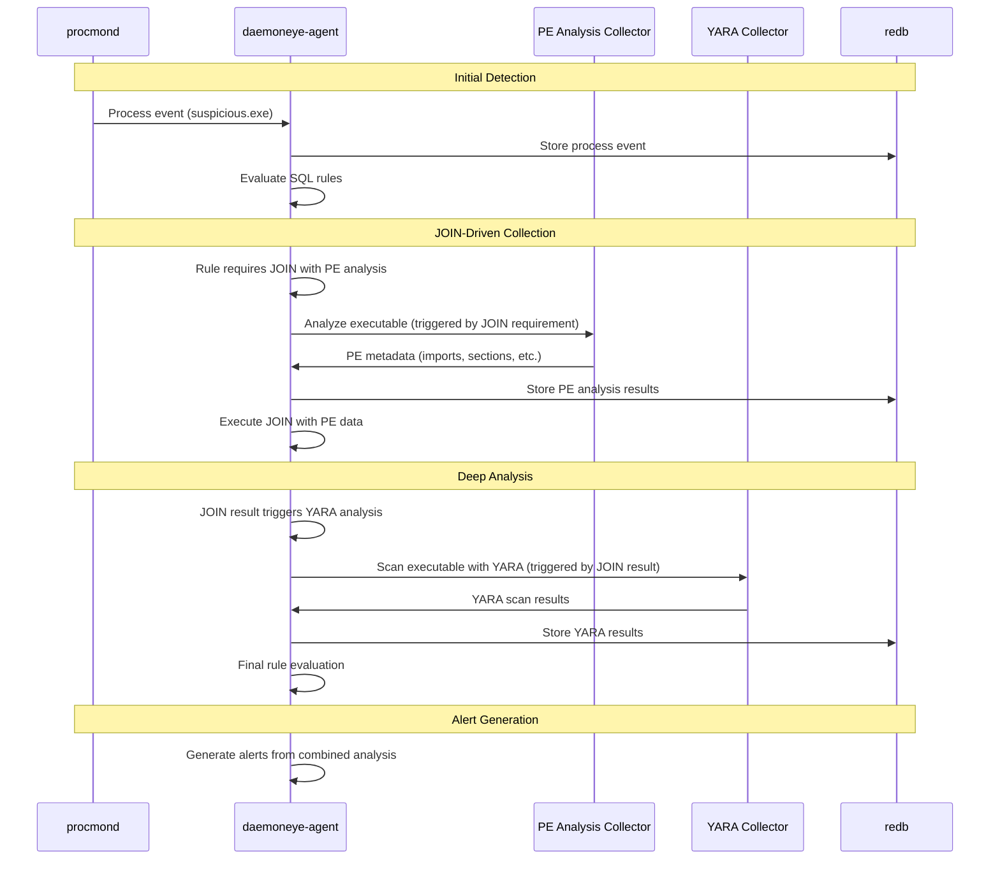

# DaemonEye Spec – SQL-to-IPC Detection Architecture

**Status:** Draft v0.2 **Owner:** EvilBit Labs / DaemonEye Team **Scope:** Collector–Agent contract for SQL-driven detection across stream + database layers **Applies To:** `procmond` (and other collectors), `daemoneye-agent`, `daemoneye-lib`, `daemoneye-cli`

---

## 1) Purpose & Non-Goals

**Purpose.** Define a precise model for how SQL rules are translated into collector instructions and evaluated to produce alerts. This spec standardizes the *SQL → IPC → storage → Alert* path so collectors and the agent evolve independently without breaking rules.

### Non-Goals

- Building a general RDBMS. The agent executes a constrained, read-only SQL dialect for detections.
- Requiring kernel hooks. Baseline collectors may be user-mode (e.g., `sysinfo`), with advanced sources added by tier (eBPF/ETW/EndpointSecurity).

---

## 2) Mental Model (Virtual Database)

Each collector contributes a **virtual schema**—logical, read-only tables backed by event streams. The agent exposes a **global catalog** (namespaced) used by rules. Examples:

- `processes.*` (e.g., `processes.snapshots`, `processes.events.exec`)
- `network.*` (e.g., `network.connections`)
- `kernel.*` (e.g., `kernel.image_loads`)

Collectors "insert" *records* into these tables by streaming IPC messages to the agent. The agent persists events in a **lightweight embedded store** and runs validated SQL rules over the persisted store **only when** the entire rule cannot be pushed down to the collector. If the collector's data exactly matches the rule result, it can be passed directly to the alert system without alteration (write-through).

**Audit Trail:** The collector is responsible for logging matches in the write-only audit log using the collector-core framework, independent of the agent's further analysis.

### Key Architectural Principles

- **Logical Views:** SQL rules are treated as logical views, not materialized tables
- **Pushdown Optimization:** Simple predicates and projections are pushed to collectors
- **Operator Pipeline:** Complex operations (joins, aggregations) execute in the agent's operator pipeline
- **Bounded Memory:** All operations use cardinality caps and time windows to prevent unbounded growth

---

## 3) End-to-End Flow



### Two Layers

1. **Stream Layer (IPC)** — Low-latency filtering; collectors push only the needed records.
2. **Operator Pipeline Layer** — SQL parsed into logical plans, mapped onto scan/query operators over redb. This enables joins, grouping, time windows, and dedupe.

---

## 4) Query Lifecycle & Pushdown



### Pushdown Rules

Agent derives from the AST:

- **Tables/aliases** → which collectors to engage
- **Columns** → projection list for each collector
- **Predicates** → pre-filter on collector side when feasible
- **Windows/Aggregations/Joins** → kept for the agent's operator pipeline

If a collector cannot pushdown a predicate, it sends its minimal projection and the agent filters on ingest.

---

## 4.1) Collector Schema Contract (Virtual Catalog)

### Purpose

Standardize how collectors announce their tables, columns, and pushdown capabilities so the agent can plan rules deterministically.

#### Descriptor (sent at startup & on change)

```json
{
  "collector_id": "<name>@<platform-arch>",
  "version": "semver",
  "tables": [
    {
      "name": "<domain>.<table>",
      "columns": {
        "col": "type[?]",
        "collection_time": "datetime"
      },
      "keys": {
        "primary": [
          "collection_time",
          "seq"
        ],
        "secondary": [
          "pid",
          "ppid",
          "name"
        ]
      },
      "join_hints": [
        {
          "left": "ppid",
          "right_table": "processes.snapshots",
          "right": "pid",
          "relation": "parent_of"
        }
      ],
      "pushdown": {
        "predicates": [
          "=",
          "!=",
          ">",
          "<",
          ">=",
          "<=",
          "IN",
          "LIKE",
          "REGEXP"
        ],
        "project": true,
        "order_by": [
          "collection_time"
        ],
        "limits": {
          "max_rate": 200000
        }
      }
    }
  ]
}
```

#### Agent Behavior

- Validates schema → registers/updates global catalog
- Unknown optional columns are ignored; missing required columns reject the table
- Capabilities become the upper bound for pushdown during planning

#### Evolution

- Additive columns allowed anytime
- Breaking changes require version bump and a deprecation grace period

#### Health & Metrics

Collectors MUST expose: send rate, drops, queue depth, last ACK seq_no, and schema version.

---

## 4.2) Minimum Contracts by Collector Type

These are the baseline tables/columns and pushdown minimums each collector must provide. Enterprise variants may add more columns, but the baseline must be stable.

### Processes Collector (procmond)

**Table:** `processes.snapshots`

**Required columns:** `pid:u32`, `ppid:u32?`, `name:string`, `executable_path:string?`, `command_line:string?`, `start_time:datetime?`, `executable_hash:hex256?`, `collection_time:datetime`

**Secondary keys (min):** `pid`, `ppid`, `name`, `executable_hash`

**Join hints:** `ppid -> processes.snapshots.pid` (parent_of)

**Pushdown (min):** `=`, `!=`, `IN`, `LIKE` (including `%` wildcards), `REGEXP`, projection; optional `> >= < <=` on numeric/time

#### Network Collector

**Table:** `network.connections`

**Required columns:** `pid:u32?`, `proto:enum{tcp,udp}`, `src_ip:ip`, `src_port:u16`, `dst_ip:ip`, `dst_port:u16`, `state:enum?`, `bytes_sent:u64?`, `bytes_recv:u64?`, `collection_time:datetime`

**Secondary keys (min):** `pid`, `dst_ip`, `dst_port`

**Join hints:** `pid -> processes.snapshots.pid`

**Pushdown (min):** equality on `proto`, IP/port, and `pid`; `LIKE` and `REGEXP` on IP addresses and ports; projection

#### Image/Module Load Collector

**Table:** `kernel.image_loads`

**Required columns:** `pid:u32?`, `image_path:string`, `image_hash:hex256?`, `collection_time:datetime`

**Secondary keys (min):** `pid`, `image_hash`

**Join hints:** `pid -> processes.snapshots.pid`

**Pushdown (min):** equality on `pid`, `image_hash`; `LIKE` and `REGEXP` on `image_path`; projection

#### File System Collector (optional baseline)

**Table:** `fs.events`

**Required columns:** `pid:u32?`, `op:enum{create,write,read,delete,rename}`, `path:string`, `size:i64?`, `collection_time:datetime`

**Secondary keys (min):** `pid`, `op`

**Pushdown (min):** equality on `op`, `pid`; `LIKE` and `REGEXP` on `path`; projection

#### Auth/Security Events Collector

**Table:** `security.auth`

**Required columns:** `user:string`, `host:string?`, `event:enum{logon,logoff,lock,unlock,auth_fail}`, `status:enum{success,fail}?`, `pid:u32?`, `collection_time:datetime`

**Secondary keys (min):** `user`, `event`

**Join hints:** `pid -> processes.snapshots.pid`

**Pushdown (min):** equality on `user`, `event`, `status`; `LIKE` and `REGEXP` on `user` and `host`; projection

#### General Requirements (All Collectors)

- **Clock:** timestamps MUST be monotonic per host; include `clock_skew_ms` in heartbeat
- **Sequence:** `seq_no` strictly increasing per `task_id`
- **Types:** adhere to documented scalar types; `?` denotes optional
- **Backpressure:** respect agent credits; cap local buffers; report drops with counters

#### Regex Implementation Requirements

All collectors MUST implement regex pattern matching with the following specifications:

- **Regex Engine:** Use a standard regex engine (e.g., Rust `regex` crate, RE2, PCRE)
- **Case Sensitivity:** Support both case-sensitive and case-insensitive matching via `(?i)` flag
- **Performance:** Regex operations MUST complete within 10ms per pattern for typical workloads
- **Memory Bounds:** Regex compilation and execution MUST be bounded to prevent DoS attacks
- **Error Handling:** Invalid regex patterns MUST be rejected with clear error messages
- **Compilation Caching:** Compiled regex patterns SHOULD be cached to improve performance

**Example Regex Patterns:**

```sql
-- Case-insensitive malware detection
WHERE name REGEXP '(?i)malware|trojan|virus'

-- IP address pattern matching
WHERE dst_ip REGEXP '^192\.168\.\d+\.\d+$'

-- File path pattern matching
WHERE path REGEXP '^/tmp/.*\.(exe|bat|cmd)$'

-- Process name with wildcards
WHERE name REGEXP '^[a-z]+\.exe$'
```

---

## 4.7) Complex Pattern Matching (YARA Integration)

### Purpose

Handle sophisticated pattern matching scenarios like YARA rules that don't fit the simple key-value pushdown model. This section defines how complex pattern matching integrates with the SQL-to-IPC architecture.

### YARA Integration Architecture

YARA rules represent a fundamentally different detection paradigm from SQL-based key-value predicates:

- **SQL-based rules**: Key-value predicates (`name = 'malware.exe'`, `cpu_usage > 80`)
- **YARA rules**: Complex pattern matching against file content, memory, or process attributes using strings, regex, and logical operators

### Integration Approach

The architecture handles YARA through the **"agent-only operations"** principle with specialized collectors:

#### 1. YARA Engine Collector

```json
{
  "collector_id": "yara-engine@linux-x86_64",
  "tables": [
    {
      "name": "yara.scan_results",
      "columns": {
        "file_path": "string",
        "rule_name": "string",
        "matches": "json", // Array of match objects
        "scan_time": "datetime",
        "file_hash": "hex256"
      },
      "pushdown": {
        "predicates": ["=", "!=", "IN"], // Only rule name filtering
        "project": true
      }
    }
  ]
}
```

#### 2. Hybrid Detection Patterns

The architecture supports **hybrid rules** that combine both approaches:

```sql
-- Complex rule combining simple filters + YARA results
SELECT p.pid, p.name, f.path, y.rule_name, y.matches
FROM processes.snapshots p
JOIN fs.events f ON f.pid = p.pid
JOIN yara.scan_results y ON y.file_path = f.path
WHERE p.name = 'rundll32.exe'           -- Simple pushdown
  AND f.path LIKE '/tmp/%'               -- Simple pushdown
  AND y.rule_name = 'suspicious_behavior' -- YARA result
  AND f.collection_time > datetime('now', '-30 minutes');
```

#### 3. YARA Rule Translation

**Original YARA:**

```yara
rule suspicious_behavior {
    strings:
        $s1 = "malware" nocase
        $s2 = /evil.*pattern/i
    condition:
        $s1 and $s2
}
```

**Becomes SQL:**

```sql
SELECT f.pid, f.path, y.matches
FROM fs.events f
JOIN yara.scan_results y ON y.file_path = f.path
WHERE y.rule_name = 'suspicious_behavior'
  AND f.op = 'write';
```

### Performance Considerations

#### Memory Management

- YARA scanning happens **per-file** in the collector
- Only **scan results** (not file content) stream to agent
- Agent stores lightweight YARA results in redb

#### Rate Limiting

- YARA scanning is CPU-intensive
- Collector can implement **sampling** for high-volume files
- Agent can **throttle** YARA scan requests

#### Storage Strategy

```rust
// YARA results stored efficiently in redb
struct YaraScanResult {
    file_path: String,
    rule_name: String,
    matches: Vec<YaraMatch>, // Compact match data
    scan_time: DateTime<Utc>,
    file_hash: [u8; 32],
}
```

### Implementation Path

1. **Extend Collector Interface** - Add YARA engine as specialized collector
2. **Agent-Side Integration** - YARA results become queryable tables
3. **Rule Authoring** - Operators write SQL that references YARA results
4. **Performance Tuning** - Sampling, caching, and rate limiting

### Key Benefits

✅ **Unified Interface** - YARA results queryable via SQL ✅ **Performance** - YARA scanning happens in collectors, not agent ✅ **Flexibility** - Combine YARA with other data sources ✅ **Scalability** - Bounded memory usage through sampling ✅ **Familiarity** - Operators use SQL, not YARA syntax

### Real-World Use Cases

- **File-based malware detection** - YARA rules against file content
- **Memory pattern matching** - YARA rules against process memory
- **Network traffic analysis** - eBPF programs for network payloads
- **Cross-correlation** - Combine YARA results with behavioral data

---

## 4.8) Supplemental Rule Data for Specialty Collectors

### Purpose

Define how specialized collectors (YARA, eBPF, ETW, etc.) handle their own rule formats and data types while integrating with the SQL-to-IPC architecture.

### Specialty Collector Requirements

Different security domains require specialized rule engines:

- **YARA Collectors** - File and memory pattern matching (cross-platform)
- **eBPF Collectors** - Network traffic analysis and kernel events (Linux)
- **Network Analysis Collectors** - Cross-platform network traffic analysis
- **Platform-Specific Collectors** - OS-native event sources (ETW, EndpointSecurity, etc.)

### Supplemental Rule Data Schema

Specialty collectors receive **supplemental rule data** alongside standard SQL pushdown:

```json
{
  "task_id": "t_9482",
  "rule_id": "r_network_anomaly",
  "table": "network.connections",
  "project": [
    "pid",
    "dst_ip",
    "dst_port",
    "payload_hash"
  ],
  "where": {
    "and": [
      {
        "eq": [
          "proto",
          "tcp"
        ]
      },
      {
        "gt": [
          "dst_port",
          1024
        ]
      }
    ]
  },
  "supplemental_rules": {
    "ebpf_program": {
      "type": "ebpf",
      "version": "1.0",
      "program": "base64_encoded_ebpf_bytecode",
      "maps": {
        "suspicious_ips": "BPF_MAP_TYPE_HASH",
        "port_stats": "BPF_MAP_TYPE_ARRAY"
      },
      "attachments": [
        {
          "hook": "xdp",
          "interface": "eth0",
          "priority": 100
        }
      ]
    }
  },
  "rate_limit": {
    "per_sec": 50000
  },
  "ttl_ms": 300000
}
```

### YARA Supplemental Rules

```json
{
  "supplemental_rules": {
    "yara_rules": {
      "type": "yara",
      "version": "4.3.0",
      "rules": [
        {
          "rule_name": "suspicious_behavior",
          "rule_content": "rule suspicious_behavior {\n  strings:\n    $s1 = \"malware\" nocase\n    $s2 = /evil.*pattern/i\n  condition:\n    $s1 and $s2\n}",
          "scan_targets": [
            "file_content",
            "memory_region"
          ],
          "scan_options": {
            "fast_scan": true,
            "timeout_ms": 1000
          }
        }
      ]
    }
  }
}
```

### Network Analysis Supplemental Rules

```json
{
  "supplemental_rules": {
    "network_analysis": {
      "type": "network_analysis",
      "version": "1.0",
      "analysis_type": "tcpdump_style",
      "filters": [
        {
          "protocol": "tcp",
          "port_range": [
            1024,
            65535
          ],
          "direction": "outbound"
        }
      ],
      "patterns": [
        {
          "name": "suspicious_payload",
          "pattern": "hex:41 42 43 44",
          "description": "Suspicious payload pattern"
        }
      ],
      "config": {
        "max_connections": 10000,
        "anomaly_threshold": 0.8,
        "time_window_ms": 60000,
        "platform": "auto_detect"
      }
    }
  }
}
```

### Collector-Core Framework Extensions

The collector-core framework needs to support:

#### 1. Rule Data Parsing

```rust
pub enum SupplementalRuleData {
    YaraRules {
        version: String,
        rules: Vec<YaraRule>,
        scan_options: YaraScanOptions,
    },
    NetworkAnalysis {
        version: String,
        analysis_type: NetworkAnalysisType,
        filters: Vec<NetworkFilter>,
        patterns: Vec<NetworkPattern>,
        config: NetworkAnalysisConfig,
    },
    PlatformSpecific {
        platform: String,        // "linux", "windows", "macos", "auto_detect"
        rule_type: String,       // "ebpf", "etw", "endpoint_security", etc.
        data: serde_json::Value, // Platform-specific rule data
    },
}
```

#### 2. Rule Execution Engine

```rust
pub trait SpecialtyRuleEngine {
    type RuleData;
    type ExecutionResult;

    async fn load_rules(&mut self, rules: Self::RuleData) -> Result<(), EngineError>;
    async fn execute_rules(&self, data: &[u8]) -> Result<Vec<Self::ExecutionResult>, EngineError>;
    async fn cleanup(&mut self) -> Result<(), EngineError>;
}

// Cross-Platform Network Analysis Engine
pub struct NetworkAnalysisEngine {
    platform: String,
    filters: Vec<NetworkFilter>,
    patterns: Vec<NetworkPattern>,
}

impl SpecialtyRuleEngine for NetworkAnalysisEngine {
    type RuleData = NetworkAnalysisConfig;
    type ExecutionResult = NetworkMatch;

    async fn load_rules(&mut self, config: NetworkAnalysisConfig) -> Result<(), EngineError> {
        // Load network analysis rules (platform-agnostic)
    }

    async fn execute_rules(&self, data: &[u8]) -> Result<Vec<NetworkMatch>, EngineError> {
        // Execute network analysis (adapts to platform capabilities)
    }
}
```

#### 3. Result Streaming

Specialty collectors stream results in a unified format:

```json
{
  "seq_no": 42,
  "task_id": "t_9482",
  "table": "network.analysis_results",
  "supplemental_type": "network_analysis",
  "platform": "linux",
  "record": {
    "connection_id": "conn_12345",
    "src_ip": "192.168.1.100",
    "dst_ip": "10.0.0.1",
    "dst_port": 8080,
    "protocol": "tcp",
    "pattern_matches": [
      {
        "pattern_name": "suspicious_payload",
        "offset": 1024,
        "length": 4,
        "data": "ABCD"
      }
    ],
    "analysis_time": "2025-01-20T15:30:00Z",
    "platform_capabilities": [
      "ebpf",
      "tcpdump",
      "netstat"
    ]
  }
}
```

### Integration with SQL Rules

Specialty collectors integrate seamlessly with SQL-based rules:

```sql
-- Cross-platform network analysis with process data
SELECT p.pid, p.name, n.dst_ip, n.dst_port, na.pattern_matches, na.platform
FROM processes.snapshots p
JOIN network.connections n ON n.pid = p.pid
JOIN network.analysis_results na ON na.connection_id = n.connection_id
WHERE na.pattern_matches IS NOT NULL
  AND p.name = 'suspicious_process.exe'
  AND n.collection_time > datetime('now', '-5 minutes')
  AND na.platform IN ('linux', 'windows', 'macos');

-- Combine YARA file analysis with process behavior (cross-platform)
SELECT p.pid, p.name, f.path, y.rule_name, y.matches, y.platform
FROM processes.snapshots p
JOIN fs.events f ON f.pid = p.pid
JOIN yara.scan_results y ON y.file_path = f.path
WHERE y.rule_name = 'malware_signature'
  AND f.op = 'create'
  AND p.cpu_usage > 50.0
  AND y.platform = 'auto_detect';
```

### Performance Considerations

#### Rule Loading and Caching

- **YARA Rules** - Compile and cache rules for fast scanning (cross-platform)
- **Network Analysis** - Load platform-appropriate analysis engines (eBPF on Linux, WinPcap on Windows, etc.)
- **Platform Detection** - Auto-detect platform capabilities and adapt rule execution
- **Cross-Platform Fallbacks** - Graceful degradation when platform-specific features unavailable

#### Resource Management

- **Memory Bounds** - Limit rule compilation and execution memory
- **CPU Limits** - Throttle specialty rule execution to prevent system impact
- **Timeout Handling** - Fail-safe timeouts for rule execution
- **Error Recovery** - Graceful degradation when specialty engines fail

#### Result Streaming

- **Batched Results** - Stream results in batches to reduce IPC overhead
- **Result Filtering** - Only stream results that match SQL pushdown criteria
- **Deduplication** - Avoid duplicate results from multiple rule engines
- **Correlation** - Maintain correlation IDs across different rule types

### Implementation Strategy

1. **Extend Collector-Core** - Add supplemental rule data support with platform detection
2. **Cross-Platform Engines** - Implement YARA, network analysis, and platform-specific engines
3. **Unified Interface** - Standardize result streaming format with platform metadata
4. **SQL Integration** - Make specialty results queryable via SQL with platform filtering
5. **Performance Tuning** - Optimize for high-throughput scenarios across platforms

---

## 4.9) Dynamic Reactive Pipeline (Non-DAG Architecture)

### Purpose

Define how the detection pipeline operates as a dynamic, reactive system where collector results can trigger additional analysis from other collectors, rather than a static DAG.

### Pipeline Characteristics

The SQL-to-IPC detection engine operates as a **reactive pipeline** where:

- **Initial Triggers** - Base collectors (procmond, network, fs) detect events
- **JOIN-Driven Collection** - SQL JOINs trigger collection of the second half of the join
- **Cascading Analysis** - Results from one collector trigger additional analysis
- **Dynamic JOINs** - Agent orchestrates cross-collector correlation based on JOIN requirements
- **Feedback Loops** - Results can trigger deeper analysis of the same data

### Reactive Analysis Flow



### Dynamic JOIN Examples

#### Example 1: JOIN-Driven PE Analysis

```sql
-- Rule with JOIN that triggers PE analysis collection
SELECT p.pid, p.name, pe.imports, pe.sections, pe.entry_point
FROM processes.snapshots p
JOIN pe.analysis_results pe ON pe.file_path = p.executable_path
WHERE p.name = 'suspicious.exe'
  AND pe.imports LIKE '%CreateRemoteThread%'
  AND pe.sections LIKE '%UPX%';

-- Agent execution flow:
-- 1. procmond provides process data (p.pid, p.name, p.executable_path)
-- 2. Agent parses SQL and sees JOIN with pe.analysis_results
-- 3. Agent triggers PE analysis collector for p.executable_path
-- 4. PE collector returns: imports, sections, entry_point, etc.
-- 5. Agent executes JOIN and evaluates WHERE conditions
-- 6. If match found, agent may trigger additional analysis (YARA, etc.)
```

#### Example 2: JOIN-Driven Process and Memory Analysis

```sql
-- Rule with JOINs that trigger process and memory analysis
SELECT n.connection_id, p.pid, p.name, m.memory_regions, m.patterns
FROM network.connections n
JOIN processes.snapshots p ON p.pid = n.pid
JOIN memory.analysis_results m ON m.pid = p.pid
WHERE n.anomaly_score > 0.8
  AND p.name = 'suspicious_process.exe'
  AND m.patterns LIKE '%shellcode%';

-- Agent execution flow:
-- 1. Network collector provides connection data (n.connection_id, n.anomaly_score)
-- 2. Agent parses SQL and sees JOIN with processes.snapshots
-- 3. Agent triggers process collector for n.pid
-- 4. Process collector returns: p.pid, p.name, p.executable_path, etc.
-- 5. Agent executes first JOIN and evaluates p.name condition
-- 6. Agent sees second JOIN with memory.analysis_results
-- 7. Agent triggers memory analysis collector for p.pid
-- 8. Memory collector returns: memory_regions, patterns, etc.
-- 9. Agent executes second JOIN and evaluates final WHERE conditions
```

### Agent Orchestration Logic

The agent implements **reactive orchestration** to manage cascading analysis:

#### 1. Trigger Detection

```rust
pub struct ReactiveOrchestrator {
    collectors: HashMap<String, Box<dyn Collector>>,
    trigger_rules: Vec<TriggerRule>,
    analysis_queue: VecDeque<AnalysisTask>,
}

pub struct TriggerRule {
    pub source_table: String,
    pub source_conditions: Vec<Condition>,
    pub target_collector: String,
    pub target_analysis: AnalysisType,
    pub priority: u8,
}

pub enum AnalysisType {
    PeAnalysis {
        file_path: String,
    },
    YaraScanning {
        file_path: String,
        rules: Vec<String>,
    },
    MemoryAnalysis {
        pid: u32,
        regions: Vec<MemoryRegion>,
    },
    NetworkDeepPacket {
        connection_id: String,
    },
}
```

#### 2. Cascading Analysis

```rust
impl ReactiveOrchestrator {
    async fn process_event(&mut self, event: StreamRecord) -> Result<(), OrchestrationError> {
        // Store initial event
        self.store_event(&event).await?;

        // Check for triggers
        for trigger in &self.trigger_rules {
            if self.matches_trigger(&event, trigger) {
                let analysis_task = self.create_analysis_task(&event, trigger)?;
                self.analysis_queue.push_back(analysis_task);
            }
        }

        // Process analysis queue
        self.process_analysis_queue().await?;

        // Re-evaluate rules with new data
        self.reevaluate_rules().await?;

        Ok(())
    }
}
```

#### 3. Dynamic JOIN Resolution

```rust
pub struct DynamicJoinResolver {
    base_tables: HashMap<String, TableSchema>,
    analysis_results: HashMap<String, Vec<AnalysisResult>>,
    join_hints: HashMap<String, Vec<JoinHint>>,
}

impl DynamicJoinResolver {
    async fn resolve_joins(&self, sql_plan: &LogicalPlan) -> Result<PhysicalPlan, JoinError> {
        let mut physical_plan = PhysicalPlan::new();

        for join in sql_plan.joins() {
            if let Some(analysis_result) = self.find_analysis_result(&join) {
                // Use pre-computed analysis result
                physical_plan.add_scan(analysis_result);
            } else {
                // JOIN requires collection of second half - trigger analysis
                let analysis_task = self.create_analysis_task_for_join(&join)?;
                self.trigger_analysis(analysis_task).await?;

                // Wait for analysis result and add to plan
                let result = self.wait_for_analysis_result(&analysis_task).await?;
                physical_plan.add_scan(result);
            }
        }

        Ok(physical_plan)
    }
}
```

### Performance Considerations

#### 1. Analysis Batching

- **Batch Triggers** - Group related analysis requests to reduce overhead
- **Priority Queuing** - Process high-priority analysis first
- **Rate Limiting** - Prevent analysis storms from overwhelming collectors

#### 2. Result Caching

- **Analysis Cache** - Cache analysis results to avoid redundant work
- **TTL Management** - Expire cached results based on data freshness
- **Cache Invalidation** - Invalidate cache when source data changes

#### 3. Resource Management

- **Analysis Limits** - Cap concurrent analysis operations
- **Memory Bounds** - Limit analysis result storage
- **Timeout Handling** - Fail analysis operations that take too long

### Implementation Strategy

1. **Reactive Orchestrator** - Implement agent-side orchestration logic
2. **Trigger Rules** - Define when and how to trigger additional analysis
3. **Analysis Queuing** - Manage analysis task queues and priorities
4. **Result Integration** - Seamlessly integrate analysis results into SQL queries
5. **Performance Optimization** - Implement caching, batching, and rate limiting

### Key Benefits

✅ **Deep Analysis** - Automatic escalation from simple to complex analysis ✅ **Context Awareness** - Analysis decisions based on current context ✅ **Efficient Resource Usage** - Only perform analysis when needed ✅ **Comprehensive Coverage** - Combine multiple analysis techniques ✅ **Operator Transparency** - SQL rules hide complexity of orchestration

---

## 4.10) Automatic JOIN Triggers (Implicit Correlation)

### Purpose

Define how SQL constructs can express automatic JOIN triggers where certain JOINs always cause collection of related data, enabling implicit correlation patterns.

### Automatic JOIN Trigger Syntax

SQL rules can specify **automatic JOIN triggers** using special syntax that tells the agent to always collect related data:

#### 1. Implicit Correlation with `AUTO JOIN`

```sql
-- Automatic network socket collection for processes
SELECT p.pid, p.name, n.dst_ip, n.dst_port, n.protocol
FROM processes.snapshots p
AUTO JOIN network.connections n ON n.pid = p.pid
WHERE p.name = 'suspicious.exe'
  AND n.dst_port > 1024;

-- Agent automatically triggers network collector for every process
-- No need to explicitly specify network collection in WHERE clause
```

#### 2. Conditional Auto-JOIN with `WHEN`

```sql
-- Only collect network data for suspicious processes
SELECT p.pid, p.name, n.dst_ip, n.dst_port
FROM processes.snapshots p
AUTO JOIN network.connections n ON n.pid = p.pid
WHEN p.name LIKE '%suspicious%' OR p.cpu_usage > 80.0
WHERE p.name = 'suspicious.exe';
```

#### 3. Multi-Table Auto-JOINs

```sql
-- Automatic correlation across multiple domains
SELECT p.pid, p.name, n.dst_ip, f.path, m.memory_regions
FROM processes.snapshots p
AUTO JOIN network.connections n ON n.pid = p.pid
AUTO JOIN fs.events f ON f.pid = p.pid
AUTO JOIN memory.analysis_results m ON m.pid = p.pid
WHERE p.name = 'malware.exe'
  AND n.dst_port = 4444
  AND f.path LIKE '%temp%'
  AND m.patterns LIKE '%shellcode%';
```

### Auto-JOIN Trigger Rules

The agent maintains **auto-JOIN trigger rules** that define when to automatically collect related data:

#### 1. Process → Network Auto-JOIN

```rust
pub struct AutoJoinRule {
    pub source_table: String,
    pub target_table: String,
    pub join_condition: JoinCondition,
    pub trigger_conditions: Vec<Condition>,
    pub priority: u8,
}

// Example: Always collect network data for processes
let process_network_rule = AutoJoinRule {
    source_table: "processes.snapshots".to_string(),
    target_table: "network.connections".to_string(),
    join_condition: JoinCondition::EquiJoin("pid".to_string(), "pid".to_string()),
    trigger_conditions: vec![
        Condition::Always, // Always trigger for processes
    ],
    priority: 1,
};
```

#### 2. Network → Process Auto-JOIN

```rust
// Example: Always collect process data for network connections
let network_process_rule = AutoJoinRule {
    source_table: "network.connections".to_string(),
    target_table: "processes.snapshots".to_string(),
    join_condition: JoinCondition::EquiJoin("pid".to_string(), "pid".to_string()),
    trigger_conditions: vec![
        Condition::Always, // Always trigger for network connections
    ],
    priority: 1,
};
```

#### 3. Conditional Auto-JOIN Rules

```rust
// Example: Only collect PE analysis for suspicious processes
let pe_analysis_rule = AutoJoinRule {
    source_table: "processes.snapshots".to_string(),
    target_table: "pe.analysis_results".to_string(),
    join_condition: JoinCondition::EquiJoin("executable_path".to_string(), "file_path".to_string()),
    trigger_conditions: vec![
        Condition::ColumnLike("name".to_string(), "%suspicious%".to_string()),
        Condition::ColumnGt("cpu_usage".to_string(), 80.0),
        Condition::ColumnLike("executable_path".to_string(), "%.exe".to_string()),
    ],
    priority: 2,
};
```

### Agent Auto-JOIN Orchestration

The agent implements **automatic JOIN orchestration** to manage auto-JOIN triggers:

#### 1. Auto-JOIN Detection

```rust
pub struct AutoJoinOrchestrator {
    auto_join_rules: Vec<AutoJoinRule>,
    active_collections: HashMap<String, Vec<CollectionTask>>,
    correlation_cache: HashMap<String, CorrelationResult>,
}

impl AutoJoinOrchestrator {
    async fn process_event(&mut self, event: StreamRecord) -> Result<(), OrchestrationError> {
        // Store initial event
        self.store_event(&event).await?;

        // Check for auto-JOIN triggers
        for rule in &self.auto_join_rules {
            if self.matches_auto_join_trigger(&event, rule) {
                let collection_task = self.create_auto_join_task(&event, rule)?;
                self.trigger_auto_join_collection(collection_task).await?;
            }
        }

        // Process auto-JOIN results
        self.process_auto_join_results().await?;

        Ok(())
    }
}
```

#### 2. Auto-JOIN Result Integration

```rust
impl AutoJoinOrchestrator {
    async fn integrate_auto_join_results(&mut self, base_event: &StreamRecord) -> Result<(), OrchestrationError> {
        // Find all auto-JOIN results for this base event
        let auto_join_results = self.get_auto_join_results(base_event).await?;

        // Create virtual joined record
        let joined_record = self.create_virtual_joined_record(base_event, &auto_join_results)?;

        // Store joined record for SQL evaluation
        self.store_joined_record(joined_record).await?;

        Ok(())
    }
}
```

### SQL Syntax Extensions

#### 1. AUTO JOIN Syntax

```sql
-- Basic auto-JOIN
SELECT p.pid, p.name, n.dst_ip
FROM processes.snapshots p
AUTO JOIN network.connections n ON n.pid = p.pid;

-- Conditional auto-JOIN
SELECT p.pid, p.name, n.dst_ip
FROM processes.snapshots p
AUTO JOIN network.connections n ON n.pid = p.pid
WHEN p.name LIKE '%suspicious%';

-- Multiple auto-JOINs
SELECT p.pid, p.name, n.dst_ip, f.path
FROM processes.snapshots p
AUTO JOIN network.connections n ON n.pid = p.pid
AUTO JOIN fs.events f ON f.pid = p.pid;
```

#### 2. Implicit Correlation Syntax

```sql
-- Implicit correlation - agent automatically collects related data
SELECT p.pid, p.name, n.dst_ip, f.path, m.memory_regions
FROM processes.snapshots p
WHERE p.name = 'malware.exe'
  AND n.dst_port = 4444        -- Implicit: collect network data
  AND f.path LIKE '%temp%'     -- Implicit: collect file system data
  AND m.patterns LIKE '%shellcode%'; -- Implicit: collect memory data
```

### Performance Considerations

#### 1. Auto-JOIN Optimization

- **Lazy Collection** - Only collect auto-JOIN data when SQL rules require it
- **Batch Collection** - Group multiple auto-JOIN requests to reduce overhead
- **Result Caching** - Cache auto-JOIN results to avoid redundant collection
- **Priority Queuing** - Process high-priority auto-JOINs first

#### 2. Resource Management

- **Collection Limits** - Cap concurrent auto-JOIN collections
- **Memory Bounds** - Limit auto-JOIN result storage
- **Timeout Handling** - Fail auto-JOIN collections that take too long
- **Circuit Breaking** - Stop auto-JOIN collections when system is overloaded

### Implementation Strategy

1. **SQL Parser Extensions** - Add AUTO JOIN and implicit correlation syntax
2. **Auto-JOIN Rules Engine** - Implement rule-based auto-JOIN triggering
3. **Collection Orchestration** - Manage automatic data collection
4. **Result Integration** - Seamlessly integrate auto-JOIN results into SQL evaluation
5. **Performance Optimization** - Implement caching, batching, and rate limiting

### SQL Parser Extensibility

The `sqlparser` crate can be extended to support custom predicates like `AUTO JOIN` and `WHEN` clauses by implementing a custom SQL dialect that extends the standard SQLite dialect:

```rust
pub struct DaemonEyeDialect {
    base: SQLiteDialect,
    extensions: DaemonEyeExtensions,
}

impl Dialect for DaemonEyeDialect {
    fn is_identifier_start(&self, ch: char) -> bool {
        self.base.is_identifier_start(ch)
    }

    fn is_identifier_part(&self, ch: char) -> bool {
        self.base.is_identifier_part(ch) || ch == '_'
    }

    fn supports_filter_during_aggregation(&self) -> bool {
        self.base.supports_filter_during_aggregation()
    }
}
```

This approach maintains full SQLite dialect compatibility while adding DaemonEye-specific features, enabling automatic JOIN triggers and implicit correlation without forking the parser.

### Key Benefits

✅ **Implicit Correlation** - Automatic collection of related data without explicit JOINs ✅ **Simplified SQL** - Operators write simpler rules with automatic correlation ✅ **Performance** - Only collect data when needed by SQL rules ✅ **Flexibility** - Configurable auto-JOIN rules for different use cases ✅ **Transparency** - SQL rules hide complexity of automatic correlation

---

## 9) Storage & Execution Model

### 11.1 Why Not a Full RDBMS?

- Embedded SQL engines like SQLite are heavyweight, require unsafe code, and don't align with the zero-network, operator-focused design.
- **redb** was initially considered, but it is a key-value store, not a relational engine.

### 11.2 Chosen Approach: Operator Pipeline

- Parse SQL using `sqlparser` (SQLite dialect).
- Translate AST → internal logical plan → chain of operators (scan, filter, project, join, aggregate).
- Execute operators directly against **redb**.
- Support streaming ingestion with append-only tables + time-indexed keys.

### 11.3 Store Abstraction

- **KV API:** `put(key, value)`, `scan(range)`, `iter(prefix)`.
- **Indexing:** time-based and ID-based composite keys.
- **Pluggability:** abstracted storage API, but redb is the canonical backend.

### 11.4 Operator Examples

- **Scan**: Iterate table prefix → yield rows.
- **Filter**: Apply predicate closures from AST.
- **Project**: Yield only selected columns.
- **Join**: Nested loop or hash join across KV scans.
- **Aggregate**: Group-by implemented with temporary hash maps.

### 11.5 Smart Joins (No Mandatory Time Window)

We support joins without *requiring* time windows, while still keeping memory and latency bounded. The agent uses a mix of data layout, indexes, and bounded state to execute joins predictably.

#### Minimal Executor Plan Requirements

- **Time Windows:** Require explicit time windows for aggregations to bound memory usage; joins use cardinality caps instead.
- **Index Strategy:** Index hot keys (`name`, `pid`, `ppid`, `exe_hash`) and primary key by `(ts, seq)` for efficient range scans and lookups.
- **Bounded Operations:** Implement bounded hash-group and equi-join (parent/child) with per-rule memory caps to prevent unbounded growth.
- **Pattern Matching:** Require collectors to support `LIKE` (including `%` wildcards) and `REGEXP` operations for pushdown; complex patterns that can't be pushed down execute in the agent's operator pipeline.
- **Function Allow-list:** Maintain a strict allow-list of functions with a pushdown matrix (collector vs agent) to control what operations can be executed where.

#### Join Scope & Keys

- Only **equi-joins** on declared keys (e.g., `pid`, `ppid`, `exe_hash`, `image_base`).
- Joinable keys are declared in the **catalog** per table with optional *join hints* (e.g., `parent_of: processes.snapshots.ppid -> processes.snapshots.pid`).

#### Physical Strategies

1. **Index Nested-Loop (INLJ)** *(default, selective)*

   - Build side: the smaller/filtered input (chosen by predicate selectivity heuristics).
   - Probe side: use secondary index on the join key to fetch matches.
   - Complexity ~ O(n log m). Great when filters make one side small.

2. **Bounded Symmetric Hash Join (SHJ)** *(for concurrent streams or large intermediate)*

   - Hash both sides in **bounded** LRU maps keyed by join key.
   - Evict by **cardinality budget** (e.g., max 100k keys) rather than time; evictions counted for diagnostics.
   - Optional *soft time hint* improves locality but is not required.

3. **Materialized Relation Cache (MRC)** *(parent/child fast path)*

   - Maintain a compact map (e.g., `pid → {ppid, parent_name, start_time}`) updated on ingest.
   - Parent/child joins collapse to single keyed lookup; avoids scanning the parent side entirely.

#### Bounding Without Time Windows

- **Cardinality Caps:** per-join memory budget (keys + rows per key). Default caps are configurable per tier.
- **Backpressure Aware:** if caps are reached, switch from SHJ → INLJ automatically and emit a **JOIN_PARTIAL** metric.
- **Spill to KV (optional):** oversize hash partitions spill to a KV-backed scratch area with capped size.

#### Selectivity & Planning Heuristics

- Prefer INLJ when the planner sees highly selective predicates on one side (e.g., `name = 'rundll32.exe'`).
- Prefer SHJ when both sides are similarly sized after filters.
- Prefer MRC whenever a declared parent/child mapping exists.

#### Late / Missing Matches

- **Deferred Match Window:** unmatched rows are retained in a tiny pending set (by join key) for a short grace period to catch late-arriving counterparts.
- **Emissions:** For LEFT JOINs, emit `NULL`-extended rows immediately; if a late match appears, emit a correction event with a `correlation_id` (Enterprise-only feature) or keep the LEFT result authoritative (Community).

#### Diagnostics & Guarantees

- Emit counters: `join_plan_selected`, `join_evictions`, `join_spills`, `join_partial_results`.
- Hard guarantees: joins complete with bounded memory; if limits are exceeded, results may be partial but are **never unbounded**.

#### Spec Examples

- `JOIN ON c.ppid = p.pid` → MRC fast path (if parent map enabled); else INLJ with `idx:pid`.
- `JOIN ON c.exe_hash = b.sha256` → INLJ with `idx:sha256`; SHJ if both sides large.

### 11.6 Write-Through & Persistence Semantics

#### Goals

Durability, dedupe, and consistent alerting across all paths (pushdown-only, joins, and aggregations).

#### 5.6.1 Ingest Transaction (all events)

On every IPC `StreamRecord`:

1. **Validate & normalize** (schema check, required fields, ts monotonicity).
2. **Append to redb base table** (`events`) **and** update secondary indexes (e.g., `idx:pid`, `idx:name`).
3. **ACK to collector** *after* redb commit (at-least-once delivery; idempotent via `(task_id, seq_no)`).

> Rationale: ACK-after-commit guarantees we never alert on data we didn't persist.

#### 5.6.2 No-Join Path (pushdown-only rules)

If the active rule plan requires **no join/aggregation** (pure filter/project):

- Evaluate predicate on the just-ingested row.
- If it matches, compute the **dedupe key** and consult the per-rule dedupe cache.
- **Emit alert** to sinks immediately and also **append an Alert row** to `alerts.events` in redb.
- The original event row is already persisted via 5.6.1; no extra writes needed.

**Data Flow:** `IPC → redb(events) → (predicate) → alerts.sinks & redb(alerts)`

#### 5.6.3 Join Path

When a rule involves a **JOIN**:

- After ingest (5.6.1), the pipeline executes the selected join strategy (INLJ/SHJ/MRC) **over redb + in-memory state**.
- Join **results are not materialized** as a table; they are ephemeral tuples.
- If the joined tuple satisfies remaining predicates, we dedupe and **emit an alert** and **append** to `alerts.events`.
- Optional (Enterprise): for troubleshooting, store a **compact correlation record** in `alerts.correlations` with `correlation_id`, join key, and pointers to base rows.

**Data Flow:** `IPC → redb(events) → (join over base + indexes) → alerts.sinks & redb(alerts[, correlations])`

#### 5.6.4 Aggregation Path

For `GROUP BY/HAVING` rules:

- Maintain **in-memory hash aggregates** keyed by `GROUP BY` columns; periodically flush snapshots to `agg.state` (redb) for recovery.
- On **HAVING** satisfaction transitions (e.g., `count > 50`), emit alert and append to `alerts.events`.
- Aggregation **requires either** an explicit time window **or** a configured default window to bound state.

#### 5.6.5 Idempotence & Dedupe

- **Ingest idempotence:** `(task_id, seq_no)` forms the write id; duplicates are discarded.
- **Alert dedupe:** per-rule configurable key (e.g., `(name, executable_path, host, window)`), with TTL.

#### 5.6.6 Crash Safety

- Ingest commit is atomic; on restart, rebuild secondary indexes if needed.
- Aggregation state restored from `agg.state` snapshots.
- MRC (parent map) rebuilt by scanning a bounded recent window or incrementally from persisted events.

#### 5.6.7 Materialization Policy

**Core Principle:** Treat every rule as a logical view. Store the parts (base tables + minimal derived state), not the fully realized join results.

#### What We Persist (Always)

- **Base event tables** per collector (e.g., `processes.events`, `image_loads.events`) plus their secondary indexes (`idx:pid`, `idx:name`, `idx:sha256`).
- **Alert log** (`alerts.events`) with rule ID, dedupe key, pointers to source rows (table name + `(ts,seq)`).
- **Operator state** required for correctness/recovery:
  - Aggregation snapshots (`agg.state`) for `GROUP BY/HAVING`.
  - MRC (materialized relation cache) for fast parent/child (e.g., `pid → {ppid,parent_name,start_time}`), rebuilt on startup if missing.

#### What We Do Not Persist (By Default)

- **Materialized join outputs** ("the realized view"). These are computed on-demand in the operator pipeline, used to trigger alerts, then discarded.

#### Why (Trade-offs)

- **Space & Simplicity:** Join results can blow up; persisting them multiplies storage & compaction work.
- **Freshness:** On-demand joins always reflect current base data + indexes; no staleness/refresh logic.
- **Traceability:** The alert record holds stable pointers to the exact base rows used, so you can reconstruct the join later if needed.

#### When We Do Persist Derived Artifacts (Narrow Cases)

- **Enterprise Debugging** (optional feature flag): Write a compact `alerts.correlations` record: `{correlation_id, rule_id, join_key, left_ref, right_ref, summary_fields}`. This is tiny (refs + a few columns) and helps "show your work" without saving the full joined row.
- **Hot-path Speed-ups** (opt-in):
  - Keep the MRC always; it's small and removes the most common parent/child joins.
  - If a specific, high-volume rule is expensive, allow materialized view snapshots with a strict TTL/window (e.g., last 5 minutes) and caps. This is operationally a cache, not a source of truth.

#### Redb Schema (Concrete)

- `processes.events` (primary table; key `(ts_ms, seq)` → value payload)
- `processes.idx:pid` (multimap: `pid → (ts_ms, seq)`)
- `image_loads.events`, `image_loads.idx:image_base`, etc.
- `alerts.events` (append-only)
- `alerts.correlations` (optional, compact)
- `agg.state` (aggregation snapshots)
- `mrc.parent_map` (`pid → {ppid,parent_name,start_time}`)

### 11.7 redb Performance Playbook

#### Core Strategy

Partition by time, use fixed-width keys, build selective secondary indexes, and leverage set-based intersections instead of row scans.

#### 5.7.1 Physical Layout & Key Encoding

**Partitioning Strategy:**

- **Partitions:** One base table per logical source per time bucket:
  - `processes.events@2025-09-22` (daily) or `@2025-09-22T14` (hourly for very chatty tables)
- **Primary Key:** `(ts_ms: u64, seq: u32)` (16 bytes) — strictly increasing; great locality
- **Value:** Compact, fixed-field struct (postcard/bincode with version byte) — avoid big strings
- **Secondary Indexes** (multimap tables) inside the same bucket:
  - `idx:pid` `(pid: u32)` → `(ts_ms, seq)`
  - `idx:ppid` `(ppid: u32)` → `(ts_ms, seq)`
  - `idx:name` `(lower(name_hash128))` → `(ts_ms, seq)` ← store hash; keep optional "catalog" for top offenders
  - `idx:exe_hash` `(sha256_prefix: u128)` → `(ts_ms, seq)`
  - Optional: `idx:path_prefix` `(prefix_hash)` → `(ts_ms, seq)` for `LIKE 'C:\\Windows\\%'`

**Why This Works:**

- Partitioning makes every range scan small (a few MBs vs GBs)
- Keys are fixed-width, so B-tree pages pack densely
- Secondaries don't store copies of the row—just a 16-byte pointer back to `(ts,seq)`

#### 5.7.2 Query Planning = Index Math, Not Scans

**Planning Strategy:**

- **Time First:** Every plan starts by resolving the time window to one or more partitions and narrowing to key range `(t_start..t_end)`
- **Driving Index:** Pick by estimated selectivity (track simple histograms: cardinality and last-N counts per index)
- **Set-Based Intersections:** Intersect posting lists in memory:
  - Example: `WHERE name='x' AND pid IN (…) AND ts BETWEEN …`
  1. `L1 = fetch(idx:name['x'])` (already time-bounded because postings are `(ts,seq)`)
  2. `L2 = union(fetch(idx:pid[p1]), fetch(idx:pid[p2]) …)`
  3. `L = intersect_sorted(L1, L2)` ← both lists are sorted by `ts,seq`
  4. **Early LIMIT:** If rule has LIMIT or only need K rows for join/agg, stop early
- **Pattern Matching:**
  - **Prefix LIKE** (`LIKE 'foo%'`): use `idx:path_prefix` (hash of normalized prefix)
  - **Contains LIKE/REGEXP:** agent-only; use driving index to pre-shrink candidate set, then evaluate on row

#### 5.7.3 Writer Architecture (High Throughput, Minimal Stalls)

**Single Writer Design:**

- **Single writer thread** bound to core; group commit every N=2,000 records or T=5–10ms, whichever first
- **Pipeline:** IPC → lock-free MPSC → pre-serialized ring buffer → writer does only:
  - (a) put to base
  - (b) put to secondaries
  - (c) commit
- **Readers:** MVCC snapshots; no writer stalls reads
- **Batch APIs:** Each transaction inserts base + all secondaries for the same batch to keep B-tree hot and minimize page churn
- **ACK After Commit:** Safe and still fast because we commit in groups

#### 5.7.4 Small Caches That Matter

**Targeted Caching:**

- **Posting-List Page Cache:** Tiny LRU (64–256 MB) keyed by `(index, bucket, term)` → compressed list of `(ts,seq)`
  - Only cache lists we actually intersect often (name, exe_hash, top 1k pids)
- **Parent Map (MRC):** `pid → {ppid, parent_name, start_time}` in lock-free map, rebuilt on start from last K minutes
  - Parent/child join becomes one lookup; obliterates most common join cost
- **Plan Cache:** SQL AST → plan with bound indexes for current stats window; revalidate every X seconds or on stats drift

#### 5.7.5 Joins Without Pain (Applied to redb)

**Join Strategies:**

- **INLJ (default):** Drive from selective side; probe other via secondary index → `(ts,seq)` list → single fetch per match
- **SHJ (bounded):** Only if both sides remain big after filters; cap keys + rows-per-key; optional spill to scratch table in same bucket (capped)
- **MRC:** Take the win when `ON c.ppid=p.pid`—no need to touch B-tree for parent

#### 5.7.6 Index Maintenance & Hygiene

**Index Management:**

- **Index Budget:** Per table (4–6 secondaries). Every added index justified by rule pack
- **Cold Indexes:** If rule disappears, mark index "cold" and skip updating until re-enabled
- **Partition TTL:** Configurable retention (7–30 days community; 90+ enterprise). Dropping old partitions is O(1) drop of handful of tables
- **Checkpoints:** Periodic redb checkpoints to release old pages (copy-on-write housekeeping)
- **Backfill Path:** If secondary added later, job scans only hot partitions first, then cold ones overnight

#### 5.7.7 Tunables (Sane Defaults)

**Configuration Parameters:**

- `partition_kind = hourly` if > ~2M events/day; else daily
- `writer_batch_records = 2,000`, `writer_batch_ms = 7`
- `posting_cache_bytes = 128MiB`
- `mrc_window = 30m`, rebuild on start within 2–5s
- `join_cardinality_cap = 100k keys`, `rows_per_key_cap = 64`
- `idx_budget_per_table = 6`
- `contains_like_max_scan = 10k rows` (fail-safe)

#### 5.7.8 Key Encoding (Concrete)

```rust
// Primary key: 16 bytes
#[repr(C, packed)]
struct RowKey {
    ts_ms: u64,
    seq: u32,
    pad: u32,
}

// Secondary key example: name (hash) + ts to keep postings sorted by time
#[repr(C, packed)]
struct NameIdxKey {
    name_hash128_hi: u64,
    name_hash128_lo: u64,
    ts_ms: u64,
    seq: u32,
}
```

- Never store whole name/path in secondary key—just stable hash
- Collisions are fine; verify on primary row during filter evaluation

#### 5.7.9 Why This Will Be Fast Enough

**Performance Guarantees:**

- Every operation is range scan over tiny partition or seek + short linear walk through posting list
- Group commit amortizes fsync cost
- Set intersections cut candidate sets down to thousands → tens, not millions
- MRC deletes the common join
- Readers are zero-copy; writer doesn't block them

**Example:**

```sql
SELECT c.pid, c.name, p.name AS parent
FROM processes.snapshots c
LEFT JOIN processes.snapshots p ON p.pid = c.ppid
WHERE c.name = 'rundll32.exe';
```

**Execution:**

1. Ingest `c` into `processes.events` + indexes.
2. Join via MRC (fast path) or `idx:pid` (INLJ).
3. If it matches, emit alert to `alerts.events` with refs:
   - `left_ref = ("processes.events", (ts_c, seq_c))`
   - `right_ref = ("processes.events", (ts_p, seq_p))` (if found)
4. No persisted "joined row". Optional: write tiny `alerts.correlations` with `join_key = c.ppid`.

### 4.3) Rule Lifecycle & Management

#### Rule Loading & Registration

- **Rule Packs:** Collections of related SQL rules with metadata (version, author, description)
- **Hot Reloading:** Rules can be added/removed/updated without agent restart
- **Validation:** AST parsing and safety checks before activation
- **Dependency Resolution:** Rule dependencies on specific collector capabilities

#### Rule States & Transitions

- **Draft** → **Active** → **Disabled** → **Archived**
- **Versioning:** Rule changes create new versions with deprecation periods
- **Rollback:** Ability to revert to previous rule versions
- **A/B Testing:** Support for running multiple rule versions simultaneously

#### Rule Metadata

```json
{
  "rule_id": "r_process_name_exact",
  "version": "1.2.0",
  "name": "Suspicious Process Detection",
  "description": "Detects processes with known malicious names",
  "author": "security-team",
  "created": "2025-01-15T10:30:00Z",
  "updated": "2025-01-20T14:22:00Z",
  "tags": [
    "malware",
    "processes",
    "high-priority"
  ],
  "dependencies": {
    "collectors": [
      "procmond"
    ],
    "tables": [
      "processes.snapshots"
    ],
    "capabilities": [
      "pushdown_predicates",
      "projection"
    ]
  },
  "performance": {
    "expected_matches_per_hour": 10,
    "memory_footprint_mb": 5,
    "cpu_impact_percent": 0.1
  }
}
```

### 4.4) Error Handling & Recovery

#### Collector Failure Scenarios

- **Connection Loss:** Agent detects collector disconnection, marks tables as unavailable
- **Schema Mismatch:** Version incompatibility between agent and collector schemas
- **Rate Limiting:** Collector exceeds configured rate limits, triggers backpressure
- **Data Corruption:** CRC32 validation failures, sequence number gaps

#### Recovery Procedures

- **Automatic Reconnection:** Exponential backoff with jitter for collector reconnection
- **Schema Reconciliation:** Agent requests updated schema descriptors on reconnection
- **Data Consistency:** Replay of missed events from last known good sequence number
- **Graceful Degradation:** Continue operation with reduced collector capabilities

#### Error Codes & Responses

```json
{
  "error_code": "COLLECTOR_SCHEMA_MISMATCH",
  "severity": "ERROR",
  "message": "Collector schema version 2.1.0 incompatible with agent version 2.0.0",
  "recovery_action": "REQUEST_SCHEMA_UPDATE",
  "affected_tables": [
    "processes.snapshots"
  ],
  "timestamp": "2025-01-20T15:30:00Z"
}
```

### 4.5) Configuration & Discovery

#### Collector Discovery

- **Service Discovery:** Agents discover collectors via local service registry or configuration
- **Capability Negotiation:** Mutual verification of supported features and versions
- **Load Balancing:** Multiple collectors of same type with health-based routing
- **Failover:** Automatic failover to backup collectors on primary failure

#### Configuration Management

- **Hierarchical Config:** System → Agent → Rule → Collector level configuration
- **Environment Variables:** Override configuration via environment variables
- **Hot Reloading:** Configuration changes without service restart
- **Validation:** Configuration schema validation with detailed error messages

#### Health Monitoring

- **Collector Health:** Heartbeat monitoring with configurable timeouts
- **Performance Metrics:** Throughput, latency, error rates per collector
- **Resource Usage:** Memory, CPU, disk usage tracking
- **Alert Generation:** Health check failures trigger operational alerts

### 4.6) Monitoring & Observability

#### Metrics Collection

- **Rule Execution:** Rule evaluation latency, match rates, error counts
- **Collector Performance:** IPC message rates, serialization time, queue depths
- **Storage Operations:** redb write latency, index maintenance time, compaction stats
- **Alert Delivery:** Sink success rates, retry counts, delivery latency

#### Observability Endpoints

- **Health Check:** `/health` - Overall system health status
- **Metrics:** `/metrics` - Prometheus-format metrics export
- **Debug Info:** `/debug` - Detailed system state for troubleshooting
- **Schema Status:** `/catalog` - Current collector schema registry

#### Logging Standards

- **Structured Logging:** JSON format with consistent field names
- **Log Levels:** ERROR, WARN, INFO, DEBUG with appropriate filtering
- **Correlation IDs:** Request tracing across collector → agent → storage
- **Sensitive Data:** Automatic redaction of credentials and PII

---

## 10) Implementation Guide

### 11.1 Architecture Overview

The SQL-to-IPC detection engine operates through a two-layer architecture:

1. **Stream Layer (IPC)** - Low-latency filtering where collectors push only needed records
2. **Operator Pipeline Layer** - SQL parsed into logical plans, executed over redb for joins/aggregations

### 11.2 Key Implementation Components

- **SQL Parser** - `sqlparser` for SQLite dialect parsing and AST generation
- **Pushdown Planner** - Analyzes AST to determine what can be pushed to collectors
- **Operator Pipeline** - Executes complex operations (joins, aggregations) over redb
- **Storage Engine** - redb-based storage with secondary indexes and partitioning
- **Alert System** - Deduplication, correlation, and multi-channel delivery

### 11.3 Development Workflow

1. **Rule Authoring** - Write SQL rules using familiar syntax
2. **Schema Registration** - Collectors announce capabilities to agent
3. **Query Planning** - Agent determines pushdown vs. pipeline execution
4. **Execution** - Stream processing with bounded memory and time windows
5. **Alerting** - Generate and deliver alerts with full traceability

---

## 11) IPC Message Contracts

### 11.1 DetectionTask (Agent → Collector, IPC)

- **Identity:** `task_id`, `rule_id`, `version`
- **Scope:** target table(s), projection, simple predicates
- **Hints:** sampling/Top-K, rate caps, backpressure window
- **TTL:** expiry or explicit cancel

**Example:**

```json
{
  "task_id": "t_9482",
  "rule_id": "r_process_name_exact",
  "table": "processes.snapshots",
  "project": [
    "pid",
    "name",
    "executable_path",
    "cpu_usage",
    "collection_time"
  ],
  "where": {
    "and": [
      {
        "eq": [
          "name",
          "minidump.exe"
        ]
      },
      {
        "gt": [
          "cpu_usage",
          0.0
        ]
      }
    ]
  },
  "rate_limit": {
    "per_sec": 25000
  },
  "ttl_ms": 600000
}
```

### 11.2 StreamRecord (Collector → Agent, IPC)

- Envelope: `{ seq_no, task_id, table, checksum, record }`
- Record is a typed row matching the advertised schema; unknown columns are rejected with metrics.

### 11.3 Persistence & Query (Agent-Side)

- **Write path:** append-only into redb tables with periodic checkpoints.
- **Read path:** prepared, read-only statements from the rule engine with timeouts and memory quotas.
- **Dedupe:** rule-scoped dedupe key to avoid alert storms.

---

## 12) SQL Dialect (Constrained)

### 11.1 Dialect Rationale

> **Important:** We **do not embed SQLite**. We only use the **SQLite dialect** for rule authoring and parsing. The agent parses rules with `sqlparser`, constructs an internal logical plan, and then:
>
> 1. **pushes down** projections/predicates to collectors, and 2) executes any remaining logic against the **operator pipeline over redb**.

We use the **SQLite dialect** as implemented in `sqlparser`. Reasons:

- **Simplicity:** SQLite grammar is small and easy to validate.
- **Operator Familiarity:** Most security engineers have at least basic SQL knowledge; SQLite syntax feels natural.
- **Implementation Support:** `sqlparser` offers stable support for SQLite, reducing parser complexity.
- **Constrained Surface:** Limits scope compared to Postgres/T-SQL; easier to secure and fuzz.
- **Portability:** Compatible with embedded use cases and aligns with redb's lightweight footprint.

### 11.2 Constraints

- **Allowed Statements:** `SELECT` only.
- **Banned Functions:** A curated list disallowed at AST validation (e.g., `load_extension`, `readfile`, `system`, `random`, `printf`).
- **Allowed Functions:** Basic aggregations, string ops (`substr`, `length`, `instr`, `hex`), date/time helpers.
- **Security:** AST validation enforces constraints before execution.

---

## 13) Examples

### 13.1 Simple Name Match (pushdown heavy)

```sql
SELECT pid, name, executable_path, collection_time
FROM processes.snapshots
WHERE name = 'minidump.exe';
```

### 13.2 Regex Pattern Matching (pushdown with regex)

```sql
-- Case-insensitive malware detection
SELECT pid, name, executable_path, collection_time
FROM processes.snapshots
WHERE name REGEXP '(?i)malware|trojan|virus|backdoor';

-- Suspicious process names with wildcards
SELECT pid, name, executable_path, collection_time
FROM processes.snapshots
WHERE name REGEXP '^[a-z]{1,3}\.exe$'  -- Short names like a.exe, xy.exe
  AND executable_path LIKE '%/temp/%';
```

### 13.3 Parent/Child Relationship (join in operator pipeline)

```sql
SELECT c.pid, c.name, p.pid AS ppid, p.name AS parent
FROM processes.snapshots c
LEFT JOIN processes.snapshots p ON p.pid = c.ppid
WHERE c.name = 'rundll32.exe' AND parent = 'winword.exe';
```

### 13.4 Network and File System Regex Patterns

```sql
-- Network connections to suspicious IP ranges
SELECT n.pid, n.dst_ip, n.dst_port, p.name
FROM network.connections n
JOIN processes.snapshots p ON p.pid = n.pid
WHERE n.dst_ip REGEXP '^192\.168\.(1[0-9]|2[0-9]|3[0-1])\.\d+$'  -- Internal suspicious range
  AND n.dst_port > 1024;

-- File system events with suspicious patterns
SELECT f.pid, f.path, f.op, p.name
FROM fs.events f
JOIN processes.snapshots p ON p.pid = f.pid
WHERE f.path REGEXP '^/tmp/.*\.(exe|bat|cmd|ps1)$'  -- Executables in temp
  AND f.op = 'create';
```

### 13.5 Aggregation / Rare Events (pipeline-only logic)

```sql
SELECT name, COUNT(*) AS launches
FROM processes.snapshots
WHERE collection_time BETWEEN :t_start AND :t_end
GROUP BY name
HAVING launches > 50;
```

---

## 14) Performance & Backpressure

- **Targets:** \<100ms/rule eval, >1k records/sec sustained write per agent; sub-second response for 100k+ events/min (Enterprise).
- **Channels:** bounded MPSC with credit-based flow control.
- **Rate Caps:** agent can issue `rate_limit` hints per task.
- **Overload Policy:** drop oldest buffered streams per-task before global backoff.

**Operational Metrics:**

- *Collector:* send rate, drops, serialization time, queue depth, last ACK seq.
- *Agent:* ingest rate, redb write latency, rule eval latency, alert/sec, dedupe hits.

---

## 15) Reliability & Security

- **Framing:** length-delimited protobuf, CRC32, monotonically increasing `seq_no`.
- **AuthZ:** per-collector identity; table-level ACLs in the catalog.
- **Sandbox:** read-only query engine, allow-listed functions, strict limits.
- **Tamper-evidence:** audit ledger chained with cryptographic integrity.
- **Graceful Degradation:** fallback to minimal projection + agent-side filtering.

---

## 16) Testing & Validation

- **AST Fuzzing:** fuzz SQL parser/validator and pushdown planner.
- **Golden Tests:** SQL → DetectionTask JSON snapshots.
- **Soak Tests:** synthetic high-rate streams with backpressure assertions.
- **E2E:** collector → agent → redb → alert sinks; verify dedupe and delivery retries.

---

## 17) Versioning & Compatibility

- **Contracts:** `catalog@vN`, `detection_task@vN`, `stream_record@vN`.
- **Forward compat:** agent tolerates unknown *optional* fields.
- **Deprecation:** announce in `catalog.changes` feed.

---

## 18) Open Items

- **Core Implementation:**
  - Implement operator pipeline with redb as backend
  - Optimize join and aggregation strategies for high event rates
  - Validate redb performance with multiple secondary indexes
- **Advanced Features:**
  - Sliding/windowed aggregations helper primitives
  - Collector-side lightweight top-K sampling spec
  - Cross-table time correlation helper
- **Performance Optimization:**
  - Query plan caching and statistics collection
  - Hybrid storage approaches (redb + in-memory for hot data)
  - Partitioning strategies for high-volume deployments

---

## 19) TL;DR (Operator-Facing)

**Collectors act like table providers.** The agent turns SQL rules into simple tasks so collectors only ship what matters. The agent then compiles SQL into an operator pipeline over redb for joins/aggregations, and emits deduped alerts.

**Key Benefits:**

- **Performance:** Pushdown reduces network traffic; operator pipeline handles complex logic efficiently
- **Scalability:** Bounded memory usage prevents resource exhaustion
- **Flexibility:** SQL-based rules are familiar to security operators
- **Reliability:** ACK-after-commit semantics ensure data consistency
- **Debugging:** Alert records contain pointers to reconstruct join results
