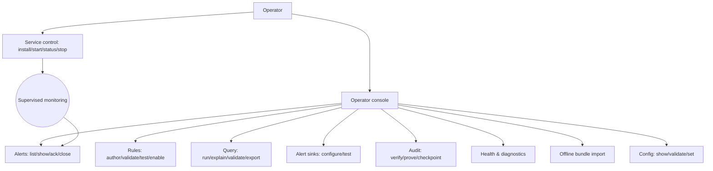

# Core Flows — DaemonEye Operator Journeys

Surface: `daemoneye-cli` is the single operator console for investigation and management. Service lifecycle uses `daemoneye-agent --install/--start/--status/--stop`, while operator-facing service status is also visible through `daemoneye-cli health`. All output supports human/JSON/CSV and respects `NO_COLOR`/`TERM=dumb`. Every detection-bearing result carries a completeness marker: `complete` or `degraded: <reason>`; degraded query/alert commands return a distinct non-zero exit code so automation can fail closed.

Actions that can destroy state or weaken posture confirm by default: rule delete, rule disable, alert close/reopen, data cleanup/vacuum/retention purge, bundle import/apply, privacy/security-weakening config changes, and service uninstall. Scripted operation can skip confirmation with `--yes`/`--force` where appropriate.



## Flow 1 — Deploy & Run as a Service

**Description:** Install DaemonEye as a supervised OS service and confirm it's healthy. **Trigger:** Operator runs service-control install on a target host. **Steps:**

1. Operator runs **install** (optionally pointing at a config). System validates config + privileges, registers the OS service, and reports the resolved install paths.
2. Operator runs **start**. System brings up the orchestrator and collector. The agent may use elevated privileges only for bootstrap/service setup and spawning procmond, then drops before broker steady-state and before collection begins; the collector drops to its minimal retained privileges and logs the retained set.
3. Operator runs agent **status**. System shows per-component state (running/degraded/stopped), uptime, and whether monitoring has reached steady state. The same operator-facing status is available through the console health flow.
4. Operator runs **stop**; supervised graceful shutdown drains in-flight work. **uninstall** removes the service and reports what was cleaned up.

```
$ daemoneye-agent --status
COMPONENT        STATE      UPTIME   NOTES
collector        running    2h13m    retained: CAP_SYS_PTRACE
orchestrator     running    2h13m    steady-state
event store      ok         —        4,812 processes
overall          ● healthy
```

**Feedback:** Failed install/start gives an actionable error (missing privilege, bad config path) and a non-zero exit. Agent bootstrap/drop and collector privilege changes are written to the audit trail.

## Flow 2 — Author & Manage Detection Rules

**Description:** Create a SQL detection rule, validate and test it safely, then enable it. **Trigger:** Operator wants a new behavioral detection. **Steps:**

1. Author the rule either by **writing a SQL rule file** or via a minimal **interactive create** prompt (id, name, severity, SQL, test window → validate → optionally enable). DaemonEye-specific extensions are flagged as extensions, not standard SQL.
2. Run **validate** — load-time AST check (SELECT-only, function allowlist, nesting/regex limits) and schema-catalog reference check. Errors are precise and line-oriented.
3. Run **test** against historical data for a chosen window. Output shows would-fire matches and a completeness marker.
4. **Enable** the rule. **list/show** display status and health; a rule that no longer validates (e.g., a referenced collector is gone) is shown **unhealthy** with the reason.
5. **Disable** and **delete** prompt for confirmation by default (`--yes` to skip).

**Feedback:** Validation/test never write alerts. Enable/disable/delete are recorded in the audit trail.

## Flow 3 — Investigate via SQL Query

**Description:** Run an ad-hoc forensic SQL query against stored process data. **Trigger:** Operator investigating an incident or hunting. **Steps:**

1. Operator runs a **single-shot query** with `--sql` (values bound as parameters), choosing output format and optional pagination/streaming.
2. **validate** checks syntax/safety without executing; **explain** shows the execution plan on demand.
3. Results render as table/JSON/CSV; large sets stream or paginate. Each result set carries a **completeness marker**.
4. Operator optionally **exports** results to a file.

```
$ daemoneye-cli query --sql "SELECT pid,name FROM processes WHERE name LIKE ?" --param "%nc%"
PID    NAME
4821   ncat
result: ⚠ degraded — rate limit shed events; partial evaluation
```

**Feedback:** Same SELECT-only allowlist as rules. Forbidden constructs are rejected and logged. Degraded results return a distinct non-zero exit code so scripts can fail closed. (Interactive query shell is a later-phase enhancement.)

## Flow 4 — Triage Alerts

**Description:** Review, understand, and action generated alerts. **Trigger:** Alerts have been generated; operator reviews them. **Steps:**

1. **list** alerts with filters (severity, rule, status, time window). Each row shows severity, rule, time, and its completeness marker.
2. **show** an alert for full detail: affected process (PID, name, path), rule context, correlation id, and pointers to the source data used.
3. Operator transitions state: **acknowledge → close → reopen** as needed.

```
$ daemoneye-cli alerts list --severity high --since "24h"
SEV   RULE                 WHEN     STATUS  EVAL
high  apache-bash-spawn    10:42    open    ✓ complete
high  cred-flag-exec       09:15    open    ⚠ degraded: events shed
```

**Feedback:** Degraded alerts are visually distinct and return a distinct non-zero exit code when listed/shown so automation can fail closed. State changes are audited; alert close/reopen prompts for confirmation by default.

## Flow 5 — Configure Alert Delivery Sinks

**Description:** Set up where alerts are delivered and confirm delivery works. **Trigger:** Operator configuring notification channels. **Steps:**

1. Operator configures one or more sinks (stdout, file, webhook, syslog, email) via config, then **validates** the config.
2. Operator runs a **sink test** to send a synthetic alert and observe per-sink success/failure.
3. **health** shows each sink's status, including circuit-breaker state and dead-letter backlog when deliveries fail.
4. On network loss, local sinks keep working; remote sinks degrade gracefully and surface as degraded in health.

**Feedback:** Test results report per-sink outcome with actionable errors (auth, unreachable). Delivery attempts are tracked for audit.

## Flow 6 — Verify Audit Integrity

**Description:** Prove the tamper-evident ledger is intact and export an anchor for off-host attestation. **Trigger:** Compliance check, incident handling, or routine integrity verification. **Steps:**

1. Operator runs **verify** over the audit ledger. System walks the chain and reports OK or the exact entry where continuity/hash breaks.
2. Operator requests an **inclusion proof** for a specific entry; system returns a verifiable proof path usable offline.
3. Operator **exports a signed checkpoint** (chain head + signature) for off-host anchoring.

```
$ daemoneye-cli audit verify
chain: 12,904 entries  ✓ intact   head#12904  checkpoint: 11:00 (signed)
$ daemoneye-cli audit prove --seq 4821
proof: ✓ entry 4821 included under head#12904
```

**Feedback:** A failed verify is loud and points to the first bad entry. Proofs/checkpoints verify without trusting the live host.

## Flow 7 — Check System Health & Diagnostics

**Description:** Get a single, trustworthy view of operational state and detection completeness. **Trigger:** Operator monitoring or troubleshooting. **Steps:**

1. Operator runs **health** for a color-coded overview: overall health, component status, resource posture, and a **degraded-detection** summary (which sources/rules are not fully evaluating and why). The default health view surfaces collection rate, rule evaluation latency, alert delivery health, and redb write latency.
2. Operator drills into a **component** for detail, or runs **diagnostics** for deeper checks and **config validation**.
3. Operator views recent **logs/metrics** through the console; any HTTP listener stays opt-in and off by default.

**Feedback:** Health is the canonical place to learn that detection is degraded, complementing the per-result markers in Flows 3–4. Success output makes the healthy path explicit (overall healthy, collection active, rules evaluating, configured sinks healthy, storage writes within budget). Exit codes reflect health for scripting.

## Flow 8 — Offline Bundle Distribution

**Description:** Distribute rules/config to an airgapped host via a signed bundle. **Trigger:** Operator has a signed bundle to apply on a disconnected system. **Steps:**

1. Operator runs **bundle import** pointing at the bundle file.
2. System **verifies the signature** against configured trusted keys; unsigned or invalid bundles are rejected with a clear reason.
3. System shows a summary of changes and **conflicts**. Operator chooses the resolution per conflict before applying atomically; `--yes` applies the configured default conflict policy.
4. On success, new/updated rules and config are live; affected rules are re-validated and any that fail are flagged unhealthy.

**Feedback:** Apply is all-or-nothing; a mid-apply failure rolls back. The import and resulting changes are audited.

## Flow 9 — Manage Configuration

**Description:** Inspect and adjust effective configuration across the precedence chain. **Trigger:** Operator tuning behavior (intervals, masking, sinks, privileges). **Steps:**

1. **show** displays the effective config and, on request, which layer each value came from (flag > env > user > system > default).
2. **validate** checks a config for errors before it's used, with actionable messages.
3. **set** updates a value at the appropriate layer; sensitive changes (e.g., disabling argument masking) are called out, require confirmation by default, and are audited.

**Feedback:** Config that would weaken privacy/security defaults is surfaced explicitly. Invalid config never silently applies.
