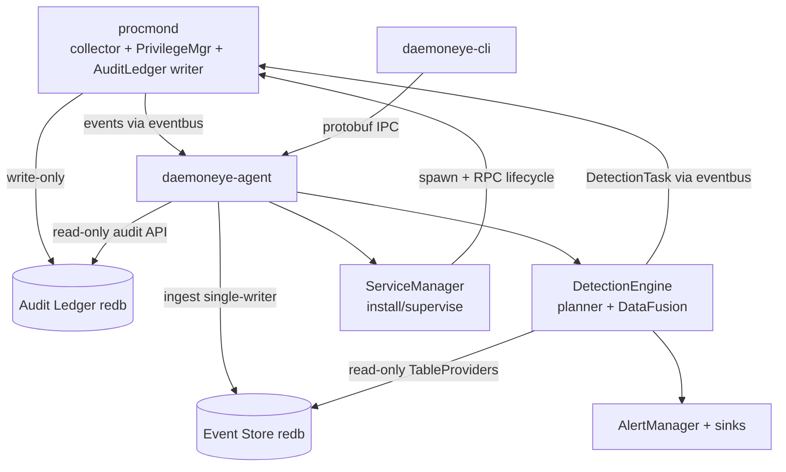

# Tech Plan — DaemonEye Core Monitoring (v1.0 priority areas)

# Tech Plan — DaemonEye Core Monitoring

Scope: deep design for **storage, detection engine, audit ledger, privilege/service management**, and the cross-cutting **degradation/completeness contract**. Alerting, CLI, observability, and offline bundles are covered at interface level only. Binding references: file:.kiro/specs/daemoneye-core-monitoring/requirements.md (R1–R24), file:.kiro/specs/daemoneye-core-monitoring/design.md (ADR-0006, §11.5–11.7), Epic Brief spec:4f1ea4cc-400a-4ef3-9666-866cbb47d44b/ed183283-58cd-4c2b-9bc1-27b2b4032f0f, Core Flows spec:4f1ea4cc-400a-4ef3-9666-866cbb47d44b/811199cd-23dc-4ded-9932-735252ec2438.

## Architectural Approach

**1. Detection — two-phase, DataFusion-first (ADR-0006; R3, R17–R21).** Phase 1 (rule load): grow the existing file:daemoneye-lib/src/detection/sql_to_ipc.rs translator into a validating planner — sqlparser AST validation (SELECT-only, function allowlist, subquery depth ≤ 3), catalog reference checks, regex compile/cache — emitting protobuf `DetectionTask`s + derived standard SQL. Phase 2 (per cycle): execute derived SQL in a locked-down DataFusion `SessionContext` over per-collector redb `TableProvider`s. *Trade-off:* DataFusion adds binary size/memory vs. a hand-rolled executor, but removes a bespoke join/cost engine and gives correct SQL semantics. This is gated by an early spike before full implementation: one `SessionContext`, one redb `TableProvider`, and one representative query must satisfy binary-size, `<100MB RSS`, and `<100ms/rule` feasibility before the full detection milestone proceeds. The original dialect never reaches execution.

**2. Storage — redb event store per §11.7 (R20).** Replace the `Vec<u8>` placeholders in file:daemoneye-lib/src/storage.rs with typed tables: time-partitioned `processes.events` keyed `(ts_ms, seq)` plus multimap secondary indexes. Values use custom `redb::Value` impls with a postcard codec; keys are fixed-width big-endian. *Trade-off:* custom codecs cost upfront work but give compact, range-scannable keys and pushdown-friendly indexes. Schema evolution uses a **version tag with rebuild/re-ingest on mismatch** (no in-place migration): on mismatch, the agent rebuilds the event store by replaying available procmond WAL, accepting explicit historical gaps if WAL retention is insufficient.

**3. Audit ledger — procmond-owned, persisted, tamper-evident (R7).** Move ledger persistence into procmond (write-only handle, `0640`, `daemoneye` group), keep BLAKE3/Merkle primitives in file:daemoneye-lib/src/crypto.rs. Add real `rs-merkle` inclusion proofs (replacing the `vec![]` stub), MMR-frontier checkpoints, and optional Ed25519-signed checkpoints. *Constraint:* append-only, single linear history, `O(log n)` steady-state memory.

**4. Privilege & service — agent-as-supervisor with early drop (R6).** The agent is the installed OS service. **Validated model:** privileged agent bootstrap is an explicit, narrow exception to the steady-state security model. The agent may start elevated only to install/configure service resources and spawn procmond with the required elevation, then it **must drop privileges before broker steady-state and before collection begins**. After that point, the agent runs unprivileged and manages collector lifecycle exclusively via eventbus RPC. procmond drops to its minimal retained capability set after init (real `PrivilegeManager`, replacing the `broker_manager.rs` stub). This refinement should be reflected back into requirements/steering during cross-artifact validation.

**5. Degradation/completeness contract (R20/R21).** A first-class `Completeness { status, reasons[] }` flows from collectors/executor → alerts (persisted) and → query/CLI envelopes, distinguishing "no match" from "could not fully evaluate." Any degraded completeness status returns the distinct non-zero exit code by default for query/alert CLI commands so automation fails closed.

**Cross-cutting constraints:** offline/airgap-first; no inbound network (TCP opt-in only); `unsafe_code = "forbid"`; budgets `<5% CPU`, `<100MB RSS`, `<100ms/rule`; new deps must be FFI-free where feasible (DataFusion/Arrow, `caps`, `windows-service`, `fuzzyhash`).

## Data Model

**Event store DB (agent R/W single-writer; CLI read-only).** Physical layout = queryable layout (1:1 logical↔physical names).

| Table                                                      | Key                                              | Value                                | Notes                                                            |
| ---------------------------------------------------------- | ------------------------------------------------ | ------------------------------------ | ---------------------------------------------------------------- |
| `processes.events` (per time bucket)                       | `(ts_ms: u64, seq: u32)` fixed-width BE, 16-byte | versioned `ProcessRecord` (postcard) | base table; strictly increasing                                  |
| `processes.idx:pid`                                        | `(pid, ts_ms, seq)`                              | → 16-byte base pointer               | multimap secondary                                               |
| `processes.idx:ppid` / `idx:name`(hashed) / `idx:exe_hash` | composite                                        | → base pointer                       | posting-list intersection                                        |
| `scans`                                                    | `scan_id: u64`                                   | scan metadata                        | collection cycle stats                                           |
| `detection_rules`                                          | `rule_id: &str`                                  | `DetectionRule`                      | persisted rules (fixes "zero rules" gap)                         |
| `alerts`                                                   | `alert_id: u64`                                  | `Alert` (+`completeness`)            | detection results                                                |
| `alert_deliveries`                                         | `(alert_id, sink)`                               | delivery status                      | retry/circuit-breaker tracking                                   |
| `schema_version`                                           | `()`                                             | `u32`                                | mismatch → rebuild by replaying available WAL; gaps are explicit |

- **Time buckets:** configurable; **hourly default**, daily for low-volume hosts. Retention/cleanup operate at bucket granularity.
- **Value encoding:** custom `redb::Value`/`redb::Key` impls over postcard; secondary indexes store only the 16-byte base pointer, never row copies.
- **Process identity for correlation:** time-stable `(pid, start_time)`; joins on recyclable keys bound to process lifetime window.

**Model additions (extend existing **file:daemoneye-lib/src/models/**):**

- `ProcessRecord`: add `ssdeep_hash: Option<String>` and an on-disk-vs-running mismatch marker (R2 AC6/AC7); `executable_hash` stays SHA-256 identity. (Existing `MultiAlgorithmHasher` already emits SHA-256+BLAKE3; add ssdeep via `fuzzyhash`.)
- `Alert`: add `completeness: Completeness` (persisted).
- New `Completeness { status: Complete | Degraded, reasons: Vec<DegradationReason> }`; `DegradationReason` enum covers `CollectorUnavailable`, `EventsShed`, `LateDiscarded`, `OperationCapped`, `SchemaUnavailable`.

**Audit ledger DB (procmond write-only; others read-only).**

| Table               | Key              | Value                                                 |
| ------------------- | ---------------- | ----------------------------------------------------- |
| `AUDIT_LEDGER`      | `seq: u64`       | `AuditEntry` (BLAKE3 leaf, tree_size, root)           |
| `AUDIT_CHECKPOINTS` | `tree_size: u64` | `Checkpoint { root_hash, created_at_ms, signature? }` |
| `AUDIT_FRONTIER`    | `()`             | MMR peak hashes (recovery, `O(log n)`)                |

Inclusion proof = `(root, index, total, leaf_hash, siblings[])`, verifiable offline. Ed25519 keypair generated first-run, stored `0400` under procmond UID; `secrecy`/`zeroize` in memory. The agent opens the audit ledger read-only and serves CLI audit verify/proof/checkpoint commands over the existing CLI↔agent IPC boundary; CLI does not open the ledger directly.

## Component Architecture

**New / reworked components (responsibilities & boundaries):**

- **StorageEngine** (`daemoneye-lib`): owns event-store schema, codecs, time-bucket lifecycle, retention/cleanup, rebuild-from-WAL on schema mismatch, and the read-only `TableProvider`s consumed by detection. Single-writer ingest API used only by the agent. Replaces the stubbed `DatabaseManager`.
- **DetectionEngine** (`daemoneye-agent` + `daemoneye-lib/detection`): `DetectionPlanner` (Phase 1, grown from `SqlToIpcTranslator`), `SchemaCatalog` (static authenticated registration, R19), `RegexCache` (full-string-keyed LRU, R17), `DataFusionExecutor` (Phase 2, allowlisted `SessionContext`, memory/cardinality caps). Emits `DetectionTask`s through `broker_manager`/eventbus; reads event store read-only. Replaces the placeholder in file:daemoneye-lib/src/detection/mod.rs.
- **AuditLedger writer** (`procmond`): consumes BLAKE3/Merkle primitives from file:daemoneye-lib/src/crypto.rs; persists ledger + checkpoints. The ledger file remains procmond-owned for writes; the agent opens it read-only and serves CLI audit requests over IPC.
- **PrivilegeManager** (`procmond`): platform privilege request + immediate post-init drop with audit logging (`caps`/Linux, `SeDebugPrivilege`/Windows, macOS entitlements).
- **ServiceManager** (`daemoneye-agent` crate): `ServiceManager` trait + `UnixServiceManager`/`WindowsServiceManager`; install/uninstall/start/stop/status, systemd/launchd/SCM unit generation; privileged bootstrap limited to service setup and procmond spawn, then mandatory agent self-drop before broker steady-state/collection; collector supervision/restart via eventbus RPC.
- **CompletenessTracker** (cross-cutting, `daemoneye-lib`): threads `Completeness` from executor/collector signals into alerts and query envelopes.

**Interfaces with existing components (unchanged contracts):**

- **Eventbus** (`daemoneye-eventbus`): event ingest topics (`events.process.*`), control/RPC (`control.collector.*`, `control.health.*`); agent embeds the broker.
- **IPC** (file:daemoneye-lib/src/ipc/, protobuf+CRC32): CLI↔agent for query/rules/alerts/health.
- **collector-core** `EventSource`/`DetectionTask` handling: procmond consumes tasks, advertises capabilities/schema descriptors.
- **AlertManager** (file:daemoneye-lib/src/alerting.rs): receives alerts (now carrying `completeness`) and the existing `AlertSink` trait; network sinks/reliability are interface-level here.

**End-to-end data flow:** procmond collects → emits events over eventbus → agent ingests single-writer into event store → each cycle DetectionEngine pushes eligible predicates to procmond as tasks and executes derived SQL in DataFusion over the event store → matches become alerts (with completeness) → AlertManager delivers → security-relevant actions recorded in the procmond audit ledger → CLI queries agent over IPC.
