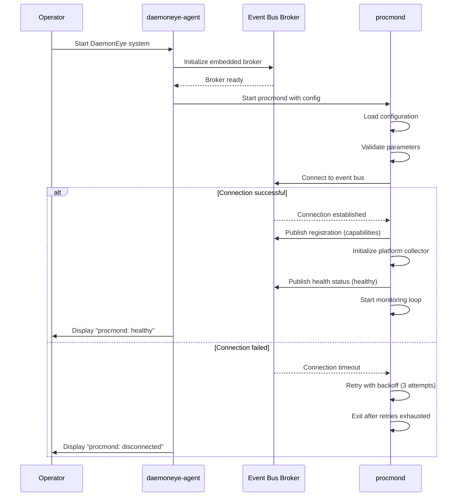
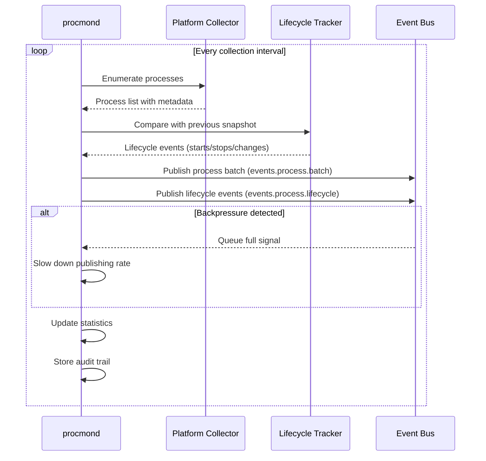
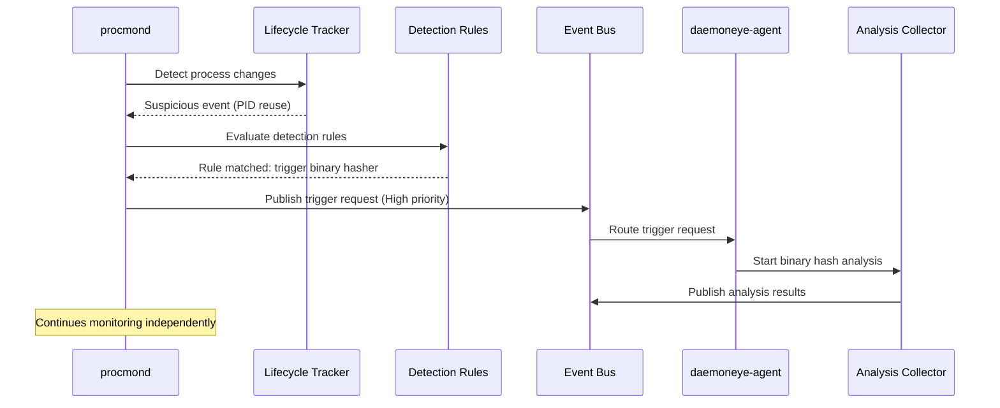
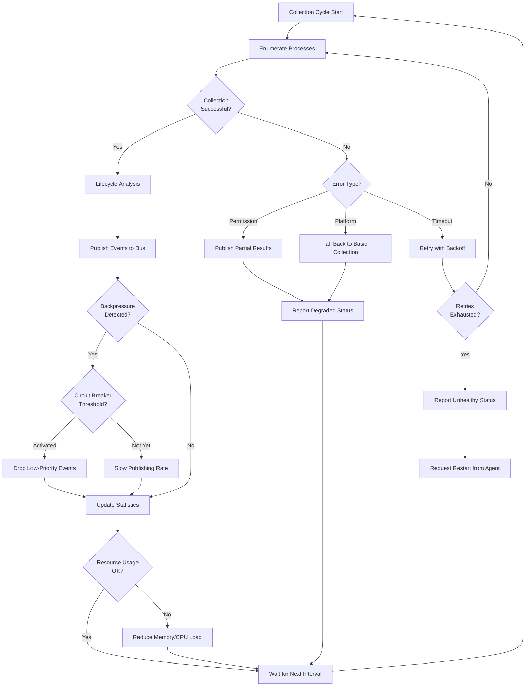

# Core Flows: Procmond Process Monitoring

## Overview

This document describes the core user flows for procmond, the process monitoring daemon in DaemonEye. These flows capture how operators interact with procmond through daemoneye-agent and how the system behaves during normal operation and failure scenarios.

**Key Principles:**

- Operators interact through daemoneye-agent/CLI, not directly with procmond
- procmond runs autonomously with minimal operator intervention
- Configuration is centrally managed and pushed from daemoneye-agent
- System validates connectivity before starting and adapts to runtime conditions

---

## Flow 1: Initial Deployment and First-Run Setup

**Description:** How operators set up procmond for the first time on a new system

**Trigger:** Operator installs DaemonEye on a new system

**Steps:**

01. Operator installs DaemonEye package (deb, rpm, pkg, msi, or homebrew)
02. Installation creates default configuration files in system location
03. Operator reviews and adjusts configuration via `daemoneye-cli config show procmond`
04. Operator sets collection interval, metadata options, and resource limits
05. Operator validates configuration via `daemoneye-cli config validate`
06. Operator starts daemoneye-agent service (systemd, launchd, Windows Service)
07. daemoneye-agent starts embedded event bus broker
08. daemoneye-agent spawns procmond with validated configuration
09. procmond connects to event bus and registers capabilities
10. procmond performs initial process enumeration
11. Operator runs `daemoneye-cli health procmond` to verify setup
12. Operator sees "procmond: healthy" status confirming successful setup

**First-Run Validation:**

- Configuration syntax is valid
- procmond can connect to event bus
- Platform-specific collector initializes successfully
- Initial process enumeration completes
- Health check passes

**Common First-Run Issues:**

- **Insufficient privileges:** Operator sees permission errors; must run daemoneye-agent with appropriate privileges
- **Invalid configuration:** Operator sees validation errors; must correct configuration file
- **Event bus connection fails:** Operator sees connection timeout; must verify daemoneye-agent is running

---

## Flow 2: System Startup and Initialization

**Description:** How procmond starts up, connects to the event bus, and begins monitoring (subsequent starts after initial deployment)

**Trigger:** daemoneye-agent starts procmond as part of system initialization

**Steps:**

01. daemoneye-agent starts its embedded event bus broker
02. daemoneye-agent spawns procmond process with configuration
03. procmond initializes logging and loads configuration from daemoneye-agent
04. procmond validates configuration parameters (intervals, limits, metadata options)
05. procmond attempts to connect to daemoneye-agent's event bus broker
06. **Decision Point:** If connection fails, procmond retries with exponential backoff (up to 3 attempts)
07. **Success Path:** procmond registers with broker, publishes registration message with capabilities
08. procmond initializes platform-specific collector (Linux/macOS/Windows/FreeBSD)
09. procmond performs initial health check and reports status to daemoneye-agent
10. procmond begins continuous monitoring loop
11. Operator sees "procmond: healthy" status in daemoneye-agent health report

**Failure Paths:**

- **Event bus unreachable:** procmond logs error, retries, then exits if all attempts fail; daemoneye-agent shows "procmond: disconnected" status
- **Invalid configuration:** procmond logs validation errors and exits; operator sees error in daemoneye-agent logs
- **Platform collector initialization fails:** procmond falls back to basic sysinfo collector; operator sees warning in health status

---

## Flow 3: Continuous Process Monitoring

**Description:** The ongoing cycle of collecting process data and publishing events to the event bus

**Trigger:** procmond's monitoring loop runs on configured interval (default: 30 seconds)

**Steps:**

01. procmond waits for next collection interval tick
02. procmond enumerates all running processes using platform-specific collector
03. procmond collects basic metadata (PID, name, executable path, command line, resource usage)
04. **Decision Point:** If enhanced metadata is enabled, collect platform-specific details (network connections, file descriptors, security contexts)
05. procmond compares current process list with previous snapshot (lifecycle tracking)
06. procmond identifies lifecycle events (process starts, stops, modifications)
07. procmond publishes process events to event bus topic `events.process.batch`
08. procmond publishes lifecycle events to topic `events.process.lifecycle`
09. **Decision Point:** If backpressure detected (event bus queue full), procmond slows down event publishing
10. procmond updates internal statistics (processes collected, events published, errors)
11. procmond stores audit trail in local database
12. Cycle repeats on next interval

**Operator Visibility:**

- No real-time visibility during normal operation
- Statistics available through daemoneye-agent health endpoint
- Errors logged and visible in daemoneye-agent status

**Performance Expectations:**

- Collection completes within interval (30 seconds default)
- Enumerate 1,000 processes in \<100ms
- Memory usage stays \<100MB
- CPU usage \<5% sustained

---

## Flow 4: Suspicious Process Detection and Triggering

**Description:** How procmond identifies suspicious processes and triggers deeper analysis by other collectors

**Trigger:** Suspicious process detected during lifecycle tracking (PID reuse, unsigned binary, anomalous behavior)

**Steps:**

1. procmond detects suspicious process during lifecycle analysis
2. procmond evaluates configured detection rules (operator-defined via daemoneye-agent)
3. **Decision Point:** Rule matches determine if process is suspicious
4. procmond creates trigger request with priority (Low/Normal/High/Critical)
5. procmond publishes trigger request to event bus topic `control.collector.task.{collector_type}.{id}`
6. daemoneye-agent receives trigger request and routes to appropriate collector (e.g., binary hasher)
7. Target collector performs analysis and publishes results back to event bus
8. procmond continues monitoring without waiting for analysis completion
9. Operator can review triggered analyses through daemoneye-cli query interface

**Operator Configuration:**

- Operators define detection rules through daemoneye-agent configuration
- Rules specify conditions (unsigned binaries, network connections, privilege escalation)
- Rules specify which collectors to trigger (binary hasher, memory analyzer, etc.)

**Example Scenarios:**

- **Unsigned binary detected:** Trigger binary hasher for integrity verification
- **PID reuse detected:** Trigger behavioral analysis for anomaly detection
- **Privilege escalation:** Trigger memory analyzer for credential dumping detection

---

## Flow 5: Configuration Update

**Description:** How operators update procmond's configuration through daemoneye-cli

**Trigger:** Operator modifies procmond configuration (e.g., change collection interval, enable enhanced metadata)

**Steps:**

01. Operator updates configuration via daemoneye-cli: `daemoneye-cli config update procmond --interval=60 --enhanced-metadata=true`
02. daemoneye-agent validates new configuration parameters
03. daemoneye-agent publishes configuration update to event bus topic `control.collector.config`
04. procmond receives configuration update message
05. procmond validates new configuration (intervals, limits, feature flags)
06. **Decision Point:** If validation fails, procmond rejects update and reports error
07. **Success Path:** procmond applies new configuration without restarting
08. procmond adjusts monitoring behavior (new interval, metadata collection level)
09. procmond publishes configuration acknowledgment to event bus
10. daemoneye-agent confirms configuration applied successfully
11. Operator sees "Configuration updated successfully" message

**Configuration Changes Supported:**

- Collection interval adjustment (5-3600 seconds)
- Enhanced metadata toggle (on/off)
- Executable hashing toggle (on/off)
- Maximum processes per cycle limit
- Detection rule updates

**No Restart Required:**

- Configuration changes apply to next collection cycle
- No service interruption or process restart needed

---

## Flow 6: Health Monitoring and Status Reporting

**Description:** How operators monitor procmond's health and diagnose issues

**Trigger:** Operator checks system health via daemoneye-cli or daemoneye-agent reports degraded status

**Steps:**

1. Operator runs health check command through daemoneye-cli
2. daemoneye-cli queries daemoneye-agent for component health
3. daemoneye-agent requests health status from procmond via event bus
4. procmond performs self-health check:

- Verify event bus connectivity
- Check collection cycle success rate
- Validate resource usage (memory, CPU)
- Check for consecutive failures

5. procmond publishes health status to topic `control.health.status`
6. daemoneye-agent aggregates health data and returns to CLI
7. Operator sees health report with status indicators:

- **Healthy:** All checks passing, normal operation
- **Degraded:** Some issues but still functional (e.g., enhanced metadata unavailable)
- **Unhealthy:** Critical issues requiring intervention (e.g., event bus disconnected)

**Health Indicators:**

- Event bus connectivity status
- Collection success rate (last 10 cycles)
- Current resource usage (memory, CPU)
- Backpressure events count
- Last successful collection timestamp
- Platform collector status

**Operator Actions Based on Status:**

- **Healthy:** No action needed
- **Degraded:** Review warnings, consider configuration adjustments
- **Unhealthy:** Investigate errors, check logs, potentially restart daemoneye-agent

---

## Flow 7: Error Handling and Recovery

**Description:** How procmond handles failures and recovers gracefully

### 7.1: Event Bus Connection Failure

**Trigger:** procmond loses connection to daemoneye-agent's event bus broker

**Steps:**

1. procmond detects connection failure during event publishing
2. procmond logs error with connection details
3. procmond enters reconnection mode with exponential backoff
4. procmond buffers events locally (up to configured limit)
5. **Decision Point:** After 3 failed reconnection attempts, procmond reports critical failure
6. daemoneye-agent detects procmond disconnection via missing heartbeats
7. daemoneye-agent attempts to restart procmond
8. **Recovery:** When connection restored, procmond publishes buffered events
9. Operator sees "procmond: reconnected" status update

### 7.2: Permission/Privilege Failure

**Trigger:** procmond cannot access process information due to insufficient privileges

**Steps:**

1. procmond attempts to collect process metadata
2. Platform collector returns permission denied error
3. procmond logs specific process and permission error
4. **Decision Point:** If error is for single process, skip and continue; if systemic, report degraded status
5. procmond publishes partial results with error metadata
6. procmond reports degraded health status to daemoneye-agent
7. Operator sees warning in health report: "Limited process visibility due to permissions"
8. Operator can review logs to identify privilege requirements

### 7.3: Performance Degradation and Backpressure

**Trigger:** Collection takes too long or event bus cannot keep up with event volume

**Steps:**

1. procmond detects collection exceeding interval time or event bus backpressure
2. procmond activates circuit breaker after 5 consecutive backpressure events
3. procmond reduces event publishing rate (drops low-priority events)
4. procmond logs performance degradation with metrics
5. procmond publishes degraded health status
6. **Decision Point:** If degradation persists, procmond requests configuration adjustment from daemoneye-agent
7. daemoneye-agent may increase collection interval or disable enhanced metadata
8. Operator sees "procmond: degraded (performance)" in health status
9. Operator can review performance metrics and adjust configuration

### 7.4: Platform-Specific Enumeration Failure

**Trigger:** Platform-specific collector fails (e.g., procfs unavailable on Linux, WinAPI error on Windows)

**Steps:**

1. Platform-specific collector encounters error during enhanced metadata collection
2. procmond logs platform-specific error details
3. procmond falls back to basic sysinfo collector
4. procmond continues with reduced metadata (no network connections, file descriptors, etc.)
5. procmond publishes events with "degraded_metadata" flag
6. procmond reports degraded health status with reason
7. Operator sees "procmond: degraded (limited metadata)" in health report
8. Operator can investigate platform-specific issues (missing kernel modules, security policies)

### 7.5: Resource Exhaustion

**Trigger:** procmond approaches memory or CPU limits

**Steps:**

1. procmond monitors its own resource usage
2. procmond detects memory usage approaching limit (>90MB of 100MB budget)
3. procmond reduces buffer sizes and clears old snapshots
4. procmond disables enhanced metadata collection temporarily
5. procmond logs resource exhaustion warning
6. **Decision Point:** If resource usage continues to grow, procmond requests restart from daemoneye-agent
7. daemoneye-agent gracefully restarts procmond
8. Operator sees "procmond: restarted (resource limits)" in event log
9. Operator can review resource usage trends and adjust limits

---

## Flow 8: Graceful Shutdown

**Description:** How procmond cleanly stops and releases resources

**Trigger:** daemoneye-agent sends shutdown signal to procmond (system shutdown, maintenance, restart)

**Steps:**

01. daemoneye-agent publishes shutdown command to topic `control.collector.lifecycle`
02. procmond receives shutdown signal
03. procmond stops accepting new collection cycles
04. procmond completes current collection cycle if in progress (with 30-second timeout)
05. procmond publishes any buffered events to event bus
06. procmond flushes audit trail to local database
07. procmond publishes deregistration message to event bus
08. procmond closes event bus connection
09. procmond releases platform-specific resources (file handles, memory)
10. procmond exits with success code
11. daemoneye-agent confirms procmond stopped cleanly
12. Operator sees "procmond: stopped" status

**Timeout Handling:**

- If shutdown takes >30 seconds, daemoneye-agent forcefully terminates procmond
- Operator sees "procmond: force stopped" warning in logs

---

## Flow 9: Operator Troubleshooting

**Description:** How operators diagnose and resolve procmond issues

**Trigger:** Operator notices degraded or unhealthy procmond status in daemoneye-agent health report

**Steps:**

1. Operator runs diagnostic command via daemoneye-cli: `daemoneye-cli health procmond --detailed`
2. daemoneye-cli queries daemoneye-agent for procmond diagnostics
3. daemoneye-agent requests detailed health report from procmond via event bus
4. procmond gathers diagnostic information:

- Recent error messages and stack traces
- Collection cycle statistics (success rate, latency)
- Resource usage trends (memory, CPU over time)
- Event bus connectivity status
- Platform collector status and capabilities

5. procmond publishes diagnostic report to topic `control.health.diagnostics`
6. daemoneye-agent formats and returns diagnostic data to CLI
7. Operator reviews diagnostic output showing:

- **Status:** Current health state with reason
- **Statistics:** Collection cycles, events published, errors
- **Resources:** Memory usage, CPU usage, buffer sizes
- **Connectivity:** Event bus connection status, last successful publish
- **Recent Errors:** Last 10 errors with timestamps and context

8. **Decision Point:** Based on diagnostics, operator takes action:

- **Permission errors:** Adjust procmond privileges or security policies
- **Performance issues:** Increase collection interval or disable enhanced metadata
- **Connectivity issues:** Check daemoneye-agent status and event bus health
- **Resource exhaustion:** Increase resource limits or reduce collection scope

09. Operator applies configuration changes through daemoneye-agent
10. Operator monitors health status to confirm issue resolved

**Common Troubleshooting Scenarios:**

| Issue             | Diagnostic Indicator                | Operator Action                                 |
| ----------------- | ----------------------------------- | ----------------------------------------------- |
| High error rate   | Collection success rate \<80%       | Review error logs, check permissions            |
| Backpressure      | Backpressure events >100/hour       | Increase interval, reduce metadata              |
| Memory growth     | Memory usage trending upward        | Reduce max processes, disable enhanced metadata |
| Missing events    | Events published but not received   | Check daemoneye-agent event bus health          |
| Platform failures | Platform collector status: degraded | Check OS-specific requirements (procfs, WinAPI) |

---

## Flow 10: Detection Rule Configuration

**Description:** How operators configure what procmond considers "suspicious" and what analysis to trigger

**Trigger:** Operator wants to add or modify detection rules for suspicious process behavior

**Steps:**

01. Operator defines detection rule via daemoneye-cli: `daemoneye-cli rules add --name="unsigned-binary" --condition="code_signed=false" --trigger="binary_hasher" --priority=high`
02. Rule specifies conditions (e.g., "unsigned binary", "network connection to suspicious IP", "privilege escalation")
03. Rule specifies which collector to trigger (binary hasher, memory analyzer, network analyzer)
04. Rule specifies priority level (Low/Normal/High/Critical)
05. Operator saves rule configuration
06. daemoneye-agent validates rule syntax and feasibility
07. daemoneye-agent publishes rule update to procmond via topic `control.collector.config`
08. procmond receives and validates rule update
09. procmond applies new rules to lifecycle tracker
10. procmond acknowledges rule update to daemoneye-agent
11. Operator sees "Detection rules updated successfully" confirmation
12. procmond begins applying new rules in next collection cycle

**Rule Examples:**

- "Trigger binary hasher for any unsigned executable"
- "Trigger network analyzer for processes with >10 network connections"
- "Trigger memory analyzer for processes with privilege escalation"
- "Trigger behavioral analyzer for PID reuse events"

---

## Flow 11: Cross-Platform Behavior

**Description:** How procmond adapts to different operating systems while maintaining consistent operator experience

**Trigger:** procmond starts on different platforms (Linux, macOS, Windows, FreeBSD)

**Platform-Specific Behaviors:**

### Linux

1. procmond detects Linux platform during initialization
2. procmond initializes Linux-specific collector with procfs access
3. procmond collects enhanced metadata: network connections, file descriptors, cgroups, namespaces
4. procmond respects SELinux/AppArmor restrictions
5. Operator sees full metadata in process events

### macOS

1. procmond detects macOS platform during initialization
2. procmond initializes macOS-specific collector with BSD sysctl
3. procmond collects enhanced metadata: code signing info, sandbox profiles
4. procmond respects System Integrity Protection (SIP) boundaries
5. Operator sees macOS-specific metadata (code signing, sandboxing)

### Windows

1. procmond detects Windows platform during initialization
2. procmond initializes Windows-specific collector with WinAPI
3. procmond collects enhanced metadata: session IDs, handle counts, integrity levels, WOW64 status
4. procmond respects UAC and Windows security boundaries
5. Operator sees Windows-specific metadata (sessions, integrity levels)

### FreeBSD

1. procmond detects FreeBSD platform during initialization
2. procmond initializes basic sysinfo collector (enhanced collector not available)
3. procmond collects basic metadata only (PID, name, paths, resource usage)
4. procmond reports degraded status: "Enhanced metadata not available on FreeBSD"
5. Operator sees warning about limited metadata but monitoring continues

**Operator Experience:**

- Consistent health status and error reporting across all platforms
- Platform-specific metadata differences documented in health report
- Same configuration interface regardless of platform
- Graceful degradation on secondary platforms (FreeBSD)

---

## Flow 12: Performance Optimization Cycle

**Description:** How operators tune procmond performance based on system load and requirements

**Trigger:** Operator notices performance issues or wants to optimize resource usage

**Steps:**

1. Operator reviews performance metrics via daemoneye-cli: `daemoneye-cli metrics procmond`
2. daemoneye-cli displays performance dashboard:

- Collection latency (average, p95, p99)
- Memory usage trend
- CPU usage trend
- Event publishing rate
- Backpressure frequency

3. Operator identifies performance bottleneck:

- **High latency:** Collection taking too long
- **High memory:** Too many processes or snapshots
- **Backpressure:** Event bus can't keep up

4. Operator adjusts configuration through daemoneye-agent:

- Increase collection interval (reduce frequency)
- Disable enhanced metadata (reduce per-process overhead)
- Reduce max processes per cycle (limit scope)
- Disable executable hashing (reduce CPU usage)

5. daemoneye-agent pushes configuration update to procmond
6. procmond applies changes and adjusts behavior
7. Operator monitors metrics to confirm improvement
8. **Decision Point:** If performance improves, keep changes; if not, try different adjustments
9. Operator iterates until performance meets targets

**Performance Targets:**

- Collection latency \<100ms for 1,000 processes
- Memory usage \<100MB sustained
- CPU usage \<5% sustained
- Zero backpressure events under normal load

---

## Summary of Key Flows

| Flow                  | Operator Involvement                 | Frequency                | Criticality |
| --------------------- | ------------------------------------ | ------------------------ | ----------- |
| Initial Deployment    | Direct (via daemoneye-cli)           | Once per system          | Critical    |
| System Startup        | Indirect (via daemoneye-agent)       | Once per deployment      | Critical    |
| Continuous Monitoring | None (autonomous)                    | Every 30s (configurable) | Critical    |
| Suspicious Detection  | None (automatic)                     | As events occur          | High        |
| Configuration Update  | Direct (via daemoneye-agent)         | Occasional               | Medium      |
| Health Monitoring     | Direct (via daemoneye-cli)           | On-demand                | High        |
| Error Recovery        | Automatic (with operator escalation) | As failures occur        | Critical    |
| Graceful Shutdown     | Indirect (via daemoneye-agent)       | Rare                     | Medium      |
| Troubleshooting       | Direct (via daemoneye-cli)           | When issues arise        | High        |
| Rule Configuration    | Direct (via daemoneye-agent)         | Occasional               | Medium      |
| Cross-Platform        | None (automatic adaptation)          | Platform-dependent       | High        |
| Performance Tuning    | Direct (via daemoneye-agent)         | Periodic                 | Medium      |

---

## Operator Touchpoints

**Primary Interface:** daemoneye-cli (for configuration, health checks, diagnostics, and metrics)

**Secondary Interface:** daemoneye-agent (for lifecycle management - start/stop/restart)

**No Direct Interface:** Operators do not interact with procmond directly; all interactions are mediated through daemoneye-agent

**Visibility Channels:**

- Health status reports (healthy/degraded/unhealthy)
- Error logs (structured logging via daemoneye-agent)
- Performance metrics (via daemoneye-cli)
- Diagnostic reports (detailed troubleshooting data)

---

## References

- Epic Brief: spec:54226c8a-719a-479a-863b-9c91f43717a9/0fc3298b-37df-4722-a761-66a5a0da16b3
- Event Bus Architecture: file:docs/embedded-broker-architecture.md
- Topic Hierarchy: file:daemoneye-eventbus/docs/topic-hierarchy.md
- Process Collector Implementation: file:procmond/src/process_collector.rs
- Lifecycle Tracking: file:procmond/src/lifecycle.rs
- Monitor Collector: file:procmond/src/monitor_collector.rs
