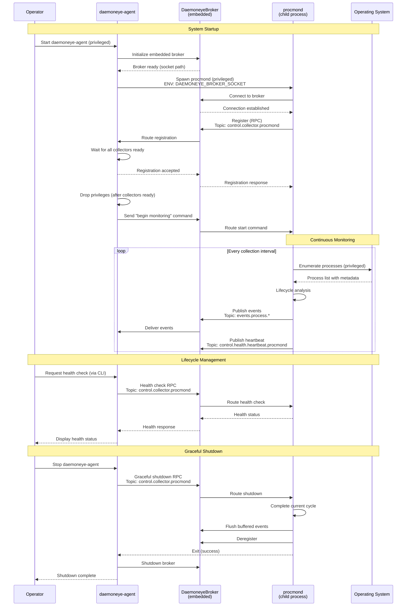
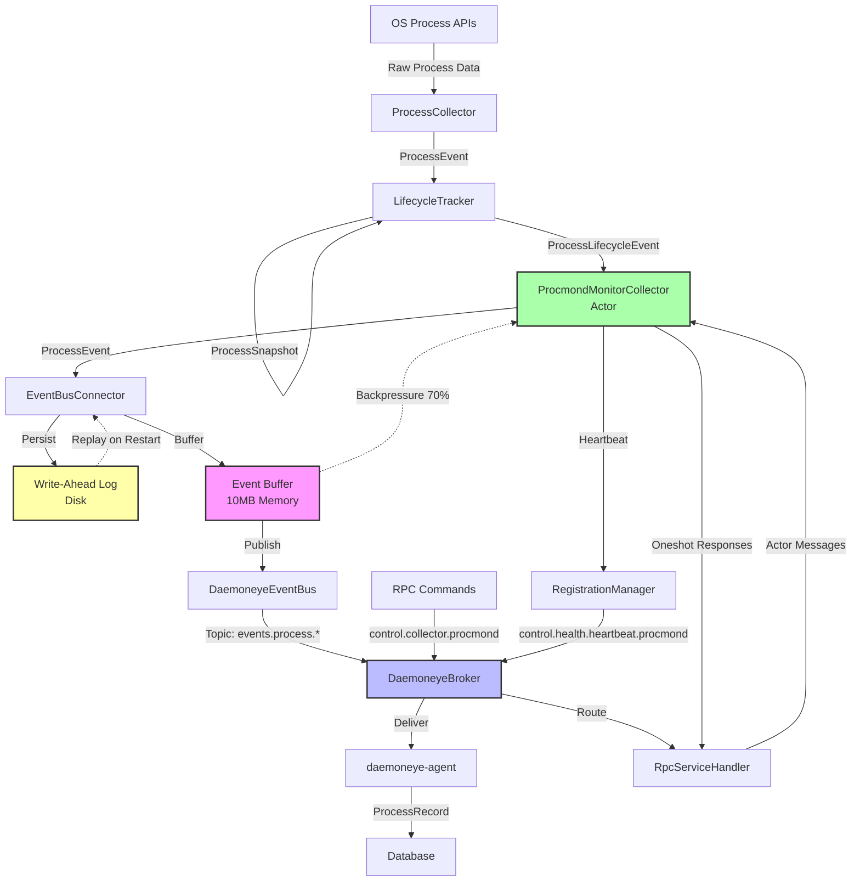
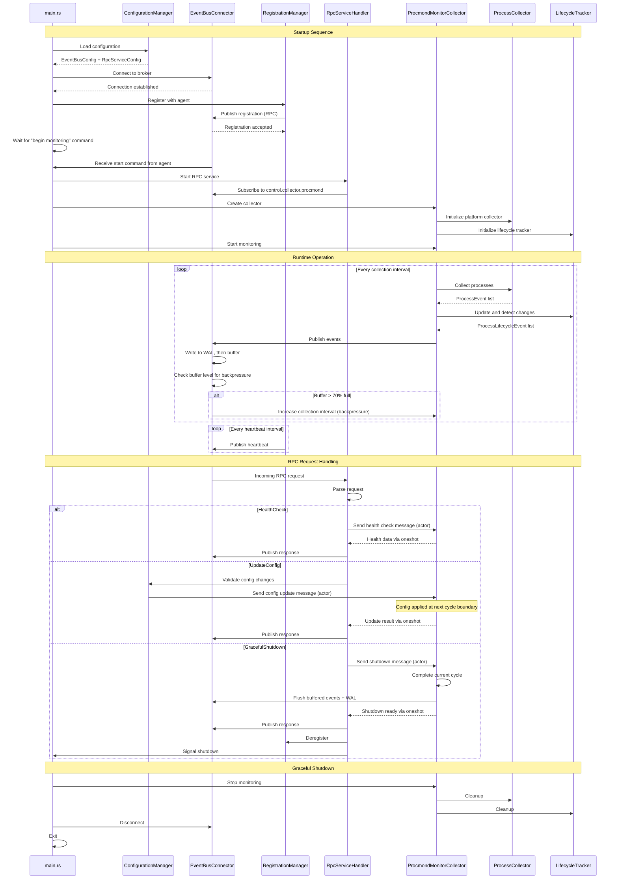

# Tech Plan: Complete Procmond Implementation

## Architectural Approach

### 1. Core Architectural Decisions

**Child Process Model**

- procmond runs as a child process spawned by daemoneye-agent
- daemoneye-agent's CollectorProcessManager handles lifecycle (start/stop/restart)
- Configuration and broker socket path passed via environment variables
- Single service deployment model (operators manage daemoneye-agent only)

**Startup Coordination (Agent Loading State)**

- Broker starts before agent spawns collectors (eliminates race condition)
- Agent spawns all configured collectors with broker socket path via environment variable
- Collectors connect to broker and register via RPC
- Collectors report "ready" status after successful registration
- Agent waits for all collectors to report "ready" before dropping privileges
- Agent remains in "loading state" until all configured collectors are ready
- Agent reads collector configuration from config file (defines which collectors to spawn)
- Agent transitions to "steady state" and broadcasts "begin monitoring" to `control.collector.lifecycle`
- All collectors subscribe to `control.collector.lifecycle` and start collection loops on receiving command
- This ensures: (1) no race conditions, (2) agent drops privileges only when safe, (3) coordinated startup

**Event-Driven Architecture**

- Replace LocalEventBus with DaemoneyeEventBus for broker communication
- Use embedded broker pattern: daemoneye-agent runs DaemoneyeBroker, procmond connects as client
- Topic-based pub/sub for events: `events.process.*` hierarchy
- RPC patterns for lifecycle management: `control.collector.procmond`

**Privilege Separation Model**

- **daemoneye-agent**: Starts privileged, drops privileges after spawning collectors
- **procmond**: Maintains full privileges throughout runtime (restricted attack surface, no network)
- Rationale: procmond needs persistent elevated access for process enumeration; agent has network connectivity (larger attack surface) so drops privileges after initialization

### 2. Integration Strategy

**Phase 1: Event Bus Integration (Foundation)**

- Direct refactoring: Replace LocalEventBus with DaemoneyeEventBus in ProcmondMonitorCollector
- Implement connection management with retry logic (3 attempts at startup, then exit)
- Add event buffering (10MB limit) with replay on reconnection
- Validate connectivity before starting collection (strict validation)

**Phase 2: RPC Service Implementation (Lifecycle Management)**

- Create RPC service handler in procmond to receive lifecycle commands
- Implement operations: Start, Stop, Restart, HealthCheck, UpdateConfig, GracefulShutdown
- Add registration/deregistration with daemoneye-agent on startup/shutdown
- Implement heartbeat publishing to `control.health.heartbeat.procmond`

**Phase 3: Testing (TDD Approach)**

- Unit tests for event bus integration (>80% coverage target)
- Integration tests for RPC communication
- Cross-platform tests (Linux, macOS, Windows)
- Chaos testing for resilience (connection failures, backpressure)

**Phase 4: Security Hardening**

- Implement privilege detection at startup (capabilities on Linux, tokens on Windows)
- Add data sanitization for command-line arguments and environment variables
- Validate security boundaries between procmond and agent
- Security test suite (privilege escalation, injection, DoS)

**Phase 5: FreeBSD Support**

- Validate FallbackProcessCollector on FreeBSD 13+
- Document limitations (basic metadata only, no enhanced features)
- Add platform detection and capability reporting
- Best-effort support (doesn't block Epic completion)

**Phase 6: Performance Validation**

- Benchmark process enumeration (target: 1,000 processes in \<100ms)
- Load testing with 10,000+ processes
- Memory profiling (target: \<100MB sustained)
- CPU monitoring (target: \<5% sustained)
- Regression testing to prevent performance degradation

### 3. Key Trade-offs and Rationale

**Trade-off 1: Direct Refactoring vs. Parallel Implementation**

- **Decision**: Direct refactoring (replace LocalEventBus in place)
- **Rationale**: Faster development velocity, simpler codebase, LocalEventBus is internal-only (no external dependencies)
- **Risk Mitigation**: Comprehensive testing before merging, feature branch development

**Trade-off 2: Event Buffering with Write-Ahead Log**

- **Decision**: Write-ahead log (WAL) with 10MB buffer and replay on reconnection
- **Rationale**: Prevents data loss during crashes or non-graceful termination, ensures event durability
- **Implementation**: Events persisted to disk before buffering, replayed on restart if procmond crashes
- **Risk Mitigation**: Bounded buffer size, WAL rotation to prevent disk exhaustion, backpressure when buffer full

**Trade-off 3: Privilege Model**

- **Decision**: procmond maintains full privileges, agent drops after spawning
- **Rationale**: procmond needs persistent elevated access; agent has larger attack surface (network connectivity)
- **Risk Mitigation**: procmond has no network access, minimal attack surface, runs as child process (isolated)

**Trade-off 4: FreeBSD Support Level**

- **Decision**: Best-effort basic enumeration, documented limitations
- **Rationale**: FreeBSD is secondary platform, full feature parity would delay primary platform completion
- **Risk Mitigation**: Clear documentation of limitations, graceful degradation

### 4. Technical Constraints

**Platform Constraints**

- Must support Linux, macOS, Windows (primary), FreeBSD (secondary)
- Must respect platform security boundaries (SELinux, AppArmor, SIP, UAC)
- Must use platform-native APIs for process enumeration

**Performance Constraints**

- CPU usage \<5% sustained during continuous monitoring
- Memory usage \<100MB during normal operation
- Process enumeration \<100ms for 1,000 processes (average)
- Event publishing must handle backpressure gracefully

**Security Constraints**

- No unsafe code (workspace-level `unsafe_code = "forbid"`)
- All external inputs must be validated and sanitized
- Privilege boundaries must be enforced and tested
- Audit trail for all security-relevant operations

**Compatibility Constraints**

- Must maintain backward compatibility with ProcessRecord data model
- Must integrate with existing collector-core framework
- Must use Rust 2024 edition with MSRV 1.91+
- Must follow workspace-level lints (`warnings = "deny"`)

### 5. Deployment Architecture



---

## Data Model

### 1. Existing Data Models (No Changes Required)

**ProcessEvent (collector-core)**

```rust
// Used for event bus communication
pub struct ProcessEvent {
    pub pid: u32,
    pub ppid: Option<u32>,
    pub name: String,
    pub executable_path: Option<String>,
    pub command_line: Vec<String>,
    pub start_time: Option<SystemTime>,
    pub cpu_usage: Option<f64>,
    pub memory_usage: Option<u64>,
    pub executable_hash: Option<String>,
    pub user_id: Option<String>,
    pub accessible: bool,
    pub file_exists: bool,
    pub timestamp: SystemTime,
    pub platform_metadata: Option<serde_json::Value>,
}
```

**ProcessRecord (daemoneye-lib)**

```rust
// Used for database storage
pub struct ProcessRecord {
    pub id: ProcessId,
    pub name: String,
    pub executable_path: Option<String>,
    pub command_line: Option<String>,
    pub parent_id: Option<ProcessId>,
    pub start_time: Option<DateTime<Utc>>,
    pub cpu_usage: Option<f64>,
    pub memory_usage: Option<u64>,
    pub status: ProcessStatus,
    pub user_id: Option<String>,
    pub executable_hash: Option<String>,
    // ... additional fields
}
```

**ProcessSnapshot (procmond)**

```rust
// Used for lifecycle tracking
pub struct ProcessSnapshot {
    pub pid: u32,
    pub ppid: Option<u32>,
    pub name: String,
    pub executable_path: Option<String>,
    pub command_line: Vec<String>,
    pub start_time: Option<SystemTime>,
    pub cpu_usage: Option<f64>,
    pub memory_usage: Option<u64>,
    pub executable_hash: Option<String>,
    pub user_id: Option<String>,
    pub accessible: bool,
    pub file_exists: bool,
    pub snapshot_time: SystemTime,
    pub platform_metadata: Option<serde_json::Value>,
}
```

**Conversion Functions (Already Exist)**

- `ProcessEvent` ↔ `ProcessSnapshot`: Bidirectional conversion via `From` trait
- `ProcessRecord` ← `ProcessEvent`: One-way conversion for database storage

### 2. New Configuration Models

**EventBusConfig (New)**

```rust
// Configuration for event bus connection
pub struct EventBusConfig {
    pub broker_socket_path: String, // From DAEMONEYE_BROKER_SOCKET env var
    pub connection_timeout: Duration, // Default: 10 seconds
    pub event_buffer_size_bytes: usize, // Default: 10MB
    pub heartbeat_interval: Duration, // Default: 30 seconds
    pub enable_event_buffering: bool, // Default: true
    pub wal_directory: PathBuf,     // Write-ahead log directory
    pub wal_max_size_bytes: usize,  // Default: 100MB (10x buffer)
    pub wal_rotation_threshold: f64, // Default: 0.8 (80% full)
    pub backpressure_buffer_threshold: f64, // Default: 0.7 (70% full triggers backpressure)
    pub backpressure_interval_multiplier: f64, // Default: 1.5 (increase interval by 50%)
}
```

**RpcServiceConfig (New)**

```rust
// Configuration for RPC service
pub struct RpcServiceConfig {
    pub collector_id: String,                // Default: "procmond"
    pub collector_type: String,              // Default: "process-monitor"
    pub registration_timeout: Duration,      // Default: 10 seconds
    pub health_check_timeout: Duration,      // Default: 5 seconds
    pub graceful_shutdown_timeout: Duration, // Default: 60 seconds
}
```

**ActorMessage (New)**

```rust
// Messages sent to ProcmondMonitorCollector actor
pub enum ActorMessage {
    HealthCheck {
        respond_to: oneshot::Sender<HealthCheckData>,
    },
    UpdateConfig {
        config: ProcmondMonitorConfig,
        respond_to: oneshot::Sender<Result<()>>,
    },
    GracefulShutdown {
        respond_to: oneshot::Sender<Result<()>>,
    },
    BeginMonitoring, // From control.collector.lifecycle broadcast
    AdjustInterval {
        new_interval: Duration,     // From EventBusConnector backpressure
        reason: BackpressureReason, // BufferFull, Reconnecting, etc.
    },
}

pub enum BackpressureReason {
    BufferFull { level_percent: f64 },
    Reconnecting,
    WalRotation,
}
```

**WriteAheadLogEntry (New)**

```rust
// Entry in the write-ahead log (bincode serialization)
pub struct WriteAheadLogEntry {
    pub sequence: u64,         // Monotonic sequence number
    pub timestamp: SystemTime, // When event was written
    pub event: ProcessEvent,   // The actual event
    pub checksum: u32,         // CRC32 for corruption detection
}
```

**WAL File Format:**

- Binary format using bincode serialization for efficiency
- Sequence-numbered files: `procmond-{sequence:05}.wal` (e.g., `procmond-00001.wal`)
- Each file contains multiple WriteAheadLogEntry records
- Rotation at 80% of max size (80MB of 100MB default)
- Delete WAL file after all events successfully published to broker
- Corruption handling: Skip corrupted entries (CRC32 validation), log warning, continue with next entry

### 3. Event Bus Message Schemas

**Registration Message**

```rust
// Published to: control.collector.procmond (RPC)
pub struct RegistrationRequest {
    pub collector_id: String,                // "procmond"
    pub collector_type: String,              // "process-monitor"
    pub hostname: String,                    // System hostname
    pub version: Option<String>,             // procmond version
    pub pid: Option<u32>,                    // procmond PID
    pub capabilities: Vec<String>,           // ["process"]
    pub attributes: HashMap<String, String>, // Platform-specific attributes
    pub heartbeat_interval_ms: Option<u64>,  // Requested heartbeat interval
}
```

**Heartbeat Message**

```rust
// Published to: control.health.heartbeat.procmond
pub struct HeartbeatData {
    pub collector_id: String,  // "procmond"
    pub timestamp: SystemTime, // Current time
    pub sequence: u64,         // Monotonic sequence number
    pub status: HealthStatus,  // Healthy/Degraded/Unhealthy
}
```

**Process Event Message**

```rust
// Published to: events.process.batch or events.process.lifecycle
// Uses existing ProcessEvent struct (no changes needed)
```

### 4. Data Flow



---

## Component Architecture

### 1. New Components

**WriteAheadLog (New)**

- **Responsibility**: Durable event persistence for crash recovery
- **Location**: procmond/src/wal.rs
- **Key Functions**:
  - Persist events to disk using bincode serialization (append-only log)
  - Use sequence-numbered files: `procmond-{sequence:05}.wal`
  - Rotate log files when size reaches 80% of max (80MB of 100MB default)
  - Replay events from WAL on startup (crash recovery)
  - Delete WAL files after all events successfully published to broker
  - Handle WAL corruption (skip corrupted entries with CRC32 validation, log warning, continue)
  - Track which events have been published (mark for deletion)

**EventBusConnector (New)**

- **Responsibility**: Manage connection to daemoneye-agent's embedded broker with durable event buffering
- **Location**: procmond/src/event_bus_connector.rs
- **Key Functions**:
  - Connect to broker via socket path from `DAEMONEYE_BROKER_SOCKET` env var
  - Integrate with WriteAheadLog for event persistence (write before buffering)
  - Buffer events (10MB limit) when connection lost
  - Replay buffered events (from WAL) on reconnection or restart
  - Publish events to topic hierarchy (`events.process.*`)
  - Dynamic backpressure: Monitor buffer level (70% threshold triggers backpressure)
  - Send ActorMessage::AdjustInterval to MonitorCollector via shared channel reference
  - Calculate new interval: current_interval * 1.5 (50% increase)
  - Release backpressure when buffer drops below 50% (send AdjustInterval with original interval)

**RpcServiceHandler (New)**

- **Responsibility**: Handle incoming RPC requests and coordinate with MonitorCollector via actor pattern
- **Location**: procmond/src/rpc_service.rs
- **Key Functions**:
  - Subscribe to `control.collector.procmond` topic (for RPC requests)
  - Subscribe to `control.collector.lifecycle` topic (for "begin monitoring" broadcast)
  - Handle lifecycle operations: Start, Stop, Restart, HealthCheck, UpdateConfig, GracefulShutdown
  - Send messages to MonitorCollector actor via bounded mpsc channel (capacity: 100)
  - Wait for MonitorCollector responses via oneshot channels
  - Return RPC responses with appropriate status codes
  - Handle channel full errors (return RPC error if actor channel full)
  - Serialize concurrent RPC requests (process one at a time)

**RegistrationManager (New)**

- **Responsibility**: Handle collector registration and heartbeat publishing
- **Location**: procmond/src/registration.rs
- **Key Functions**:
  - Register with daemoneye-agent on startup via RPC
  - Report "ready" status after successful registration
  - Publish periodic heartbeats to `control.health.heartbeat.procmond` (every 30 seconds)
  - Include health status in heartbeat (Healthy/Degraded/Unhealthy)
  - Deregister on graceful shutdown
  - Track registration state and heartbeat sequence number

**ConfigurationManager (Enhanced)**

- **Responsibility**: Manage configuration with hot-reload support at cycle boundaries
- **Location**: procmond/src/config.rs (enhance existing)
- **Key Functions**:
  - Load configuration from environment variables and config files
  - Validate configuration changes via RPC
  - Apply configuration updates at next collection cycle boundary (atomic)
  - Send configuration change message to MonitorCollector actor
  - Document which configurations are hot-reloadable vs. require restart

### 2. Modified Components

**ProcmondMonitorCollector (Modified)**

- **Changes**:
  - Replace `LocalEventBus` with `DaemoneyeEventBus` (via EventBusConnector)
  - Implement actor pattern: Process messages from bounded mpsc channel (capacity: 100)
  - Add configuration hot-reload at cycle boundaries (atomic application)
  - Enhance health check to include event bus connectivity status
  - Wait for "begin monitoring" broadcast on `control.collector.lifecycle` before starting collection loop
  - Respond to dynamic interval adjustments from EventBusConnector backpressure
  - Provide shared channel reference to EventBusConnector for backpressure signaling
- **Location**: file:procmond/src/monitor_collector.rs

**main.rs (Modified)**

- **Changes**:
  - Read `DAEMONEYE_BROKER_SOCKET` environment variable
  - Initialize WriteAheadLog with configured directory
  - Initialize EventBusConnector with WAL integration
  - Create bounded mpsc channel (capacity: 100) for actor messages
  - Initialize RpcServiceHandler with channel sender and topic subscriptions
  - Initialize RegistrationManager for registration and heartbeat
  - Pass channel sender to EventBusConnector for backpressure signaling
  - Initialize ProcmondMonitorCollector as actor with channel receiver
  - Add graceful shutdown coordination with RPC
- **Location**: file:procmond/src/main.rs

### 3. Component Interactions



### 4. Actor Pattern Coordination

**ProcmondMonitorCollector as Actor:**

- Runs in its own task with message processing loop
- Receives messages via mpsc channel from RpcServiceHandler
- Processes messages sequentially (no concurrent state mutations)
- Responds via oneshot channels for request/response patterns

**Message Types:**

```rust
enum ActorMessage {
    HealthCheck {
        respond_to: oneshot::Sender<HealthCheckData>,
    },
    UpdateConfig {
        config: Config,
        respond_to: oneshot::Sender<Result<()>>,
    },
    GracefulShutdown {
        respond_to: oneshot::Sender<Result<()>>,
    },
    BeginMonitoring, // From agent after loading state
    AdjustInterval {
        new_interval: Duration,
    }, // From EventBusConnector backpressure
}
```

**Coordination Benefits:**

- Eliminates race conditions (single-threaded message processing)
- Simplifies state management (no complex locking)
- Clear request/response semantics via oneshot channels
- Serializes concurrent RPC requests automatically

**Configuration Hot-Reload at Cycle Boundary:**

- Config update message queued in actor's message channel
- Actor processes message at start of next collection cycle
- Ensures atomic config application (no mid-cycle changes)
- Some configs may require restart (documented in ConfigurationManager)

### 5. Integration Points

**With daemoneye-agent:**

- **BrokerManager**: Spawns procmond as child process, manages lifecycle
- **CollectorProcessManager**: Monitors procmond process health, handles restarts
- **CollectorRegistry**: Tracks procmond registration and heartbeat status
- **RPC Clients**: Sends lifecycle commands to procmond
- **Loading State Management**:
  - Agent initializes broker first (before spawning collectors)
  - Agent spawns all configured collectors with `DAEMONEYE_BROKER_SOCKET` env var
  - Agent waits for all collectors to register and report "ready" status
  - Agent drops privileges only after all collectors are ready
  - Agent sends "begin monitoring" command to transition collectors to steady state
- **Heartbeat Monitoring**: Agent detects missed heartbeats (3+ consecutive) and takes escalating actions:
  1. Send health check RPC (timeout: 5 seconds) - verify responsiveness
  2. Send graceful shutdown RPC (timeout: 60 seconds) - attempt clean shutdown
  3. Kill procmond process (force termination) - last resort
  4. Restart procmond via CollectorProcessManager - restore service

**With daemoneye-eventbus:**

- **DaemoneyeBroker**: Embedded broker that procmond connects to
- **Topic Hierarchy**: `events.process.*` for events, `control.collector.procmond` for RPC
- **RPC Patterns**: Request/response for lifecycle management

**With collector-core:**

- **EventSource trait**: ProcmondMonitorCollector implements this interface
- **MonitorCollector trait**: Provides statistics and health check interface
- **ProcessEvent**: Standard event format for process data

**AgentCollectorConfig (New)**

```yaml
# Agent configuration file: /etc/daemoneye/agent.yaml
collectors:
  - id: procmond
    type: process-monitor
    binary_path: /usr/bin/procmond
    enabled: true
    auto_restart: true
    startup_timeout_secs: 60
    config:
      collection_interval_secs: 30
      enhanced_metadata: true
      compute_hashes: false
```

### 6. daemoneye-agent Enhancements Required

**Collector Configuration Loading (New)**

- Load collector configuration from `/etc/daemoneye/agent.yaml` on startup
- Parse collector list with binary paths, enabled status, and auto-restart settings
- Validate collector binary paths exist and are executable
- Spawn collectors in order defined in configuration file
- Pass collector-specific configuration via environment variables or config files

**Loading State Management (New)**

- Add state machine: Loading → Ready → Steady State
- Track collector readiness: Wait for all collectors to report "ready"
- Privilege dropping: Drop privileges only after all collectors ready
- Transition command: Broadcast "begin monitoring" to `control.collector.lifecycle` when entering steady state
- Timeout: If collectors don't report ready within timeout (60s default), fail startup with error

**Heartbeat Failure Detection (Enhanced)**

- Monitor heartbeat messages from all collectors
- Track missed heartbeat count per collector (threshold: 3 consecutive)
- Implement escalating recovery actions:
  1. Health check RPC with 5-second timeout
  2. Graceful shutdown RPC with 60-second timeout
  3. Force kill via CollectorProcessManager
  4. Automatic restart via CollectorProcessManager (if auto_restart enabled in config)
- Log all recovery actions for operator visibility
- Emit alerts for repeated collector failures (e.g., 3+ restarts in 10 minutes)

**Configuration Push (Enhanced)**

- Validate configuration changes before pushing to collectors
- Send configuration updates via RPC to `control.collector.{collector_id}`
- Track which configurations require restart vs. hot-reload
- Handle configuration update failures (rollback or retry)
- Support configuration validation without applying (validate_only mode)

### 7. Error Handling Strategy

**Connection Failures:**

- Startup: Broker ready before spawn (no retry needed at startup)
- Runtime: Buffer events (10MB limit) with write-ahead log, attempt reconnection, replay on success
- If buffer full: Dynamic interval adjustment - connector increases collection interval by 50%
- WAL persistence: Events written to disk before buffering, replayed on restart after crash
- Reconnection: Exponential backoff (1s, 2s, 4s, 8s, max 30s) with indefinite retries

**Heartbeat Failures:**

- Agent detects missed heartbeats (threshold: 3 consecutive misses)
- Escalating recovery actions:
  1. Health check RPC (timeout: 5s) - verify procmond is responsive
  2. Graceful shutdown RPC (timeout: 60s) - attempt clean shutdown
  3. Force kill - terminate procmond process
  4. Restart - spawn new procmond instance
- Heartbeat independence: Heartbeat publishing runs in separate task (not blocked by collection)

**RPC Failures:**

- Invalid requests: Return error response with details
- Timeout: Return timeout error after configured duration
- State conflicts: Return error with current state information
- Concurrent requests: Serialize via actor pattern (process one at a time)
- Actor message failures: Return error if actor channel closed or full

**Collection Failures:**

- Permission denied: Log error, skip process, continue with others
- Platform API failure: Fall back to basic sysinfo collector
- Timeout: Cancel collection, report degraded health status
- Cycle boundary: Configuration changes applied only at cycle start (atomic)

**Resource Exhaustion:**

- Memory approaching limit: Reduce buffer size, disable enhanced metadata, rotate WAL
- CPU usage high: Increase collection interval, reduce metadata collection
- Event buffer full: Dynamic interval adjustment (increase by 50%), WAL rotation
- WAL disk space low: Rotate and compress old WAL files, alert operator

### 8. Testing Strategy

**Unit Tests (>80% coverage target):**

- WriteAheadLog: Persistence, rotation, replay, corruption recovery, compression
- EventBusConnector: Connection, WAL integration, buffering, replay, dynamic backpressure
- RpcServiceHandler: Request parsing, actor message sending, response handling, concurrent request serialization
- RegistrationManager: Registration, "ready" reporting, heartbeat, deregistration
- ConfigurationManager: Loading, validation, cycle-boundary hot-reload, restart detection
- Actor Pattern: Message processing, oneshot responses, channel handling

**Integration Tests:**

- Event bus communication: Publish/subscribe, reconnection, buffering
- RPC communication: Lifecycle operations, health checks, config updates
- Cross-platform: Linux, macOS, Windows process enumeration
- Lifecycle tracking: Start/stop/modification detection

**Chaos Tests:**

- Connection failures: Broker restart, network interruption
- Backpressure: Slow consumer, high event volume
- Resource limits: Memory constraints, CPU throttling
- Concurrent operations: Multiple RPC requests, collection during shutdown

**Security Tests:**

- Privilege escalation: Attempt to gain unauthorized access
- Injection attacks: Malicious process names, command lines
- DoS attacks: Excessive RPC requests, event flooding
- Data sanitization: Verify secrets are not logged or published

---

## Implementation Phases

### Phase 1: Event Bus Integration (Week 1-2)

**Goal**: Replace LocalEventBus with DaemoneyeEventBus with durable buffering

**Tasks:**

1. Create WriteAheadLog component for event persistence
2. Create EventBusConnector with WAL integration and dynamic backpressure
3. Implement event buffering (10MB limit) with WAL persistence
4. Implement WAL replay on startup (crash recovery)
5. Update ProcmondMonitorCollector to use EventBusConnector and actor pattern
6. Add environment variable reading for broker socket path
7. Implement startup coordination (wait for "begin monitoring" command)
8. Unit tests for WriteAheadLog and EventBusConnector
9. Integration tests for event publishing, WAL replay, and backpressure

**Success Criteria:**

- procmond connects to daemoneye-agent's broker on startup
- Events published to `events.process.*` topics
- WAL persists events before buffering
- WAL replay works after crash (events not lost)
- Dynamic backpressure adjusts collection interval when buffer fills
- procmond waits for agent's "begin monitoring" command before starting collection

### Phase 2: RPC Service Implementation (Week 3-4)

**Goal**: Enable lifecycle management via RPC with actor pattern coordination

**Tasks:**

**procmond Changes:**

1. Implement actor pattern in ProcmondMonitorCollector (message processing loop)
2. Create ActorMessage enum for actor communication
3. Create RpcServiceHandler with actor message sending via mpsc channel
4. Implement lifecycle operations: Start, Stop, Restart, HealthCheck, UpdateConfig, GracefulShutdown
5. Implement configuration hot-reload at cycle boundaries
6. Create RegistrationManager for registration, "ready" reporting, and heartbeat
7. Implement "begin monitoring" command handling (wait before starting collection)
8. Unit tests for RpcServiceHandler, actor coordination, and RegistrationManager

**daemoneye-agent Changes:**

1. Add collector configuration file format (`/etc/daemoneye/agent.yaml`)
2. Implement configuration loading and validation on agent startup
3. Implement loading state management (Loading → Ready → Steady State)
4. Add collector readiness tracking (wait for all collectors to report "ready")
5. Implement privilege dropping after all collectors ready
6. Add "begin monitoring" broadcast to `control.collector.lifecycle` topic
7. Implement heartbeat failure detection with escalating actions:

- Track missed heartbeats per collector (threshold: 3 consecutive)
  - Action 1: Health check RPC (timeout: 5s)
  - Action 2: Graceful shutdown RPC (timeout: 60s)
  - Action 3: Force kill via CollectorProcessManager
  - Action 4: Automatic restart (if auto_restart enabled)

8. Integration tests for RPC communication and loading state coordination

**Success Criteria:**

- procmond registers with daemoneye-agent on startup
- procmond reports "ready" status after registration
- Agent waits for procmond "ready" before dropping privileges
- Agent sends "begin monitoring" command after all collectors ready
- procmond waits for "begin monitoring" before starting collection loop
- Heartbeats published every 30 seconds
- Agent detects missed heartbeats and takes escalating actions (health check → graceful shutdown → kill → restart)
- Health check RPC returns accurate status via actor pattern
- Graceful shutdown RPC completes within timeout
- Configuration update RPC applies changes at next cycle boundary (atomic)

### Phase 3: Testing (TDD Approach) (Week 5-6)

**Goal**: Achieve >80% unit coverage, >90% critical path coverage

**Tasks:**

1. Expand unit test coverage for all new components
2. Create integration test suite for event bus and RPC
3. Add cross-platform tests (Linux, macOS, Windows)
4. Implement chaos tests for resilience
5. Add security tests for privilege and injection
6. Performance baseline tests

**Success Criteria:**

- Unit test coverage >80%
- Critical path coverage >90% (enumeration, event bus, RPC, security)
- All tests pass on Linux, macOS, Windows
- Chaos tests validate resilience to failures

### Phase 4: Security Hardening (Week 7)

**Goal**: Implement privilege management and data sanitization

**Tasks:**

1. Add privilege detection at startup (capabilities, tokens)
2. Implement data sanitization for command-line args and env vars
3. Validate security boundaries between procmond and agent
4. Add security test suite (privilege escalation, injection, DoS)
5. Document security model and threat analysis

**Success Criteria:**

- Privilege detection works on all platforms
- Sensitive data sanitized before logging/publishing
- Security tests pass with no critical vulnerabilities
- Security documentation complete

### Phase 5: FreeBSD Support (Week 8)

**Goal**: Validate basic process enumeration on FreeBSD

**Tasks:**

1. Test FallbackProcessCollector on FreeBSD 13+
2. Document limitations (basic metadata only)
3. Add platform detection and capability reporting
4. Create FreeBSD-specific tests
5. Update documentation with FreeBSD support status

**Success Criteria:**

- Basic process enumeration works on FreeBSD
- Limitations documented clearly
- Platform detection reports FreeBSD correctly
- Tests pass on FreeBSD 13+

### Phase 6: Performance Validation (Week 9)

**Goal**: Validate performance against targets

**Tasks:**

1. Benchmark process enumeration (1,000 processes target: \<100ms)
2. Load testing with 10,000+ processes
3. Memory profiling (target: \<100MB sustained)
4. CPU monitoring (target: \<5% sustained)
5. Regression testing to prevent degradation
6. Performance optimization if targets not met

**Success Criteria:**

- Enumerate 1,000 processes in \<100ms (average)
- Support 10,000+ processes without degradation
- Memory usage \<100MB during normal operation
- CPU usage \<5% during continuous monitoring
- No performance regressions

---

## References

- Epic Brief: spec:54226c8a-719a-479a-863b-9c91f43717a9/0fc3298b-37df-4722-a761-66a5a0da16b3
- Core Flows: spec:54226c8a-719a-479a-863b-9c91f43717a9/f086f464-1e81-42e8-89f5-74a8638360d1
- Event Bus Architecture: file:docs/embedded-broker-architecture.md
- Topic Hierarchy: file:daemoneye-eventbus/docs/topic-hierarchy.md
- RPC Patterns: file:daemoneye-eventbus/docs/rpc-patterns.md
- Process Collector: file:procmond/src/process_collector.rs
- Monitor Collector: file:procmond/src/monitor_collector.rs
- Lifecycle Tracker: file:procmond/src/lifecycle.rs
- Broker Manager: file:daemoneye-agent/src/broker_manager.rs
- Collector Registry: file:daemoneye-agent/src/collector_registry.rs
