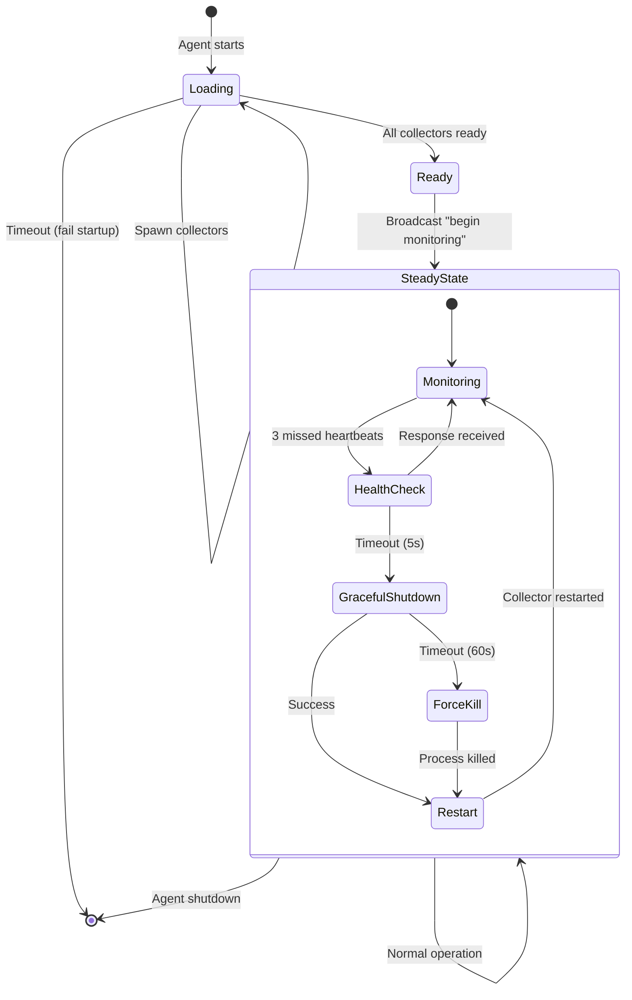

# Implement Agent Loading State and Heartbeat Detection

## Overview

Implement loading state management and heartbeat failure detection in daemoneye-agent. This ticket ensures coordinated startup (broker → collectors → privilege drop → steady state) and robust failure detection with escalating recovery actions.

## Scope

**In Scope:**
- Collector configuration file format (`/etc/daemoneye/agent.yaml`)
- Configuration loading and validation on agent startup
- Loading state machine: Loading → Ready → Steady State
- Collector readiness tracking (wait for all collectors to report "ready")
- Privilege dropping after all collectors ready
- "Begin monitoring" broadcast to `control.collector.lifecycle` topic
- Heartbeat failure detection with escalating actions
- Integration tests for loading state and heartbeat detection

**Out of Scope:**
- procmond-side changes (Tickets 1-3)
- Comprehensive testing across all collectors (Ticket 5)
- Security hardening (Ticket 6)

## Technical Details

### Collector Configuration Format

**Location:** `/etc/daemoneye/agent.yaml`

**Schema:**
```yaml
collectors:
  - id: procmond
    type: process-monitor
    binary_path: /usr/bin/procmond
    enabled: true
    auto_restart: true
    startup_timeout_secs: 60
    config:
      collection_interval_secs: 30
      enhanced_metadata: true
      compute_hashes: false
```

**Configuration Loading:**
- Load on agent startup
- Validate collector binary paths exist and are executable
- Parse collector-specific configuration
- Spawn collectors in order defined in configuration file

### Loading State Machine

**States:**
1. **Loading**: Agent starting, broker initializing, spawning collectors
2. **Ready**: All collectors registered and reported "ready", privileges dropped
3. **Steady State**: Normal operation, collectors monitoring

**Transitions:**
- Loading → Ready: All collectors report "ready" within timeout (60s default)
- Ready → Steady State: Agent broadcasts "begin monitoring" command
- Any → Loading: Agent restart

**Timeout Handling:**
- If collectors don't report "ready" within timeout, fail startup with error
- Log which collectors failed to report ready
- Exit with non-zero status code

### Heartbeat Failure Detection

**Strategy:** Escalating recovery actions

**Detection:**
- Track missed heartbeat count per collector (threshold: 3 consecutive)
- Heartbeat expected every 30 seconds (allow 90 seconds before action)

**Escalating Actions:**
1. **Health Check RPC** (timeout: 5 seconds)
   - Send health check RPC to collector
   - If response received, reset missed heartbeat count
   - If timeout, proceed to action 2

2. **Graceful Shutdown RPC** (timeout: 60 seconds)
   - Send graceful shutdown RPC to collector
   - Wait for completion or timeout
   - If successful, proceed to action 4 (restart)
   - If timeout, proceed to action 3

3. **Force Kill** (via CollectorProcessManager)
   - Kill collector process (SIGKILL on Unix, TerminateProcess on Windows)
   - Log forced termination
   - Proceed to action 4

4. **Automatic Restart** (if auto_restart enabled)
   - Restart collector via CollectorProcessManager
   - Reset missed heartbeat count
   - Log restart event



### Component Changes

**Modified:** `file:daemoneye-agent/src/broker_manager.rs`
- Add loading state management
- Track collector readiness
- Implement privilege dropping after all collectors ready
- Broadcast "begin monitoring" command

**Modified:** `file:daemoneye-agent/src/collector_registry.rs`
- Track heartbeat timestamps per collector
- Detect missed heartbeats (3+ consecutive)
- Implement escalating recovery actions
- Log all recovery actions

**New:** `file:daemoneye-agent/src/config.rs`
- Load collector configuration from YAML file
- Validate configuration
- Provide configuration to BrokerManager

## Dependencies

**Requires:**
- ticket:54226c8a-719a-479a-863b-9c91f43717a9/[Ticket 2] - procmond must wait for "begin monitoring"
- ticket:54226c8a-719a-479a-863b-9c91f43717a9/[Ticket 3] - procmond must publish registration and heartbeat

**Blocks:**
- ticket:54226c8a-719a-479a-863b-9c91f43717a9/[Ticket 5] - Integration tests need complete startup flow

## Acceptance Criteria

### Configuration Loading
- [ ] Agent loads collector configuration from `/etc/daemoneye/agent.yaml`
- [ ] Configuration validation checks binary paths exist and are executable
- [ ] Collector-specific configuration parsed correctly
- [ ] Invalid configuration causes agent startup failure with clear error message

### Loading State Management
- [ ] Agent implements state machine: Loading → Ready → Steady State
- [ ] Agent spawns collectors in order defined in configuration
- [ ] Agent tracks collector readiness (waits for "ready" status from all collectors)
- [ ] Agent drops privileges only after all collectors report "ready"
- [ ] Agent broadcasts "begin monitoring" to `control.collector.lifecycle` when entering steady state
- [ ] Timeout (60s default) causes startup failure if collectors don't report ready
- [ ] Startup failure logs which collectors failed to report ready

### Heartbeat Failure Detection
- [ ] Agent tracks heartbeat timestamps per collector
- [ ] Agent detects 3 consecutive missed heartbeats (90 seconds without heartbeat)
- [ ] Escalating actions implemented:
  - [ ] Action 1: Health check RPC with 5-second timeout
  - [ ] Action 2: Graceful shutdown RPC with 60-second timeout
  - [ ] Action 3: Force kill via CollectorProcessManager
  - [ ] Action 4: Automatic restart (if auto_restart enabled)
- [ ] All recovery actions logged at WARN or ERROR level
- [ ] Missed heartbeat count reset on successful health check or restart

### Integration Tests
- [ ] Test: Agent waits for collector "ready" before dropping privileges
- [ ] Test: Agent broadcasts "begin monitoring" after all collectors ready
- [ ] Test: Agent fails startup if collector doesn't report ready within timeout
- [ ] Test: Agent detects missed heartbeats and takes escalating actions
- [ ] Test: Health check RPC resets missed heartbeat count
- [ ] Test: Graceful shutdown RPC completes successfully
- [ ] Test: Force kill terminates unresponsive collector
- [ ] Test: Automatic restart restores collector after failure

### Documentation
- [ ] Configuration file format documented
- [ ] Loading state machine documented with state diagram
- [ ] Heartbeat failure detection documented with escalating actions
- [ ] Timeout values documented and configurable

## References

- **Epic Brief:** spec:54226c8a-719a-479a-863b-9c91f43717a9/0fc3298b-37df-4722-a761-66a5a0da16b3
- **Core Flows:** spec:54226c8a-719a-479a-863b-9c91f43717a9/f086f464-1e81-42e8-89f5-74a8638360d1 (Flow 2: System Startup, Flow 6: Error Handling)
- **Tech Plan:** spec:54226c8a-719a-479a-863b-9c91f43717a9/f70103e2-e7ef-494f-8638-5a7324565f28 (Phase 2, Agent Enhancements)
- **Broker Manager:** file:daemoneye-agent/src/broker_manager.rs
- **Collector Registry:** file:daemoneye-agent/src/collector_registry.rs