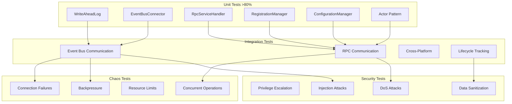

# Implement Comprehensive Test Suite

## Overview

Achieve comprehensive test coverage across all procmond components and integration points. This ticket implements unit tests, integration tests, chaos tests, and security tests to meet the >80% unit coverage and >90% critical path coverage targets.

## Scope

**In Scope:**
- Unit tests for all new components (WAL, EventBusConnector, RpcServiceHandler, RegistrationManager, ConfigurationManager)
- Integration tests for event bus and RPC communication
- Cross-platform tests (Linux, macOS, Windows)
- Chaos tests for resilience validation
- Security tests for privilege and injection attacks
- Performance baseline tests
- Test documentation and coverage reporting

**Out of Scope:**
- Security hardening implementation (Ticket 6)
- FreeBSD-specific tests (Ticket 7)
- Performance optimization (Ticket 8)

## Technical Details

### Unit Tests (>80% Coverage Target)

**WriteAheadLog Tests:**
- Persistence: Events written to disk correctly
- Rotation: Files rotate at 80% capacity
- Replay: Events replayed on startup
- Corruption recovery: Corrupted entries skipped with CRC32 validation
- Deletion: WAL files deleted after successful publish

**EventBusConnector Tests:**
- Connection: Connects to broker via socket path
- WAL integration: Events written to WAL before buffering
- Buffering: Events buffered when connection lost (10MB limit)
- Replay: Buffered events replayed on reconnection
- Dynamic backpressure: Triggered at 70%, released at 50%

**RpcServiceHandler Tests:**
- Request parsing: RPC requests parsed correctly
- Actor message sending: Messages sent to actor via mpsc channel
- Response handling: Responses published with correct status codes
- Concurrent request serialization: Requests processed one at a time
- Channel full errors: Handled gracefully

**RegistrationManager Tests:**
- Registration: Registers with agent on startup
- "Ready" reporting: Reports ready status after registration
- Heartbeat: Publishes heartbeats every 30 seconds
- Deregistration: Deregisters on graceful shutdown

**ConfigurationManager Tests:**
- Loading: Configuration loaded from files and env vars
- Validation: Invalid configuration rejected
- Cycle-boundary hot-reload: Config applied at cycle boundary
- Restart detection: Configs requiring restart identified

**Actor Pattern Tests:**
- Message processing: Messages processed sequentially
- Oneshot responses: Responses sent via oneshot channels
- Channel handling: Bounded channel (capacity: 100) respected

### Integration Tests

**Event Bus Communication:**
- Publish/subscribe: Events published and received correctly
- Reconnection: Connection restored after broker restart
- Buffering: Events buffered and replayed on reconnection
- Topic hierarchy: Events published to correct topics

**RPC Communication:**
- Lifecycle operations: Start, Stop, Restart, HealthCheck, UpdateConfig, GracefulShutdown
- Health checks: Accurate health data returned
- Config updates: Configuration applied at cycle boundary
- Graceful shutdown: Completes within timeout

**Cross-Platform:**
- Linux: Process enumeration works correctly
- macOS: Process enumeration works correctly
- Windows: Process enumeration works correctly
- Platform-specific metadata: Enhanced metadata collected on each platform

**Lifecycle Tracking:**
- Start detection: New processes detected
- Stop detection: Terminated processes detected
- Modification detection: Process changes detected

### Chaos Tests

**Connection Failures:**
- Broker restart: procmond reconnects and replays events
- Network interruption: Events buffered and replayed
- Socket unavailable: procmond retries connection

**Backpressure:**
- Slow consumer: Collection interval increases
- High event volume: Backpressure prevents buffer overflow
- Buffer full: Events written to WAL, no data loss

**Resource Limits:**
- Memory constraints: procmond operates within 100MB limit
- CPU throttling: procmond maintains <5% CPU usage
- Disk space: WAL rotation prevents disk exhaustion

**Concurrent Operations:**
- Multiple RPC requests: Serialized correctly
- Collection during shutdown: Completes gracefully
- Config update during collection: Applied at cycle boundary

### Security Tests

**Privilege Escalation:**
- Attempt to gain unauthorized access: Fails with error
- Privilege dropping: Agent drops privileges after collectors ready

**Injection Attacks:**
- Malicious process names: Sanitized before logging/publishing
- Malicious command lines: Sanitized before logging/publishing
- SQL injection: Not applicable (no SQL in procmond)

**DoS Attacks:**
- Excessive RPC requests: Rate-limited or rejected
- Event flooding: Backpressure prevents resource exhaustion

**Data Sanitization:**
- Secrets not logged: Environment variables with secrets sanitized
- Secrets not published: Command-line args with secrets sanitized

### Test Infrastructure

**Tools:**
- cargo-nextest: Parallel test execution
- insta: Snapshot testing for CLI output
- criterion: Performance baseline tests
- llvm-cov: Coverage reporting

**CI Matrix:**
- Platforms: Linux, macOS, Windows
- Rust: stable, beta, MSRV (1.91+)
- Architectures: x86_64, ARM64

## Dependencies

**Requires:**
- ticket:54226c8a-719a-479a-863b-9c91f43717a9/[Ticket 1] - WAL and EventBusConnector must exist
- ticket:54226c8a-719a-479a-863b-9c91f43717a9/[Ticket 2] - Actor pattern must exist
- ticket:54226c8a-719a-479a-863b-9c91f43717a9/[Ticket 3] - RPC service must exist
- ticket:54226c8a-719a-479a-863b-9c91f43717a9/[Ticket 4] - Agent loading state must exist

**Blocks:**
- ticket:54226c8a-719a-479a-863b-9c91f43717a9/[Ticket 6] - Security hardening needs test baseline
- ticket:54226c8a-719a-479a-863b-9c91f43717a9/[Ticket 7] - FreeBSD support needs test framework
- ticket:54226c8a-719a-479a-863b-9c91f43717a9/[Ticket 8] - Performance validation needs baseline tests

## Acceptance Criteria

### Unit Test Coverage
- [ ] WriteAheadLog: >80% coverage
- [ ] EventBusConnector: >80% coverage
- [ ] RpcServiceHandler: >80% coverage
- [ ] RegistrationManager: >80% coverage
- [ ] ConfigurationManager: >80% coverage
- [ ] Actor Pattern: >80% coverage
- [ ] Overall unit test coverage: >80%

### Critical Path Coverage (>90%)
- [ ] Process enumeration on all platforms: >90% coverage
- [ ] Event bus communication (publish/subscribe/reconnection): >90% coverage
- [ ] Core monitoring loop and lifecycle detection: >90% coverage
- [ ] All error handling and recovery paths: >90% coverage
- [ ] Security boundaries (privilege management, data sanitization): >90% coverage

### Integration Tests
- [ ] Event bus communication tests pass on Linux, macOS, Windows
- [ ] RPC communication tests pass on Linux, macOS, Windows
- [ ] Cross-platform tests pass on Linux, macOS, Windows
- [ ] Lifecycle tracking tests pass on all platforms

### Chaos Tests
- [ ] Connection failure tests validate resilience
- [ ] Backpressure tests validate adaptive behavior
- [ ] Resource limit tests validate constraints
- [ ] Concurrent operation tests validate correctness

### Security Tests
- [ ] Privilege escalation tests pass (no unauthorized access)
- [ ] Injection attack tests pass (sanitization works)
- [ ] DoS attack tests pass (rate limiting/backpressure works)
- [ ] Data sanitization tests pass (secrets not leaked)

### Test Infrastructure
- [ ] cargo-nextest configured for parallel execution
- [ ] insta configured for snapshot testing
- [ ] criterion configured for performance baselines
- [ ] llvm-cov configured for coverage reporting
- [ ] CI matrix configured for Linux, macOS, Windows

### Documentation
- [ ] Test strategy documented
- [ ] Coverage targets documented
- [ ] Test execution instructions documented
- [ ] CI/CD integration documented

## References

- **Epic Brief:** spec:54226c8a-719a-479a-863b-9c91f43717a9/0fc3298b-37df-4722-a761-66a5a0da16b3
- **Tech Plan:** spec:54226c8a-719a-879a-863b-9c91f43717a9/f70103e2-e7ef-494f-8638-5a7324565f28 (Phase 3, Testing Strategy)
- **Testing Standards:** file:.cursor/rules/testing/testing-standards.mdc
- **Existing Tests:** file:procmond/tests/