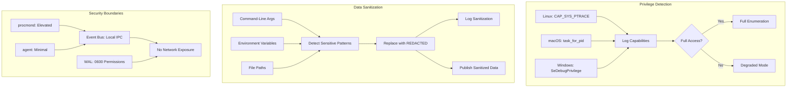

# Implement Security Hardening and Data Sanitization

## Overview

Implement privilege management and data sanitization for procmond. This ticket ensures procmond operates with appropriate privileges, detects privilege requirements at startup, and sanitizes sensitive data before logging or publishing.

## Scope

**In Scope:**

- Privilege detection at startup (capabilities on Linux, tokens on Windows, entitlements on macOS)
- Data sanitization for command-line arguments and environment variables
- Security boundary validation between procmond and agent
- Security test suite (privilege escalation, injection, DoS)
- Security documentation and threat analysis

**Out of Scope:**

- FreeBSD privilege management (Ticket 7)
- Performance optimization (Ticket 8)
- Advanced security features (kernel monitoring, sandboxing)

## Technical Details

### Privilege Detection

**Linux:**

- Detect CAP_SYS_PTRACE capability for full process access
- Detect CAP_DAC_READ_SEARCH for reading /proc
- Log detected capabilities at startup
- Gracefully degrade if capabilities insufficient (basic enumeration only)

**macOS:**

- Detect task_for_pid() entitlements
- Check for root privileges
- Log detected privileges at startup
- Gracefully degrade if privileges insufficient

**Windows:**

- Detect SeDebugPrivilege token
- Check for Administrator privileges
- Log detected privileges at startup
- Gracefully degrade if privileges insufficient

**Implementation:**

```rust
struct PrivilegeStatus {
    platform: Platform,
    has_full_access: bool,
    capabilities: Vec<String>,
    degraded_mode: bool,
}

fn detect_privileges() -> Result<PrivilegeStatus> {
    #[cfg(target_os = "linux")]
    return detect_linux_capabilities();

    #[cfg(target_os = "macos")]
    return detect_macos_privileges();

    #[cfg(target_os = "windows")]
    return detect_windows_privileges();
}
```

### Data Sanitization

**Sensitive Data Patterns:**

- Environment variables: `PASSWORD`, `SECRET`, `TOKEN`, `KEY`, `API_KEY`, `AUTH`
- Command-line arguments: `--password`, `--secret`, `--token`, `--api-key`
- File paths: `/home/*/.ssh/`, `/home/*/.aws/`, `C:\Users\*\.ssh\`

**Sanitization Strategy:**

- Replace sensitive values with `[REDACTED]`
- Log sanitization events at DEBUG level
- Apply sanitization before logging and before publishing to event bus

**Implementation:**

```rust
fn sanitize_command_line(cmd: &str) -> String {
    let sensitive_patterns = [
        "--password",
        "--secret",
        "--token",
        "--api-key",
        "-p",
        "-s",
        "-t",
        "-k",
    ];

    // Replace sensitive argument values with [REDACTED]
    // Example: "--password secret123" -> "--password [REDACTED]"
}

fn sanitize_env_vars(env: &HashMap<String, String>) -> HashMap<String, String> {
    let sensitive_keys = ["PASSWORD", "SECRET", "TOKEN", "KEY", "API_KEY", "AUTH"];

    // Replace sensitive values with [REDACTED]
    // Example: {"API_KEY": "abc123"} -> {"API_KEY": "[REDACTED]"}
}
```

### Security Boundaries

**Validation:**

- procmond runs with elevated privileges (full process access)
- daemoneye-agent runs with minimal privileges (dropped after spawning collectors)
- Event bus communication uses Unix domain sockets (Linux/macOS) or named pipes (Windows)
- No network communication from procmond (only local IPC)
- WAL files protected with appropriate permissions (0600)

**Threat Model:**

- **Threat 1**: Attacker gains access to procmond process → Limited impact (no network, read-only process data)
- **Threat 2**: Attacker gains access to agent process → Cannot access privileged process data (privilege separation)
- **Threat 3**: Attacker intercepts event bus communication → Mitigated by local IPC (no network exposure)
- **Threat 4**: Attacker reads WAL files → Mitigated by file permissions (0600)

### Security Test Suite

**Privilege Escalation Tests:**

- Attempt to gain unauthorized access to processes
- Verify privilege detection works correctly
- Verify graceful degradation when privileges insufficient

**Injection Attack Tests:**

- Malicious process names with special characters
- Malicious command lines with SQL injection attempts
- Malicious environment variables with code injection attempts

**DoS Attack Tests:**

- Excessive RPC requests (rate limiting)
- Event flooding (backpressure)
- Resource exhaustion (memory/CPU limits)

**Data Sanitization Tests:**

- Verify sensitive data sanitized in logs
- Verify sensitive data sanitized in published events
- Verify sanitization patterns cover common secrets



## Dependencies

**Requires:**

- ticket:54226c8a-719a-479a-863b-9c91f43717a9/[Ticket 5] - Test framework must exist

**Blocks:**

- ticket:54226c8a-719a-479a-863b-9c91f43717a9/[Ticket 8] - Performance validation needs security baseline

## Acceptance Criteria

### Privilege Detection

- [ ] Linux: CAP_SYS_PTRACE and CAP_DAC_READ_SEARCH detected correctly
- [ ] macOS: task_for_pid() entitlements and root privileges detected correctly
- [ ] Windows: SeDebugPrivilege and Administrator privileges detected correctly
- [ ] Detected privileges logged at startup (INFO level)
- [ ] Graceful degradation when privileges insufficient (basic enumeration only)
- [ ] Degraded mode logged at WARN level

### Data Sanitization

- [ ] Command-line arguments sanitized before logging
- [ ] Command-line arguments sanitized before publishing to event bus
- [ ] Environment variables sanitized before logging
- [ ] Environment variables sanitized before publishing to event bus
- [ ] Sensitive patterns detected: PASSWORD, SECRET, TOKEN, KEY, API_KEY, AUTH
- [ ] Sanitization events logged at DEBUG level
- [ ] Sanitized values replaced with `[REDACTED]`

### Security Boundaries

- [ ] procmond runs with elevated privileges (full process access)
- [ ] daemoneye-agent runs with minimal privileges (dropped after spawning)
- [ ] Event bus communication uses local IPC (no network)
- [ ] WAL files protected with 0600 permissions
- [ ] No network communication from procmond

### Security Test Suite

- [ ] Privilege escalation tests pass (no unauthorized access)
- [ ] Injection attack tests pass (malicious data sanitized)
- [ ] DoS attack tests pass (rate limiting/backpressure works)
- [ ] Data sanitization tests pass (secrets not leaked in logs or events)

### Documentation

- [ ] Privilege detection documented for all platforms
- [ ] Data sanitization patterns documented
- [ ] Security boundaries documented with threat model
- [ ] Security test suite documented
- [ ] Threat analysis documented

## References

- **Epic Brief:** spec:54226c8a-719a-479a-863b-9c91f43717a9/0fc3298b-37df-4722-a761-66a5a0da16b3
- **Tech Plan:** spec:54226c8a-719a-479a-863b-9c91f43717a9/f70103e2-e7ef-494f-8638-5a7324565f28 (Phase 4, Security Hardening)
- **Security Standards:** file:.cursor/rules/security/security-standards.mdc
- **Security Design:** file:docs/src/technical/security_design_overview.md
