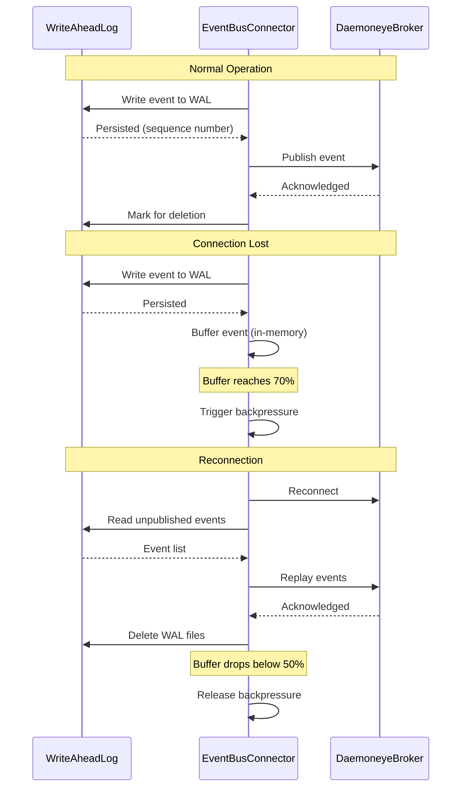

# Implement Write-Ahead Log and Event Bus Connector

## Overview

Implement durable event persistence and broker connectivity for procmond. This ticket establishes the foundation for reliable event delivery with crash recovery by creating the Write-Ahead Log (WAL) component and EventBusConnector that integrates with daemoneye-eventbus.

## Scope

**In Scope:**

- WriteAheadLog component with bincode serialization
- Sequence-numbered WAL files with rotation at 80% capacity
- CRC32 corruption detection and recovery
- EventBusConnector with WAL integration
- Event buffering (10MB limit) with replay capability
- Connection to broker via `DAEMONEYE_BROKER_SOCKET` environment variable
- Dynamic backpressure monitoring (70% threshold)
- Unit tests for WAL and EventBusConnector

**Out of Scope:**

- Actor pattern implementation (Ticket 2)
- RPC service handling (Ticket 3)
- Agent-side changes (Ticket 4)
- Integration testing (Ticket 5)

## Technical Details

### WriteAheadLog Component

**Location:** `file:procmond/src/wal.rs`

**Key Responsibilities:**

- Persist events to disk before buffering (durability guarantee)
- Use sequence-numbered files: `procmond-{sequence:05}.wal`
- Rotate when file reaches 80MB (80% of 100MB max)
- Replay events on startup for crash recovery
- Delete WAL files after successful publish
- Handle corruption with CRC32 validation

**File Format:**

```rust
// Bincode-serialized records with CRC32 checksums
struct WalEntry {
    sequence: u64,
    timestamp: DateTime<Utc>,
    event: ProcessEvent,
    crc32: u32,
}
```

### EventBusConnector Component

**Location:** `file:procmond/src/event_bus_connector.rs`

**Key Responsibilities:**

- Connect to daemoneye-agent's embedded broker
- Integrate with WriteAheadLog for event persistence
- Buffer events (10MB limit) when connection lost
- Replay buffered events from WAL on reconnection
- Publish to topic hierarchy: `events.process.*`
- Monitor buffer level for backpressure (70% threshold)
- Provide shared channel reference for backpressure signaling

**Backpressure Strategy:**

- Trigger at 70% buffer capacity
- Release at 50% buffer capacity
- Signal via shared mpsc channel (to be used by Ticket 2)



## Dependencies

**Requires:**

- daemoneye-eventbus client library
- Existing ProcessEvent data model from `file:daemoneye-lib/src/models/process.rs`

**Blocks:**

- ticket:54226c8a-719a-479a-863b-9c91f43717a9/[Ticket 2] - Actor pattern needs EventBusConnector
- ticket:54226c8a-719a-479a-863b-9c91f43717a9/[Ticket 3] - RPC service needs event bus connectivity

## Acceptance Criteria

### WriteAheadLog

- [ ] Events persisted to disk using bincode serialization
- [ ] Sequence-numbered files created: `procmond-00001.wal`, `procmond-00002.wal`, etc.
- [ ] File rotation occurs at 80MB (80% of 100MB max)
- [ ] WAL replay works correctly on startup (all unpublished events recovered)
- [ ] Corrupted entries detected via CRC32 and skipped with warning log
- [ ] WAL files deleted after all events successfully published
- [ ] Unit tests cover: persistence, rotation, replay, corruption recovery

### EventBusConnector

- [ ] Connects to broker using `DAEMONEYE_BROKER_SOCKET` environment variable
- [ ] Events written to WAL before buffering
- [ ] Events buffered (10MB limit) when connection lost
- [ ] Buffered events replayed on reconnection
- [ ] Events published to correct topics: `events.process.start`, `events.process.stop`, `events.process.modify`
- [ ] Backpressure triggered at 70% buffer capacity
- [ ] Backpressure released at 50% buffer capacity
- [ ] Shared channel reference provided for backpressure signaling
- [ ] Unit tests cover: connection, WAL integration, buffering, replay, backpressure

### Integration

- [ ] EventBusConnector successfully integrates with WriteAheadLog
- [ ] Events survive procmond crash and are replayed on restart
- [ ] No data loss during connection failures
- [ ] Backpressure mechanism ready for actor integration (Ticket 2)

## References

- **Epic Brief:** spec:54226c8a-719a-479a-863b-9c91f43717a9/0fc3298b-37df-4722-a761-66a5a0da16b3
- **Tech Plan:** spec:54226c8a-719a-479a-863b-9c91f43717a9/f70103e2-e7ef-494f-8638-5a7324565f28 (Phase 1, Component Architecture)
- **Event Bus Architecture:** file:docs/embedded-broker-architecture.md
- **Topic Hierarchy:** file:daemoneye-eventbus/docs/topic-hierarchy.md
- **Process Models:** file:daemoneye-lib/src/models/process.rs
