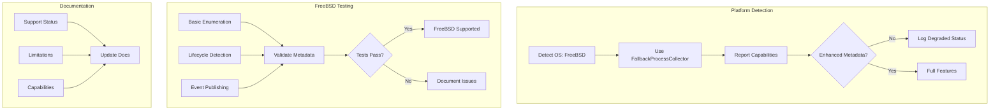

# Validate FreeBSD Platform Support

## Overview

Validate basic process enumeration on FreeBSD and document platform limitations. This ticket ensures procmond works on FreeBSD 13+ with basic metadata collection using the FallbackProcessCollector.

## Scope

**In Scope:**

- Test FallbackProcessCollector on FreeBSD 13+
- Document FreeBSD limitations (basic metadata only, no enhanced features)
- Add platform detection and capability reporting
- Create FreeBSD-specific tests
- Update documentation with FreeBSD support status

**Out of Scope:**

- Enhanced metadata collection for FreeBSD (deferred to future work)
- FreeBSD-specific privilege management (basic only)
- Performance optimization for FreeBSD

## Technical Details

### FreeBSD Support Status

**Current State:**

- FallbackProcessCollector uses sysinfo crate for basic enumeration
- Basic metadata: PID, PPID, name, executable path, CPU usage, memory usage
- No enhanced metadata: network connections, file descriptors, security contexts

**Limitations:**

- No platform-specific collector (unlike Linux, macOS, Windows)
- Limited metadata compared to primary platforms
- Performance may be lower than platform-specific collectors

**Acceptance:**

- FreeBSD support is "best-effort" with documented limitations
- Basic enumeration is sufficient for FreeBSD use cases
- Enhanced features deferred to future work

### Platform Detection

**Implementation:**

```rust
#[cfg(target_os = "freebsd")]
fn detect_platform_capabilities() -> PlatformCapabilities {
    PlatformCapabilities {
        platform: Platform::FreeBSD,
        collector_type: CollectorType::Fallback,
        enhanced_metadata: false,
        network_connections: false,
        file_descriptors: false,
        security_contexts: false,
    }
}
```

**Capability Reporting:**

- Report platform capabilities at startup
- Log degraded status for FreeBSD (INFO level)
- Include capabilities in registration message to agent

### FreeBSD-Specific Tests

**Test Coverage:**

- Basic process enumeration works
- PID, PPID, name, executable path collected correctly
- CPU usage and memory usage collected correctly
- Process lifecycle detection works (start/stop/modify)
- Event publishing works correctly
- No crashes or panics on FreeBSD

**Test Environment:**

- FreeBSD 13.0+ (latest stable)
- x86_64 and ARM64 architectures
- CI/CD integration (if FreeBSD runner available)



## Dependencies

**Requires:**

- ticket:54226c8a-719a-479a-863b-9c91f43717a9/[Ticket 5] - Test framework must exist

**Blocks:**

- ticket:54226c8a-719a-479a-863b-9c91f43717a9/[Ticket 8] - Performance validation includes FreeBSD

## Acceptance Criteria

### Platform Detection

- [ ] FreeBSD detected correctly at runtime
- [ ] FallbackProcessCollector used on FreeBSD
- [ ] Platform capabilities reported at startup
- [ ] Degraded status logged for FreeBSD (INFO level)
- [ ] Capabilities included in registration message

### Basic Enumeration

- [ ] Process enumeration works on FreeBSD 13+
- [ ] PID collected correctly
- [ ] PPID collected correctly
- [ ] Process name collected correctly
- [ ] Executable path collected correctly
- [ ] CPU usage collected correctly
- [ ] Memory usage collected correctly

### Lifecycle Detection

- [ ] Process start events detected
- [ ] Process stop events detected
- [ ] Process modification events detected
- [ ] Events published to event bus correctly

### FreeBSD-Specific Tests

- [ ] Basic enumeration tests pass on FreeBSD
- [ ] Lifecycle detection tests pass on FreeBSD
- [ ] Event publishing tests pass on FreeBSD
- [ ] No crashes or panics on FreeBSD
- [ ] Tests run on x86_64 and ARM64 (if available)

### Documentation

- [ ] FreeBSD support status documented (best-effort, basic metadata only)
- [ ] Limitations documented clearly:
  - No enhanced metadata
  - No network connections
  - No file descriptors
  - No security contexts
- [ ] Platform capabilities documented
- [ ] Future work documented (enhanced FreeBSD support)

### CI/CD Integration

- [ ] FreeBSD tests added to CI/CD pipeline (if runner available)
- [ ] FreeBSD tests run on pull requests
- [ ] FreeBSD test failures reported clearly

## References

- **Epic Brief:** spec:54226c8a-719a-479a-863b-9c91f43717a9/0fc3298b-37df-4722-a761-66a5a0da16b3
- **Core Flows:** spec:54226c8a-719a-479a-863b-9c91f43717a9/f086f464-1e81-42e8-89f5-74a8638360d1 (Flow 10: Cross-Platform Behavior)
- **Tech Plan:** spec:54226c8a-719a-479a-863b-9c91f43717a9/f70103e2-e7ef-494f-8638-5a7324565f28 (Phase 5, FreeBSD Support)
- **Process Collector:** file:procmond/src/process_collector.rs
- **Existing Tests:** file:procmond/tests/os_compatibility_tests.rs
