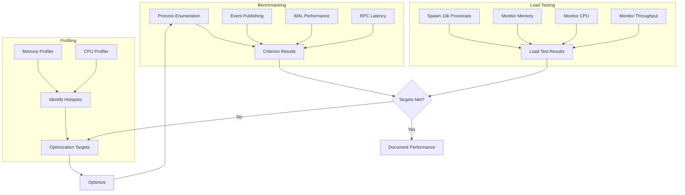

# Validate Performance and Optimize

## Overview

Validate procmond performance against targets and optimize if needed. This ticket ensures procmond meets performance requirements: enumerate 1,000 processes in \<100ms, support 10,000+ processes, use \<100MB memory, and maintain \<5% CPU usage.

## Scope

**In Scope:**

- Benchmark process enumeration (1,000 processes target: \<100ms)
- Load testing with 10,000+ processes
- Memory profiling (target: \<100MB sustained)
- CPU monitoring (target: \<5% sustained)
- Regression testing to prevent degradation
- Performance optimization if targets not met
- Performance documentation

**Out of Scope:**

- Advanced performance features (kernel monitoring, eBPF)
- Performance tuning for specific workloads
- Distributed performance testing

## Technical Details

### Performance Targets

| Metric                  | Target                          | Measurement Method                |
| ----------------------- | ------------------------------- | --------------------------------- |
| Process Enumeration     | \<100ms for 1,000 processes     | Criterion benchmark               |
| Large-Scale Support     | 10,000+ processes without issue | Load testing with synthetic procs |
| Memory Usage            | \<100MB sustained               | Memory profiler (heaptrack, etc.) |
| CPU Usage               | \<5% sustained                  | System monitoring (top, htop)     |
| Event Publishing        | >1,000 events/sec               | Throughput benchmark              |
| WAL Write Performance   | >500 writes/sec                 | WAL-specific benchmark            |
| Backpressure Activation | \<1s to adjust interval         | Chaos test measurement            |

### Benchmarking Strategy

**Criterion Benchmarks:**

- Process enumeration on all platforms (Linux, macOS, Windows, FreeBSD)
- Event publishing throughput
- WAL write performance
- Configuration hot-reload latency
- RPC request/response latency

**Load Testing:**

- Spawn 10,000+ synthetic processes
- Monitor procmond behavior under load
- Validate no degradation or crashes
- Measure memory and CPU usage

**Memory Profiling:**

- Use heaptrack (Linux), Instruments (macOS), or similar tools
- Identify memory leaks or excessive allocations
- Validate \<100MB sustained usage
- Profile WAL and event buffer memory usage

**CPU Monitoring:**

- Monitor CPU usage during continuous operation
- Validate \<5% sustained usage
- Identify CPU hotspots with profiler
- Optimize hot paths if needed

### Optimization Strategies

**If Targets Not Met:**

1. **Process Enumeration Optimization:**

   - Reduce syscall overhead
   - Batch process queries
   - Cache frequently accessed data
   - Use platform-specific optimizations

2. **Memory Optimization:**

   - Reduce event buffer size if excessive
   - Optimize WAL file rotation
   - Use more efficient data structures
   - Profile and eliminate memory leaks

3. **CPU Optimization:**

   - Reduce collection frequency if needed
   - Optimize hot paths (profiler-guided)
   - Use more efficient algorithms
   - Reduce logging overhead

4. **Event Publishing Optimization:**

   - Batch event publishing
   - Optimize serialization (bincode)
   - Reduce event size if possible
   - Optimize topic matching

### Regression Testing

**Strategy:**

- Establish performance baselines with criterion
- Run benchmarks on every pull request
- Fail CI if performance regresses >10%
- Document acceptable performance ranges

**Baseline Storage:**

- Store criterion baselines in repository
- Update baselines when intentional changes made
- Track performance trends over time

## Dependencies

**Requires:**

- ticket:54226c8a-719a-479a-863b-9c91f43717a9/[Ticket 6] - Security hardening must be complete
- ticket:54226c8a-719a-479a-863b-9c91f43717a9/[Ticket 7] - FreeBSD support must be validated

**Blocks:**

- None (final ticket in Epic)

## Acceptance Criteria

### Process Enumeration Performance

- [ ] Enumerate 1,000 processes in \<100ms (average) on Linux
- [ ] Enumerate 1,000 processes in \<100ms (average) on macOS
- [ ] Enumerate 1,000 processes in \<100ms (average) on Windows
- [ ] Enumerate 1,000 processes in \<200ms (average) on FreeBSD (degraded acceptable)

### Large-Scale Support

- [ ] Support 10,000+ processes without crashes
- [ ] Support 10,000+ processes without memory leaks
- [ ] Support 10,000+ processes without performance degradation
- [ ] Load testing validates stability under high process count

### Memory Usage

- [ ] Memory usage \<100MB during normal operation (1,000 processes)
- [ ] Memory usage \<200MB during high load (10,000 processes)
- [ ] No memory leaks detected by profiler
- [ ] WAL and event buffer memory usage within limits

### CPU Usage

- [ ] CPU usage \<5% during continuous monitoring (1,000 processes)
- [ ] CPU usage \<10% during high load (10,000 processes)
- [ ] No CPU hotspots identified by profiler
- [ ] Collection interval adjustment reduces CPU usage under backpressure

### Event Publishing Performance

- [ ] Publish >1,000 events/sec to event bus
- [ ] WAL write performance >500 writes/sec
- [ ] Backpressure activation \<1s to adjust interval
- [ ] Event publishing throughput validated by benchmark

### Regression Testing

- [ ] Criterion baselines established for all benchmarks
- [ ] Benchmarks run on every pull request
- [ ] CI fails if performance regresses >10%
- [ ] Performance trends tracked over time

### Documentation

- [ ] Performance targets documented
- [ ] Benchmarking methodology documented
- [ ] Optimization strategies documented
- [ ] Performance baselines documented
- [ ] Regression testing documented

## References

- **Epic Brief:** spec:54226c8a-719a-479a-863b-9c91f43717a9/0fc3298b-37df-4722-a761-66a5a0da16b3
- **Tech Plan:** spec:54226c8a-719a-479a-863b-9c91f43717a9/f70103e2-e7ef-494f-8638-5a7324565f28 (Phase 6, Performance Validation)
- **Performance Standards:** file:.cursor/rules/rust/performance-optimization.mdc
- **Existing Benchmarks:** file:procmond/benches/process_collector_benchmarks.rs
